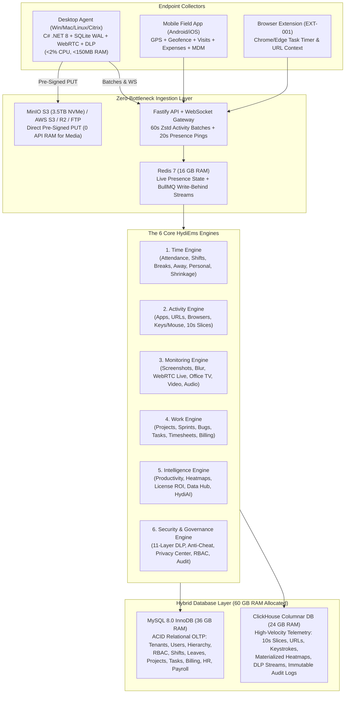

# HydiEms — Master 30-Phase Engineering & Screen-by-Screen Implementation Blueprint

## 1. Executive Summary & Product Positioning

**HydiEms** is an enterprise multi-tenant SaaS **Workforce Intelligence, Productivity, Work Management, Employee Monitoring, DLP Security, Field Operations, HR, and AI Operations Platform**.

Rather than building 200+ disconnected pages, HydiEms is architected around **6 Core Engines** running on a **Hybrid Database & High-Throughput Ingestion Stack** tailored for your **Ubuntu Server (128 GB RAM, 12-Core / 24-Thread AMD Ryzen 9, 3.5 TB NVMe SSD)**:

---

## 2. Locked Production Tech Stack & Server Resource Allocation

| Layer | Technology | Ubuntu Server RAM Budget (128 GB Total) | Purpose |
| :--- | :--- | :--- | :--- |
| **Desktop Agent & Watchdog** | **C# / `.NET 8`** (`Win32`/`DXGI`/`WASAPI` on Windows; `ScreenCaptureKit`/`AXUIElement` on macOS; `PipeWire`/`X11` on Linux) + **SQLCipher SQLite WAL** + **Native WebRTC / `libwebp`** | Client Endpoint (`<2% CPU`, `<150 MB RAM` enforced via OS Job Objects) | Captures 10s activity slices, multi-monitor screenshots, 30-FPS WebRTC live streams, scheduled/on-demand screen & audio recordings, anti-cheat signals, and 11-layer DLP controls. |
| **Frontend Web Application** | **Next.js 15 (App Router, TypeScript)** + Tailwind CSS + `shadcn/ui` + TanStack Table & Query + Apache ECharts + WebRTC Viewer | **6 GB RAM** (PM2 Cluster) | Renders all 33 modules (`G-001` through `ARCHIVE-004`), Super Admin Portal, Company Admin/Manager Portal, and Employee Self-Service Portal. |
| **Backend API & Workers** | **Fastify (TypeScript)** + `@fastify/websocket` + **BullMQ Workers** + **Zod** + **OpenAPI/Swagger** + **TLS/SSL Pin Checker** | **14 GB RAM** (12 API Workers + 8 BullMQ Workers) | Sub-2ms batch ingestion, WebRTC signaling, pre-signed URL generation, automation rules evaluation, and scheduled reports. |
| **Relational OLTP Database** | **MySQL 8.0 (InnoDB)** | **36 GB RAM** (`innodb_buffer_pool_size = 36G`) | Multi-tenant organizations, hierarchy trees, RBAC, employees, shifts, daily attendance rollups, leaves, projects, sprints, bugs, tasks, timesheets, invoices, HR, and payroll. |
| **Time-Series & Analytics DB** | **ClickHouse** (`ReplacingMergeTree` & `AggregatingMergeTree`) | **24 GB RAM** | Stores billions of 10-second activity slices, app/website logs, keystroke/mouse intensity, DLP events, audit trails, and real-time materialized 24x7/lifetime heatmaps. |
| **In-Memory State & Queue** | **Redis 7** | **16 GB RAM** | Real-time 20s agent presence (`ONLINE`/`IDLE`/`BREAK`/`OFFLINE`), WebSocket pub/sub routing, BullMQ job streams, and API rate-limiting. |
| **Object & Media Storage** | **MinIO S3** (on local **3.5 TB NVMe SSD**) + Multi-Tenant S3 / Cloudflare R2 / FTP-FTPS-SFTP Adapter | **12 GB RAM** (+ **20 GB** Linux OS Page Cache) | Stores `.webp` screenshots, `.webm` screen recordings, `.opus` audio recordings, and exported report archives via direct pre-signed PUT uploads. |

---

## 3. Complete 30-Phase Engineering Roadmap & Documentation Directory

Every phase below has its own detailed engineering specification inside [`docs/phases/`](file:///c:/Users/suppo/Downloads/hydiEMS/docs/phases/) containing exact database schemas, API routes, state machines, UI component trees, validation rules, RBAC permissions, audit events, and acceptance criteria:

| Phase | Document File | Release | Modules & Screen IDs Covered | Core Engine |
| :--- | :--- | :--- | :--- | :--- |
| **Phase 01** | [`PHASE_01_INFRASTRUCTURE_AND_HYBRID_DB.md`](file:///c:/Users/suppo/Downloads/hydiEMS/docs/phases/PHASE_01_INFRASTRUCTURE_AND_HYBRID_DB.md) | Release 1 | Monorepo, Docker/PM2, MySQL 8 + ClickHouse + Redis + MinIO S3 Setup, `SYS-001..003` (System, Agent & Sync Health) | Foundation |
| **Phase 02** | [`PHASE_02_GLOBAL_SHELL_DRAWER_SEARCH_AND_NOTIFICATIONS.md`](file:///c:/Users/suppo/Downloads/hydiEMS/docs/phases/PHASE_02_GLOBAL_SHELL_DRAWER_SEARCH_AND_NOTIFICATIONS.md) | Release 1 | `G-001` (App Shell & Global Filters), `AR` (Right-Side Detail Drawer), `SEARCH-001..002`, `NOTIF-001..002`, `HELP-001..004`, `SUPPORT-001..006` | Global Shell |
| **Phase 03** | [`PHASE_03_AUTHENTICATION_SSO_MFA_AND_ONBOARDING_WIZARD.md`](file:///c:/Users/suppo/Downloads/hydiEMS/docs/phases/PHASE_03_AUTHENTICATION_SSO_MFA_AND_ONBOARDING_WIZARD.md) | Release 1 | `AUTH-001..005` (Login, MFA, Reset, 9-Step Setup Wizard), `SEC-008..010` (IP/Login Restrictions & Session Revocation) | Security Engine |
| **Phase 04** | [`PHASE_04_SAAS_SUPER_ADMIN_ENTITLEMENTS_AND_BILLING.md`](file:///c:/Users/suppo/Downloads/hydiEMS/docs/phases/PHASE_04_SAAS_SUPER_ADMIN_ENTITLEMENTS_AND_BILLING.md) | Release 1 | `SUPER-001..007`, `ENTITLE-001` (Dynamic Plan & 18 Add-On Entitlements), `BILLING-001..005`, Tenant Storage & SSL Checker | SaaS Core |
| **Phase 05** | [`PHASE_05_ORGANIZATION_HIERARCHY_AND_MULTI_TENANT_SUBSIDIARIES.md`](file:///c:/Users/suppo/Downloads/hydiEMS/docs/phases/PHASE_05_ORGANIZATION_HIERARCHY_AND_MULTI_TENANT_SUBSIDIARIES.md) | Release 1 | `ORG-001..010` (Org Profile, Depts, Teams, Locations, Drag-and-Drop Hierarchy, Org Chart, Reporting Tree), `ENT-001..005` | People / Org |
| **Phase 06** | [`PHASE_06_RBAC_PERMISSION_MATRIX_AND_ADMIN_CONFIG_ENGINE.md`](file:///c:/Users/suppo/Downloads/hydiEMS/docs/phases/PHASE_06_RBAC_PERMISSION_MATRIX_AND_ADMIN_CONFIG_ENGINE.md) | Release 1 | `ADMIN-001..008`, `PERM-001..002` (Granular Feature & Sensitive Permission Matrix), `CONFIG-001..004`, `SET-001..008`, `BRAND-001..002` | Security Engine |
| **Phase 07** | [`PHASE_07_WORKFORCE_HYBRID_WORK_DEVICES_AND_BULK_IMPORT.md`](file:///c:/Users/suppo/Downloads/hydiEMS/docs/phases/PHASE_07_WORKFORCE_HYBRID_WORK_DEVICES_AND_BULK_IMPORT.md) | Release 1 | `WF-001..006` (Directory, 16-Tab Profile, Timeline), `HYB-001..004` (WFO/WFH/Hybrid), `DEVICE-001..002`, `BULK-001`, `IMPORT-001..002`, `ARCHIVE-001..004` | People / Org |
| **Phase 08** | [`PHASE_08_DESKTOP_AGENT_CORE_OS_HOOKS_AND_SQLITE_SPOOL.md`](file:///c:/Users/suppo/Downloads/hydiEMS/docs/phases/PHASE_08_DESKTOP_AGENT_CORE_OS_HOOKS_AND_SQLITE_SPOOL.md) | Release 1 | Cross-Platform OS Hooks (Win32/DXGI/WASAPI, macOS `ScreenCaptureKit`/`AXUIElement`, Linux), `<2% CPU`/`<150MB RAM` Job Objects, `agent_spool.db`, Watchdog | Agent Core |
| **Phase 09** | [`PHASE_09_DESKTOP_AGENT_UI_MODES_AND_FLEET_DEPLOYMENT.md`](file:///c:/Users/suppo/Downloads/hydiEMS/docs/phases/PHASE_09_DESKTOP_AGENT_UI_MODES_AND_FLEET_DEPLOYMENT.md) | Release 1 | `AGENT-001..005` (Employee UI: Home, Time, Hours, More, Interactive/Silent Modes), `DA-1..16`, `AGENT-001..006` (Admin Fleet), `DEPLOY-001..003` | Agent UI & Fleet |
| **Phase 10** | [`PHASE_10_TIME_ENGINE_AWAY_MANAGEMENT_AND_PERSONAL_MODE.md`](file:///c:/Users/suppo/Downloads/hydiEMS/docs/phases/PHASE_10_TIME_ENGINE_AWAY_MANAGEMENT_AND_PERSONAL_MODE.md) | Release 1 | `TIME-001..009` (8-State Time Classification, Live Tracker, Away Dashboard, Away Reasons, Idle Split, Personal Mode) | Time Engine |
| **Phase 11** | [`PHASE_11_SHIFTS_ATTENDANCE_ENGINE_SHRINKAGE_AND_EXCEPTIONS.md`](file:///c:/Users/suppo/Downloads/hydiEMS/docs/phases/PHASE_11_SHIFTS_ATTENDANCE_ENGINE_SHRINKAGE_AND_EXCEPTIONS.md) | Release 1 | `SHIFT-001..005`, `ATT-001..012` (Daily/Weekly/Monthly Attendance, Corrections, Exceptions, Late, Shrinkage, Overtime, Break Split) | Time Engine |
| **Phase 12** | [`PHASE_12_ACTIVITY_ENGINE_APPS_URLS_AND_KEYSTROKE_INTENSITY.md`](file:///c:/Users/suppo/Downloads/hydiEMS/docs/phases/PHASE_12_ACTIVITY_ENGINE_APPS_URLS_AND_KEYSTROKE_INTENSITY.md) | Release 1 | `ACT-001..007` (App/Website/Browser Usage, Category Donut, Key/Mouse Intensity, Minute Timeline, Keylogger Add-On) | Activity Engine |
| **Phase 13** | [`PHASE_13_PRODUCTIVITY_ENGINE_RULES_AND_WORK_LIFE_BALANCE.md`](file:///c:/Users/suppo/Downloads/hydiEMS/docs/phases/PHASE_13_PRODUCTIVITY_ENGINE_RULES_AND_WORK_LIFE_BALANCE.md) | Release 1 | `PROD-001..011` (Productivity Dashboards, Dept/Team Comparisons, Rules, Level-2 Regex, Expected vs Actual, Daily Efficiency, Work-Life Balance) | Intelligence Engine |
| **Phase 14** | [`PHASE_14_SOFTWARE_GOVERNANCE_AND_LICENSE_OPTIMIZATION.md`](file:///c:/Users/suppo/Downloads/hydiEMS/docs/phases/PHASE_14_SOFTWARE_GOVERNANCE_AND_LICENSE_OPTIMIZATION.md) | Release 4 | `APP-001..004` (App Inventory, Approval Status, Policy & Risk), `LIC-001..005` (License Count, Waste Calculation, Software ROI, Shadow IT) | Intelligence Engine |
| **Phase 15** | [`PHASE_15_SCREENSHOT_ENGINE_PRIVACY_BLUR_AND_AUDITED_ACTIONS.md`](file:///c:/Users/suppo/Downloads/hydiEMS/docs/phases/PHASE_15_SCREENSHOT_ENGINE_PRIVACY_BLUR_AND_AUDITED_ACTIONS.md) | Release 2 | `SS-001..009` (Screenshot Grid, Detail, Timeline, Policy, Manual Capture Now, Privacy Blur, Retention, Audited Actions), `MON-007` (Multi-Monitor) | Monitoring Engine |
| **Phase 16** | [`PHASE_16_LIVE_MONITOR_WEBRTC_STREAMING_AND_OFFICE_TV.md`](file:///c:/Users/suppo/Downloads/hydiEMS/docs/phases/PHASE_16_LIVE_MONITOR_WEBRTC_STREAMING_AND_OFFICE_TV.md) | Release 2 | `MON-001..006` (Live Monitor Grid, Employee Live Screen, 30-FPS WebRTC Live Stream + 2-FPS WebP Fallback, Search, Office TV Wallboard, Favorites) | Monitoring Engine |
| **Phase 17** | [`PHASE_17_SCREEN_RECORDING_CLIPS_MARKERS_AND_AUDIO_TRACKING.md`](file:///c:/Users/suppo/Downloads/hydiEMS/docs/phases/PHASE_17_SCREEN_RECORDING_CLIPS_MARKERS_AND_AUDIO_TRACKING.md) | Release 2 | `REC-001..008` (Recording Library, Player, Policy, 2m Clips, On-Demand, Search, Event Markers), `AUDIO-001..005` (Mic/System Audio, Consent & Review) | Monitoring Engine |
| **Phase 18** | [`PHASE_18_EXECUTIVE_MANAGER_DASHBOARDS_AND_WIDGET_BUILDER.md`](file:///c:/Users/suppo/Downloads/hydiEMS/docs/phases/PHASE_18_EXECUTIVE_MANAGER_DASHBOARDS_AND_WIDGET_BUILDER.md) | Release 1 & 4 | `DASH-001` (CEO Dashboard + AI Summary), `DASH-002` (Manager Dashboard), `DASH-003` (Employee Dashboard), `DB-001` (Custom Drag-and-Drop Dashboard Builder) | Intelligence Engine |
| **Phase 19** | [`PHASE_19_PROJECTS_SPRINTS_BUG_TRACKING_AND_CUSTOM_TRACKERS.md`](file:///c:/Users/suppo/Downloads/hydiEMS/docs/phases/PHASE_19_PROJECTS_SPRINTS_BUG_TRACKING_AND_CUSTOM_TRACKERS.md) | Release 3 | `PROJ-001..015` (Projects, Team, Gantt, Budget, Goals, Milestones, Sprints, Bug Tracking, Calendar, Resource Allocation, Dependencies), `CUSTOM-001` | Work Engine |
| **Phase 20** | [`PHASE_20_TASKS_KANBAN_DEPENDENCIES_AND_BROWSER_EXTENSION.md`](file:///c:/Users/suppo/Downloads/hydiEMS/docs/phases/PHASE_20_TASKS_KANBAN_DEPENDENCIES_AND_BROWSER_EXTENSION.md) | Release 3 | `TASK-001..015` (List/Kanban/Calendar/Timeline, Detail, My Tasks, Watchers, History, Dependencies, Templates, Bulk Import, Burndown), `EXT-001` | Work Engine |
| **Phase 21** | [`PHASE_21_TIMESHEETS_PAY_RATES_LOCK_WORKFLOW_AND_CLIENT_BILLING.md`](file:///c:/Users/suppo/Downloads/hydiEMS/docs/phases/PHASE_21_TIMESHEETS_PAY_RATES_LOCK_WORKFLOW_AND_CLIENT_BILLING.md) | Release 3 | `TS-001..011` (Employee/Manager Timesheets, Approvals, Billable, Pay Periods/Types/Rates, Lock State Machine, History), `BILL-001..005` (Clients & Invoices) | Work Engine |
| **Phase 22** | [`PHASE_22_WORKFORCE_ANALYTICS_UTILIZATION_HEATMAPS_AND_PATTERNS.md`](file:///c:/Users/suppo/Downloads/hydiEMS/docs/phases/PHASE_22_WORKFORCE_ANALYTICS_UTILIZATION_HEATMAPS_AND_PATTERNS.md) | Release 4 | `ANA-001..011` (Workforce Analytics, Capacity Utilization, Workload Matrix, Focus Time, Idle Analysis, Lifetime & 24x7 Heatmaps), `PATTERN-001..002` | Intelligence Engine |
| **Phase 23** | [`PHASE_23_REPORTS_DATA_HUB_RECONCILIATION_AND_STORAGE_MGMT.md`](file:///c:/Users/suppo/Downloads/hydiEMS/docs/phases/PHASE_23_REPORTS_DATA_HUB_RECONCILIATION_AND_STORAGE_MGMT.md) | Release 4 | `REP-001..017` (12 Standard Reports, Custom Builder, Central Data Hub, Templates & Schedules), `EXP-001..002`, `DATA-001..002` (Reconciliation), `STORAGE-001..003` | Intelligence Engine |
| **Phase 24** | [`PHASE_24_ALERTS_AND_RULE_AUTOMATION_ENGINE.md`](file:///c:/Users/suppo/Downloads/hydiEMS/docs/phases/PHASE_24_ALERTS_AND_RULE_AUTOMATION_ENGINE.md) | Release 4 | `ALERT-001..006` (Attendance, Productivity, Security, Monitoring, Project, Workload Alerts), `AUTO-001..002` (`WHEN -> CONDITION -> ACTION` Workflow Engine) | Intelligence Engine |
| **Phase 25** | [`PHASE_25_SECURITY_11_LAYER_DLP_AND_SUSPICIOUS_ACTIVITY.md`](file:///c:/Users/suppo/Downloads/hydiEMS/docs/phases/PHASE_25_SECURITY_11_LAYER_DLP_AND_SUSPICIOUS_ACTIVITY.md) | Release 6 | `SEC-001..007`, `DLP-001..011` (USB, File Transfer, Upload/Download, Clipboard, Print, Email, Cloud, App/Web Blocking, Incidents), `SUSP-001..004` (Anti-Cheat & Investigation) | Security Engine |
| **Phase 26** | [`PHASE_26_PRIVACY_CONSENT_CENTER_AND_IMMUTABLE_AUDIT_LOGS.md`](file:///c:/Users/suppo/Downloads/hydiEMS/docs/phases/PHASE_26_PRIVACY_CONSENT_CENTER_AND_IMMUTABLE_AUDIT_LOGS.md) | Release 6 | `PRIV-001..005` (Privacy Center, Live Monitoring Status Transparency, Data Access History, Consent Log, Data Requests), `AUDIT-001..003` (Immutable Audit Trail) | Security Engine |
| **Phase 27** | [`PHASE_27_HR_LEAVE_ACCRUAL_PERFORMANCE_KPI_OKR_AND_PAYROLL.md`](file:///c:/Users/suppo/Downloads/hydiEMS/docs/phases/PHASE_27_HR_LEAVE_ACCRUAL_PERFORMANCE_KPI_OKR_AND_PAYROLL.md) | Release 5 | `HR-001..006` (Records, Docs, Onboarding, Offboarding), `LEAVE-001..012` (Short Leave, Accrual, Restrictions), `PERF-001..004`, `KPI-001..004`, `OKR-001..005`, `PAY-001..006` | People / HR Engine |
| **Phase 28** | [`PHASE_28_COMMUNICATION_SUITE_AND_TASK_COMMUNICATOR.md`](file:///c:/Users/suppo/Downloads/hydiEMS/docs/phases/PHASE_28_COMMUNICATION_SUITE_AND_TASK_COMMUNICATOR.md) | Release 5 | `COM-001..006` (Company Feed, Announcements, Team Chat, Direct Messages, Notifications, Company Calendar, Integrated Task Timer & WebRTC Calls) | Work / Collab |
| **Phase 29** | [`PHASE_29_FIELD_WORKFORCE_GPS_GEOFENCING_EXPENSES_AND_MDM.md`](file:///c:/Users/suppo/Downloads/hydiEMS/docs/phases/PHASE_29_FIELD_WORKFORCE_GPS_GEOFENCING_EXPENSES_AND_MDM.md) | Release 7 | `FIELD-001..009` (Live Map, Route Replay, Geofences, Visits, Expense Claims & Finance Approval), `MOB-001..011` (Mobile App), `MDM-001..006` (Mobile Device Management) | Field & Mobile |
| **Phase 30** | [`PHASE_30_HYDIAI_ATTRITION_78_INTEGRATIONS_API_AND_EMP_PORTAL.md`](file:///c:/Users/suppo/Downloads/hydiEMS/docs/phases/PHASE_30_HYDIAI_ATTRITION_78_INTEGRATIONS_API_AND_EMP_PORTAL.md) | Release 8 | `AI-001..011` (HydiAI Assistant, NLQ, Anomaly, Attrition & Burnout Risk), `INT-001..008` (78+ Connectors), `API-001..007` (Swagger/OAuth/Webhooks), `EMP-001..013` | Intelligence & Ext |

---

## 4. Standardized 15-Point Specification Template Enforced Across All 30 Phases

Every screen across [`docs/phases/PHASE_01...`](file:///c:/Users/suppo/Downloads/hydiEMS/docs/phases/) through [`PHASE_30...`](file:///c:/Users/suppo/Downloads/hydiEMS/docs/phases/) is documented with the following 15 mandatory engineering sections:
1. **Screen ID, Title & Next.js Route**
2. **Purpose, Target Roles & Required Permission Code (`PERM-001` / `PERM-002`)**
3. **UI Component Hierarchy** (Header, KPI Cards, Charts, Tables, Tabs, Right-Side Detail Drawer `AR`)
4. **Interactive Actions & Modals**
5. **Global & Screen-Specific Filters, Search, Sort & Pagination**
6. **UI States** (`Loading Skeleton`, `Empty State`, `Error Boundary`, `Offline Banner`, `403 Permission Denied`)
7. **Input & Form Validation Rules (Zod Schemas)**
8. **Deterministic Business Rules & State Machine Transitions**
9. **Real-Time WebSocket Events & Notifications Triggered**
10. **Immutable Audit Trail Events (`AUDIT-002`)**
11. **Fastify REST API Endpoints & Request/Response Contracts**
12. **MySQL 8.0 & ClickHouse Database Tables & Indexes**
13. **Security, Tenant Isolation (`tenant_id`) & Privacy/Consent Rules**
14. **Responsive / Mobile / Desktop Agent Sync Behavior**
15. **Developer Acceptance Criteria (Testable Definition of Done)**
