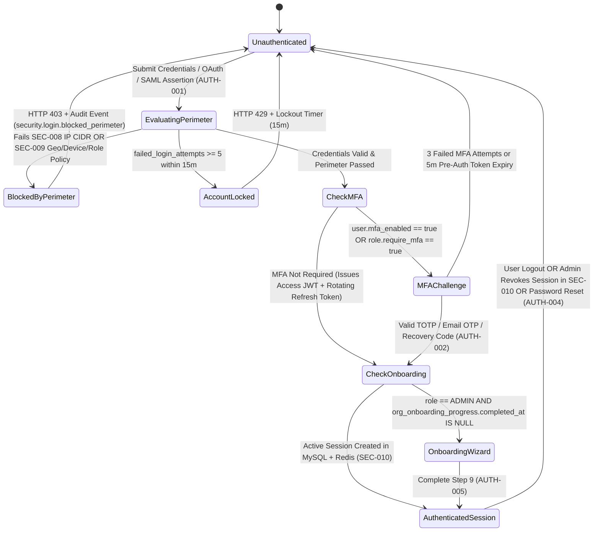

# Phase 03: Authentication, MFA, Enterprise SSO, IP/Login/Session Security & 9-Step First-Time Organization Setup Wizard (`AUTH-001..005`, `SEC-008..010`)

## 1. Phase Overview & Architectural Goal
**Phase 03** delivers enterprise-grade authentication (`AUTH-001`), TOTP/OTP/Recovery-Code Multi-Factor Authentication (`AUTH-002`), secure password reset (`AUTH-003..004`), the **9-Step First-Time Organization Setup Wizard (`AUTH-005`)**, and perimeter access security (**IP Restrictions `SEC-008`**, **Contextual Login Restrictions `SEC-009`**, and **Real-Time Session Revocation `SEC-010`**).

---

## 2. Authentication & Session Security State Machine



---

## 3. Database Schemas (MySQL 8.0 InnoDB)

```sql
CREATE TABLE users (
    id CHAR(36) PRIMARY KEY,                         -- UUIDv7
    org_id CHAR(36) NOT NULL,
    email VARCHAR(255) NOT NULL,
    password_hash VARCHAR(255) NULL,                 -- Argon2id (m=65536, t=3, p=4)
    full_name VARCHAR(180) NOT NULL,
    avatar_url VARCHAR(512) NULL,
    phone VARCHAR(32) NULL,
    role_id CHAR(36) NOT NULL,
    mfa_enabled TINYINT(1) NOT NULL DEFAULT 0,
    mfa_method ENUM('TOTP_AUTHENTICATOR','EMAIL_OTP','SMS_OTP') NOT NULL DEFAULT 'TOTP_AUTHENTICATOR',
    mfa_secret_encrypted VARCHAR(255) NULL,          -- AES-256-GCM encrypted RFC 6238 base32 secret
    mfa_recovery_codes_hash JSON NULL,               -- 10 single-use SHA-256 hashed backup codes
    sso_provider ENUM('NONE','MICROSOFT_ENTRA','GOOGLE_WORKSPACE','SAML_2_0','OIDC') NOT NULL DEFAULT 'NONE',
    sso_subject_id VARCHAR(255) NULL,
    status ENUM('INVITED','ACTIVE','LOCKED','SUSPENDED','ARCHIVED') NOT NULL DEFAULT 'ACTIVE',
    failed_login_attempts TINYINT UNSIGNED NOT NULL DEFAULT 0,
    locked_until DATETIME(3) NULL,
    password_changed_at DATETIME(3) NULL,
    last_login_at DATETIME(3) NULL,
    last_login_ip VARCHAR(45) NULL,
    created_at DATETIME(3) NOT NULL DEFAULT CURRENT_TIMESTAMP(3),
    UNIQUE KEY uk_org_email (org_id, email),
    INDEX idx_email_lookup (email)
) ENGINE=InnoDB DEFAULT CHARSET=utf8mb4 COLLATE=utf8mb4_unicode_ci;

CREATE TABLE user_sessions (
    id CHAR(36) PRIMARY KEY,                         -- JWT `sid` claim
    org_id CHAR(36) NOT NULL,
    user_id CHAR(36) NOT NULL,
    client_type ENUM('WEB_PORTAL','DESKTOP_AGENT','MOBILE_APP','BROWSER_EXTENSION') NOT NULL,
    device_id CHAR(36) NULL,
    device_name VARCHAR(150) NULL,
    os_name VARCHAR(80) NULL,
    refresh_token_hash CHAR(64) NOT NULL UNIQUE,
    ip_address VARCHAR(45) NOT NULL,
    geo_country CHAR(2) NULL,
    geo_city VARCHAR(100) NULL,
    network_classification ENUM('OFFICE_IP','VPN_IP','REMOTE_PUBLIC') NOT NULL DEFAULT 'REMOTE_PUBLIC',
    user_agent VARCHAR(512) NULL,
    last_active_at DATETIME(3) NOT NULL DEFAULT CURRENT_TIMESTAMP(3),
    expires_at DATETIME(3) NOT NULL,
    revoked_at DATETIME(3) NULL,
    revoked_by_user_id CHAR(36) NULL,
    revoked_reason VARCHAR(120) NULL,
    INDEX idx_user_active_sessions (org_id, user_id, revoked_at, expires_at)
) ENGINE=InnoDB;

CREATE TABLE security_access_rules (
    id CHAR(36) PRIMARY KEY,
    org_id CHAR(36) NOT NULL,
    rule_name VARCHAR(120) NOT NULL,
    rule_type ENUM('IP_ALLOWLIST','IP_BLOCKLIST','COUNTRY_ALLOWLIST','DEVICE_TRUST','ROLE_NETWORK_POLICY') NOT NULL,
    network_label ENUM('OFFICE_IP','VPN_IP','APPROVED_NETWORK','CUSTOM') NOT NULL DEFAULT 'OFFICE_IP',
    cidr_ranges_json JSON NULL,                      -- ["203.0.113.0/24", "198.51.100.42/32"]
    country_codes_json JSON NULL,                    -- ["IN", "US", "GB", "AE"]
    require_managed_device TINYINT(1) NOT NULL DEFAULT 0,
    applies_to_roles_json JSON NULL,                 -- Null = All Roles, or array of role_ids
    applies_to_clients_json JSON NULL,               -- ["WEB_PORTAL", "DESKTOP_AGENT", "MOBILE_APP"]
    priority_order SMALLINT UNSIGNED NOT NULL DEFAULT 100,
    is_enabled TINYINT(1) NOT NULL DEFAULT 1,
    created_at DATETIME(3) NOT NULL DEFAULT CURRENT_TIMESTAMP(3),
    INDEX idx_org_access_rules (org_id, is_enabled, priority_order ASC)
) ENGINE=InnoDB;

CREATE TABLE org_onboarding_progress (
    org_id CHAR(36) PRIMARY KEY,
    current_step TINYINT UNSIGNED NOT NULL DEFAULT 1,
    step_payloads_json JSON NOT NULL,                -- Stores draft state for Steps 1..9
    completed_at DATETIME(3) NULL,
    updated_at DATETIME(3) NOT NULL DEFAULT CURRENT_TIMESTAMP(3) ON UPDATE CURRENT_TIMESTAMP(3)
) ENGINE=InnoDB;
```

---

## 4. Screen-by-Screen 15-Point Specifications (`AUTH-001..005`, `SEC-008..010`)

---

### Screen `AUTH-001` — Login & Multi-Tenant SSO Discovery
1. **Screen ID, Title & Route**: `AUTH-001` — Login | Route: `/login`.
2. **Purpose, Roles & Permission**: Primary entry point for Web Portal, Desktop Agent (`DA-2`), Mobile App (`MOB-001`), and Browser Extension (`EXT-001`). Supports Email/Password, SAML 2.0 / OIDC SSO discovery by email domain, Microsoft Entra ID OAuth2, and Google Workspace OAuth2.
3. **UI Components**:
   * White-labeled Brand Header (`BRAND-001` logo & custom login artwork).
   * Form Fields: `Work Email`, `Password` (with visibility toggle), `Remember Me` checkbox.
   * Action Buttons: `[Sign In]`, `[Forgot Password? -> AUTH-003]`, `[Sign in with SSO]`, `[Microsoft]`, `[Google]`.
   * **Multi-Organization Picker Step**: If an email exists in `>1` active tenant (`ENT-002`), displays organization cards with company logo and role badge for the user to select their target workspace.
4. **Validation Rules (Zod)**: `email: z.string().email().max(255)`, `password: z.string().min(1).max(128)`, `rememberMe: z.boolean().default(false)`.
5. **Business Rules**:
   * **SSO Domain Enforcement**: If the tenant has `enforce_sso_only = true`, entering an `@acme.com` email automatically hides the password field and redirects to the tenant's SAML/Entra IdP.
   * **Brute-Force Protection**: 5 consecutive failed attempts lock the user for 15 minutes (`locked_until = NOW() + 15m`).
6. **Audit Events (`AUDIT-002`)**: `auth.login.succeeded`, `auth.login.failed`, `auth.login.locked`.
7. **API Endpoints**: `POST /api/v1/auth/discover-domain`, `POST /api/v1/auth/login`, `GET /api/v1/auth/sso/:provider/callback`.
8. **Acceptance Criteria**: Valid login issues a `15-minute` RS256 Access JWT + `HttpOnly Secure SameSite=Strict` Refresh Token cookie (or encrypted token for Desktop Agent) in `< 120ms`.

---

### Screen `AUTH-002` — MFA Verification
1. **Screen ID, Title & Route**: `AUTH-002` — MFA Verification | Route: `/login/mfa`.
2. **Purpose**: Verify second factor (`TOTP Authenticator Code`, `Email/SMS OTP`, or `10-Char Recovery Code`).
3. **UI Components**: 6-digit segmented OTP input with auto-paste & auto-submit, `[Verify]`, `[Resend OTP (60s countdown)]`, `[Use Recovery Code]` toggle.
4. **Validation & Business Rules**: Validates TOTP with $\pm 1$ time-step window (`30s` drift tolerance) and replays are blocked in Redis (`mfa_used:{user_id}:{code}` TTL `90s`). Used recovery codes are atomically removed from `mfa_recovery_codes_hash`.
5. **Audit Events**: `auth.mfa.verified`, `auth.mfa.failed`, `auth.mfa.recovery_code_used`.
6. **API Endpoints**: `POST /api/v1/auth/mfa/verify`, `POST /api/v1/auth/mfa/resend`.
7. **Acceptance Criteria**: Re-submitting the same 6-digit TOTP code within the same 30-second window is rejected with `400 Code Already Used`.

---

### Screens `AUTH-003` & `AUTH-004` — Forgot Password & Reset Password
1. **Screen IDs & Routes**: `AUTH-003` (`/forgot-password`) & `AUTH-004` (`/reset-password`).
2. **UI Components**:
   * `AUTH-003`: `Email` field + `[Send Reset Link]` + confirmation banner.
   * `AUTH-004`: `New Password`, `Confirm Password`, real-time **5-Rule Password Policy Meter** (`>= 10 chars`, `Uppercase`, `Lowercase`, `Digit`, `Special Character`, `Not Previously Used`).
3. **Business Rules & Security**:
   * Reset link token is `32 bytes` of `crypto.randomBytes`, stored as a SHA-256 hash in Redis (`pwd_reset:{hash}`, TTL `1,800s` = 30m).
   * Resetting password in `AUTH-004` immediately revokes all active `user_sessions` (`SEC-010`) and invalidates Redis session caches.
4. **API Endpoints**: `POST /api/v1/auth/forgot-password`, `POST /api/v1/auth/reset-password`.
5. **Acceptance Criteria**: After resetting a password in `AUTH-004`, any previously open browser tab or mobile session is immediately logged out on its next API request.

---

### Screen `AUTH-005` — 9-Step First-Time Organization Setup Wizard
1. **Screen ID, Title & Route**: `AUTH-005` — First-Time Organization Setup | Route: `/onboarding`.
2. **Purpose**: Guides a newly registered `ADMIN` through all 9 setup stages so the organization is 100% configured before landing on `DASH-001`.
3. **UI Components (9 Progressive Steps with Top Stepper Bar)**:
   * **Step 1 (`Company`)**: Company Name, Logo, Country, Default Timezone, Currency.
   * **Step 2 (`Industry`)**: Select Industry (`Software/IT`, `BPO/Contact Center`, `Banking/Finance`, `Healthcare`, `Design/Media`, `E-Commerce`, `Field Sales`, `Manufacturing`).
   * **Step 3 (`Employees`)**: Select Workforce Size tier & work arrangement (`In-Office`, `Remote`, `Hybrid`, `Field`).
   * **Step 4 (`Departments`)**: Interactive chip builder to create initial departments (`Engineering`, `QA`, `Product`, `Sales`, `HR`, `Finance`, `Support`) + assign department codes.
   * **Step 5 (`Work Schedule`)**: Configure default shift (`Start 09:00`, `End 18:00`, `Work Days Mon–Fri`, `Grace Period 15m`, `Full-Day 7.5h`, `Half-Day 4.0h`).
   * **Step 6 (`Monitoring Policy`)**: Select `Interactive Mode`, `Automatic Mode`, or `Silent Stealth Mode` + Screenshot frequency (`Off`, `3x/hr`, `6x/hr`, `12x/hr`) + Blur preference (`None`, `Blur Sensitive`).
   * **Step 7 (`Productivity Policy`)**: Auto-loads 150+ pre-classified apps/websites tailored to the Industry chosen in Step 2, allowing quick tweaks (`Productive`, `Neutral`, `Non-Productive`).
   * **Step 8 (`Invite Team`)**: Add initial employees/managers via email list or CSV upload (`IMPORT-001`).
   * **Step 9 (`Install HydiEms Agent`)**: One-click download cards for Windows (`.msi` / `.exe`), macOS (`.pkg`), and Linux + pre-embedded Organization Enrollment Token + live WebSocket connection listener (`"Connected! 1st Agent Online"`).
4. **API Endpoints**: `GET /api/v1/onboarding/state`, `PUT /api/v1/onboarding/step/:stepNumber`, `POST /api/v1/onboarding/complete`.
5. **Acceptance Criteria**: Refreshing the browser on Step 6 restores Steps 1–5 from `org_onboarding_progress.step_payloads_json` without data loss.

---

### Screens `SEC-008`, `SEC-009` & `SEC-010` — IP Restrictions, Login Restrictions & Session Management
1. **Screen IDs & Routes**:
   * `SEC-008`: `/admin/security/ip-restrictions`
   * `SEC-009`: `/admin/security/login-restrictions`
   * `SEC-010`: `/admin/security/sessions`
2. **Purpose, Roles & Permission**: Network access control (`Office IP`, `VPN IP`, `Approved Network`), contextual login policy enforcement (by `Country`, `IP`, `Device`, `Network`, `Role`), and live session inspection/revocation. Roles: `ADMIN`, `SECURITY_ADMIN`. Permission: `PERM_SECURITY_ACCESS_MANAGE`.
3. **UI Components**:
   * `SEC-008`: Table of Named IP Networks (`Office IP`, `VPN IP`, `Approved Network`), CIDR range editor with live **"Current Admin IP Check"** badge (prevents admins from accidentally locking out their own current IP!), and WFO auto-classification toggle.
   * `SEC-009`: Policy Rule Builder (`Rule Name`, `Countries Allowed`, `Allowed IP Groups`, `Require Approved Corporate Device`, `Target Roles`, `Target Clients: Web / Agent / Mobile`, `Action: Allow / Require MFA / Block`).
   * `SEC-010`: Live Sessions Table (`Employee`, `Role`, `Client Badge: Web / Desktop Agent / Mobile / Extension`, `Device Name & OS`, `IP Address`, `Network Label: Office IP / VPN / Remote`, `Geo Location`, `Last Activity`, `[Revoke Session]`, `[Logout All Devices]`).
4. **Validation Rules**: `SEC-008` validates valid IPv4/IPv6 CIDR blocks and blocks saving an `IP_ALLOWLIST` rule if the admin's current request IP is not included in the allowlist (anti-self-lockout guard).
5. **Audit Events (`AUDIT-002`)**: `security.ip_rule.created`, `security.login_rule.updated`, `security.session.revoked`, `security.session.revoked_all_for_user`.
6. **API Endpoints**: `GET/POST/PUT/DELETE /api/v1/security/access-rules`, `GET /api/v1/security/sessions`, `DELETE /api/v1/security/sessions/:sessionId`, `DELETE /api/v1/security/users/:userId/sessions`.
7. **Acceptance Criteria**:
   * Clicking `[Logout All Devices]` on a user in `SEC-010` immediately invalidates their Web, Mobile, and Interactive Agent sessions via Redis pub/sub (`session.revoked`) in `< 100ms`.
