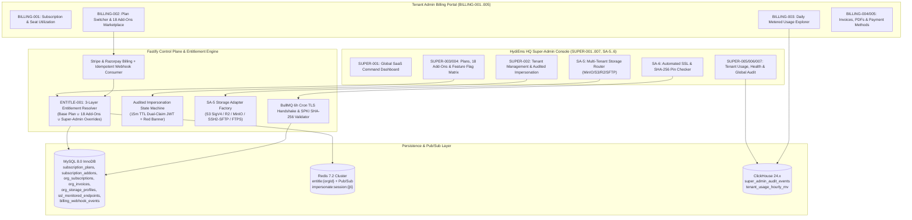

# PHASE 04: SAAS SUPER-ADMIN PORTAL, DYNAMIC FEATURE ENTITLEMENT ENGINE, MULTI-TENANT STORAGE ROUTING, SSL PIN CHECKER & SUBSCRIPTION BILLING

**Document Classification:** Master Engineering & Screen-by-Screen Specification (Phase 04 of 30)  
**System:** HydiEms Enterprise Workforce Analytics, Time, Attendance & DLP Platform  
**Modules Covered:** `SUPER-001`, `SUPER-002`, `SUPER-003`, `SUPER-004`, `SUPER-005`, `SUPER-006`, `SUPER-007`, `ENTITLE-001`, `SA-5`, `SA-6`, `BILLING-001`, `BILLING-002`, `BILLING-003`, `BILLING-004`, `BILLING-005`  
**Storage Architecture:** MySQL 8.0 InnoDB (SaaS Control Plane, Subscriptions, Plans, 18 Add-Ons, Invoices, Storage Profiles, SSL Endpoints, Webhook Idempotency Ledger) + ClickHouse 24.x (Cross-Tenant Ingestion Metrics, Daily Usage Rollups & Global Super-Admin Audit Trail) + Redis 7.2 (`entitle:{orgId}` L2 Cache, Pub/Sub `channel:entitlements:invalidated`, Active Impersonation Sessions) + Multi-Backend Object/File Store (Local NVMe MinIO, AWS S3, Cloudflare R2, Tenant FTP/FTPS/SFTP)  
**Backend Runtime:** Fastify 5.x (TypeScript 5.x, Kysely/Prisma SQL Builder, BullMQ Scheduled Billing & SSL Probe Workers, Stripe & Razorpay Webhook Engine)  

---

## 1. ARCHITECTURAL OVERVIEW & SUBSYSTEM TOPOLOGY

Phase 04 governs the **HydiEms Multi-Tenant SaaS Control Plane (`SUPER-001..007`)**, the **Zero-Hardcode Dynamic Feature Entitlement & 18 Add-On Engine (`ENTITLE-001`)**, **Per-Tenant Polyglot Media Storage Routing (`SA-5`)**, **Automated TLS/SSL Certificate & C# Agent SHA-256 Public Key Pin Monitoring (`SA-6`)**, and **Self-Service Subscription & Metered Usage Billing (`BILLING-001..005`)** with cryptographic Stripe/Razorpay webhook idempotency.



### 1.1 The 3-Layer Dynamic Entitlement Resolution Formula (`ENTITLE-001`)

No UI component, Fastify API route, or Desktop Agent module is ever permitted to check `if (org.planCode === 'ENTERPRISE')`. Instead, all feature checks evaluate against the **Effective Entitlement Map** resolved deterministically as:

$$\text{EffectiveEntitlements}(\text{org}) = \text{Override}\Big(\text{MergeMax}\big(\text{Plan}_{\text{defaults}}, \bigcup_{a \in \text{ActiveAddons}} \text{Addon}_a\big), \text{TenantFlagOverrides}\Big)$$

- **Boolean Capabilities:** Merged via logical `OR` between Base Plan and Active Add-Ons, then explicitly overridden (`true` or `false`) if present in `org_subscriptions.feature_flag_overrides_json`.
- **Numeric Quotas (`SCREENSHOTS_MAX_PER_HOUR`, `RETENTION_DAYS_*`, `API_CALLS_PER_USER_MONTH`):** Merged via `MAX(base, base + addon_delta)`, then explicitly replaced if an administrative numeric override exists in `feature_flag_overrides_json`.
- **Sub-5-Second Global Propagation:** Any mutation in `SUPER-003`, `SUPER-004`, `BILLING-002`, or Stripe/Razorpay webhook execution writes to MySQL in a transaction, updates `Redis HSET entitle:{orgId}`, publishes `{"orgId", "versionHash"}` to Redis Pub/Sub `channel:entitlements:invalidated`, invalidates every Fastify worker's 30-second L1 LRU cache, and emits a WebSocket `ENTITLEMENTS_UPDATED` event to all browser sessions and online C#/Rust Desktop Agents.

---

## 2. COMPLETE MYSQL 8.0 INNODB & CLICKHOUSE 24.X DDL SCHEMAS (PHASE 04)

```sql
-- ============================================================================
-- 1. DYNAMIC PLANS CATALOG (SUPER-003, ENTITLE-001, BILLING-002)
-- ============================================================================
CREATE TABLE IF NOT EXISTS subscription_plans (
    id BINARY(16) NOT NULL COMMENT 'UUIDv7 primary key',
    code VARCHAR(64) NOT NULL COMMENT 'STARTER, PROFESSIONAL, BUSINESS, ENTERPRISE, CUSTOM',
    name VARCHAR(120) NOT NULL,
    tagline VARCHAR(255) NULL,
    description TEXT NULL,
    monthly_price_per_seat_cents INT UNSIGNED NOT NULL COMMENT 'Price in minor currency units (e.g., 499 = $4.99)',
    annual_price_per_seat_cents INT UNSIGNED NOT NULL COMMENT 'Discounted per-seat monthly equivalent billed annually',
    currency_code CHAR(3) NOT NULL DEFAULT 'USD',
    min_seats INT UNSIGNED NOT NULL DEFAULT 5,
    max_seats INT UNSIGNED NULL COMMENT 'NULL = Unlimited seats',
    trial_days TINYINT UNSIGNED NOT NULL DEFAULT 14,
    default_entitlements_json JSON NOT NULL COMMENT 'Canonical 32-key Entitlement Map for this tier',
    stripe_monthly_price_id VARCHAR(128) NULL,
    stripe_annual_price_id VARCHAR(128) NULL,
    razorpay_monthly_plan_id VARCHAR(128) NULL,
    razorpay_annual_plan_id VARCHAR(128) NULL,
    is_public BOOLEAN NOT NULL DEFAULT TRUE,
    is_active BOOLEAN NOT NULL DEFAULT TRUE,
    sort_order TINYINT UNSIGNED NOT NULL DEFAULT 10,
    row_version INT UNSIGNED NOT NULL DEFAULT 1,
    created_at DATETIME(3) NOT NULL DEFAULT CURRENT_TIMESTAMP(3),
    updated_at DATETIME(3) NOT NULL DEFAULT CURRENT_TIMESTAMP(3) ON UPDATE CURRENT_TIMESTAMP(3),
    PRIMARY KEY (id),
    UNIQUE KEY uq_sub_plan_code (code),
    KEY idx_sub_plan_public (is_public, is_active, sort_order)
) ENGINE=InnoDB DEFAULT CHARSET=utf8mb4 COLLATE=utf8mb4_0900_ai_ci;

-- ============================================================================
-- 2. 18 STANDALONE PAID ADD-ONS CATALOG (ENTITLE-001, SUPER-003, BILLING-002)
-- ============================================================================
CREATE TABLE IF NOT EXISTS subscription_addons (
    id BINARY(16) NOT NULL,
    addon_key VARCHAR(64) NOT NULL COMMENT 'One of the 18 canonical add-on keys',
    name VARCHAR(150) NOT NULL,
    category ENUM('MONITORING', 'SECURITY_DLP', 'AI_ANALYTICS', 'FIELD_MDM', 'STORAGE_RETENTION', 'INTEGRATIONS_API', 'BRANDING') NOT NULL,
    description TEXT NOT NULL,
    billing_unit ENUM('PER_SEAT_MONTH', 'PER_100GB_MONTH', 'PER_10K_API_CALLS', 'FLAT_ORG_MONTH') NOT NULL DEFAULT 'PER_SEAT_MONTH',
    monthly_unit_price_cents INT UNSIGNED NOT NULL,
    annual_unit_price_cents INT UNSIGNED NOT NULL,
    currency_code CHAR(3) NOT NULL DEFAULT 'USD',
    grants_entitlements_json JSON NOT NULL COMMENT 'Boolean flags enabled or numeric deltas added when active',
    incompatible_plan_codes_json JSON NULL COMMENT 'e.g., ["FREE_TRIAL"] if restricted',
    stripe_price_id VARCHAR(128) NULL,
    razorpay_addon_id VARCHAR(128) NULL,
    is_active BOOLEAN NOT NULL DEFAULT TRUE,
    sort_order TINYINT UNSIGNED NOT NULL DEFAULT 10,
    created_at DATETIME(3) NOT NULL DEFAULT CURRENT_TIMESTAMP(3),
    updated_at DATETIME(3) NOT NULL DEFAULT CURRENT_TIMESTAMP(3) ON UPDATE CURRENT_TIMESTAMP(3),
    PRIMARY KEY (id),
    UNIQUE KEY uq_sub_addon_key (addon_key)
) ENGINE=InnoDB DEFAULT CHARSET=utf8mb4 COLLATE=utf8mb4_0900_ai_ci;

-- ============================================================================
-- 3. TENANT SUBSCRIPTIONS & EFFECTIVE FEATURE ENTITLEMENTS (SUPER-002..004, BILLING-001..002)
-- ============================================================================
CREATE TABLE IF NOT EXISTS org_subscriptions (
    org_id BINARY(16) NOT NULL COMMENT '1:1 with organizations.id',
    plan_id BINARY(16) NOT NULL,
    subscription_status ENUM('TRIALING', 'ACTIVE', 'PAST_DUE', 'GRACE_PERIOD', 'SUSPENDED', 'CANCELLED') NOT NULL DEFAULT 'TRIALING',
    billing_cycle ENUM('MONTHLY', 'ANNUAL', 'CUSTOM_ENTERPRISE') NOT NULL DEFAULT 'MONTHLY',
    licensed_seats INT UNSIGNED NOT NULL DEFAULT 10,
    active_seats_used INT UNSIGNED NOT NULL DEFAULT 0,
    block_auto_enrollment_on_seat_limit BOOLEAN NOT NULL DEFAULT TRUE COMMENT 'DA-15: BlockAutoUserCreationControl',
    overage_seats_allowed INT UNSIGNED NOT NULL DEFAULT 0,
    
    -- Purchased Add-Ons & Per-Tenant Feature Flag Overrides
    active_addons_json JSON NOT NULL COMMENT 'Array of {addonKey, quantity, activatedAt, unitPriceCents}',
    feature_flag_overrides_json JSON NOT NULL COMMENT 'SUPER-004 explicit overrides: {key: {value, reason, overriddenBy, expiresAt}}',
    effective_entitlements_json JSON NOT NULL COMMENT 'Materialized 3-layer merge cached in Redis entitle:{org_id}',
    entitlements_version_hash CHAR(64) NOT NULL COMMENT 'SHA-256 of effective_entitlements_json',
    
    -- Trial & Billing Period Timestamps
    trial_ends_at DATETIME(3) NULL,
    current_period_start DATETIME(3) NOT NULL,
    current_period_end DATETIME(3) NOT NULL,
    cancel_at_period_end BOOLEAN NOT NULL DEFAULT FALSE,
    suspended_at DATETIME(3) NULL,
    suspension_reason VARCHAR(500) NULL,
    
    -- Payment Gateway Bindings
    payment_gateway ENUM('STRIPE', 'RAZORPAY', 'MANUAL_WIRE_PO') NOT NULL DEFAULT 'STRIPE',
    gateway_customer_id VARCHAR(180) NULL,
    gateway_subscription_id VARCHAR(180) NULL,
    
    -- Billing Contact & Tax Identity (BILLING-005)
    billing_legal_name VARCHAR(200) NULL,
    billing_email VARCHAR(255) NOT NULL,
    billing_address_json JSON NULL COMMENT '{line1, line2, city, state, postalCode, countryCode}',
    tax_id_type ENUM('NONE', 'IN_GSTIN', 'EU_VAT', 'US_EIN', 'UK_VAT', 'AU_ABN', 'SG_UEN') NOT NULL DEFAULT 'NONE',
    tax_id_value VARCHAR(64) NULL,
    tax_exempt BOOLEAN NOT NULL DEFAULT FALSE,
    
    row_version INT UNSIGNED NOT NULL DEFAULT 1,
    updated_by BINARY(16) NULL,
    updated_at DATETIME(3) NOT NULL DEFAULT CURRENT_TIMESTAMP(3) ON UPDATE CURRENT_TIMESTAMP(3),
    PRIMARY KEY (org_id),
    KEY idx_org_sub_status_period (subscription_status, current_period_end),
    KEY idx_org_sub_gateway (payment_gateway, gateway_customer_id),
    CONSTRAINT fk_org_sub_plan FOREIGN KEY (plan_id) REFERENCES subscription_plans (id)
) ENGINE=InnoDB DEFAULT CHARSET=utf8mb4 COLLATE=utf8mb4_0900_ai_ci;

-- ============================================================================
-- 4. AUDITED SUPER-ADMIN IMPERSONATION SESSIONS (SUPER-002 & SUPER-007)
-- ============================================================================
CREATE TABLE IF NOT EXISTS super_admin_impersonation_sessions (
    id BINARY(16) NOT NULL COMMENT 'UUIDv7 session JTI',
    super_admin_user_id BINARY(16) NOT NULL,
    target_org_id BINARY(16) NOT NULL,
    target_admin_user_id BINARY(16) NOT NULL,
    ticket_reference VARCHAR(100) NOT NULL COMMENT 'Mandatory Jira/Zendesk/Support Ticket ID',
    justification_reason VARCHAR(500) NOT NULL,
    access_mode ENUM('READ_ONLY_INSPECT', 'READ_WRITE_SUPPORT') NOT NULL DEFAULT 'READ_ONLY_INSPECT',
    source_ip VARCHAR(45) NOT NULL,
    user_agent VARCHAR(512) NOT NULL,
    started_at DATETIME(3) NOT NULL DEFAULT CURRENT_TIMESTAMP(3),
    expires_at DATETIME(3) NOT NULL COMMENT 'Hard max 15 minutes from started_at',
    terminated_at DATETIME(3) NULL,
    termination_reason ENUM('MANUAL_EXIT', 'TTL_EXPIRED', 'REVOKED_BY_SECURITY', 'TENANT_SUSPENDED') NULL,
    actions_performed_count INT UNSIGNED NOT NULL DEFAULT 0,
    PRIMARY KEY (id),
    KEY idx_imp_target_org (target_org_id, started_at DESC),
    KEY idx_imp_super_admin (super_admin_user_id, started_at DESC)
) ENGINE=InnoDB DEFAULT CHARSET=utf8mb4 COLLATE=utf8mb4_0900_ai_ci;

-- ============================================================================
-- 5. TENANT METERED USAGE DAILY LEDGER (SUPER-005 & BILLING-003)
-- ============================================================================
CREATE TABLE IF NOT EXISTS org_usage_daily_snapshots (
    org_id BINARY(16) NOT NULL,
    usage_date DATE NOT NULL,
    licensed_seats INT UNSIGNED NOT NULL DEFAULT 0,
    active_tracked_employees INT UNSIGNED NOT NULL DEFAULT 0,
    provisioned_employees INT UNSIGNED NOT NULL DEFAULT 0,
    online_devices_peak INT UNSIGNED NOT NULL DEFAULT 0,
    screenshots_captured_count INT UNSIGNED NOT NULL DEFAULT 0,
    screenshots_storage_bytes BIGINT UNSIGNED NOT NULL DEFAULT 0,
    recordings_storage_bytes BIGINT UNSIGNED NOT NULL DEFAULT 0,
    audio_storage_bytes BIGINT UNSIGNED NOT NULL DEFAULT 0,
    total_media_storage_bytes BIGINT UNSIGNED GENERATED ALWAYS AS (
        screenshots_storage_bytes + recordings_storage_bytes + audio_storage_bytes
    ) VIRTUAL,
    recording_hours_captured DECIMAL(10, 2) NOT NULL DEFAULT 0.00,
    audio_hours_captured DECIMAL(10, 2) NOT NULL DEFAULT 0.00,
    api_calls_count INT UNSIGNED NOT NULL DEFAULT 0,
    webhook_deliveries_count INT UNSIGNED NOT NULL DEFAULT 0,
    ai_tokens_consumed INT UNSIGNED NOT NULL DEFAULT 0,
    estimated_daily_cost_cents INT UNSIGNED NOT NULL DEFAULT 0,
    updated_at DATETIME(3) NOT NULL DEFAULT CURRENT_TIMESTAMP(3) ON UPDATE CURRENT_TIMESTAMP(3),
    PRIMARY KEY (org_id, usage_date),
    KEY idx_usage_date_storage (usage_date, screenshots_storage_bytes DESC)
) ENGINE=InnoDB DEFAULT CHARSET=utf8mb4 COLLATE=utf8mb4_0900_ai_ci;

-- ============================================================================
-- 6. TENANT INVOICES, LINE ITEMS & PAYMENT METHODS (BILLING-004 & BILLING-005)
-- ============================================================================
CREATE TABLE IF NOT EXISTS org_invoices (
    id BINARY(16) NOT NULL,
    invoice_number VARCHAR(48) NOT NULL COMMENT 'e.g., HYDI-2026-09-004821',
    org_id BINARY(16) NOT NULL,
    period_start DATE NOT NULL,
    period_end DATE NOT NULL,
    line_items_json JSON NOT NULL COMMENT 'Array of {description, quantity, unitPriceCents, amountCents, proration: bool}',
    subtotal_cents BIGINT NOT NULL,
    discount_cents BIGINT NOT NULL DEFAULT 0,
    tax_rate_pct DECIMAL(5, 2) NOT NULL DEFAULT 0.00,
    tax_cents BIGINT NOT NULL DEFAULT 0,
    total_cents BIGINT NOT NULL,
    amount_paid_cents BIGINT NOT NULL DEFAULT 0,
    currency_code CHAR(3) NOT NULL DEFAULT 'USD',
    status ENUM('DRAFT', 'OPEN', 'PAID', 'PAST_DUE', 'VOID', 'UNCOLLECTIBLE') NOT NULL DEFAULT 'OPEN',
    payment_gateway ENUM('STRIPE', 'RAZORPAY', 'MANUAL_WIRE_PO') NOT NULL,
    gateway_invoice_id VARCHAR(180) NULL,
    gateway_payment_intent_id VARCHAR(180) NULL,
    pdf_s3_key VARCHAR(512) NULL,
    due_date DATE NOT NULL,
    paid_at DATETIME(3) NULL,
    created_at DATETIME(3) NOT NULL DEFAULT CURRENT_TIMESTAMP(3),
    PRIMARY KEY (id),
    UNIQUE KEY uq_invoice_number (invoice_number),
    KEY idx_org_invoices_date (org_id, created_at DESC),
    KEY idx_invoice_status_due (status, due_date)
) ENGINE=InnoDB DEFAULT CHARSET=utf8mb4 COLLATE=utf8mb4_0900_ai_ci;

CREATE TABLE IF NOT EXISTS org_payment_methods (
    id BINARY(16) NOT NULL,
    org_id BINARY(16) NOT NULL,
    payment_gateway ENUM('STRIPE', 'RAZORPAY') NOT NULL,
    gateway_payment_method_id VARCHAR(180) NOT NULL,
    method_type ENUM('CARD', 'ACH_DEBIT', 'SEPA_DEBIT', 'UPI_AUTOPAY', 'NETBANKING_EMANDATE') NOT NULL,
    brand VARCHAR(64) NULL COMMENT 'Visa, Mastercard, Amex, HDFC, etc.',
    last4 VARCHAR(4) NULL,
    exp_month TINYINT UNSIGNED NULL,
    exp_year SMALLINT UNSIGNED NULL,
    upi_vpa_masked VARCHAR(120) NULL,
    is_default BOOLEAN NOT NULL DEFAULT FALSE,
    status ENUM('ACTIVE', 'EXPIRED', 'FAILED_VERIFICATION', 'REVOKED') NOT NULL DEFAULT 'ACTIVE',
    created_at DATETIME(3) NOT NULL DEFAULT CURRENT_TIMESTAMP(3),
    PRIMARY KEY (id),
    UNIQUE KEY uq_gateway_pm (payment_gateway, gateway_payment_method_id),
    KEY idx_org_pm_default (org_id, is_default)
) ENGINE=InnoDB DEFAULT CHARSET=utf8mb4 COLLATE=utf8mb4_0900_ai_ci;

-- ============================================================================
-- 7. STRIPE & RAZORPAY WEBHOOK IDEMPOTENCY LEDGER (BILLING-005)
-- ============================================================================
CREATE TABLE IF NOT EXISTS billing_webhook_events (
    id BINARY(16) NOT NULL,
    gateway ENUM('STRIPE', 'RAZORPAY') NOT NULL,
    gateway_event_id VARCHAR(180) NOT NULL COMMENT 'evt_... or razorpay x-razorpay-event-id',
    event_type VARCHAR(120) NOT NULL COMMENT 'invoice.paid, customer.subscription.updated, payment.failed, etc.',
    org_id BINARY(16) NULL,
    payload_sha256 CHAR(64) NOT NULL,
    raw_payload_json JSON NOT NULL,
    processing_status ENUM('PROCESSING', 'PROCESSED', 'IGNORED_OUT_OF_ORDER', 'FAILED_RETRYABLE', 'DEAD_LETTER') NOT NULL DEFAULT 'PROCESSING',
    attempt_count TINYINT UNSIGNED NOT NULL DEFAULT 1,
    error_message TEXT NULL,
    processed_at DATETIME(3) NULL,
    received_at DATETIME(3) NOT NULL DEFAULT CURRENT_TIMESTAMP(3),
    PRIMARY KEY (id),
    UNIQUE KEY uq_gateway_event_id (gateway, gateway_event_id),
    KEY idx_webhook_status_received (processing_status, received_at)
) ENGINE=InnoDB DEFAULT CHARSET=utf8mb4 COLLATE=utf8mb4_0900_ai_ci;

-- ============================================================================
-- 8. MULTI-TENANT MEDIA STORAGE ROUTING PROFILES (SA-5)
-- ============================================================================
CREATE TABLE IF NOT EXISTS org_storage_profiles (
    id BINARY(16) NOT NULL,
    org_id BINARY(16) NOT NULL COMMENT 'Unique active routing profile per tenant',
    storage_provider ENUM('LOCAL_NVME_MINIO', 'AWS_S3', 'CLOUDFLARE_R2', 'TENANT_SFTP', 'TENANT_FTPS', 'TENANT_FTP') NOT NULL DEFAULT 'LOCAL_NVME_MINIO',
    
    -- S3 / MinIO / R2 Configuration
    endpoint_url VARCHAR(512) NULL COMMENT 'e.g., https://s3.ap-south-1.amazonaws.com or https://<account>.r2.cloudflarestorage.com',
    region VARCHAR(64) NULL DEFAULT 'us-east-1',
    bucket_name VARCHAR(128) NULL,
    base_path_prefix VARCHAR(255) NOT NULL DEFAULT 'tenants/',
    force_path_style BOOLEAN NOT NULL DEFAULT TRUE COMMENT 'TRUE for Local NVMe MinIO, FALSE for AWS S3 virtual-hosted style',
    access_key_id_encrypted TEXT NULL COMMENT 'AES-256-GCM encrypted with KMS master key',
    secret_access_key_encrypted TEXT NULL COMMENT 'AES-256-GCM encrypted',
    kms_key_arn VARCHAR(255) NULL COMMENT 'Optional SSE-KMS ARN for customer-managed encryption',
    
    -- Tenant On-Premise FTP / FTPS / SFTP Configuration (Matches StorageConfigurationModel)
    ftp_host VARCHAR(255) NULL,
    ftp_port SMALLINT UNSIGNED NULL DEFAULT 22,
    ftp_username VARCHAR(255) NULL,
    ftp_password_encrypted TEXT NULL COMMENT 'AES-256-GCM encrypted',
    ftp_ssh_private_key_encrypted TEXT NULL COMMENT 'Ed25519/RSA PEM for SFTP key auth',
    ftp_remote_root_dir VARCHAR(512) NULL DEFAULT '/hydiems_media',
    ftp_passive_mode BOOLEAN NOT NULL DEFAULT TRUE,
    
    -- Routing & Fallback Governance
    upload_mode ENUM('DIRECT_PRESIGNED_PUT', 'API_STREAM_PROXY', 'AGENT_DIRECT_SFTP') NOT NULL DEFAULT 'DIRECT_PRESIGNED_PUT',
    fallback_to_local_minio_on_failure BOOLEAN NOT NULL DEFAULT TRUE,
    last_connectivity_status ENUM('VERIFIED_OK', 'LATENCY_DEGRADED', 'AUTH_FAILED', 'UNREACHABLE', 'UNVERIFIED') NOT NULL DEFAULT 'UNVERIFIED',
    last_write_read_latency_ms SMALLINT UNSIGNED NULL,
    last_verified_at DATETIME(3) NULL,
    last_error_detail VARCHAR(500) NULL,
    
    updated_by BINARY(16) NOT NULL,
    updated_at DATETIME(3) NOT NULL DEFAULT CURRENT_TIMESTAMP(3) ON UPDATE CURRENT_TIMESTAMP(3),
    PRIMARY KEY (id),
    UNIQUE KEY uq_org_storage_profile (org_id)
) ENGINE=InnoDB DEFAULT CHARSET=utf8mb4 COLLATE=utf8mb4_0900_ai_ci;

-- ============================================================================
-- 9. AUTOMATED TLS/SSL CERTIFICATE & SHA-256 PIN MONITOR (SA-6)
-- ============================================================================
CREATE TABLE IF NOT EXISTS ssl_monitored_endpoints (
    id BINARY(16) NOT NULL,
    org_id BINARY(16) NULL COMMENT 'NULL = HydiEms Core Platform Endpoint; non-NULL = Tenant Custom Domain or FTPS Host',
    endpoint_label VARCHAR(150) NOT NULL,
    hostname VARCHAR(255) NOT NULL,
    port SMALLINT UNSIGNED NOT NULL DEFAULT 443,
    protocol ENUM('HTTPS', 'WSS', 'FTPS_IMPLICIT', 'FTPS_EXPLICIT', 'SMTP_STARTTLS') NOT NULL DEFAULT 'HTTPS',
    
    -- C# / Rust Desktop Agent Public Key Pinning Governance
    enforce_agent_spki_pin BOOLEAN NOT NULL DEFAULT FALSE,
    expected_primary_spki_sha256 CHAR(64) NULL COMMENT 'Hex/Base64 SHA-256 of SubjectPublicKeyInfo',
    expected_backup_spki_sha256 CHAR(64) NULL COMMENT 'Backup key pin for zero-downtime certificate rotation',
    
    -- Latest Handshake Telemetry
    observed_spki_sha256 CHAR(64) NULL,
    observed_cert_fingerprint_sha256 CHAR(64) NULL,
    subject_cn VARCHAR(255) NULL,
    san_dns_names_json JSON NULL,
    issuer_cn VARCHAR(255) NULL,
    negotiated_tls_version VARCHAR(16) NULL COMMENT 'TLSv1.3, TLSv1.2',
    negotiated_cipher_suite VARCHAR(128) NULL,
    ocsp_stapling_status ENUM('GOOD', 'REVOKED', 'NOT_STAPLED', 'UNKNOWN') NOT NULL DEFAULT 'UNKNOWN',
    valid_from DATETIME(3) NULL,
    valid_to DATETIME(3) NULL,
    days_remaining SMALLINT NULL,
    handshake_latency_ms SMALLINT UNSIGNED NULL,
    
    last_check_status ENUM('HEALTHY', 'EXPIRING_WARNING_30D', 'EXPIRING_CRITICAL_7D', 'EXPIRED', 'PIN_MISMATCH', 'WEAK_TLS_VERSION', 'UNREACHABLE') NOT NULL DEFAULT 'HEALTHY',
    last_error_message VARCHAR(500) NULL,
    last_checked_at DATETIME(3) NULL,
    created_at DATETIME(3) NOT NULL DEFAULT CURRENT_TIMESTAMP(3),
    PRIMARY KEY (id),
    UNIQUE KEY uq_ssl_host_port_proto (hostname, port, protocol),
    KEY idx_ssl_status_days (last_check_status, days_remaining)
) ENGINE=InnoDB DEFAULT CHARSET=utf8mb4 COLLATE=utf8mb4_0900_ai_ci;
```

### 2.1 ClickHouse 24.x Cross-Tenant Super-Admin Audit & Telemetry Rollup Tables

```sql
-- Immutable Global Audit Trail for all Super-Admin Actions (SUPER-007)
CREATE TABLE IF NOT EXISTS hydi_telemetry.super_admin_audit_events (
    event_id UUID,
    occurred_at DateTime64(3, 'UTC'),
    actor_super_admin_id UUID,
    actor_email String,
    actor_ip String,
    target_org_id Nullable(UUID),
    target_org_name String,
    action_category LowCardinality(String) COMMENT 'IMPERSONATION | TENANT_LIFECYCLE | PLAN_CHANGE | FEATURE_FLAG_OVERRIDE | STORAGE_ROUTING | SSL_PIN_UPDATE | BILLING_CREDIT',
    action_type LowCardinality(String),
    ticket_reference String,
    justification String,
    before_state_json String,
    after_state_json String,
    hmac_sha256 FixedString(64) COMMENT 'Chained HMAC-SHA256 tamper-evident signature'
)
ENGINE = MergeTree()
PARTITION BY toYYYYMM(occurred_at)
ORDER BY (occurred_at, actor_super_admin_id, event_id);
```

---

## 3. SCREEN-BY-SCREEN 15-POINT ENGINEERING SPECIFICATIONS

---

### 3.1 `SUPER-001` — SaaS Super-Admin Global Command Dashboard

1. **Screen ID & Title:** `SUPER-001` — SaaS Super-Admin Global Command Dashboard
2. **Route / URL / Navigation Path & Parent Layout:**
   - **Route:** `/super-admin/dashboard`
   - **Parent Layout:** `SuperAdminShellLayout` (Dark Indigo/Slate HQ Control Plane Header with Global Tenant Quick-Jump `Cmd+Shift+K` & Active Impersonation Banner Slot)
   - **Query State:** `?range=30d&currency=USD&cohort=ALL`
3. **Purpose & Operational Role:**
   - Provides HydiEms HQ Executives, SREs, and SaaS Operations Engineers with a single-pane-of-glass view into platform-wide commercial KPIs (MRR, ARR, Net Dollar Retention, Trial Conversion Rate), real-time infrastructure load (Total Organizations, Provisioned Seats, Live Connected Desktop Agents, 24h ClickHouse Slice Ingestion Rate, Total NVMe/S3/R2 Media Footprint in TB), and immediate action queues (Expiring Trials, Past-Due Subscriptions, Degraded Storage/SSL Endpoints).
4. **User Personas & RBAC Permissions Matrix:**
   | Persona | Permission Key | Allowed Scope | Capabilities |
   | :--- | :--- | :--- | :--- |
   | Platform Super Admin | `superadmin.dashboard.full` | `GLOBAL_PLATFORM` | View all commercial, telemetry, infrastructure & tenant health metrics |
   | SaaS Support Engineer | `superadmin.dashboard.support` | `GLOBAL_PLATFORM` | View tenant counts, online agents, health queues (MRR/ARR redacted) |
   | SaaS Finance Ops | `superadmin.dashboard.finance` | `GLOBAL_PLATFORM` | View MRR/ARR, Plan/Add-on revenue breakdown, Past-Due invoices |
5. **Layout & Wireframe Topology:**
   - **Top Command Header (64px):** Environment Badge (`PRODUCTION-CLUSTER-01`), Live Ingestion Counter (`48,920 slices/sec`), Quick Action Buttons (`[+ Provision New Tenant (SUPER-002)]`, `[Run SSL Probe (SA-6)]`, `[Broadcast Maintenance Notice]`).
   - **8-Card Executive KPI Strip (2x4 Grid):**
     1. *Total Organizations* (`Active` / `Trialing` / `Suspended` breakdown pills)
     2. *Total Licensed vs. Active Seats* (Seat utilization progress bar)
     3. *Currently Online Desktop Agents* (Live Redis global count + Windows/macOS/Linux OS split)
     4. *Monthly Recurring Revenue (MRR) & ARR* (Base Plan vs. 18 Add-Ons split + MoM growth %)
     5. *Total Media Storage Footprint (TB)* (Local NVMe MinIO vs. AWS S3 vs. Cloudflare R2 vs. Tenant SFTP)
     6. *24h Telemetry Ingestion Volume* (Activity Slices, Screenshots Captured, Video Clips, Audio Minutes)
     7. *Platform API & Webhook P95 Latency* (`Fastify REST`, `ClickHouse Write`, `S3 Pre-Sign`)
     8. *Active Security / Infrastructure Alerts* (SSL Expiring `<7d`, Failed Storage Endpoints, Dead-Letter Webhooks)
   - **Middle Analytics Row (2 Columns, 60% / 40%):**
     - *Left (60%):* **Tenant & Seat Growth + MRR Stacked Area Chart** (12-month trend switchable between MRR, Active Seats, and Storage Growth).
     - *Right (40%):* **Revenue Breakdown by Plan Tier & Top 10 Purchased Add-Ons** (Horizontal bar chart showing attach rate of `SCREEN_RECORDING_24_7`, `DLP_SUITE`, `HYDIAI_INSIGHTS`, etc.).
   - **Bottom Operational Tables (2 Tabs):**
     - *Tab 1: Top 15 Tenants by Ingestion & Storage Velocity* (Click to open `SUPER-005`).
     - *Tab 2: Expiring Trials & Past-Due At-Risk Tenants* (Inline `[Extend Trial +7d]`, `[Send Payment Link]`, `[Impersonate]` actions).
6. **Component-by-Component Breakdown & Data Bindings:**
   - `GlobalKpiCardGrid`: Binds to `/api/v1/super-admin/dashboard/summary`.
   - `LiveClusterPulseWidget`: Subscribes to SSE `/api/v1/super-admin/stream/cluster-pulse` (updates every 5s with Redis connected agent count, BullMQ queue depth, and ClickHouse insertion rate).
   - `AddonAttachRateChart`: Computes `COUNT(org_id WHERE addon_key IN active_addons_json) / COUNT(active_orgs)` for all 18 add-ons.
   - `ExpiringTrialsActionTable`: Lists tenants where `subscription_status = 'TRIALING'` and `trial_ends_at <= NOW() + INTERVAL 5 DAY`.
7. **Interactive State Machine:**
   - `LOADING_SUMMARY` -> Displays skeleton KPI cards and chart placeholders.
   - `LIVE_STREAMING` -> Updates real-time agent count and ingestion pulse every 5s via SSE.
   - `EXTENDING_TRIAL_MODAL` -> Opens inline confirmation modal when clicking `[Extend Trial]` on a row; requires reason note and updates `org_subscriptions.trial_ends_at`.
8. **Form Fields, Input Constraints & Validation Rules:**
   - Dashboard Query Filter (`Zod`):
     - `range`: `z.enum(['24h', '7d', '30d', '90d', '12m']).default('30d')`
     - `currency`: `z.enum(['USD', 'INR', 'EUR', 'GBP']).default('USD')`
9. **Backend Fastify REST & WebSocket Endpoints:**
   - `GET /api/v1/super-admin/dashboard/summary`
   - `GET /api/v1/super-admin/dashboard/revenue-and-addons`
   - `GET /api/v1/super-admin/stream/cluster-pulse` (Server-Sent Events)
10. **Database Queries & Storage Engine Mapping:**
    - **MySQL 8.0:** Aggregate `org_subscriptions` grouped by `subscription_status` and `plan_id` (`<8ms`); query `org_usage_daily_snapshots` for `usage_date = CURRENT_DATE()` storage totals.
    - **Redis 7.2:** Read `SCARD global:online_agents` and `HGETALL metrics:ingestion:1m_rolling`.
    - **ClickHouse 24.x:** Query `system.parts` and `tenant_usage_hourly_mv` for 24h ingestion counts.
11. **Edge Cases, Race Conditions & Conflict Resolution:**
    - **Multi-Currency MRR Normalization:** Tenants billed in `INR`, `EUR`, or `GBP` are normalized to the selected display currency (`USD` default) using daily ECB/OpenExchange rates cached in Redis `fx:rates:latest` so MRR totals never mix raw currency integers.
12. **Security, Privacy & Compliance Controls:**
    - Accessible strictly on `/api/v1/super-admin/*` routes guarded by `requireSuperAdminRole()` middleware + mandatory Hardware WebAuthn / TOTP MFA claim (`amr: ['mfa']`) in the Super-Admin JWT.
13. **Audit Trail Events Emitted:**
    - `SUPER_ADMIN_DASHBOARD_EXPORTED`, `SUPER_ADMIN_BROADCAST_ANNOUNCEMENT_SENT`.
14. **Real-Time WebSocket / SSE Subscriptions & Cache Invalidation:**
    - Commercial KPI aggregations are cached in Redis `sa:dashboard:summary:{currency}` for 60 seconds and invalidated immediately upon any `org_subscriptions` write.
15. **Acceptance Criteria:**
    - **Given** 500 active tenant organizations and 75,000 online agents, **When** a Super Admin loads `SUPER-001`, **Then** all 8 KPI cards and charts render in `<220ms` P95 and the live agent counter updates every 5 seconds without full page reloads.

---

### 3.2 `SUPER-002` — Organization (Tenant) Lifecycle Management & Audited Impersonation State Machine

1. **Screen ID & Title:** `SUPER-002` — Organization (Tenant) Lifecycle Management & Audited Impersonation State Machine
2. **Route / URL / Navigation Path & Parent Layout:**
   - **Route:** `/super-admin/organizations`
   - **Parent Layout:** `SuperAdminShellLayout`
   - **Query State:** `?search=&status=ALL&plan=ALL&storageProvider=ALL&page=1&pageSize=50`
3. **Purpose & Operational Role:**
   - Enables Super Admins to provision new tenant organizations, modify licensed seat limits, extend trials, suspend or reactivate delinquent/abusive tenants, force-disconnect all agents for a suspended tenant, and execute **1-Click Audited Tenant Admin Impersonation** governed by a strict 15-minute TTL state machine with mandatory ticket justification.
4. **User Personas & RBAC Permissions Matrix:**
   | Persona | Permission Key | Allowed Scope | Capabilities |
   | :--- | :--- | :--- | :--- |
   | Platform Super Admin | `superadmin.orgs.manage` | `GLOBAL_PLATFORM` | Create, Edit, Adjust Seats, Suspend/Reactivate, Impersonate (Read/Write) |
   | SaaS Support Tier-2 | `superadmin.orgs.impersonate_ro` | `GLOBAL_PLATFORM` | View Tenants, Extend Trial (<=14d), Impersonate (`READ_ONLY_INSPECT` mode only) |
5. **Layout & Wireframe Topology:**
   - **Filter & Action Header:** Search by Org Name, Slug, Domain, or Gateway Customer ID; Filters for Status (`TRIALING`, `ACTIVE`, `PAST_DUE`, `SUSPENDED`), Plan Tier, Storage Provider (`MinIO`, `S3`, `R2`, `SFTP`); Primary CTA `[+ Provision Organization]`.
   - **Tenant Data Grid:**
     - Columns: `Organization Name & Slug`, `Plan & Active Add-Ons Badge`, `Seat Usage (Active / Licensed)`, `Storage Used (GB) & Provider Pill`, `Subscription Status`, `Trial / Renewal Date`, `Online Agents`, `Actions ([Impersonate], [Manage Flags (SUPER-004)], [Adjust Seats], [Suspend/Reactivate])`.
   - **Audited Impersonation Launch Modal:**
     - Requires `Support Ticket ID` (e.g., `ZD-49281`), `Justification Reason` (min 20 chars), `Access Mode` (`READ_ONLY_INSPECT` vs. `READ_WRITE_SUPPORT`), and `Target Admin User` selector.
   - **Global Persistent Impersonation Banner (Injected into `AppShellLayout` when active):**
     - High-contrast crimson top bar (`36px` fixed): *"⚠️ IMPERSONATION ACTIVE: Viewing [Acme Corp] as [admin@acme.com] | Mode: READ_ONLY_INSPECT | Ticket: ZD-49281 | Expires in 12:44 | [Exit Impersonation]"*.
6. **Component-by-Component Breakdown & Data Bindings:**
   - `ProvisionOrganizationDrawer`: Creates `organizations`, default `org_subscriptions`, default `roles` (9 system roles), default `configuration_profiles`, and initial `ADMIN` user in a single MySQL transaction.
   - `ImpersonationLaunchModal`: Calls `POST /api/v1/super-admin/organizations/:orgId/impersonate` and exchanges token into an isolated session tab.
   - `TenantSuspensionModal`: Confirms tenant suspension; when executed, sets `subscription_status = 'SUSPENDED'`, revokes active user refresh tokens, and pushes `TENANT_SUSPENDED_PAUSE_AGENT` to all online Desktop Agents.
7. **Interactive State Machine (Audited Impersonation Lifecycle):**
   ```mermaid
   stateDiagram-v2
       [*] --> Idle_SuperAdmin
       Idle_SuperAdmin --> Awaiting_Justification: Click [Impersonate Tenant]
       Awaiting_Justification --> MFA_StepUp_Verify: Submit Ticket ID + Reason + Mode
       MFA_StepUp_Verify --> Active_Impersonation_Session: Issue 15m Dual-Claim JWT (act.sub = superAdminId)
       Active_Impersonation_Session --> Active_Impersonation_Session: Every API call logged with impersonator_id in AUDIT-002 & SUPER-007
       Active_Impersonation_Session --> Terminated_Manual: Click [Exit Impersonation]
       Active_Impersonation_Session --> Terminated_Expired: 15m Redis Key TTL Expires
       Active_Impersonation_Session --> Terminated_Revoked: Security Ops Revokes Session in SUPER-007
       Terminated_Manual --> Idle_SuperAdmin
       Terminated_Expired --> Idle_SuperAdmin
       Terminated_Revoked --> Idle_SuperAdmin
   ```
8. **Form Fields, Input Constraints & Validation Rules:**
   - **Impersonation Request (`Zod`):**
     - `ticketReference`: `z.string().regex(/^[A-Z]{2,6}-\d{3,8}$/, 'Must be a valid Ticket ID e.g. ZD-10492')`
     - `justificationReason`: `z.string().min(20).max(500)`
     - `accessMode`: `z.enum(['READ_ONLY_INSPECT', 'READ_WRITE_SUPPORT'])`
     - `targetUserId`: `z.string().uuid()`
     - `mfaTotpCode`: `z.string().length(6)` (Required if last MFA step-up > 15 minutes ago)
9. **Backend Fastify REST & WebSocket Endpoints:**
   - `GET /api/v1/super-admin/organizations`
   - `POST /api/v1/super-admin/organizations` (Provision new tenant)
   - `PATCH /api/v1/super-admin/organizations/:orgId/lifecycle` (Suspend, Reactivate, Extend Trial, Adjust Seats)
   - `POST /api/v1/super-admin/organizations/:orgId/impersonate`
     - Issues RFC 8693 OAuth 2.0 Token Exchange style JWT:
       ```json
       {
         "sub": "019283a4-7c11-7000-8000-000000000001",
         "org_id": "019283a4-1111-7000-8000-000000000999",
         "role": "ADMIN",
         "impersonation": {
           "jti": "019283b0-8888-7000-8000-000000000444",
           "actor_super_admin_id": "01928000-0000-7000-8000-000000000001",
           "actor_email": "sre@hydiems.com",
           "ticket_ref": "ZD-49281",
           "mode": "READ_ONLY_INSPECT"
         },
         "exp": 1758910800
       }
       ```
   - `POST /api/v1/super-admin/impersonation/:sessionId/terminate`
10. **Database Queries & Storage Engine Mapping:**
    - **MySQL 8.0:** Inserts into `super_admin_impersonation_sessions`; sets Redis key `impersonate:session:{jti}` with `EX 900` (900 seconds = 15 minutes hard cap).
    - **Fastify Global Hook (`onRequest`):** If `req.user.impersonation` is present, verifies `EXISTS impersonate:session:{jti}` in Redis; if `mode === 'READ_ONLY_INSPECT'` and `req.method !== 'GET' && req.method !== 'HEAD'`, immediately aborts with `403 IMPERSONATION_READ_ONLY_MODE`.
11. **Edge Cases, Race Conditions & Conflict Resolution:**
    - **Blocked Sensitive Actions During Impersonation:** Even in `READ_WRITE_SUPPORT` mode, an impersonating Super Admin is cryptographically blocked from: (a) viewing unblurred employee passwords/keys, (b) exporting raw payroll bank files, (c) deleting audit logs, or (d) disabling `PRIV-003` transparency logs.
12. **Security, Privacy & Compliance Controls:**
    - Tenant Admins receive an optional real-time email/in-app notification (`"HydiEms Support Engineer [sre@hydiems.com] accessed your organization under Ticket ZD-49281"`) and every impersonated click is visible in the tenant's own `AUDIT-002` log marked with `Actor: [HydiEms Support via Impersonation]`.
13. **Audit Trail Events Emitted:**
    - `TENANT_PROVISIONED`, `TENANT_SUSPENDED`, `TENANT_REACTIVATED`, `TENANT_SEATS_ADJUSTED`, `IMPERSONATION_STARTED`, `IMPERSONATION_ACTION_EXECUTED`, `IMPERSONATION_TERMINATED`.
14. **Real-Time WebSocket / SSE Subscriptions & Cache Invalidation:**
    - Suspending a tenant publishes `{"orgId", "status": "SUSPENDED"}` to `channel:entitlements:invalidated`, disconnecting active WebSocket streams within `<2s`.
15. **Acceptance Criteria:**
    - **Given** a Support Engineer starts a `READ_ONLY_INSPECT` impersonation session for Tenant A, **When** they attempt any `POST/PUT/PATCH/DELETE` mutation inside Tenant A's console, **Then** Fastify rejects the request with `403 IMPERSONATION_READ_ONLY_MODE`, and the session automatically self-terminates after exactly 15 minutes (`900s`).

---

### 3.3 `SUPER-003` — Subscription Plan & 18 Add-On Catalog Management

1. **Screen ID & Title:** `SUPER-003` — Subscription Plan & 18 Add-On Catalog Management
2. **Route / URL / Navigation Path & Parent Layout:**
   - **Route:** `/super-admin/subscriptions`
   - **Parent Layout:** `SuperAdminShellLayout`
3. **Purpose & Operational Role:**
   - Allows HydiEms Product & Revenue Operations to create and update base subscription tiers (`STARTER`, `PROFESSIONAL`, `BUSINESS`, `ENTERPRISE`, `CUSTOM`) and configure pricing, billing units, and entitlement grants for all **18 Standalone Paid Add-Ons** without requiring any code deployment or server restart.
4. **User Personas & RBAC Permissions Matrix:**
   - Restricted to `SUPER_ADMIN` with `superadmin.catalog.write`.
5. **Layout & Wireframe Topology:**
   - **2-Tab Workspace:**
     - **Tab 1: Base Subscription Plans (`subscription_plans`):** 4-column comparative card editor + `[+ Create Custom Enterprise Plan]` modal. Each card displays Monthly/Annual seat pricing, Stripe/Razorpay Price IDs, Min/Max seats, and an interactive **32-Key Default Entitlement Matrix Drawer**.
     - **Tab 2: 18 Paid Add-Ons Catalog (`subscription_addons`):** Categorized grid of all 18 add-ons showing `Addon Key`, `Name`, `Billing Unit`, `Monthly/Annual Price`, `Granted Entitlements JSON`, `Active Tenant Count`, and `[Edit Add-On]`.
6. **Component-by-Component Breakdown & Data Bindings:**
   - `PlanEntitlementTemplateEditor`: Visual toggle & numeric input editor for `default_entitlements_json` on a base plan. Includes a `"Recalculate All Subscribed Tenants"` preview counter showing how many active organizations inherit from this plan.
   - `AddonCatalogGrid`: Manages the 18 canonical add-ons (detailed in Section 3.8 `ENTITLE-001`).
7. **Interactive State Machine:**
   - `VIEWING_CATALOG` -> `EDITING_PLAN_TEMPLATE` -> `PREVIEWING_BLAST_RADIUS` (shows count of tenants whose effective entitlements will change) -> `COMMITTING_AND_BROADCASTING` (batches Redis `entitle:{orgId}` recomputation via BullMQ and emits Pub/Sub invalidation).
8. **Form Fields, Input Constraints & Validation Rules:**
   - `monthlyPricePerSeatCents`: `z.number().int().min(0).max(1000000)`
   - `annualPricePerSeatCents`: `z.number().int().min(0).max(1000000)`
   - `defaultEntitlements`: Validated against the strict `EntitlementMapSchema` (32 typed keys).
9. **Backend Fastify REST & WebSocket Endpoints:**
   - `GET /api/v1/super-admin/catalog/plans`
   - `PUT /api/v1/super-admin/catalog/plans/:planId`
   - `GET /api/v1/super-admin/catalog/addons`
   - `PUT /api/v1/super-admin/catalog/addons/:addonId`
10. **Database Queries & Storage Engine Mapping:**
    - Updates `subscription_plans` or `subscription_addons`, then selects all `org_id` from `org_subscriptions WHERE plan_id = ?`, recomputes `effective_entitlements_json` and `entitlements_version_hash`, updates MySQL in batches of 200, and pipelines `HSET entitle:{orgId}` + `PUBLISH channel:entitlements:invalidated`.
11. **Edge Cases, Race Conditions & Conflict Resolution:**
    - **Grandfathered Pricing Protection:** Changing `monthly_price_per_seat_cents` on a plan creates a new Stripe/Razorpay Price ID for *new* subscribers while preserving existing subscribers' billing rates until their next renewal or explicit migration.
12. **Security, Privacy & Compliance Controls:**
    - Catalog mutations require Super-Admin MFA verification and log full JSON diffs (`before_state_json` vs. `after_state_json`) in `SUPER-007`.
13. **Audit Trail Events Emitted:**
    - `SUBSCRIPTION_PLAN_UPDATED`, `SUBSCRIPTION_ADDON_UPDATED`, `BULK_TENANT_ENTITLEMENTS_RECOMPUTED`.
14. **Real-Time WebSocket / SSE Subscriptions & Cache Invalidation:**
    - Broadcasts `ENTITLEMENTS_UPDATED` to all affected tenants within `<5s`.
15. **Acceptance Criteria:**
    - **Given** `PROFESSIONAL` plan increases `SCREENSHOTS_MAX_PER_HOUR` from `6` to `10` in `SUPER-003`, **When** saved, **Then** every tenant on `PROFESSIONAL` (without a custom override) receives the new limit of `10` in Redis `entitle:{orgId}` within 5 seconds.

---

### 3.4 `SUPER-004` — Per-Tenant Feature Flags & Numeric Quota Override Matrix

1. **Screen ID & Title:** `SUPER-004` — Per-Tenant Feature Flags & Numeric Quota Override Matrix
2. **Route / URL / Navigation Path & Parent Layout:**
   - **Route:** `/super-admin/feature-flags` (and `/super-admin/organizations/:orgId/feature-flags`)
   - **Parent Layout:** `SuperAdminShellLayout`
3. **Purpose & Operational Role:**
   - Gives Super Admins surgical control to enable, disable, or override any boolean capability (`DLP_SUITE`, `AUDIO_TRACKING`, `KEYLOGGER_TEXT`, `LIVE_STREAM_WEBRTC`, `HYDIAI_INSIGHTS`, `FIELD_GPS_AND_GEOFENCE`, etc.) or numeric quota (`SCREENSHOTS_MAX_PER_HOUR`, `RETENTION_DAYS_SCREENSHOTS`, `API_CALLS_PER_USER_MONTH`) for a specific tenant organization—with optional automatic expiration dates (e.g., granting a 14-day pilot of `DLP_SUITE` to a Business-tier customer).
4. **User Personas & RBAC Permissions Matrix:**
   - Restricted to `SUPER_ADMIN` with `superadmin.feature_flags.override`.
5. **Layout & Wireframe Topology:**
   - **Top Organization Selector Bar:** Searchable tenant picker + Current Base Plan badge + Active Add-Ons pills + `[Reset All Overrides to Plan Default]`.
   - **4-Column Lineage Comparison Table (32 Feature Rows grouped by Domain):**
     - Column 1: `Feature Key & Description` (e.g., `DLP_SUITE — 11-Layer Data Loss Prevention`)
     - Column 2: `Base Plan Default` (`false` on Business)
     - Column 3: `Purchased Add-On Grant` (`+ true via DLP_SUITE Add-On` or `—`)
     - Column 4: `Super-Admin Override Control` (`Inherited` | `Force ON` | `Force OFF` or custom integer input + `Expires At` date picker + `Reason`)
     - Column 5: `Final Effective Value Badge` (Highlighted in Amber if overridden by Super Admin, Green if enabled, Slate if disabled).
6. **Component-by-Component Breakdown & Data Bindings:**
   - `FeatureLineageRow`: Displays the exact provenance (`BASE_PLAN`, `ADDON_GRANT`, or `SUPER_ADMIN_OVERRIDE`) for each of the 32 entitlement keys.
   - `TemporaryPilotOverrideModal`: Allows setting an `expiresAt` timestamp on any override; a scheduled BullMQ worker automatically strips expired overrides and recomputes `effective_entitlements_json`.
7. **Interactive State Machine:**
   - `CLEAN_INHERITED` -> `STAGED_CHANGES` (shows sticky bottom bar with count of modified flags + mandatory reason input) -> `SAVING_AND_PROPAGATING` -> `LIVE_SYNCED` (shows green toast confirming Redis & WebSocket push latency in ms).
8. **Form Fields, Input Constraints & Validation Rules:**
   - `overrides`: `z.record(z.string(), z.object({ value: z.union([z.boolean(), z.number(), z.string()]), reason: z.string().min(5).max(300), expiresAt: z.string().datetime().nullable() }))`
9. **Backend Fastify REST & WebSocket Endpoints:**
   - `GET /api/v1/super-admin/organizations/:orgId/entitlements-lineage`
   - `PATCH /api/v1/super-admin/organizations/:orgId/feature-flags`
10. **Database Queries & Storage Engine Mapping:**
    - Updates `org_subscriptions.feature_flag_overrides_json`, recomputes `effective_entitlements_json` and `entitlements_version_hash`, writes to Redis `entitle:{orgId}`, and publishes invalidation on `channel:entitlements:invalidated`.
11. **Edge Cases, Race Conditions & Conflict Resolution:**
    - **Immediate Downgrade / Feature Disablement Safety:** When `AUDIO_TRACKING` or `LIVE_STREAM_WEBRTC` is forced `OFF` in `SUPER-004`, any currently active live WebRTC stream or audio capture on connected Desktop Agents is terminated within `<3 seconds` upon receiving the `ENTITLEMENTS_UPDATED` WebSocket frame.
12. **Security, Privacy & Compliance Controls:**
    - High-privacy capabilities (`AUDIO_TRACKING`, `KEYLOGGER_TEXT`) require dual confirmation when forced `ON` and still respect tenant-level employee consent (`CONFIG-003` / `PRIV-002`).
13. **Audit Trail Events Emitted:**
    - `TENANT_FEATURE_FLAG_OVERRIDDEN`, `TENANT_FEATURE_FLAG_OVERRIDE_EXPIRED`.
14. **Real-Time WebSocket / SSE Subscriptions & Cache Invalidation:**
    - Publishes to Redis `channel:entitlements:invalidated` -> Fastify WebSocket gateway pushes `{"type": "ENTITLEMENTS_UPDATED", "effectiveEntitlements": {...}}` to room `org:{orgId}:all` (updating `G-001` sidebar items in real time without page refresh) and room `org:{orgId}:agents`.
15. **Acceptance Criteria:**
    - **Given** a tenant is on the `STARTER` plan (`DLP_SUITE = false`), **When** a Super Admin toggles `DLP_SUITE = Force ON` in `SUPER-004`, **Then** the tenant admin's browser sidebar (`G-001`) reveals the Security & DLP section and `/api/v1/dlp/*` routes return `200 OK` within `<5 seconds` without restarting any service.

---

### 3.5 `SUPER-005` — Multi-Tenant Metered Usage & Cost Attribution Explorer

1. **Screen ID & Title:** `SUPER-005` — Multi-Tenant Metered Usage & Cost Attribution Explorer
2. **Route / URL / Navigation Path & Parent Layout:**
   - **Route:** `/super-admin/usage`
   - **Parent Layout:** `SuperAdminShellLayout`
   - **Query State:** `?month=2026-09&sort=totalStorageBytes:desc&provider=ALL`
3. **Purpose & Operational Role:**
   - Tracks granular per-tenant resource consumption across all metered dimensions—**Active Tracked Employees**, **Screenshot Storage (GB)**, **Screen Recording Storage (GB) & Hours**, **Audio Storage (GB) & Hours**, **REST API Calls**, **Webhook Deliveries**, and **HydiAI LLM Tokens**—calculating gross infrastructure cost vs. subscription revenue (Gross Margin % per tenant).
4. **User Personas & RBAC Permissions Matrix:**
   - Accessible to `SUPER_ADMIN`, `SAAS_FINANCE_OPS`, and `SAAS_SRE`.
5. **Layout & Wireframe Topology:**
   - **Summary KPI Strip:** *Total Tracked Employees*, *Total Media Storage (TB)*, *Total Recording Hours (Month)*, *Total API Calls (Month)*, *Total HydiAI Tokens*, *Platform Gross Margin %*.
   - **Tenant Usage Leaderboard Grid:**
     - Columns: `Tenant Name & Plan`, `Seats (Active / Licensed)`, `Screenshots (Count & GB)`, `Recordings (Hours & GB)`, `Audio (Hours & GB)`, `API Calls (Used / Quota)`, `HydiAI Tokens`, `Est. Infra Cost ($)`, `Monthly Billed ($)`, `Gross Margin %`, `Actions ([Drill Down], [Throttle/Quota Alert])`.
6. **Component-by-Component Breakdown & Data Bindings:**
   - `TenantGrossMarginBadge`: Computes `(monthlyBilledCents - estInfraCostCents) / monthlyBilledCents` using configurable unit cost weights ($0.021/GB S3, $0.004/GB R2, $0.002/1K AI tokens).
   - `TenantUsageDrilldownDrawer`: 30-day daily stacked bar chart of storage growth and API consumption for a selected tenant.
7. **Interactive State Machine:**
   - Supports sorting by any metered column, filtering to "Over-Quota Tenants" (`active_seats_used > licensed_seats` or `api_calls > quota`), and 1-click CSV/Parquet export.
8. **Form Fields, Input Constraints & Validation Rules:**
   - `month`: `z.string().regex(/^\d{4}-\d{2}$/)`
   - `overQuotaOnly`: `z.boolean().optional()`
9. **Backend Fastify REST & WebSocket Endpoints:**
   - `GET /api/v1/super-admin/usage/tenants`
   - `GET /api/v1/super-admin/usage/tenants/:orgId/daily`
10. **Database Queries & Storage Engine Mapping:**
    - Queries `org_usage_daily_snapshots` aggregated by `org_id` for the selected `YYYY-MM` range joined with `org_subscriptions`.
11. **Edge Cases, Race Conditions & Conflict Resolution:**
    - **Deleted Media Deductions:** When a tenant deletes screenshots (`SS-009`) or retention expires (`SS-008`), the nightly storage reconciliation job decrements `screenshots_storage_bytes` on the current day's snapshot so storage gauges reflect actual live object store footprint.
12. **Security, Privacy & Compliance Controls:**
    - Displays aggregate byte counts and row counts only; zero customer screenshot/video content is exposed in `SUPER-005`.
13. **Audit Trail Events Emitted:**
    - `SUPER_ADMIN_USAGE_REPORT_EXPORTED`.
14. **Real-Time WebSocket / SSE Subscriptions & Cache Invalidation:**
    - Daily snapshots are updated incrementally every 15 minutes by the BullMQ `usage-rollup-worker`.
15. **Acceptance Criteria:**
    - **Given** 500 tenants logging telemetry, **When** `SUPER-005` is sorted by `Gross Margin % ASC`, **Then** negative-margin or storage-heavy outlier tenants are surfaced in `<150ms`.

---

### 3.6 `SUPER-006` — Tenant Connectivity, Ingestion Queue & Endpoint Health Monitor

1. **Screen ID & Title:** `SUPER-006` — Tenant Connectivity, Ingestion Queue & Endpoint Health Monitor
2. **Route / URL / Navigation Path & Parent Layout:**
   - **Route:** `/super-admin/tenant-health`
   - **Parent Layout:** `SuperAdminShellLayout`
3. **Purpose & Operational Role:**
   - Provides SREs and Support Engineers with per-tenant operational telemetry: Desktop Agent heartbeat connectivity ratio, local SQLite spool backlog volume across endpoints, failed media upload rates, S3/R2/SFTP storage endpoint latency (`SA-5`), and webhook delivery failure rates.
4. **User Personas & RBAC Permissions Matrix:**
   - Accessible to `SUPER_ADMIN`, `SAAS_SRE`, and `SAAS_SUPPORT`.
5. **Layout & Wireframe Topology:**
   - **Health Status Filter Pills:** `All Tenants`, `Critical (<80% Sync Success or Storage Down)`, `Degraded (Spool Backlog > 50MB or Latency > 800ms)`, `Healthy`.
   - **Tenant Health Matrix Table:**
     - Columns: `Organization`, `Online Agents / Total Devices`, `Agent Version Distribution`, `Avg SQLite Offline Spool (MB)`, `Slice Ingestion Success % (1h)`, `Media Upload Success % (1h)`, `Storage Backend & Latency (ms)`, `Webhook Delivery Success %`, `Health Score (0-100)`, `Actions ([Test Storage], [Force Config Sync])`.
6. **Component-by-Component Breakdown & Data Bindings:**
   - `StorageLatencySparkline`: 24h latency trend for the tenant's configured `SA-5` storage provider.
   - `ForceTenantConfigSyncButton`: Broadcasts a high-priority `FORCE_CONFIG_AND_ENTITLEMENT_RESYNC` WebSocket command to all online agents in that tenant.
7. **Interactive State Machine:**
   - Auto-refreshes every 15s; rows transitioning to `CRITICAL` flash an amber/red border and pin to the top of the grid.
8. **Form Fields, Input Constraints & Validation Rules:**
   - `healthFilter`: `z.enum(['ALL', 'CRITICAL', 'DEGRADED', 'HEALTHY']).default('ALL')`
9. **Backend Fastify REST & WebSocket Endpoints:**
   - `GET /api/v1/super-admin/tenant-health`
   - `POST /api/v1/super-admin/tenant-health/:orgId/force-agent-resync`
10. **Database Queries & Storage Engine Mapping:**
    - Joins `org_storage_profiles` (`last_connectivity_status`, `last_write_read_latency_ms`) with ClickHouse 1-hour rolling ingestion error aggregations (`hydi_telemetry.agent_sync_telemetry`).
11. **Edge Cases, Race Conditions & Conflict Resolution:**
    - **Tenant On-Premise SFTP Outage:** If a tenant's on-premise SFTP server (`SA-5`) goes unreachable, `SUPER-006` highlights the tenant in red and displays whether `fallback_to_local_minio_on_failure` is actively buffering their uploads on HydiEms NVMe MinIO.
12. **Security, Privacy & Compliance Controls:**
    - Force-resync actions are rate-limited to 1 per 60 seconds per tenant to prevent thundering-herd reconnect storms.
13. **Audit Trail Events Emitted:**
    - `TENANT_FORCE_CONFIG_RESYNC_TRIGGERED`.
14. **Real-Time WebSocket / SSE Subscriptions & Cache Invalidation:**
    - Subscribes to `SSE /api/v1/super-admin/stream/tenant-health-alerts`.
15. **Acceptance Criteria:**
    - **Given** a tenant's custom SFTP storage server rejects authentication, **When** upload failures exceed 5% in a 5-minute window, **Then** `SUPER-006` transitions the tenant to `CRITICAL` status and surfaces the exact SSH/SFTP error code.

---

### 3.7 `SUPER-007` — SaaS Global Cross-Tenant Super-Admin Audit Vault

1. **Screen ID & Title:** `SUPER-007` — SaaS Global Cross-Tenant Super-Admin Audit Vault
2. **Route / URL / Navigation Path & Parent Layout:**
   - **Route:** `/super-admin/audit`
   - **Parent Layout:** `SuperAdminShellLayout`
3. **Purpose & Operational Role:**
   - Maintains an immutable, cryptographically hash-chained (`HMAC-SHA256`) audit trail of every action taken inside the SaaS Control Plane—including tenant provisioning, suspensions, seat/plan changes, feature flag overrides (`SUPER-004`), storage routing edits (`SA-5`), SSL pin updates (`SA-6`), and every single request executed during a `SUPER-002` impersonation session.
4. **User Personas & RBAC Permissions Matrix:**
   - Read-only access for `SUPER_ADMIN` and `PLATFORM_SECURITY_AUDITOR`. Zero delete or edit permissions exist for any role.
5. **Layout & Wireframe Topology:**
   - **Top Verification Bar:** `Chain Integrity Status: ✓ Verified (HMAC-SHA256 Intact)` + `[Run Cryptographic Chain Verification]` + `[Export Signed JSONL / CSV]`.
   - **Faceted Search Bar:** Filter by `Super Admin Actor`, `Target Organization`, `Action Category` (`IMPERSONATION`, `FEATURE_FLAG_OVERRIDE`, `STORAGE_ROUTING`, `TENANT_LIFECYCLE`, `BILLING`), `Ticket Reference`, and `Date Range`.
   - **Audit Event Table & JSON Diff Inspector Drawer:** Clicking any row opens a side-by-side Monaco diff viewer comparing `before_state_json` and `after_state_json`, plus the actor's IP, User-Agent, Ticket ID, and Justification.
6. **Component-by-Component Breakdown & Data Bindings:**
   - `AuditJsonDiffDrawer`: Highlights exact keys modified in `feature_flag_overrides_json` or `org_storage_profiles`.
   - `ActiveImpersonationKillSwitch`: Lists any currently active 15m impersonation sessions at the top of `SUPER-007` with a 1-click `[Revoke Session Immediately]` button.
7. **Interactive State Machine:**
   - `BROWSING_LOGS` -> `INSPECTING_DIFF` -> `VERIFYING_HMAC_CHAIN` (streams verification progress across selected date partition).
8. **Form Fields, Input Constraints & Validation Rules:**
   - `category`: `z.enum(['ALL','IMPERSONATION','TENANT_LIFECYCLE','PLAN_CHANGE','FEATURE_FLAG_OVERRIDE','STORAGE_ROUTING','SSL_PIN_UPDATE','BILLING_CREDIT']).default('ALL')`
9. **Backend Fastify REST & WebSocket Endpoints:**
   - `GET /api/v1/super-admin/audit-logs`
   - `POST /api/v1/super-admin/audit-logs/verify-chain`
10. **Database Queries & Storage Engine Mapping:**
    - Queries ClickHouse `hydi_telemetry.super_admin_audit_events` ordered by `(occurred_at DESC)`.
11. **Edge Cases, Race Conditions & Conflict Resolution:**
    - **Write-Ahead Audit Guarantee:** If writing to `super_admin_audit_events` fails, the parent Super-Admin mutation transaction in Fastify is aborted (`500 AUDIT_WRITE_FAILURE`) so no silent administrative action can ever occur.
12. **Security, Privacy & Compliance Controls:**
    - Backed by ClickHouse `DELETE` inhibition policy and daily WORM (Write-Once-Read-Many) S3 Glacier Object Lock archival for SOC2 Type II and ISO 27001 compliance.
13. **Audit Trail Events Emitted:**
    - `SUPER_ADMIN_AUDIT_CHAIN_VERIFIED`, `SUPER_ADMIN_AUDIT_EXPORTED`.
14. **Real-Time WebSocket / SSE Subscriptions & Cache Invalidation:**
    - Live tail mode (`[Follow Live Audit Stream]`) streams new Super-Admin events via SSE in real time.
15. **Acceptance Criteria:**
    - **Given** a Super Admin modifies a feature flag in `SUPER-004` or starts an impersonation in `SUPER-002`, **When** `SUPER-007` is viewed, **Then** the event appears within `<1 second` with full before/after JSON state and a valid chained `hmac_sha256`.

---

### 3.8 `ENTITLE-001` — Dynamic Feature Entitlement Engine & 18 Add-Ons Catalog with Redis Pub/Sub Propagation

1. **Screen ID & Title:** `ENTITLE-001` — Dynamic Feature Entitlement Engine & 18 Add-Ons Catalog Explorer
2. **Route / URL / Navigation Path & Parent Layout:**
   - **Route:** `/super-admin/entitlements-engine` (and embedded diagnostically inside `/admin/billing/plans` `BILLING-002`)
   - **Parent Layout:** `SuperAdminShellLayout`
3. **Purpose & Operational Role:**
   - Defines, documents, and diagnoses the **32-Key Canonical Entitlement Map** and the **18 Standalone Paid Add-Ons** across the entire HydiEms platform, providing a live Entitlement Simulator (`"Why does Organization X have/lack Feature Y?"`), Redis cache inspector, and real-time Pub/Sub propagation monitor.
4. **User Personas & RBAC Permissions Matrix:**
   - `SUPER_ADMIN` (Full read/write & cache flush); Tenant `ADMIN` reads their own resolved `EffectiveEntitlements` via `GET /api/v1/org/entitlements`.
5. **Layout & Wireframe Topology:**
   - **Top Diagnostic Bar:** Organization Picker + `Entitlement Version Hash` (`sha256:8f94a...`) + `Redis Cache TTL / Status` + `[Recompute & Broadcast Now]`.
   - **Complete 18 Standalone Paid Add-Ons Catalog Reference Table:**
     | # | `addon_key` | Add-On Name | Billing Unit | Default Price | Entitlements Granted (`grants_entitlements_json`) |
     | :- | :--- | :--- | :--- | :--- | :--- |
     | 1 | `SCREEN_RECORDING_24_7` | Continuous & 2-Min Clip Screen Recording | `PER_SEAT_MONTH` | `$4.00` | `{"SCREEN_RECORDING": true, "RETENTION_DAYS_RECORDINGS": 30}` |
     | 2 | `AUDIO_TRACKING` | Consent-Gated Mic & System Audio Capture | `PER_SEAT_MONTH` | `$3.00` | `{"AUDIO_TRACKING": true}` |
     | 3 | `LIVE_STREAM_WEBRTC` | Live Multi-Monitor WebRTC & Office TV (`MON-006`) | `PER_SEAT_MONTH` | `$2.50` | `{"LIVE_STREAM_WEBRTC": true, "OFFICE_TV": true}` |
     | 4 | `KEYLOGGER_TEXT` | Keystroke Text & Clipboard Forensics (`KEY-001`) | `PER_SEAT_MONTH` | `$3.00` | `{"KEYLOGGER_TEXT": true}` |
     | 5 | `DLP_SUITE` | 11-Layer Endpoint DLP & USB/Print/Cloud Control | `PER_SEAT_MONTH` | `$5.00` | `{"DLP_SUITE": true}` |
     | 6 | `SUSPICIOUS_ACTIVITY_AI` | Anti-Mouse-Jiggler & Cheat Detection (`SUSP-001`) | `PER_SEAT_MONTH` | `$2.00` | `{"SUSPICIOUS_ACTIVITY_DETECTION": true}` |
     | 7 | `FIELD_GPS_AND_GEOFENCE` | Mobile GPS Route Tracking & Geofence Attendance | `PER_SEAT_MONTH` | `$3.50` | `{"FIELD_GPS_AND_GEOFENCE": true}` |
     | 8 | `MDM_SUITE` | Mobile Device Management & App Lock (`MDM-001`) | `PER_SEAT_MONTH` | `$3.00` | `{"MDM_SUITE": true}` |
     | 9 | `HYDIAI_INSIGHTS` | HydiAI Workforce Copilot, Burnout & Attrition ML | `PER_SEAT_MONTH` | `$4.00` | `{"HYDIAI_INSIGHTS": true, "AI_TOKENS_PER_USER_MONTH": 50000}` |
     | 10 | `SOFTWARE_LICENSE_OPT` | SaaS & Desktop License Spend Optimization (`SW-002`) | `PER_SEAT_MONTH` | `$2.00` | `{"SOFTWARE_LICENSE_OPTIMIZATION": true}` |
     | 11 | `CUSTOM_TRACKERS` | No-Code Custom Issue/Bug/SLA Trackers (`TRK-001`) | `PER_SEAT_MONTH` | `$2.50` | `{"CUSTOM_TRACKERS": true}` |
     | 12 | `CLIENT_BILLING_PORTAL` | Client Portal, Pay/Bill Rates & Invoicing (`BILL-001`) | `PER_SEAT_MONTH` | `$2.50` | `{"CLIENT_BILLING_AND_RATES": true}` |
     | 13 | `HRMS_PAYROLL_SUITE` | Leave Accrual, OKR/KPI Performance & Payroll Run | `PER_SEAT_MONTH` | `$3.00` | `{"HRMS_LEAVE_PERF_PAYROLL": true}` |
     | 14 | `ENTERPRISE_SSO_SCIM` | SAML 2.0, OIDC & SCIM 2.0 Directory Sync | `FLAT_ORG_MONTH` | `$99.00` | `{"SSO_SAML_OIDC": true, "SCIM_PROVISIONING": true}` |
     | 15 | `WHITE_LABEL_BRANDING` | Custom Domain, White-Label UI & Custom SMTP | `FLAT_ORG_MONTH` | `$79.00` | `{"WHITE_LABEL_BRANDING": true, "CUSTOM_SMTP": true}` |
     | 16 | `BYO_STORAGE_ROUTING` | Custom AWS S3, Cloudflare R2 or On-Prem SFTP (`SA-5`) | `FLAT_ORG_MONTH` | `$49.00` | `{"CUSTOM_STORAGE_ROUTING": true}` |
     | 17 | `RETENTION_PACK_365D` | Extended 365-Day Media & Telemetry Retention | `PER_100GB_MONTH` | `$19.00` | `{"RETENTION_DAYS_SCREENSHOTS": 365, "RETENTION_DAYS_RECORDINGS": 90, "RETENTION_DAYS_ACTIVITY": 730}` |
     | 18 | `API_WEBHOOK_QUOTA_PACK` | High-Throughput REST API & Webhook Pack (+10K/seat) | `PER_10K_API_CALLS` | `$29.00` | `{"API_CALLS_PER_USER_MONTH": 15000, "WEBHOOK_ENDPOINTS_MAX": 25}` |
6. **Component-by-Component Breakdown & Data Bindings:**
   - `EntitlementResolutionSimulator`: Takes `orgId` + hypothetical `planCode` + hypothetical `addons[]` and renders the exact resulting 32-key JSON object and which sidebar routes (`G-001`) and Fastify guards will unlock.
   - `FastifyEntitlementGuardMiddleware`:
     ```typescript
     // Fastify Route Decorator Example:
     fastify.get('/api/v1/dlp/incidents', {
       preHandler: [fastify.authenticate, fastify.requireEntitlement('DLP_SUITE')]
     }, handler);
     ```
7. **Interactive State Machine:**
   - `CACHE_HIT_L1` (`<0.05ms` in-process LRU, 30s TTL) -> `CACHE_HIT_L2_REDIS` (`<1.2ms` `HGETALL entitle:{orgId}`) -> `DB_RECOMPUTE_FALLBACK` (`<12ms` MySQL query + Redis populate).
8. **Form Fields, Input Constraints & Validation Rules:**
   - All 32 keys in `EffectiveEntitlements` are strictly validated by TypeBox/Zod at compile time and runtime.
9. **Backend Fastify REST & WebSocket Endpoints:**
   - `GET /api/v1/org/entitlements` (Called by Web App `G-001` & Desktop Agent on boot)
   - `POST /api/v1/super-admin/entitlements/:orgId/recompute`
10. **Database Queries & Storage Engine Mapping:**
    - Reads `org_subscriptions` joined with `subscription_plans` and `subscription_addons`; caches materialized JSON in Redis `entitle:{orgId}` (TTL 24h, invalidated immediately via Pub/Sub `channel:entitlements:invalidated`).
11. **Edge Cases, Race Conditions & Conflict Resolution:**
    - **Redis Split-Brain / PubSub Reconnect:** Whenever a Fastify node reconnects to Redis after a network blip, it automatically flushes its local L1 LRU entitlement cache so stale entitlements can never persist beyond the blip.
12. **Security, Privacy & Compliance Controls:**
    - If an API request hits an endpoint whose required entitlement is `false`, Fastify returns a structured `402 PAYMENT_REQUIRED_ENTITLEMENT_LOCKED` payload containing `{ missingEntitlementKey, upgradeAddonKey, upgradeUrl: '/admin/billing/plans' }` so the frontend renders a contextual Upgrade Modal.
13. **Audit Trail Events Emitted:**
    - `ENTITLEMENT_CACHE_RECOMPUTED`, `ENTITLEMENT_GATE_BLOCKED_ACCESS`.
14. **Real-Time WebSocket / SSE Subscriptions & Cache Invalidation:**
    - Redis Pub/Sub `channel:entitlements:invalidated` -> WebSocket `ENTITLEMENTS_UPDATED` event pushed to both Web App (`G-001`) and Desktop Agents (`DA-01`).
15. **Acceptance Criteria:**
    - **Given** zero `if (plan === ...)` checks exist in the codebase, **When** a tenant purchases `DLP_SUITE` in `BILLING-002`, **Then** `EffectiveEntitlements.DLP_SUITE` flips to `true` across Redis, Fastify guards, React UI navigation, and Desktop Agents in `<5 seconds`.

---

### 3.9 `SA-5` — Multi-Tenant Media Storage Routing Engine (Local NVMe MinIO, AWS S3, Cloudflare R2, Tenant FTP/FTPS/SFTP)

1. **Screen ID & Title:** `SA-5` — Multi-Tenant Media Storage Routing & Verification Console
2. **Route / URL / Navigation Path & Parent Layout:**
   - **Route:** `/super-admin/storage-routing` (and `/admin/settings/storage-routing` when `CUSTOM_STORAGE_ROUTING` entitlement is active)
   - **Parent Layout:** `SuperAdminShellLayout`
3. **Purpose & Operational Role:**
   - Configures where each tenant organization's high-volume media artifacts (WebP Screenshots, MP4/WebM Screen Recordings, Opus Audio Clips, DLP Evidence Files, and Signed Invoice PDFs) are physically stored. Supports **Local Ubuntu NVMe MinIO** (default zero-egress), **AWS S3**, **Cloudflare R2**, or **Customer On-Premise SFTP / FTPS / FTP** (matching [`StorageConfigurationModel`](file:///c:/Users/suppo/Downloads/hydiEMS/docs/phases/PHASE_04_SAAS_SUPER_ADMIN_ENTITLEMENTS_AND_BILLING.md)).
4. **User Personas & RBAC Permissions Matrix:**
   - `SUPER_ADMIN` (`superadmin.storage.manage` for all tenants); Tenant `ADMIN` (`org.storage.configure` for own tenant if `CUSTOM_STORAGE_ROUTING` entitlement is enabled).
5. **Layout & Wireframe Topology:**
   - **Storage Routing Overview Table (Super-Admin View):** Lists all tenants, active `storage_provider` badge, bucket/host, 30d media volume (GB), `last_connectivity_status`, `last_write_read_latency_ms`, and `[Configure Routing]`.
   - **Storage Provider Configuration Drawer:**
     - **Provider Selector Cards:** `Local NVMe MinIO (HydiEms Managed)`, `Amazon S3`, `Cloudflare R2`, `Tenant SFTP (SSH2)`, `Tenant FTPS (TLS)`, `Tenant FTP`.
     - **Dynamic Credential & Path Form:**
       - For `S3 / R2 / MinIO`: `Endpoint URL`, `Region`, `Bucket Name`, `Base Path Prefix`, `Force Path Style` toggle, `Access Key ID`, `Secret Access Key`, `Optional KMS Key ARN`.
       - For `SFTP / FTPS / FTP`: `Host`, `Port` (`22` / `990` / `21`), `Username`, `Password` or `SSH Private Key (PEM)`, `Remote Root Directory`, `Passive Mode` toggle.
     - **Resilience Controls:** `Upload Mode` (`DIRECT_PRESIGNED_PUT` vs. `API_STREAM_PROXY` vs. `AGENT_DIRECT_SFTP`) and `Fallback to Local NVMe MinIO on Outage` checkbox.
     - **Interactive 4-Step Live Connection Tester (`[Test Write / Read / Delete Now]`):** Runs a real probe and displays step-by-step checkmarks with latency in ms.
6. **Component-by-Component Breakdown & Data Bindings:**
   - `StorageAdapterFactory`: Backend polymorphic storage driver implementing `getPresignedUploadUrl()`, `getPresignedDownloadUrl()`, `putBuffer()`, `deleteObject()`, and `verifyConnectivity()` across S3/MinIO/R2 (`@aws-sdk/client-s3`) and SFTP/FTPS (`ssh2-sftp-client` / `basic-ftp`).
   - `LiveStorageProbeStepper`: Executes: (1) TCP/TLS Handshake, (2) Auth & Write `hydiems_probe_{uuid}.txt` (1KB), (3) Read & SHA-256 Verify, (4) Delete Probe File.
7. **Interactive State Machine:**
   - `EDITING_CONFIG` -> `RUNNING_4_STEP_PROBE` (Save button stays disabled until probe succeeds or Super Admin explicitly overrides) -> `VERIFIED_SAVED` -> `PUSHING_STORAGE_CONFIG_TO_AGENTS`.
8. **Form Fields, Input Constraints & Validation Rules:**
   - **SSRF Protection Rule:** When configuring custom `endpoint_url` or `ftp_host`, the backend DNS-resolves the hostname and strictly blocks RFC 1918 private IPs (`10.0.0.0/8`, `172.16.0.0/12`, `192.168.0.0/16`), loopback (`127.0.0.0/8`), and cloud metadata IPs (`169.254.169.254`) *unless* configured by a `SUPER_ADMIN` for the internal MinIO cluster.
9. **Backend Fastify REST & WebSocket Endpoints:**
   - `GET /api/v1/super-admin/storage-routing`
   - `PUT /api/v1/super-admin/storage-routing/:orgId`
   - `POST /api/v1/super-admin/storage-routing/:orgId/test-connection`
10. **Database Queries & Storage Engine Mapping:**
    - Stores credentials encrypted via `AES-256-GCM` (using envelope encryption with unique IV + auth tag per row) in `org_storage_profiles`.
11. **Edge Cases, Race Conditions & Conflict Resolution:**
    - **Zero-Data-Loss Fallback Queue:** If a tenant's custom S3 bucket or on-premise SFTP server becomes unreachable mid-day and `fallback_to_local_minio_on_failure = true`, Fastify transparently issues pre-signed URLs to HydiEms's Local NVMe MinIO staging bucket and queues a BullMQ `storage-drain-to-tenant-target` job to replay those objects to the tenant's server once connectivity recovers.
12. **Security, Privacy & Compliance Controls:**
    - Secret keys and FTP passwords are write-only in the UI (masked as `••••••••••••••••` after save) and decrypted only in-memory inside the storage worker.
13. **Audit Trail Events Emitted:**
    - `TENANT_STORAGE_PROFILE_UPDATED`, `TENANT_STORAGE_PROBE_EXECUTED`, `TENANT_STORAGE_FALLBACK_ACTIVATED`.
14. **Real-Time WebSocket / SSE Subscriptions & Cache Invalidation:**
    - Invalidates Redis `storage_profile:{orgId}` and pushes updated `StorageConfigurationModel` to online agents if `AGENT_DIRECT_SFTP` mode is used.
15. **Acceptance Criteria:**
    - **Given** a tenant is switched from `LOCAL_NVME_MINIO` to `CLOUDFLARE_R2` in `SA-5` and passes the 4-step probe, **When** an online Desktop Agent captures its next screenshot (`SS-001`), **Then** `/api/v1/screenshots/presign-upload` returns a Cloudflare R2 SigV4 PUT URL while older screenshots stored on MinIO remain viewable via their recorded `s3_bucket` metadata.

---

### 3.10 `SA-6` — Automated TLS/SSL Certificate & SHA-256 Public Key Pin Checker

1. **Screen ID & Title:** `SA-6` — Automated TLS/SSL Certificate & SHA-256 Public Key Pin Checker
2. **Route / URL / Navigation Path & Parent Layout:**
   - **Route:** `/super-admin/ssl-monitor`
   - **Parent Layout:** `SuperAdminShellLayout`
3. **Purpose & Operational Role:**
   - Continuously monitors TLS/SSL certificates, cipher suites, OCSP stapling, and **SubjectPublicKeyInfo (SPKI) SHA-256 Public Key Pins** across all HydiEms core ingestion domains (`api.hydiems.com`, `ws.hydiems.com`, `s3.hydiems.com`), tenant white-label custom domains (`BRAND-001`), and tenant FTPS/SMTP endpoints (`SA-5`, `BRAND-002`). Prevents C#/Rust Desktop Agent bricking during certificate renewals by verifying primary and backup SPKI SHA-256 pins prior to cutover.
4. **User Personas & RBAC Permissions Matrix:**
   - Accessible to `SUPER_ADMIN` and `SAAS_SRE`.
5. **Layout & Wireframe Topology:**
   - **Top Status Summary Cards:** `Healthy Endpoints`, `Expiring < 30 Days (Warning)`, `Expiring < 7 Days (Critical)`, `SPKI Pin Mismatch / Expired (Blocker)`.
   - **Monitored Endpoints Grid:**
     - Columns: `Endpoint Label & Host:Port`, `Protocol (HTTPS/WSS/FTPS/SMTP)`, `Tenant Scope`, `Issuer CN`, `TLS Version & Cipher`, `Valid To & Days Remaining Badge`, `Observed vs. Expected SPKI SHA-256 Pin`, `OCSP Status`, `Last Checked`, `Actions ([Check Now], [Edit Pin], [View Cert Chain])`.
   - **Certificate Chain & C# Agent Pin Inspector Drawer:** Displays the full leaf -> intermediate -> root X.509 chain, exact `SubjectPublicKeyInfo` Base64/Hex SHA-256 hash, and auto-generated C# / Rust agent pin configuration snippet.
6. **Component-by-Component Breakdown & Data Bindings:**
   - `TlsHandshakeInspector`: Uses Node.js `tls.connect({ host, port, servername, rejectUnauthorized: false })` to extract `peerCertificate`, compute `crypto.createPublicKey(cert.raw).export({ type: 'spki', format: 'der' })`, and hash with `SHA-256`.
   - `SpkiPinMatchBadge`: Compares `observed_spki_sha256` against `expected_primary_spki_sha256` and `expected_backup_spki_sha256`.
7. **Interactive State Machine:**
   - Runs automatically every 6 hours via BullMQ cron (`ssl-endpoint-monitor-cron`) and on-demand when clicking `[Check All Endpoints Now]`.
8. **Form Fields, Input Constraints & Validation Rules:**
   - `hostname`: Valid FQDN (`z.string().min(3).max(255)`)
   - `port`: `z.number().int().min(1).max(65535)`
   - `expectedPrimarySpkiSha256`: `z.string().regex(/^[a-fA-F0-9]{64}$/).nullable()`
   - `expectedBackupSpkiSha256`: `z.string().regex(/^[a-fA-F0-9]{64}$/).nullable()`
9. **Backend Fastify REST & WebSocket Endpoints:**
   - `GET /api/v1/super-admin/ssl-monitor/endpoints`
   - `POST /api/v1/super-admin/ssl-monitor/endpoints`
   - `POST /api/v1/super-admin/ssl-monitor/endpoints/:id/check-now`
10. **Database Queries & Storage Engine Mapping:**
    - Reads/writes `ssl_monitored_endpoints` in MySQL 8.0.
11. **Edge Cases, Race Conditions & Conflict Resolution:**
    - **Let's Encrypt / Zero-Downtime Key Rotation:** If an endpoint's leaf certificate rotates using a new keypair that matches `expected_backup_spki_sha256`, `SA-6` marks the endpoint `HEALTHY (USING_BACKUP_PIN)` and alerts SREs to promote the backup pin and generate a new backup keypair before the next rotation.
12. **Security, Privacy & Compliance Controls:**
    - Flags any endpoint negotiating `TLSv1.0` or `TLSv1.1` as `WEAK_TLS_VERSION` immediately.
13. **Audit Trail Events Emitted:**
    - `SSL_ENDPOINT_ADDED`, `SSL_PIN_UPDATED`, `SSL_CHECK_ALERT_TRIGGERED`.
14. **Real-Time WebSocket / SSE Subscriptions & Cache Invalidation:**
    - Critical alerts (`days_remaining <= 7` or `PIN_MISMATCH`) dispatch instant PagerDuty/Slack/Email alerts and update `SUPER-001` alert counter.
15. **Acceptance Criteria:**
    - **Given** a monitored domain's certificate has `<7 days` remaining or its observed SPKI SHA-256 does not match either primary or backup pins, **When** `SA-6` executes a probe, **Then** the status transitions to `EXPIRING_CRITICAL_7D` or `PIN_MISMATCH` within `<3 seconds` and emits a high-priority alert.

---

### 3.11 `BILLING-001` — Tenant Self-Service Subscription & Seat Utilization Dashboard

1. **Screen ID & Title:** `BILLING-001` — Tenant Self-Service Subscription & Seat Utilization Dashboard
2. **Route / URL / Navigation Path & Parent Layout:**
   - **Route:** `/org/[orgSlug]/admin/billing`
   - **Parent Layout:** `AppShellLayout` -> `AdminModuleLayout` (Sub-nav: Overview | Plans & Add-Ons | Usage Meters | Invoices | Payment Methods)
3. **Purpose & Operational Role:**
   - Gives Tenant CEOs, Company Admins, and Finance Managers complete visibility into their active subscription plan, billing cycle, renewal date, **Licensed Seats vs. Active Seats Used**, active paid add-ons, current month's accrued usage meters, and next invoice projection.
4. **User Personas & RBAC Permissions Matrix:**
   | Persona | Permission Key | Allowed Scope | Capabilities |
   | :--- | :--- | :--- | :--- |
   | CEO / Org Admin | `billing.subscription.manage` | `ORGANIZATION` | View dashboard, Upgrade/Downgrade plan, Add seats, Toggle auto-enrollment block |
   | Finance Manager | `billing.invoices.manage` | `ORGANIZATION` | View dashboard, Download invoices, Manage payment methods |
5. **Layout & Wireframe Topology:**
   - **Top Subscription Hero Card:**
     - Left: Current Plan Name (`BUSINESS PLAN`), Status Pill (`ACTIVE` / `TRIALING - 9 Days Left`), Billing Cycle (`Annual — Renews Oct 26, 2027`), `[Change Plan or Manage Add-Ons (BILLING-002)]`.
     - Center: **Seat Utilization Gauge** (`142 / 150 Seats Used — 94.6%`) + `[+ Buy More Seats]` button + Toggle for **`Block Auto-Enrollment When Seat Limit Reached (DA-15)`**.
     - Right: **Next Invoice Estimate Card** (`$1,485.00 USD on Oct 01, 2026` — breakdown of Base Seats + 3 Active Add-Ons + Tax).
   - **Middle Active Add-Ons Strip:** Horizontal cards showing currently enabled add-ons (`DLP_SUITE`, `SCREEN_RECORDING_24_7`, `HYDIAI_INSIGHTS`) with monthly cost and quick `[Manage]` link.
   - **Bottom 4 Usage Meter Summary Cards:** *Media Storage Used (GB)*, *Recording Hours Captured*, *REST API Calls (Month)*, *HydiAI Tokens Used* — each with a progress bar and link to `BILLING-003`.
6. **Component-by-Component Breakdown & Data Bindings:**
   - `SeatUtilizationCard`: Binds to `org_subscriptions.licensed_seats`, `active_seats_used`, and `block_auto_enrollment_on_seat_limit`.
   - `QuickAddSeatsModal`: Allows instant mid-cycle seat purchase with live Stripe/Razorpay proration preview (`"Adding +25 seats for the remaining 14 days of your cycle costs $58.33 today"`).
7. **Interactive State Machine:**
   - `ACTIVE_NORMAL` -> `SEAT_WARNING_90_PCT` (Amber alert banner when `>=90%` seats used) -> `SEAT_LIMIT_REACHED_100_PCT` (Red alert banner explaining that new Desktop Agent auto-enrollments are blocked per `DA-15` until seats are added).
8. **Form Fields, Input Constraints & Validation Rules:**
   - `additionalSeats`: `z.number().int().min(1).max(10000)`
   - `blockAutoEnrollmentOnSeatLimit`: `z.boolean()`
9. **Backend Fastify REST & WebSocket Endpoints:**
   - `GET /api/v1/billing/overview`
   - `POST /api/v1/billing/seats/preview-proration`
   - `POST /api/v1/billing/seats/purchase`
   - `PATCH /api/v1/billing/settings` (Updates `block_auto_enrollment_on_seat_limit`)
10. **Database Queries & Storage Engine Mapping:**
    - Reads `org_subscriptions` joined with `subscription_plans` and latest `org_usage_daily_snapshots`.
11. **Edge Cases, Race Conditions & Conflict Resolution:**
    - **Atomic Seat Reservation (`DA-15`):** When an unprovisioned Desktop Agent attempts auto-enrollment (`/api/v1/agent/enroll`), Fastify executes `UPDATE org_subscriptions SET active_seats_used = active_seats_used + 1 WHERE org_id = ? AND (active_seats_used < licensed_seats OR block_auto_enrollment_on_seat_limit = 0)`. If `affectedRows === 0`, enrollment is rejected with `402 SEAT_LIMIT_EXCEEDED` while existing employees continue working uninterrupted.
12. **Security, Privacy & Compliance Controls:**
    - Only users with `billing.subscription.manage` can trigger billable seat additions.
13. **Audit Trail Events Emitted:**
    - `BILLING_SEATS_PURCHASED`, `BILLING_AUTO_ENROLLMENT_LOCK_TOGGLED`.
14. **Real-Time WebSocket / SSE Subscriptions & Cache Invalidation:**
    - Seat purchases immediately update `org_subscriptions`, flush Redis `entitle:{orgId}`, and unblock waiting Desktop Agents.
15. **Acceptance Criteria:**
    - **Given** a tenant has `10 / 10` seats used and `block_auto_enrollment_on_seat_limit = true`, **When** an 11th device attempts auto-enrollment, **Then** it is blocked cleanly without affecting the 10 active employees, and purchasing `+5 seats` in `BILLING-001` immediately allows the 11th device to enroll.

---

### 3.12 `BILLING-002` — Interactive Plan Switcher, Proration Calculator & 18 Add-Ons Marketplace

1. **Screen ID & Title:** `BILLING-002` — Interactive Plan Switcher, Proration Calculator & 18 Add-Ons Marketplace
2. **Route / URL / Navigation Path & Parent Layout:**
   - **Route:** `/org/[orgSlug]/admin/billing/plans`
   - **Parent Layout:** `AppShellLayout` -> `AdminModuleLayout`
3. **Purpose & Operational Role:**
   - Allows Tenant Admins to compare and switch between `STARTER`, `PROFESSIONAL`, `BUSINESS`, and `ENTERPRISE` plans, toggle between `Monthly` and `Annual (Save 20%)` billing cycles, and self-service activate or deactivate any of the **18 Standalone Paid Add-Ons** with real-time down-to-the-cent proration calculation before checkout.
4. **User Personas & RBAC Permissions Matrix:**
   - Requires `billing.subscription.manage`.
5. **Layout & Wireframe Topology:**
   - **Billing Cycle Toggle Header:** `[Monthly Billing]` vs. `[Annual Billing (20% Off)]` + Currency display + Seat Count Slider/Input.
   - **4-Column Plan Comparison Matrix:** `Starter`, `Professional`, `Business (Most Popular)`, `Enterprise` cards with feature checkmarks and `[Current Plan]` / `[Upgrade / Switch]` CTA.
   - **18 Add-Ons Marketplace Grid (Filterable by Category):**
     - Categories: `Monitoring & Media`, `Security & DLP`, `AI & Analytics`, `Field & MDM`, `Storage & API`, `Enterprise & Branding`.
     - Each Add-On Card shows: Icon, Name, Description, Unit Price (`$4/seat/mo`), Status Toggle (`[+ Add to Subscription]` / `[Active ✓]`), and which Sidebar modules it unlocks.
   - **Sticky Right / Bottom Checkout & Proration Summary Drawer:**
     - Shows `Current Plan & Add-Ons`, `Staged Changes`, `Unused Time Credit`, `Prorated Charge Due Today`, `New Recurring Monthly/Annual Total`, and `[Confirm & Pay with Default Card (•••• 4242)]`.
6. **Component-by-Component Breakdown & Data Bindings:**
   - `LiveProrationCalculator`: Calls `POST /api/v1/billing/preview-change` with debounced staged plan + add-on selections; fetches exact Stripe `invoices.createPreview` or Razorpay proration math.
   - `DowngradeImpactWarningModal`: If a tenant downgrades a plan or removes an add-on (e.g., removing `DLP_SUITE`), displays a clear impact summary (*"3 active DLP rules and 2 USB block policies will be paused upon confirmation"*).
7. **Interactive State Machine:**
   - `BROWSING_CATALOG` -> `STAGING_CART` -> `CALCULATING_PRORATION` -> `AWAITING_3DS_OR_CONFIRMATION` -> `ENTITLEMENTS_UNLOCKED_CELEBRATION` (immediately unlocks new sidebar items via `ENTITLE-001`).
8. **Form Fields, Input Constraints & Validation Rules:**
   - `targetPlanCode`: `z.enum(['STARTER', 'PROFESSIONAL', 'BUSINESS', 'ENTERPRISE'])`
   - `billingCycle`: `z.enum(['MONTHLY', 'ANNUAL'])`
   - `licensedSeats`: `z.number().int().min(activeSeatsUsed)` (Cannot set licensed seats below currently active employees without archiving employees first)
   - `addons`: `z.array(z.object({ addonKey: z.string(), quantity: z.number().int().min(1) }))`
9. **Backend Fastify REST & WebSocket Endpoints:**
   - `GET /api/v1/billing/catalog`
   - `POST /api/v1/billing/preview-change`
   - `POST /api/v1/billing/commit-change`
10. **Database Queries & Storage Engine Mapping:**
    - Updates `org_subscriptions`, records the generated invoice in `org_invoices`, recomputes `effective_entitlements_json`, and publishes to Redis `channel:entitlements:invalidated`.
11. **Edge Cases, Race Conditions & Conflict Resolution:**
    - **Seat Reduction Guard:** If `active_seats_used = 48` and the admin attempts to reduce `licensed_seats` to `40`, validation rejects with `422 SEATS_BELOW_ACTIVE_USERS` and provides a direct link to `WF-001` to archive 8 inactive users first.
12. **Security, Privacy & Compliance Controls:**
    - Supports Stripe 3D Secure (SCA) and Razorpay RBI e-Mandate step-up authentication modals when required by the issuing bank.
13. **Audit Trail Events Emitted:**
    - `BILLING_PLAN_CHANGED`, `BILLING_ADDON_ACTIVATED`, `BILLING_ADDON_REMOVED`.
14. **Real-Time WebSocket / SSE Subscriptions & Cache Invalidation:**
    - Triggers `ENTITLEMENTS_UPDATED` WebSocket broadcast within `<3s` of payment confirmation.
15. **Acceptance Criteria:**
    - **Given** a Company Admin activates the `HYDIAI_INSIGHTS` add-on in `BILLING-002` and confirms payment, **Then** the prorated invoice is charged, `EffectiveEntitlements.HYDIAI_INSIGHTS` becomes `true`, and the HydiAI navigation menu (`AI-001..005`) unlocks immediately without logging out.

---

### 3.13 `BILLING-003` — Tenant Daily Metered Usage Ledger

1. **Screen ID & Title:** `BILLING-003` — Tenant Daily Metered Usage Ledger
2. **Route / URL / Navigation Path & Parent Layout:**
   - **Route:** `/org/[orgSlug]/admin/billing/usage`
   - **Parent Layout:** `AppShellLayout` -> `AdminModuleLayout`
3. **Purpose & Operational Role:**
   - Provides Tenant Admins with day-by-day historical transparency into their organization's metered consumption across **Tracked Employees**, **Screenshot Storage (GB)**, **Video Recording Storage (GB) & Hours**, **Audio Storage (GB)**, **REST API Calls**, and **HydiAI Tokens**, helping them optimize retention policies (`ADMIN-007`) or purchase storage/API packs.
4. **User Personas & RBAC Permissions Matrix:**
   - Accessible to `CEO`, `ADMIN`, and `FINANCE`.
5. **Layout & Wireframe Topology:**
   - **Date Range & Billing Period Selector:** Defaults to `Current Billing Cycle` (`Sep 01 – Sep 30, 2026`).
   - **4 Interactive Time-Series Charts (2x2 Grid):**
     1. *Daily Active Tracked Seats vs. Licensed Seats Limit Line*
     2. *Cumulative Media Storage Footprint (Stacked: Screenshots GB + Video GB + Audio GB)*
     3. *Daily Screen & Audio Recording Hours Captured*
     4. *Daily REST API Calls & HydiAI Token Consumption*
   - **Daily Granular Usage Ledger Table:** 1 row per calendar day from `org_usage_daily_snapshots` with `[Export CSV]`.
6. **Component-by-Component Breakdown & Data Bindings:**
   - `StorageBreakdownDonut`: Shows percentage of storage consumed by Screenshots vs. Recordings vs. Audio, with a direct link to `ADMIN-007` (Retention Policy) to reduce storage footprint.
7. **Interactive State Machine:**
   - Supports toggling chart series and exporting daily usage CSV for internal finance chargeback by department.
8. **Form Fields, Input Constraints & Validation Rules:**
   - `fromDate`: `z.string().date()`, `toDate`: `z.string().date()` (Max 366 days).
9. **Backend Fastify REST & WebSocket Endpoints:**
   - `GET /api/v1/billing/usage/daily`
   - `GET /api/v1/billing/usage/by-department` (Department-level cost/storage chargeback breakdown)
10. **Database Queries & Storage Engine Mapping:**
    - Queries MySQL `org_usage_daily_snapshots WHERE org_id = ? AND usage_date BETWEEN ? AND ? ORDER BY usage_date DESC`.
11. **Edge Cases, Race Conditions & Conflict Resolution:**
    - Intraday (today's) row is hydrated with a `"Live Intraday (Updates every 15m)"` badge.
12. **Security, Privacy & Compliance Controls:**
    - Strictly scoped to `req.user.orgId`.
13. **Audit Trail Events Emitted:**
    - `BILLING_USAGE_LEDGER_EXPORTED`.
14. **Real-Time WebSocket / SSE Subscriptions & Cache Invalidation:**
    - Cached in Redis `billing:usage:{orgId}:{from}:{to}` for 5 minutes.
15. **Acceptance Criteria:**
    - **Given** a tenant views `BILLING-003`, **When** they switch to the `By Department Chargeback` view, **Then** storage GB and active seat counts are accurately partitioned across their departments (`ORG-003`).

---

### 3.14 `BILLING-004` — Tenant Invoice History, Tax Breakdown & Signed PDF Generator

1. **Screen ID & Title:** `BILLING-004` — Tenant Invoice History, Tax Breakdown & Signed PDF Generator
2. **Route / URL / Navigation Path & Parent Layout:**
   - **Route:** `/org/[orgSlug]/admin/billing/invoices`
   - **Parent Layout:** `AppShellLayout` -> `AdminModuleLayout`
3. **Purpose & Operational Role:**
   - Lists all historical and open invoices for the tenant organization with itemized line items (base seats, prorated seat additions, 18 add-ons, discounts, GST/VAT/Sales tax), payment status, 1-click `[Pay Now]` for open/past-due invoices, and 1-click **Tax-Compliant PDF Invoice Download**.
4. **User Personas & RBAC Permissions Matrix:**
   - Accessible to `CEO`, `ADMIN`, and `FINANCE`.
5. **Layout & Wireframe Topology:**
   - **Past-Due Alert Banner (Conditional):** Appears if any invoice has `status = 'PAST_DUE'`, showing grace period countdown and `[Retry Payment Now]`.
   - **Invoices Table:**
     - Columns: `Invoice Number` (`HYDI-2026-09-004821`), `Billing Period`, `Issue Date`, `Due Date`, `Subtotal`, `Tax (GST/VAT)`, `Total Amount`, `Status Badge` (`PAID`, `OPEN`, `PAST_DUE`, `VOID`), `Actions ([View Itemized Details], [Download PDF], [Pay Now])`.
   - **Invoice Itemized Drawer:** Shows seller/buyer tax IDs (`GSTIN` / `EU VAT`), line-by-line proration math, payment transaction reference, and embedded PDF preview.
6. **Component-by-Component Breakdown & Data Bindings:**
   - `InvoicePdfDownloadButton`: Requests a 60-second pre-signed `GET` URL for `org_invoices.pdf_s3_key` (generated via headless Chromium/PDFKit upon invoice finalization).
7. **Interactive State Machine:**
   - `LIST_LOADED` -> `DOWNLOADING_PDF` or `PAYING_PAST_DUE_INVOICE` -> `INVOICE_PAID_UPDATED`.
8. **Form Fields, Input Constraints & Validation Rules:**
   - Filter by `year` (`z.number().int().min(2024).max(2035)`) and `status` (`ALL | PAID | OPEN | PAST_DUE`).
9. **Backend Fastify REST & WebSocket Endpoints:**
   - `GET /api/v1/billing/invoices`
   - `GET /api/v1/billing/invoices/:invoiceId/pdf-url`
   - `POST /api/v1/billing/invoices/:invoiceId/pay`
10. **Database Queries & Storage Engine Mapping:**
    - Queries `org_invoices` using index `idx_org_invoices_date (org_id, created_at DESC)`.
11. **Edge Cases, Race Conditions & Conflict Resolution:**
    - **Immutable Issued Invoices:** Once an invoice transitions to `PAID`, its `line_items_json`, `tax_id_value`, and `pdf_s3_key` are locked; subsequent changes to `BILLING-005` billing address apply only to `DRAFT` or future invoices.
12. **Security, Privacy & Compliance Controls:**
    - Supports Indian GST (HSN/SAC code `998314`, CGST/SGST/IGST split), EU VAT Reverse Charge, and US State Sales Tax formatting.
13. **Audit Trail Events Emitted:**
    - `BILLING_INVOICE_PDF_DOWNLOADED`, `BILLING_INVOICE_MANUAL_PAYMENT_ATTEMPTED`.
14. **Real-Time WebSocket / SSE Subscriptions & Cache Invalidation:**
    - Webhook `invoice.paid` updates invoice status to `PAID` in real time.
15. **Acceptance Criteria:**
    - **Given** a paid invoice in `BILLING-004`, **When** Finance clicks `[Download PDF]`, **Then** a signed tax invoice PDF containing the organization's legal name, GSTIN/VAT ID, and itemized seat/add-on breakdown downloads in `<1 second`.

---

### 3.15 `BILLING-005` — Payment Methods, Stripe/Razorpay Webhook Idempotency Engine & Tax Identity

1. **Screen ID & Title:** `BILLING-005` — Payment Methods, Stripe/Razorpay Webhook Idempotency Engine & Tax Identity
2. **Route / URL / Navigation Path & Parent Layout:**
   - **Route:** `/org/[orgSlug]/admin/billing/payment-methods`
   - **Parent Layout:** `AppShellLayout` -> `AdminModuleLayout`
3. **Purpose & Operational Role:**
   - Enables Tenant Admins and Finance Managers to add, remove, and set default payment methods (Credit/Debit Cards, US ACH Direct Debit, EU SEPA Debit via Stripe; UPI AutoPay, NetBanking e-Mandate, and Indian Cards via Razorpay), configure Billing Legal Name, Address, and Tax/GSTIN/VAT IDs, and powers the backend **Idempotent Webhook State Machine** that reconciles asynchronous payment events into `ENTITLE-001`.
4. **User Personas & RBAC Permissions Matrix:**
   - Requires `billing.subscription.manage` or `billing.invoices.manage`.
5. **Layout & Wireframe Topology:**
   - **2-Column Layout:**
     - **Left Column (60%): Saved Payment Methods (`org_payment_methods`):**
       - Cards showing Brand Icon (`Visa •••• 4242`, `Expires 08/2028`, `Default Badge`) or `UPI AutoPay (rahul@okicici)`.
       - Actions: `[Set as Default]`, `[Remove]`, and `[+ Add Payment Method]` (opens PCI-DSS SAQ-A compliant Stripe SetupIntent Elements or Razorpay Checkout Modal).
     - **Right Column (40%): Billing Identity & Tax Registration Form:**
       - `Legal Company Name`, `Billing Email (Receives PDF Invoices)`, `Billing Street / City / State / Postal Code / Country`, `Tax ID Type` (`IN_GSTIN`, `EU_VAT`, `US_EIN`, etc.), and `Tax ID Number` with live checksum/VIES/GST format validator.
6. **Component-by-Component Breakdown & Data Bindings:**
   - `StripeSetupIntentModal` / `RazorpayMandateModal`: Tokenizes payment methods directly with the gateway; zero raw PAN or CVV numbers ever touch HydiEms servers.
   - `WebhookIdempotencyConsumer` (Backend Engine):
     ```mermaid
     sequenceDiagram
         autonumber
         participant GW as Stripe / Razorpay Gateway
         participant Fastify as POST /api/v1/webhooks/billing/:gateway
         participant MySQL as MySQL 8.0 (billing_webhook_events & org_subscriptions)
         participant Redis as Redis 7.2 (entitle:{orgId})

         GW->>Fastify: 1. Deliver Signed Webhook (Stripe-Signature / X-Razorpay-Signature)
         Fastify->>Fastify: 2. Verify HMAC-SHA256 Signature Against Raw Request Body Buffer
         Fastify->>MySQL: 3. INSERT IGNORE INTO billing_webhook_events (gateway, gateway_event_id, status='PROCESSING')
         alt Duplicate Event ID (affectedRows == 0 & status == 'PROCESSED')
             MySQL-->>Fastify: 4a. Duplicate Detected
             Fastify-->>GW: 4b. Return 200 OK (Idempotent No-Op)
         else New Event
             Fastify->>MySQL: 5. BEGIN TX -> Lock org_subscriptions FOR UPDATE
             Fastify->>MySQL: 6. Update subscription_status / seats / addons & Insert/Update org_invoices
             Fastify->>MySQL: 7. Recompute effective_entitlements_json & Mark webhook 'PROCESSED' -> COMMIT
             Fastify->>Redis: 8. HSET entitle:{orgId} + PUBLISH channel:entitlements:invalidated
             Fastify-->>GW: 9. Return 200 OK (< 150ms)
         end
     ```
7. **Interactive State Machine:**
   - Payment Method Lifecycle: `ADDING_SETUP_INTENT` -> `VERIFYING_3DS_OR_MANDATE` -> `ACTIVE_DEFAULT` -> `EXPIRED_OR_FAILED`.
8. **Form Fields, Input Constraints & Validation Rules:**
   - `billingEmail`: `z.string().email()`
   - `taxIdType`: `z.enum(['NONE', 'IN_GSTIN', 'EU_VAT', 'US_EIN', 'UK_VAT', 'AU_ABN', 'SG_UEN'])`
   - `taxIdValue`: Validated by regex per type (e.g., `IN_GSTIN` matches `/^[0-9]{2}[A-Z]{5}[0-9]{4}[A-Z]{1}[1-9A-Z]{1}Z[0-9A-Z]{1}$/`).
9. **Backend Fastify REST & WebSocket Endpoints:**
   - `GET /api/v1/billing/payment-methods`
   - `POST /api/v1/billing/payment-methods/setup-intent`
   - `POST /api/v1/billing/payment-methods/:id/set-default`
   - `DELETE /api/v1/billing/payment-methods/:id`
   - `PUT /api/v1/billing/tax-identity`
   - `POST /api/v1/webhooks/billing/stripe` & `POST /api/v1/webhooks/billing/razorpay`
10. **Database Queries & Storage Engine Mapping:**
    - Uses `UNIQUE KEY uq_gateway_event_id (gateway, gateway_event_id)` in `billing_webhook_events` and row-level `SELECT ... FOR UPDATE` on `org_subscriptions` to guarantee strict exactly-once processing even under concurrent webhook retries.
11. **Edge Cases, Race Conditions & Conflict Resolution:**
    - **Cannot Delete Last Active Payment Method on Active Paid Subscription:** If `subscription_status = 'ACTIVE'` and only 1 active payment method exists, `DELETE /api/v1/billing/payment-methods/:id` returns `409 CANNOT_REMOVE_ONLY_ACTIVE_PAYMENT_METHOD` until a replacement method is added.
    - **Out-of-Order Webhook Delivery:** Every webhook compares `event.created` against the last processed timestamp for that subscription so an older delayed `customer.subscription.updated` event never overwrites a newer state.
12. **Security, Privacy & Compliance Controls:**
    - Raw webhook signatures are verified using constant-time `crypto.timingSafeEqual` against the raw unparsed request buffer before any JSON parsing occurs.
13. **Audit Trail Events Emitted:**
    - `BILLING_PAYMENT_METHOD_ADDED`, `BILLING_PAYMENT_METHOD_DEFAULT_CHANGED`, `BILLING_PAYMENT_METHOD_REMOVED`, `BILLING_TAX_IDENTITY_UPDATED`, `BILLING_WEBHOOK_PROCESSED`.
14. **Real-Time WebSocket / SSE Subscriptions & Cache Invalidation:**
    - When a past-due invoice is paid via webhook, `subscription_status` transitions from `PAST_DUE` to `ACTIVE` and broadcasts `ENTITLEMENTS_UPDATED` to clear all payment warning banners across the tenant's active browser sessions.
15. **Acceptance Criteria:**
    - **Given** Stripe or Razorpay delivers the exact same `invoice.paid` webhook payload 5 times concurrently, **When** `/api/v1/webhooks/billing/:gateway` processes them, **Then** exactly 1 invoice state transition and 1 entitlement recomputation occur, and all 5 requests return `200 OK` with zero duplicate database mutations.
