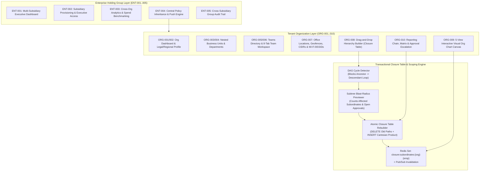

# PHASE 05: ORGANIZATION HIERARCHY, DEPARTMENTS, 8-TAB TEAMS, GEOFENCE LOCATIONS, DRAG-AND-DROP CLOSURE TABLE ORG CHART & MULTI-SUBSIDIARY ENTERPRISE GROUP

**Document Classification:** Master Engineering & Screen-by-Screen Specification (Phase 05 of 30)  
**System:** HydiEms Enterprise Workforce Analytics, Time, Attendance & DLP Platform  
**Modules Covered:** `ORG-001`, `ORG-002`, `ORG-003`, `ORG-004`, `ORG-005`, `ORG-006`, `ORG-007`, `ORG-008`, `ORG-009`, `ORG-010`, `ENT-001`, `ENT-002`, `ENT-003`, `ENT-004`, `ENT-005`  
**Storage Architecture:** MySQL 8.0 InnoDB (Organizations, Departments + Closure Table, Teams, 8-Tab Team Joins, Office Geofence Locations, Employee Reporting Closure Table, Enterprise Holding Groups & Subsidiary Links) + ClickHouse 24.x (Department/Team/Subsidiary Rollup Materialized Views) + Redis 7.2 (`closure:subordinates:{orgId}:{empId}` Set Cache, Real-Time Org Chart Presence Overlay, Pub/Sub Hierarchy Invalidation)  
**Backend Runtime:** Fastify 5.x (TypeScript 5.x, Kysely/Prisma Transactional Closure Table Engine, BullMQ Cross-Subsidiary Policy Push Worker)  

---

## 1. ARCHITECTURAL OVERVIEW & CLOSURE TABLE HIERARCHY ENGINE

Phase 05 establishes the structural backbone of every tenant organization (`ORG-001..010`) and parent holding group (`ENT-001..005`). Crucially, the reporting relationships configured in `ORG-008..010` (`Employee -> Team Lead -> Manager -> Department Head -> Director -> VP -> CEO`, plus `DOTTED_LINE` and `PROJECT_MANAGER` matrix links) are materialized in an $O(1)$ MySQL 8.0 **Transitive Closure Table (`employee_reporting_closure`)** paired with a Redis Set cache (`closure:subordinates:{orgId}:{managerEmpId}`).

Every downstream module in HydiEms—Dashboards (`DASH-002`), Attendance (`ATT-001`), Screenshots (`SS-001`), Timesheet/Leave Approvals (`TS-003`, `LEAVE-003`), and Workforce Analytics (`ANA-001`)—enforces `REPORTING_HIERARCHY` data scoping by joining against `employee_reporting_closure` in `<1.5ms` without recursive CTE performance degradation at 50,000+ employee scale.



### 1.1 Closure Table Subtree Reparenting Algorithm (`ORG-008`)

When Manager/Employee node $N$ (along with its entire transitive subtree $S_N$) is dragged and dropped under a new Manager $M$ in `ORG-008`:

1. **Cycle Detection Guard:** Verify $(N, M)$ does **not** exist in `employee_reporting_closure` with `ancestor_employee_id = N AND descendant_employee_id = M`. If it exists, $M$ is currently a subordinate of $N$, and moving $N$ under $M$ would create a cycle—abort immediately with `409 HIERARCHY_CYCLE_DETECTED`.
2. **Delete Disconnected Ancestor Paths:** Delete all closure paths where the descendant is in $S_N$ (`depth_from_N >= 0`) and the ancestor is a strict ancestor of $N$ (`depth_to_N > 0`):
   ```sql
   DELETE c FROM employee_reporting_closure c
   JOIN employee_reporting_closure d ON c.org_id = d.org_id AND c.descendant_employee_id = d.descendant_employee_id
   JOIN employee_reporting_closure a ON c.org_id = a.org_id AND c.ancestor_employee_id = a.ancestor_employee_id
   WHERE c.org_id = :orgId
     AND c.relationship_type = 'LINE_MANAGER'
     AND d.ancestor_employee_id = :nodeEmpId
     AND a.descendant_employee_id = :nodeEmpId
     AND a.depth > 0;
   ```
3. **Insert New Ancestor Paths via Cartesian Product:** Splice every ancestor of the new manager $M$ (including $M$ itself at `depth = 0`) to every descendant in $S_N$ (including $N$ itself at `depth = 0`):
   ```sql
   INSERT INTO employee_reporting_closure (org_id, ancestor_employee_id, descendant_employee_id, depth, relationship_type)
   SELECT :orgId, supertree.ancestor_employee_id, subtree.descendant_employee_id,
          supertree.depth + subtree.depth + 1, 'LINE_MANAGER'
   FROM employee_reporting_closure AS supertree
   CROSS JOIN employee_reporting_closure AS subtree
   WHERE supertree.org_id = :orgId
     AND subtree.org_id = :orgId
     AND supertree.descendant_employee_id = :newManagerEmpId
     AND supertree.relationship_type = 'LINE_MANAGER'
     AND subtree.ancestor_employee_id = :nodeEmpId
     AND subtree.relationship_type = 'LINE_MANAGER';
   ```

---

## 2. COMPLETE MYSQL 8.0 INNODB DDL SCHEMA (PHASE 05)

```sql
-- ============================================================================
-- 1. ENTERPRISE PARENT HOLDING GROUPS & SUBSIDIARY LINKS (ENT-001..005)
-- ============================================================================
CREATE TABLE IF NOT EXISTS enterprise_groups (
    id BINARY(16) NOT NULL COMMENT 'UUIDv7 primary key',
    group_code VARCHAR(32) NOT NULL COMMENT 'e.g., HYDIZO-GRP',
    name VARCHAR(180) NOT NULL COMMENT 'e.g., Hydizo Global Holdings Ltd.',
    legal_registration_number VARCHAR(100) NULL,
    hq_country_code CHAR(2) NOT NULL DEFAULT 'IN',
    reporting_currency_code CHAR(3) NOT NULL DEFAULT 'USD',
    default_iana_timezone VARCHAR(64) NOT NULL DEFAULT 'Asia/Kolkata',
    logo_s3_key VARCHAR(512) NULL,
    central_policy_enforcement BOOLEAN NOT NULL DEFAULT TRUE,
    created_by BINARY(16) NOT NULL,
    created_at DATETIME(3) NOT NULL DEFAULT CURRENT_TIMESTAMP(3),
    updated_at DATETIME(3) NOT NULL DEFAULT CURRENT_TIMESTAMP(3) ON UPDATE CURRENT_TIMESTAMP(3),
    PRIMARY KEY (id),
    UNIQUE KEY uq_ent_group_code (group_code)
) ENGINE=InnoDB DEFAULT CHARSET=utf8mb4 COLLATE=utf8mb4_0900_ai_ci;

CREATE TABLE IF NOT EXISTS enterprise_subsidiary_links (
    enterprise_group_id BINARY(16) NOT NULL,
    subsidiary_org_id BINARY(16) NOT NULL COMMENT 'FK to organizations.id',
    subsidiary_code VARCHAR(32) NOT NULL COMMENT 'e.g., SUB-US-01, SUB-IN-02',
    ownership_pct DECIMAL(5, 2) NOT NULL DEFAULT 100.00,
    consolidation_mode ENUM('FULL_CONSOLIDATION', 'METRICS_ONLY_NO_PII', 'INDEPENDENT') NOT NULL DEFAULT 'FULL_CONSOLIDATION',
    inherit_central_monitoring_policy BOOLEAN NOT NULL DEFAULT TRUE,
    inherit_central_dlp_policy BOOLEAN NOT NULL DEFAULT TRUE,
    inherit_central_productivity_catalog BOOLEAN NOT NULL DEFAULT TRUE,
    linked_by BINARY(16) NOT NULL,
    linked_at DATETIME(3) NOT NULL DEFAULT CURRENT_TIMESTAMP(3),
    PRIMARY KEY (enterprise_group_id, subsidiary_org_id),
    UNIQUE KEY uq_sub_org (subsidiary_org_id),
    CONSTRAINT fk_esl_group FOREIGN KEY (enterprise_group_id) REFERENCES enterprise_groups (id)
) ENGINE=InnoDB DEFAULT CHARSET=utf8mb4 COLLATE=utf8mb4_0900_ai_ci;

CREATE TABLE IF NOT EXISTS enterprise_executive_grants (
    id BINARY(16) NOT NULL,
    enterprise_group_id BINARY(16) NOT NULL,
    user_id BINARY(16) NOT NULL,
    executive_role ENUM('GROUP_CEO', 'GROUP_CHRO', 'GROUP_CFO', 'GROUP_CISO_DLP', 'GROUP_AUDITOR') NOT NULL,
    allowed_subsidiary_org_ids_json JSON NULL COMMENT 'NULL = All subsidiaries in group; else explicit array of org UUIDs',
    can_switch_into_subsidiary_console BOOLEAN NOT NULL DEFAULT TRUE,
    can_push_central_policies BOOLEAN NOT NULL DEFAULT FALSE,
    created_at DATETIME(3) NOT NULL DEFAULT CURRENT_TIMESTAMP(3),
    PRIMARY KEY (id),
    UNIQUE KEY uq_ent_exec_user (enterprise_group_id, user_id)
) ENGINE=InnoDB DEFAULT CHARSET=utf8mb4 COLLATE=utf8mb4_0900_ai_ci;

-- ============================================================================
-- 2. ORGANIZATIONS MASTER PROFILE (ORG-001 & ORG-002)
-- ============================================================================
CREATE TABLE IF NOT EXISTS organizations (
    id BINARY(16) NOT NULL,
    org_slug VARCHAR(64) NOT NULL COMMENT 'URL slug e.g. acme-corp',
    legal_name VARCHAR(200) NOT NULL,
    display_name VARCHAR(150) NOT NULL,
    industry_vertical VARCHAR(100) NOT NULL DEFAULT 'TECHNOLOGY',
    company_size_band ENUM('1_10', '11_50', '51_200', '201_500', '501_2000', '2000_PLUS') NOT NULL DEFAULT '51_200',
    website_url VARCHAR(255) NULL,
    primary_contact_email VARCHAR(255) NOT NULL,
    primary_contact_phone VARCHAR(32) NULL,
    hq_address_json JSON NOT NULL COMMENT '{line1, line2, city, state, postalCode, countryCode}',
    country_code CHAR(2) NOT NULL DEFAULT 'US',
    default_iana_timezone VARCHAR(64) NOT NULL DEFAULT 'UTC',
    default_currency_code CHAR(3) NOT NULL DEFAULT 'USD',
    fiscal_year_start_month TINYINT UNSIGNED NOT NULL DEFAULT 4 COMMENT '1=Jan, 4=April',
    work_week_start_day TINYINT UNSIGNED NOT NULL DEFAULT 1 COMMENT '1=Monday, 7=Sunday',
    logo_light_s3_key VARCHAR(512) NULL,
    logo_dark_s3_key VARCHAR(512) NULL,
    row_version INT UNSIGNED NOT NULL DEFAULT 1,
    created_at DATETIME(3) NOT NULL DEFAULT CURRENT_TIMESTAMP(3),
    updated_at DATETIME(3) NOT NULL DEFAULT CURRENT_TIMESTAMP(3) ON UPDATE CURRENT_TIMESTAMP(3),
    PRIMARY KEY (id),
    UNIQUE KEY uq_org_slug (org_slug)
) ENGINE=InnoDB DEFAULT CHARSET=utf8mb4 COLLATE=utf8mb4_0900_ai_ci;

-- ============================================================================
-- 3. DEPARTMENTS / BUSINESS UNITS & CLOSURE TABLE (ORG-003 & ORG-004)
-- ============================================================================
CREATE TABLE IF NOT EXISTS departments (
    id BINARY(16) NOT NULL,
    org_id BINARY(16) NOT NULL,
    parent_dept_id BINARY(16) NULL COMMENT 'Supports nested Business Unit -> Division -> Department',
    code VARCHAR(32) NOT NULL COMMENT 'e.g., ENG-CORE, FIN-AP',
    name VARCHAR(150) NOT NULL,
    description TEXT NULL,
    head_employee_id BINARY(16) NULL COMMENT 'Department Head / VP',
    cost_center_code VARCHAR(64) NULL,
    annual_budget_cents BIGINT UNSIGNED NULL,
    default_iana_timezone_override VARCHAR(64) NULL COMMENT '3-Tier Timezone Level 2 Override',
    monitoring_profile_override_id BINARY(16) NULL COMMENT 'FK to configuration_profiles.id',
    productivity_policy_override_id BINARY(16) NULL,
    status ENUM('ACTIVE', 'ARCHIVED') NOT NULL DEFAULT 'ACTIVE',
    row_version INT UNSIGNED NOT NULL DEFAULT 1,
    created_at DATETIME(3) NOT NULL DEFAULT CURRENT_TIMESTAMP(3),
    updated_at DATETIME(3) NOT NULL DEFAULT CURRENT_TIMESTAMP(3) ON UPDATE CURRENT_TIMESTAMP(3),
    deleted_at DATETIME(3) NULL,
    PRIMARY KEY (id),
    UNIQUE KEY uq_org_dept_code (org_id, code),
    KEY idx_dept_org_parent (org_id, parent_dept_id, status),
    KEY idx_dept_head (org_id, head_employee_id),
    CONSTRAINT fk_dept_parent FOREIGN KEY (parent_dept_id) REFERENCES departments (id) ON DELETE SET NULL
) ENGINE=InnoDB DEFAULT CHARSET=utf8mb4 COLLATE=utf8mb4_0900_ai_ci;

-- ============================================================================
-- 4. TEAMS & 8-TAB TEAM MEMBERSHIPS (ORG-005 & ORG-006)
-- ============================================================================
CREATE TABLE IF NOT EXISTS teams (
    id BINARY(16) NOT NULL,
    org_id BINARY(16) NOT NULL,
    department_id BINARY(16) NOT NULL,
    code VARCHAR(32) NOT NULL COMMENT 'e.g., SQUAD-PAYMENTS',
    name VARCHAR(150) NOT NULL,
    description TEXT NULL,
    team_lead_employee_id BINARY(16) NULL,
    default_iana_timezone_override VARCHAR(64) NULL,
    default_shift_id BINARY(16) NULL,
    monitoring_profile_override_id BINARY(16) NULL,
    target_utilization_pct DECIMAL(5, 2) NOT NULL DEFAULT 80.00,
    target_productivity_pct DECIMAL(5, 2) NOT NULL DEFAULT 75.00,
    status ENUM('ACTIVE', 'ARCHIVED') NOT NULL DEFAULT 'ACTIVE',
    created_at DATETIME(3) NOT NULL DEFAULT CURRENT_TIMESTAMP(3),
    updated_at DATETIME(3) NOT NULL DEFAULT CURRENT_TIMESTAMP(3) ON UPDATE CURRENT_TIMESTAMP(3),
    deleted_at DATETIME(3) NULL,
    PRIMARY KEY (id),
    UNIQUE KEY uq_org_team_code (org_id, code),
    KEY idx_team_org_dept (org_id, department_id, status),
    CONSTRAINT fk_team_dept FOREIGN KEY (department_id) REFERENCES departments (id)
) ENGINE=InnoDB DEFAULT CHARSET=utf8mb4 COLLATE=utf8mb4_0900_ai_ci;

CREATE TABLE IF NOT EXISTS team_memberships (
    org_id BINARY(16) NOT NULL,
    team_id BINARY(16) NOT NULL,
    employee_id BINARY(16) NOT NULL,
    team_role ENUM('TEAM_LEAD', 'SCRUM_MASTER', 'SENIOR_MEMBER', 'MEMBER', 'OBSERVER') NOT NULL DEFAULT 'MEMBER',
    is_primary_team BOOLEAN NOT NULL DEFAULT TRUE,
    allocation_pct TINYINT UNSIGNED NOT NULL DEFAULT 100 COMMENT 'Supports split allocation across squads (e.g., 50% / 50%)',
    joined_at DATETIME(3) NOT NULL DEFAULT CURRENT_TIMESTAMP(3),
    PRIMARY KEY (org_id, team_id, employee_id),
    KEY idx_tm_employee (org_id, employee_id, is_primary_team),
    CONSTRAINT fk_tm_team FOREIGN KEY (team_id) REFERENCES teams (id) ON DELETE CASCADE
) ENGINE=InnoDB DEFAULT CHARSET=utf8mb4 COLLATE=utf8mb4_0900_ai_ci;

-- ============================================================================
-- 5. OFFICE LOCATIONS, GEOFENCES, CIDR IP RANGES & WI-FI BSSIDs (ORG-007)
-- ============================================================================
CREATE TABLE IF NOT EXISTS org_locations (
    id BINARY(16) NOT NULL,
    org_id BINARY(16) NOT NULL,
    location_code VARCHAR(32) NOT NULL COMMENT 'e.g., HYD-HITEC-01, NYC-MAN-01',
    name VARCHAR(150) NOT NULL,
    location_type ENUM('HQ_OFFICE', 'REGIONAL_BRANCH', 'R_AND_D_CENTER', 'WAREHOUSE_HUB', 'CLIENT_SITE') NOT NULL DEFAULT 'HQ_OFFICE',
    address_line1 VARCHAR(255) NOT NULL,
    city VARCHAR(100) NOT NULL,
    state_province VARCHAR(100) NULL,
    postal_code VARCHAR(32) NULL,
    country_code CHAR(2) NOT NULL,
    iana_timezone VARCHAR(64) NOT NULL,
    
    -- Geofence Coordinates & Radius (Powers FIELD-004 & HYB-003)
    latitude DECIMAL(10, 7) NOT NULL,
    longitude DECIMAL(10, 7) NOT NULL,
    geofence_radius_meters SMALLINT UNSIGNED NOT NULL DEFAULT 200 COMMENT 'Valid range: 50m to 2000m',
    
    -- Network Telemetry Signatures for WFO Auto-Verification (HYB-003 & SEC-008)
    office_public_ip_cidrs_json JSON NOT NULL COMMENT 'Array of IPv4/IPv6 CIDR blocks e.g. ["203.0.113.0/24"]',
    office_wifi_signatures_json JSON NOT NULL COMMENT 'Array of {ssid, bssidMacPattern} e.g. [{"ssid":"Hydi-5G","bssid":"a4:83:e7:*"}]',
    
    location_manager_employee_id BINARY(16) NULL,
    seating_capacity INT UNSIGNED NULL,
    holiday_calendar_id BINARY(16) NULL COMMENT 'Links to SET-005 regional holiday calendar',
    status ENUM('ACTIVE', 'ARCHIVED') NOT NULL DEFAULT 'ACTIVE',
    created_at DATETIME(3) NOT NULL DEFAULT CURRENT_TIMESTAMP(3),
    updated_at DATETIME(3) NOT NULL DEFAULT CURRENT_TIMESTAMP(3) ON UPDATE CURRENT_TIMESTAMP(3),
    PRIMARY KEY (id),
    UNIQUE KEY uq_org_location_code (org_id, location_code),
    KEY idx_loc_org_status (org_id, status)
) ENGINE=InnoDB DEFAULT CHARSET=utf8mb4 COLLATE=utf8mb4_0900_ai_ci;

-- ============================================================================
-- 6. REPORTING HIERARCHY CLOSURE TABLE (ORG-008, ORG-009, ORG-010)
-- ============================================================================
CREATE TABLE IF NOT EXISTS employee_reporting_closure (
    org_id BINARY(16) NOT NULL,
    ancestor_employee_id BINARY(16) NOT NULL COMMENT 'Manager / Dept Head / Director / VP / CEO',
    descendant_employee_id BINARY(16) NOT NULL COMMENT 'Direct or Transitive Subordinate (or Self when depth=0)',
    depth TINYINT UNSIGNED NOT NULL COMMENT '0=Self, 1=Direct Report, 2=Skip-Level Report, etc.',
    relationship_type ENUM('LINE_MANAGER', 'DOTTED_LINE', 'PROJECT_MANAGER') NOT NULL DEFAULT 'LINE_MANAGER',
    updated_at DATETIME(3) NOT NULL DEFAULT CURRENT_TIMESTAMP(3) ON UPDATE CURRENT_TIMESTAMP(3),
    PRIMARY KEY (org_id, relationship_type, ancestor_employee_id, descendant_employee_id),
    KEY idx_closure_descendant_lookup (org_id, relationship_type, descendant_employee_id, depth),
    KEY idx_closure_direct_reports (org_id, relationship_type, ancestor_employee_id, depth)
) ENGINE=InnoDB DEFAULT CHARSET=utf8mb4 COLLATE=utf8mb4_0900_ai_ci;
```

---

## 3. SCREEN-BY-SCREEN 15-POINT ENGINEERING SPECIFICATIONS

---

### 3.1 `ORG-001` — Organization Command Dashboard

1. **Screen ID & Title:** `ORG-001` — Organization Command Dashboard
2. **Route / URL / Navigation Path & Parent Layout:**
   - **Route:** `/org/[orgSlug]/organization`
   - **Parent Layout:** `AppShellLayout` -> `OrganizationModuleLayout` (Sub-nav: Overview | Profile | Departments | Teams | Locations | Hierarchy Builder | Org Chart | Reporting Structure)
3. **Purpose & Operational Role:**
   - Provides CEOs, Company Admins, and HR Leaders with a real-time structural overview of their organization: headcount distribution across Departments, Teams, and Office Locations, live presence states, intraday productivity %, attendance adherence, and 1-click structural creation shortcuts.
4. **User Personas & RBAC Permissions Matrix:**
   | Persona | Permission Key | Allowed Scope | Capabilities |
   | :--- | :--- | :--- | :--- |
   | CEO / Org Admin | `org.structure.manage` | `ORGANIZATION` | Full read/write across Org Profile, Depts, Teams, Locations, Hierarchy |
   | HR Manager | `org.structure.hr_manage` | `ORGANIZATION` | Create/Edit Departments, Teams, Reporting Hierarchy |
   | Department Head | `org.structure.read` | `DEPARTMENT` | View organization structure & own department summary |
5. **Layout & Wireframe Topology:**
   - **Top Header Bar:** Organization Legal Name & Logo + Industry Badge + Quick Action Bar (`[+ Add Employee (WF-002)]`, `[+ Add Department (ORG-004)]`, `[+ Add Team (ORG-005)]`, `[+ Add Location (ORG-007)]`).
   - **8-Card Structural & Live KPI Grid (2x4):**
     1. *Total Active Employees* (+ Onboarding / Notice Period breakdown)
     2. *Departments & Business Units* (`ORG-003`)
     3. *Active Teams / Squads* (`ORG-005`)
     4. *Office & Branch Locations* (`ORG-007`)
     5. *Active Projects* (`PROJ-001`)
     6. *Currently Online Employees (Live Redis Count)* (`Working` / `Idle` / `Break`)
     7. *Today's Org Productivity %* (vs. target benchmark)
     8. *Today's Org Attendance %* (`Present` / `Late` / `On Leave` / `Absent`)
   - **Middle Visual Row (2 Columns, 50% / 50%):**
     - *Left:* **Headcount, Productivity & Attendance by Department** (Interactive horizontal multi-metric bar chart; clicking a bar drills into `ORG-003`).
     - *Right:* **Global Workforce Distribution by Office Location & Timezone** (Interactive map + timezone clock strip showing local working hours at each office).
   - **Bottom Structural Health Diagnostics Card:** Highlights structural anomalies requiring HR/Admin attention: *Employees without an Assigned Line Manager (`orphan_count`)*, *Departments without a Department Head*, *Teams with 0 Members*.
6. **Component-by-Component Breakdown & Data Bindings:**
   - `OrgStructuralHealthBanner`: Queries employees where `manager_id IS NULL AND role != 'CEO'` and provides a 1-click link to `ORG-008` to assign managers.
   - `LocationTimezoneClockStrip`: Renders live ticking digital clocks for every active `org_locations.iana_timezone`.
7. **Interactive State Machine:**
   - `LOADING` -> `LIVE_HYDRATED` (subscribes to `org:{orgId}:presence:summary` WebSocket topic every 10s).
8. **Form Fields, Input Constraints & Validation Rules:**
   - Date context selector (`today` default, or historical date `YYYY-MM-DD`).
9. **Backend Fastify REST & WebSocket Endpoints:**
   - `GET /api/v1/organization/dashboard-summary`
10. **Database Queries & Storage Engine Mapping:**
    - Executes parallel count queries on `departments`, `teams`, `org_locations`, and `employees` in MySQL (`<6ms`), reads live presence totals from Redis `HGETALL org:{orgId}:presence_totals`, and fetches intraday productivity from ClickHouse `daily_productivity_mv`.
11. **Edge Cases, Race Conditions & Conflict Resolution:**
    - Newly provisioned organizations with 0 employees render an interactive `"Complete Your Organization Setup (4 Steps)"` checklist linking to `ORG-004`, `ORG-007`, and `IMPORT-001`.
12. **Security, Privacy & Compliance Controls:**
    - Enforces strict tenant isolation via `org_id = req.user.orgId`.
13. **Audit Trail Events Emitted:**
    - `ORG_DASHBOARD_VIEWED`.
14. **Real-Time WebSocket / SSE Subscriptions & Cache Invalidation:**
    - Structural counts are cached in Redis `org:summary:{orgId}` and invalidated whenever a Department, Team, Location, or Employee is created or archived.
15. **Acceptance Criteria:**
    - **Given** an organization with 25 departments, 80 teams, and 2,500 employees, **When** `ORG-001` loads, **Then** all 8 KPI cards, department comparison bars, and structural anomaly warnings render in `<180ms` P95.

---

### 3.2 `ORG-002` — Organization Profile, Legal Identity & Regional Defaults

1. **Screen ID & Title:** `ORG-002` — Organization Profile, Legal Identity & Regional Defaults
2. **Route / URL / Navigation Path & Parent Layout:**
   - **Route:** `/org/[orgSlug]/organization/profile`
   - **Parent Layout:** `AppShellLayout` -> `OrganizationModuleLayout`
3. **Purpose & Operational Role:**
   - Manages the core legal, operational, and regional identity of the tenant organization: Company Legal & Display Name, URL Slug, Light/Dark Brand Logos, Industry Vertical, Headquarters Address, Default IANA Timezone (Level 1 of the 3-Tier Timezone Engine), Default Currency, Fiscal Year Start Month, and Work Week Start Day.
4. **User Personas & RBAC Permissions Matrix:**
   - Write access restricted to `CEO` and `ADMIN` (`org.profile.write`); read-only for `HR` and `FINANCE`.
5. **Layout & Wireframe Topology:**
   - **3-Section Card Form with Sticky Save Footer:**
     1. *Brand & Identity:* `Display Name`, `Legal Entity Name`, `Organization URL Slug`, `Industry Vertical`, `Company Size Band`, `Website URL`, Drag-and-Drop **Light & Dark Logo Uploaders** (auto-crops & converts PNG/SVG to WebP).
     2. *Headquarters & Primary Contact:* `Street Address Line 1 & 2`, `City`, `State/Province`, `Postal Code`, `Country`, `Primary Contact Email`, `Primary Phone (E.164)`.
     3. *Regional & Calendar Defaults:* `Default Organization Timezone (IANA)`, `Default Currency (ISO 4217)`, `Fiscal Year Start Month (Jan–Dec)`, `Work Week Start Day (Mon/Sun/Sat)`.
6. **Component-by-Component Breakdown & Data Bindings:**
   - `OrgLogoDropzone`: Generates a pre-signed S3/MinIO upload URL (`PUT /api/v1/organization/profile/logo-presign`), validates image dimensions (`<= 2MB`, `PNG/WebP/SVG`), and previews how the logo appears in the top-left `G-001` sidebar.
   - `TimezoneChangeImpactBanner`: Warns the admin that changing `default_iana_timezone` affects employees and departments that do not have an explicit Level 2 (Dept/Team) or Level 3 (User) timezone override.
7. **Interactive State Machine:**
   - `PRISTINE` -> `DIRTY_UNSAVED` (prompts confirmation on navigation away) -> `UPLOADING_LOGO` -> `SAVING_PROFILE` -> `SAVED_SYNCED`.
8. **Form Fields, Input Constraints & Validation Rules:**
   - `displayName`: `z.string().min(2).max(150)`
   - `legalName`: `z.string().min(2).max(200)`
   - `websiteUrl`: `z.string().url().nullable()`
   - `defaultIanaTimezone`: Validated against `Intl.supportedValuesOf('timeZone')`
   - `defaultCurrencyCode`: ISO 4217 3-letter uppercase (`USD`, `INR`, `EUR`, `GBP`, `AED`, `SGD`, `AUD`, etc.)
9. **Backend Fastify REST & WebSocket Endpoints:**
   - `GET /api/v1/organization/profile`
   - `PUT /api/v1/organization/profile`
   - `POST /api/v1/organization/profile/logo-presign`
10. **Database Queries & Storage Engine Mapping:**
    - Updates `organizations` with optimistic concurrency check `WHERE id = :orgId AND row_version = :expectedVersion`.
11. **Edge Cases, Race Conditions & Conflict Resolution:**
    - **Optimistic Lock Conflict (`409 CONFLICT`):** If two admins edit `ORG-002` simultaneously, the second save receives `409 ROW_VERSION_CONFLICT` with the latest server values to merge.
12. **Security, Privacy & Compliance Controls:**
    - Uploaded SVG logos are sanitized via DOMPurify server-side to strip any embedded `<script>` or `onload` event handlers before storage.
13. **Audit Trail Events Emitted:**
    - `ORG_PROFILE_UPDATED`, `ORG_DEFAULT_TIMEZONE_CHANGED`.
14. **Real-Time WebSocket / SSE Subscriptions & Cache Invalidation:**
    - Invalidates Redis `org:metadata:{orgId}` and broadcasts `ORG_PROFILE_UPDATED` so connected browser tabs immediately refresh the company name and logo.
15. **Acceptance Criteria:**
    - **Given** an Admin updates the Organization Logo and Default Timezone in `ORG-002`, **When** saved, **Then** the new logo renders in `G-001` immediately and `organizations.row_version` increments atomically.

---

### 3.3 `ORG-003` — Departments & Business Units Directory

1. **Screen ID & Title:** `ORG-003` — Departments & Business Units Directory
2. **Route / URL / Navigation Path & Parent Layout:**
   - **Route:** `/org/[orgSlug]/organization/departments`
   - **Parent Layout:** `AppShellLayout` -> `OrganizationModuleLayout`
   - **Query State:** `?view=table|tree&status=ACTIVE&search=`
3. **Purpose & Operational Role:**
   - Lists and manages all Business Units, Divisions, and Departments within the organization, displaying live headcount, active online employees, intraday productivity %, attendance %, assigned Department Head, Cost Center code, and policy overrides.
4. **User Personas & RBAC Permissions Matrix:**
   - `CEO`, `ADMIN`, `HR` (Full CRUD); `DEPARTMENT_HEAD` (View all, edit own department description/teams).
5. **Layout & Wireframe Topology:**
   - **Toolbar:** Search by Department Name, Code, or Cost Center; View Switcher (`[Flat Table]` vs. `[Nested Business Unit Tree]`); Status Filter (`ACTIVE` / `ARCHIVED`); CTA `[+ Add Department (ORG-004)]`.
   - **Departments Data Table:**
     - Columns: `Department Name & Code Badge` (with tree indentation in Tree mode), `Parent Business Unit`, `Department Head (Avatar + Name)`, `Teams Count`, `Total Employees`, `Live Online Count`, `Avg Productivity % (Color Progress Bar)`, `Cost Center`, `Timezone / Policy Override Pill`, `Status`, `Actions ([View Analytics], [Edit (ORG-004)], [Archive])`.
6. **Component-by-Component Breakdown & Data Bindings:**
   - `DepartmentProductivityBar`: Hydrated from ClickHouse `daily_productivity_mv` grouped by `department_id`.
   - `DepartmentArchiveGuardModal`: Checks if `active_employees_count > 0` or `active_teams_count > 0` before allowing archival; if non-empty, prompts the admin to select a Target Department to bulk-transfer existing employees and teams into.
7. **Interactive State Machine:**
   - `TABLE_VIEW` <-> `NESTED_TREE_VIEW` -> `EDITING_MODAL (ORG-004)` -> `ARCHIVING_WITH_REASSIGNMENT`.
8. **Form Fields, Input Constraints & Validation Rules:**
   - Search query `z.string().max(100).optional()`.
9. **Backend Fastify REST & WebSocket Endpoints:**
   - `GET /api/v1/organization/departments`
   - `POST /api/v1/organization/departments/:deptId/archive`
10. **Database Queries & Storage Engine Mapping:**
    - Queries MySQL `departments` joined with `employees` (head info + employee counts) and `teams` count, enriched with Redis live presence counts per department (`HGETALL org:{orgId}:dept_presence`).
11. **Edge Cases, Race Conditions & Conflict Resolution:**
    - **Zero Orphaned Employees on Department Archive:** Archiving a department with active employees requires a mandatory `transferToDepartmentId` parameter executed inside the same SQL transaction (`UPDATE employees SET department_id = :targetDeptId WHERE department_id = :sourceDeptId`).
12. **Security, Privacy & Compliance Controls:**
    - Archiving records a full snapshot in `archive_vault` (`ARCHIVE-001`) so historical department reports remain reconstructible.
13. **Audit Trail Events Emitted:**
    - `DEPARTMENT_ARCHIVED`, `DEPARTMENT_EMPLOYEES_BULK_TRANSFERRED`.
14. **Real-Time WebSocket / SSE Subscriptions & Cache Invalidation:**
    - Invalidates `org:departments:{orgId}` Redis cache on mutation.
15. **Acceptance Criteria:**
    - **Given** a Department has 42 active employees, **When** an Admin attempts to archive it without selecting a transfer department, **Then** the UI and API block the archive with `409 DEPARTMENT_NOT_EMPTY` until a target transfer department is selected.

---

### 3.4 `ORG-004` — Add / Edit Department & Nested Business Unit Modal/Drawer

1. **Screen ID & Title:** `ORG-004` — Add / Edit Department & Nested Business Unit Drawer
2. **Route / URL / Navigation Path & Parent Layout:**
   - **Route:** `/org/[orgSlug]/organization/departments?action=create` or `/org/[orgSlug]/organization/departments/[deptId]/edit`
   - **Parent Layout:** Slide-over Drawer (`640px` width) over `ORG-003`
3. **Purpose & Operational Role:**
   - Creates or updates a Department or Business Unit, assigns its Department Head (automatically updating `employee_reporting_closure` if configured), binds Cost Center codes for financial/payroll chargeback, and sets optional Department-level Timezone (`SET-002`) and Monitoring/Productivity Policy overrides (`CONFIG-001`).
4. **User Personas & RBAC Permissions Matrix:**
   - Requires `org.structure.manage` or `org.structure.hr_manage`.
5. **Layout & Wireframe Topology:**
   - **Drawer Form Sections:**
     1. *Identity & Hierarchy:* `Department Name`, `Department Code` (e.g., `ENG-PLATFORM` with auto-slugger), `Parent Business Unit / Department` (Tree selector), `Description`.
     2. *Leadership & Governance:* `Department Head / Manager` (Employee searchable combobox with avatar), `Auto-Assign Department Head as Line Manager for Direct Unassigned Dept Members` checkbox.
     3. *Finance & Regional Overrides:* `Cost Center Code`, `Annual Budget ($)`, `Department Timezone Override` (`Inherit Org Default` or explicit IANA timezone), `Monitoring Policy Profile Override`, `Productivity Policy Profile Override`.
6. **Component-by-Component Breakdown & Data Bindings:**
   - `ParentDepartmentTreeSelect`: Disables selecting the department itself or any of its child departments as `parent_dept_id` to prevent department tree cycles.
7. **Interactive State Machine:**
   - `IDLE` -> `VALIDATING_CODE_UNIQUENESS` (debounced check on `uq_org_dept_code`) -> `SUBMITTING` -> `COMPLETED`.
8. **Form Fields, Input Constraints & Validation Rules:**
   - `name`: `z.string().min(2).max(150)`
   - `code`: `z.string().regex(/^[A-Z0-9_-]{2,32}$/, 'Uppercase alphanumeric, hyphens or underscores')`
   - `parentDeptId`: `z.string().uuid().nullable()`
   - `headEmployeeId`: `z.string().uuid().nullable()`
   - `costCenterCode`: `z.string().max(64).nullable()`
9. **Backend Fastify REST & WebSocket Endpoints:**
   - `POST /api/v1/organization/departments`
   - `PUT /api/v1/organization/departments/:deptId`
   - `GET /api/v1/organization/departments/check-code?code=ENG-01`
10. **Database Queries & Storage Engine Mapping:**
    - Inserts/updates `departments` in MySQL 8.0. If `monitoring_profile_override_id` or `default_iana_timezone_override` changes, increments `policy_version` on all employees in that department and triggers BullMQ agent config push.
11. **Edge Cases, Race Conditions & Conflict Resolution:**
    - **Circular Parent Department Guard:** Backend verifies that `parent_dept_id` is not in the descendant subtree of `:deptId` before committing.
12. **Security, Privacy & Compliance Controls:**
    - Policy override dropdowns are disabled if the caller lacks `admin.policies.assign`.
13. **Audit Trail Events Emitted:**
    - `DEPARTMENT_CREATED`, `DEPARTMENT_UPDATED`, `DEPARTMENT_POLICY_OVERRIDE_CHANGED`.
14. **Real-Time WebSocket / SSE Subscriptions & Cache Invalidation:**
    - Pushes `POLICY_UPDATED` to connected Desktop Agents of employees in the department when a department-level monitoring profile or timezone override is modified.
15. **Acceptance Criteria:**
    - **Given** an Admin sets `monitoring_profile_override_id` on the `Customer Support` department in `ORG-004`, **When** saved, **Then** all employees in `Customer Support` without an individual `WF-006` override immediately inherit the new department policy within `<3 seconds`.

---

### 3.5 `ORG-005` — Teams Directory & Cross-Departmental Squads

1. **Screen ID & Title:** `ORG-005` — Teams Directory & Cross-Departmental Squads
2. **Route / URL / Navigation Path & Parent Layout:**
   - **Route:** `/org/[orgSlug]/organization/teams`
   - **Parent Layout:** `AppShellLayout` -> `OrganizationModuleLayout`
   - **Query State:** `?deptId=ALL&view=cards|table&search=`
3. **Purpose & Operational Role:**
   - Provides a directory of all operational Teams and Agile Squads across the organization, showing each team's Department, Team Lead, Member Avatar Stack, Live Online/Idle/Break counts, Intraday Productivity % vs. Target, Active Projects count, and quick actions to create teams or open the **8-Tab Team Details Workspace (`ORG-006`)**.
4. **User Personas & RBAC Permissions Matrix:**
   - `CEO`, `ADMIN`, `HR` (All teams CRUD); `DEPARTMENT_HEAD` (Department teams CRUD); `TEAM_LEAD` (Own team manage members).
5. **Layout & Wireframe Topology:**
   - **Filter & Action Header:** Search by Team Name/Code; Filter by Department; Toggle `[Card Grid View]` vs. `[Dense Table View]`; CTA `[+ Create Team]`.
   - **Team Card Grid (3 Columns on Desktop):**
     - Card Header: `Team Name`, `Code Badge`, `Parent Department Pill`, `[•••]` menu.
     - Team Lead Row: Avatar + Name + Live Presence Dot.
     - Members Strip: Stacked avatars of up to 7 members + `+14 more` pill.
     - Live Telemetry Footer: `Live: 16 Working · 2 Idle · 1 Break` | `Productivity: 83.4% (Target 75%)` | `4 Active Projects`.
     - Card Click -> Navigates to `ORG-006` (`/organization/teams/[teamId]`).
6. **Component-by-Component Breakdown & Data Bindings:**
   - `CreateEditTeamModal`: Captures `name`, `code`, `departmentId`, `teamLeadEmployeeId`, `targetProductivityPct`, `targetUtilizationPct`, `defaultShiftId`, and initial member multi-select.
7. **Interactive State Machine:**
   - `CARD_GRID` <-> `TABLE_GRID` -> `CREATING_TEAM` -> `NAVIGATING_TO_ORG_006`.
8. **Form Fields, Input Constraints & Validation Rules:**
   - `name`: `z.string().min(2).max(150)`
   - `code`: `z.string().regex(/^[A-Z0-9_-]{2,32}$/)`
   - `targetProductivityPct`: `z.number().min(0).max(100).default(75)`
   - `targetUtilizationPct`: `z.number().min(0).max(100).default(80)`
9. **Backend Fastify REST & WebSocket Endpoints:**
   - `GET /api/v1/organization/teams`
   - `POST /api/v1/organization/teams`
   - `PUT /api/v1/organization/teams/:teamId`
10. **Database Queries & Storage Engine Mapping:**
    - Queries `teams` joined with `departments` and `team_memberships` in MySQL, enriched with ClickHouse intraday team productivity rollups.
11. **Edge Cases, Race Conditions & Conflict Resolution:**
    - **Multi-Squad Allocation (`allocation_pct`):** Employees can belong to one primary team (`is_primary_team = 1`) and optional cross-functional squads (`is_primary_team = 0`) with explicit `allocation_pct`.
12. **Security, Privacy & Compliance Controls:**
    - Team Leads without `org.structure.manage` can only view and manage teams where `team_lead_employee_id = req.user.employeeId`.
13. **Audit Trail Events Emitted:**
    - `TEAM_CREATED`, `TEAM_UPDATED`, `TEAM_ARCHIVED`.
14. **Real-Time WebSocket / SSE Subscriptions & Cache Invalidation:**
    - Subscribes to `org:{orgId}:team_presence` for live card counters.
15. **Acceptance Criteria:**
    - **Given** an Admin creates a new Team and selects a Team Lead + 8 initial members, **When** submitted, **Then** `teams`, `team_memberships`, and `employee_reporting_closure` (if Team Lead reporting is checked) are updated atomically in `<80ms`.

---

### 3.6 `ORG-006` — 8-Tab Team Details Workspace

1. **Screen ID & Title:** `ORG-006` — 8-Tab Team Details Workspace
2. **Route / URL / Navigation Path & Parent Layout:**
   - **Route:** `/org/[orgSlug]/organization/teams/[teamId]?tab=overview|members|productivity|attendance|projects|tasks|activity|reports`
   - **Parent Layout:** `AppShellLayout` -> `OrganizationModuleLayout`
3. **Purpose & Operational Role:**
   - Serves as the comprehensive operational hub for a single Team/Squad across **8 dedicated analytical and management tabs**: `1. Overview`, `2. Members`, `3. Productivity`, `4. Attendance`, `5. Projects`, `6. Tasks`, `7. Activity`, and `8. Reports`.
4. **User Personas & RBAC Permissions Matrix:**
   - Accessible to `CEO`, `ADMIN`, `HR`, parent `DEPARTMENT_HEAD`, and the assigned `TEAM_LEAD`.
5. **Layout & Wireframe Topology:**
   - **Team Profile Header (96px):** Team Name & Code, Parent Department link, Team Lead Avatar/Name, Live Status Pill (`14/16 Online`), Date Range Picker (`Today` / `This Week` / `This Month` / `Custom`), and `[+ Add Member]` / `[Edit Team]` buttons.
   - **8-Tab Navigation Bar & Tab Workspaces:**
     1. **Tab 1 — `Overview`:** 6 Team KPI Cards (*Logged Hours*, *Productive Hours*, *Productivity % vs Target*, *Attendance %*, *Active Tasks*, *Utilization %*) + Live Member Status Grid + Top 5 Productive vs. Unproductive Apps today.
     2. **Tab 2 — `Members`:** Member Roster Table showing Avatar, Name, Role in Team (`TEAM_LEAD`, `SENIOR_MEMBER`, `MEMBER`), Allocation %, Primary/Secondary Badge, Live App/Status, Intraday Hours, and `[Change Role]`, `[Transfer to Another Team]`, `[Remove from Team]` actions.
     3. **Tab 3 — `Productivity`:** 30-Day Team Productivity Trend Area Chart + Member-by-Member Efficiency Comparison Bar Chart (`Productive` / `Neutral` / `Unproductive` / `Idle` stacked bars).
     4. **Tab 4 — `Attendance`:** Intraday Visual Punch-In/Out Timeline Strip + Monthly Attendance Heat Grid (`P`, `L`, `HD`, `A`, `LV`) + Team Shrinkage & Late Arrivals summary.
     5. **Tab 5 — `Projects`:** Table of Projects assigned to this team (`PROJ-001`) with Budgeted Hours vs. Actual Logged Hours progress bars, Billable vs. Non-Billable split, and Project Health status.
     6. **Tab 6 — `Tasks`:** Embedded Team Kanban & Sprint List Board (`TASK-001..002`) filtered to tasks assigned to members of `:teamId` with overdue & blocked counters.
     7. **Tab 7 — `Activity`:** Aggregated Application, Website Domain, and Window Title Category breakdown for the team (`ACT-001..003`) with total duration and % of team time.
     8. **Tab 8 — `Reports`:** 1-Click Pre-Scoped Export Cards for *Team Productivity Report*, *Team Monthly Attendance & Overtime Sheet*, *Team App & Website Audit*, and *Team Project Utilization CSV/PDF/XLSX*.
6. **Component-by-Component Breakdown & Data Bindings:**
   - `TeamMemberTransferModal` (Tab 2): Atomically moves a member from `:teamId` to `:targetTeamId` and updates `employees.team_id` if primary.
   - `TeamEfficiencyComparisonChart` (Tab 3): Benchmarks every team member against `teams.target_productivity_pct`.
7. **Interactive State Machine:**
   - Switching tabs updates `?tab=` URL parameter with zero full-page reload and prefetches adjacent tab data via React Query (`staleTime: 30_000`).
8. **Form Fields, Input Constraints & Validation Rules:**
   - Add/Update Member (`Zod`):
     - `employeeIds`: `z.array(z.string().uuid()).min(1).max(100)`
     - `teamRole`: `z.enum(['TEAM_LEAD', 'SCRUM_MASTER', 'SENIOR_MEMBER', 'MEMBER', 'OBSERVER'])`
     - `allocationPct`: `z.number().int().min(5).max(100).default(100)`
     - `isPrimaryTeam`: `z.boolean().default(true)`
9. **Backend Fastify REST & WebSocket Endpoints:**
   - `GET /api/v1/organization/teams/:teamId/overview`
   - `GET /api/v1/organization/teams/:teamId/members`
   - `POST /api/v1/organization/teams/:teamId/members`
   - `DELETE /api/v1/organization/teams/:teamId/members/:employeeId`
   - `GET /api/v1/organization/teams/:teamId/analytics?tab=productivity|attendance|projects|tasks|activity`
10. **Database Queries & Storage Engine Mapping:**
    - **MySQL 8.0:** Reads `team_memberships` joined with `employees`, `projects`, and `tasks`.
    - **ClickHouse 24.x:** Queries `daily_productivity_mv` and `app_usage_daily_mv` filtered by `team_id = :teamId AND work_date BETWEEN :from AND :to`.
11. **Edge Cases, Race Conditions & Conflict Resolution:**
    - **Primary Team Enforcement:** Setting `isPrimaryTeam = true` when adding a member automatically sets `is_primary_team = false` on any previous team membership for that employee and updates `employees.team_id = :teamId` in the same transaction.
12. **Security, Privacy & Compliance Controls:**
    - Tab 7 (`Activity`) masks raw window titles if the viewing Team Lead lacks `PERM-001` activity title visibility.
13. **Audit Trail Events Emitted:**
    - `TEAM_MEMBER_ADDED`, `TEAM_MEMBER_REMOVED`, `TEAM_MEMBER_TRANSFERRED`, `TEAM_REPORT_EXPORTED`.
14. **Real-Time WebSocket / SSE Subscriptions & Cache Invalidation:**
    - Subscribes to WebSocket presence updates for all `employee_id`s in `:teamId`.
15. **Acceptance Criteria:**
    - **Given** a Team Lead opens `ORG-006` for a 20-member squad, **When** they click through all 8 tabs (`Overview` through `Reports`), **Then** each tab renders real-time scoped data for those 20 members in `<200ms` P95.

---

### 3.7 `ORG-007` — Office Locations, Interactive Map Geofences, CIDR IP Ranges & Wi-Fi BSSID/SSID Configuration

1. **Screen ID & Title:** `ORG-007` — Office Locations, Interactive Map Geofences, CIDR IP Ranges & Wi-Fi BSSID Configuration
2. **Route / URL / Navigation Path & Parent Layout:**
   - **Route:** `/org/[orgSlug]/organization/locations`
   - **Parent Layout:** `AppShellLayout` -> `OrganizationModuleLayout`
3. **Purpose & Operational Role:**
   - Manages physical office branches, R&D centers, and client sites (`org_locations`), configuring three unified location verification signals—**1. GPS Coordinates & Geofence Radius (`50m–2,000m`)**, **2. Office Public IP CIDR Ranges (`IPv4/IPv6`)**, and **3. Approved Corporate Wi-Fi SSIDs & BSSID MAC Patterns**—which simultaneously power **Hybrid WFO/WFH Auto-Detection (`HYB-003`)**, **Field Geofence Attendance (`FIELD-004`)**, and **IP/Network Access Control (`SEC-008`)**.
4. **User Personas & RBAC Permissions Matrix:**
   - `CEO`, `ADMIN` (Full CRUD); `HR` (View & assign employees to locations).
5. **Layout & Wireframe Topology:**
   - **Split Master-Detail Layout:**
     - **Left Pane (45%): Office Locations Directory Cards:** Shows `Location Name & Code` (`HYD-HITEC-01`), `Type Badge` (`HQ_OFFICE`), `Address & Timezone`, `Geofence Radius (200m)`, `CIDR Count`, `Wi-Fi SSID Count`, `Assigned Employees Count`, and `Live In-Office Verified Count Today`.
     - **Right Pane (55%): Interactive Map & Multi-Signal Editor:**
       - Top: Interactive Map Canvas (Leaflet / Mapbox / Google Maps) with draggable center pin and live visual circular geofence overlay controlled by a **Geofence Radius Slider (`50m` to `2,000m`)**.
       - Bottom Form Tabs:
         - *Address & Timezone:* `Location Name`, `Code`, `Type`, `Street/City/Country`, `IANA Timezone`, `Location Manager`, `Regional Holiday Calendar` (`SET-005`).
         - *Network WFO Signatures:* `Office Public IP CIDRs` tag input (with `[+ Detect My Current Public IP]` helper button) + `Corporate Wi-Fi SSIDs & BSSID Wildcards` table.
6. **Component-by-Component Breakdown & Data Bindings:**
   - `InteractiveGeofenceMap`: Updates `latitude`, `longitude`, and `geofence_radius_meters` with real-time Haversine boundary circle rendering.
   - `CidrBlockListInput`: Validates IPv4/IPv6 CIDR notation (`203.0.113.0/24`, `198.51.100.14/32`) using `ipaddr.js` and checks for overlapping CIDRs across different office locations.
7. **Interactive State Machine:**
   - `SELECTING_LOCATION` -> `DRAGGING_MAP_PIN_OR_SLIDER` -> `VALIDATING_CIDR_AND_BSSID` -> `SAVING_LOCATION`.
8. **Form Fields, Input Constraints & Validation Rules:**
   - `latitude`: `z.number().min(-90).max(90)`
   - `longitude`: `z.number().min(-180).max(180)`
   - `geofenceRadiusMeters`: `z.number().int().min(50).max(2000).default(200)`
   - `officePublicIpCidrs`: `z.array(z.string().cidr()).max(100)`
   - `officeWifiSignatures`: `z.array(z.object({ ssid: z.string().min(1).max(64), bssidPattern: z.string().optional() })).max(100)`
9. **Backend Fastify REST & WebSocket Endpoints:**
   - `GET /api/v1/organization/locations`
   - `POST /api/v1/organization/locations`
   - `PUT /api/v1/organization/locations/:locationId`
   - `DELETE /api/v1/organization/locations/:locationId`
10. **Database Queries & Storage Engine Mapping:**
    - Persists in MySQL `org_locations` and syncs the compiled CIDR/Wi-Fi lookup trie into Redis `org:{orgId}:location_signatures` so the Agent Heartbeat Ingestion pipeline resolves WFO vs. WFH in `<0.2ms` per heartbeat.
11. **Edge Cases, Race Conditions & Conflict Resolution:**
    - **Overlapping Public IP CIDR Detection:** If an Admin enters the same public IP CIDR on two different office locations in the same city, the UI allows saving if intentional (e.g., two floors sharing a NAT gateway) and falls back to Wi-Fi BSSID or employee `primary_location_id` to disambiguate the exact building.
12. **Security, Privacy & Compliance Controls:**
    - Rejects `0.0.0.0/0` or overly broad CIDRs (`/<16`) in `office_public_ip_cidrs_json` so an admin cannot accidentally mark the entire internet as "In-Office".
13. **Audit Trail Events Emitted:**
    - `ORG_LOCATION_CREATED`, `ORG_LOCATION_UPDATED`, `ORG_LOCATION_GEOFENCE_CHANGED`.
14. **Real-Time WebSocket / SSE Subscriptions & Cache Invalidation:**
    - Updates Redis `org:{orgId}:location_signatures` immediately upon save and triggers re-evaluation of today's `PENDING` or `NON_COMPLIANT` hybrid schedule records (`HYB-003`).
15. **Acceptance Criteria:**
    - **Given** an Admin adds `203.0.113.45/32` and Wi-Fi SSID `Hydi-Corp-5G` to `Hyderabad HQ` in `ORG-007`, **When** a Desktop Agent heartbeats from `203.0.113.45`, **Then** the employee is automatically marked `ACTUAL = OFFICE (Hyderabad HQ)` in `HYB-003`.

---

### 3.8 `ORG-008` — Interactive Drag-and-Drop Organization Hierarchy Builder with Closure Table Cycle-Detection & Subtree Impact Preview

1. **Screen ID & Title:** `ORG-008` — Interactive Drag-and-Drop Organization Hierarchy Builder
2. **Route / URL / Navigation Path & Parent Layout:**
   - **Route:** `/org/[orgSlug]/organization/hierarchy`
   - **Parent Layout:** `AppShellLayout` -> `OrganizationModuleLayout`
3. **Purpose & Operational Role:**
   - Provides HR and Company Admins with an interactive drag-and-drop canvas and tree outliner to construct and reorganize the enterprise chain of command (`Employee -> Team Lead -> Manager -> Department Head -> Director -> VP -> CEO`), featuring real-time **DAG Cycle Detection**, a **Subtree Blast-Radius Impact Preview Modal**, and **Atomic Closure Table Recomputation (`<20ms`)**.
4. **User Personas & RBAC Permissions Matrix:**
   - Restricted to `CEO`, `ADMIN`, and `HR` with `org.hierarchy.write`.
5. **Layout & Wireframe Topology:**
   - **Left Sidebar Dock (320px): Unassigned / Orphan Employees & Quick Search:**
     - Lists employees without a `manager_id` (`Unassigned Reporting Line`) so HR can drag them directly onto any Manager card in the tree.
   - **Center Interactive Drag-and-Drop Hierarchy Tree (`@dnd-kit/core` + Virtualized Tree):**
     - Supports dragging a **Single Employee (Leaf Move)** or an **Entire Manager + Subtree (`Move Manager & 14 Subordinates` vs. `Move Manager Only & Reassign Direct Reports to Skip-Level`)**.
     - Live drop-target indicator: Glows **Emerald** when hovering over a valid new Manager; glows **Crimson (`🚫 Cycle Detected: Cannot move a Manager under their own Subordinate`)** if hovering over a node inside the dragged employee's own subtree.
   - **Subtree Impact Confirmation Modal (Appears on Drop):**
     - Displays exact transactional impact before committing:
       - *"Moving **Engineering Manager [Rahul Sharma]** from **[VP Engineering - Vikram]** to **[CTO - Ananya]**"*
       - **Transitive Subordinates Affected:** `14 employees (3 Team Leads, 11 Engineers)`
       - **Pending Approvals to Re-Route:** `4 Pending Leave Requests` & `7 Open Timesheets` (Checkbox: `[✓ Automatically transfer pending approvals to new reporting chain]`)
       - **Data Scope Changes:** *"Vikram will lose `REPORTING_HIERARCHY` visibility into these 15 employees; Ananya will gain visibility immediately."*
6. **Component-by-Component Breakdown & Data Bindings:**
   - `HierarchyDndTree`: Maintains client-side adjacency map hydrated from `employee_reporting_closure` for instant `<1ms` hover-time cycle detection.
   - `SubtreeImpactPreviewModal`: Calls `POST /api/v1/organization/hierarchy/preview-move` to fetch exact counts of affected subordinates and pending workflow items (`leave_requests`, `timesheets`, `expense_claims`).
7. **Interactive State Machine:**
   - `IDLE_TREE` -> `DRAGGING_NODE` -> `HOVER_CYCLE_CHECK` (`VALID_TARGET` | `INVALID_CYCLE_BLOCKED`) -> `PREVIEWING_IMPACT_MODAL` -> `COMMITTING_CLOSURE_TX` -> `BROADCASTING_SCOPE_UPDATE`.
8. **Form Fields, Input Constraints & Validation Rules:**
   - Move Payload (`Zod`):
     - `employeeId`: `z.string().uuid()`
     - `newManagerEmployeeId`: `z.string().uuid().nullable()` (NULL only allowed for top-level `CEO` node)
     - `moveMode`: `z.enum(['MOVE_WITH_ENTIRE_SUBTREE', 'MOVE_NODE_ONLY_PROMOTE_CHILDREN'])`
     - `transferPendingApprovals`: `z.boolean().default(true)`
     - `relationshipType`: `z.enum(['LINE_MANAGER', 'DOTTED_LINE', 'PROJECT_MANAGER']).default('LINE_MANAGER')`
9. **Backend Fastify REST & WebSocket Endpoints:**
   - `GET /api/v1/organization/hierarchy/tree`
   - `POST /api/v1/organization/hierarchy/preview-move`
   - `POST /api/v1/organization/hierarchy/execute-move`
10. **Database Queries & Storage Engine Mapping:**
    - Runs inside a `SERIALIZABLE` / `SELECT ... FOR UPDATE` MySQL 8.0 transaction:
      1. Checks `SELECT 1 FROM employee_reporting_closure WHERE org_id = :orgId AND ancestor_employee_id = :empId AND descendant_employee_id = :newManagerId AND relationship_type = 'LINE_MANAGER'`. If found -> Rollback & return `409 HIERARCHY_CYCLE_DETECTED`.
      2. Updates `employees SET manager_id = :newManagerId WHERE id = :empId`.
      3. Executes the 2-step Closure Table `DELETE` + `INSERT ... SELECT CROSS JOIN` (Section 1.1) in `<15ms`.
      4. Rebuilds Redis sets `closure:subordinates:{orgId}:{affectedAncestorId}` for old and new ancestors.
11. **Edge Cases, Race Conditions & Conflict Resolution:**
    - **Move Node Only (`MOVE_NODE_ONLY_PROMOTE_CHILDREN`):** When a mid-level manager transfers to a different division *without* taking their team, their direct reports (`depth = 1`) are atomically re-parented to the departing manager's previous manager (`skip-level`) before the manager node is moved.
12. **Security, Privacy & Compliance Controls:**
    - Prevents any non-CEO user from moving their own reporting node above their current manager (anti-self-escalation guard).
13. **Audit Trail Events Emitted:**
    - `ORG_HIERARCHY_NODE_MOVED`, `ORG_HIERARCHY_APPROVALS_REROUTED`.
14. **Real-Time WebSocket / SSE Subscriptions & Cache Invalidation:**
    - Publishes `HIERARCHY_SCOPE_CHANGED` to Redis Pub/Sub, immediately invalidating cached subordinate sets so old and new managers see updated dashboards (`DASH-002`) on their very next API call.
15. **Acceptance Criteria:**
    - **Given** Manager A has 14 direct and transitive subordinates, **When** HR drags Manager A under Director B in `ORG-008` and confirms the impact modal, **Then** `employee_reporting_closure` updates all $15 \times \text{ancestors}(B)$ rows atomically in `<20ms`, Director B immediately sees all 15 employees in `DASH-002`, and attempting to drag Director B under Manager A is blocked with `409 HIERARCHY_CYCLE_DETECTED`.

---

### 3.9 `ORG-009` — 5-View Visual Org Chart Canvas (`Tree`, `Hierarchy`, `By Department`, `By Manager`, `By Team`)

1. **Screen ID & Title:** `ORG-009` — 5-View Interactive Visual Org Chart Canvas
2. **Route / URL / Navigation Path & Parent Layout:**
   - **Route:** `/org/[orgSlug]/organization/chart`
   - **Parent Layout:** `AppShellLayout` -> `OrganizationModuleLayout`
   - **Query State:** `?view=TREE|HIERARCHY|BY_DEPARTMENT|BY_MANAGER|BY_TEAM&focusEmpId=&showDottedLine=true`
3. **Purpose & Operational Role:**
   - Renders a rich, hardware-accelerated (`ReactFlow` / HTML5 Canvas + SVG) zoomable and pannable visual organizational chart with **5 switchable structural views**, overlaying real-time employee presence, intraday productivity %, attendance badges, and 1-click `[View Team Analytics]` drill-downs on every manager node.
4. **User Personas & RBAC Permissions Matrix:**
   - Accessible to all authenticated roles (`CEO`, `ADMIN`, `HR`, `MANAGER`, `TEAM_LEAD`, `EMPLOYEE`). Non-admin roles see live telemetry (Productivity % / Attendance) only for nodes within their permitted `data_scope` (`REPORTING_HIERARCHY` or `SELF_ONLY`), while seeing standard directory identity (Name, Photo, Designation, Department) for peers across the org chart.
5. **Layout & Wireframe Topology:**
   - **Floating Top Control Dock:**
     - **5-View Mode Switcher:** `1. Tree (Top-Down Dagre)`, `2. Hierarchy (Left-to-Right Compact)`, `3. By Department (Swimlanes)`, `4. By Manager (Span-of-Control Grid)`, `5. By Team (Squad Clusters)`.
     - **Search & Spotlight Input:** Type any employee name -> smoothly pans and zooms (`fitView`) to center that employee's node and highlights their full upward chain to the CEO in electric blue.
     - **Layer Toggles:** `[✓ Show Live Presence]`, `[✓ Show Productivity %]`, `[✓ Show Dotted-Line Matrix Edges (Dashed)]`, `[Expand All / Collapse to Level 2]`, `[Export High-Res PNG / PDF Poster]`.
   - **Rich Employee Node Card (`280px x 124px`):**
     - Top Strip: `Avatar` (with live pulsing presence ring: Green=Working, Amber=Idle, Purple=Break, Slate=Offline), `Full Name`, `Employee Code`, `Designation`.
     - Middle Strip: `Department Pill` | `Reports to: [Manager Name]` | `Location & Local Time`.
     - Bottom Telemetry & Action Bar (Scoped by RBAC): `Attendance: PRESENT (09:02)` | `Productivity: 86%` | Expand/Collapse Subtree Badge (`▼ 14 Reports`) | `[View Team Analytics →]`.
6. **Component-by-Component Breakdown & Data Bindings:**
   - `OrgChartCanvas`: Uses WebGL/SVG viewport culling so only nodes intersecting the current pan/zoom bounding box render full DOM cards, maintaining 60fps even on 10,000-node enterprise charts.
   - `ViewTeamAnalyticsAction`: Clicking `[View Team Analytics]` on any manager node navigates to `/analytics/workforce?managerSubtreeId={nodeEmpId}` (`ANA-001` / `DASH-002`) pre-filtered to that manager's entire transitive closure (`depth >= 1`).
7. **Interactive State Machine:**
   - `VIEW_TREE` <-> `VIEW_HIERARCHY` <-> `VIEW_BY_DEPARTMENT` <-> `VIEW_BY_MANAGER` <-> `VIEW_BY_TEAM` -> `SPOTLIGHT_PATH_TO_CEO`.
8. **Form Fields, Input Constraints & Validation Rules:**
   - `maxInitialDepth`: `z.number().int().min(1).max(10).default(3)` (Lazy-expands deeper levels on click or fetches full skeleton for <2,500 nodes).
9. **Backend Fastify REST & WebSocket Endpoints:**
   - `GET /api/v1/organization/chart?view=TREE&includeDottedLine=true`
   - `GET /api/v1/organization/chart/subtree/:ancestorEmpId`
10. **Database Queries & Storage Engine Mapping:**
    - Fetches nodes from `employees` + edges from `employee_reporting_closure WHERE depth = 1` (plus `relationship_type = 'DOTTED_LINE'`), and hydrates subordinate rollups (`COUNT(descendant_employee_id) - 1`) via `GROUP BY ancestor_employee_id`.
11. **Edge Cases, Race Conditions & Conflict Resolution:**
    - **Wide Span-of-Control Compacting:** If a supervisor (e.g., BPO Floor Manager) has `>12` direct leaf reports, `ORG-009` automatically arranges leaf nodes into a compact 3-column vertical sub-grid beneath the manager so the chart does not stretch 10,000px horizontally.
12. **Security, Privacy & Compliance Controls:**
    - Server-side serializer strips `productivityPct` and `attendanceStatus` from node payloads outside the caller's RBAC `data_scope`.
13. **Audit Trail Events Emitted:**
    - `ORG_CHART_EXPORTED`.
14. **Real-Time WebSocket / SSE Subscriptions & Cache Invalidation:**
    - Subscribes to WebSocket presence updates for currently visible viewport nodes.
15. **Acceptance Criteria:**
    - **Given** a user opens `ORG-009` and switches across all 5 views (`Tree`, `Hierarchy`, `By Department`, `By Manager`, `By Team`), **When** they click `[View Team Analytics]` on a Director node with 45 transitive reports, **Then** the analytics view opens scoped to all 45 subordinates via `employee_reporting_closure`.

---

### 3.10 `ORG-010` — Multi-Level Reporting Structure Chain, Dotted-Line Matrix & Escalation Explorer

1. **Screen ID & Title:** `ORG-010` — Multi-Level Reporting Structure Chain, Dotted-Line Matrix & Escalation Explorer
2. **Route / URL / Navigation Path & Parent Layout:**
   - **Route:** `/org/[orgSlug]/organization/reporting-structure`
   - **Parent Layout:** `AppShellLayout` -> `OrganizationModuleLayout`
3. **Purpose & Operational Role:**
   - Manages multi-dimensional reporting relationships beyond simple single-parent trees: **Primary Line Managers (`LINE_MANAGER`)**, **Matrix / Functional Managers (`DOTTED_LINE`)**, **Project Managers (`PROJECT_MANAGER`)**, and **Multi-Stage Approval & Alert Escalation Chains** (`Level 1: Team Lead -> Level 2: Manager -> Level 3: Department Head -> Level 4: HR/Director`).
4. **User Personas & RBAC Permissions Matrix:**
   - `CEO`, `ADMIN`, `HR` (Full read/write); `MANAGER` (View reporting chains for own subtree).
5. **Layout & Wireframe Topology:**
   - **Top Filter & Search Bar:** Filter by `Department`, `Span of Control (>15 Direct Reports, 0 Direct Reports)`, `Has Dotted-Line Manager`, `Orphan / Missing Line Manager`.
   - **Reporting Structure Matrix Table:**
     - Columns: `Employee (Avatar, Name, Designation)`, `Upward Line Chain (L1 Team Lead -> L2 Manager -> L3 Dept Head -> CEO Breadcrumb)`, `Dotted-Line / Matrix Managers`, `Direct Reports (Depth=1)`, `Total Transitive Subtree (Depth>=1)`, `Approval Escalation SLA (e.g., Auto-escalate to L2 after 48h)`, `Actions ([Edit Reporting Links], [Inspect Full Chain])`.
   - **Upward & Downward Chain Inspector Drawer:**
     - Visualizes for any selected employee: (a) their complete upward ancestor chain (`depth = N..1`), (b) their dotted-line matrix links, and (c) their complete downward subordinate table grouped by `depth = 1 (Direct)`, `depth = 2 (Skip-Level)`, `depth >= 3`.
6. **Component-by-Component Breakdown & Data Bindings:**
   - `DottedLineAssignmentModal`: Adds or removes `DOTTED_LINE` and `PROJECT_MANAGER` links in `employee_reporting_closure` with explicit start/end dates.
   - `SpanOfControlHealthIndicator`: Highlights managers with `>15` direct reports (Overloaded Span) or managers with `1` direct report (Redundant Layer).
7. **Interactive State Machine:**
   - `MATRIX_VIEW` -> `EDITING_DOTTED_LINE_LINKS` -> `VALIDATING_NO_SELF_OR_CYCLE` -> `SAVED`.
8. **Form Fields, Input Constraints & Validation Rules:**
   - `dottedLineManagerIds`: `z.array(z.string().uuid()).max(5)` (Cannot include the employee themselves or their existing `LINE_MANAGER`).
9. **Backend Fastify REST & WebSocket Endpoints:**
   - `GET /api/v1/organization/reporting-structure`
   - `GET /api/v1/organization/reporting-structure/:employeeId/chain`
   - `PUT /api/v1/organization/reporting-structure/:employeeId/relationships`
10. **Database Queries & Storage Engine Mapping:**
    - Upward Chain Query (`O(1)` index scan on `idx_closure_descendant_lookup`):
      ```sql
      SELECT c.depth, c.relationship_type, e.id, e.display_name, e.designation_id
      FROM employee_reporting_closure c
      JOIN employees e ON e.id = c.ancestor_employee_id
      WHERE c.org_id = :orgId AND c.descendant_employee_id = :empId AND c.depth > 0
      ORDER BY c.relationship_type ASC, c.depth ASC;
      ```
11. **Edge Cases, Race Conditions & Conflict Resolution:**
    - **Dotted-Line Scope Separation:** Granting a `DOTTED_LINE` or `PROJECT_MANAGER` relationship in `ORG-010` allows the matrix manager to view project/task progress (`PROJ-001`, `TASK-001`) and project timesheets (`TS-001`) for that employee, but explicitly **blocks** access to HR compensation, payroll (`PAY-001`), and private HR documents (`HR-002`).
12. **Security, Privacy & Compliance Controls:**
    - Enforces strict separation between `LINE_MANAGER` and `DOTTED_LINE` scopes in the RBAC middleware.
13. **Audit Trail Events Emitted:**
    - `REPORTING_DOTTED_LINE_ADDED`, `REPORTING_DOTTED_LINE_REMOVED`, `ESCALATION_CHAIN_UPDATED`.
14. **Real-Time WebSocket / SSE Subscriptions & Cache Invalidation:**
    - Invalidates Redis `closure:dotted:{orgId}:{managerEmpId}` upon modification.
15. **Acceptance Criteria:**
    - **Given** Employee X is assigned a `DOTTED_LINE` manager Y in `ORG-010`, **When** Manager Y logs in, **Then** Manager Y can view Employee X's project tasks and timesheets, but receives `403 FORBIDDEN` if attempting to access Employee X's HR compensation or personal documents.

---

### 3.11 `ENT-001` — Enterprise Multi-Subsidiary Executive Command Dashboard

1. **Screen ID & Title:** `ENT-001` — Enterprise Multi-Subsidiary Executive Command Dashboard
2. **Route / URL / Navigation Path & Parent Layout:**
   - **Route:** `/enterprise/[groupCode]/dashboard`
   - **Parent Layout:** `EnterpriseGroupShellLayout` (Includes Top-Bar **Instant Subsidiary Context Switcher** `[All Hydizo Group (4 Orgs) ▾]` -> `Company A`, `Company B`, `Company C`, `Company D`)
3. **Purpose & Operational Role:**
   - Provides Holding Company CEOs, Group CHROs, and Group CFOs (e.g., *Hydizo Group*) with a consolidated executive command center across all subsidiary organizations, rolling up total group headcount, live online workforce, cross-subsidiary productivity %, attendance %, utilization %, and software/seat spend without requiring separate logins.
4. **User Personas & RBAC Permissions Matrix:**
   | Persona | Permission Key | Allowed Scope | Capabilities |
   | :--- | :--- | :--- | :--- |
   | Group CEO / Group Admin | `enterprise.group.full` | `ALL_SUBSIDIARIES` | View consolidated dashboard, switch into any subsidiary, push policies |
   | Group CHRO / CFO | `enterprise.group.analytics` | `ALLOWED_SUBSIDIARIES` | View cross-subsidiary KPIs, headcount, attendance & spend benchmarks |
5. **Layout & Wireframe Topology:**
   - **Group Executive KPI Strip (6 Cards):** *Total Subsidiaries (`4`)*, *Consolidated Group Headcount (`6,420`)*, *Live Active Workforce Across Group (`5,190`)*, *Group Weighted Productivity % (`81.4%`)*, *Group Attendance % (`94.2%`)*, *Consolidated Monthly SaaS & License Spend (`$142,800`)*.
   - **Subsidiary Scorecard Comparison Grid:**
     - 1 Card/Row per Subsidiary (*Hydizo India Pvt Ltd*, *Hydizo US Inc*, *Hydizo EMEA Ltd*, *Hydizo FinTech Labs*):
     - Shows: Country Flag, Headcount, Online Now, Productivity %, Attendance %, Utilization %, Policy Compliance Status (`✓ Synced with Group Policy v4`), and **`[Enter Subsidiary Console →]`** 1-click context switcher.
   - **Bottom Consolidated Charts:** 90-Day Cross-Subsidiary Productivity Trend & Headcount Growth by Subsidiary.
6. **Component-by-Component Breakdown & Data Bindings:**
   - `SubsidiaryContextSwitcher`: Issues a scoped cross-org executive token via `POST /api/v1/enterprise/switch-org` when a Group Executive clicks `[Enter Subsidiary Console]` on any permitted subsidiary.
7. **Interactive State Machine:**
   - `GROUP_CONSOLIDATED_VIEW` -> `FILTERING_SUBSIDIARY_SUBSET` -> `SWITCHING_INTO_SUBSIDIARY_CONSOLE`.
8. **Form Fields, Input Constraints & Validation Rules:**
   - `subsidiaryOrgIds`: Optional subset filter validated against `enterprise_executive_grants.allowed_subsidiary_org_ids_json`.
9. **Backend Fastify REST & WebSocket Endpoints:**
   - `GET /api/v1/enterprise/:groupId/dashboard`
   - `POST /api/v1/enterprise/:groupId/switch-org/:subsidiaryOrgId`
10. **Database Queries & Storage Engine Mapping:**
    - Queries `enterprise_subsidiary_links` joined with `organizations`, `org_subscriptions`, and ClickHouse `daily_productivity_mv WHERE org_id IN (:allowedSubsidiaryIds)`.
11. **Edge Cases, Race Conditions & Conflict Resolution:**
    - **Privacy-Restricted Subsidiary (`METRICS_ONLY_NO_PII`):** If a German/EU subsidiary is linked with `consolidation_mode = 'METRICS_ONLY_NO_PII'` (e.g., Works Council restriction), `ENT-001` and `ENT-003` include its aggregated headcount and productivity percentages, but `[Enter Subsidiary Console]` and individual employee drill-downs are disabled for Group executives unless explicitly granted local tenant role access.
12. **Security, Privacy & Compliance Controls:**
    - Every cross-subsidiary context switch is verified against `enterprise_executive_grants` and logged in `ENT-005`.
13. **Audit Trail Events Emitted:**
    - `ENTERPRISE_DASHBOARD_VIEWED`, `ENTERPRISE_SUBSIDIARY_CONTEXT_SWITCHED`.
14. **Real-Time WebSocket / SSE Subscriptions & Cache Invalidation:**
    - Aggregates Redis presence counters across all linked subsidiary `org_id`s every 10s.
15. **Acceptance Criteria:**
    - **Given** a Group CEO manages 4 subsidiary organizations totaling 6,000 employees, **When** they load `ENT-001`, **Then** consolidated group KPIs and side-by-side subsidiary scorecards render in `<250ms` P95, and clicking `[Enter Subsidiary Console]` switches context into Subsidiary B without re-entering credentials.

---

### 3.12 `ENT-002` — Subsidiary Organization Provisioning, Linking & Cross-Org Executive Access Management

1. **Screen ID & Title:** `ENT-002` — Subsidiary Provisioning, Linking & Cross-Org Executive Access Management
2. **Route / URL / Navigation Path & Parent Layout:**
   - **Route:** `/enterprise/[groupCode]/organizations`
   - **Parent Layout:** `EnterpriseGroupShellLayout`
3. **Purpose & Operational Role:**
   - Allows Group Admins to provision brand-new subsidiary tenant organizations under the parent holding group, link existing standalone HydiEms organizations via cryptographic dual-admin handshake, configure consolidation privacy modes (`FULL_CONSOLIDATION` vs. `METRICS_ONLY_NO_PII`), and manage **Cross-Organization Executive Grants (`enterprise_executive_grants`)**.
4. **User Personas & RBAC Permissions Matrix:**
   - Restricted to `GROUP_CEO` and `SUPER_ADMIN` (`enterprise.organizations.manage`).
5. **Layout & Wireframe Topology:**
   - **2-Tab Workspace:**
     - **Tab 1: Linked Subsidiary Organizations (`enterprise_subsidiary_links`):** Table of subsidiaries showing `Subsidiary Name & Code`, `HQ Country & Timezone`, `Ownership %`, `Consolidation Mode`, `Central Policy Inheritance Toggles (Monitoring / DLP / Productivity)`, `Licensed Seats`, and Actions (`[Configure Link]`, `[Provision New Subsidiary]`, `[Link Existing Org]`).
     - **Tab 2: Group Executives & Cross-Org Access Matrix (`enterprise_executive_grants`):** Table of Group Executives (`GROUP_CEO`, `GROUP_CHRO`, `GROUP_CFO`, `GROUP_CISO_DLP`, `GROUP_AUDITOR`), which subsidiaries they can access, whether they can push central policies, and `[+ Grant Executive Access]`.
6. **Component-by-Component Breakdown & Data Bindings:**
   - `ProvisionSubsidiaryWizard`: Creates a new tenant `organizations` row, links it in `enterprise_subsidiary_links`, and optionally clones departments, roles, and policies from an existing sister subsidiary.
   - `LinkExistingOrgHandshakeModal`: Generates a signed 24-hour invitation token that the target organization's existing `ADMIN` must approve before the organization is linked to the holding group.
7. **Interactive State Machine:**
   - `VIEWING_SUBSIDIARIES` -> `PROVISIONING_NEW_SUBSIDIARY` or `AWAITING_HANDSHAKE_APPROVAL` -> `LINKED_ACTIVE`.
8. **Form Fields, Input Constraints & Validation Rules:**
   - `subsidiaryCode`: `z.string().regex(/^[A-Z0-9_-]{2,32}$/)`
   - `ownershipPct`: `z.number().min(1).max(100).default(100)`
   - `consolidationMode`: `z.enum(['FULL_CONSOLIDATION', 'METRICS_ONLY_NO_PII', 'INDEPENDENT'])`
9. **Backend Fastify REST & WebSocket Endpoints:**
   - `GET /api/v1/enterprise/:groupId/organizations`
   - `POST /api/v1/enterprise/:groupId/organizations/provision`
   - `POST /api/v1/enterprise/:groupId/organizations/link-request`
   - `GET /api/v1/enterprise/:groupId/executives`
   - `POST /api/v1/enterprise/:groupId/executives`
10. **Database Queries & Storage Engine Mapping:**
    - Writes to `organizations`, `enterprise_subsidiary_links`, and `enterprise_executive_grants` in MySQL 8.0.
11. **Edge Cases, Race Conditions & Conflict Resolution:**
    - **Preventing Unauthorized Tenant Takeover:** Linking an existing standalone tenant organization to an Enterprise Group requires explicit two-sided consent: initiation by `GROUP_CEO` + cryptographic confirmation by the target tenant's `ADMIN` (with MFA step-up).
12. **Security, Privacy & Compliance Controls:**
    - Changing a subsidiary from `METRICS_ONLY_NO_PII` to `FULL_CONSOLIDATION` requires dual approval from both the Subsidiary Data Protection Officer/Admin and the Group CEO.
13. **Audit Trail Events Emitted:**
    - `SUBSIDIARY_PROVISIONED`, `SUBSIDIARY_LINKED`, `SUBSIDIARY_CONSOLIDATION_MODE_CHANGED`, `ENTERPRISE_EXECUTIVE_GRANTED`.
14. **Real-Time WebSocket / SSE Subscriptions & Cache Invalidation:**
    - Flushes Redis `ent:exec_grants:{userId}` immediately upon grant modification.
15. **Acceptance Criteria:**
    - **Given** a Group CEO provisions a new subsidiary with `"Clone Roles & Policies from Hydizo India"` enabled, **When** submitted, **Then** the new subsidiary tenant is created with all custom RBAC roles, productivity categories, and monitoring profiles pre-populated in `<500ms`.

---

### 3.13 `ENT-003` — Consolidated Cross-Organization Analytics, Benchmarking & Spend Comparison

1. **Screen ID & Title:** `ENT-003` — Consolidated Cross-Organization Analytics, Benchmarking & Spend Comparison
2. **Route / URL / Navigation Path & Parent Layout:**
   - **Route:** `/enterprise/[groupCode]/analytics`
   - **Parent Layout:** `EnterpriseGroupShellLayout`
   - **Query State:** `?from=2026-09-01&to=2026-09-26&dimension=SUBSIDIARY|FUNCTION_CATEGORY|COUNTRY&currency=USD`
3. **Purpose & Operational Role:**
   - Enables Group Executives to benchmark all subsidiaries side-by-side across **Productivity %**, **Billable Utilization %**, **Attendance & Overtime Hours**, **Attrition / Burnout Risk Index**, and **Software License & Payroll Cost per Employee**, normalizing all financial metrics into the Group's reporting currency.
4. **User Personas & RBAC Permissions Matrix:**
   - Accessible to `GROUP_CEO`, `GROUP_CHRO`, `GROUP_CFO`, and `GROUP_AUDITOR`.
5. **Layout & Wireframe Topology:**
   - **Top Dimension & Currency Filter Bar:** Date Range Picker, Group By (`By Subsidiary`, `By Normalized Function: Engineering / Sales / Operations / Support`, `By Country`), Currency (`USD`, `INR`, `EUR`, `GBP`).
   - **4 Comparative Visual Panels:**
     1. *Cross-Subsidiary Efficiency Matrix (Grouped Bar Chart):* Productive Hours vs. Neutral Hours vs. Idle/Away Shrinkage per employee/day across subsidiaries.
     2. *Attendance, Late Arrival & Overtime Cost Comparison:* Compares overtime hours % and absenteeism across subsidiaries.
     3. *Cross-Org Software License Redundancy & Spend (`SW-002` Rollup):* Identifies duplicate SaaS vendors (e.g., Subsidiary A paying for Zoom while Subsidiary B pays for Teams, or unused Figma/Jira seats across the group).
     4. *Subsidiary Ranking Table with Quartile Badges (`Top 25%` / `Median` / `Bottom 25%`) & `[Export Group Board Deck PDF / XLSX]`.*
6. **Component-by-Component Breakdown & Data Bindings:**
   - `CrossOrgSaaSSpendOptimizer`: Aggregates `software_licenses` across all linked `subsidiary_org_id`s to highlight group-wide enterprise volume discount opportunities.
7. **Interactive State Machine:**
   - `LOADING_ROLLUP` -> `COMPARING_SUBSIDIARIES` -> `DRILLING_INTO_FUNCTION` -> `EXPORTING_BOARD_REPORT`.
8. **Form Fields, Input Constraints & Validation Rules:**
   - Date range max `366` days; currency validated against ISO 4217.
9. **Backend Fastify REST & WebSocket Endpoints:**
   - `GET /api/v1/enterprise/:groupId/analytics/benchmarks`
   - `GET /api/v1/enterprise/:groupId/analytics/software-spend`
10. **Database Queries & Storage Engine Mapping:**
    - Executes a single distributed ClickHouse query on `daily_productivity_mv` and `attendance_daily_mv` with `WHERE org_id IN (:allowedSubsidiaryIds)` grouped by `org_id`, completing in `<90ms` across millions of slices.
11. **Edge Cases, Race Conditions & Conflict Resolution:**
    - **Holiday & Working-Hour Normalization:** When comparing average logged hours per employee across subsidiaries in different countries (e.g., US 40h/week vs. India 45h/week with different public holidays), `ENT-003` normalizes utilization against each subsidiary's scheduled capacity hours (`logged_hours / scheduled_capacity_hours`) so public holidays in one country do not artificially depress that subsidiary's ranking.
12. **Security, Privacy & Compliance Controls:**
    - Automatically filters `allowedSubsidiaryIds` to the intersection of linked subsidiaries and the caller's `enterprise_executive_grants`.
13. **Audit Trail Events Emitted:**
    - `ENTERPRISE_ANALYTICS_EXPORTED`.
14. **Real-Time WebSocket / SSE Subscriptions & Cache Invalidation:**
    - Cached in Redis `ent:analytics:{groupId}:{hash}` for 5 minutes.
15. **Acceptance Criteria:**
    - **Given** Subsidiary A has 2 public holidays in September and Subsidiary B has 0, **When** `ENT-003` computes `Normalized Capacity Utilization %`, **Then** Subsidiary A's denominator excludes the 2 holiday days so cross-subsidiary benchmarking is mathematically fair.

---

### 3.14 `ENT-004` — Central Group Policy Inheritance & Mandatory Subsidiary Push Engine

1. **Screen ID & Title:** `ENT-004` — Central Group Policy Inheritance & Mandatory Subsidiary Push Engine
2. **Route / URL / Navigation Path & Parent Layout:**
   - **Route:** `/enterprise/[groupCode]/policies`
   - **Parent Layout:** `EnterpriseGroupShellLayout`
3. **Purpose & Operational Role:**
   - Allows Group CISOs, CHROs, and Group Admins to author **Central Enterprise Baseline Policies** for **1. Monitoring & Privacy (`CONFIG-001..004`)**, **2. 11-Layer DLP & USB/Cloud Security (`DLP-001`)**, and **3. Global App/Website Productivity Classifications (`PROD-005`)**, and push them across all or selected subsidiary organizations with **Mandatory Lock vs. Subsidiary-Customizable Default** governance.
4. **User Personas & RBAC Permissions Matrix:**
   - Requires `GROUP_CEO` or `GROUP_CISO_DLP` with `can_push_central_policies = true`.
5. **Layout & Wireframe Topology:**
   - **3 Policy Domain Tabs:**
     - `Tab 1: Group Monitoring & Privacy Baseline`
     - `Tab 2: Group 11-Layer DLP & Endpoint Security Baseline`
     - `Tab 3: Shared Global App & Website Productivity Catalog`
   - **Policy Enforcement Mode Selector per Setting:**
     - `🔒 MANDATORY_LOCKED`: Subsidiary Admins can view the setting (marked `"Managed by Hydizo Group Policy"`), but cannot weaken or disable it locally.
     - `🔓 INHERITED_DEFAULT`: Subsidiary inherits the group value by default, but local Subsidiary Admins can override it for local labor law compliance (e.g., forcing Screenshot Blur `ON` in a European subsidiary).
   - **Subsidiary Sync Status & Push Matrix:**
     - Lists all subsidiaries, their current `group_policy_version`, drift status (`✓ In Sync v12` vs. `⚠️ Drift Detected`), and `[Push Policy to Selected Subsidiaries Now]`.
6. **Component-by-Component Breakdown & Data Bindings:**
   - `GroupPolicyDiffPreviewDrawer`: Shows exact per-subsidiary configuration changes that will occur when pushing `Group Policy v13`, plus how many connected Desktop Agents across all subsidiaries will receive a `POLICY_UPDATED` broadcast.
7. **Interactive State Machine:**
   - `AUTHORING_GROUP_BASELINE` -> `PREVIEWING_SUBSIDIARY_DIFFS` -> `DISPATCHING_BULLMQ_PUSH` -> `ALL_SUBSIDIARIES_SYNCED`.
8. **Form Fields, Input Constraints & Validation Rules:**
   - `targetSubsidiaryOrgIds`: `z.array(z.string().uuid()).min(1)`
   - `enforcementMode`: `z.enum(['MANDATORY_LOCKED', 'INHERITED_DEFAULT'])`
   - `changeReason`: `z.string().min(10).max(500)`
9. **Backend Fastify REST & WebSocket Endpoints:**
   - `GET /api/v1/enterprise/:groupId/policies`
   - `PUT /api/v1/enterprise/:groupId/policies/:domain`
   - `POST /api/v1/enterprise/:groupId/policies/push`
10. **Database Queries & Storage Engine Mapping:**
    - Iterates through target `subsidiary_org_id`s in a BullMQ job (`enterprise-policy-push-worker`), updates each subsidiary's default `configuration_profiles` (setting `locked_by_enterprise_group_keys_json`), recomputes `version_hash`, and broadcasts `POLICY_UPDATED` to each subsidiary's WebSocket agent room.
11. **Edge Cases, Race Conditions & Conflict Resolution:**
    - **Strictest-Wins Privacy Exception:** Even if the Group Baseline sets `screenshot_blur_mode = 'NONE'` as `MANDATORY_LOCKED`, a subsidiary flagged with a statutory regional privacy lock (`GDPR_STRICT_JURISDICTION`) is permitted to upgrade privacy to `PARTIAL` or `FULL` blur (`Strictest Privacy Always Wins`).
12. **Security, Privacy & Compliance Controls:**
    - Local Subsidiary Admins attempting to edit a `MANDATORY_LOCKED` field in `CONFIG-001` receive a disabled input with tooltip `"Locked by Enterprise Group Policy (ENT-004)"` and API guard `403 LOCKED_BY_ENTERPRISE_GROUP_POLICY`.
13. **Audit Trail Events Emitted:**
    - `ENTERPRISE_CENTRAL_POLICY_UPDATED`, `ENTERPRISE_CENTRAL_POLICY_PUSHED_TO_SUBSIDIARIES`.
14. **Real-Time WebSocket / SSE Subscriptions & Cache Invalidation:**
    - Emits real-time push progress via SSE to `ENT-004` and triggers `POLICY_UPDATED` across all target subsidiaries' connected Desktop Agents.
15. **Acceptance Criteria:**
    - **Given** a Group CISO marks `usb_storage_policy = 'BLOCK'` as `MANDATORY_LOCKED` in `ENT-004` and pushes to 4 subsidiaries, **When** a Subsidiary Admin opens their local DLP settings, **Then** the USB policy is set to `BLOCK`, the control is locked against local weakening, and all online Desktop Agents across the 4 subsidiaries apply the block within `<5 seconds`.

---

### 3.15 `ENT-005` — Enterprise Group Cross-Subsidiary Audit Trail & Governance Log

1. **Screen ID & Title:** `ENT-005` — Enterprise Group Cross-Subsidiary Audit Trail & Governance Log
2. **Route / URL / Navigation Path & Parent Layout:**
   - **Route:** `/enterprise/[groupCode]/audit`
   - **Parent Layout:** `EnterpriseGroupShellLayout`
3. **Purpose & Operational Role:**
   - Provides Group Auditors, Group CISOs, and Group CEOs with a unified, tamper-evident cross-organization audit trail capturing all holding-group actions (`ENT-001..004`), cross-subsidiary executive context switches, central policy pushes, and high-severity security/compliance events (`SENSITIVE_DATA_ACCESS`, `DLP_CRITICAL_INCIDENT`, `ROLE_PERMISSION_ESCALATION`, `BULK_DATA_EXPORT`) across all linked subsidiaries.
4. **User Personas & RBAC Permissions Matrix:**
   - Read-only access for `GROUP_CEO`, `GROUP_CISO_DLP`, and `GROUP_AUDITOR`.
5. **Layout & Wireframe Topology:**
   - **Filter & Facet Bar:** Filter by `Subsidiary Organization (Multi-Select)`, `Actor (Group Executive vs. Local Subsidiary Admin)`, `Event Category` (`CROSS_ORG_SWITCH`, `CENTRAL_POLICY_PUSH`, `SENSITIVE_ACCESS_PERM_002`, `RBAC_CHANGE`, `DLP_CRITICAL`, `DATA_EXPORT`), `Severity` (`INFO`, `WARNING`, `CRITICAL`), and `Date Range`.
   - **Unified Cross-Org Audit Stream Table:**
     - Columns: `Timestamp (UTC & Local)`, `Subsidiary Badge`, `Actor Name, Role & IP`, `Event Type`, `Target Entity / Employee`, `Reason / Justification`, `HMAC Verification Badge`, `Actions ([Inspect JSON Payload])`.
6. **Component-by-Component Breakdown & Data Bindings:**
   - `CrossOrgAuditDetailDrawer`: Displays the complete before/after JSON diff, subsidiary tenant ID, and cryptographic hash chain status.
7. **Interactive State Machine:**
   - `FILTERING_MULTI_ORG_LOGS` -> `INSPECTING_EVENT_DRAWER` -> `EXPORTING_SIGNED_COMPLIANCE_BUNDLE`.
8. **Form Fields, Input Constraints & Validation Rules:**
   - `subsidiaryOrgIds`: Validated subset of linked subsidiaries; `limit`: `10..500`.
9. **Backend Fastify REST & WebSocket Endpoints:**
   - `GET /api/v1/enterprise/:groupId/audit-logs`
   - `POST /api/v1/enterprise/:groupId/audit-logs/export`
10. **Database Queries & Storage Engine Mapping:**
    - Queries ClickHouse `hydi_telemetry.tenant_audit_events WHERE org_id IN (:allowedSubsidiaryIds)` unioned with `hydi_telemetry.enterprise_group_audit_events WHERE enterprise_group_id = :groupId` ordered by `occurred_at DESC`.
11. **Edge Cases, Race Conditions & Conflict Resolution:**
    - **PII Redaction for `METRICS_ONLY_NO_PII` Subsidiaries:** For subsidiaries configured with `METRICS_ONLY_NO_PII` in `ENT-002`, `ENT-005` displays administrative policy/RBAC change logs and anonymized employee IDs (`EMP-REDACTED-8492`) so Group Auditors can verify governance compliance without exposing protected EU employee PII.
12. **Security, Privacy & Compliance Controls:**
    - Immutable append-only storage in ClickHouse with zero `DELETE` or `ALTER UPDATE` routes exposed.
13. **Audit Trail Events Emitted:**
    - `ENTERPRISE_AUDIT_LOG_EXPORTED`.
14. **Real-Time WebSocket / SSE Subscriptions & Cache Invalidation:**
    - Supports live streaming of `CRITICAL` cross-subsidiary events via SSE.
15. **Acceptance Criteria:**
    - **Given** a Group Executive switches into Subsidiary C (`ENT-001`) or a Local Admin in Subsidiary A modifies a sensitive permission (`PERM-002`), **When** the Group Auditor views `ENT-005`, **Then** both events appear in chronological order with full actor attribution and subsidiary badges in `<1.5 seconds`.
