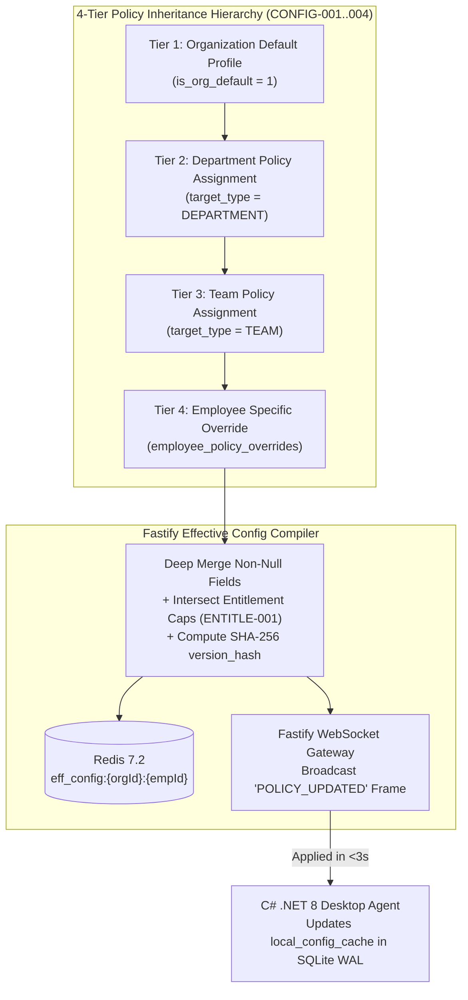

# PHASE 06: GRANULAR RBAC PERMISSION MATRIX, SENSITIVE DATA GATES, 4-TIER ADMIN CONFIGURATION ENGINE, WHITE-LABEL BRANDING & GLOBAL SETTINGS

**Document Classification:** Master Engineering & Screen-by-Screen Specification (Phase 06 of 30)  
**System:** HydiEms Enterprise Workforce Analytics, Time, Attendance & DLP Platform  
**Modules Covered:** `ADMIN-001`, `ADMIN-002`, `ADMIN-003`, `ADMIN-004`, `ADMIN-005`, `ADMIN-006`, `ADMIN-007`, `ADMIN-008`, `PERM-001`, `PERM-002`, `CONFIG-001`, `CONFIG-002`, `CONFIG-003`, `CONFIG-004`, `BRAND-001`, `BRAND-002`, `SET-001`, `SET-002`, `SET-003`, `SET-004`, `SET-005`, `SET-006`, `SET-007`, `SET-008`  
**Storage Architecture:** MySQL 8.0 InnoDB (Roles, 33-Module $\times$ 8-Verb Permission Matrix, 9 Sensitive Permission Gates, 4-Tier Configuration Profiles, Policy Assignments, White-Label Branding, Encrypted Custom SMTP, 3-Tier Timezones, Currencies, Holiday Calendars, Notification Triggers) + Redis 7.2 (`rbac:{orgId}:{roleId}`, `eff_config:{orgId}:{empId}` L2 Cache + WebSocket Pub/Sub Push) + ClickHouse 24.x (Immutable Policy & Permission Audit Ledger)

---

## 1. ARCHITECTURAL OVERVIEW & 4-TIER POLICY INHERITANCE ENGINE

Phase 06 implements the **Governance, RBAC, and Configuration Brain** of HydiEms:
1. **33-Module $\times$ 8-Verb RBAC Engine (`PERM-001` & `ADMIN-002..004`)**: Evaluates `View`, `Create`, `Edit`, `Delete`, `Export`, `Approve`, `Monitor`, and `Configure` permissions combined with a 5-level **Data Scope** (`ORG_WIDE`, `DEPARTMENT`, `REPORTING_HIERARCHY`, `ASSIGNED_PROJECTS`, `SELF_ONLY`).
2. **9 Sensitive Permission Gates (`PERM-002`)**: Enforces secondary explicit authorization + mandatory access justification + reciprocal employee transparency (`PRIV-003`) for **Screenshots, Screen Recordings, Audio Tracking, Live GPS Location, Keystroke Text Logs, DLP Incidents, HR Documents, Payroll Compensation, and AI Flight-Risk Data**.
3. **Deterministic 4-Tier Configuration Inheritance Resolver (`CONFIG-001..004` & `ADMIN-005..008`)**: Resolves every employee's effective desktop/mobile agent configuration across 4 hierarchical tiers (`Organization Default -> Department Override -> Team Override -> Individual Employee Override`) in `<1ms`, computing a deterministic SHA-256 `version_hash` pushed in real time over WebSockets to connected C# Desktop Agents.
4. **White-Label Enterprise Branding & Custom SMTP (`BRAND-001..002`)** and **Global Organization Settings (`SET-001..008`)** including the **3-Tier Timezone Resolver (`Company -> Team -> User`)**.



---

## 2. COMPLETE MYSQL 8.0 (INNODB) SCHEMAS

```sql
-- 1. Roles & 33-Module x 8-Verb Permission Matrix (ADMIN-002..004, PERM-001..002)
CREATE TABLE roles (
    id CHAR(36) PRIMARY KEY,                         -- UUIDv7
    org_id CHAR(36) NOT NULL,
    code VARCHAR(64) NOT NULL,                       -- 'CEO','ADMIN','HR','MANAGER','TEAM_LEAD','FINANCE','EMPLOYEE','AUDITOR','CLIENT' or custom
    name VARCHAR(120) NOT NULL,
    description TEXT NULL,
    data_scope ENUM('ORG_WIDE','DEPARTMENT','REPORTING_HIERARCHY','ASSIGNED_PROJECTS','SELF_ONLY') NOT NULL DEFAULT 'SELF_ONLY',
    is_system_role TINYINT(1) NOT NULL DEFAULT 0,
    require_mfa TINYINT(1) NOT NULL DEFAULT 0,
    permissions_matrix_json JSON NOT NULL,           -- { "ATTENDANCE": {"view":true,"create":false,"edit":true,"delete":false,"export":true,"approve":true,"monitor":false,"configure":false}, ... }
    sensitive_permissions_json JSON NOT NULL,        -- { "SCREENSHOTS_VIEW":true, "SCREENSHOTS_DELETE":false, "RECORDINGS_VIEW":false, "AUDIO_LISTEN":false, "GPS_VIEW":false, "KEYLOGGER_VIEW":false, "DLP_VIEW":false, "HR_DOCS_VIEW":false, "PAYROLL_VIEW":false, "AI_RISK_VIEW":false }
    require_justification_on_sensitive TINYINT(1) NOT NULL DEFAULT 1,
    created_at DATETIME(3) NOT NULL DEFAULT CURRENT_TIMESTAMP(3),
    updated_at DATETIME(3) NOT NULL DEFAULT CURRENT_TIMESTAMP(3) ON UPDATE CURRENT_TIMESTAMP(3),
    UNIQUE KEY uk_org_role_code (org_id, code),
    INDEX idx_role_org (org_id)
) ENGINE=InnoDB DEFAULT CHARSET=utf8mb4 COLLATE=utf8mb4_unicode_ci;

-- 2. Sensitive Data Access Sessions (PERM-002 Temporary Elevated Justification Grants)
CREATE TABLE sensitive_access_grants (
    id CHAR(36) PRIMARY KEY,
    org_id CHAR(36) NOT NULL,
    actor_user_id CHAR(36) NOT NULL,
    sensitive_domain ENUM('SCREENSHOTS','RECORDINGS','AUDIO','GPS_LOCATION','KEYLOGGER','DLP_INCIDENTS','HR_DOCUMENTS','PAYROLL','AI_RISK') NOT NULL,
    target_employee_id CHAR(36) NULL,                -- NULL = Team/Dept scope
    justification_reason VARCHAR(512) NOT NULL,
    ticket_or_incident_ref VARCHAR(64) NULL,
    granted_at DATETIME(3) NOT NULL DEFAULT CURRENT_TIMESTAMP(3),
    expires_at DATETIME(3) NOT NULL,                 -- Default +60 minutes
    INDEX idx_sens_grant_lookup (org_id, actor_user_id, sensitive_domain, expires_at)
) ENGINE=InnoDB;

-- 3. Master Configuration Profiles (CONFIG-001..004 & ADMIN-005..008)
CREATE TABLE configuration_profiles (
    id CHAR(36) PRIMARY KEY,
    org_id CHAR(36) NOT NULL,
    name VARCHAR(150) NOT NULL,
    description TEXT NULL,
    is_org_default TINYINT(1) NOT NULL DEFAULT 0,
    -- CONFIG-001: Tracking & Interactive Agent Permissions (Maps 1:1 to TrackingSettings.cs & TrackerInteractiveModeSettingsModel.cs)
    tracking_enabled TINYINT(1) NOT NULL DEFAULT 1,
    tracker_mode ENUM('INTERACTIVE','AUTOMATIC','SILENT_STEALTH','VISIBLE_CONTINUOUS','MANUAL','TASK_BASED') NOT NULL DEFAULT 'INTERACTIVE',
    idle_timeout_seconds SMALLINT UNSIGNED NOT NULL DEFAULT 180,
    away_cutoff_seconds SMALLINT UNSIGNED NOT NULL DEFAULT 600,
    allow_pause TINYINT(1) NOT NULL DEFAULT 1,
    allow_finish_day TINYINT(1) NOT NULL DEFAULT 1,
    allow_select_break_reasons TINYINT(1) NOT NULL DEFAULT 1,
    break_resume_reminder_mins SMALLINT UNSIGNED NOT NULL DEFAULT 15,
    eligible_for_auto_resume TINYINT(1) NOT NULL DEFAULT 1,
    allow_split_away_time TINYINT(1) NOT NULL DEFAULT 1,
    can_mark_idle_as_working TINYINT(1) NOT NULL DEFAULT 1,
    show_idle_countdown_timer TINYINT(1) NOT NULL DEFAULT 1,
    block_screens_on_idle TINYINT(1) NOT NULL DEFAULT 0,
    remove_lock_screen_from_idle TINYINT(1) NOT NULL DEFAULT 1,
    allow_personal_mode TINYINT(1) NOT NULL DEFAULT 1,
    personal_mode_max_mins SMALLINT UNSIGNED NOT NULL DEFAULT 60,
    agent_ui_view_attendance TINYINT(1) NOT NULL DEFAULT 1,
    agent_ui_view_activity TINYINT(1) NOT NULL DEFAULT 1,
    agent_ui_view_activity_level2 TINYINT(1) NOT NULL DEFAULT 1,
    agent_ui_view_detailed_activity TINYINT(1) NOT NULL DEFAULT 1,
    agent_ui_view_system_events TINYINT(1) NOT NULL DEFAULT 1,
    agent_ui_view_breaks_idle TINYINT(1) NOT NULL DEFAULT 1,
    agent_ui_view_punch_card TINYINT(1) NOT NULL DEFAULT 1,
    agent_ui_view_edit_time TINYINT(1) NOT NULL DEFAULT 1,
    agent_ui_view_my_dashboard TINYINT(1) NOT NULL DEFAULT 1,
    -- CONFIG-002: Screenshot Policy (Maps 1:1 to ScreenShotConfigModel.cs)
    screenshots_enabled TINYINT(1) NOT NULL DEFAULT 1,
    screenshots_per_hour TINYINT UNSIGNED NOT NULL DEFAULT 6,
    screenshot_randomize_interval TINYINT(1) NOT NULL DEFAULT 1,
    screenshot_quality TINYINT UNSIGNED NOT NULL DEFAULT 75,
    screenshot_scale_factor ENUM('1.0','0.75','0.5') NOT NULL DEFAULT '1.0',
    screenshot_blur_mode ENUM('NONE','PARTIAL','FULL','AUTO_SENSITIVE_REGEX') NOT NULL DEFAULT 'NONE',
    screenshot_notify_user TINYINT(1) NOT NULL DEFAULT 0,
    can_user_delete_screenshot TINYINT(1) NOT NULL DEFAULT 0,
    screenshot_working_hours_only TINYINT(1) NOT NULL DEFAULT 1,
    screenshot_excluded_apps_json JSON NULL,
    screenshot_retention_days SMALLINT UNSIGNED NOT NULL DEFAULT 30,
    -- CONFIG-003: Screen & Audio Recording Policy
    recording_enabled TINYINT(1) NOT NULL DEFAULT 0,
    recording_mode ENUM('OFF','SCHEDULED_FULL','CLIPS_2MIN','ON_DEMAND_ONLY') NOT NULL DEFAULT 'OFF',
    recording_fps TINYINT UNSIGNED NOT NULL DEFAULT 5,
    recording_quality ENUM('LOW_360P','MEDIUM_720P','HIGH_1080P') NOT NULL DEFAULT 'MEDIUM_720P',
    recording_schedule_json JSON NULL,
    recording_retention_days SMALLINT UNSIGNED NOT NULL DEFAULT 7,
    audio_tracking_enabled TINYINT(1) NOT NULL DEFAULT 0,
    audio_capture_source ENUM('OFF','MIC_ONLY','SYSTEM_LOOPBACK_ONLY','BOTH_MIC_AND_SYSTEM') NOT NULL DEFAULT 'OFF',
    audio_require_consent TINYINT(1) NOT NULL DEFAULT 1,
    audio_notify_indicator TINYINT(1) NOT NULL DEFAULT 1,
    audio_retention_days SMALLINT UNSIGNED NOT NULL DEFAULT 7,
    -- CONFIG-004: Attendance Thresholds Policy
    expected_work_day_mins SMALLINT UNSIGNED NOT NULL DEFAULT 480,   -- 8h 00m
    full_day_min_mins SMALLINT UNSIGNED NOT NULL DEFAULT 450,        -- 7h 30m
    half_day_min_mins SMALLINT UNSIGNED NOT NULL DEFAULT 240,        -- 4h 00m
    absent_threshold_mins SMALLINT UNSIGNED NOT NULL DEFAULT 240,    -- < 4h 00m = ABSENT
    late_grace_period_mins TINYINT UNSIGNED NOT NULL DEFAULT 15,
    overtime_min_trigger_mins SMALLINT UNSIGNED NOT NULL DEFAULT 30,
    undertime_tolerance_mins TINYINT UNSIGNED NOT NULL DEFAULT 30,
    count_idle_in_attendance TINYINT(1) NOT NULL DEFAULT 0,
    -- ADMIN-008: Privacy & Telemetry Switches
    track_applications TINYINT(1) NOT NULL DEFAULT 1,
    track_window_titles TINYINT(1) NOT NULL DEFAULT 1,
    track_urls TINYINT(1) NOT NULL DEFAULT 1,
    track_search_queries TINYINT(1) NOT NULL DEFAULT 1,
    track_keyboard_mouse_intensity TINYINT(1) NOT NULL DEFAULT 1,
    track_keylogger_text TINYINT(1) NOT NULL DEFAULT 0,
    track_gps_location TINYINT(1) NOT NULL DEFAULT 0,
    can_manager_edit_team_config TINYINT(1) NOT NULL DEFAULT 0,
    can_manager_edit_timesheet TINYINT(1) NOT NULL DEFAULT 1,
    version_hash CHAR(64) NOT NULL,
    updated_at DATETIME(3) NOT NULL DEFAULT CURRENT_TIMESTAMP(3) ON UPDATE CURRENT_TIMESTAMP(3),
    INDEX idx_cfg_org (org_id, is_org_default)
) ENGINE=InnoDB;

-- 4. Policy Assignments to Departments & Teams
CREATE TABLE configuration_profile_assignments (
    id CHAR(36) PRIMARY KEY,
    org_id CHAR(36) NOT NULL,
    profile_id CHAR(36) NOT NULL,
    target_type ENUM('DEPARTMENT','TEAM','ROLE') NOT NULL,
    target_id CHAR(36) NOT NULL,
    assigned_by_user_id CHAR(36) NOT NULL,
    created_at DATETIME(3) NOT NULL DEFAULT CURRENT_TIMESTAMP(3),
    UNIQUE KEY uk_org_target (org_id, target_type, target_id)
) ENGINE=InnoDB;

-- 5. White-Label Branding & Custom SMTP (BRAND-001 & BRAND-002)
CREATE TABLE org_branding_and_smtp (
    org_id CHAR(36) PRIMARY KEY,
    portal_name VARCHAR(120) NOT NULL DEFAULT 'HydiEms',
    custom_domain VARCHAR(255) NULL UNIQUE,
    logo_light_s3_key VARCHAR(512) NULL,
    logo_dark_s3_key VARCHAR(512) NULL,
    favicon_s3_key VARCHAR(512) NULL,
    login_banner_s3_key VARCHAR(512) NULL,
    primary_color_hex CHAR(7) NOT NULL DEFAULT '#1A4CFF',
    secondary_color_hex CHAR(7) NOT NULL DEFAULT '#0B1139',
    email_header_logo_s3_key VARCHAR(512) NULL,
    email_footer_markdown TEXT NULL,
    hide_powered_by_hydiems TINYINT(1) NOT NULL DEFAULT 0,
    -- BRAND-002 Custom SMTP
    smtp_enabled TINYINT(1) NOT NULL DEFAULT 0,
    smtp_host VARCHAR(255) NULL,
    smtp_port SMALLINT UNSIGNED NULL DEFAULT 587,
    smtp_username VARCHAR(255) NULL,
    smtp_password_encrypted TEXT NULL,               -- AES-256-GCM
    smtp_encryption ENUM('STARTTLS','SSL_TLS','NONE') NOT NULL DEFAULT 'STARTTLS',
    smtp_sender_name VARCHAR(120) NULL,
    smtp_sender_email VARCHAR(255) NULL,
    smtp_last_tested_at DATETIME(3) NULL,
    smtp_last_test_status ENUM('UNTESTED','SUCCESS','FAILED') NOT NULL DEFAULT 'UNTESTED',
    updated_at DATETIME(3) NOT NULL DEFAULT CURRENT_TIMESTAMP(3) ON UPDATE CURRENT_TIMESTAMP(3)
) ENGINE=InnoDB;

-- 6. Organization Notification Triggers (SET-007 / NotificationsModel.cs)
CREATE TABLE org_notification_triggers (
    org_id CHAR(36) PRIMARY KEY,
    work_start_notification_enabled TINYINT(1) NOT NULL DEFAULT 1,
    idle_time_notification_frequency_mins SMALLINT UNSIGNED NOT NULL DEFAULT 30,
    tracker_pause_notification_enabled TINYINT(1) NOT NULL DEFAULT 1,
    tracker_resume_notification_enabled TINYINT(1) NOT NULL DEFAULT 0,
    task_start_stop_notification_enabled TINYINT(1) NOT NULL DEFAULT 0,
    suspicious_activity_notification_enabled TINYINT(1) NOT NULL DEFAULT 1,
    daily_summary_report_enabled TINYINT(1) NOT NULL DEFAULT 1,
    daily_summary_send_time TIME NOT NULL DEFAULT '20:00:00',
    weekly_summary_report_enabled TINYINT(1) NOT NULL DEFAULT 1,
    weekly_summary_day_of_week TINYINT UNSIGNED NOT NULL DEFAULT 1,  -- 1 = Monday
    updated_at DATETIME(3) NOT NULL DEFAULT CURRENT_TIMESTAMP(3) ON UPDATE CURRENT_TIMESTAMP(3)
) ENGINE=InnoDB;
```

---

## 3. SCREEN-BY-SCREEN 15-POINT SPECIFICATIONS

---

### Screen `ADMIN-001` — Administration Command Dashboard
1. **Screen ID, Title & Route**: `ADMIN-001` — Administration Dashboard | Route: `/admin`.
2. **Purpose, Target Roles & Permission**: Executive control hub summarizing Roles & Permissions, Active Monitoring Profiles, Productivity Rules, Data Retention Compliance, Privacy Posture, White-Label Status, and Recent Admin Config Changes. Roles: `ADMIN`, `CEO`, `AUDITOR` (read-only). Permission: `PERM_ADMIN_DASHBOARD_VIEW`.
3. **UI Components**:
   * **6 Governance KPI Cards**: `Active Roles (9 System + N Custom)` | `Monitoring Profiles` | `Sensitive Permission Holders Count` | `Storage & Retention Health` | `Privacy Transparency Score (%)` | `Connected Agents on Latest Config (%)`.
   * **Quick Configuration Cards Grid**: Direct jump cards to `Roles (ADMIN-002)`, `Permission Matrix (PERM-001)`, `Sensitive Access (PERM-002)`, `Monitoring Policies (CONFIG-001..004)`, `Productivity Policies (ADMIN-006)`, `Data Retention (ADMIN-007)`, `Privacy Controls (ADMIN-008)`, and `White-Label & SMTP (BRAND-001..002)`.
   * **Recent Administrative Changes Feed**: Live table of last 25 policy/role modifications from `AUDIT-002` with `[View Diff]` modal.
4. **Actions**: Navigate to sub-modules, inspect policy diff JSON, export complete Organization Governance Snapshot PDF for SOC 2 / ISO 27001 auditors.
5. **Filters, Search, Sort & Pagination**: Search settings by keyword (e.g., `"blur"`, `"idle timeout"`, `"grace period"`, `"SMTP"`); filter recent changes by Admin User or Module.
6. **UI States**: Loading skeleton, Empty audit state, Error banner, Offline indicator, `403` Permission Denied.
7. **Validation & Business Rules**: Displays a prominent warning badge if any high-risk permission (`SENSITIVE_KEYSTROKES_TEXT_VIEW` or `SENSITIVE_AUDIO_LISTEN`) is enabled without `require_justification_on_sensitive = 1`.
8. **Audit Events (`AUDIT-002`)**: `admin.governance_snapshot.exported`.
9. **API Endpoints**: `GET /api/v1/admin/overview`, `POST /api/v1/admin/export-governance-report`.
10. **Acceptance Criteria**: Searching `"blur"` in the `ADMIN-001` settings search bar immediately deep-links to `CONFIG-002 -> Screenshot Blur Mode`.

---

### Screens `ADMIN-002`, `ADMIN-003`, `ADMIN-004` & `PERM-001` — Roles, Role Detail & 33-Module Permission Matrix
1. **Screen IDs & Routes**:
   * `ADMIN-002`: `/admin/roles` (Roles Directory)
   * `ADMIN-004`: `/admin/roles/:roleId` (Role Detail, Data Scope & Assigned Users)
   * `ADMIN-003` & `PERM-001`: `/admin/permissions` (Interactive 33-Module $\times$ 8-Verb $\times$ Role Matrix)
2. **Purpose, Target Roles & Permission**: Manage the 9 built-in personas (`CEO`, `Admin`, `HR`, `Manager`, `Team Lead`, `Finance`, `Employee`, `Auditor`, `Client`) and create custom roles (e.g., `BPO QA Analyst`, `Regional HRBP`, `Security Officer`) with exact `Data Scope` and verb-level permissions. Roles: `ADMIN`. Permission: `PERM_RBAC_MANAGE`.
3. **UI Components**:
   * **`ADMIN-002` Table**: `Role Name`, `Role Code`, `System vs Custom Badge`, `Data Scope Badge (Org-Wide / Dept / Hierarchy / Project / Self)`, `MFA Required Toggle`, `Assigned Users Count`, `Actions ([View/Edit], [Clone Role], [Delete Custom Role])`.
   * **`PERM-001` Interactive Matrix Grid**:
     * Sticky Left Column: All **33 Product Modules** grouped by the 6 Core Engines.
     * Role Selector Tabs along top + **8 Verb Checkboxes per cell** (`View`, `Create`, `Edit`, `Delete`, `Export`, `Approve`, `Monitor`, `Configure`).
     * Includes `[Compare 2 Roles]`, `[Reset to System Default]`, and `[Save & Broadcast RBAC Changes]`.
   * **`ADMIN-004` Role Detail**: Tabs for `1. General & Data Scope`, `2. Module Permissions (PERM-001)`, `3. Sensitive Data Gates (PERM-002)`, and `4. Assigned Employees` (with bulk assign/remove).
4. **Validation & Business Rules**:
   * Built-in `ADMIN` role cannot have `PERM_RBAC_MANAGE` revoked (prevents organizational self-lockout).
   * System roles (`is_system_role = 1`) cannot be deleted, only cloned or customized within allowed bounds.
   * Checking `Edit`, `Delete`, `Export`, `Approve`, `Monitor`, or `Configure` automatically checks `View` for that module.
5. **Notifications & Real-Time Events**: Saving changes invalidates Redis `rbac:{orgId}:{roleId}` and pushes `RBAC_UPDATED` via WebSocket so open browser sessions immediately refresh their sidebar and action buttons.
6. **Audit Events (`AUDIT-002`)**: `rbac.role.created`, `rbac.role.updated`, `rbac.permission_matrix.modified` (logs exact JSON diff of added/removed verbs), `rbac.role.deleted`.
7. **API Endpoints**: `GET/POST /api/v1/admin/roles`, `GET/PUT/DELETE /api/v1/admin/roles/:roleId`, `PUT /api/v1/admin/permissions/matrix`.
8. **Acceptance Criteria**: Revoking `Export` on `Attendance` for `MANAGER` in `PERM-001` hides the `[Export CSV/XLSX/PDF]` button on `ATT-001` for all logged-in Managers within 2 seconds and blocks `POST /api/v1/exports` with `403 Forbidden`.

---

### Screen `PERM-002` — Sensitive Data Permissions & Access Justification Gate
1. **Screen ID, Title & Route**: `PERM-002` — Sensitive Permissions | Route: `/admin/permissions/sensitive`.
2. **Purpose, Target Roles & Permission**: Strict secondary access control over the **9 High-Privacy Data Domains**:
   1. `Screenshots` (`View`, `Manual Capture`, `Delete`)
   2. `Screen Recordings` (`View Clips`, `Trigger On-Demand`)
   3. `Audio Tracking` (`Listen to Mic/System Audio`)
   4. `Live GPS & Field Location` (`View Live Map & Route History`)
   5. `Keystrokes Data` (`View Typed Keylogger Text`)
   6. `DLP & Insider Threat Incidents` (`View File/Clipboard/Print Evidence`)
   7. `Employee HR Documents` (`View ID/Contract/Medical Docs`)
   8. `Payroll & Compensation` (`View Salaries, Rates & Payslips`)
   9. `AI Flight-Risk & Burnout Data` (`View Individual Attrition Scores`)
3. **UI Components**:
   * **9 Domain Cards**: Each shows which Roles and Individual Users currently hold access, toggle for **`[x] Require Mandatory Justification Reason Before Viewing`**, toggle for **`[x] Notify Employee in Privacy Center (PRIV-003) When Accessed`**, and Session Elevation Duration (`15m`, `60m`, `4h`).
   * **Active Elevated Access Grants Table**: Live table of managers/admins currently holding an active `sensitive_access_grants` session with `[Revoke Access Immediately]` button.
4. **Business Rules**:
   * When `require_justification_on_sensitive = 1`, clicking to view an employee's Audio Recording, Keylogger log, or DLP shadow copy pops up a **Mandatory Access Justification Modal** (`Reason`, `Incident/Ticket ID`). Submitting creates a `60-minute` grant in `sensitive_access_grants` and writes an immutable entry to `AUDIT-002` and `PRIV-003`.
5. **API Endpoints**: `GET/PUT /api/v1/admin/permissions/sensitive`, `POST /api/v1/security/sensitive-access/elevate`, `DELETE /api/v1/security/sensitive-access/:grantId`.
6. **Acceptance Criteria**: Even a user with `ADMIN` role is prompted for a mandatory justification reason before playing an audio recording in `AUDIO-005` when `require_justification_on_sensitive` is enabled.

---

### Screens `ADMIN-005`, `ADMIN-006`, `ADMIN-007`, `ADMIN-008` & `CONFIG-001..004` — Centralized Admin Configuration Engine
1. **Screen IDs & Routes**:
   * `ADMIN-005`: `/admin/policies/monitoring` (Monitoring Policy Profiles List & Assignment Matrix)
   * `CONFIG-001`: `/admin/policies/monitoring/:profileId/tracking` (Tracking & 16 Interactive Agent UI Controls)
   * `CONFIG-002`: `/admin/policies/monitoring/:profileId/screenshots` (Screenshot Frequency, Blur, Exclusions & Delete Policy)
   * `CONFIG-003`: `/admin/policies/monitoring/:profileId/recordings` (Screen Recording & Audio Tracking Policy)
   * `CONFIG-004`: `/admin/policies/monitoring/:profileId/attendance` (Full-Day, Half-Day, Absent, Late Grace & Overtime Thresholds)
   * `ADMIN-006`: `/admin/policies/productivity` (Productivity Policy Profiles — links to `PROD-006`)
   * `ADMIN-007`: `/admin/policies/retention` (Granular Retention Days per Telemetry Type)
   * `ADMIN-008`: `/admin/policies/privacy` (Master Privacy & Telemetry Collection Switches)
2. **Purpose, Target Roles & Permission**: One unified configuration engine governing how the Desktop & Mobile Agents behave across the organization, departments, teams, and individuals. Roles: `ADMIN` (plus `MANAGER` for team-scoped overrides only if `can_manager_edit_team_config = 1`). Permission: `PERM_POLICY_CONFIGURE`.
3. **UI Components**:
   * **Profile Selector & Assignment Sidebar (`ADMIN-005`)**: Create named profiles (e.g., *Default Hybrid*, *BPO Contact Center*, *Executive No-Screenshots*, *Contractors Strict*) and assign them to Departments, Teams, or Employees, plus an **"Inspect Effective Policy for Employee"** simulator dropdown!
   * **Tab 1 — `CONFIG-001` (Tracking Configuration)**:
     * Master `Enable Tracking` switch; `Tracker Mode` selector (`Interactive`, `Automatic`, `Silent/Stealth`, `Visible Continuous`, `Manual`, `Task-Based`).
     * `Idle Timeout (mins)` slider (`1–60m`, default `3m`); `Away Cutoff (mins)` (`5–120m`, default `10m`).
     * Away & Break controls: `Allow Pause`, `Allow Finish Day`, `Require Break Reason`, `Break Resume Reminder (mins)`, `Auto-Resume on Input`, `Allow Split Away Time`, `Allow Mark Idle as Working`, `Show Idle Countdown`, `Block Screens on Idle`, `Exclude OS Lock Screen from Idle`, `Allow Personal Mode` + `Max Personal Mode Duration (mins)`.
     * **16 Interactive Agent UI Visibility Checkboxes**: Controls whether the employee can see `Attendance`, `Activity`, `Level-2 Window Titles`, `Detailed Timeline`, `System Events`, `Breaks/Idle`, `Punch Card`, `Edit Time`, and `My Dashboard` inside the Desktop Agent.
   * **Tab 2 — `CONFIG-002` (Screenshot Configuration)**:
     * `Enable Screenshots`, `Frequency (1x, 2x, 3x, 4x, 6x, 10x, 12x/hr)` (capped by `ENTITLE-001`), `Randomize Interval within Slot`, `WebP Quality (50–95%)`, `Resolution Scale (1.0x / 0.75x / 0.5x)`.
     * **Privacy Blur Mode**: `No Blur`, `Partial Blur (8px Gaussian)`, `Full Blur (20px)`, or **`Auto Sensitive Regex Blur`** (automatically blurs screenshot if active Window Title or URL matches banking, medical, password manager, or HR patterns!).
     * `Notify User on Capture (Toast)`, `Allow Employee to Delete Own Screenshot` *(with automatic 5-min work time deduction warning)*, `Capture During Working Hours Only`, `Excluded Applications/Domains List`.
   * **Tab 3 — `CONFIG-003` (Recording & Audio Configuration)**:
     * `Enable Screen Recording`, `Mode (Scheduled Full Shift / 2-Min Clips / On-Demand Only)`, `FPS (2 / 5 / 10)`, `Quality (360p / 720p / 1080p)`, `Shift Schedule Window`.
     * **Audio Tracking**: `Enable Audio Tracking`, `Source (Mic Only / System Audio Only / Both)`, `Require Explicit Employee Consent (PRIV-004)`, `Show Persistent Recording Indicator`.
   * **Tab 4 — `CONFIG-004` (Attendance Thresholds Configuration)**:
     * `Expected Working Day (e.g. 8h 00m)`, `Full-Day Minimum Threshold (e.g. 7h 30m)`, `Half-Day Minimum Threshold (e.g. 4h 00m)`, `Absent Threshold (< 4h 00m)`, `Late Login Grace Period (e.g. 15m)`, `Minimum Overtime Trigger (e.g. +30m)`, `Undertime Tolerance (e.g. 30m)`, `Count Unapproved Idle Time in Attendance (Yes/No)`.
   * **Tab 5 — `ADMIN-007` (Data Retention)**:
     * Independent retention sliders (capped by purchased `ENTITLE-001` Retention Add-Ons) for `Activity Logs (30d–365d)`, `Screenshots (7d–365d)`, `Screen Recordings (7d–90d)`, `Audio Recordings (7d–90d)`, and `Audit Logs (365d–7 Years)` + `Auto-Archive to Cold S3/FTP before Purge` toggle.
   * **Tab 6 — `ADMIN-008` (Privacy Settings)**:
     * Master organization-level switches to enable/disable collection of `Screenshots`, `Screen Recordings`, `Audio`, `URLs`, `Applications`, `Window Titles`, `GPS Location`, `Keyboard/Mouse Intensity`, and `Keylogger Text`.
4. **Validation & Business Rules**:
   * **Mathematical Invariant Validation**: `0 < absent_threshold_mins <= half_day_min_mins < full_day_min_mins <= expected_work_day_mins <= 1440` and `60 <= idle_timeout_seconds < away_cutoff_seconds`.
   * **Entitlement Clamping**: Cannot set `screenshots_per_hour > EffectiveEntitlements.SCREENSHOTS_MAX_PER_HOUR` or enable `audio_tracking_enabled` if `EffectiveEntitlements.AUDIO_TRACKING == false`.
5. **Real-Time Agent Sync**: Updating any `configuration_profiles` row recomputes `version_hash = SHA256(canonicalJson)`, invalidates Redis `eff_config:{orgId}:*`, and broadcasts `POLICY_UPDATED` over WebSockets to all affected Desktop & Mobile Agents.
6. **Audit Events (`AUDIT-002`)**: `config.profile.created`, `config.profile.updated`, `config.profile.assigned`, `config.retention.modified`, `config.privacy.modified`.
7. **API Endpoints**:
   * `GET/POST /api/v1/admin/config-profiles`
   * `GET/PUT/DELETE /api/v1/admin/config-profiles/:profileId`
   * `POST /api/v1/admin/config-profiles/:profileId/assign`
   * `GET /api/v1/admin/config-profiles/effective/:employeeId`
8. **Acceptance Criteria**:
   * Using the **"Inspect Effective Policy for Employee"** tool shows the exact merged JSON and highlights which tier (`Org`, `Dept`, `Team`, or `Employee Override`) contributed each setting.

---

### Screens `BRAND-001..002` & `SET-001..008` — Enterprise White-Label Branding, Custom SMTP & Global Settings
1. **Screen IDs & Routes**:
   * `BRAND-001`: `/admin/branding` (White-Label Portal, Logos, Colors & Custom Domain)
   * `BRAND-002`: `/admin/branding/smtp` (Custom Email / SMTP Server Configuration & Live Tester)
   * `SET-001`: `/settings/general` (General Organization Preferences, Date/Time Format, Week Start Day)
   * `SET-002`: `/settings/timezone` (3-Tier Timezone Configuration: Company Default, Team Overrides, User Overrides)
   * `SET-003`: `/settings/currency` (Base Currency & Multi-Currency Exchange Rates for Client Billing & Payroll)
   * `SET-004`: `/settings/working-hours` (Organization Default Working Days & Core Hours)
   * `SET-005`: `/settings/holidays` (Multi-Location Public & Floating Holiday Calendars)
   * `SET-006`: `/settings/email` (Email Templates & Digest Branding)
   * `SET-007`: `/settings/notifications` (8 Automated Manager/Admin Email & Push Triggers from [`NotificationsModel.cs`](file:///c:/Users/suppo/Downloads/hydiEMS/timechampe/timechampe/TimeChamp.Tracker.Core/ConfigComponent/Models/NotificationsModel.cs))
   * `SET-008`: `/settings/security` (Password Complexity, Session Idle Timeout, 2FA Enforcement, API Key Expiry)
2. **UI Components & Key Features**:
   * **`BRAND-001`**: Upload `Light Logo`, `Dark Logo`, `Favicon`, and `Login Page Hero Image`; pick `Primary Brand Color` and `Secondary Color` with live WCAG AA contrast checker; configure `Portal Name` and `Custom CNAME Domain` (auto-triggers `SA-6` Let's Encrypt SSL provisioning!).
   * **`BRAND-002`**: Configure `SMTP Host`, `Port (587/465/25)`, `Username`, `Password (masked, encrypted at rest with AES-256-GCM)`, `Encryption (STARTTLS / SSL-TLS)`, `Sender Name`, `Sender Email`, and click **`[Send Test Email]`** to view real-time SMTP handshake logs (`EHLO -> STARTTLS -> AUTH -> 250 OK`).
   * **`SET-002` (3-Tier Timezone Engine)**:
     * Configures whether the organization operates on a single `Company Timezone` or allows `Team-Level Timezones` and `User-Level Timezones`.
     * All timestamps in ClickHouse and MySQL are stored in **strict UTC (`DateTime64(3, 'UTC')`)** and converted at query/render time using the resolved 3-tier IANA timezone (`User.timezone ?? Team.default_timezone ?? Dept.default_timezone ?? Org.default_timezone`).
   * **`SET-007` (8 Automated Notification Triggers)**:
     * Toggles matching [`NotificationsModel.cs`](file:///c:/Users/suppo/Downloads/hydiEMS/timechampe/timechampe/TimeChamp.Tracker.Core/ConfigComponent/Models/NotificationsModel.cs): `Work Start Alert`, `Idle Time Alert Frequency (mins)`, `Tracker Pause Alert`, `Tracker Resume Alert`, `Task Start/Stop Alert`, `Suspicious Activity Instant Alert`, `Daily Summary Report Email`, and `Weekly Summary Report Email`.
3. **API Endpoints**:
   * `GET/PUT /api/v1/admin/branding`
   * `GET/PUT /api/v1/admin/branding/smtp` & `POST /api/v1/admin/branding/smtp/test`
   * `GET/PUT /api/v1/settings/:section` (`general`, `timezone`, `currency`, `working-hours`, `holidays`, `email`, `notifications`, `security`)
4. **Acceptance Criteria**:
   * Updating `Primary Brand Color` and `Portal Name` in `BRAND-001` immediately updates CSS custom variables (`--primary`) across the web app, login screen (`AUTH-001`), and outgoing HTML emails.
   * Clicking `[Send Test Email]` in `BRAND-002` dispatches a test email through the tenant's SMTP server and records `smtp_last_test_status = 'SUCCESS'` only upon receiving SMTP `250 OK`.
