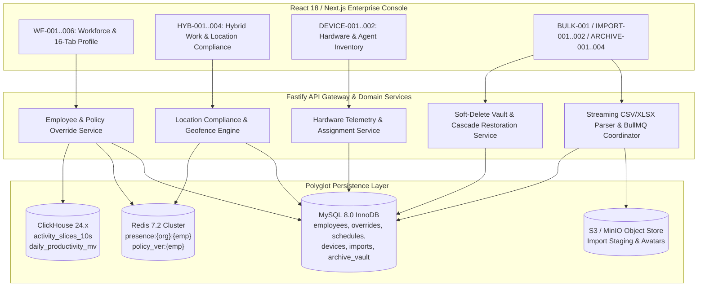

# PHASE 07: WORKFORCE DIRECTORY, 16-TAB EMPLOYEE PROFILE, HYBRID WORK COMPLIANCE, HARDWARE INVENTORY & BULK OPERATIONS ENGINE

**Document Classification:** Master Engineering & Screen-by-Screen Specification (Phase 07 of 12)  
**System:** HydiEms Enterprise Workforce Analytics, Time, Attendance & DLP Platform  
**Storage Architecture:** MySQL 8.0 InnoDB (OLTP & Identity) + ClickHouse 24.x (High-Velocity Telemetry Rollups) + Redis 7.2 (Real-Time Presence & Distributed Locks) + S3/MinIO (Pre-Signed Media & Import Artifacts)  
**Backend Runtime:** Fastify 4.x (TypeScript 5.x, Prisma/Kysely SQL Builder, BullMQ Worker Fleet)  

---

## 1. ARCHITECTURAL OVERVIEW & SUBSYSTEM TOPOLOGY

Phase 07 governs the core identity, organizational hierarchy, hybrid work location compliance, physical/virtual endpoint hardware inventory, high-throughput CSV/XLSX bulk import pipelines, and soft-delete archival lifecycle for the entire HydiEms platform.



---

## 2. COMPLETE MYSQL 8.0 INNODB DDL SCHEMA (PHASE 07)

All tables enforce strict multi-tenant isolation via `org_id BINARY(16)` (UUIDv7 ordered binary), foreign key constraints, optimistic concurrency control (`row_version INT UNSIGNED`), and soft-delete semantics (`deleted_at DATETIME(3)`).

```sql
-- ============================================================================
-- 1. EMPLOYEES MASTER TABLE
-- ============================================================================
CREATE TABLE IF NOT EXISTS employees (
    id BINARY(16) NOT NULL COMMENT 'UUIDv7 primary key',
    org_id BINARY(16) NOT NULL COMMENT 'Tenant Organization UUIDv7',
    user_id BINARY(16) NULL COMMENT 'Linked auth_users.id if interactive login enabled',
    employee_code VARCHAR(64) NOT NULL COMMENT 'Human-readable badge/HRIS ID (e.g., EMP-1042)',
    first_name VARCHAR(100) NOT NULL,
    last_name VARCHAR(100) NOT NULL,
    display_name VARCHAR(200) GENERATED ALWAYS AS (CONCAT(first_name, ' ', last_name)) VIRTUAL,
    email VARCHAR(255) NOT NULL,
    phone_e164 VARCHAR(24) NULL,
    avatar_s3_key VARCHAR(512) NULL,
    
    -- Organizational Hierarchy & Categorization
    department_id BINARY(16) NOT NULL,
    team_id BINARY(16) NULL,
    designation_id BINARY(16) NULL,
    manager_id BINARY(16) NULL COMMENT 'Self-referencing employees.id for reporting line',
    employment_type ENUM('FULL_TIME', 'PART_TIME', 'CONTRACTOR', 'INTERN', 'FREELANCER', 'VENDOR') NOT NULL DEFAULT 'FULL_TIME',
    work_arrangement ENUM('OFFICE', 'REMOTE', 'HYBRID', 'FIELD') NOT NULL DEFAULT 'OFFICE',
    
    -- Base Location, Timezone & Schedule Bindings
    primary_location_id BINARY(16) NULL COMMENT 'FK to org_locations.id',
    iana_timezone VARCHAR(64) NOT NULL DEFAULT 'UTC' COMMENT 'Validated against IANA tzdb (e.g., Asia/Kolkata, America/New_York)',
    default_shift_id BINARY(16) NULL COMMENT 'FK to shifts.id',
    productivity_policy_id BINARY(16) NULL COMMENT 'FK to productivity_policies.id',
    monitoring_policy_id BINARY(16) NULL COMMENT 'FK to monitoring_policies.id',
    
    -- Financial & Billing Metadata
    hourly_cost_cents BIGINT UNSIGNED NOT NULL DEFAULT 0,
    hourly_billable_cents BIGINT UNSIGNED NOT NULL DEFAULT 0,
    currency_code CHAR(3) NOT NULL DEFAULT 'USD',
    
    -- Lifecycle & Archival State
    lifecycle_status ENUM('INVITED', 'ONBOARDING', 'ACTIVE', 'ON_LEAVE', 'SUSPENDED', 'NOTICE_PERIOD', 'ARCHIVED', 'TERMINATED') NOT NULL DEFAULT 'INVITED',
    joining_date DATE NOT NULL,
    probation_end_date DATE NULL,
    exit_date DATE NULL,
    
    -- Policy Synchronization Counter (Incremented on any override/group policy change)
    policy_version BIGINT UNSIGNED NOT NULL DEFAULT 1,
    row_version INT UNSIGNED NOT NULL DEFAULT 1,
    
    created_by BINARY(16) NOT NULL,
    created_at DATETIME(3) NOT NULL DEFAULT CURRENT_TIMESTAMP(3),
    updated_at DATETIME(3) NOT NULL DEFAULT CURRENT_TIMESTAMP(3) ON UPDATE CURRENT_TIMESTAMP(3),
    deleted_at DATETIME(3) NULL,
    
    PRIMARY KEY (id),
    UNIQUE KEY uq_emp_org_code (org_id, employee_code),
    UNIQUE KEY uq_emp_org_email (org_id, email),
    KEY idx_emp_org_dept_status (org_id, department_id, lifecycle_status, deleted_at),
    KEY idx_emp_org_team (org_id, team_id, deleted_at),
    KEY idx_emp_org_manager (org_id, manager_id),
    KEY idx_emp_org_work_mode (org_id, work_arrangement, lifecycle_status),
    CONSTRAINT fk_emp_manager FOREIGN KEY (manager_id) REFERENCES employees (id) ON DELETE SET NULL
) ENGINE=InnoDB DEFAULT CHARSET=utf8mb4 COLLATE=utf8mb4_0900_ai_ci;

-- ============================================================================
-- 2. EMPLOYEE GRANULAR POLICY OVERRIDES (WF-006)
-- ============================================================================
CREATE TABLE IF NOT EXISTS employee_policy_overrides (
    id BINARY(16) NOT NULL,
    org_id BINARY(16) NOT NULL,
    employee_id BINARY(16) NOT NULL,
    
    -- Nullable fields inherit from Department -> Organization policy when NULL
    tracker_mode_override ENUM('INTERACTIVE', 'AUTOMATIC', 'SILENT_STEALTH', 'VISIBLE', 'MANUAL', 'TASK_BASED') NULL,
    idle_timeout_seconds_override SMALLINT UNSIGNED NULL COMMENT 'Range: 60..3600 seconds',
    
    -- Screenshot Overrides
    screenshot_enabled_override BOOLEAN NULL,
    screenshot_interval_seconds_override SMALLINT UNSIGNED NULL COMMENT 'e.g., 180, 300, 600',
    screenshot_blur_mode_override ENUM('NONE', 'LOW_4PX', 'HIGH_12PX', 'SENSITIVE_APPS_ONLY') NULL,
    screenshot_allow_user_delete_override BOOLEAN NULL,
    
    -- Screen Recording & Audio Overrides
    video_recording_enabled_override BOOLEAN NULL,
    video_fps_override TINYINT UNSIGNED NULL COMMENT '1, 2, 5, 10 FPS',
    video_Bitrate_kbps_override SMALLINT UNSIGNED NULL COMMENT '150..1500 kbps',
    audio_recording_mode_override ENUM('DISABLED', 'MIC_ONLY', 'LOOPBACK_ONLY', 'MIC_AND_LOOPBACK') NULL,
    
    -- Keystroke & DLP Overrides
    keylogger_text_enabled_override BOOLEAN NULL,
    clipboard_monitoring_override BOOLEAN NULL,
    usb_storage_policy_override ENUM('ALLOW', 'READ_ONLY', 'BLOCK', 'AUDIT_ONLY') NULL,
    
    -- Personal Mode & Manual Time Overrides
    allow_personal_mode_override BOOLEAN NULL,
    max_personal_mode_mins_per_day_override SMALLINT UNSIGNED NULL,
    allow_manual_time_entry_override BOOLEAN NULL,
    
    -- JSON Map of Per-Employee App/Domain Classification Overrides
    -- Format: [{"identifier": "figma.exe", "matchType": "PROCESS", "classification": "PRODUCTIVE", "scoreWeight": 1.0}]
    custom_app_classifications_json JSON NULL,
    
    -- Temporary Override Expiration (Auto-reverts when expires_at < NOW())
    effective_from DATETIME(3) NOT NULL DEFAULT CURRENT_TIMESTAMP(3),
    expires_at DATETIME(3) NULL,
    override_reason VARCHAR(500) NOT NULL,
    approved_by BINARY(16) NOT NULL,
    
    created_at DATETIME(3) NOT NULL DEFAULT CURRENT_TIMESTAMP(3),
    updated_at DATETIME(3) NOT NULL DEFAULT CURRENT_TIMESTAMP(3) ON UPDATE CURRENT_TIMESTAMP(3),
    
    PRIMARY KEY (id),
    UNIQUE KEY uq_emp_override_active (org_id, employee_id),
    CONSTRAINT fk_override_emp FOREIGN KEY (employee_id) REFERENCES employees (id) ON DELETE CASCADE
) ENGINE=InnoDB DEFAULT CHARSET=utf8mb4 COLLATE=utf8mb4_0900_ai_ci;

-- ============================================================================
-- 3. HYBRID WORK LOCATION SCHEDULES & ACTUAL TELEMETRY LOGS (HYB-001..004)
-- ============================================================================
CREATE TABLE IF NOT EXISTS org_work_locations (
    id BINARY(16) NOT NULL,
    org_id BINARY(16) NOT NULL,
    location_code VARCHAR(32) NOT NULL,
    name VARCHAR(150) NOT NULL,
    location_type ENUM('HQ_OFFICE', 'BRANCH_OFFICE', 'COWORKING_HUB', 'CLIENT_SITE') NOT NULL DEFAULT 'HQ_OFFICE',
    allowed_public_cidrs JSON NOT NULL COMMENT 'Array of CIDR strings e.g. ["203.0.113.0/24", "198.51.100.42/32"]',
    allowed_wifi_bssids JSON NOT NULL COMMENT 'Array of MAC BSSIDs or SSIDs e.g. [{"ssid":"HydiCorp-5G","bssid":"aa:bb:cc:dd:ee:ff"}]',
    latitude DECIMAL(10, 7) NULL,
    longitude DECIMAL(10, 7) NULL,
    geofence_radius_meters SMALLINT UNSIGNED NOT NULL DEFAULT 250,
    is_active BOOLEAN NOT NULL DEFAULT TRUE,
    created_at DATETIME(3) NOT NULL DEFAULT CURRENT_TIMESTAMP(3),
    PRIMARY KEY (id),
    UNIQUE KEY uq_org_loc_code (org_id, location_code)
) ENGINE=InnoDB DEFAULT CHARSET=utf8mb4 COLLATE=utf8mb4_0900_ai_ci;

CREATE TABLE IF NOT EXISTS work_location_schedules (
    id BINARY(16) NOT NULL,
    org_id BINARY(16) NOT NULL,
    employee_id BINARY(16) NOT NULL,
    work_date DATE NOT NULL,
    expected_mode ENUM('OFFICE', 'REMOTE', 'FIELD', 'ON_LEAVE', 'HOLIDAY') NOT NULL,
    expected_office_location_id BINARY(16) NULL COMMENT 'Required if expected_mode = OFFICE',
    
    -- Actual Resolved Telemetry from Desktop/Mobile Agent
    actual_detected_mode ENUM('OFFICE', 'REMOTE', 'FIELD', 'UNVERIFIED', 'ABSENT') NULL,
    matched_office_location_id BINARY(16) NULL,
    verification_signal ENUM('PUBLIC_IP_CIDR', 'WIFI_BSSID', 'GPS_GEOFENCE', 'MANUAL_OVERRIDE', 'NONE') NOT NULL DEFAULT 'NONE',
    detected_public_ip VARCHAR(45) NULL,
    detected_wifi_ssid VARCHAR(128) NULL,
    detected_wifi_bssid VARCHAR(24) NULL,
    detected_lat DECIMAL(10, 7) NULL,
    detected_lng DECIMAL(10, 7) NULL,
    
    compliance_status ENUM('COMPLIANT', 'NON_COMPLIANT_WFH_ON_OFFICE_DAY', 'NON_COMPLIANT_WRONG_OFFICE', 'EXEMPTED', 'PENDING') NOT NULL DEFAULT 'PENDING',
    exemption_reason VARCHAR(500) NULL,
    exempted_by BINARY(16) NULL,
    
    first_seen_at DATETIME(3) NULL,
    last_seen_at DATETIME(3) NULL,
    updated_at DATETIME(3) NOT NULL DEFAULT CURRENT_TIMESTAMP(3) ON UPDATE CURRENT_TIMESTAMP(3),
    
    PRIMARY KEY (id),
    UNIQUE KEY uq_emp_work_date (org_id, employee_id, work_date),
    KEY idx_hyb_date_compliance (org_id, work_date, compliance_status),
    KEY idx_hyb_expected_mode (org_id, work_date, expected_mode),
    CONSTRAINT fk_wls_emp FOREIGN KEY (employee_id) REFERENCES employees (id) ON DELETE CASCADE
) ENGINE=InnoDB DEFAULT CHARSET=utf8mb4 COLLATE=utf8mb4_0900_ai_ci;

-- ============================================================================
-- 4. DESKTOP HARDWARE INVENTORY & ASSIGNMENT HISTORY (DEVICE-001..002)
-- ============================================================================
CREATE TABLE IF NOT EXISTS desktop_devices (
    id BINARY(16) NOT NULL,
    org_id BINARY(16) NOT NULL,
    hardware_fingerprint_sha256 CHAR(64) NOT NULL COMMENT 'Deterministic hash of SMBIOS UUID + Motherboard Serial + Primary Disk Serial',
    device_serial_number VARCHAR(128) NOT NULL,
    hostname VARCHAR(255) NOT NULL,
    os_platform ENUM('WINDOWS', 'MACOS', 'LINUX') NOT NULL,
    os_distro_version VARCHAR(128) NOT NULL COMMENT 'e.g., Windows 11 Enterprise 23H2 (Build 22631.4169)',
    os_kernel_arch ENUM('X64', 'ARM64') NOT NULL DEFAULT 'X64',
    
    -- Hardware Specifications
    cpu_model VARCHAR(255) NOT NULL,
    cpu_logical_cores SMALLINT UNSIGNED NOT NULL,
    ram_total_mb INT UNSIGNED NOT NULL,
    storage_total_gb INT UNSIGNED NOT NULL,
    storage_free_gb INT UNSIGNED NOT NULL,
    gpu_model VARCHAR(255) NULL,
    monitors_count TINYINT UNSIGNED NOT NULL DEFAULT 1,
    
    -- Network & Agent State
    primary_mac_address CHAR(17) NOT NULL,
    local_ipv4 VARCHAR(45) NULL,
    public_ip VARCHAR(45) NULL,
    agent_version VARCHAR(32) NOT NULL,
    service_watchdog_status ENUM('HEALTHY', 'DEGRADED', 'TAMPERED', 'STOPPED') NOT NULL DEFAULT 'HEALTHY',
    sqlite_spool_pending_bytes BIGINT UNSIGNED NOT NULL DEFAULT 0,
    
    -- Assignment & Governance
    current_employee_id BINARY(16) NULL,
    ownership_type ENUM('COMPANY_OWNED', 'BYOD', 'VDI_CITRIX_RDP') NOT NULL DEFAULT 'COMPANY_OWNED',
    trust_status ENUM('APPROVED', 'PENDING_APPROVAL', 'QUARANTINED', 'REVOKED') NOT NULL DEFAULT 'APPROVED',
    
    last_heartbeat_at DATETIME(3) NOT NULL,
    registered_at DATETIME(3) NOT NULL DEFAULT CURRENT_TIMESTAMP(3),
    updated_at DATETIME(3) NOT NULL DEFAULT CURRENT_TIMESTAMP(3) ON UPDATE CURRENT_TIMESTAMP(3),
    deleted_at DATETIME(3) NULL,
    
    PRIMARY KEY (id),
    UNIQUE KEY uq_dev_org_fingerprint (org_id, hardware_fingerprint_sha256),
    KEY idx_dev_org_emp (org_id, current_employee_id),
    KEY idx_dev_org_heartbeat (org_id, last_heartbeat_at),
    KEY idx_dev_org_version (org_id, os_platform, agent_version)
) ENGINE=InnoDB DEFAULT CHARSET=utf8mb4 COLLATE=utf8mb4_0900_ai_ci;

CREATE TABLE IF NOT EXISTS device_assignment_history (
    id BINARY(16) NOT NULL,
    org_id BINARY(16) NOT NULL,
    device_id BINARY(16) NOT NULL,
    previous_employee_id BINARY(16) NULL,
    new_employee_id BINARY(16) NULL,
    assignment_action ENUM('AUTO_ENROLLED', 'ADMIN_ASSIGNED', 'ADMIN_REASSIGNED', 'UNASSIGNED', 'REVOKED') NOT NULL,
    action_reason VARCHAR(500) NULL,
    performed_by BINARY(16) NOT NULL,
    occurred_at DATETIME(3) NOT NULL DEFAULT CURRENT_TIMESTAMP(3),
    PRIMARY KEY (id),
    KEY idx_dah_device_time (org_id, device_id, occurred_at DESC),
    KEY idx_dah_emp_time (org_id, new_employee_id, occurred_at DESC),
    CONSTRAINT fk_dah_device FOREIGN KEY (device_id) REFERENCES desktop_devices (id) ON DELETE CASCADE
) ENGINE=InnoDB DEFAULT CHARSET=utf8mb4 COLLATE=utf8mb4_0900_ai_ci;

-- ============================================================================
-- 5. BULK OPERATIONS & CSV/XLSX IMPORT JOBS (BULK-001, IMPORT-001..002)
-- ============================================================================
CREATE TABLE IF NOT EXISTS import_jobs (
    id BINARY(16) NOT NULL,
    org_id BINARY(16) NOT NULL,
    job_type ENUM('EMPLOYEES_CSV_XLSX', 'SHIFTS_ROSTER', 'HYBRID_SCHEDULE', 'BULK_MUTATION') NOT NULL,
    source_filename VARCHAR(255) NULL,
    source_s3_key VARCHAR(512) NULL,
    conflict_strategy ENUM('SKIP_EXISTING', 'UPDATE_NON_NULL', 'OVERWRITE_ALL', 'FAIL_ON_CONFLICT') NOT NULL DEFAULT 'FAIL_ON_CONFLICT',
    
    status ENUM('UPLOADED', 'VALIDATING', 'AWAITING_CONFIRMATION', 'EXECUTING', 'COMPLETED', 'COMPLETED_WITH_ERRORS', 'FAILED', 'CANCELLED') NOT NULL DEFAULT 'UPLOADED',
    total_rows INT UNSIGNED NOT NULL DEFAULT 0,
    valid_rows INT UNSIGNED NOT NULL DEFAULT 0,
    conflict_rows INT UNSIGNED NOT NULL DEFAULT 0,
    error_rows INT UNSIGNED NOT NULL DEFAULT 0,
    processed_rows INT UNSIGNED NOT NULL DEFAULT 0,
    
    column_mapping_json JSON NOT NULL COMMENT 'Maps uploaded header names to canonical HydiEms schema fields',
    validation_report_s3_key VARCHAR(512) NULL,
    error_summary_json JSON NULL,
    
    initiated_by BINARY(16) NOT NULL,
    confirmed_at DATETIME(3) NULL,
    completed_at DATETIME(3) NULL,
    created_at DATETIME(3) NOT NULL DEFAULT CURRENT_TIMESTAMP(3),
    PRIMARY KEY (id),
    KEY idx_imp_org_created (org_id, created_at DESC)
) ENGINE=InnoDB DEFAULT CHARSET=utf8mb4 COLLATE=utf8mb4_0900_ai_ci;

CREATE TABLE IF NOT EXISTS import_job_rows (
    id BIGINT UNSIGNED NOT NULL AUTO_INCREMENT,
    import_job_id BINARY(16) NOT NULL,
    org_id BINARY(16) NOT NULL,
    row_number INT UNSIGNED NOT NULL,
    raw_row_json JSON NOT NULL,
    normalized_payload_json JSON NULL,
    row_status ENUM('VALID_CREATE', 'VALID_UPDATE', 'CONFLICT', 'VALIDATION_ERROR', 'COMMITTED', 'COMMIT_FAILED') NOT NULL,
    validation_errors_json JSON NULL COMMENT 'Array of {field, code, message, existingValue, incomingValue}',
    resolved_entity_id BINARY(16) NULL,
    PRIMARY KEY (id),
    UNIQUE KEY uq_imp_row (import_job_id, row_number),
    KEY idx_imp_job_status (import_job_id, row_status),
    CONSTRAINT fk_ijr_job FOREIGN KEY (import_job_id) REFERENCES import_jobs (id) ON DELETE CASCADE
) ENGINE=InnoDB DEFAULT CHARSET=utf8mb4 COLLATE=utf8mb4_0900_ai_ci;

-- ============================================================================
-- 6. SOFT-DELETE ARCHIVE VAULT (ARCHIVE-001..004)
-- ============================================================================
CREATE TABLE IF NOT EXISTS archive_vault (
    id BINARY(16) NOT NULL,
    org_id BINARY(16) NOT NULL,
    entity_type ENUM('EMPLOYEE', 'PROJECT', 'TEAM', 'DEPARTMENT', 'DEVICE') NOT NULL,
    entity_id BINARY(16) NOT NULL,
    entity_display_name VARCHAR(255) NOT NULL,
    entity_code VARCHAR(100) NULL,
    
    -- Full serialized snapshot of entity & dependent foreign-key memberships prior to archive
    snapshot_metadata_json JSON NOT NULL,
    dependent_records_summary_json JSON NOT NULL COMMENT 'e.g., {"historicalHours": 1842.5, "screenshotsCount": 14210, "assignedDevices": 1}',
    
    archive_reason VARCHAR(500) NOT NULL,
    archived_by BINARY(16) NOT NULL,
    archived_at DATETIME(3) NOT NULL DEFAULT CURRENT_TIMESTAMP(3),
    retention_expires_at DATETIME(3) NOT NULL COMMENT 'Legal hold or GDPR/DPDP auto-purge timestamp',
    legal_hold BOOLEAN NOT NULL DEFAULT FALSE,
    
    restored_by BINARY(16) NULL,
    restored_at DATETIME(3) NULL,
    purged_at DATETIME(3) NULL,
    vault_status ENUM('ARCHIVED', 'RESTORED', 'PERMANENTLY_PURGED') NOT NULL DEFAULT 'ARCHIVED',
    
    PRIMARY KEY (id),
    UNIQUE KEY uq_archive_active_entity (org_id, entity_type, entity_id, vault_status),
    KEY idx_archive_org_type (org_id, entity_type, vault_status, archived_at DESC)
) ENGINE=InnoDB DEFAULT CHARSET=utf8mb4 COLLATE=utf8mb4_0900_ai_ci;
```

---

## 3. SCREEN-BY-SCREEN 15-POINT ENGINEERING SPECIFICATIONS

---

### 3.1 `WF-001` — Employee Directory & Live Presence Command Center

1. **Screen ID & Title:** `WF-001` — Employee Directory & Live Presence Command Center
2. **Route / URL / Navigation Path & Parent Layout:**
   - **Route:** `/org/[orgSlug]/workforce/employees`
   - **Parent Layout:** `AppShellLayout` -> `WorkforceModuleLayout` (Left Sidebar: Workforce > Directory)
   - **Query State:** `?search=&deptId=&teamId=&workMode=&presence=&attendance=&lifecycle=ACTIVE&sort=displayName:asc&page=1&pageSize=50`
3. **Purpose & Operational Role:**
   - Serves as the primary operational command grid for HR, Operations Managers, and Team Leads to inspect real-time employee status (Online/Idle/Away/Offline/Personal Mode), active foreground application/window title, live intraday productivity %, attendance state, work location mode, and trigger single or bulk administrative mutations.
4. **User Personas & RBAC Permissions Matrix:**
   | Persona | Permission Key | Allowed Scope | Capabilities |
   | :--- | :--- | :--- | :--- |
   | Super Admin / Org Admin | `workforce.employees.manage` | `ORGANIZATION` | View all, Create, Edit, Override Policy, Bulk Mutate, Archive, Export PII |
   | HR Manager | `workforce.employees.hr_write` | `ORGANIZATION` | View all, Create, Edit HR/Schedule fields, Import/Export, Archive |
   | Department Head | `workforce.employees.read` | `DEPARTMENT` | View department tree, View live app/productivity, Export non-PII |
   | Team Lead | `workforce.employees.read` | `TEAM` | View assigned team members, View live status |
   | Employee | `workforce.employees.read_self` | `SELF` | Redirected to `/workforce/employees/[selfId]` (`WF-003`) |
5. **Layout & Wireframe Topology:**
   - **Top Header Bar (64px sticky):** Page Title + Live Headcount Badge (`1,248 Active`) + Action Toolbar (`[+ Add Employee (WF-002)]`, `[Import CSV/XLSX (IMPORT-001)]`, `[Export]`, `[Archived Vault (ARCHIVE-002)]`).
   - **KPI Strip (88px):** 6 live metric cards clickable as quick-filters: *Working Now (Green)*, *Idle (Amber)*, *On Break / Away (Purple)*, *Personal Mode (Blue)*, *Offline (Slate)*, *Late / Absent Today (Red)*.
   - **Filter & Facet Bar (52px):** Debounced search input (300ms, searches `display_name`, `email`, `employee_code`, `hostname`), Multi-select Dropdowns for Department, Team, Location, Work Mode (`OFFICE|REMOTE|HYBRID|FIELD`), Policy Override Filter (`Has Active Override`), and Column Visibility Picker.
   - **Virtualized Data Grid (`@tanstack/react-virtual`):** Sticky left checkbox + Employee Avatar/Name/Code column; scrollable middle columns; sticky right Actions column.
   - **Floating Bulk Action Dock (`BULK-001`):** Slides up from bottom viewport when `selectedRowIds.size > 0`.
6. **Component-by-Component Breakdown & Data Bindings:**
   - `EmployeeIdentityCell`: Avatar (with live 10px status dot bound to Redis presence stream), `displayName`, `employeeCode`, `designationTitle`.
   - `LivePresenceBadge`: Renders `WORKING` (pulsing emerald dot + elapsed active timer), `IDLE` (amber dot + idle duration `4m 20s`), `AWAY` (purple badge + away reason `Lunch`), `PERSONAL_MODE` (shield icon), or `OFFLINE` (last seen relative timestamp).
   - `LiveForegroundAppCell`: App icon + process name (`Code.exe`, `chrome.exe`) + truncated window title/domain + classification pill (`Productive` / `Neutral` / `Unproductive`). Masked as `[Private - Personal Mode]` or `[Redacted by Policy]` when applicable.
   - `IntradayProductivityBar`: Horizontal stacked micro-bar (`Productive %`, `Neutral %`, `Unproductive %`) + numeric percentage (`84.2%`) and total logged time today (`06h 42m / 08h 00m`).
   - `AttendanceStatusPill`: Bound to today's `attendance_daily_ledger` status (`PRESENT`, `LATE_BY_18M`, `HALF_DAY`, `ON_LEAVE`, `ABSENT`).
   - `WorkModeComplianceCell`: Shows expected vs. actual badge (`WFO ✓ Verified HQ-NYC` or `WFH ⚠️ Expected Office`).
7. **Interactive State Machine:**
   - `INITIAL_LOADING` -> Renders 12 skeleton table rows with shimmer.
   - `POPULATED_LIVE` -> Subscribes to WebSocket room `org:{orgId}:presence:viewport` for only the currently visible 50 employee IDs in the virtualized viewport.
   - `FILTERING_DEBOUNCED` -> Cancels in-flight `AbortController` request, updates URL search params, preserves scroll top reset.
   - `BULK_SELECTED` -> Enables `BULK-001` dock; supports "Select All 50 on Page" vs. "Select All 1,248 Matching Filter Query".
   - `ERROR_DEGRADED` -> If ClickHouse intraday rollup times out (>2500ms), Fastify returns OLTP + Redis presence data with `telemetryDegraded: true` banner and retries analytics hydration separately.
8. **Form Fields, Input Constraints & Validation Rules:**
   - Filter Query Schema (Zod):
     - `search`: `z.string().trim().max(120).optional()`
     - `deptIds`: `z.array(z.string().uuid()).max(50).optional()`
     - `presenceStates`: `z.array(z.enum(['WORKING','IDLE','AWAY','PERSONAL','OFFLINE'])).optional()`
     - `productivityMin`: `z.number().min(0).max(100).optional()`
     - `productivityMax`: `z.number().min(0).max(100).optional()`
     - `page`: `z.number().int().min(1).default(1)`
     - `pageSize`: `z.number().int().min(10).max(200).default(50)`
9. **Backend Fastify REST & WebSocket Endpoints:**
   - `GET /api/v1/workforce/employees`
     - **Rate Limit:** 120 req/min/user.
     - **Response (`200 OK`):**
       ```typescript
       interface EmployeeDirectoryResponse {
         meta: { page: number; pageSize: number; totalCount: number; telemetryDegraded: boolean };
         summaryCounts: { working: number; idle: number; away: number; personal: number; offline: number; absentOrLate: number };
         items: Array<{
           id: string;
           employeeCode: string;
           displayName: string;
           email: string;
           avatarUrl: string | null;
           department: { id: string; name: string };
           team: { id: string; name: string } | null;
           manager: { id: string; displayName: string } | null;
           workArrangement: 'OFFICE' | 'REMOTE' | 'HYBRID' | 'FIELD';
           ianaTimezone: string;
           hasPolicyOverride: boolean;
           livePresence: {
             state: 'WORKING' | 'IDLE' | 'AWAY' | 'PERSONAL' | 'OFFLINE';
             sinceIso: string;
             currentApp: string | null;
             currentTitleOrDomain: string | null;
             appCategory: 'PRODUCTIVE' | 'NEUTRAL' | 'UNPRODUCTIVE' | null;
             deviceId: string | null;
             agentVersion: string | null;
           };
           intradayMetrics: {
             loggedSeconds: number;
             productiveSeconds: number;
             neutralSeconds: number;
             unproductiveSeconds: number;
             idleSeconds: number;
             productivityPct: number;
           };
           todayAttendance: {
             status: 'PRESENT' | 'LATE' | 'HALF_DAY' | 'ABSENT' | 'ON_LEAVE' | 'WEEKEND';
             firstPunchInIso: string | null;
             lateByMinutes: number;
           };
           locationCompliance: {
             expectedMode: string;
             actualMode: string;
             complianceStatus: 'COMPLIANT' | 'NON_COMPLIANT_WFH_ON_OFFICE_DAY' | 'NON_COMPLIANT_WRONG_OFFICE' | 'EXEMPTED' | 'PENDING';
           };
         }>;
       }
       ```
   - **WebSocket Subscription:** `WS /api/v1/ws/presence` -> Client sends `{"op": "SUBSCRIBE_VIEWPORT", "employeeIds": ["...50 UUIDs..."]}`. Server pushes delta frames every 10s as Redis presence keys update.
10. **Database Queries & Storage Engine Mapping:**
    - **Step 1 (MySQL 8.0):** Fetch paginated `employees` joined with `departments`, `teams`, `employee_policy_overrides`, and today's `work_location_schedules` using index `idx_emp_org_dept_status`.
    - **Step 2 (Redis 7 Pipeline `HMGET`):** Pipeline fetch `HGETALL presence:{orgId}:{empId}` for the 50 returned employee IDs in `<2ms` (`state`, `app`, `title`, `cat`, `ts`, `dev_id`).
    - **Step 3 (ClickHouse):** Query `daily_productivity_mv` for `(org_id = {orgId}) AND (work_date = today()) AND (employee_id IN (...50 IDs...))` to hydrate `loggedSeconds` and `productivityPct`.
11. **Edge Cases, Race Conditions & Conflict Resolution:**
    - **Multi-Device Simultaneous Login:** If an employee is logged into both a desktop workstation and a laptop, Redis `presence:{orgId}:{empId}` resolves the winning state using deterministic priority: `WORKING > AWAY > IDLE > PERSONAL > OFFLINE`, and displays a `+1 device` indicator badge.
    - **Timezone Boundary Skew:** "Today's" productivity and attendance for each row are resolved against the employee's assigned `iana_timezone` work date, not the viewer's browser timezone (with a toggle in the UI to switch between "Employee Local Day" and "Org HQ Day").
12. **Security, Privacy & Compliance Controls:**
    - Window titles containing regex-matched PII (credit card PANs, SSNs, bearer tokens, or Private/Incognito browser tabs when configured) are scrubbed at the Agent before ingestion and further masked if viewer lacks `workforce.activity.view_titles`.
13. **Audit Trail Events Emitted:**
    - `WORKFORCE_DIRECTORY_EXPORTED` (Severity: `INFO` or `HIGH` if PII columns included; logs filter criteria and row count).
14. **Real-Time WebSocket / SSE Subscriptions & Cache Invalidation:**
    - Viewport subscription automatically swaps employee IDs on virtual scroll with a 250ms throttle.
15. **Acceptance Criteria:**
    - **Given** an Org Admin views `WF-001` with 5,000 active employees, **When** the page loads, **Then** initial P95 API response time is `<180ms` and scrolling 60fps through the virtualized grid dynamically updates the 50-employee WebSocket presence subscription without memory leaks.

---

### 3.2 `WF-002` — Add / Edit Employee Wizard Modal & Full Page

1. **Screen ID & Title:** `WF-002` — Add / Edit Employee Provisioning Wizard
2. **Route / URL / Navigation Path & Parent Layout:**
   - **Modal Route:** `/org/[orgSlug]/workforce/employees?action=create` (Intercepting Route Drawer/Modal)
   - **Dedicated Route:** `/org/[orgSlug]/workforce/employees/new`
3. **Purpose & Operational Role:**
   - Provisions a new employee identity across OLTP, assigns organizational hierarchy, binds work schedule/shift, configures base hybrid work location and IANA timezone, attaches productivity/monitoring policies, and optionally dispatches an onboarding email with Desktop Agent silent enrollment token.
4. **User Personas & RBAC Permissions Matrix:**
   - Requires `workforce.employees.manage` or `workforce.employees.hr_write`. Only users with `workforce.policies.assign` may alter the Monitoring Policy step.
5. **Layout & Wireframe Topology:**
   - **6-Step Stepper Slide-Over Drawer (Width: 760px) or Full-Page Wizard:**
     1. *Personal & Identity* (`first_name`, `last_name`, `email`, `phone_e164`, `employee_code` with auto-generator button, Avatar upload).
     2. *Employment & Hierarchy* (`department_id`, `team_id`, `designation_id`, `manager_id`, `employment_type`, `joining_date`, `probation_end_date`, `hourly_cost_cents`, `hourly_billable_cents`).
     3. *Work Schedule & Shift* (`default_shift_id`, Weekly Working Days matrix, Overtime eligibility toggle).
     4. *Location, Hybrid Arrangement & Timezone* (`work_arrangement`, `primary_location_id`, `iana_timezone` auto-inferred from location with manual override, Hybrid weekly day-by-day template).
     5. *Productivity Policy* (`productivity_policy_id` selector with live preview of Productive/Neutral/Unproductive app mappings for the chosen department).
     6. *Monitoring & Agent Enrollment Policy* (`monitoring_policy_id`, Tracker Mode, Screenshot cadence preview, checkbox `Send Agent Installation & Enrollment Email Immediately`).
6. **Component-by-Component Breakdown & Data Bindings:**
   - `EmployeeCodeInput`: Async debounced uniqueness validator (`GET /api/v1/workforce/employees/check-unique?field=employeeCode&value=...`).
   - `OrgHierarchyCascader`: Selecting `department_id` filters available `team_id` options and defaults `productivity_policy_id` and `monitoring_policy_id` to the department's inherited policies.
   - `EffectivePolicyPreviewCard`: Renders a read-only summary table comparing Organization Default vs. Department Default vs. Selected Policy so the admin sees exact screenshot intervals, idle thresholds, and blur settings before saving.
7. **Interactive State Machine:**
   - `STEP_EDITING` -> Validates current step schema before advancing or allows free tab jumping in Edit mode.
   - `ASYNC_UNIQUENESS_CHECK` -> Shows inline spinner in `email` and `employee_code` inputs; blocks submit if duplicate detected in same `org_id`.
   - `SUBMITTING_TRANSACTION` -> Disables form, executes atomic creation across `employees`, `work_location_schedules` (initial 30-day rolling hybrid roster), and `audit_logs`.
8. **Form Fields, Input Constraints & Validation Rules:**
   ```typescript
   const CreateEmployeeSchema = z.object({
     employeeCode: z.string().trim().min(2).max(64).regex(/^[A-Za-z0-9_-]+$/),
     firstName: z.string().trim().min(1).max(100),
     lastName: z.string().trim().min(1).max(100),
     email: z.string().trim().toLowerCase().email().max(255),
     phoneE164: z.string().regex(/^\+[1-9]\d{6,14}$/).nullable().optional(),
     departmentId: z.string().uuid(),
     teamId: z.string().uuid().nullable().optional(),
     designationId: z.string().uuid().nullable().optional(),
     managerId: z.string().uuid().nullable().optional(),
     employmentType: z.enum(['FULL_TIME', 'PART_TIME', 'CONTRACTOR', 'INTERN', 'FREELANCER', 'VENDOR']),
     workArrangement: z.enum(['OFFICE', 'REMOTE', 'HYBRID', 'FIELD']),
     primaryLocationId: z.string().uuid().nullable(),
     hybridOfficeDaysOfWeek: z.array(z.number().int().min(1).max(7)).optional(),
     ianaTimezone: z.string().refine((tz) => Intl.supportedValuesOf('timeZone').includes(tz), 'Invalid IANA Timezone'),
     defaultShiftId: z.string().uuid(),
     productivityPolicyId: z.string().uuid().nullable(),
     monitoringPolicyId: z.string().uuid().nullable(),
     hourlyCostCents: z.number().int().min(0).max(100_000_00),
     hourlyBillableCents: z.number().int().min(0).max(100_000_00),
     currencyCode: z.string().length(3).default('USD'),
     joiningDate: z.string().regex(/^\d{4}-\d{2}-\d{2}$/),
     sendEnrollmentInvite: z.boolean().default(true),
   }).refine(
     (data) => data.workArrangement !== 'OFFICE' && data.workArrangement !== 'HYBRID' || data.primaryLocationId !== null,
     { message: 'Primary Office Location is required for OFFICE and HYBRID arrangements', path: ['primaryLocationId'] }
   );
   ```
9. **Backend Fastify REST & WebSocket Endpoints:**
   - `POST /api/v1/workforce/employees` -> Creates employee, generates 72-hour signed enrollment token if `sendEnrollmentInvite = true`, enqueues BullMQ `email:employee-enrollment` job, returns `201 Created`.
   - `GET /api/v1/workforce/employees/check-unique` -> Returns `{ isAvailable: boolean, conflictState?: 'ACTIVE' | 'ARCHIVED', archivedEntityId?: string }`.
10. **Database Queries & Storage Engine Mapping:**
    - Runs inside a MySQL `SERIALIZABLE` / `REPEATABLE READ` transaction: inserts into `employees`, seeds `shift_assignments`, seeds 4 weeks of `work_location_schedules` if `HYBRID` or `OFFICE`, and increments Redis org license seat counter `INCR org:{orgId}:seats:used`.
11. **Edge Cases, Race Conditions & Conflict Resolution:**
    - **Re-hiring an Archived Employee:** If `check-unique` detects that the email or `employee_code` belongs to an `ARCHIVED` record in `archive_vault`, the UI prompts a warning banner: *"This email belongs to an archived employee (Archived on 2026-03-14). Would you like to Restore their historical profile via ARCHIVE-002 instead of creating a duplicate?"*
    - **Seat License Exhaustion:** If `seats_used >= max_licensed_seats`, returns `402 Payment Required` (`ERR_LICENSE_SEAT_LIMIT_REACHED`) before committing the transaction.
12. **Security, Privacy & Compliance Controls:**
    - Enrollment token is stored as `SHA-256(token)` in MySQL; raw token is only transmitted once via TLS email or copied by Admin.
13. **Audit Trail Events Emitted:**
    - `EMPLOYEE_CREATED` (Payload: full sanitized record diff, assigned policy IDs, actor ID, IP).
14. **Real-Time WebSocket / SSE Subscriptions & Cache Invalidation:**
    - Publishes `org:{orgId}:workforce:mutated` to invalidate `WF-001` directory caches.
15. **Acceptance Criteria:**
    - **Given** an Admin selects `workArrangement = HYBRID` without choosing `primaryLocationId`, **When** attempting to advance past Step 4, **Then** client and server Zod validation reject the payload with path `primaryLocationId`.

---

### 3.3 `WF-003` — 16-Tab Comprehensive Employee Profile

1. **Screen ID & Title:** `WF-003` — 16-Tab Comprehensive Employee Profile & Telemetry Workspace
2. **Route / URL / Navigation Path & Parent Layout:**
   - **Route:** `/org/[orgSlug]/workforce/employees/[employeeId]/[tabSlug]`
   - **Supported `tabSlug` values (16 Tabs):** `overview`, `attendance`, `time`, `productivity`, `activity`, `screenshots`, `recordings`, `projects`, `tasks`, `timesheets`, `leave`, `performance`, `kpi`, `okr`, `documents`, `audit`
3. **Purpose & Operational Role:**
   - Provides a unified, single-pane-of-glass 360° dossier for an individual employee, bridging HRIS metadata, real-time desktop telemetry, visual monitoring evidence, project/task allocation, goal attainment (KPI/OKR), and immutable compliance audit logs.
4. **User Personas & RBAC Permissions Matrix:**
   - Tab-level granular visibility:
     - `screenshots` & `recordings` tabs require `monitoring.media.view` (hidden from standard HR if privacy separation is enabled).
     - `audit` tab requires `compliance.audit.read`.
     - `documents` tab requires `workforce.documents.read` or `SELF`.
5. **Layout & Wireframe Topology:**
   - **Persistent Profile Header Card (116px):** Avatar + Live Presence Ring, Full Name, Employee Code, Designation, Department/Team breadcrumbs, Manager link, Local Time Clock (`14:18 IST - UTC+05:30`), Active Device Chip (`WIN-LAPTOP-04 • v2.4.1`), Quick Actions (`[Override Policy (WF-006)]`, `[Force Sync Agent]`, `[Switch Work Mode]`, `[Archive Employee]`).
   - **Global Date Range & Timezone Context Bar (48px):** Synchronizes across all time-series tabs (`Today`, `Yesterday`, `This Week`, `This Month`, `Custom Range`, plus Timezone Toggle: `Employee Local TZ` vs `Viewer TZ`).
   - **16-Tab Horizontal Scrollable Navigation Rail:** Lazy-loads each tab bundle via Next.js parallel/dynamic segments.
6. **Component-by-Component Breakdown & Data Bindings (All 16 Tabs):**
   - **Tab 1 — `overview` (`WF-004`):** Executive summary cards, 7-day productivity sparkline, today's timeline strip, attendance streak, active device health, and effective policy badge.
   - **Tab 2 — `attendance`:** Monthly attendance status calendar, punch-in/out logs, late arrival/early departure breakdown, shrinkage contribution, and attendance regularization history (`ATT-005`).
   - **Tab 3 — `time`:** Detailed time blocks (`Working`, `Productive`, `Idle`, `Away`, `Personal Mode`, `Manual Time`), break reason breakdown, and daily overtime/undertime ledger.
   - **Tab 4 — `productivity`:** Productive vs. Neutral vs. Unproductive trend curves, hourly focus heatmaps, context-switching frequency index, and peer percentile comparison against Department/Team average.
   - **Tab 5 — `activity` (`WF-005`):** Minute-by-minute interactive activity timeline, top applications, top domains/URLs, keystroke/mouse intensity curves.
   - **Tab 6 — `screenshots`:** Chronological 10-minute/5-minute grid of WebP thumbnails fetched via S3 pre-signed URLs, activity score badge per capture, blur state, delete/download actions.
   - **Tab 7 — `recordings`:** On-demand or policy-triggered MP4/WebM screen & audio recording segments with synchronized timeline scrubbing and active-window chapter markers.
   - **Tab 8 — `projects`:** Assigned projects, billable vs. non-billable hours logged per project, budget burn contribution.
   - **Tab 9 — `tasks`:** Kanban/List view of tasks assigned to the employee, time spent per task via `AGENT-001` task switcher, estimation accuracy ratio.
   - **Tab 10 — `timesheets`:** Weekly/Bi-weekly timesheet submission packets, approval status (`DRAFT`, `SUBMITTED`, `APPROVED`, `REJECTED`), and payroll export readiness.
   - **Tab 11 — `leave`:** Leave balances by type (Annual, Sick, Casual, Comp-Off), upcoming approved leaves, leave request history.
   - **Tab 12 — `performance`:** Quarterly/Annual 360° appraisal cycles, manager ratings, behavioral competencies, PIP status.
   - **Tab 13 — `kpi`:** Quantitative KPI scorecard bound to automated telemetry metrics (e.g., *Target Active Hours >= 7.5h*, *Productivity >= 80%*, *SLA Ticket Closure*).
   - **Tab 14 — `okr`:** Objectives and Key Results tree owned by the employee with progress sliders and check-in history.
   - **Tab 15 — `documents`:** Encrypted S3 document vault (Offer Letter, NDA, Govt ID, Tax Forms, Signed Monitoring Consent Form) with expiry alerts.
   - **Tab 16 — `audit`:** Immutable chronological log of every policy change, profile edit, screenshot view by a manager, device assignment, and manual time override affecting this employee.
7. **Interactive State Machine:**
   - `HEADER_HYDRATED` -> Persistent across tab switches; maintains live WebSocket subscription `presence:{orgId}:{employeeId}`.
   - `TAB_LAZY_LOADING` -> Prefetches adjacent tabs on hover; aborts stale tab query if user switches tabs rapidly.
   - `DATE_RANGE_SYNC` -> Changing the date range in Tab 3 (`time`) persists in URL search params `?from=2026-09-01&to=2026-09-26` when navigating to Tab 4 (`productivity`) or Tab 6 (`screenshots`).
8. **Form Fields, Input Constraints & Validation Rules:**
   - Date Range Filter: `maxSpanDays <= 366` for aggregated tabs (`productivity`, `attendance`); `maxSpanDays <= 31` for high-cardinality tabs (`activity`, `screenshots`).
9. **Backend Fastify REST & WebSocket Endpoints:**
   - `GET /api/v1/workforce/employees/:employeeId/header` -> Returns profile identity, live Redis state, active device summary, and effective permissions map for the viewing user (`allowedTabs: string[]`).
   - `POST /api/v1/workforce/employees/:employeeId/force-sync` -> Pushes WebSocket command `CMD_FORCE_SYNC_NOW` to the employee's active Desktop Agent.
10. **Database Queries & Storage Engine Mapping:**
    - Header & tabs `projects`, `tasks`, `timesheets`, `leave`, `performance`, `kpi`, `okr`, `documents` query MySQL 8.0 InnoDB.
    - Tabs `time`, `productivity`, `activity` query ClickHouse materialized views (`hourly_employee_rollup_mv`, `activity_slices_10s`).
    - Tabs `screenshots`, `recordings`, `documents` generate short-lived (900-second TTL) S3/MinIO pre-signed `GET` URLs scoped to the tenant prefix `s3://hydiems-prod/{orgId}/{employeeId}/...`.
11. **Edge Cases, Race Conditions & Conflict Resolution:**
    - If a manager views the `screenshots` tab of an employee, an access audit record `EMPLOYEE_SCREENSHOTS_VIEWED` is immediately written to `audit_logs` (visible in Tab 16 `audit`) to prevent covert surveillance abuse.
12. **Security, Privacy & Compliance Controls:**
    - Tab 15 (`documents`) enforces envelope encryption (AES-256-GCM via KMS) and requires step-up MFA or `workforce.documents.decrypt` permission for sensitive PII documents.
13. **Audit Trail Events Emitted:**
    - `EMPLOYEE_PROFILE_VIEWED`, `EMPLOYEE_SCREENSHOTS_VIEWED`, `EMPLOYEE_RECORDINGS_STREAMED`, `AGENT_FORCE_SYNC_TRIGGERED`.
14. **Real-Time WebSocket / SSE Subscriptions & Cache Invalidation:**
    - Subscribes to `emp:{employeeId}:live` for 2-second UI updates when an admin is actively inspecting a single employee.
15. **Acceptance Criteria:**
    - **Given** a Team Lead without `monitoring.media.view` opens `WF-003`, **When** the profile renders, **Then** the `screenshots` and `recordings` tabs are omitted from the navigation rail and direct URL navigation to `/screenshots` returns `403 Forbidden`.

---

### 3.4 `WF-004` — Employee Overview Cards & Executive Snapshot

1. **Screen ID & Title:** `WF-004` — Employee Overview Cards (Tab 1 of `WF-003`)
2. **Route / URL / Navigation Path & Parent Layout:** `/org/[orgSlug]/workforce/employees/[employeeId]/overview`
3. **Purpose & Operational Role:** Aggregates the employee's operational pulse across Time, Attendance, Productivity, Hybrid Work Compliance, and Hardware Health into 8 high-density diagnostic cards.
4. **User Personas & RBAC Permissions Matrix:** Accessible to all roles with `workforce.employees.read` (scoped by Org/Dept/Team/Self).
5. **Layout & Wireframe Topology:**
   - **12-Column Responsive Bento Grid:**
     - **Row 1 (4x 3-col KPI Cards):** *Total Logged Time (vs Target)*, *Productivity Score (vs Dept Avg)*, *Attendance Punctuality Rate*, *Focus / Deep Work Ratio*.
     - **Row 2 (8-col + 4-col):** *Intraday & 14-Day Stacked Time Trend Chart* (8 cols) + *Hybrid Work & Location Verification Card* (4 cols).
     - **Row 3 (4-col + 4-col + 4-col):** *Top 5 Applications & Websites Card*, *Assigned Workstation & Agent Diagnostics Card*, *Effective Monitoring Policy Summary Card*.
6. **Component-by-Component Breakdown & Data Bindings:**
   - `ProductivityComparisonCard`: Displays employee's `productivityPct` (`86.4%`) alongside a delta badge (`+7.2% vs Engineering Dept Avg 79.2%`).
   - `FocusRatioCard`: Calculates percentage of working time spent in continuous `>= 20 minute` uninterrupted blocks within Productive applications without social/chat context switching.
   - `WorkstationDiagnosticsCard`: Displays `hostname`, `os_distro_version`, `cpu_model`, `ram_total_mb`, `agent_version`, `sqlite_spool_pending_bytes`, and `last_heartbeat_at`.
7. **Interactive State Machine:** Supports instant toggle between `Today`, `Last 7 Days`, and `Last 30 Days` without full page reload.
8. **Form Fields, Input Constraints & Validation Rules:** Query parameter `period: z.enum(['TODAY', '7D', '30D', 'MTD']).default('7D')`.
9. **Backend Fastify REST & WebSocket Endpoints:**
   - `GET /api/v1/workforce/employees/:employeeId/overview?period=7D` -> Executes parallel Promise.all across MySQL (Attendance/Device/Policy) and ClickHouse (Time/Productivity/Top Apps).
10. **Database Queries & Storage Engine Mapping:**
    - ClickHouse query aggregates `productive_seconds`, `neutral_seconds`, `unproductive_seconds`, `idle_seconds`, and `away_seconds` from `daily_productivity_mv` and computes department peer average in a single CTE.
11. **Edge Cases, Race Conditions & Conflict Resolution:** New hires with `< 1 hour` of logged telemetry display an informative onboarding state showing whether the Desktop Agent has been installed and enrolled.
12. **Security, Privacy & Compliance Controls:** Peer department benchmark is suppressed if the department has `< 3` active employees to prevent de-anonymization.
13. **Audit Trail Events Emitted:** Read-only view; covered by `EMPLOYEE_PROFILE_VIEWED`.
14. **Real-Time WebSocket / SSE Subscriptions & Cache Invalidation:** React Query cache invalidated every 60s or on WebSocket batch ingestion event.
15. **Acceptance Criteria:**
    - **Given** an employee has logged 6h Productive, 1h Neutral, and 1h Unproductive time in a 8h active shift, **When** `WF-004` renders, **Then** the Productivity Score card displays `75.0%` and total active time `08h 00m`.

---

### 3.5 `WF-005` — Employee Activity Timeline & Granular Slice Inspector

1. **Screen ID & Title:** `WF-005` — Employee Activity Timeline (Tab 5 of `WF-003`)
2. **Route / URL / Navigation Path & Parent Layout:** `/org/[orgSlug]/workforce/employees/[employeeId]/activity`
3. **Purpose & Operational Role:** Renders a zoomable, high-resolution chronological timeline of the employee's workday down to 1-minute and 10-second telemetry slices, correlating foreground applications, URLs, keyboard/mouse intensity, away intervals, and captured screenshots on a unified horizontal axis.
4. **User Personas & RBAC Permissions Matrix:** Requires `workforce.activity.read`. Viewing full window titles/URLs requires `workforce.activity.view_titles`.
5. **Layout & Wireframe Topology:**
   - **Multi-Track Synchronized Timeline Canvas (`24-Hour Horizontal Axis` with Zoom `24h / 8h / 2h / 30m`):**
     - **Track 1 (Classification Band):** Color-coded blocks (`Emerald = Productive`, `Slate = Neutral`, `Rose = Unproductive`, `Amber = Idle`, `Purple = Away`, `Sky = Personal Mode`, `Striped = Manual Time`).
     - **Track 2 (Application & Domain Swimlane):** Contiguous blocks showing app icon + name (`VS Code`, `Slack`, `Chrome: github.com`).
     - **Track 3 (Input Intensity Sparkline):** Area chart showing `keystrokes + mouse_clicks` per minute (`0..300+ actions/min`).
     - **Track 4 (Screenshot & Event Pins):** Interactive pin markers for each captured screenshot, USB event, or session lock/unlock.
   - **Bottom Detail Split-Pane:** Clicking any time range on the canvas filters the bottom table to show the exact 10-second slices (`start_time`, `end_time`, `process_name`, `window_title`, `url`, `keystrokes`, `mouse_clicks`, `scroll_delta`, `active_audio_flag`).
6. **Component-by-Component Breakdown & Data Bindings:**
   - `TimelineCanvasRenderer`: HTML5 Canvas / SVG virtualized timeline capable of rendering 8,640 ten-second slices per 24-hour day at 60fps.
   - `SliceInspectorDrawer`: Inspects raw telemetry attributes of a selected slice, including whether `Idle` was suppressed due to active microphone/loopback audio (e.g., Zoom/Teams call).
7. **Interactive State Machine:**
   - `DAY_VIEW_AGGREGATED` (1-minute buckets) -> User drags brush selection across `10:00 - 11:30` -> Transitions to `ZOOMED_SLICE_VIEW` (fetches raw 10-second slices from ClickHouse `activity_slices_10s`).
8. **Form Fields, Input Constraints & Validation Rules:**
   - `date`: `z.string().regex(/^\d{4}-\d{2}-\d{2}$/)`
   - `resolution`: `z.enum(['1m', '10s']).default('1m')`
9. **Backend Fastify REST & WebSocket Endpoints:**
   - `GET /api/v1/workforce/employees/:employeeId/activity-timeline?date=2026-09-26&resolution=1m`
   - `GET /api/v1/workforce/employees/:employeeId/activity-slices?fromIso=...&toIso=...` (Max window for `10s` resolution: 4 hours per call).
10. **Database Queries & Storage Engine Mapping:**
    - Queries ClickHouse `activity_slices_10s` partitioned by `toYYYYMM(slice_start)` and ordered by `(org_id, employee_id, slice_start)`.
11. **Edge Cases, Race Conditions & Conflict Resolution:**
    - **Offline Spool Backfill:** When an employee works offline on a flight and reconnects 6 hours later, incoming backfilled slices replace the `OFFLINE` gap on the timeline and trigger a WebSocket `TIMELINE_BACKFILLED` event.
12. **Security, Privacy & Compliance Controls:**
    - Slices recorded during `PERSONAL_MODE` contain `NULL` for `process_name`, `window_title`, and `url` at the database level; the Agent never captures or transmits metadata during Personal Mode.
13. **Audit Trail Events Emitted:** `EMPLOYEE_ACTIVITY_TIMELINE_INSPECTED`.
14. **Real-Time WebSocket / SSE Subscriptions & Cache Invalidation:** Appends new 60-second batch slices to the right edge of the timeline in real time when viewing `Today`.
15. **Acceptance Criteria:**
    - **Given** an employee was on a Teams call with 0 keystrokes/mouse clicks for 15 minutes while `active_audio_flag = 1`, **When** viewing `WF-005`, **Then** the 15-minute block is rendered as `WORKING (Productive - Audio Call Active)` rather than `IDLE`.

---

### 3.6 `WF-006` — Per-Employee Policy Overrides & Exception Governance

1. **Screen ID & Title:** `WF-006` — Per-Employee Tracking, Screenshot, Recording, Schedule & App Overrides
2. **Route / URL / Navigation Path & Parent Layout:**
   - **Route:** `/org/[orgSlug]/workforce/employees/[employeeId]/policy-overrides` (or Slide-Over Drawer from `WF-001` / `WF-003`)
3. **Purpose & Operational Role:**
   - Allows authorized administrators to override organization-wide or department-level monitoring, screenshot, recording, DLP, and application productivity rules for a specific employee (e.g., disabling screenshots for an Executive or Legal Counsel, enabling 5-FPS screen recording for a high-risk contractor on PIP, or marking `blender.exe` as `PRODUCTIVE` for a single 3D artist).
4. **User Personas & RBAC Permissions Matrix:**
   - Requires `workforce.policies.override_employee` (Restricted to Super Admin, Org Admin, and Compliance Officer).
5. **Layout & Wireframe Topology:**
   - **Inheritance Banner:** Shows hierarchy chain: `Org Policy (Standard Corporate)` -> `Dept Policy (Engineering)` -> `Employee Override (Active / None)`.
   - **3-Column Comparison Matrix Table:**
     - Column 1: *Policy Control Parameter*
     - Column 2: *Inherited Value (Read-Only Badge showing source: Org or Dept)*
     - Column 3: *Employee Override Toggle (`[Inherit]` vs `[Custom Override]` + Input Control)*
   - **Custom App/Domain Override Sub-Table:** Add/remove employee-specific process or domain classification rules.
   - **Governance Footer:** Mandatory `override_reason` textarea + optional `expires_at` datetime picker (for temporary overrides) + `[Save & Push to Agent]` button.
6. **Component-by-Component Breakdown & Data Bindings:**
   - Bound directly to `employee_policy_overrides` table columns:
     - `tracker_mode_override`: `INTERACTIVE | AUTOMATIC | SILENT_STEALTH | VISIBLE | MANUAL | TASK_BASED`
     - `idle_timeout_seconds_override`: Slider/Input (`60s` to `3600s`)
     - `screenshot_enabled_override`: Boolean toggle
     - `screenshot_interval_seconds_override`: Select (`60s`, `180s`, `300s`, `600s`, `900s`, `1800s`)
     - `screenshot_blur_mode_override`: Select (`NONE`, `LOW_4PX`, `HIGH_12PX`, `SENSITIVE_APPS_ONLY`)
     - `video_recording_enabled_override`: Boolean toggle + `video_fps_override` + `audio_recording_mode_override`
     - `keylogger_text_enabled_override`, `clipboard_monitoring_override`, `usb_storage_policy_override`
     - `custom_app_classifications_json`: Dynamic array editor for process/domain overrides.
7. **Interactive State Machine:**
   - Toggling any row from `Inherit` to `Custom Override` highlights the row in indigo and increments the dirty-field badge count.
   - Clicking `[Save & Push to Agent]` increments `employees.policy_version`, updates Redis `policy_ver:{empId}`, and dispatches a real-time WebSocket `CONFIG_SYNC_REQUIRED` frame to the employee's Desktop Agent.
8. **Form Fields, Input Constraints & Validation Rules:**
   - `overrideReason`: `z.string().trim().min(10, 'Provide a compliance justification of at least 10 characters').max(500)`
   - `expiresAt`: `z.string().datetime().nullable().refine(val => !val || new Date(val) > new Date(), 'Expiration must be in the future')`
   - Enabling `keylogger_text_enabled_override = true` or `audio_recording_mode_override != 'DISABLED'` requires an explicit secondary confirmation checkbox verifying legal/consent compliance.
9. **Backend Fastify REST & WebSocket Endpoints:**
   - `GET /api/v1/workforce/employees/:employeeId/policy-overrides` -> Returns `{ inheritedPolicy, activeOverride, resolvedEffectivePolicy }`.
   - `PUT /api/v1/workforce/employees/:employeeId/policy-overrides` -> Upserts `employee_policy_overrides`, increments `employees.policy_version`, pushes WS notification.
   - `DELETE /api/v1/workforce/employees/:employeeId/policy-overrides` -> Reverts employee to 100% inherited department/org policy.
10. **Database Queries & Storage Engine Mapping:**
    - Resolution precedence in SQL/Application: `COALESCE(emp_override.field, dept_policy.field, org_policy.field)` where `emp_override.expires_at IS NULL OR emp_override.expires_at > NOW(3)`.
11. **Edge Cases, Race Conditions & Conflict Resolution:**
    - **Auto-Expiration Cron:** A BullMQ repeatable job runs every 60 seconds (`SELECT employee_id FROM employee_policy_overrides WHERE expires_at <= NOW(3)`), archives the expired override to `audit_logs`, deletes the active override row, increments `policy_version`, and pushes the reverted policy to the Desktop Agent.
12. **Security, Privacy & Compliance Controls:**
    - Self-Override Prohibition: Even if an Admin is also an Employee in the system, the API enforces `request.user.employeeId !== params.employeeId` (`403 ERR_CANNOT_SELF_OVERRIDE_POLICY`) unless another Super Admin approves.
13. **Audit Trail Events Emitted:**
    - `EMPLOYEE_POLICY_OVERRIDE_UPDATED` (Severity: `CRITICAL`; records before/after diff of every monitoring flag and the mandatory `override_reason`).
14. **Real-Time WebSocket / SSE Subscriptions & Cache Invalidation:**
    - Desktop Agent receives new `policy_version` within `<2 seconds` via WebSocket or on its next 20-second presence ping, immediately adjusting its local SQLite `local_config_cache` and capture timers without restarting the process.
15. **Acceptance Criteria:**
    - **Given** Engineering Dept has `screenshot_enabled = true (300s)` and an Admin sets `screenshot_enabled_override = false` for Employee X with a 7-day expiration, **When** saved, **Then** Employee X's Desktop Agent halts screenshot capture within 2 seconds and automatically resumes capture when the 7-day timer expires.

---

### 3.7 `HYB-001` — Hybrid Work Mode Dashboard (Office / Remote / Hybrid / Field / Leave)

1. **Screen ID & Title:** `HYB-001` — Hybrid Work Mode & Live Occupancy Dashboard
2. **Route / URL / Navigation Path & Parent Layout:** `/org/[orgSlug]/workforce/hybrid/dashboard`
3. **Purpose & Operational Role:** Gives Workplace Operations, HR, and Leadership a real-time and historical view of workforce distribution across Office (`WFO`), Remote (`WFH`), Field, and Leave, including building occupancy capacity vs. scheduled attendance.
4. **User Personas & RBAC Permissions Matrix:** Requires `workforce.hybrid.read` (Org/Dept/Team scope).
5. **Layout & Wireframe Topology:**
   - **Top Distribution Ribbon:** 5 KPI Cards (*In Office Today*, *Working Remotely*, *In Field*, *On Approved Leave*, *Location Compliance Rate %*).
   - **Middle Split Row:**
     - Left (7 cols): *Weekly Work Mode Stacked Bar Chart (Mon–Sun)* showing Scheduled vs. Actual headcount per mode.
     - Right (5 cols): *Office Location Occupancy Gauges* (e.g., `HQ New York: 312 / 400 Desks (78%)`, `Bengaluru Tech Park: 485 / 500 Desks (97% - Near Capacity)`).
   - **Bottom Live Roster Grid:** Filterable by Location, Department, and Compliance Status.
6. **Component-by-Component Breakdown & Data Bindings:**
   - Bound to `work_location_schedules` joined with `org_work_locations` and Redis live presence.
7. **Interactive State Machine:** Clicking any Office Location gauge drills down into the employees currently badged/detected at that office IP/Wi-Fi/Geofence.
8. **Form Fields, Input Constraints & Validation Rules:** `dateRange`, `locationId`, `departmentId`.
9. **Backend Fastify REST & WebSocket Endpoints:**
   - `GET /api/v1/workforce/hybrid/dashboard?date=2026-09-26`
10. **Database Queries & Storage Engine Mapping:** Queries `work_location_schedules` using index `idx_hyb_expected_mode` and `idx_hyb_date_compliance`.
11. **Edge Cases, Race Conditions & Conflict Resolution:** Employees who commute from home (logging 45 mins on home Wi-Fi at 08:00 AM) and then arrive at the office at 09:15 AM have their `actual_detected_mode` upgraded from `REMOTE` to `OFFICE` as soon as their Desktop Agent detects an authorized corporate IP CIDR or Wi-Fi BSSID for `>= 15 minutes`.
12. **Security, Privacy & Compliance Controls:** Home public IP addresses are geolocated only to City/Region level in the UI and masked for non-Admin viewers.
13. **Audit Trail Events Emitted:** Read-only dashboard.
14. **Real-Time WebSocket / SSE Subscriptions & Cache Invalidation:** Subscribes to `org:{orgId}:hybrid:occupancy` for live office check-in counter updates.
15. **Acceptance Criteria:**
    - **Given** 200 employees are scheduled for `OFFICE` at HQ and 170 are verified via HQ CIDR/BSSID while 30 are connected from residential IPs, **Then** `HYB-001` displays `85.0% In-Office Compliance` and flags the 30 discrepancies.

---

### 3.8 `HYB-002` — Work Location & Hybrid Schedule Assignment Matrix

1. **Screen ID & Title:** `HYB-002` — Hybrid Roster & Work Location Planner
2. **Route / URL / Navigation Path & Parent Layout:** `/org/[orgSlug]/workforce/hybrid/schedule`
3. **Purpose & Operational Role:** Enables Managers and HR to configure recurring hybrid templates (e.g., *Tue/Wed/Thu in Office, Mon/Fri Remote*) or date-specific overrides per employee, team, or department, while managing `org_work_locations` network/geofence definitions.
4. **User Personas & RBAC Permissions Matrix:** Requires `workforce.hybrid.schedule_write` (Managers for their Team/Dept; HR/Admin for Org).
5. **Layout & Wireframe Topology:**
   - **2-Week / Monthly Interactive Matrix Grid:** Rows = Employees (grouped by Team/Dept); Columns = Calendar Dates; Cells = Pill Badges (`🏢 Office`, `🏠 Remote`, `🚗 Field`, `🌴 Leave`).
   - **Drag-to-Paint & Bulk Pattern Modal:** Select multiple employees and apply a recurring rule (e.g., *Every Mon, Wed, Thu = HQ Office; Tue, Fri = Remote* from `2026-10-01` to `2026-12-31`).
   - **Office Locations & Network Rules Modal (`Manage Locations`):** CRUD for `org_work_locations` (`allowed_public_cidrs`, `allowed_wifi_bssids`, `latitude`, `longitude`, `geofence_radius_meters`).
6. **Component-by-Component Breakdown & Data Bindings:**
   - `LocationRuleEditor`: Validates IPv4/IPv6 CIDR notation (`ipaddr.js`) and IEEE 802.11 BSSID MAC format (`^([0-9A-Fa-f]{2}:){5}([0-9A-Fa-f]{2})$`).
   - `DeskCapacityWarningBanner`: Alerts the manager in real time if assigning a team to `HQ Office` on Wednesday exceeds the location's configured desk capacity.
7. **Interactive State Machine:** Supports optimistic multi-cell painting with `Ctrl+Z` undo buffer prior to clicking `[Publish Roster Changes]`.
8. **Form Fields, Input Constraints & Validation Rules:**
   - Bulk Schedule Payload: `employeeIds: uuid[]`, `startDate`, `endDate` (max 180 days per batch), `dayOfWeekMap: Record<'1'|'2'|'3'|'4'|'5'|'6'|'7', { mode: 'OFFICE'|'REMOTE'|'FIELD', locationId?: string }>`.
9. **Backend Fastify REST & WebSocket Endpoints:**
   - `POST /api/v1/workforce/hybrid/schedules/bulk-assign`
   - `GET /api/v1/workforce/hybrid/locations` & `POST /api/v1/workforce/hybrid/locations`
10. **Database Queries & Storage Engine Mapping:** Uses `INSERT INTO work_location_schedules (...) VALUES ... ON DUPLICATE KEY UPDATE expected_mode = VALUES(expected_mode), expected_office_location_id = VALUES(expected_office_location_id)` while preserving approved `ON_LEAVE` days from the Leave Management engine.
11. **Edge Cases, Race Conditions & Conflict Resolution:** Approved Leave or Public Holidays always take precedence over bulk hybrid schedule painting unless explicitly forced.
12. **Security, Privacy & Compliance Controls:** Modifying `allowed_public_cidrs` or `allowed_wifi_bssids` requires `org.locations.network_admin`.
13. **Audit Trail Events Emitted:** `HYBRID_ROSTER_BULK_UPDATED`, `WORK_LOCATION_NETWORK_RULES_CHANGED`.
14. **Real-Time WebSocket / SSE Subscriptions & Cache Invalidation:** Invalidates employee schedule caches and triggers immediate re-evaluation of today's `compliance_status`.
15. **Acceptance Criteria:**
    - **Given** a Manager assigns `Tue/Thu = Office` for a 20-person team for Q4, **When** saved, **Then** `work_location_schedules` rows are generated in `<400ms` and any pre-existing approved vacation days remain `ON_LEAVE`.

---

### 3.9 `HYB-003` — Expected vs. Actual Location Compliance & Verification Audit

1. **Screen ID & Title:** `HYB-003` — Expected vs. Actual Work Location Compliance Engine
2. **Route / URL / Navigation Path & Parent Layout:** `/org/[orgSlug]/workforce/hybrid/compliance`
3. **Purpose & Operational Role:** Audits daily adherence to RTO (Return-to-Office) and hybrid mandates by cross-referencing each employee's scheduled `expected_mode` against cryptographic telemetry reported by the Desktop/Mobile Agent (`PUBLIC_IP_CIDR`, `WIFI_BSSID`, `GPS_GEOFENCE`).
4. **User Personas & RBAC Permissions Matrix:** Requires `workforce.hybrid.compliance_read`; granting exemptions requires `workforce.hybrid.compliance_exempt`.
5. **Layout & Wireframe Topology:**
   - **Compliance Exception Queue Table:** Lists employees with `compliance_status IN ('NON_COMPLIANT_WFH_ON_OFFICE_DAY', 'NON_COMPLIANT_WRONG_OFFICE')`, Repeat Offender streak counter (e.g., `3 missed office days this month`), Detected Signal details, and `[Grant Exemption]` action.
6. **Component-by-Component Breakdown & Data Bindings:**
   - **Deterministic Location Verification Algorithm:**
     1. Every 60-second heartbeat batch from the Desktop Agent includes `{ publicIp, localIpv4, wifiSsid, wifiBssid }`.
     2. Fastify `LocationVerificationService` evaluates all active `org_work_locations` for the tenant:
        - **Match Tier 1 (`WIFI_BSSID`):** Exact match of `wifiBssid` (or `wifiSsid` + `publicIp` combo) against `org_work_locations.allowed_wifi_bssids`.
        - **Match Tier 2 (`PUBLIC_IP_CIDR`):** Longest-prefix CIDR match of `publicIp` against `org_work_locations.allowed_public_cidrs`.
        - **Match Tier 3 (`GPS_GEOFENCE`):** Mobile companion punch or OS Location Services coordinates within `HaversineDistance(lat, lng, office.lat, office.lng) <= office.geofence_radius_meters`.
     3. If matched to `expected_office_location_id`, `actual_detected_mode = 'OFFICE'` and `compliance_status = 'COMPLIANT'`.
     4. If `expected_mode = 'OFFICE'` and the employee is active for `>= 2 hours` on an unmatched IP/Wi-Fi, `actual_detected_mode = 'REMOTE'` and `compliance_status = 'NON_COMPLIANT_WFH_ON_OFFICE_DAY'`.
7. **Interactive State Machine:** Admin can select one or more non-compliant rows and click `[Mark Exempted (e.g., Transit Strike / Doctor Appt)]` which transitions status to `EXEMPTED`.
8. **Form Fields, Input Constraints & Validation Rules:** `exemptionReason: z.string().min(5).max(500)`.
9. **Backend Fastify REST & WebSocket Endpoints:**
   - `GET /api/v1/workforce/hybrid/compliance-exceptions`
   - `POST /api/v1/workforce/hybrid/compliance-exceptions/:scheduleId/exempt`
10. **Database Queries & Storage Engine Mapping:** Reads/Updates `work_location_schedules`.
11. **Edge Cases, Race Conditions & Conflict Resolution:**
    - **Corporate Split-Tunnel / Full-Tunnel VPN Detection:** To prevent remote employees on corporate VPN from falsely appearing as `In-Office` via the HQ VPN egress IP, `org_work_locations` includes a `vpn_egress_cidrs` exclusion list; when `publicIp` matches a VPN egress CIDR, the engine requires secondary verification via `WIFI_BSSID` or physical LAN subnet before granting `OFFICE` credit.
12. **Security, Privacy & Compliance Controls:** BSSIDs are hashed or restricted to `workforce.hybrid.compliance_read` roles.
13. **Audit Trail Events Emitted:** `HYBRID_COMPLIANCE_EXEMPTION_GRANTED`.
14. **Real-Time WebSocket / SSE Subscriptions & Cache Invalidation:** Live updates as employees arrive at the office.
15. **Acceptance Criteria:**
    - **Given** an employee scheduled for `HQ_OFFICE` connects from home over Corporate Full-Tunnel VPN (matching `vpn_egress_cidrs` but failing `allowed_wifi_bssids`), **When** telemetry is evaluated, **Then** the engine classifies `actual_detected_mode = REMOTE` and flags `NON_COMPLIANT_WFH_ON_OFFICE_DAY`.

---

### 3.10 `HYB-004` — WFO vs. WFH vs. Hybrid Productivity & Engagement Comparison

1. **Screen ID & Title:** `HYB-004` — Work Mode Productivity & Behavioral Comparison Analytics
2. **Route / URL / Navigation Path & Parent Layout:** `/org/[orgSlug]/workforce/hybrid/analytics`
3. **Purpose & Operational Role:** Provides data-driven executive insights comparing how employees perform when working from the Office (`WFO`) vs. Remote (`WFH`) vs. Hybrid across active hours, productive %, focus time, idle %, meeting load, and late arrivals.
4. **User Personas & RBAC Permissions Matrix:** Requires `workforce.hybrid.analytics_read` (Admin, HR, Dept Heads).
5. **Layout & Wireframe Topology:**
   - **Side-by-Side Cohort Comparison Matrix (`WFO` vs `WFH` vs `HYBRID`):**
     - Avg Active Hours / Day
     - Avg Productive Hours / Day & Productivity %
     - Deep Focus Time (`>=20m` blocks)
     - Avg Unaccounted Idle Minutes / Day
     - Shift Start Punctuality & Span of Day (First Activity to Last Activity)
   - **Within-Employee Paired Delta Table:** Controls for selection bias by comparing the *same* hybrid employee's stats on their Office days vs. their Remote days (`Emp A: WFO Prod 78% vs WFH Prod 86% -> +8% Remote Advantage`).
6. **Component-by-Component Breakdown & Data Bindings:**
   - `CohortRadarChart`: 6-axis comparison across WFO, WFH, and Hybrid.
   - `SameEmployeePairedDeltaGrid`: Eliminates role disparity (e.g., Sales in Office vs. Devs at Home) by computing intra-employee variance.
7. **Interactive State Machine:** Filterable by Department, Role/Designation, Tenure, and Date Range.
8. **Form Fields, Input Constraints & Validation Rules:** `fromDate`, `toDate`, `cohortMode: z.enum(['GLOBAL_COHORT', 'INTRA_EMPLOYEE_PAIRED'])`.
9. **Backend Fastify REST & WebSocket Endpoints:**
   - `GET /api/v1/workforce/hybrid/productivity-comparison`
10. **Database Queries & Storage Engine Mapping:** Joins MySQL `work_location_schedules` (daily `actual_detected_mode`) with ClickHouse `daily_productivity_mv` via ClickHouse MySQL dictionary or federated join on `(org_id, employee_id, work_date)`.
11. **Edge Cases, Race Conditions & Conflict Resolution:** Days with `< 2 hours` of total logged time (e.g., partial leave days) are excluded from the daily average denominator so they do not artificially depress WFH or WFO averages.
12. **Security, Privacy & Compliance Controls:** Department-level breakdowns require `>= 5` employees in each mode when viewed by non-Admin roles.
13. **Audit Trail Events Emitted:** Read-only analytics.
14. **Real-Time WebSocket / SSE Subscriptions & Cache Invalidation:** Cached in Redis for 15 minutes per query hash.
15. **Acceptance Criteria:**
    - **Given** a hybrid employee works 10 days in-office (avg 6.5h productive) and 10 days remote (avg 7.2h productive) in a month, **When** viewing `INTRA_EMPLOYEE_PAIRED` mode in `HYB-004`, **Then** the employee's paired delta accurately reflects `+0.7h (+10.8%)` higher productive output on remote days.

---

### 3.11 `DEVICE-001` — Desktop Hardware & Endpoint Inventory

1. **Screen ID & Title:** `DEVICE-001` — Desktop Hardware & Endpoint Inventory
2. **Route / URL / Navigation Path & Parent Layout:** `/org/[orgSlug]/workforce/devices`
3. **Purpose & Operational Role:** Tracks every physical workstation, laptop, BYOD endpoint, and VDI instance running the HydiEms Desktop Agent, exposing hardware specs (`CPU`, `RAM`, `Disk Free`, `OS Build`), network identity (`IP`, `MAC`), agent health, offline SQLite spool backlog, and trust status.
4. **User Personas & RBAC Permissions Matrix:** Requires `devices.inventory.read` (IT Admin, Security Officer, Org Admin). Mutations require `devices.inventory.manage`.
5. **Layout & Wireframe Topology:**
   - **Fleet Health Strip:** *Online Endpoints*, *Offline > 7 Days*, *Low Disk Space (<10 GB)*, *High Spool Backlog (>50 MB)*, *Pending Trust Approval*, *Tamper Alerts*.
   - **Inventory Data Grid:** Columns for `Hostname / Serial`, `Assigned Employee`, `OS & Arch`, `CPU & RAM`, `Storage Utilization Bar`, `Network (Local IP / Public IP / MAC)`, `Agent Version & Watchdog Status`, `SQLite Spool Backlog`, `Last Seen`, and `Trust Status`.
6. **Component-by-Component Breakdown & Data Bindings:**
   - Bound to `desktop_devices` table.
   - `StorageUtilizationCell`: Progress bar turns Amber at `<15% free` and Red at `<5% free` (when Agent automatically throttles local video/screenshot spooling).
   - `WatchdogStatusBadge`: Shows `HEALTHY` (Dual service+agent pipe active), `DEGRADED` (Secondary process restarted >3 times today), or `TAMPERED` (Service stopped or binary signature mismatch).
7. **Interactive State Machine:** Supports bulk actions: `[Approve Trust]`, `[Quarantine / Block Sync]`, `[Trigger Remote Agent Upgrade]`, `[Export Hardware CSV]`.
8. **Form Fields, Input Constraints & Validation Rules:** Filter by `osPlatform`, `trustStatus`, `agentVersion`, `minSpoolBytes`, `lowDiskOnly`.
9. **Backend Fastify REST & WebSocket Endpoints:**
   - `GET /api/v1/devices`
   - `PATCH /api/v1/devices/:deviceId/trust` (`{ trustStatus: 'APPROVED' | 'QUARANTINED' | 'REVOKED', reason: string }`)
10. **Database Queries & Storage Engine Mapping:** Queries `desktop_devices` joined with `employees` via `idx_dev_org_heartbeat`.
11. **Edge Cases, Race Conditions & Conflict Resolution:**
    - **Hardware Component Swap vs. Clone Detection:** The Agent computes `hardware_fingerprint_sha256` from SMBIOS UUID + Motherboard Serial + Primary Disk Serial. If 2 of 3 hardware identifiers match an existing device (e.g., SSD upgraded), the server updates the existing `desktop_devices` row instead of creating a phantom duplicate device.
12. **Security, Privacy & Compliance Controls:** Quarantining or revoking a device immediately invalidates its mTLS / JWT device token in Redis (`SETBIT revoked_devices:{orgId} ...`) and drops incoming telemetry batches with `401 DEVICE_REVOKED`.
13. **Audit Trail Events Emitted:** `DEVICE_TRUST_STATUS_CHANGED`, `DEVICE_QUARANTINED`.
14. **Real-Time WebSocket / SSE Subscriptions & Cache Invalidation:** Live heartbeat updates every 20 seconds.
15. **Acceptance Criteria:**
    - **Given** an IT Admin sets a device's trust status to `REVOKED`, **When** that Desktop Agent attempts its next 20s heartbeat or 60s batch upload, **Then** Fastify rejects the request with `401` and instructs the agent to clear its local auth token.

---

### 3.12 `DEVICE-002` — Device Detail & Assignment / Reassignment History

1. **Screen ID & Title:** `DEVICE-002` — Device Hardware Dossier & Custody Chain History
2. **Route / URL / Navigation Path & Parent Layout:** `/org/[orgSlug]/workforce/devices/[deviceId]`
3. **Purpose & Operational Role:** Displays complete hardware telemetry, connected monitors, network interfaces, local SQLite queue diagnostics, and the immutable chain-of-custody assignment timeline (`device_assignment_history`) showing every employee who has ever used or been assigned the machine.
4. **User Personas & RBAC Permissions Matrix:** Requires `devices.inventory.read`; reassigning custody requires `devices.inventory.assign`.
5. **Layout & Wireframe Topology:**
   - **Left Column (5 cols):** Hardware Specs Card (`CPU`, `RAM`, `GPU`, `Monitors`, `SMBIOS Fingerprint`), OS & Security Posture, Reassign / Unassign Employee Action Card.
   - **Right Column (7 cols):**
     - Top: *Custody & Assignment History Timeline* (`device_assignment_history` showing `Previous Employee -> New Employee`, `Action`, `Reason`, `Admin Actor`, `Timestamp`).
     - Bottom: *24-Hour Agent Resource Footprint Chart* (`Agent CPU %` and `Agent Private Working Set RAM MB` reported per heartbeat to verify the `<2% CPU` and `<150 MB RAM` SLA).
6. **Component-by-Component Breakdown & Data Bindings:**
   - `ReassignDeviceModal`: Select new `employee_id`, choose whether historical un-synced offline spool data currently on the machine belongs to the `previous_employee_id` or `new_employee_id`, and enter `action_reason`.
7. **Interactive State Machine:** Reassigning a device executes an atomic swap in `desktop_devices.current_employee_id`, appends a row to `device_assignment_history`, and pushes a `REBIND_EMPLOYEE_IDENTITY` command to the Agent.
8. **Form Fields, Input Constraints & Validation Rules:** `newEmployeeId: z.string().uuid().nullable()`, `actionReason: z.string().min(5).max(500)`.
9. **Backend Fastify REST & WebSocket Endpoints:**
   - `GET /api/v1/devices/:deviceId`
   - `POST /api/v1/devices/:deviceId/assign`
10. **Database Queries & Storage Engine Mapping:** Queries `desktop_devices` and `device_assignment_history` (`idx_dah_device_time`).
11. **Edge Cases, Race Conditions & Conflict Resolution:**
    - **Telemetry Attribution Across Reassignment:** Every 10-second slice in `agent_spool.db` is stamped with the `employee_id` active at the moment of capture. Even if a laptop is reassigned to Employee B while 2 hours of Employee A's offline slices are still queued on disk, the upload pipeline attributes those historical slices to Employee A.
12. **Security, Privacy & Compliance Controls:** Preserves full custody chain even if a former employee is archived.
13. **Audit Trail Events Emitted:** `DEVICE_CUSTODY_REASSIGNED`.
14. **Real-Time WebSocket / SSE Subscriptions & Cache Invalidation:** Pushes identity update to agent immediately.
15. **Acceptance Criteria:**
    - **Given** Laptop-01 is reassigned from Alice to Bob at 14:00, **When** viewing `DEVICE-002`, **Then** `device_assignment_history` records Alice -> Bob with actor and reason, and all telemetry generated from 14:00 onward is attributed to Bob.

---

### 3.13 `BULK-001` — Reusable Bulk Operations Engine

1. **Screen ID & Title:** `BULK-001` — High-Throughput Bulk Operations Engine & Progress Dock
2. **Route / URL / Navigation Path & Parent Layout:** Embedded floating dock + Confirmation & Progress Modal across `WF-001`, `HYB-002`, `DEVICE-001`, and `SHIFT-002`.
3. **Purpose & Operational Role:** Provides a unified, transactional or chunked-idempotent bulk mutation engine capable of modifying 10 to 50,000 selected records simultaneously (Change Department/Team, Assign Shift, Change Work Mode, Assign Productivity/Monitoring Policy, Toggle Screenshot Blur, Force Agent Upgrade, Bulk Archive).
4. **User Personas & RBAC Permissions Matrix:** Dynamically gated by the specific mutation's required permission (e.g., `workforce.employees.manage` + `workforce.policies.assign`).
5. **Layout & Wireframe Topology:**
   - **Floating Selection Dock:** `"[248 Employees Selected] • [Select all 1,420 matching filter] | [Change Dept/Team] [Assign Shift] [Work Mode] [Assign Policy] [Archive] [Clear]"`
   - **Two-Stage Impact Preview & Execution Modal:**
     - **Stage 1 (Dry-Run Impact Preview):** Shows exact count of records that will change, warnings for conflicts (e.g., *"12 selected employees have individual policy overrides that will supersede the new Department policy unless 'Clear Individual Overrides' is checked"*), and mandatory `reason` field.
     - **Stage 2 (Live BullMQ Progress Tracker):** Progress bar (`1,100 / 1,420 processed`), live success/skip/error counters, and downloadable JSON/CSV execution receipt.
6. **Component-by-Component Breakdown & Data Bindings:**
   - Batches `< 250 records` execute synchronously in a single MySQL transaction (`<400ms`).
   - Batches `>= 250 records` create an `import_jobs` row (`job_type = 'BULK_MUTATION'`) and process in chunks of 250 via BullMQ worker with real-time WebSocket progress frames.
7. **Interactive State Machine:** `IDLE` -> `DRY_RUN_PREVIEW` -> `EXECUTING_BATCH` -> `COMPLETED_SUMMARY`.
8. **Form Fields, Input Constraints & Validation Rules:**
   - `selectionMode`: `'EXPLICIT_IDS' | 'FILTER_QUERY'`
   - `operation`: `'ASSIGN_DEPT_TEAM' | 'ASSIGN_SHIFT' | 'ASSIGN_WORK_MODE' | 'ASSIGN_POLICY' | 'CLEAR_OVERRIDES' | 'BULK_ARCHIVE'`
   - `idempotencyKey`: `z.string().uuid()`
9. **Backend Fastify REST & WebSocket Endpoints:**
   - `POST /api/v1/bulk-operations/dry-run`
   - `POST /api/v1/bulk-operations/execute`
   - `GET /api/v1/bulk-operations/:jobId/status`
10. **Database Queries & Storage Engine Mapping:** Uses chunked primary-key range updates (`WHERE org_id = ? AND id IN (...)`) and pipelines Redis `INCR policy_ver:{empId}` + WebSocket room broadcast `org:{orgId}:policy-sync`.
11. **Edge Cases, Race Conditions & Conflict Resolution:** Distributed lock in Redis (`SET lock:bulk:{orgId} {jobId} NX EX 300`) prevents two admins from running conflicting bulk policy mutations on the same organization simultaneously.
12. **Security, Privacy & Compliance Controls:** Bulk Archiving `> 25` employees in a single operation requires step-up password/MFA confirmation to prevent accidental mass offboarding.
13. **Audit Trail Events Emitted:** `BULK_OPERATION_EXECUTED` (Stores job ID, filter/target IDs, operation payload, and per-chunk outcome).
14. **Real-Time WebSocket / SSE Subscriptions & Cache Invalidation:** Streams `bulk:progress:{jobId}` events every 250 rows.
15. **Acceptance Criteria:**
    - **Given** an Admin selects 2,000 employees via filter query and assigns a new Shift, **When** executed, **Then** the dry-run preview completes in `<500ms` and the chunked execution updates all 2,000 records within `<5 seconds` with zero database lock timeouts.

---

### 3.14 `IMPORT-001` & `IMPORT-002` — CSV/XLSX Import Center & Row-by-Row Validation/Conflict Preview

1. **Screen ID & Title:**
   - `IMPORT-001` — CSV / XLSX Bulk Import Center & Schema Mapper
   - `IMPORT-002` — Interactive Row-by-Row Validation & Conflict Resolution Workbench
2. **Route / URL / Navigation Path & Parent Layout:**
   - `/org/[orgSlug]/workforce/import` (`IMPORT-001`)
   - `/org/[orgSlug]/workforce/import/[jobId]/review` (`IMPORT-002`)
3. **Purpose & Operational Role:**
   - Provides a fault-tolerant, enterprise-grade onboarding and roster synchronization pipeline supporting `.csv` and `.xlsx` files up to 50,000 rows, featuring intelligent fuzzy column header mapping (`IMPORT-001`) and an interactive spreadsheet-style pre-commit validation and conflict resolution grid (`IMPORT-002`).
4. **User Personas & RBAC Permissions Matrix:** Requires `workforce.employees.import` (Org Admin, HR Manager).
5. **Layout & Wireframe Topology:**
   - **`IMPORT-001` (Upload & Column Mapping):**
     - Drag-and-drop S3 pre-signed uploader (supports `.csv`, `.xlsx` up to 50 MB) + `[Download Standardized CSV/XLSX Template]`.
     - **Conflict Resolution Strategy Selector:** `FAIL_ON_CONFLICT` vs `SKIP_EXISTING` vs `UPDATE_NON_NULL` vs `OVERWRITE_ALL`.
     - **Auto-Matched Column Mapping Table:** Maps uploaded spreadsheet headers (e.g., `"Emp #"` -> `employee_code`, `"Work Email"` -> `email`, `"Dept"` -> `department_code`) with live sample values from Rows 1–3.
   - **`IMPORT-002` (Row-by-Row Validation & Conflict Preview Grid):**
     - **4 Filter Tabs:** `All Rows (1,500)`, `Valid New Creates (1,420)`, `Conflicts / Existing Updates (65)`, `Validation Errors (15)`.
     - **Inline Editable Virtualized Grid:** Cells with validation errors (e.g., invalid email syntax, unknown department name, unrecognized IANA timezone, circular manager reference) are highlighted in crimson with a hover tooltip and can be edited inline directly in the browser without re-uploading the CSV!
     - **Conflict Diff Inspector:** For `CONFLICT` rows (matching existing `email` or `employee_code`), displays side-by-side `Current DB Value` vs `Incoming File Value` with per-row `[Skip]`, `[Merge Non-Null]`, or `[Overwrite]` toggles.
6. **Component-by-Component Breakdown & Data Bindings:**
   - Bound to `import_jobs` and `import_job_rows`.
   - Streaming parser uses Node.js `fast-csv` / `exceljs` streaming reader in a BullMQ worker so large files never block the Fastify event loop.
7. **Interactive State Machine:**
   - `UPLOADED` -> `VALIDATING` (BullMQ parses & validates every row against DB lookup maps) -> `AWAITING_CONFIRMATION` (User edits error cells or resolves conflicts in `IMPORT-002`) -> `EXECUTING` -> `COMPLETED`.
8. **Form Fields, Input Constraints & Validation Rules:**
   - Validates:
     1. Intra-file duplicate check (`email` or `employee_code` appearing twice within the same CSV).
     2. Database collision check against active and archived `employees`.
     3. Foreign key auto-resolution (matches Department, Team, Shift, and Location by either UUID, Code, or case-insensitive Name; optionally offers `[Auto-Create Missing Departments/Teams]`).
     4. Circular reporting hierarchy detection (builds directed graph of `employee_code -> manager_code` across file + DB to reject cycles `A -> B -> A`).
9. **Backend Fastify REST & WebSocket Endpoints:**
   - `POST /api/v1/workforce/imports/presigned-upload` -> Returns S3 PUT URL and creates `import_jobs` record.
   - `POST /api/v1/workforce/imports/:jobId/validate` -> Triggers streaming validation worker.
   - `GET /api/v1/workforce/imports/:jobId/rows?status=VALIDATION_ERROR&page=1&pageSize=100` -> Returns paginated `import_job_rows`.
   - `PATCH /api/v1/workforce/imports/:jobId/rows/:rowNumber` -> Updates inline-edited cell values and re-validates that row in `<15ms`.
   - `POST /api/v1/workforce/imports/:jobId/commit` -> Commits all `VALID_CREATE` and approved `VALID_UPDATE` rows in transactional batches of 500.
10. **Database Queries & Storage Engine Mapping:**
    - Validation pre-loads org lookup maps (`email -> id`, `employee_code -> id`, `dept_name -> id`, `shift_name -> id`) into memory for $O(1)$ per-row validation speed (`10,000 rows validated in <1.8 seconds`).
11. **Edge Cases, Race Conditions & Conflict Resolution:**
    - **Forward Manager References Within Same CSV:** If Row 10 references `manager_code = EMP-900` which is defined later on Row 450 of the same CSV, the commit engine executes a 2-pass upsert: Pass 1 inserts all employees with `manager_id = NULL`, and Pass 2 binds `manager_id` foreign keys once all new UUIDs exist.
12. **Security, Privacy & Compliance Controls:**
    - CSV/XLSX cell values starting with `=`, `+`, `-`, or `@` are sanitized on ingest and export to prevent **CSV Formula Injection (DDE) attacks**.
13. **Audit Trail Events Emitted:** `IMPORT_JOB_UPLOADED`, `IMPORT_JOB_COMMITTED` (with full breakdown of created/updated/skipped rows).
14. **Real-Time WebSocket / SSE Subscriptions & Cache Invalidation:** Streams validation and commit progress via `import:job:{jobId}`.
15. **Acceptance Criteria:**
    - **Given** a 2,000-row CSV has 5 rows with malformed emails and 10 rows with forward-referenced managers defined later in the file, **When** the Admin fixes the 5 emails inline in `IMPORT-002` and clicks `[Commit Import]`, **Then** all 2,000 employees and their manager hierarchies are committed with 0 errors.

---

### 3.15 `ARCHIVE-001..004` — Soft-Delete Archive Vault & Authorized Recovery

1. **Screen ID & Title:**
   - `ARCHIVE-001` — Archive Confirmation & Impact Assessment Modal
   - `ARCHIVE-002` — Archived Employees Vault & Historical Telemetry Locker
   - `ARCHIVE-003` — Archived Projects & Teams Vault
   - `ARCHIVE-004` — Authorized Restoration & Legal Hold / GDPR Purge Controller
2. **Route / URL / Navigation Path & Parent Layout:**
   - `/org/[orgSlug]/governance/archive/employees` (`ARCHIVE-002`)
   - `/org/[orgSlug]/governance/archive/projects-teams` (`ARCHIVE-003`)
3. **Purpose & Operational Role:**
   - Enforces a zero-accidental-data-loss lifecycle. Archiving an Employee, Project, or Team never performs a destructive SQL `DELETE`. Instead, it transitions the entity to `ARCHIVED` (`deleted_at = NOW(3)`), releases active license seats, revokes login/agent tokens, snapshots relational memberships into `archive_vault`, preserves 100% of historical ClickHouse telemetry/timesheets/screenshots for compliance auditing, and enables 1-click authorized restoration (`ARCHIVE-004`).
4. **User Personas & RBAC Permissions Matrix:**
   - Initiating Archive (`ARCHIVE-001`): `workforce.archive.initiate` (Org Admin, HR Manager).
   - Viewing Vault (`ARCHIVE-002..003`): `workforce.archive.read`.
   - Restoring or Toggling Legal Hold (`ARCHIVE-004`): `workforce.archive.restore` (Org Admin, Compliance Officer).
   - Permanent Cryptographic Purge (GDPR/DPDP Right-to-Erasure): `compliance.gdpr.permanent_purge` (Super Admin + Compliance Officer dual control).
5. **Layout & Wireframe Topology:**
   - **`ARCHIVE-001` (Impact Modal):** Displays exact downstream impact before archiving an employee:
     - *"1 Active License Seat will be freed immediately."*
     - *"1 Assigned Desktop Device (`WIN-LAPTOP-04`) will be unassigned and its Agent token revoked."*
     - *"4 Direct Reports will be reassigned to [Select Replacement Manager]."*
     - *"1,842.5 Historical Logged Hours & 14,210 Screenshots will be preserved in the Archive Vault until Retention Expiry (2029-09-26)."*
   - **`ARCHIVE-002` & `ARCHIVE-003` (Vault Grids):** Searchable tables of archived Employees, Projects, and Teams showing `Archived Date`, `Archived By`, `Archive Reason`, `Historical Data Summary`, `Legal Hold Badge`, `Retention Countdown`, and `[Inspect Read-Only Profile]` / `[Restore (ARCHIVE-004)]` actions.
   - **`ARCHIVE-004` (Restoration & Purge Drawer):**
     - **Restore Mode:** Checks if `email` or `employee_code` has since been reused by a newer employee; allows re-binding department/shift/seat license and restoring the entity to `ACTIVE`.
     - **Legal Hold Toggle:** Freezes automatic retention expiration (`legal_hold = true`) during litigation or regulatory audits.
     - **Permanent GDPR/DPDP Purge:** Requires typing `PERMANENTLY PURGE <EMPLOYEE_CODE>` and executes cryptographic erasure of PII + S3 media deletion while anonymizing financial/project billing totals.
6. **Component-by-Component Breakdown & Data Bindings:**
   - Bound to `archive_vault` and soft-deleted rows (`deleted_at IS NOT NULL`) in `employees`, `projects`, and `teams`.
7. **Interactive State Machine:**
   - `ACTIVE` -> (`ARCHIVE-001`) -> `ARCHIVED_IN_VAULT` -> (`ARCHIVE-004 Restore`) -> `ACTIVE`
   - `ARCHIVED_IN_VAULT` -> (`ARCHIVE-004 Permanent Purge` when `legal_hold = false`) -> `PERMANENTLY_PURGED`.
8. **Form Fields, Input Constraints & Validation Rules:**
   - Archive Payload: `archiveReason: z.string().min(10).max(500)`, `replacementManagerId: z.string().uuid().optional()`, `unassignDevices: z.boolean().default(true)`.
9. **Backend Fastify REST & WebSocket Endpoints:**
   - `POST /api/v1/governance/archive/employees/:employeeId`
   - `GET /api/v1/governance/archive/vault?entityType=EMPLOYEE`
   - `POST /api/v1/governance/archive/vault/:vaultId/restore`
   - `PATCH /api/v1/governance/archive/vault/:vaultId/legal-hold`
   - `DELETE /api/v1/governance/archive/vault/:vaultId/permanent-purge`
10. **Database Queries & Storage Engine Mapping:**
    - **Archive Transaction:**
      1. Serializes current `employees` row, team memberships, and project assignments into `archive_vault.snapshot_metadata_json`.
      2. Sets `employees.lifecycle_status = 'ARCHIVED'`, `employees.deleted_at = NOW(3)`.
      3. Reassigns direct reports (`UPDATE employees SET manager_id = ? WHERE manager_id = ?`).
      4. Unassigns `desktop_devices` and logs `device_assignment_history`.
      5. Decrements Redis `DECR org:{orgId}:seats:used` and revokes active JWT/Agent sessions.
11. **Edge Cases, Race Conditions & Conflict Resolution:**
    - **Restoring When Department/Team Was Also Archived:** If an employee's original `team_id` was archived in the interim, `ARCHIVE-004` prompts the Admin to either restore the parent Team simultaneously or pick an active destination Team.
12. **Security, Privacy & Compliance Controls:**
    - Attempting to run `permanent-purge` on a record with `legal_hold = true` is strictly blocked at the API and database trigger level with `409 ERR_LEGAL_HOLD_ACTIVE`.
13. **Audit Trail Events Emitted:**
    - `ENTITY_ARCHIVED_TO_VAULT`, `ENTITY_RESTORED_FROM_VAULT`, `ARCHIVE_LEGAL_HOLD_TOGGLED`, `ENTITY_PERMANENTLY_PURGED_GDPR`.
14. **Real-Time WebSocket / SSE Subscriptions & Cache Invalidation:**
    - Immediately terminates any active Desktop Agent WebSocket connection for the archived employee with frame `SESSION_TERMINATED_EMPLOYEE_ARCHIVED`.
15. **Acceptance Criteria:**
    - **Given** an active manager with 3 direct reports and 1 assigned laptop is archived via `ARCHIVE-001`, **When** the transaction commits, **Then** the 3 direct reports are seamlessly reassigned to the specified replacement manager, the laptop is unassigned, 1 license seat is freed, historical ClickHouse productivity reports for that department remain 100% mathematically unchanged, and the manager can be restored via `ARCHIVE-004` with full history intact.
