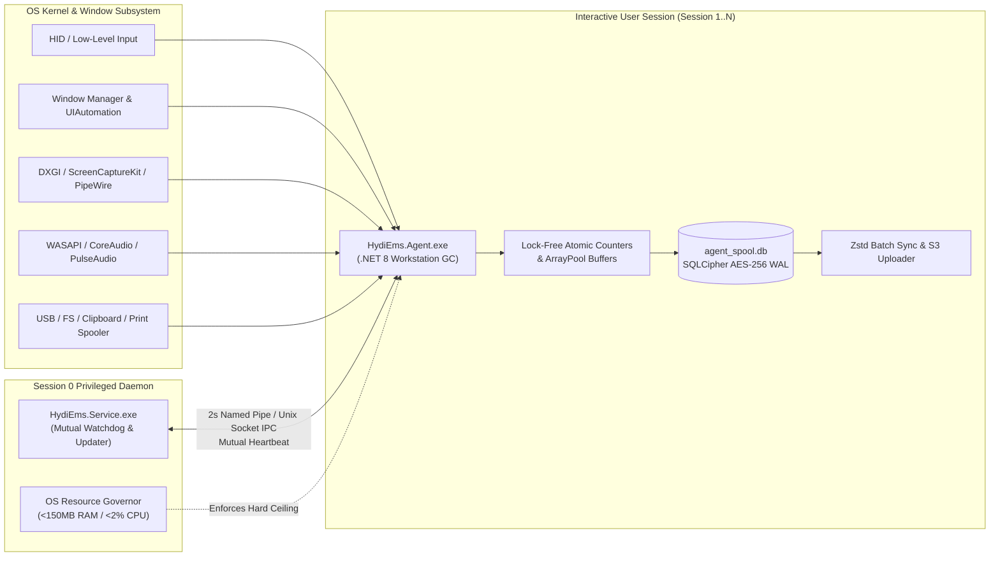
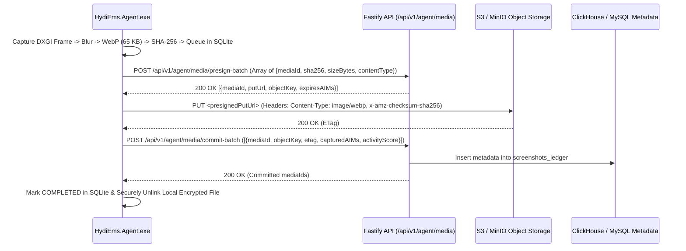
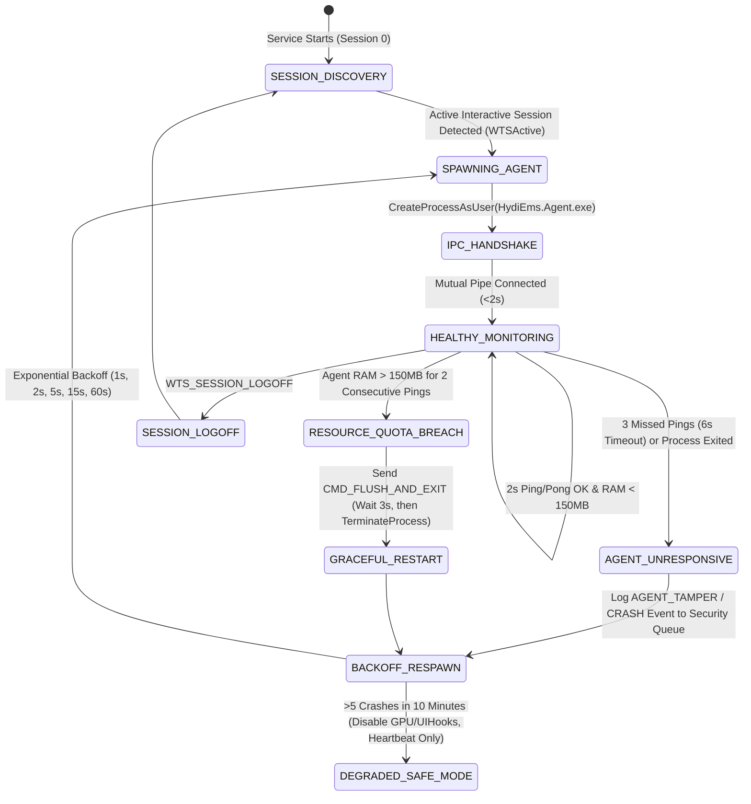

# PHASE 08: DESKTOP AGENT CORE SYSTEMS ENGINEERING, CROSS-PLATFORM OS HOOKS, HARDWARE RESOURCE GOVERNANCE & ENCRYPTED SQLITE SPOOL

**Document Classification:** Master Systems Engineering Specification (Phase 08 of 12)  
**Target Binary Suite:** `HydiEms.Agent.exe` (Interactive Session Worker) + `HydiEms.Service.exe` (Privileged Watchdog Daemon)  
**Runtime & Language:** C# 12 / .NET 8.0 NativeAOT-ready / Workstation GC (Windows 10/11 x64/ARM64, macOS 13+ Universal Binary, Ubuntu 20.04+/RHEL 9+ x64)  
**Local Storage Engine:** SQLCipher 4.6 (AES-256-CBC Encrypted SQLite 3.45 in WAL Mode)  
**Strict Resource SLA:** `< 2.0% Mean CPU Utilization` | `< 150.0 MB Private Working Set RAM` | `Zero UI Thread Blocking`  

---

## 1. HIGH-LEVEL DUAL-PROCESS ARCHITECTURE & IPC TOPOLOGY

To guarantee tamper resilience, zero telemetry loss across network outages, and full support for multi-session environments (Windows Server RDS, Citrix Virtual Apps and Desktops, Azure Virtual Desktop), the HydiEms Desktop Agent is architected as a **decoupled two-tier process pair**:

1. **`HydiEms.Service` (Session 0 System Daemon):**
   - Runs as `NT AUTHORITY\SYSTEM` (Windows Service), `LaunchDaemon` (`root` on macOS), or `systemd` system unit (Linux).
   - Manages machine-level hardware fingerprinting, OS kernel/filter driver events, silent MSI/PKG auto-updates, Windows Job Object memory/CPU governance, and spawns/monitors one `HydiEms.Agent` instance per active interactive user session (`WTSQueryUserToken` -> `CreateProcessAsUser`).
2. **`HydiEms.Agent` (Interactive User Session Process):**
   - Runs inside the interactive desktop session (`Session 1..N` on Windows, Aqua Session on macOS, X11/Wayland Seat on Linux).
   - Captures low-level keyboard/mouse activity counters, foreground window titles, browser URLs, GPU-accelerated screenshots/video, WASAPI audio streams, and renders the Avalonia/WPF native UI (`Phase 09`).
   - Persists all harvested telemetry into a per-user encrypted SQLCipher WAL database (`agent_spool.db`) and streams batches to the Fastify/S3 backend.



---

## 2. CROSS-PLATFORM NATIVE OS HOOKS & TELEMETRY EXTRACTION MATRIX

### 2.1 Comparative OS Native API Matrix

| Telemetry Subsystem | Windows 10 / 11 (`win-x64`, `win-arm64`) | macOS 13+ (`osx-universal`) | Linux (`linux-x64` X11 & Wayland) |
| :--- | :--- | :--- | :--- |
| **System Idle Time** | `user32.dll!GetLastInputInfo(ref LASTINPUTINFO)` compared against `kernel32.dll!GetTickCount64()` | `CoreGraphics!CGEventSourceSecondsSinceLastEventType(kCGEventSourceStateHIDSystemState, kCGAnyInputEventType)` | **X11:** `libXss!XScreenSaverQueryInfo` <br>**Wayland:** `org.freedesktop.ScreenSaver.GetSessionIdleTime` / `ext-idle-notify-v1` |
| **Keystroke & Mouse Activity Counters** | `user32.dll!SetWindowsHookEx(WH_KEYBOARD_LL, ...)` & `SetWindowsHookEx(WH_MOUSE_LL, ...)` on dedicated high-priority native message pump thread | `CoreGraphics!CGEventTapCreate(kCGSessionEventTap, kCGHeadInsertEventTap, kCGEventTapOptionListenOnly, ...)` (Requires Accessibility TCC) | **X11:** `XInput2` `XI_RawKeyPress` / `XI_RawButtonPress` <br>**Wayland:** `libinput` via privileged `HydiEms.Service` socket bridge (group `input`) |
| **Foreground App & Window Title** | `user32.dll!SetWinEventHook(EVENT_SYSTEM_FOREGROUND, ...)` + `EVENT_OBJECT_NAMECHANGE` -> `GetWindowThreadProcessId` -> `QueryFullProcessImageNameW` + `GetWindowTextW` | `NSWorkspace.shared.notificationCenter` (`didActivateApplicationNotification`) + `CGWindowListCopyWindowInfo(kCGWindowListOptionOnScreenOnly, kCGNullWindowID)` | **X11:** `_NET_ACTIVE_WINDOW` property notify -> `_NET_WM_PID` & `_NET_WM_NAME` <br>**GNOME/KDE Wayland:** DBus KWin/Mutter introspection helper |
| **Browser Active Tab URL Extraction** | Out-of-process COM `UIAutomationClient` (`IUIAutomation`, `CUIAutomation8`) with cached `TreeScope_Subtree` Condition for Address Bar Control IDs, plus optional Native Messaging Host | `ApplicationServices!AXUIElementCreateApplication(pid)` -> `AXUIElementCopyAttributeValue(kAXFocusedWindowAttribute)` -> Address Bar `AXValue` (or AppleEvents for Safari/Chrome) | `AT-SPI2` (`libatspi`) accessibility bus query on role `ATSPI_ROLE_ENTRY` matching browser address bar automation IDs |
| **GPU Screenshot & Video Capture** | DirectX 11 `IDXGIOutputDuplication::AcquireNextFrame` -> Staging `ID3D11Texture2D` -> `ArrayPool<byte>` -> `libwebp` P/Invoke (`WebPEncodeRGBA`) | `ScreenCaptureKit` (`SCStream`, `SCScreenshotManager.captureImage`) -> `CVPixelBuffer` -> `libwebp` | **X11:** `XShmGetImage` (MIT-SHM extension) <br>**Wayland:** `xdg-desktop-portal` + `PipeWire` DMA-BUF stream -> `libwebp` |
| **Audio Activity & Call Detection** | `MMDeviceEnumerator` (`IMMDevice`) + `IAudioMeterInformation::GetPeakValue` (zero-PII peak level detection for anti-idle) + `IAudioCaptureClient` (when recording enabled) | `CoreAudio` `AudioObjectGetPropertyData(kAudioDevicePropertyDeviceIsRunningSomewhere)` + `AVAudioEngine` tap | `PipeWire` / `PulseAudio` (`pa_context_get_sink_input_info_list` & `pa_context_get_source_output_info_list`) |
| **Session Lock / Unlock / RDP** | `wtsapi32.dll!WTSRegisterSessionNotification(NOTIFY_FOR_THIS_SESSION)` handling `WM_WTSSESSION_CHANGE` (`WTS_SESSION_LOCK`, `WTS_SESSION_UNLOCK`, `WTS_REMOTE_CONNECT`, `WTS_CONSOLE_CONNECT`) | `DistributedNotificationCenter`: `com.apple.screenIsLocked` & `com.apple.screenIsUnlocked` + `CGSessionCopyCurrentDictionary` | `systemd-logind` DBus `org.freedesktop.login1.Session` (`Lock`, `Unlock`, `IdleHint` properties) |
| **USB, File, Clipboard & Print DLP** | WMI `Win32_VolumeChangeEvent` + `SetupAPI` USBSTOR enumeration; `FileSystemWatcher` / Minifilter; `AddClipboardFormatListener`; `FindFirstPrinterChangeNotification` | `DiskArbitration` framework (`DARegisterDiskAppearedCallback`); `EndpointSecurity` (`ES_EVENT_TYPE_NOTIFY_OPEN`/`WRITE`); `NSPasteboard.changeCount`; CUPS notifications | `libudev` (`udev_monitor_filter_add_match_subsystem_devtype("block", "disk")`); `fanotify` / `inotify`; XFixes/Wayland clipboard selection listener; CUPS DBus |

---

### 2.2 Zero-Allocation Input Hook Implementation (C# / .NET 8)

A naive `WH_KEYBOARD_LL` or `WH_MOUSE_LL` callback in managed code that allocates objects or performs I/O inside `LowLevelKeyboardProc` will trigger the Windows `LowLevelHooksTimeout` (300ms registry limit), causing Windows to silently unhook the agent or lag the user's mouse cursor.

**Mandatory Engineering Rules for `InputHookEngine.cs`:**
1. **Dedicated Native Pump Thread:** Hooks are installed on a dedicated background `Thread` with `ThreadPriority.Highest` running a raw Win32 `GetMessageW` / `TranslateMessage` / `DispatchMessageW` loop.
2. **Zero Heap Allocations in Callback:** The callback is decorated with `[UnmanagedCallersOnly]` (or pinned static delegate `GCHandle.Alloc`) and performs **only** lock-free `Interlocked.Increment` operations on cache-line-padded value structs.
3. **Mouse Movement Distance Throttling:** `WM_MOUSEMOVE` fires up to 1,000 times/second on high-DPI gaming mice. The callback computes Manhattan distance `|x - lastX| + |y - lastY|`; if `< 12 pixels`, it exits immediately before calling `CallNextHookEx`.

```csharp
using System.Runtime.CompilerServices;
using System.Runtime.InteropServices;
using System.Threading;

namespace HydiEms.Agent.NativeHooks;

[StructLayout(LayoutKind.Explicit, Size = 128)] // Padded to 2 CPU cache lines to prevent false sharing
public struct SliceInputAccumulator
{
    [FieldOffset(0)]  public long KeystrokeCount;
    [FieldOffset(8)]  public long MouseClickCount;
    [FieldOffset(16)] public long MouseScrollTicks;
    [FieldOffset(24)] public long MouseDistancePx;
    [FieldOffset(32)] public long LastInputTick64;
    [FieldOffset(40)] public int LastMouseX;
    [FieldOffset(44)] public int LastMouseY;
}

public static unsafe class WindowsLowLevelInputHook
{
    private const int WH_KEYBOARD_LL = 13;
    private const int WH_MOUSE_LL = 14;
    private const int WM_KEYDOWN = 0x0100;
    private const int WM_SYSKEYDOWN = 0x0104;
    private const int WM_MOUSEMOVE = 0x0200;
    private const int WM_LBUTTONDOWN = 0x0201;
    private const int WM_RBUTTONDOWN = 0x0204;
    private const int WM_MBUTTONDOWN = 0x0207;
    private const int WM_MOUSEWHEEL = 0x020A;
    private const int WM_MOUSEHWHEEL = 0x020E;

    public static SliceInputAccumulator CurrentSlice;

    [UnmanagedCallersOnly(CallConvs = new[] { typeof(CallConvStdcall) })]
    public static nint KeyboardHookCallback(int nCode, nuint wParam, nint lParam)
    {
        if (nCode >= 0 && (wParam == WM_KEYDOWN || wParam == WM_SYSKEYDOWN))
        {
            Interlocked.Increment(ref CurrentSlice.KeystrokeCount);
            Interlocked.Exchange(ref CurrentSlice.LastInputTick64, Environment.TickCount64);
        }
        return CallNextHookEx(0, nCode, wParam, lParam);
    }

    [UnmanagedCallersOnly(CallConvs = new[] { typeof(CallConvStdcall) })]
    public static nint MouseHookCallback(int nCode, nuint wParam, nint lParam)
    {
        if (nCode >= 0)
        {
            switch ((int)wParam)
            {
                case WM_MOUSEMOVE:
                    int x = *(int*)lParam;
                    int y = *(int*)(lParam + 4);
                    int dx = Math.Abs(x - CurrentSlice.LastMouseX);
                    int dy = Math.Abs(y - CurrentSlice.LastMouseY);
                    if (dx + dy >= 12)
                    {
                        CurrentSlice.LastMouseX = x;
                        CurrentSlice.LastMouseY = y;
                        Interlocked.Add(ref CurrentSlice.MouseDistancePx, dx + dy);
                        Interlocked.Exchange(ref CurrentSlice.LastInputTick64, Environment.TickCount64);
                    }
                    break;
                case WM_LBUTTONDOWN:
                case WM_RBUTTONDOWN:
                case WM_MBUTTONDOWN:
                    Interlocked.Increment(ref CurrentSlice.MouseClickCount);
                    Interlocked.Exchange(ref CurrentSlice.LastInputTick64, Environment.TickCount64);
                    break;
                case WM_MOUSEWHEEL:
                case WM_MOUSEHWHEEL:
                    Interlocked.Increment(ref CurrentSlice.MouseScrollTicks);
                    Interlocked.Exchange(ref CurrentSlice.LastInputTick64, Environment.TickCount64);
                    break;
            }
        }
        return CallNextHookEx(0, nCode, wParam, lParam);
    }

    /// <summary>
    /// Atomically snapshots and zeroes the accumulator every 10 seconds on the Harvest Timer thread.
    /// </summary>
    public static SliceInputAccumulator HarvestAndReset()
    {
        return new SliceInputAccumulator
        {
            KeystrokeCount   = Interlocked.Exchange(ref CurrentSlice.KeystrokeCount, 0),
            MouseClickCount  = Interlocked.Exchange(ref CurrentSlice.MouseClickCount, 0),
            MouseScrollTicks = Interlocked.Exchange(ref CurrentSlice.MouseScrollTicks, 0),
            MouseDistancePx  = Interlocked.Exchange(ref CurrentSlice.MouseDistancePx, 0),
            LastInputTick64  = Interlocked.Read(ref CurrentSlice.LastInputTick64)
        };
    }

    [DllImport("user32.dll", ExactSpelling = true)]
    private static extern nint CallNextHookEx(nint hhk, int nCode, nuint wParam, nint lParam);
}
```

---

### 2.3 Browser URL & Incognito Detection (`IUIAutomation` + Process Cache)

Calling `IUIAutomationElement::FindFirst` across the entire browser DOM tree on every keystroke causes high CPU usage in Chrome/Edge. HydiEms solves this via **Event-Driven Automation Element Caching**:

1. **Trigger Condition:** URL extraction runs **only** when:
   - `SetWinEventHook` fires `EVENT_SYSTEM_FOREGROUND` or `EVENT_OBJECT_NAMECHANGE` on `hwnd == GetForegroundWindow()`, AND
   - The foreground process executable is in `{ "chrome.exe", "msedge.exe", "firefox.exe", "brave.exe", "opera.exe", "vivaldi.exe", "arc.exe" }`.
2. **HWND-to-AddressBar `IUIAutomationElement` Cache:**
   - Upon first encountering a browser top-level `HWND`, the agent locates the Address Bar `IUIAutomationElement` once (matching `UIA_ControlTypePropertyId == UIA_EditControlTypeId` and `AutomationId == "view_1012"` / `"addressEditBox"` / `"urlbar-input"` or `AccessKey == "Ctrl+L"`) and caches the COM pointer keyed by `HWND`.
   - Subsequent window title changes on that `HWND` read `IUIAutomationValuePattern::CurrentValue` directly from the cached pointer in `< 0.3ms` with zero DOM tree traversal!
3. **Private / Incognito Window Detection:**
   - Checks window title suffixes (`"- InPrivate"`, `"- Incognito"`, `"— Private Browsing"`) and Chrome/Edge `ClassName` attributes.
   - If the active policy has `track_incognito_urls = false`, the agent records `process_name = "chrome.exe"`, `url = "about:private-browsing"`, and `window_title = "[Private Browsing]"`.

---

### 2.4 DirectX 11 `IDXGIOutputDuplication` + `libwebp` Screenshot & Video Pipeline

Avoid `Graphics.CopyFromScreen` (GDI `BitBlt`), which stalls the Desktop Window Manager (DWM) and spikes CPU.

1. **VRAM-to-Staging Capture:**
   - Uses `IDXGIFactory1` -> `IDXGIAdapter1` -> `IDXGIOutput1::DuplicateOutput` to attach to the primary (or all active) display outputs.
   - When the screenshot timer fires (or video frame tick triggers), calls `AcquireNextFrame(100, out frameInfo, out desktopResource)`.
   - Copies the GPU texture to a pre-allocated CPU-readable `D3D11_USAGE_STAGING` `ID3D11Texture2D` via `ID3D11DeviceContext::CopyResource`.
2. **Privacy Blur & Watermarking in Native Buffer:**
   - Maps the staging texture via `ID3D11DeviceContext::Map(D3D11_MAP_READ)` and copies scanlines into a rented `ArrayPool<byte>.Shared.Rent(width * height * 4)` buffer.
   - If `screenshot_blur_mode != NONE` (or if the foreground application matches the policy's `sensitive_blur_apps` list such as password managers `1Password.exe`, `KeePass.exe`, or banking domains), applies a SIMD AVX2 separable box blur (`4px` or `12px` radius) directly on the rented byte array before encoding.
3. **`libwebp` Encoding (`Quality = 75`, `Method = 2`):**
   - Encodes a `1920x1080` RGBA buffer to WebP in `~14ms` producing a `~65 KB` payload (82% smaller than PNG), computes `SHA-256` content hash, writes the encrypted `.webp.enc` blob to `%LOCALAPPDATA%\HydiEms\Spool\Media\`, and returns the byte array to `ArrayPool<byte>.Shared.Return(...)` immediately.

---

## 3. STRICT `< 2.0% CPU` AND `< 150.0 MB RAM` RESOURCE ENFORCEMENT

### 3.1 Runtime Configuration (`HydiEms.Agent.runtimeconfig.json`)

```json
{
  "runtimeOptions": {
    "tfm": "net8.0",
    "System.GC.Server": false,
    "System.GC.Concurrent": true,
    "System.GC.ConserveMemory": 9,
    "System.GC.HighMemoryPercent": 70,
    "System.GC.HeapHardLimit": 125829120,
    "System.Threading.ThreadPool.MinThreads": 2,
    "System.Threading.ThreadPool.MaxThreads": 8
  }
}
```

### 3.2 OS-Level Kernel Enforcement (Windows Job Objects / cgroups / setrlimit)

`HydiEms.Service.exe` places `HydiEms.Agent.exe` into a restricted OS Job Object at launch so the operating system kernel guarantees the agent can never starve the user's workstation:

- **Windows Job Object (`CreateJobObjectW` + `SetInformationJobObject`):**
  - `JOBOBJECT_EXTENDED_LIMIT_INFORMATION`:
    - `LimitFlags = JOB_OBJECT_LIMIT_PROCESS_MEMORY | JOB_OBJECT_LIMIT_DIE_ON_UNHANDLED_EXCEPTION`
    - `ProcessMemoryLimit = 157_286_400` (`150 MiB` hard ceiling).
  - `JOBOBJECT_CPU_RATE_CONTROL_INFORMATION`:
    - `ControlFlags = JOB_OBJECT_CPU_RATE_CONTROL_ENABLE | JOB_OBJECT_CPU_RATE_CONTROL_HARD_CAP`
    - `CpuRate = 200` (2.00% of total CPU cycles across all logical cores; burst allowed up to 5.00% for `<250ms` during WebP encode).
- **Self-Monitoring Memory Pressure Valve:**
  - Every 10 seconds, `HydiEms.Agent` checks `GC.GetGCMemoryInfo().TotalCommittedBytes`. If committed memory exceeds `115 MB`, it immediately pauses video/screenshot capture for 1 cycle, flushes pooled buffers, and invokes `GC.Collect(2, GCCollectionMode.Aggressive, blocking: false, compacting: true)`.

---

## 4. COMPLETE SQLCIPHER ENCRYPTED SQLITE WAL SCHEMA (`agent_spool.db`)

All telemetry harvested by `HydiEms.Agent` is written to `%LOCALAPPDATA%\HydiEms\Spool\agent_spool.db` encrypted with **SQLCipher 4.6 (`PRAGMA cipher_page_size = 4096; PRAGMA kdf_iter = 256000;`)**. The 256-bit database key is derived from a machine-bound secret sealed via **Windows DPAPI (`CryptProtectData` with `CRYPTPROTECT_LOCAL_MACHINE`)**, **macOS System Keychain**, or **Linux `libsecret` / TPM2** combined with the organization's enrollment salt.

```sql
-- ============================================================================
-- SQLCIPHER INITIALIZATION & WAL PRAGMAS
-- ============================================================================
PRAGMA key = "x'...64-hex-char-dpapi-unsealed-key...'";
PRAGMA cipher_compatibility = 4;
PRAGMA journal_mode = WAL;
PRAGMA synchronous = NORMAL;
PRAGMA temp_store = MEMORY;
PRAGMA mmap_size = 33554432; -- 32MB max mmap to stay well under 150MB RAM limit
PRAGMA wal_autocheckpoint = 1000;
PRAGMA foreign_keys = ON;

-- ============================================================================
-- 1. LOCAL CONFIGURATION & POLICY CACHE
-- ============================================================================
CREATE TABLE IF NOT EXISTS local_config_cache (
    config_key TEXT PRIMARY KEY NOT NULL,
    config_value_json TEXT NOT NULL,
    policy_version INTEGER NOT NULL DEFAULT 1,
    signature_hmac_sha256 TEXT NOT NULL COMMENT 'Verifies policy was signed by HydiEms Backend',
    updated_at_ms INTEGER NOT NULL
) WITHOUT ROWID;

-- ============================================================================
-- 2. 10-SECOND ACTIVITY SLICE QUEUE (HIGH-VELOCITY TELEMETRY)
-- ============================================================================
CREATE TABLE IF NOT EXISTS activity_slice_queue (
    slice_id TEXT PRIMARY KEY NOT NULL,               -- Deterministic UUIDv5(device_id + employee_id + slice_start_ms)
    org_id TEXT NOT NULL,
    employee_id TEXT NOT NULL,
    device_id TEXT NOT NULL,
    session_id TEXT NOT NULL,
    
    slice_start_ms INTEGER NOT NULL,                  -- UTC Epoch Milliseconds (aligned to 10,000ms boundary)
    slice_end_ms INTEGER NOT NULL,
    duration_ms INTEGER NOT NULL DEFAULT 10000,
    
    -- Time Classification State resolved locally by Agent
    time_state TEXT NOT NULL CHECK (time_state IN (
        'WORKING', 'IDLE', 'AWAY', 'PERSONAL_MODE', 'OFFLINE_GAP'
    )),
    away_reason_id TEXT NULL,
    project_id TEXT NULL,
    task_id TEXT NULL,
    
    -- Foreground Window & Browser Context (NULL during IDLE, AWAY, PERSONAL_MODE)
    process_name TEXT NULL,
    process_path_hash TEXT NULL,
    window_title TEXT NULL,
    browser_url TEXT NULL,
    browser_domain TEXT NULL,
    is_incognito INTEGER NOT NULL DEFAULT 0,
    
    -- Input & Audio Telemetry
    keystroke_count INTEGER NOT NULL DEFAULT 0,
    mouse_click_count INTEGER NOT NULL DEFAULT 0,
    mouse_scroll_ticks INTEGER NOT NULL DEFAULT 0,
    mouse_distance_px INTEGER NOT NULL DEFAULT 0,
    active_audio_call INTEGER NOT NULL DEFAULT 0,     -- 1 if Mic/Loopback peak > threshold (Zoom/Teams anti-idle)
    system_idle_seconds INTEGER NOT NULL DEFAULT 0,
    
    -- Network & Hybrid Location Signals
    local_ipv4 TEXT NULL,
    wifi_ssid TEXT NULL,
    wifi_bssid TEXT NULL,
    
    -- Sync Lifecycle State
    sync_status TEXT NOT NULL DEFAULT 'PENDING' CHECK (sync_status IN ('PENDING', 'IN_FLIGHT', 'ACKED')),
    batch_id TEXT NULL,
    retry_count INTEGER NOT NULL DEFAULT 0,
    last_attempt_ms INTEGER NULL,
    created_at_ms INTEGER NOT NULL
);

CREATE INDEX IF NOT EXISTS idx_asq_sync_order 
    ON activity_slice_queue (sync_status, slice_start_ms ASC);
CREATE INDEX IF NOT EXISTS idx_asq_batch 
    ON activity_slice_queue (batch_id) WHERE batch_id IS NOT NULL;

-- ============================================================================
-- 3. MEDIA UPLOAD QUEUE (SCREENSHOTS, VIDEO SEGMENTS, AUDIO CHUNKS)
-- ============================================================================
CREATE TABLE IF NOT EXISTS media_upload_queue (
    media_id TEXT PRIMARY KEY NOT NULL,               -- UUIDv7
    org_id TEXT NOT NULL,
    employee_id TEXT NOT NULL,
    device_id TEXT NOT NULL,
    
    media_type TEXT NOT NULL CHECK (media_type IN ('SCREENSHOT_WEBP', 'VIDEO_WEBM', 'AUDIO_OPUS')),
    captured_at_ms INTEGER NOT NULL,
    duration_ms INTEGER NOT NULL DEFAULT 0,
    monitor_index INTEGER NOT NULL DEFAULT 0,
    
    local_encrypted_filepath TEXT NOT NULL,           -- Path to AES-GCM encrypted file on disk
    file_size_bytes INTEGER NOT NULL,
    content_sha256 TEXT NOT NULL,
    width_px INTEGER NOT NULL,
    height_px INTEGER NOT NULL,
    blur_applied TEXT NOT NULL DEFAULT 'NONE',
    
    -- Context Snapshot at Moment of Capture
    foreground_process TEXT NULL,
    foreground_title TEXT NULL,
    activity_score_pct REAL NOT NULL DEFAULT 0.0,
    
    -- S3 Direct Upload Lifecycle
    upload_status TEXT NOT NULL DEFAULT 'QUEUED' CHECK (upload_status IN (
        'QUEUED', 'URL_REQUESTED', 'UPLOADING_S3', 'COMMITTING_META', 'COMPLETED', 'USER_DELETED', 'EXPIRED_PRUNED'
    )),
    presigned_put_url TEXT NULL,
    presigned_url_expires_ms INTEGER NULL,
    retry_count INTEGER NOT NULL DEFAULT 0,
    next_retry_after_ms INTEGER NOT NULL DEFAULT 0,
    created_at_ms INTEGER NOT NULL
);

CREATE INDEX IF NOT EXISTS idx_muq_status_retry 
    ON media_upload_queue (upload_status, next_retry_after_ms ASC, captured_at_ms ASC);

-- ============================================================================
-- 4. DLP & SECURITY EVENT QUEUE (USB, FILE, CLIPBOARD, PRINT, TAMPER, KEYLOG)
-- ============================================================================
CREATE TABLE IF NOT EXISTS security_event_queue (
    event_id TEXT PRIMARY KEY NOT NULL,               -- UUIDv7
    org_id TEXT NOT NULL,
    employee_id TEXT NOT NULL,
    device_id TEXT NOT NULL,
    occurred_at_ms INTEGER NOT NULL,
    
    event_category TEXT NOT NULL CHECK (event_category IN (
        'USB_DEVICE', 'FILE_OPERATION', 'CLIPBOARD_DLP', 'PRINT_JOB', 
        'KEYLOGGER_TEXT_CHUNK', 'AGENT_TAMPER', 'SESSION_LIFECYCLE', 'IDLE_ROLLBACK'
    )),
    severity TEXT NOT NULL CHECK (severity IN ('LOW', 'MEDIUM', 'HIGH', 'CRITICAL')),
    action_taken TEXT NOT NULL CHECK (action_taken IN ('AUDITED', 'WARNED', 'BLOCKED', 'REDACTED')),
    
    foreground_process TEXT NULL,
    event_payload_json TEXT NOT NULL,                 -- Structured JSON per event_category
    
    sync_status TEXT NOT NULL DEFAULT 'PENDING' CHECK (sync_status IN ('PENDING', 'IN_FLIGHT', 'ACKED')),
    retry_count INTEGER NOT NULL DEFAULT 0
);

CREATE INDEX IF NOT EXISTS idx_seq_sync 
    ON security_event_queue (sync_status, severity DESC, occurred_at_ms ASC);
```

---

### 4.1 Deterministic Ring-Buffer Pruning & Offline Survival Policy

When a laptop is offline for days or weeks (e.g., field site without internet), `agent_spool.db` and the local media directory must never fill the user's disk:

1. **Maximum Spool Quota:** `500 MB` (or `5%` of free disk space, whichever is smaller).
2. **Tiered Eviction Order (runs every 5 minutes):**
   - **Step 1:** Immediately delete all `ACKED` rows in `activity_slice_queue` and `security_event_queue` older than 24 hours, and unlink `COMPLETED` files in `media_upload_queue`.
   - **Step 2:** If total spool size exceeds `400 MB` (80% watermark), downgrade video recording FPS to `0` (pause video recording) and increase screenshot interval by `2x`.
   - **Step 3:** If total spool size exceeds `480 MB` (96% watermark), evict the oldest un-uploaded `VIDEO_WEBM` files first, then oldest `SCREENSHOT_WEBP` files (`UPDATE media_upload_queue SET upload_status = 'EXPIRED_PRUNED'`), **never** evicting `activity_slice_queue` or `security_event_queue` (since 30 days of compressed activity slices require `< 25 MB` of SQLite space).

---

## 5. HEARTBEAT CADENCE, ZSTD BATCH SYNC & S3 PRE-SIGNED UPLOAD PROTOCOL

### 5.1 Four-Tier Deterministic Timing Cadence

| Cadence Interval | Subsystem | Transport | Payload & Operation |
| :--- | :--- | :--- | :--- |
| **Every 2 Seconds** | Mutual Watchdog IPC | Named Pipe (`\\.\pipe\HydiEms_IPC_{SessionId}`) / Unix Domain Socket | Bidirectional 64-byte binary frame: `{ agentPid, servicePid, sessionState, ramBytes, cpuPermille, lastSliceTick }`. |
| **Every 10 Seconds** | Local Telemetry Harvest | In-Memory -> SQLCipher `agent_spool.db` | Calls `HarvestAndReset()`, queries foreground window/URL, evaluates WASAPI peak audio, determines 10s slice classification, writes 1 row to `activity_slice_queue`. |
| **Every 20 Seconds** | Live Presence Ping | WebSocket `WSS /api/v1/ws/agent` (Fallback: `POST /api/v1/agent/heartbeat`) | Sends lightweight 220-byte JSON presence frame: `{ empId, devId, state, app, title, cat, policyVer, spoolBytes }`. Server replies with `{ ackTs, latestPolicyVer, pendingCommands[] }`. |
| **Every 60 Seconds** | Telemetry Batch Sync | HTTPS `POST /api/v1/agent/telemetry/batch` (`Content-Encoding: zstd`) | Selects up to 360 `PENDING` rows from `activity_slice_queue` + 100 rows from `security_event_queue`, compresses with Zstandard (`level 3`, ~9:1 compression ratio), sends with `Idempotency-Key: {batchId}`. |

### 5.2 S3 / MinIO Pre-Signed Direct Upload Pipeline (Zero Backend Bandwidth Bottleneck)

Binary media (`SCREENSHOT_WEBP`, `VIDEO_WEBM`, `AUDIO_OPUS`) **never** flows through the Fastify Node.js memory heap:



---

## 6. MUTUAL WATCHDOG CRASH-RECOVERY STATE MACHINE & MULTI-SESSION SUPPORT

### 6.1 Mutual Watchdog State Machine (`HydiEms.Service` <-> `HydiEms.Agent`)

Both processes monitor each other over the 2-second Named Pipe / Unix Socket channel:



- **Reverse Watchdog (Agent Monitoring Service):** If `HydiEms.Agent.exe` detects that `HydiEms.Service.exe` has stopped responding for 6 seconds, it writes a `CRITICAL` `AGENT_TAMPER` event (`{"reason": "WATCHDOG_SERVICE_STOPPED"}`) to `security_event_queue` and immediately flushes the event to `POST /api/v1/agent/security-alert`.
- **Windows Service Recovery Actions:** Installed via `sc.exe failure HydiEmsService reset= 86400 actions= restart/1000/restart/2000/restart/5000` with a Restricted DACL (`D:(A;;CCLCSWLOCRRC;;;IU)(A;;CCDCLCSWRPWPDTLOCRSDRCWDWO;;;SY)(A;;CCDCLCSWRPWPDTLOCRSDRCWDWO;;;BA)`) so standard non-admin or local-admin users without explicit service-stop privilege cannot terminate the service via Task Manager.

### 6.2 Citrix / Windows Server RDS / Multi-Session Isolation

On multi-user Windows Server RDS or Citrix hosts where 30 employees may be logged into the same physical VM concurrently (`Session 1..30`):
1. `HydiEms.Service.exe` enumerates active sessions via `WTSEnumerateSessionsW` and listens to `SERVICE_CONTROL_SESSIONCHANGE`.
2. For each active session `S`, it spawns an isolated `HydiEms.Agent.exe --session-id S` using `WTSQueryUserToken(S)` -> `DuplicateTokenEx` -> `CreateEnvironmentBlock` -> `CreateProcessAsUserW`.
3. Each session uses its own isolated Named Pipe `\\.\pipe\HydiEms_IPC_Session_{S}` with a security descriptor granting read/write **only** to `SYSTEM` and the specific logged-in user's `SID`, preventing cross-session spoofing or snooping.
4. Each user's SQLCipher spool resides in their isolated profile `%LOCALAPPDATA%\HydiEms\Spool\agent_spool.db` encrypted with `CRYPTPROTECT_UI_FORBIDDEN` user-scoped DPAPI.

---

## 7. ACCEPTANCE CRITERIA (PHASE 08 SYSTEMS ENGINEERING)

1. **CPU & RAM Ceiling SLA:**
   - **Given** `HydiEms.Agent.exe` runs continuously for 72 hours under heavy developer workload (120 WPM typing, rapid window switching across 3 monitors, 5-minute WebP screenshot capture, 60-second Zstd sync), **When** profiled via ETW / PerfMon, **Then** mean CPU usage is `< 1.2%` (hard ceiling `< 2.0%`), private working set RAM stays between `48 MB` and `115 MB` (hard ceiling `< 150.0 MB`), and Gen-2 GC pauses are `< 5ms`.
2. **Zero Input Lag Guarantee:**
   - **Given** the low-level mouse and keyboard hooks are active, **When** the SQLite database or network thread experiences a simulated 5-second disk/network stall, **Then** keyboard and mouse events still return from `KeyboardHookCallback` / `MouseHookCallback` in `< 15 microseconds` because they only touch lock-free `Interlocked` memory.
3. **Offline Airplane Mode Resilience:**
   - **Given** an endpoint is disconnected from all networks for 48 hours of active work, **When** network connectivity is restored, **Then** 100% of the 17,280 ten-second activity slices and queued WebP screenshots are uploaded in chronological order with zero duplicates (enforced by deterministic `slice_id` UUIDv5 idempotency).
4. **Watchdog Self-Healing:**
   - **Given** a user forcibly terminates `HydiEms.Agent.exe` via `taskkill /F /IM HydiEms.Agent.exe`, **When** `HydiEms.Service.exe` detects the broken pipe within 2 seconds, **Then** it logs a `CRITICAL` `AGENT_TAMPER` event and respawns `HydiEms.Agent.exe` in the user's session within `< 3 seconds`.
