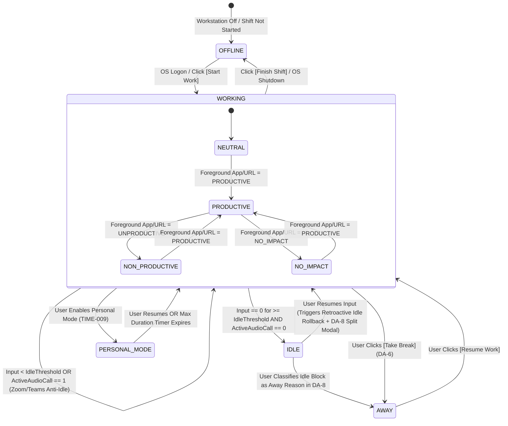

# PHASE 10: TIME ENGINE, DETERMINISTIC 8-STATE CLASSIFICATION, AWAY MANAGEMENT, AUDIO ANTI-IDLE & PERSONAL MODE

**Document Classification:** Master Engineering & Screen-by-Screen Specification (Phase 10 of 12)  
**System:** HydiEms Enterprise Time Ledger, Away Governance & Deterministic Classification Engine (`TIME-001..009`)  
**Storage Architecture:** MySQL 8.0 InnoDB (Time Entries, Approvals, Away Reasons, Personal Mode Logs) + ClickHouse 24.x (`activity_slices_10s`, `time_ledger_1m_mv`) + Redis 7.2 (Real-Time State Machine Locks)  

---

## 1. ARCHITECTURAL OVERVIEW & DETERMINISTIC 8-STATE TIME CLASSIFICATION ENGINE (`TIME-008`)

Every 10-second telemetry slice (`10,000 ms`) across every employee's 24-hour day is deterministically classified into an orthogonal **Primary Presence/Attendance State** and **Productivity Impact Sub-State**, yielding the **8 Canonical Time States** of HydiEms:

1. **`WORKING`** (Composite superset of active working states: `Productive + Non-Productive + Neutral + No-Impact` + approved `Working Away` intervals).
2. **`PRODUCTIVE`** (Active foreground app/URL matches `PRODUCTIVE` rule for employee/dept/org, or approved productive away reason such as `Client Call` / `In-Person Meeting`).
3. **`NON_PRODUCTIVE`** (Active foreground app/URL matches `UNPRODUCTIVE` rule, e.g., gaming, social media for non-marketing roles).
4. **`NEUTRAL`** (Active foreground app/URL is unclassified or explicitly mapped as `NEUTRAL`, e.g., OS File Explorer, Calculator, System Settings).
5. **`NO_IMPACT`** (Authorized administrative or transitional activity configured to be excluded from the Productivity % denominator so it neither boosts nor penalizes the employee's score, e.g., mandatory HR compliance training video or IT password reset portal).
6. **`IDLE`** (No keyboard/mouse input for `>= idle_timeout_seconds` AND no active audio stream detected, and not in an approved `Away` reason or `Personal Mode`).
7. **`AWAY`** (Explicit break or away reason selected via `DA-6` or retroactively split via `DA-8`, governed by `away_reasons` configuration: `Lunch`, `Tea`, `Meeting`, `Client Call`, `Personal`, `Training`).
8. **`OFFLINE`** (Agent not running, workstation powered off/asleep, or employee currently in **Personal Mode** privacy shield where monitoring is paused).



---

### 1.1 Mathematical Invariants of the Time Engine

For any employee $e$ over any time window $[T_1, T_2]$:

$$\text{ActiveInputTime} = T_{\text{Productive}} + T_{\text{NonProductive}} + T_{\text{Neutral}} + T_{\text{NoImpact}}$$

$$\text{PaidAwayWorkingTime} = \sum_{r \in \text{AwayReasons}} T_{\text{Away}}(r) \cdot \mathbb{I}(r.\text{counts\_as\_working\_time} = 1 \land r.\text{approval\_status} = \text{APPROVED})$$

$$\text{TotalWorkingTime} = \text{ActiveInputTime} + \text{PaidAwayWorkingTime} + T_{\text{ApprovedManualTime}}$$

$$\text{ProductivityScorePct} = \frac{T_{\text{Productive}} + \sum_{r} T_{\text{Away}}(r) \cdot \mathbb{I}(r.\text{productivity\_class} = \text{'PRODUCTIVE'})}{\text{ActiveInputTime} - T_{\text{NoImpact}} + \sum_{r} T_{\text{Away}}(r) \cdot \mathbb{I}(r.\text{counts\_as\_working\_time} = 1)} \times 100$$

> [!IMPORTANT]
> **Division-by-Zero & `NO_IMPACT` Guard:** If the denominator is $0$, $\text{ProductivityScorePct} = 0.0\%$. Notice how `T_NoImpact` is subtracted from the denominator so mandatory HR/IT activities never dilute an employee's productivity percentage.

---

### 1.2 Zoom / Teams / Meet Active Audio Anti-Idle Rule (`TIME-008`)

A critical failure mode in legacy employee monitoring software is falsely marking an employee as `IDLE` during a 30-minute Zoom, Microsoft Teams, Webex, Slack Huddle, or Google Meet call where the employee is listening and speaking without touching the mouse or keyboard.

**HydiEms Deterministic Audio Anti-Idle Rule:**
1. Every 10 seconds, `HydiEms.Agent` queries the OS audio subsystem (`IAudioMeterInformation::GetPeakValue` on Windows, `kAudioDevicePropertyDeviceIsRunningSomewhere` on macOS, `PipeWire`/`PulseAudio` sink/source state on Linux).
2. No audio waveforms or speech are recorded by this check—only a boolean signal:
   - `isMicActive`: Microphone capture session open AND peak meter `> 0.015` (`-36 dBFS`) for `>= 2 seconds` in the 10s window.
   - `isLoopbackConferenceActive`: Render loopback peak `> 0.015` AND an active process or browser tab matches the tenant's **Conference Call Whitelist** (`Zoom.exe`, `ms-teams.exe`, `Teams.exe`, `Slack.exe`, `WebexHost.exe`, `meet.google.com`, `app.slack.com/huddle`, `teams.microsoft.com`, `zoom.us`).
3. If `isMicActive || isLoopbackConferenceActive` is `true`:
   - The 10-second slice sets `active_audio_call = 1`.
   - The local idle accumulator (`system_idle_seconds`) is **clamped below `idle_timeout_seconds`** so `DA-7` (Idle Blocker) and `IDLE` state transition are suppressed.
   - The slice remains `WORKING` (`PRODUCTIVE`), tagged with sub-reason `AUDIO_CONFERENCE_ACTIVE`.
   - **Maximum Unattended Audio Cap:** To prevent abuse (e.g., playing a 10-hour YouTube video on a conference domain while walking away), if `keystroke_count == 0 && mouse_click_count == 0 && mouse_distance_px == 0` continuously for `> max_audio_anti_idle_minutes` (default `60 minutes`, configurable per policy), the agent prompts a non-intrusive confirmation toast and transitions to `IDLE` if unacknowledged.

---

### 1.3 Retroactive Idle Rollback Algorithm (`TIME-008`)

Suppose an organization configures `idle_timeout_seconds = 300` (5 minutes).
- At `10:00:00`, the employee stops typing and walks away from their desk.
- During `10:00:00 – 10:04:50` (the first 29 ten-second slices), the threshold of `300s` has not yet been reached, so those slices were tentatively buffered as `WORKING`.
- At `10:05:00` (`system_idle_seconds == 300`), the employee is confirmed `IDLE`.
- **Retroactive Idle Rollback:** At the exact moment `system_idle_seconds` crosses `idle_timeout_seconds` (`300s`), the Time Engine **retroactively reclassifies the preceding `300 seconds` (`10:00:00 – 10:05:00`) from `WORKING` to `IDLE`**:
  1. **Local SQLite (`agent_spool.db`):** Executes `UPDATE activity_slice_queue SET time_state = 'IDLE', process_name = NULL, window_title = NULL WHERE employee_id = ? AND slice_start_ms >= ? AND slice_start_ms < ?`.
  2. **Already-Synced Slices (ClickHouse Rollback Event):** Since the 60-second batch sync may have already uploaded the slices from `10:00:00 – 10:04:00` to the server as `WORKING`, the agent emits an `IDLE_ROLLBACK` event (`{ employeeId, idleStartMs: 10:00:00, confirmedAtMs: 10:05:00 }`). Fastify inserts compensating versioned rows into ClickHouse `ReplacingMergeTree(version)` `activity_slices_10s` with `version = 2, time_state = 'IDLE'` so that all server-side aggregations immediately deduct those 5 minutes of phantom idle time!

---

## 2. COMPLETE MYSQL 8.0 & CLICKHOUSE DDL (PHASE 10)

```sql
-- ============================================================================
-- 1. AWAY REASONS CONFIGURATION TABLE (TIME-007)
-- ============================================================================
CREATE TABLE IF NOT EXISTS away_reasons (
    id BINARY(16) NOT NULL,
    org_id BINARY(16) NOT NULL,
    reason_code VARCHAR(32) NOT NULL COMMENT 'e.g., LUNCH, TEA_BREAK, CLIENT_CALL, MEETING, PERSONAL, TRAINING',
    name VARCHAR(100) NOT NULL,
    icon_name VARCHAR(64) NOT NULL DEFAULT 'coffee',
    color_hex CHAR(7) NOT NULL DEFAULT '#8B5CF6',
    
    -- Core Financial & Time Classification Rules
    is_paid BOOLEAN NOT NULL DEFAULT TRUE,
    counts_as_working_time BOOLEAN NOT NULL DEFAULT FALSE COMMENT 'True for Client Call, Meeting, Training; False for Lunch, Personal',
    productivity_classification ENUM('PRODUCTIVE', 'NEUTRAL', 'UNPRODUCTIVE', 'NO_IMPACT') NOT NULL DEFAULT 'NEUTRAL',
    requires_manager_approval BOOLEAN NOT NULL DEFAULT FALSE,
    requires_comment BOOLEAN NOT NULL DEFAULT FALSE,
    
    -- Quota & Duration Governance
    max_duration_minutes_per_occurrence SMALLINT UNSIGNED NULL COMMENT 'e.g., 60 mins for Lunch, 15 mins for Tea',
    max_total_minutes_per_day SMALLINT UNSIGNED NULL,
    max_occurrences_per_day TINYINT UNSIGNED NULL,
    auto_end_when_max_reached BOOLEAN NOT NULL DEFAULT FALSE,
    
    -- Department Scoping (NULL = Available to all departments; JSON array of department UUIDs if restricted)
    restricted_department_ids_json JSON NULL,
    
    sort_order SMALLINT UNSIGNED NOT NULL DEFAULT 10,
    is_active BOOLEAN NOT NULL DEFAULT TRUE,
    created_at DATETIME(3) NOT NULL DEFAULT CURRENT_TIMESTAMP(3),
    updated_at DATETIME(3) NOT NULL DEFAULT CURRENT_TIMESTAMP(3) ON UPDATE CURRENT_TIMESTAMP(3),
    
    PRIMARY KEY (id),
    UNIQUE KEY uq_away_reason_code (org_id, reason_code)
) ENGINE=InnoDB DEFAULT CHARSET=utf8mb4 COLLATE=utf8mb4_0900_ai_ci;

-- ============================================================================
-- 2. TIME ENTRIES, MANUAL TIME & IDLE SPLIT LEDGER (TIME-002..006)
-- ============================================================================
CREATE TABLE IF NOT EXISTS time_entries (
    id BINARY(16) NOT NULL,
    org_id BINARY(16) NOT NULL,
    employee_id BINARY(16) NOT NULL,
    device_id BINARY(16) NULL,
    work_date DATE NOT NULL COMMENT 'Resolved in employee iana_timezone',
    
    entry_source ENUM('AGENT_AUTO', 'IDLE_SPLIT_CLAIMED', 'MANUAL_WEB_OR_AGENT', 'BREAK_BUTTON', 'PERSONAL_MODE') NOT NULL,
    time_state ENUM('WORKING', 'IDLE', 'AWAY', 'PERSONAL_MODE') NOT NULL,
    away_reason_id BINARY(16) NULL,
    project_id BINARY(16) NULL,
    task_id BINARY(16) NULL,
    
    start_time_utc DATETIME(3) NOT NULL,
    end_time_utc DATETIME(3) NOT NULL,
    duration_seconds INT UNSIGNED GENERATED ALWAYS AS (TIMESTAMPDIFF(SECOND, start_time_utc, end_time_utc)) STORED,
    
    is_paid BOOLEAN NOT NULL DEFAULT TRUE,
    counts_as_working_time BOOLEAN NOT NULL DEFAULT TRUE,
    productivity_class ENUM('PRODUCTIVE', 'NEUTRAL', 'UNPRODUCTIVE', 'NO_IMPACT') NOT NULL DEFAULT 'NEUTRAL',
    
    -- Approval Workflow State (for Manual Entries, Idle Splits, or Approval-Gated Away Reasons)
    approval_status ENUM('AUTO_APPROVED', 'PENDING_APPROVAL', 'APPROVED', 'REJECTED') NOT NULL DEFAULT 'AUTO_APPROVED',
    employee_note VARCHAR(500) NULL,
    attachment_s3_key VARCHAR(512) NULL,
    reviewed_by BINARY(16) NULL,
    reviewed_at DATETIME(3) NULL,
    reviewer_comment VARCHAR(500) NULL,
    
    created_at DATETIME(3) NOT NULL DEFAULT CURRENT_TIMESTAMP(3),
    updated_at DATETIME(3) NOT NULL DEFAULT CURRENT_TIMESTAMP(3) ON UPDATE CURRENT_TIMESTAMP(3),
    
    PRIMARY KEY (id),
    KEY idx_te_org_emp_date (org_id, employee_id, work_date, start_time_utc),
    KEY idx_te_org_approval (org_id, approval_status, created_at DESC),
    KEY idx_te_org_away (org_id, work_date, time_state, away_reason_id),
    CONSTRAINT chk_te_valid_span CHECK (end_time_utc > start_time_utc)
) ENGINE=InnoDB DEFAULT CHARSET=utf8mb4 COLLATE=utf8mb4_0900_ai_ci;

-- ============================================================================
-- 3. PERSONAL MODE SESSIONS & GOVERNANCE LEDGER (TIME-009)
-- ============================================================================
CREATE TABLE IF NOT EXISTS personal_mode_sessions (
    id BINARY(16) NOT NULL,
    org_id BINARY(16) NOT NULL,
    employee_id BINARY(16) NOT NULL,
    device_id BINARY(16) NOT NULL,
    work_date DATE NOT NULL,
    
    started_at_utc DATETIME(3) NOT NULL,
    ended_at_utc DATETIME(3) NULL,
    duration_seconds INT UNSIGNED NULL,
    end_trigger ENUM('USER_RESUMED', 'MAX_DURATION_AUTO_EXPIRED', 'SHIFT_FINISHED', 'OS_LOGOFF') NULL,
    
    -- Policy Snapshot at Activation
    max_allowed_minutes_per_day SMALLINT UNSIGNED NOT NULL DEFAULT 30,
    deducted_from_attendance_hours BOOLEAN NOT NULL DEFAULT TRUE,
    
    created_at DATETIME(3) NOT NULL DEFAULT CURRENT_TIMESTAMP(3),
    PRIMARY KEY (id),
    KEY idx_pms_org_emp_date (org_id, employee_id, work_date)
) ENGINE=InnoDB DEFAULT CHARSET=utf8mb4 COLLATE=utf8mb4_0900_ai_ci;
```

---

## 3. SCREEN-BY-SCREEN 15-POINT ENGINEERING SPECIFICATIONS (`TIME-001..009`)

---

### 3.1 `TIME-001` — Time Tracking Executive Dashboard

1. **Screen ID & Title:** `TIME-001` — Organization Time Tracking & Utilization Dashboard
2. **Route / URL / Navigation Path & Parent Layout:** `/org/[orgSlug]/time/dashboard`
3. **Purpose & Operational Role:** Aggregates organization, department, and team time utilization across Total Logged Time, Working Time, Productive vs. Unproductive Time, Idle Time, Away/Break Time, Manual Time %, and Billable vs. Non-Billable hours.
4. **User Personas & RBAC Permissions Matrix:** `time.dashboard.read` (Scoped by Org / Dept / Team / Self).
5. **Layout & Wireframe Topology:**
   - **6 KPI Summary Cards:** *Total Working Hours*, *Avg Working Hours / Employee*, *Productive Time Ratio*, *Unaccounted Idle Time %*, *Away / Break Time*, *Pending Manual/Idle Approvals*.
   - **Main Stacked Time Composition Chart:** Daily/Weekly stacked column chart breaking down the 8 canonical time states (`Productive`, `Neutral`, `Non-Productive`, `No-Impact`, `Working Away`, `Break Away`, `Idle`, `Personal Mode`).
   - **Department & Team Efficiency Leaderboard Grid:** Ranks teams by target hour attainment and low idle leakage.
6. **Component-by-Component Breakdown & Data Bindings:** Bound to ClickHouse `daily_productivity_mv` merged with MySQL `time_entries` (`approval_status = 'APPROVED'`).
7. **Interactive State Machine:** Supports drill-down from Org -> Department -> Team -> Employee (`WF-003` Tab 3).
8. **Form Fields, Input Constraints & Validation Rules:** `fromDate`, `toDate`, `deptIds`, `teamIds`, `includeContractors: boolean`.
9. **Backend Fastify REST & WebSocket Endpoints:** `GET /api/v1/time/dashboard`
10. **Database Queries & Storage Engine Mapping:** Queries ClickHouse `daily_productivity_mv` for sub-50ms aggregation across millions of slices.
11. **Edge Cases, Race Conditions & Conflict Resolution:** Pending (`PENDING_APPROVAL`) manual time entries are shown as a hatched overlay bar in the chart with a toggle `[Include Pending Time in Totals]`.
12. **Security, Privacy & Compliance Controls:** Enforces RBAC scope filtering on `department_id` and `team_id`.
13. **Audit Trail Events Emitted:** Read-only analytics.
14. **Real-Time WebSocket / SSE Subscriptions & Cache Invalidation:** Refreshes every 60s.
15. **Acceptance Criteria:**
    - **Given** a 500-person organization over a 30-day window, **When** `TIME-001` loads, **Then** the 8-state stacked bar chart and KPI cards render in `< 200ms` and the sum of state hours equals 100% of total tracked span.

---

### 3.2 `TIME-002` — Live Real-Time Workforce Time Tracker

1. **Screen ID & Title:** `TIME-002` — Live Intraday Time Tracker & Active Session Monitor
2. **Route / URL / Navigation Path & Parent Layout:** `/org/[orgSlug]/time/live`
3. **Purpose & Operational Role:** Displays a live, ticking intraday scoreboard of every employee currently on shift, showing their exact current state (`WORKING`, `IDLE 04m 12s`, `AWAY: Lunch 28m`, `PERSONAL MODE`), first punch-in time, elapsed working timer, active project/task, and intraday gantt bar.
4. **User Personas & RBAC Permissions Matrix:** `time.live.read` (Org / Dept / Team scope).
5. **Layout & Wireframe Topology:**
   - **Live Status Filter Pills:** `All (412)`, `Working (340)`, `On Break / Away (38)`, `Idle > 5m (19)`, `Personal Mode (5)`, `Over Break Quota (10)`.
   - **Live Gantt Strip Table:** Each row displays Employee identity on the left, live ticking timer in the center, and a 24-hour horizontal intraday mini-Gantt bar on the right that grows in real time as 60s batches arrive.
6. **Component-by-Component Breakdown & Data Bindings:** Hydrated from Redis `presence:{orgId}:*` and ClickHouse intraday slices.
7. **Interactive State Machine:** Client-side `requestAnimationFrame` / 1Hz timer smoothly increments elapsed seconds between 20-second WebSocket presence frames.
8. **Form Fields, Input Constraints & Validation Rules:** Filter by `shiftId`, `deptId`, `state`, `overBreakQuotaOnly`.
9. **Backend Fastify REST & WebSocket Endpoints:** `GET /api/v1/time/live`, WebSocket `WS /api/v1/ws/time-live`.
10. **Database Queries & Storage Engine Mapping:** Redis pipeline + ClickHouse intraday materialized view.
11. **Edge Cases, Race Conditions & Conflict Resolution:** If an employee exceeds `away_reasons.max_duration_minutes_per_occurrence` (e.g., 60m Lunch break currently at 68m), their row flashes amber and moves to the `Over Break Quota` filter tab.
12. **Security, Privacy & Compliance Controls:** Respects Personal Mode masking.
13. **Audit Trail Events Emitted:** None.
14. **Real-Time WebSocket / SSE Subscriptions & Cache Invalidation:** Subscribes to `org:{orgId}:time:live`.
15. **Acceptance Criteria:**
    - **Given** an employee clicks `[Take Break -> Lunch]` in `DA-6`, **When** the event reaches Fastify, **Then** their row on `TIME-002` transitions from `WORKING` to `AWAY (Lunch)` within `< 2 seconds` for all subscribed managers.

---

### 3.3 `TIME-003` — Timesheet Calendar (Daily / Weekly / Monthly Matrix)

1. **Screen ID & Title:** `TIME-003` — Interactive Timesheet Calendar & Payroll Hours Matrix
2. **Route / URL / Navigation Path & Parent Layout:** `/org/[orgSlug]/time/calendar`
3. **Purpose & Operational Role:** Renders a comprehensive employee-by-date timesheet matrix (Weekly 7-day view, Bi-weekly 14-day view, or Monthly 31-day view) showing daily `Working Hours`, `Paid Break Hours`, `Overtime`, `Manual Adjustments`, and timesheet lock/approval state.
4. **User Personas & RBAC Permissions Matrix:** `time.calendar.read`, `time.calendar.export`.
5. **Layout & Wireframe Topology:**
   - **Sticky Employee Column + Scrollable Date Columns (`Mon 01 .. Sun 30`) + Sticky Right Summary Columns (`Regular Hours`, `Overtime Hours`, `Paid Away`, `Total Payable Hours`).**
   - **Cell Visual Encoding:** Each cell shows `08h 14m` with a mini color bar indicating productive ratio, plus a triangle corner indicator if the day contains a `Manual Time Entry` or `Idle Split Override`.
6. **Component-by-Component Breakdown & Data Bindings:** Clicking any `(employee, date)` cell opens a slide-over drawer displaying that day's complete `time_entries` blocks and `WF-005` mini-timeline.
7. **Interactive State Machine:** Supports locking a pay period (`Lock Timesheets for Payroll`) so no retroactive manual edits or idle splits can be submitted for locked dates.
8. **Form Fields, Input Constraints & Validation Rules:** `periodStart`, `periodEnd`, `viewMode: 'WEEK' | 'BIWEEK' | 'MONTH'`.
9. **Backend Fastify REST & WebSocket Endpoints:** `GET /api/v1/time/calendar`, `POST /api/v1/time/calendar/lock-period`, `GET /api/v1/time/calendar/export-csv`.
10. **Database Queries & Storage Engine Mapping:** Queries `attendance_daily_ledger` and `time_entries`.
11. **Edge Cases, Race Conditions & Conflict Resolution:** Cross-midnight night shifts (e.g., `22:00 Mon – 06:00 Tue`) are attributed to the **Shift Anchor Work Date (`Mon`)** so the 8-hour shift appears as a single cohesive `08h 00m` cell on Monday rather than splitting `2h` on Monday and `6h` on Tuesday.
12. **Security, Privacy & Compliance Controls:** Locked pay periods require `time.payroll.unlock` permission and a mandatory audit reason to reopen.
13. **Audit Trail Events Emitted:** `TIMESHEET_PERIOD_LOCKED`, `TIMESHEET_PAYROLL_EXPORTED`.
14. **Real-Time WebSocket / SSE Subscriptions & Cache Invalidation:** Invalidated when manual time entries are approved.
15. **Acceptance Criteria:**
    - **Given** a night-shift employee works `22:00 Monday` to `06:30 Tuesday`, **When** viewing `TIME-003`, **Then** the entire `08h 30m` shift is credited to Monday's work-date cell.

---

### 3.4 `TIME-004` — Manual Time Entry & Offline Work Claim Workbench

1. **Screen ID & Title:** `TIME-004` — Manual Time Entry & Offline Activity Claim Modal/Page
2. **Route / URL / Navigation Path & Parent Layout:** `/org/[orgSlug]/time/manual-entries` (and modal trigger from `TIME-003` or `AGENT-002`).
3. **Purpose & Operational Role:** Allows employees (whose policy permits `allow_manual_time_entry = true`) or managers to log offline working time (e.g., offsite client workshop, whiteboard design session, power/hardware failure) and submit it for manager approval.
4. **User Personas & RBAC Permissions Matrix:** `time.manual.request` (Employee Self), `time.manual.create_for_team` (Manager/Admin).
5. **Layout & Wireframe Topology:**
   - **Interactive Timeline Conflict Previewer:** When the user selects `work_date`, `start_time`, and `end_time`, the form renders their existing tracked timeline for that day and highlights how the new manual block fits into existing `OFFLINE` or `IDLE` gaps.
   - **Form Inputs:** `Date`, `Start Time`, `End Time`, `Reason / Away Category`, `Project & Task`, `Productivity Classification` (default `NEUTRAL` or `PRODUCTIVE`), `Detailed Justification Note`, and `Supporting Attachment Upload` (e.g., meeting invite screenshot).
6. **Component-by-Component Breakdown & Data Bindings:** Writes to `time_entries` with `entry_source = 'MANUAL_WEB_OR_AGENT'` and `approval_status = 'PENDING_APPROVAL'` (or `'AUTO_APPROVED'` if created by an Admin/Manager with `time.manual.auto_approve`).
7. **Interactive State Machine:** Validates overlap against existing `WORKING` slices before allowing submission.
8. **Form Fields, Input Constraints & Validation Rules:**
   - **Strict Overlap Prevention Rule:** A manual time entry cannot overlap with intervals already classified as `WORKING` (`409 ERR_OVERLAPS_ACTIVE_TRACKED_TIME`). If the interval overlaps an `IDLE` or `OFFLINE` gap, the engine automatically trims or replaces only the `IDLE`/`OFFLINE` portion so total time in any 1-hour window can **never exceed 60 minutes** (preventing double-counting).
   - **Retroactive Window Limit:** Employees cannot submit manual time entries older than `max_retroactive_manual_days` (default `7 days`) or into a locked payroll period.
9. **Backend Fastify REST & WebSocket Endpoints:** `POST /api/v1/time/manual-entries`, `GET /api/v1/time/manual-entries`.
10. **Database Queries & Storage Engine Mapping:** Inserts into MySQL `time_entries` and enqueues notification to the employee's `manager_id`.
11. **Edge Cases, Race Conditions & Conflict Resolution:** Concurrent duplicate submissions for the same time range are blocked by an interval overlap check inside a `REPEATABLE READ` transaction.
12. **Security, Privacy & Compliance Controls:** Manual time percentage (`Manual Time / Total Working Time`) is tracked on the employee's profile; if `Manual Time > 20%` of weekly hours, an anomaly badge is surfaced to Compliance/HR.
13. **Audit Trail Events Emitted:** `MANUAL_TIME_ENTRY_SUBMITTED`.
14. **Real-Time WebSocket / SSE Subscriptions & Cache Invalidation:** Notifies manager's approval queue badge in real time.
15. **Acceptance Criteria:**
    - **Given** an employee already has tracked `WORKING` time from `10:00 – 10:30` and `OFFLINE` from `10:30 – 11:30`, **When** they attempt to add a Manual Time Entry for `10:15 – 11:15`, **Then** the UI and API detect the 15-minute overlap (`10:15 – 10:30`) and offer to clamp the manual entry to the valid gap (`10:30 – 11:15`).

---

### 3.5 `TIME-005` — Manager Time Approval Queue (Manual Entries, Idle Splits & Away Claims)

1. **Screen ID & Title:** `TIME-005` — Manager Time Approval & Claim Verification Workbench
2. **Route / URL / Navigation Path & Parent Layout:** `/org/[orgSlug]/time/approvals`
3. **Purpose & Operational Role:** Central inbox for Team Leads, Department Heads, and HR to review, inspect context, approve, or reject employee-submitted Manual Time Entries (`TIME-004`), Retroactive Idle Split Claims (`DA-8`), and Approval-Gated Away Reasons (`TIME-007`).
4. **User Personas & RBAC Permissions Matrix:** `time.approvals.review` (Scoped to direct reports / Team / Dept / Org).
5. **Layout & Wireframe Topology:**
   - **Filter Tabs:** `Pending Review (24)`, `Approved`, `Rejected`, `High-Duration Claims (>2h)`.
   - **Split-Screen Review Workbench:**
     - Left (7 cols): Selectable queue table (`Employee`, `Date`, `Claim Type: Idle Split / Manual / Away`, `Requested Span & Duration`, `Reason & Project`, `Employee Note`, `[✓ Approve]` / `[✕ Reject]`).
     - Right (5 cols): **Context Evidence Inspector** — shows the employee's exact activity timeline (`WF-005`) 30 minutes *before* and 30 minutes *after* the claimed block, plus any captured screenshots adjacent to the gap, so the manager can verify legitimacy in 1 glance.
6. **Component-by-Component Breakdown & Data Bindings:** Updates `time_entries.approval_status` and triggers ClickHouse/MySQL daily attendance ledger recalculation.
7. **Interactive State Machine:** Supports single-click approve/reject and bulk approval (`BULK-001`) with mandatory `reviewer_comment` on rejection.
8. **Form Fields, Input Constraints & Validation Rules:** `decision: z.enum(['APPROVED', 'REJECTED'])`, `reviewerComment: z.string().max(500)` (required if `REJECTED`).
9. **Backend Fastify REST & WebSocket Endpoints:**
   - `GET /api/v1/time/approvals`
   - `POST /api/v1/time/approvals/:entryId/decide`
   - `POST /api/v1/time/approvals/bulk-decide`
10. **Database Queries & Storage Engine Mapping:**
    - When `decision == 'APPROVED'`, updates `time_entries`, writes compensating `WORKING` / `AWAY` slices to ClickHouse `activity_slices_10s`, and triggers `AttendanceCalculationService.recomputeDay(orgId, employeeId, workDate)` (`Phase 11`) — potentially upgrading an employee's day from `HALF_DAY` or `UNDERTIME` to `FULL_DAY`!
11. **Edge Cases, Race Conditions & Conflict Resolution:** **Self-Approval Guard:** Managers cannot approve their own manual time or idle split claims (`request.user.employeeId !== timeEntry.employeeId`); their claims route up to their own manager or Org Admin.
12. **Security, Privacy & Compliance Controls:** Optimistic concurrency check ensures two managers cannot simultaneously approve/reject the same `entryId`.
13. **Audit Trail Events Emitted:** `TIME_CLAIM_APPROVED`, `TIME_CLAIM_REJECTED`.
14. **Real-Time WebSocket / SSE Subscriptions & Cache Invalidation:** Pushes toast notification (`DA-14`) to the employee's Desktop Agent: *"Your 45m Client Call time claim for Sep 26 was approved by Sarah Jenkins."*
15. **Acceptance Criteria:**
    - **Given** an employee had 7h 30m of working time (flagged as `UNDERTIME` against an 8h target) and submits a 45m `Client Call` idle split claim, **When** their manager approves the claim in `TIME-005`, **Then** the employee's daily working time updates to `08h 15m` and their attendance status automatically upgrades from `UNDERTIME` to `FULL_DAY (PRESENT)`.

---

### 3.6 `TIME-006` — Away & Break Time Analytics Dashboard

1. **Screen ID & Title:** `TIME-006` — Away Time, Break Compliance & Offline Meeting Analytics
2. **Route / URL / Navigation Path & Parent Layout:** `/org/[orgSlug]/time/away-analytics`
3. **Purpose & Operational Role:** Analyzes how non-computer time is spent across all configured Away Reasons (`Lunch`, `Tea/Coffee`, `Client Call`, `In-Person Meeting`, `Personal`, `Training`), highlighting break quota overruns, unpaid vs. paid away distribution, and department-level meeting load.
4. **User Personas & RBAC Permissions Matrix:** `time.away.read` (Org / Dept / Team scope).
5. **Layout & Wireframe Topology:**
   - **KPI Cards:** *Total Away Time*, *Working Away (Meetings/Calls)*, *Break Away (Lunch/Tea/Personal)*, *Break Policy Violations Count*, *Avg Lunch Duration*.
   - **Breakdown Charts:** Donut chart by `away_reason_id` + Hourly Away Heatmap (showing peak break hours, e.g., `12:30 – 14:00`) + Employee Break Overrun Table.
6. **Component-by-Component Breakdown & Data Bindings:** Queries `time_entries` (`time_state = 'AWAY'`) joined with `away_reasons`.
7. **Interactive State Machine:** Clicking any Away Reason filters the bottom employee table to show all occurrences of that reason.
8. **Form Fields, Input Constraints & Validation Rules:** `fromDate`, `toDate`, `awayReasonId`, `violationsOnly: boolean`.
9. **Backend Fastify REST & WebSocket Endpoints:** `GET /api/v1/time/away-analytics`
10. **Database Queries & Storage Engine Mapping:** Uses `idx_te_org_away` on `time_entries`.
11. **Edge Cases, Race Conditions & Conflict Resolution:** Distinguishes between *Proactive Breaks* (started via `DA-6` Break button before walking away) and *Retroactive Idle Splits* (claimed after returning via `DA-8`).
12. **Security, Privacy & Compliance Controls:** Respects department scoping.
13. **Audit Trail Events Emitted:** Read-only analytics.
14. **Real-Time WebSocket / SSE Subscriptions & Cache Invalidation:** Standard query caching.
15. **Acceptance Criteria:**
    - **Given** `Tea Break` has a policy limit of `15m per occurrence` and an employee takes a `24m Tea Break`, **When** viewing `TIME-006`, **Then** the occurrence is flagged in the Break Policy Violations table with an overrun delta of `+09m`.

---

### 3.7 `TIME-007` — Away Reason Configuration & Governance Matrix

1. **Screen ID & Title:** `TIME-007` — Away & Break Reason Policy Configuration
2. **Route / URL / Navigation Path & Parent Layout:** `/org/[orgSlug]/settings/time/away-reasons`
3. **Purpose & Operational Role:** Configures the organization's catalog of Away/Break reasons (`Lunch`, `Tea`, `Meeting`, `Client Call`, `Personal`, `Training`, plus custom reasons) and their exact mathematical impact on Payroll (`is_paid`), Working Hours (`counts_as_working_time`), Productivity Score (`productivity_classification`), Approval Routing (`requires_manager_approval`), and Department Restrictions (`restricted_department_ids_json`).
4. **User Personas & RBAC Permissions Matrix:** `time.settings.manage` (Org Admin, HR Admin).
5. **Layout & Wireframe Topology:**
   - **Configured Away Reasons Matrix Table** with inline toggles and `[+ Add Custom Away Reason]` drawer:
     | Default Preset Reason | `is_paid` | `counts_as_working_time` | `productivity_classification` | `requires_manager_approval` | Max Duration / Day | Dept Restriction |
     | :--- | :--- | :--- | :--- | :--- | :--- | :--- |
     | **Lunch Break** | `TRUE` (or `FALSE`) | `FALSE` | `NEUTRAL` | `FALSE` | `60 mins` | All Depts |
     | **Tea / Coffee Break** | `TRUE` | `FALSE` | `NEUTRAL` | `FALSE` | `30 mins (2x 15m)` | All Depts |
     | **In-Person Meeting** | `TRUE` | `TRUE` | `PRODUCTIVE` | `TRUE` (if >60m) | `240 mins` | All Depts |
     | **Client Call (Phone)** | `TRUE` | `TRUE` | `PRODUCTIVE` | `FALSE` | `180 mins` | Sales, Support, CS |
     | **Personal Errand** | `FALSE` | `FALSE` | `NEUTRAL` | `TRUE` | `60 mins` | All Depts |
     | **Offline Training** | `TRUE` | `TRUE` | `NO_IMPACT` | `TRUE` | `480 mins` | All Depts |
6. **Component-by-Component Breakdown & Data Bindings:** Directly CRUDs `away_reasons` table and increments org policy version so Desktop Agents immediately update the `DA-6` and `DA-8` dropdown lists.
7. **Interactive State Machine:** Archiving an in-use Away Reason soft-disables it (`is_active = false`) so historical `time_entries` retain foreign key integrity.
8. **Form Fields, Input Constraints & Validation Rules:**
   - `reasonCode`: `z.string().regex(/^[A-Z0-9_]{2,32}$/)`
   - `maxDurationMinutesPerOccurrence`: `z.number().int().min(5).max(720).nullable()`
9. **Backend Fastify REST & WebSocket Endpoints:**
   - `GET /api/v1/time/away-reasons`, `POST /api/v1/time/away-reasons`, `PUT /api/v1/time/away-reasons/:id`
10. **Database Queries & Storage Engine Mapping:** Writes to MySQL `away_reasons` and invalidates Redis `away_reasons:{orgId}`.
11. **Edge Cases, Race Conditions & Conflict Resolution:** Changing `counts_as_working_time` on an existing reason applies **prospectively** from the timestamp of change (unless Admin explicitly triggers a historical recalculation job).
12. **Security, Privacy & Compliance Controls:** Department-restricted reasons (e.g., `Client Call` restricted to `Sales`) are filtered out of `DA-6`/`DA-8` for employees outside those departments.
13. **Audit Trail Events Emitted:** `AWAY_REASON_CREATED`, `AWAY_REASON_UPDATED`.
14. **Real-Time WebSocket / SSE Subscriptions & Cache Invalidation:** Broadcasts `AWAY_CATALOG_UPDATED` to connected agents.
15. **Acceptance Criteria:**
    - **Given** `Client Call` is restricted to the `Sales` department and has `counts_as_working_time = true` and `productivity_classification = PRODUCTIVE`, **When** a Sales employee logs 1 hour of `Client Call`, **Then** their Working Hours and Productive Hours both increase by 1 hour, whereas an Engineering employee does not see `Client Call` in `DA-6`.

---

### 3.8 `TIME-008` — Time Classification Engine Rules & Anti-Idle Configuration UI

1. **Screen ID & Title:** `TIME-008` — Deterministic 8-State Time Classification & Anti-Idle Engine Settings
2. **Route / URL / Navigation Path & Parent Layout:** `/org/[orgSlug]/settings/time/classification-engine`
3. **Purpose & Operational Role:** Provides administrative control and live simulation over the parameters of the 8-State Time Classification Engine described in Section 1: Idle Timeout Threshold, Retroactive Idle Rollback toggle, Pre-Idle Countdown Warning (`DA-7`), Minimum Idle Split Duration (`DA-8`), and the Zoom/Teams Active Audio Anti-Idle rules.
4. **User Personas & RBAC Permissions Matrix:** `time.settings.manage` (Org Admin).
5. **Layout & Wireframe Topology:**
   - **Section 1 — Idle Detection & Retroactive Rollback Card:**
     - `Idle Timeout Threshold`: Slider (`1 min` to `60 mins`, default `5 mins / 300s`).
     - `Retroactive Idle Rollback`: Toggle (`Enabled` — deducts the initial 5m threshold period once idle is confirmed; `Disabled` — counts the initial 5m threshold as working time).
     - `Show 30s Pre-Idle Screen Blocker (DA-7)`: Toggle.
     - `Prompt Idle Split Modal on Return (DA-8)`: Toggle + Minimum Idle Duration to Prompt (e.g., `>= 5 mins`).
   - **Section 2 — Conference Call & Audio Anti-Idle Rules Card:**
     - `Enable Active Audio Anti-Idle (WASAPI / CoreAudio / PipeWire Peak Detection)`: Toggle.
     - `Require Whitelisted Conference App/Domain`: Toggle + Editable Process/Domain Tag List (`Zoom.exe`, `ms-teams.exe`, `meet.google.com`, etc.).
     - `Max Unattended Audio Anti-Idle Cap`: Input (`15 mins` to `180 mins`, default `60 mins`).
   - **Section 3 — Interactive State Formula Simulator:** Allows the Admin to input hypothetical day slices and verify the exact resulting `Working Time`, `Productive %`, and `Attendance Status`.
6. **Component-by-Component Breakdown & Data Bindings:** Persists to `monitoring_policies` / `org_time_settings` and pushes to Desktop Agents via `local_config_cache`.
7. **Interactive State Machine:** Editing any parameter updates the live formula simulator preview immediately.
8. **Form Fields, Input Constraints & Validation Rules:** `idleTimeoutSeconds: z.number().int().min(60).max(3600)`.
9. **Backend Fastify REST & WebSocket Endpoints:** `GET /api/v1/time/classification-settings`, `PUT /api/v1/time/classification-settings`.
10. **Database Queries & Storage Engine Mapping:** Updates `monitoring_policies` and increments `policy_version`.
11. **Edge Cases, Race Conditions & Conflict Resolution:** Per-employee `idle_timeout_seconds_override` in `WF-006` supersedes the global setting configured here.
12. **Security, Privacy & Compliance Controls:** Clarifies in UI compliance notice that Audio Anti-Idle inspects only hardware decibel peak floats (`IAudioMeterInformation`) and never records audio unless Audio Recording is separately enabled.
13. **Audit Trail Events Emitted:** `TIME_CLASSIFICATION_ENGINE_CONFIG_UPDATED`.
14. **Real-Time WebSocket / SSE Subscriptions & Cache Invalidation:** Pushes config update to all active agents.
15. **Acceptance Criteria:**
    - **Given** `idleTimeoutSeconds = 300` and `retroactiveIdleRollback = true`, **When** an employee has zero input and zero audio from `14:00:00` to `14:12:00`, **Then** the entire 12-minute span (`14:00:00 – 14:12:00`) is classified as `IDLE` (not 5m `WORKING` + 7m `IDLE`).

---

### 3.9 `TIME-009` — Personal Mode (Privacy Shield Governance, Monitoring Pause & Attendance Rules)

1. **Screen ID & Title:** `TIME-009` — Personal Mode Privacy Shield Configuration & Usage Ledger
2. **Route / URL / Navigation Path & Parent Layout:** `/org/[orgSlug]/time/personal-mode`
3. **Purpose & Operational Role:** Governs the **Personal Mode** feature on BYOD and hybrid/remote workstations, allowing employees to temporarily pause all invasive telemetry (screenshots, video, window titles, URLs, keystroke/mouse logging) when handling personal banking, medical portals, or private breaks, while enforcing strict daily duration quotas and deterministic attendance/working-time deductions.
4. **User Personas & RBAC Permissions Matrix:** Configuration requires `time.settings.manage`; viewing usage ledger requires `time.personal_mode.read`.
5. **Layout & Wireframe Topology:**
   - **Top Governance Policy Panel:**
     - `Allow Personal Mode`: Toggle (Global / By Work Arrangement: e.g., *Enabled for `REMOTE` and `HYBRID`, Disabled for `OFFICE` company terminals*).
     - `Max Duration Per Session`: Input (`5 mins` to `120 mins`, default `30 mins`).
     - `Max Cumulative Duration Per Day`: Input (`15 mins` to `180 mins`, default `45 mins`).
     - `Behavior When Quota Exhausted`: `AUTO_RESUME_WORK_TRACKING` (with 60s warning toast) vs `TRANSITION_TO_UNPAID_OFFLINE`.
     - `Attendance & Working Time Impact`:
       - **Rule A (Default):** Personal Mode time is **excluded** from `TotalWorkingTime` and **excluded** from Attendance Net Working Hours (employee must still complete their target working hours outside Personal Mode).
       - **Rule B (Grace Allowance):** First `X` minutes/day (e.g., `15 mins/day`) count toward attendance presence, and any excess is deducted.
   - **Bottom Personal Mode Usage & Quota Ledger Table:** Lists `personal_mode_sessions` (`Employee`, `Date`, `Start Time`, `End Time`, `Duration`, `End Trigger: User Resumed vs Auto-Expired`, `Daily Quota Used %`).
6. **Component-by-Component Breakdown & Data Bindings:**
   - **Hard Cryptographic Privacy Guarantee in `HydiEms.Agent.exe`:**
     - The instant Personal Mode is activated in `AGENT-001`, `HydiEms.Agent` halts `IDXGIOutputDuplication` screenshot/video timers, detaches `IUIAutomation` URL queries, and writes `NULL` for `process_name`, `window_title`, `browser_url`, and `0` for `keystroke_count`/`mouse_click_count` in `activity_slice_queue` (`time_state = 'PERSONAL_MODE'`).
     - Zero personal metadata ever touches disk (`agent_spool.db`) or network during Personal Mode.
7. **Interactive State Machine:**
   - `WORKING` -> User clicks `[🛡 Personal Mode]` -> Agent checks remaining daily quota (`max_cumulative_mins - used_today_mins`) -> Transitions to `PERSONAL_MODE` with ticking countdown timer in `DA-4` -> At `T - 60s`, displays toast warning (`DA-14`) -> At `T = 0s`, automatically exits Personal Mode (`end_trigger = 'MAX_DURATION_AUTO_EXPIRED'`) and resumes normal tracking (or switches to `OFFLINE` per policy).
8. **Form Fields, Input Constraints & Validation Rules:**
   - `maxSessionMinutes: z.number().int().min(5).max(240)`
   - `maxDailyMinutes: z.number().int().min(5).max(480)`
9. **Backend Fastify REST & WebSocket Endpoints:**
   - `GET /api/v1/time/personal-mode/settings` & `PUT /api/v1/time/personal-mode/settings`
   - `GET /api/v1/time/personal-mode/sessions`
   - `POST /api/v1/agent/personal-mode/start` & `POST /api/v1/agent/personal-mode/stop`
10. **Database Queries & Storage Engine Mapping:** Inserts/Updates `personal_mode_sessions` and `time_entries` (`time_state = 'PERSONAL_MODE'`).
11. **Edge Cases, Race Conditions & Conflict Resolution:**
    - **Screenshot Timer Boundary Collision:** If a random screenshot timer was scheduled to fire at `11:04:12` and the user enters Personal Mode at `11:04:10`, the screenshot timer is immediately cancelled; upon exiting Personal Mode at `11:20:00`, a minimum 30-second grace buffer is enforced before the next screenshot can fire so the user has time to close private windows.
12. **Security, Privacy & Compliance Controls:** Proves GDPR/DPDP data minimization compliance by guaranteeing zero collection during Personal Mode while protecting the employer from time theft via strict daily quota caps and attendance deduction.
13. **Audit Trail Events Emitted:** `PERSONAL_MODE_POLICY_UPDATED`, `PERSONAL_MODE_SESSION_STARTED`, `PERSONAL_MODE_SESSION_ENDED`.
14. **Real-Time WebSocket / SSE Subscriptions & Cache Invalidation:** Updates employee's presence badge on `WF-001` and `TIME-002` to `🛡 PERSONAL MODE (18m remaining)`.
15. **Acceptance Criteria:**
    - **Given** Personal Mode is configured with `maxDailyMinutes = 30` and `deductedFromAttendanceHours = true`, **When** an employee activates Personal Mode at `13:00` and does not manually resume, **Then** zero app/URL/screenshot data is captured between `13:00 – 13:30`, a warning toast fires at `13:29`, tracking automatically resumes at `13:30:00`, the Personal Mode button is disabled for the remainder of the day (`0m / 30m left`), and those 30 minutes are excluded from `TotalWorkingTime`.
