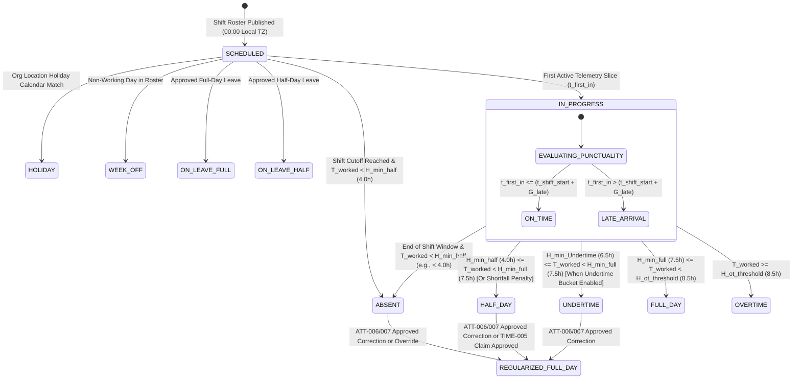

# PHASE 11: SHIFT MANAGEMENT, CONCRETE DAILY ATTENDANCE STATE MACHINE, BPO SHRINKAGE ANALYTICS & EXCEPTION GOVERNANCE

**Document Classification:** Master Engineering & Screen-by-Screen Specification (Phase 11 of 12)  
**System:** HydiEms Enterprise Shift Scheduling (`SHIFT-001..005`) & Attendance/Shrinkage Engine (`ATT-001..012`)  
**Storage Architecture:** MySQL 8.0 InnoDB (`shifts`, `shift_assignments`, `attendance_daily_ledger`, `attendance_correction_requests`) + ClickHouse 24.x (Intraday Punch & Break Rollups) + Redis 7.2 (Shift Start Grace Timers)  

---

## 1. CONCRETE DAILY ATTENDANCE STATE MACHINE & OVERRIDE GOVERNANCE MATRIX

### 1.1 Deterministic Daily Attendance State Machine (`ABSENT` vs `HALF_DAY` vs `UNDERTIME` vs `FULL_DAY` vs `OVERTIME`)

Every employee's daily attendance record in `attendance_daily_ledger` is resolved against their assigned shift $S$ (or department/org default shift) anchored in the employee's `iana_timezone`. Let:
- $T_{\text{worked}}$ = Total Net Working Hours (`ActiveInputTime + PaidAwayWorkingTime + ApprovedManualTime`) logged within the shift's valid tracking window.
- $H_{\text{target}}$ = Shift Target Net Working Hours (default `8.00 hours` = `28,800 seconds`).
- $H_{\text{min\_full}}$ = Minimum Net Working Hours for `FULL_DAY` (default `7.50 hours` = `27,000 seconds`, configurable per shift).
- $H_{\text{min\_half}}$ = Minimum Net Working Hours for `HALF_DAY` (default `4.00 hours` = `14,400 seconds`, configurable per shift).
- $H_{\text{ot\_threshold}}$ = Minimum Net Working Hours to accrue `OVERTIME` (default `8.50 hours` = `30,600 seconds`).
- $t_{\text{first\_in}}$ = Timestamp of first active `WORKING` slice (or biometric/mobile punch-in).
- $t_{\text{shift\_start}}$ = Scheduled shift start timestamp; $G_{\text{late}}$ = Grace period in minutes (e.g., `15 minutes`).



### 1.2 Concrete Threshold Decision Table & Late-Penalty Escalation Rules

| Attendance Status | Primary Mathematical Condition ($T_{\text{worked}}$) | Punctuality / Secondary Modifiers | Payroll & Leave Deduction Impact |
| :--- | :--- | :--- | :--- |
| **`ABSENT`** | $T_{\text{worked}} < H_{\text{min\_half}}$ (`< 4.0h`) and no approved leave | Also triggered if `require_minimum_productive_pct` is enabled and `Productivity % < 25%`. | `0.0` Day Credited (`1.0` LOP / Unpaid Absence unless regularized). |
| **`HALF_DAY`** | $H_{\text{min\_half}} \le T_{\text{worked}} < H_{\text{min\_Undertime}}$ (`4.0h .. 6.49h`) | Or triggered by **Late Penalty Rule**: e.g., `3rd Late Arrival in Month -> Auto-Downgrade to HALF_DAY` or arrival `> 120 mins` after shift start. | `0.5` Day Credited (`0.5` Casual Leave or `0.5` LOP deducted). |
| **`UNDERTIME`** | $H_{\text{min\_Undertime}} \le T_{\text{worked}} < H_{\text{min\_full}}$ (`6.5h .. 7.49h`) | Employee completed substantial work (`>= 6.5h`) but fell short of full shift requirement (`7.5h`) by `1m .. 60m`. | `1.0` Attendance Day Credited, but shortfall minutes (`H_target - T_worked`) accumulate in monthly **Undertime Deficit Ledger**. |
| **`FULL_DAY`** | $H_{\text{min\_full}} \le T_{\text{worked}} < H_{\text{ot\_threshold}}$ (`7.5h .. 8.49h`) | Orthogonal flags recorded: `is_late = true/false`, `late_by_minutes`, `is_early_exit = true/false`. | `1.0` Full Day Credited. |
| **`OVERTIME`** | $T_{\text{worked}} \ge H_{\text{ot\_threshold}}$ (`>= 8.5h`) | Overtime accrued = $T_{\text{worked}} - H_{\text{target}}$. Requires manager approval (`ATT-011`) if `overtime_requires_approval = true`. | `1.0` Full Day + Overtime Multiplier (`1.5x` Weekday / `2.0x` Weekend or Comp-Off credit). |

---

### 1.3 Attendance Override Governance Matrix

| Actor Role | Allowed Override Transitions | Max Retroactive Window | Mandatory Controls & Audit Requirements |
| :--- | :--- | :--- | :--- |
| **Employee (`SELF`)** | Cannot directly mutate status; submits `ATT-006` Correction Request (`ABSENT -> FULL_DAY`, `HALF_DAY -> FULL_DAY`, `Clear Late Flag`). | `<= 7 Days` (and Pay Period Unlocked) | Must provide reason code (`Forgot to Start Agent`, `Power Outage`, `Client Site Visit`) + text note. Routes to `manager_id`. |
| **Team Lead / Manager** | Approve/Reject `ATT-006` requests (`ATT-007`) for direct reports; waive `is_late` penalty up to `3 times/month/employee`. | `<= 15 Days` (and Pay Period Unlocked) | Cannot self-approve own attendance; every approval writes `ATTENDANCE_REGULARIZED_BY_MANAGER` to `audit_logs`. |
| **HR Manager** | Direct override of any employee's status (`ABSENT <-> HALF_DAY <-> UNDERTIME <-> FULL_DAY <-> ON_LEAVE`), bulk regularization (`BULK-001`). | `<= 45 Days` | Requires mandatory `override_reason` (`>= 10 chars`); preserves original `system_computed_status` column alongside `overridden_status`. |
| **Org Admin / Payroll Admin** | Can unlock locked payroll periods and override historical attendance records. | `<= 365 Days` | Triggers `HIGH` severity compliance alert `LOCKED_PERIOD_ATTENDANCE_MODIFIED` visible in Tab 16 (`audit`). |

---

## 2. COMPLETE MYSQL 8.0 INNODB DDL (PHASE 11)

```sql
-- ============================================================================
-- 1. SHIFTS MASTER TABLE (FIXED, FLEXIBLE, NIGHT, SPLIT SHIFTS)
-- ============================================================================
CREATE TABLE IF NOT EXISTS shifts (
    id BINARY(16) NOT NULL,
    org_id BINARY(16) NOT NULL,
    shift_code VARCHAR(32) NOT NULL COMMENT 'e.g., GEN-09-18, UK-13-22, US-NIGHT-21-06',
    name VARCHAR(120) NOT NULL,
    shift_type ENUM('FIXED', 'FLEXIBLE', 'NIGHT_CROSS_MIDNIGHT', 'SPLIT') NOT NULL DEFAULT 'FIXED',
    color_hex CHAR(7) NOT NULL DEFAULT '#3B82F6',
    
    -- Timing Rules (Evaluated in Employee Local Timezone or Fixed Shift Timezone)
    timezone_mode ENUM('EMPLOYEE_LOCAL_TZ', 'FIXED_SHIFT_TZ') NOT NULL DEFAULT 'EMPLOYEE_LOCAL_TZ',
    fixed_iana_timezone VARCHAR(64) NULL,
    start_time TIME NOT NULL COMMENT '09:00:00 (For FLEXIBLE shifts, earliest core start window)',
    end_time TIME NOT NULL COMMENT '18:00:00 (For NIGHT shifts, e.g., 06:00:00 next calendar day)',
    
    -- Split Shift Segment 2 (Populated only when shift_type = SPLIT)
    split_segment2_start_time TIME NULL,
    split_segment2_end_time TIME NULL,
    
    -- Flexible Shift Core Hours (Populated when shift_type = FLEXIBLE)
    core_hours_start_time TIME NULL COMMENT 'e.g., 11:00:00 — mandatory overlap window',
    core_hours_end_time TIME NULL COMMENT 'e.g., 16:00:00',
    
    -- Punctuality & Grace Thresholds
    grace_period_late_minutes SMALLINT UNSIGNED NOT NULL DEFAULT 15,
    grace_period_early_exit_minutes SMALLINT UNSIGNED NOT NULL DEFAULT 15,
    max_late_minutes_before_half_day SMALLINT UNSIGNED NULL DEFAULT 120,
    late_arrivals_per_month_for_half_day_penalty TINYINT UNSIGNED NULL DEFAULT 3,
    
    -- Concrete Daily Attendance Hour Thresholds (in Seconds)
    target_gross_seconds INT UNSIGNED NOT NULL DEFAULT 32400 COMMENT '9.0h including 1h break',
    target_net_working_seconds INT UNSIGNED NOT NULL DEFAULT 28800 COMMENT '8.0h net working time',
    min_full_day_seconds INT UNSIGNED NOT NULL DEFAULT 27000 COMMENT '7.5h minimum for FULL_DAY',
    min_undertime_seconds INT UNSIGNED NOT NULL DEFAULT 23400 COMMENT '6.5h minimum for UNDERTIME',
    min_half_day_seconds INT UNSIGNED NOT NULL DEFAULT 14400 COMMENT '4.0h minimum for HALF_DAY',
    min_overtime_threshold_seconds INT UNSIGNED NOT NULL DEFAULT 30600 COMMENT '8.5h threshold to start accruing OT',
    
    -- Working Days Bitmask or JSON (1=Mon .. 7=Sun; default Mon-Fri [1,2,3,4,5])
    working_days_json JSON NOT NULL,
    overtime_allowed BOOLEAN NOT NULL DEFAULT TRUE,
    overtime_requires_approval BOOLEAN NOT NULL DEFAULT TRUE,
    
    is_default_org_shift BOOLEAN NOT NULL DEFAULT FALSE,
    is_active BOOLEAN NOT NULL DEFAULT TRUE,
    created_at DATETIME(3) NOT NULL DEFAULT CURRENT_TIMESTAMP(3),
    updated_at DATETIME(3) NOT NULL DEFAULT CURRENT_TIMESTAMP(3) ON UPDATE CURRENT_TIMESTAMP(3),
    
    PRIMARY KEY (id),
    UNIQUE KEY uq_shift_org_code (org_id, shift_code)
) ENGINE=InnoDB DEFAULT CHARSET=utf8mb4 COLLATE=utf8mb4_0900_ai_ci;

-- ============================================================================
-- 2. SHIFT ASSIGNMENTS & ROTATING ROSTER LEDGER (SHIFT-004..005)
-- ============================================================================
CREATE TABLE IF NOT EXISTS shift_assignments (
    id BINARY(16) NOT NULL,
    org_id BINARY(16) NOT NULL,
    target_type ENUM('EMPLOYEE', 'TEAM', 'DEPARTMENT') NOT NULL,
    target_id BINARY(16) NOT NULL,
    shift_id BINARY(16) NOT NULL,
    effective_from DATE NOT NULL,
    effective_to DATE NULL COMMENT 'NULL = indefinite recurring assignment',
    assigned_by BINARY(16) NOT NULL,
    created_at DATETIME(3) NOT NULL DEFAULT CURRENT_TIMESTAMP(3),
    PRIMARY KEY (id),
    KEY idx_sa_lookup (org_id, target_type, target_id, effective_from, effective_to),
    CONSTRAINT fk_sa_shift FOREIGN KEY (shift_id) REFERENCES shifts (id) ON DELETE RESTRICT
) ENGINE=InnoDB DEFAULT CHARSET=utf8mb4 COLLATE=utf8mb4_0900_ai_ci;

-- ============================================================================
-- 3. ATTENDANCE DAILY LEDGER (ATT-001..012)
-- ============================================================================
CREATE TABLE IF NOT EXISTS attendance_daily_ledger (
    id BINARY(16) NOT NULL,
    org_id BINARY(16) NOT NULL,
    employee_id BINARY(16) NOT NULL,
    department_id BINARY(16) NOT NULL,
    team_id BINARY(16) NULL,
    work_date DATE NOT NULL COMMENT 'Shift anchor date in employee local TZ',
    shift_id BINARY(16) NOT NULL,
    
    -- Scheduled Window (UTC)
    scheduled_start_utc DATETIME(3) NOT NULL,
    scheduled_end_utc DATETIME(3) NOT NULL,
    target_net_seconds INT UNSIGNED NOT NULL DEFAULT 28800,
    
    -- Actual Telemetry Timestamps & Breakdown (Seconds)
    first_punch_in_utc DATETIME(3) NULL,
    last_punch_out_utc DATETIME(3) NULL,
    gross_span_seconds INT UNSIGNED NOT NULL DEFAULT 0,
    net_working_seconds INT UNSIGNED NOT NULL DEFAULT 0,
    productive_seconds INT UNSIGNED NOT NULL DEFAULT 0,
    neutral_seconds INT UNSIGNED NOT NULL DEFAULT 0,
    unproductive_seconds INT UNSIGNED NOT NULL DEFAULT 0,
    idle_seconds INT UNSIGNED NOT NULL DEFAULT 0,
    paid_break_seconds INT UNSIGNED NOT NULL DEFAULT 0,
    unpaid_break_seconds INT UNSIGNED NOT NULL DEFAULT 0,
    meeting_training_away_seconds INT UNSIGNED NOT NULL DEFAULT 0,
    personal_mode_seconds INT UNSIGNED NOT NULL DEFAULT 0,
    manual_approved_seconds INT UNSIGNED NOT NULL DEFAULT 0,
    
    -- Punctuality, Undertime & Overtime Metrics
    is_late BOOLEAN NOT NULL DEFAULT FALSE,
    late_by_seconds INT UNSIGNED NOT NULL DEFAULT 0,
    is_early_exit BOOLEAN NOT NULL DEFAULT FALSE,
    early_exit_by_seconds INT UNSIGNED NOT NULL DEFAULT 0,
    undertime_shortfall_seconds INT UNSIGNED NOT NULL DEFAULT 0,
    overtime_seconds INT UNSIGNED NOT NULL DEFAULT 0,
    overtime_approval_status ENUM('NOT_APPLICABLE', 'PENDING', 'APPROVED', 'REJECTED') NOT NULL DEFAULT 'NOT_APPLICABLE',
    
    -- System-Computed vs. Overridden Status
    system_computed_status ENUM('ABSENT', 'HALF_DAY', 'UNDERTIME', 'FULL_DAY', 'OVERTIME', 'ON_LEAVE', 'HOLIDAY', 'WEEK_OFF') NOT NULL DEFAULT 'ABSENT',
    final_status ENUM('ABSENT', 'HALF_DAY', 'UNDERTIME', 'FULL_DAY', 'OVERTIME', 'ON_LEAVE', 'HOLIDAY', 'WEEK_OFF') NOT NULL DEFAULT 'ABSENT',
    is_regularized BOOLEAN NOT NULL DEFAULT FALSE,
    regularized_by BINARY(16) NULL,
    regularized_at DATETIME(3) NULL,
    regularization_note VARCHAR(500) NULL,
    
    is_payroll_locked BOOLEAN NOT NULL DEFAULT FALSE,
    updated_at DATETIME(3) NOT NULL DEFAULT CURRENT_TIMESTAMP(3) ON UPDATE CURRENT_TIMESTAMP(3),
    
    PRIMARY KEY (id),
    UNIQUE KEY uq_att_emp_date (org_id, employee_id, work_date),
    KEY idx_att_org_date_status (org_id, work_date, final_status),
    KEY idx_att_org_dept_date (org_id, department_id, work_date),
    KEY idx_att_late_report (org_id, work_date, is_late, late_by_seconds DESC)
) ENGINE=InnoDB DEFAULT CHARSET=utf8mb4 COLLATE=utf8mb4_0900_ai_ci;

-- ============================================================================
-- 4. ATTENDANCE CORRECTION / REGULARIZATION REQUESTS (ATT-006..007)
-- ============================================================================
CREATE TABLE IF NOT EXISTS attendance_correction_requests (
    id BINARY(16) NOT NULL,
    org_id BINARY(16) NOT NULL,
    attendance_ledger_id BINARY(16) NOT NULL,
    employee_id BINARY(16) NOT NULL,
    work_date DATE NOT NULL,
    
    request_type ENUM('STATUS_UPGRADE', 'LATE_WAIVER', 'EARLY_EXIT_WAIVER', 'MISSING_PUNCH_ADJUSTMENT') NOT NULL,
    current_status VARCHAR(32) NOT NULL,
    requested_status ENUM('FULL_DAY', 'HALF_DAY', 'OVERTIME') NOT NULL,
    requested_punch_in_utc DATETIME(3) NULL,
    requested_punch_out_utc DATETIME(3) NULL,
    
    reason_category ENUM('AGENT_ISSUE', 'POWER_INTERNET_OUTAGE', 'CLIENT_ONSITE_MEETING', 'FORGOT_TO_START_TIMER', 'MEDICAL_EMERGENCY', 'OTHER') NOT NULL,
    employee_explanation VARCHAR(500) NOT NULL,
    attachment_s3_key VARCHAR(512) NULL,
    
    approval_status ENUM('PENDING', 'APPROVED', 'REJECTED', 'CANCELLED') NOT NULL DEFAULT 'PENDING',
    assigned_approver_id BINARY(16) NOT NULL,
    reviewed_by BINARY(16) NULL,
    reviewed_at DATETIME(3) NULL,
    reviewer_comment VARCHAR(500) NULL,
    
    created_at DATETIME(3) NOT NULL DEFAULT CURRENT_TIMESTAMP(3),
    PRIMARY KEY (id),
    KEY idx_acr_org_approver (org_id, assigned_approver_id, approval_status, created_at DESC),
    KEY idx_acr_emp_date (org_id, employee_id, work_date),
    CONSTRAINT fk_acr_ledger FOREIGN KEY (attendance_ledger_id) REFERENCES attendance_daily_ledger (id) ON DELETE CASCADE
) ENGINE=InnoDB DEFAULT CHARSET=utf8mb4 COLLATE=utf8mb4_0900_ai_ci;
```

---

## 3. SHIFT MANAGEMENT SCREENS (`SHIFT-001..005`)

### 3.1 `SHIFT-001` — Shift Operations & Coverage Dashboard
- **Route:** `/org/[orgSlug]/shifts/dashboard`
- **Purpose:** Displays 24-hour global shift coverage across Fixed, Flexible, Night, and Split shifts, highlighting real-time active staffing vs. scheduled headcount per shift (`Morning Shift: 410/425 Active (96.5%)`, `US Night Shift: 118/120 Active (98.3%)`), understaffed shift alerts, and punctuality by shift.
- **Endpoints:** `GET /api/v1/shifts/dashboard?date=2026-09-26`

### 3.2 `SHIFT-002` — Shift Catalog & Policy List
- **Route:** `/org/[orgSlug]/shifts/list`
- **Purpose:** Searchable table of all configured `shifts` showing Shift Code, Type (`FIXED`, `FLEXIBLE`, `NIGHT_CROSS_MIDNIGHT`, `SPLIT`), Start–End Window, Grace Period, Full-Day / Half-Day / Undertime / Overtime thresholds, Assigned Employee Count, and quick actions (`[Edit]`, `[Clone Shift]`, `[Assign Employees]`).
- **Endpoints:** `GET /api/v1/shifts`, `DELETE /api/v1/shifts/:shiftId` (blocked if active assignments exist).

### 3.3 `SHIFT-003` — Create / Edit Shift Modal & Rule Builder (Fixed / Flexible / Night / Split)
- **Route:** `/org/[orgSlug]/shifts/new` (or Drawer on `SHIFT-002`)
- **Purpose:** Configures all timing and attendance state-machine thresholds for a shift:
  - **Fixed Shift:** Explicit `start_time` (`09:00`) and `end_time` (`18:00`) + `grace_period_late_minutes` (`15m`).
  - **Flexible Shift:** Employee can start anytime between `07:00 – 11:00`, must be online during `core_hours` (`11:00 – 16:00`), and must complete `target_net_working_seconds` (`8.0h`).
  - **Night Shift (Cross-Midnight):** `start_time = 21:00`, `end_time = 06:00 (+1 day)`. Automatically configures the **Shift Anchor Cutoff Buffer** (`start_time - 4 hours` to `end_time + 6 hours`) so pre-shift early logins at `20:30` and post-shift overtime until `08:00` are seamlessly bound to the anchor date's ledger row.
  - **Split Shift:** Defines Segment 1 (`08:00 – 12:00`) + unpaid split gap + Segment 2 (`16:00 – 20:00`), evaluating punctuality on both segment starts and summing working time across both segments.
- **Validation Rules:** `min_half_day_seconds < min_undertime_seconds <= min_full_day_seconds <= target_net_working_seconds <= min_overtime_threshold_seconds`.
- **Endpoints:** `POST /api/v1/shifts`, `PUT /api/v1/shifts/:shiftId`

### 3.4 `SHIFT-004` — Shift Assignment Matrix (Employee / Team / Department)
- **Route:** `/org/[orgSlug]/shifts/assignments`
- **Purpose:** Assigns shifts at three hierarchical precedence levels: `1. Explicit Employee Assignment` > `2. Team Assignment` > `3. Department Assignment` > `4. Org Default Shift`. Supports effective date ranges (`effective_from` .. `effective_to`) and rotational shift templates (e.g., *Auto-rotate Team A from Morning Shift to Evening Shift every 2 weeks*).
- **Endpoints:** `POST /api/v1/shifts/assignments/bulk`

### 3.5 `SHIFT-005` — Interactive Shift Roster Calendar
- **Route:** `/org/[orgSlug]/shifts/calendar`
- **Purpose:** Drag-and-drop weekly/monthly shift scheduling calendar for BPOs, 24/7 NOCs, and Support teams. Supports shift swaps between two employees, drag-to-copy previous week's roster, and conflict warnings when a shift is assigned on an employee's approved leave day or violates minimum rest hours between consecutive shifts (`< 11 hours rest` EU Working Time Directive guard).
- **Endpoints:** `GET /api/v1/shifts/roster-calendar`, `PUT /api/v1/shifts/roster-calendar/publish`

---

## 4. ATTENDANCE & SHRINKAGE ENGINE SCREENS (`ATT-001..012`)

---

### 4.1 `ATT-001` — Attendance Executive Dashboard
- **Route:** `/org/[orgSlug]/attendance/dashboard`
- **Purpose:** Real-time and historical attendance command center displaying:
  - **8 KPI Cards:** *Present (Full Day + Overtime)*, *Late Arrivals*, *Half-Day*, *Undertime*, *Absent (Unplanned)*, *On Approved Leave*, *Total Overtime Hours*, *Overall Shrinkage %*.
  - **30-Day Attendance & Punctuality Stacked Trend Chart.**
  - **Department Punctuality & Absenteeism Breakdown Table.**
- **Endpoints:** `GET /api/v1/attendance/dashboard`

### 4.2 `ATT-002` — Daily Attendance Intraday Timeline
- **Route:** `/org/[orgSlug]/attendance/daily-timeline`
- **Purpose:** Visualizes every employee's actual punch-in to punch-out span superimposed over their scheduled shift window (`scheduled_start_utc` .. `scheduled_end_utc`) on a 24-hour horizontal Gantt grid, immediately exposing late starts (crimson left gap), early exits (crimson right gap), mid-shift breaks, and overtime extensions (indigo tail).
- **Endpoints:** `GET /api/v1/attendance/daily-timeline?date=2026-09-26`

### 4.3 `ATT-003` — Weekly Attendance Grid
- **Route:** `/org/[orgSlug]/attendance/weekly`
- **Purpose:** 7-column (`Mon–Sun`) employee attendance grid showing daily status badge (`P`, `L`, `HD`, `UT`, `OT`, `A`, `LV`, `WO`, `H`), first punch-in / last punch-out times, net worked hours, and weekly cumulative totals.
- **Endpoints:** `GET /api/v1/attendance/weekly`

### 4.4 `ATT-004` — Monthly Attendance Calendar & Payroll Register
- **Route:** `/org/[orgSlug]/attendance/monthly`
- **Purpose:** High-density 31-day muster roll / payroll attendance register for HR and Payroll teams, displaying single-letter status codes per day (`P`, `HD`, `A`, `CL`, `SL`, `PL`, `WO`, `HO`) + summary columns on the right: `Payable Days (e.g., 28.5 / 30)`, `Present Days`, `Half Days`, `Paid Leaves`, `LOP / Absent Days`, `Late Count`, `Approved OT Hours`.
- **Endpoints:** `GET /api/v1/attendance/monthly-register`, `POST /api/v1/attendance/monthly-register/export`

### 4.5 `ATT-005` — Employee Attendance Detail Drawer / View
- **Route:** `/org/[orgSlug]/attendance/employees/[employeeId]` (Also embedded in `WF-003` Tab 2)
- **Purpose:** Individual employee's monthly attendance calendar, punctuality score, late streak counter, undertime deficit balance, and complete log of `attendance_correction_requests`.
- **Endpoints:** `GET /api/v1/attendance/employees/:employeeId`

### 4.6 `ATT-006` — Employee Attendance Correction / Regularization Request Modal
- **Route:** `/org/[orgSlug]/attendance/regularize`
- **Purpose:** Self-service form for employees to request regularization of an `ABSENT`, `HALF_DAY`, `UNDERTIME`, or `LATE` record within the allowed retroactive window (`<= 7 days`).
- **Validation Rules:** Blocks submission if `is_payroll_locked == true` or if employee has exceeded `max_regularization_requests_per_month` (default `4/month`).
- **Endpoints:** `POST /api/v1/attendance/correction-requests`

### 4.7 `ATT-007` — Manager Attendance Regularization Approval Workbench
- **Route:** `/org/[orgSlug]/attendance/approvals`
- **Purpose:** Manager/HR inbox for reviewing `ATT-006` correction requests and direct status overrides. Displays the employee's actual tracked telemetry (`net_working_seconds`, `first_punch_in_utc`, `WF-005` activity strip) right next to the requested override so the manager can verify whether the employee actually worked before approving.
- **Endpoints:** `GET /api/v1/attendance/correction-requests`, `POST /api/v1/attendance/correction-requests/:id/decide`, `POST /api/v1/attendance/ledger/:ledgerId/admin-override`

### 4.8 `ATT-008` — Attendance Exceptions & Anomaly Detection Queue
- **Route:** `/org/[orgSlug]/attendance/exceptions`
- **Purpose:** Automated exception rules engine surfacing high-priority attendance anomalies:
  1. **Consecutive Unplanned Absences (`>= 3 days` — Potential Absconding Alert).**
  2. **Ghost Punch / Low-Activity Presence (`Gross Span >= 8h` but `Net Working Time < 3h` or `Productivity < 25%`).**
  3. **Missing Punch-Out / Left Workstation Running Overnight (`Continuous Idle > 4h at end of shift`).**
  4. **Habitual Late Penalty Triggered (`3rd Late Arrival in Month -> Auto Half-Day Applied`).**
  5. **Weekend / Holiday Unscheduled Work without Overtime Pre-Approval.**
- **Endpoints:** `GET /api/v1/attendance/exceptions`

### 4.9 `ATT-009` — Late Arrival & Early Departure Punctuality Report
- **Route:** `/org/[orgSlug]/attendance/late-report`
- **Purpose:** Ranks employees and teams by frequency and severity of late arrivals (`first_punch_in_utc > scheduled_start_utc + grace_period`) and early departures (`last_punch_out_utc < scheduled_end_utc - grace_period`), with histogram buckets (`1–15m late`, `16–30m late`, `31–60m late`, `>60m late`) and Habitual Late Offender badges.
- **Endpoints:** `GET /api/v1/attendance/late-report`

---

### 4.10 `ATT-010` — BPO & Enterprise Shrinkage Analytics Report (External vs. Internal Shrinkage)

1. **Screen ID & Title:** `ATT-010` — Workforce & BPO Shrinkage Analytics Engine (External vs. Internal Shrinkage)
2. **Route / URL / Navigation Path & Parent Layout:** `/org/[orgSlug]/attendance/shrinkage`
3. **Purpose & Operational Role:**
   - Provides Workforce Management (WFM), BPO Operations, Contact Centers, and Support Leaders with an industry-standard **Erlang-C / WFM Shrinkage Breakdown**, quantifying the exact percentage of Rostered Paid Hours lost to **External Shrinkage** (Out-of-Office) and **Internal Shrinkage** (In-Office/Online Non-Productive Overhead).
4. **Exact Mathematical Formulation (BPO WFM Standard):**

   Let $H_{\text{rostered}}$ be Total Scheduled/Rostered Shift Hours (excluding unpaid lunch breaks):

   $$\text{ExternalShrinkageHours} (H_{\text{ext}}) = H_{\text{PlannedLeave}} + H_{\text{UnplannedSickLeave}} + H_{\text{UnplannedAbsent (NCNS)}} + H_{\text{PublicHolidays}} + H_{\text{LateArrivalLoss}} + H_{\text{EarlyExitLoss}}$$

   $$\text{InternalShrinkageHours} (H_{\text{int}}) = H_{\text{PaidBreaks (Tea/Aux)}} + H_{\text{TeamMeetings & Huddles}} + H_{\text{Coaching & 1-on-1s}} + H_{\text{Training}} + H_{\text{System/IT Downtime}} + H_{\text{UnaccountedIdle}}$$

   $$\text{ExternalShrinkagePct} = \frac{H_{\text{ext}}}{H_{\text{rostered}}} \times 100, \qquad \text{InternalShrinkagePct} = \frac{H_{\text{int}}}{H_{\text{rostered}}} \times 100$$

   $$\text{TotalShrinkagePct} = \frac{H_{\text{ext}} + H_{\text{int}}}{H_{\text{rostered}}} \times 100, \qquad \text{NetProductiveStaffingHours} = H_{\text{rostered}} - (H_{\text{ext}} + H_{\text{int}})$$

   $$\text{RequiredHeadcountMultiplier} = \frac{1}{1 - (\text{TotalShrinkagePct} / 100)}$$
   *(Example: If $\text{TotalShrinkagePct} = 30.0\%$, to staff 100 productive seats on the floor, WFM must roster $100 / (1 - 0.30) = 143$ agents).*

5. **Layout & Wireframe Topology:**
   - **Top WFM Scorecard Strip:**
     - *Total Shrinkage %* (vs Target SLA threshold, e.g., `26.4% vs 25.0% Target`),
     - *External Shrinkage % (`14.2%`)*,
     - *Internal Shrinkage % (`12.2%`)*,
     - *Net Productive Floor Utilization (`73.6%`)*,
     - *Erlang Staffing Multiplier (`1.36x`)*.
   - **Two-Tier Sunburst / Waterfall Chart:** Visualizes `Rostered Hours (100%)` cascading down through External Shrinkage buckets (`Planned Leave`, `Unplanned Absence`, `Lateness`) -> `Present Hours` -> Internal Shrinkage buckets (`Aux Breaks`, `Meetings`, `Training`, `System Idle`) -> `Net Productive Hours`.
   - **Team / Shift / Queue Shrinkage Matrix Table:** Compares shrinkage across Shifts (`Morning`, `Evening`, `Night`), Departments, and Managers with CSV/XLSX WFM export.
6. **Backend Fastify REST & WebSocket Endpoints:**
   - `GET /api/v1/attendance/shrinkage-report?from=2026-09-01&to=2026-09-26&groupBy=TEAM`
7. **Acceptance Criteria:**
   - **Given** a 100-seat BPO team rostered for `800.0 hours` today has `64.0h` Planned Leave, `16.0h` Absent, `8.0h` Late Loss (`External = 88.0h = 11.0%`) and `40.0h` Paid Tea Breaks, `24.0h` Training, `16.0h` Meetings (`Internal = 80.0h = 10.0%`), **When** `ATT-010` loads, **Then** External Shrinkage displays `11.00%`, Internal Shrinkage displays `10.00%`, Total Shrinkage displays `21.00%`, Net Productive Staffing Hours displays `632.0h (79.00%)`, and Required Headcount Multiplier displays `1.27x`.

---

### 4.11 `ATT-011` — Overtime Accrual, Cap Governance & Approval Report
- **Route:** `/org/[orgSlug]/attendance/overtime`
- **Purpose:** Tracks daily and weekly overtime accrued across the workforce (`overtime_seconds > 0`), enforces statutory maximum weekly/monthly overtime caps (e.g., `<= 12h/week`), verifies that overtime hours had `>= 70%` productive activity (preventing idle-padding overtime fraud), and lets managers approve overtime as either **Paid Overtime (`1.5x / 2.0x`)** or **Compensatory Off (`Comp-Off` leave credit)**.
- **Endpoints:** `GET /api/v1/attendance/overtime`, `POST /api/v1/attendance/overtime/bulk-decide`

### 4.12 `ATT-012` — Break Time Split & Paid vs. Unpaid Aux Ledger
- **Route:** `/org/[orgSlug]/attendance/break-splits`
- **Purpose:** Detailed audit ledger breaking down every employee's daily non-working intervals into `Paid Breaks (Within Quota)`, `Paid Break Overruns (Converted to Unpaid/Deducted)`, `Unpaid Breaks (Lunch/Personal)`, `Working Away (Meetings/Calls)`, and `Unclassified Idle Gaps`, feeding directly into payroll deduction rules.
- **Endpoints:** `GET /api/v1/attendance/break-splits`
