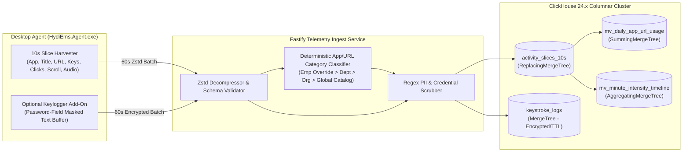

# PHASE 12: ACTIVITY TELEMETRY ENGINE, APPLICATION & FULL URL ANALYTICS, BROWSER BREAKDOWN, KEYSTROKE INTENSITY HEAT CURVES & CLICKHOUSE MERGETREE SCHEMAS

**Document Classification:** Master Engineering & Screen-by-Screen Specification (Phase 12 of 12)  
**System:** HydiEms High-Velocity Activity Analytics & Keystroke Intensity Engine (`ACT-001..007`)  
**Storage Architecture:** ClickHouse 24.x (`ReplacingMergeTree`, `SummingMergeTree`, `AggregatingMergeTree` + Materialized Views) + MySQL 8.0 InnoDB (Classification Rules & Consent Governance) + Redis 7.2 (Real-Time Stream Ingestion)  

---

## 1. ARCHITECTURAL OVERVIEW & HIGH-VELOCITY CLICKHOUSE TELEMETRY PIPELINE

At 10,000 active employees generating one 10-second telemetry slice every 10 seconds (`86,400,000 rows/day` = `~2.6 billion rows/month`), standard relational databases (`MySQL`/`PostgreSQL`) suffer B-tree index bloat and slow analytical scans. HydiEms solves this by routing all high-velocity activity slices and keystroke intensity metrics into **ClickHouse 24.x** partitioned by month and ordered by `(org_id, employee_id, work_date, slice_start)`, with real-time **Incremental Materialized Views** that pre-aggregate application, domain, browser, category, and minute-by-minute heat curves on ingest.



---

## 2. COMPLETE CLICKHOUSE 24.x MERGETREE SCHEMAS & MATERIALIZED VIEWS

```sql
-- ============================================================================
-- 1. RAW 10-SECOND ACTIVITY SLICES TABLE (ReplacingMergeTree for Idempotency & Idle Rollback)
-- ============================================================================
CREATE TABLE IF NOT EXISTS hydiems_telemetry.activity_slices_10s
(
    org_id UUID,
    employee_id UUID,
    department_id UUID,
    team_id UUID,
    device_id UUID,
    work_date Date COMMENT 'Resolved in employee iana_timezone',
    
    slice_id UUID COMMENT 'Deterministic UUIDv5(device_id, employee_id, slice_start)',
    slice_start DateTime64(3, 'UTC'),
    slice_end DateTime64(3, 'UTC'),
    duration_seconds UInt8 DEFAULT 10,
    
    -- 8-State Time & Productivity Classification
    time_state LowCardinality(String) COMMENT 'WORKING | IDLE | AWAY | PERSONAL_MODE | OFFLINE_GAP',
    productivity_class LowCardinality(String) COMMENT 'PRODUCTIVE | NEUTRAL | UNPRODUCTIVE | NO_IMPACT',
    productivity_score_weight Float32 DEFAULT 0.0 COMMENT '1.0 = Productive, 0.5 = Neutral, 0.0 = Unproductive',
    
    -- Application, Window & Browser Telemetry
    process_name LowCardinality(String),
    normalized_app_name LowCardinality(String) COMMENT 'e.g., Code.exe -> Visual Studio Code',
    app_category_name LowCardinality(String) COMMENT 'e.g., IDE & Coding, Communication, Design, Social Media',
    window_title String CODEC(ZSTD(3)),
    
    is_browser UInt8 DEFAULT 0,
    browser_family LowCardinality(String) COMMENT 'NONE | CHROME | EDGE | FIREFOX | SAFARI | BRAVE | OPERA | ARC',
    browser_domain LowCardinality(String) COMMENT 'e.g., github.com, docs.google.com',
    browser_url_path String CODEC(ZSTD(3)) COMMENT 'Sanitized URL without sensitive query tokens',
    is_incognito UInt8 DEFAULT 0,
    
    -- Project & Task Attribution
    project_id Nullable(UUID),
    task_id Nullable(UUID),
    away_reason_id Nullable(UUID),
    
    -- Hardware Input & Audio Intensity Metrics
    keystroke_count UInt16 DEFAULT 0,
    mouse_click_count UInt16 DEFAULT 0,
    mouse_scroll_ticks UInt16 DEFAULT 0,
    mouse_distance_px UInt32 DEFAULT 0,
    active_audio_call UInt8 DEFAULT 0,
    
    -- Intensity Score (0..100 normalized for heat curves)
    input_intensity_score UInt8 MATERIALIZED least(100, toUInt8(
        (keystroke_count * 2) + (mouse_click_count * 5) + (mouse_scroll_ticks * 1) + (if(active_audio_call = 1, 50, 0))
    )),
    
    -- Versioning for Retroactive Idle Rollback & Manual Time Overrides
    version UInt32 DEFAULT 1,
    ingested_at DateTime64(3, 'UTC') DEFAULT now64(3)
)
ENGINE = ReplacingMergeTree(version)
PARTITION BY toYYYYMM(work_date)
ORDER BY (org_id, work_date, employee_id, slice_start, slice_id)
TTL toDate(slice_start) + INTERVAL 36 MONTH DELETE
SETTINGS index_granularity = 8192;

-- ============================================================================
-- 2. MATERIALIZED VIEW: DAILY APP, WEBSITE, BROWSER & CATEGORY ROLLUP
--    Powers ACT-001, ACT-002, ACT-003, ACT-004, ACT-005 in < 15ms!
-- ============================================================================
CREATE TABLE IF NOT EXISTS hydiems_telemetry.daily_app_url_rollup
(
    org_id UUID,
    work_date Date,
    department_id UUID,
    team_id UUID,
    employee_id UUID,
    
    time_state LowCardinality(String),
    productivity_class LowCardinality(String),
    app_category_name LowCardinality(String),
    process_name LowCardinality(String),
    normalized_app_name LowCardinality(String),
    is_browser UInt8,
    browser_family LowCardinality(String),
    browser_domain LowCardinality(String),
    
    total_duration_seconds UInt64,
    total_keystrokes UInt64,
    total_mouse_clicks UInt64,
    total_mouse_scrolls UInt64,
    total_mouse_distance_px UInt64,
    audio_call_seconds UInt64,
    slice_count UInt64
)
ENGINE = SummingMergeTree()
PARTITION BY toYYYYMM(work_date)
ORDER BY (org_id, work_date, department_id, team_id, employee_id, time_state, productivity_class, app_category_name, normalized_app_name, browser_family, browser_domain);

CREATE MATERIALIZED VIEW IF NOT EXISTS hydiems_telemetry.mv_daily_app_url_rollup
TO hydiems_telemetry.daily_app_url_rollup
AS SELECT
    org_id,
    work_date,
    department_id,
    team_id,
    employee_id,
    time_state,
    productivity_class,
    app_category_name,
    process_name,
    normalized_app_name,
    is_browser,
    browser_family,
    browser_domain,
    sum(duration_seconds) AS total_duration_seconds,
    sum(keystroke_count) AS total_keystrokes,
    sum(mouse_click_count) AS total_mouse_clicks,
    sum(mouse_scroll_ticks) AS total_mouse_scrolls,
    sum(mouse_distance_px) AS total_mouse_distance_px,
    sumIf(duration_seconds, active_audio_call = 1) AS audio_call_seconds,
    count() AS slice_count
FROM hydiems_telemetry.activity_slices_10s
GROUP BY
    org_id, work_date, department_id, team_id, employee_id,
    time_state, productivity_class, app_category_name, process_name,
    normalized_app_name, is_browser, browser_family, browser_domain;

-- ============================================================================
-- 3. MATERIALIZED VIEW: MINUTE-BY-MINUTE ACTIVITY & INTENSITY TIMELINE (ACT-006 & ACT-007)
-- ============================================================================
CREATE TABLE IF NOT EXISTS hydiems_telemetry.minute_activity_rollup
(
    org_id UUID,
    work_date Date,
    employee_id UUID,
    minute_bucket DateTime('UTC'),
    
    dominant_time_state SimpleAggregateFunction(anyLast, String),
    dominant_productivity_class SimpleAggregateFunction(anyLast, String),
    dominant_app_name SimpleAggregateFunction(anyLast, String),
    dominant_domain SimpleAggregateFunction(anyLast, String),
    dominant_window_title SimpleAggregateFunction(anyLast, String),
    
    keystrokes_per_min SimpleAggregateFunction(sum, UInt64),
    clicks_per_min SimpleAggregateFunction(sum, UInt64),
    scrolls_per_min SimpleAggregateFunction(sum, UInt64),
    distance_px_per_min SimpleAggregateFunction(sum, UInt64),
    active_seconds_in_min SimpleAggregateFunction(sum, UInt64),
    audio_active_in_min SimpleAggregateFunction(max, UInt8)
)
ENGINE = AggregatingMergeTree()
PARTITION BY toYYYYMM(work_date)
ORDER BY (org_id, work_date, employee_id, minute_bucket);

CREATE MATERIALIZED VIEW IF NOT EXISTS hydiems_telemetry.mv_minute_activity_rollup
TO hydiems_telemetry.minute_activity_rollup
AS SELECT
    org_id,
    work_date,
    employee_id,
    toStartOfMinute(slice_start) AS minute_bucket,
    anyLast(time_state) AS dominant_time_state,
    anyLast(productivity_class) AS dominant_productivity_class,
    anyLast(normalized_app_name) AS dominant_app_name,
    anyLast(browser_domain) AS dominant_domain,
    anyLast(window_title) AS dominant_window_title,
    sum(toUInt64(keystroke_count)) AS keystrokes_per_min,
    sum(toUInt64(mouse_click_count)) AS clicks_per_min,
    sum(toUInt64(mouse_scroll_ticks)) AS scrolls_per_min,
    sum(toUInt64(mouse_distance_px)) AS distance_px_per_min,
    sumIf(toUInt64(duration_seconds), time_state = 'WORKING') AS active_seconds_in_min,
    max(active_audio_call) AS audio_active_in_min
FROM hydiems_telemetry.activity_slices_10s
GROUP BY org_id, work_date, employee_id, minute_bucket;

-- ============================================================================
-- 4. OPTIONAL KEYLOGGER TEXT AUDIT ADD-ON TABLE (ACT-006)
--    Strictly opt-in per policy, hardware password-field masked, 90-day auto-TTL
-- ============================================================================
CREATE TABLE IF NOT EXISTS hydiems_telemetry.keystroke_logs
(
    org_id UUID,
    employee_id UUID,
    device_id UUID,
    work_date Date,
    captured_at DateTime64(3, 'UTC'),
    
    process_name LowCardinality(String),
    normalized_app_name LowCardinality(String),
    window_title String CODEC(ZSTD(3)),
    browser_domain LowCardinality(String),
    
    -- Masked & Sanitized Typed Text Buffer (Max 512 chars per window focus or 30s flush)
    masked_text_chunk String CODEC(ZSTD(3)) COMMENT 'Password fields & regex PII replaced with [REDACTED_SECRET] at OS hook level',
    raw_char_count UInt16,
    masked_secret_triggered UInt8 DEFAULT 0 COMMENT '1 if OS Edit Control ES_PASSWORD / AXSecureTextField or credential regex triggered masking',
    dlp_keyword_matched LowCardinality(String) DEFAULT '' COMMENT 'Populated if text matched DLP watch keyword e.g. CONFIDENTIAL, EXPORT_DB',
    
    ingested_at DateTime64(3, 'UTC') DEFAULT now64(3)
)
ENGINE = MergeTree()
PARTITION BY toYYYYMM(work_date)
ORDER BY (org_id, work_date, employee_id, captured_at)
TTL toDate(captured_at) + INTERVAL 90 DAY DELETE
SETTINGS index_granularity = 8192;
```

---

## 3. SCREEN-BY-SCREEN 15-POINT ENGINEERING SPECIFICATIONS (`ACT-001..007`)

---

### 3.1 `ACT-001` — Activity Telemetry Executive Dashboard

1. **Screen ID & Title:** `ACT-001` — Organization Activity, App & Web Telemetry Dashboard
2. **Route / URL / Navigation Path & Parent Layout:** `/org/[orgSlug]/activity/dashboard`
3. **Purpose & Operational Role:** Provides an executive bird's-eye view of how the organization spends its digital working time across Applications, Websites, Browsers, and Activity Categories, correlating input intensity with productive output.
4. **User Personas & RBAC Permissions Matrix:** `activity.dashboard.read` (Scoped by Org / Dept / Team / Self).
5. **Layout & Wireframe Topology:**
   - **Top 6 Telemetry KPI Cards:** *Total Active App/Web Hours*, *Top Productive App (`VS Code — 1,420h`)*, *Top Unproductive Domain (`youtube.com — 112h`)*, *Overall Productivity Score (`83.4%`)*, *Mean Input Intensity (`48 KPM / 18 CPM`)*, *Unclassified Apps/Domains Requiring Rule Mapping (`14`)*.
   - **Middle Split Row:**
     - Left (6 cols): *Top 10 Applications Horizontal Bar Chart* (colored by `Productive`/`Neutral`/`Unproductive`).
     - Right (6 cols): *Top 10 Websites & Domains Horizontal Bar Chart*.
   - **Bottom Split Row:**
     - Left (4 cols): *Category Breakdown Donut (`ACT-005` preview)*.
     - Center (4 cols): *Browser Share Card (`ACT-004` preview)*.
     - Right (4 cols): *Intraday Hourly Activity & Input Intensity Curve*.
6. **Component-by-Component Breakdown & Data Bindings:** Queries `hydiems_telemetry.daily_app_url_rollup FINAL`.
7. **Interactive State Machine:** Clicking any bar in Top Apps or Top Websites navigates to `ACT-002` or `ACT-003` pre-filtered to that identifier; clicking `"14 Unclassified Apps"` opens a quick-classify drawer to assign `PRODUCTIVE | NEUTRAL | UNPRODUCTIVE` rules.
8. **Form Fields, Input Constraints & Validation Rules:** `fromDate`, `toDate`, `deptIds`, `teamIds`, `employeeIds`.
9. **Backend Fastify REST & WebSocket Endpoints:** `GET /api/v1/activity/dashboard`
10. **Database Queries & Storage Engine Mapping:** Executes parallel ClickHouse queries against `daily_app_url_rollup` (`< 25ms` execution time).
11. **Edge Cases, Race Conditions & Conflict Resolution:** When an Admin reclassifies an app from `NEUTRAL` to `PRODUCTIVE`, Fastify updates MySQL `productivity_policy_rules` and enqueues a background ClickHouse mutation/dictionary refresh so historical/current dashboards reflect the updated classification.
12. **Security, Privacy & Compliance Controls:** Enforces RBAC scope on `department_id` / `team_id`.
13. **Audit Trail Events Emitted:** `APP_CLASSIFICATION_RULE_UPDATED` (when using quick-classify drawer).
14. **Real-Time WebSocket / SSE Subscriptions & Cache Invalidation:** Refreshes every 60s.
15. **Acceptance Criteria:**
    - **Given** 1,000 employees have logged 50,000 hours of telemetry this month, **When** `ACT-001` loads, **Then** Top 10 Apps, Top 10 Domains, Category Donut, and Intensity KPIs render in `< 150ms` P95.

---

### 3.2 `ACT-002` — Application Usage & Process Classification Analytics

1. **Screen ID & Title:** `ACT-002` — Desktop Application Usage & Productivity Classification Matrix
2. **Route / URL / Navigation Path & Parent Layout:** `/org/[orgSlug]/activity/applications`
3. **Purpose & Operational Role:** Provides deep drill-down analytics into every desktop executable (`process_name` / `normalized_app_name`) used across the organization, showing total hours, % of active time, unique users count, input intensity (keystrokes/clicks while in foreground), category mapping, and 1-click policy classification overrides.
4. **User Personas & RBAC Permissions Matrix:** `activity.apps.read`; modifying classification rules requires `workforce.policies.manage`.
5. **Layout & Wireframe Topology:**
   - **Filter & Classification Tabs:** `All Applications (312)`, `Productive (145)`, `Neutral (98)`, `Unproductive (42)`, `Unclassified / New (27)`.
   - **Expandable Master-Detail Data Grid:**
     - **Parent Row (Application):** App Icon + `normalized_app_name` (`Visual Studio Code`), `process_name` (`Code.exe`), `Category` (`IDE & Coding`), `Classification Dropdown Pill` (`Productive` / `Neutral` / `Unproductive` / `No-Impact`), `Total Hours` (`4,820h 15m`), `Unique Employees` (`184`), `Avg Keystrokes/Min` (`62.4`).
     - **Expanded Child Rows:** Expanding `Visual Studio Code` reveals either:
       - *Sub-Tab A: Employees Using This App* (ranked by hours spent + productivity impact), or
       - *Sub-Tab B: Window Titles / Active Projects Inside App* (e.g., `phase12.md - hydiEMS - Visual Studio Code`).
6. **Component-by-Component Breakdown & Data Bindings:**
   - `InlineClassificationSelector`: Allows changing `Code.exe` classification at three scopes: `Global Organization Default`, `Specific Department (e.g., Engineering = Productive, Sales = Neutral)`, or `Specific Employee (WF-006)`.
7. **Interactive State Machine:** Expanding a row lazily fetches the per-employee or per-window-title breakdown from ClickHouse.
8. **Form Fields, Input Constraints & Validation Rules:** Search by `appName` or `processName`; filter by `productivityClass`, `categoryName`, `minDurationMinutes`.
9. **Backend Fastify REST & WebSocket Endpoints:**
   - `GET /api/v1/activity/applications`
   - `GET /api/v1/activity/applications/:appName/employees`
   - `GET /api/v1/activity/applications/:appName/window-titles`
   - `PUT /api/v1/activity/classifications/rule`
10. **Database Queries & Storage Engine Mapping:**
    ```sql
    SELECT
        normalized_app_name,
        any(process_name) AS sample_process,
        app_category_name,
        productivity_class,
        sum(total_duration_seconds) AS duration_seconds,
        uniqExact(employee_id) AS unique_employees,
        sum(total_keystrokes) AS keystrokes,
        sum(total_mouse_clicks) AS clicks
    FROM hydiems_telemetry.daily_app_url_rollup
    WHERE org_id = {orgId:UUID}
      AND work_date BETWEEN {fromDate:Date} AND {toDate:Date}
      AND time_state = 'WORKING'
    GROUP BY normalized_app_name, app_category_name, productivity_class
    ORDER BY duration_seconds DESC
    LIMIT {limit:UInt32} OFFSET {offset:UInt32};
    ```
11. **Edge Cases, Race Conditions & Conflict Resolution:** Multi-platform process normalization maps `Code.exe` (Windows), `Electron` / `Visual Studio Code.app` (macOS), and `code` (Linux) into the single canonical `normalized_app_name = 'Visual Studio Code'`.
12. **Security, Privacy & Compliance Controls:** `window-titles` endpoint requires `workforce.activity.view_titles`.
13. **Audit Trail Events Emitted:** `APP_PRODUCTIVITY_CLASSIFICATION_CHANGED`.
14. **Real-Time WebSocket / SSE Subscriptions & Cache Invalidation:** Invalidates ClickHouse dictionary cache on rule change.
15. **Acceptance Criteria:**
    - **Given** `Figma` is classified as `PRODUCTIVE` for the `Design` department and `NEUTRAL` for `Finance`, **When** filtering `ACT-002` by `Design` vs. `Finance`, **Then** each department's rows reflect its respective scoped classification and productivity calculation.

---

### 3.3 `ACT-003` — Website, Domain & Full URL Usage Analytics

1. **Screen ID & Title:** `ACT-003` — Website Domain & Granular Full URL Telemetry Workbench
2. **Route / URL / Navigation Path & Parent Layout:** `/org/[orgSlug]/activity/websites`
3. **Purpose & Operational Role:** Separates browser activity from generic `chrome.exe`/`msedge.exe` process containers to provide granular visibility into every second spent on specific root domains (`github.com`, `salesforce.com`, `youtube.com`, `chatgpt.com`), subdomains, and full URL paths (`youtube.com/watch?v=...` — distinguishing a React engineering tutorial from entertainment).
4. **User Personas & RBAC Permissions Matrix:** `activity.websites.read`; viewing full URL paths requires `workforce.activity.view_urls`.
5. **Layout & Wireframe Topology:**
   - **Two-Level Hierarchical Domain -> Path Grid:**
     - **Level 1 (Root Domain / Subdomain):** Favicon + `browser_domain` (`youtube.com`), Category (`Video & Streaming`), Classification Pill (`Unproductive` — with `[+ Add Path Exception Rule]` button), `Total Hours`, `Unique Users`, `Active Audio %`, `Bandwidth/Visits`.
     - **Level 2 (Full URL Path & Page Title Drill-Down):** Expanding `youtube.com` reveals individual URL paths (`youtube.com/watch?v=k8s-tutorial — "Kubernetes Production Architecture"` vs `youtube.com/watch?v=music-mix`) and the employees who visited them.
   - **URL Path Regex / Glob Rule Builder Modal:** Allows admins to classify `youtube.com/*` as `UNPRODUCTIVE` by default, while carving out `youtube.com/@CorporateChannel/*` or `docs.google.com/spreadsheets/*` as `PRODUCTIVE`!
6. **Component-by-Component Breakdown & Data Bindings:**
   - **URL Sanitization Pipeline (Agent + Fastify Ingest):** Automatically strips OAuth tokens, `session_id`, `jwt`, `code=`, `token=`, `password=`, and presigned query parameters from `browser_url_path` before storage so credentials in query strings are never persisted in ClickHouse.
7. **Interactive State Machine:** Supports instant domain search, classification filtering, and path-level exception creation.
8. **Form Fields, Input Constraints & Validation Rules:**
   - Path Rule Schema: `matchType: z.enum(['EXACT_DOMAIN', 'SUBDOMAIN_WILDCARD', 'URL_PREFIX', 'URL_REGEX'])`, `pattern: z.string().min(3).max(255)`.
9. **Backend Fastify REST & WebSocket Endpoints:**
   - `GET /api/v1/activity/websites`
   - `GET /api/v1/activity/websites/:domain/urls`
   - `POST /api/v1/activity/websites/path-rules`
10. **Database Queries & Storage Engine Mapping:** Level 1 queries `daily_app_url_rollup WHERE is_browser = 1`; Level 2 queries `activity_slices_10s WHERE org_id = ? AND browser_domain = ?` grouped by `browser_url_path, window_title`.
11. **Edge Cases, Race Conditions & Conflict Resolution:** Longest-match rule precedence: `URL_REGEX / URL_PREFIX` > `EXACT_SUBDOMAIN` > `ROOT_DOMAIN`.
12. **Security, Privacy & Compliance Controls:** Banking, healthcare, and employee assistance program (EAP) domains in the tenant's **Privacy Blacklist** have their `browser_url_path` and `window_title` stripped at the Agent prior to transmission.
13. **Audit Trail Events Emitted:** `WEBSITE_PATH_RULE_CREATED`, `FULL_URL_LOG_INSPECTED`.
14. **Real-Time WebSocket / SSE Subscriptions & Cache Invalidation:** Pushes updated URL regex rules to agents and ingest workers.
15. **Acceptance Criteria:**
    - **Given** `reddit.com` is `UNPRODUCTIVE` globally, and an Admin creates a `URL_PREFIX` rule marking `reddit.com/r/devops` as `PRODUCTIVE` for the DevOps team, **When** a DevOps engineer browses `reddit.com/r/devops/comments/123`, **Then** those slices are classified as `PRODUCTIVE`.

---

### 3.4 `ACT-004` — Browser Usage & Security Posture Breakdown (Chrome / Edge / Firefox / Safari / Brave)

1. **Screen ID & Title:** `ACT-004` — Web Browser Usage, Incognito Share & URL Hook Coverage Analytics
2. **Route / URL / Navigation Path & Parent Layout:** `/org/[orgSlug]/activity/browsers`
3. **Purpose & Operational Role:** Analyzes web activity segmented by browser engine (`Chrome`, `Microsoft Edge`, `Firefox`, `Safari`, `Brave`, `Opera`, `Arc`), comparing Productive vs. Unproductive time per browser, tracking **Incognito / Private Browsing percentage**, and auditing endpoints where browser URL extraction is blocked by missing macOS Accessibility/Automation permissions or unsupported browsers.
4. **User Personas & RBAC Permissions Matrix:** `activity.browsers.read` (Admin, IT Security, Dept Heads).
5. **Layout & Wireframe Topology:**
   - **5 Browser Share Cards (`CHROME`, `EDGE`, `FIREFOX`, `SAFARI`, `BRAVE / OTHER`):** Shows hours, user count, % share of total web time, and average productivity % per browser.
   - **Browser vs. Productivity Stacked Comparison Chart:** Reveals behavioral patterns (e.g., employees using `Edge` for `92% Productive` corporate SaaS work while using a secondary browser like `Brave` or `Firefox Incognito` for `78% Unproductive` browsing).
   - **Incognito & Unhooked Browser Compliance Table:** Lists employees spending `> 30 mins/day` in Incognito/Private mode or using unauthorized portable browsers.
6. **Component-by-Component Breakdown & Data Bindings:** Queries `daily_app_url_rollup WHERE is_browser = 1` grouped by `browser_family` and `activity_slices_10s` for `is_incognito = 1`.
7. **Interactive State Machine:** Clicking any browser card filters the employee and domain breakdown table below to that specific `browser_family`.
8. **Form Fields, Input Constraints & Validation Rules:** `fromDate`, `toDate`, `browserFamily`, `incognitoOnly: boolean`.
9. **Backend Fastify REST & WebSocket Endpoints:** `GET /api/v1/activity/browsers`
10. **Database Queries & Storage Engine Mapping:** Uses `browser_family` low-cardinality index in `daily_app_url_rollup`.
11. **Edge Cases, Race Conditions & Conflict Resolution:** If an employee launches a renamed browser executable (e.g., renaming `brave.exe` to `notepad_helper.exe`), the Agent inspects the Win32 PE Version Info `OriginalFilename` / macOS `CFBundleIdentifier` (`com.brave.Browser`) so it is still accurately classified as `BRAVE`.
12. **Security, Privacy & Compliance Controls:** Supports IT Governance policies that alert when non-managed browsers are used on corporate endpoints.
13. **Audit Trail Events Emitted:** Read-only analytics.
14. **Real-Time WebSocket / SSE Subscriptions & Cache Invalidation:** Standard 60s cache TTL.
15. **Acceptance Criteria:**
    - **Given** an employee uses `Chrome` for 5 hours (`90% Productive`) and `Brave (Incognito)` for 1 hour (`10% Productive`), **When** viewing `ACT-004`, **Then** both browsers appear with their respective hour totals, productivity percentages, and a `1.0h Incognito` badge.

---

### 3.5 `ACT-005` — Functional Category Analysis Donut & Role Alignment Matrix

1. **Screen ID & Title:** `ACT-005` — Application & Website Functional Category Analysis
2. **Route / URL / Navigation Path & Parent Layout:** `/org/[orgSlug]/activity/categories`
3. **Purpose & Operational Role:** Aggregates thousands of disparate apps and websites into **18 Standardized Functional Categories** (*IDE & Software Development*, *Cloud & DevOps Consoles*, *CRM & Sales Tools*, *Customer Support & Ticketing*, *Office Suite & Spreadsheets*, *Design & CAD*, *Internal Communication & Chat*, *Email & Calendar*, *Video Conferencing*, *Project Management*, *Documentation & Knowledge Base*, *AI Assistants & LLMs*, *Finance & ERP*, *HR & Recruiting*, *News & Media*, *Social Networking*, *Video & Streaming*, *Shopping & Gaming*), visualizing how each department's actual tool usage aligns with its job function.
4. **User Personas & RBAC Permissions Matrix:** `activity.categories.read`.
5. **Layout & Wireframe Topology:**
   - **Left (5 cols): Interactive Multi-Ring Sunburst / Donut Chart:**
     - Inner Ring: `Productive` / `Neutral` / `Unproductive` / `No-Impact`.
     - Outer Ring: The 18 Functional Categories sized by total hours.
   - **Right (7 cols): Department × Category Heatmap Matrix:** Rows = Departments (`Engineering`, `Sales`, `Support`, `Design`, `Finance`); Columns = Top Functional Categories; Cells = `% of Department Working Time` (e.g., `Engineering: 54% IDE & Dev, 18% Communication, 11% AI/LLMs`).
6. **Component-by-Component Breakdown & Data Bindings:** Queries `daily_app_url_rollup` grouped by `app_category_name, productivity_class`.
7. **Interactive State Machine:** Clicking any slice of the Category Donut drills down into the exact applications and domains comprising that category.
8. **Form Fields, Input Constraints & Validation Rules:** `fromDate`, `toDate`, `deptIds`, `teamIds`.
9. **Backend Fastify REST & WebSocket Endpoints:** `GET /api/v1/activity/categories`
10. **Database Queries & Storage Engine Mapping:** Sub-10ms ClickHouse aggregation on `app_category_name`.
11. **Edge Cases, Race Conditions & Conflict Resolution:** Custom internal enterprise web apps (e.g., `internal-erp.corp.local`) can be assigned to any of the 18 categories or a custom tenant category.
12. **Security, Privacy & Compliance Controls:** Department RBAC scoping enforced.
13. **Audit Trail Events Emitted:** None.
14. **Real-Time WebSocket / SSE Subscriptions & Cache Invalidation:** Standard caching.
15. **Acceptance Criteria:**
    - **Given** an organization views `ACT-005`, **When** hovering or clicking on `AI Assistants & LLMs` (`chatgpt.com`, `claude.ai`, `Cursor.exe`), **Then** the view breaks down exact hours and adoption rate across departments.

---

### 3.6 `ACT-006` — Keyboard & Mouse Activity, Intensity Heat Curves & Optional Keylogger Text Audit Add-On

1. **Screen ID & Title:** `ACT-006` — Input Intensity Heat Curves, Mouse/Keystroke Jiggler Detection & Optional Keylogger Text Audit
2. **Route / URL / Navigation Path & Parent Layout:** `/org/[orgSlug]/activity/input-intensity`
3. **Purpose & Operational Role:**
   - **Part A (Standard for All Customers — Zero-PII Numeric Intensity):** Analyzes keystroke counts, mouse clicks, scroll ticks, cursor travel distance, and hourly/10-minute **Input Intensity Heat Curves** (`0..100`), plus **Automated Mouse-Jiggler / Auto-Clicker Fraud Detection**.
   - **Part B (Optional High-Security DLP Add-On — Keylogger Text Audit):** For regulated environments with explicit legal consent (`keylogger_text_enabled = true`), provides a strictly access-controlled, password-masked audit viewer of typed text chunks (`keystroke_logs`) to investigate insider data exfiltration or compliance breaches.
4. **User Personas & RBAC Permissions Matrix:**
   - Part A (Numeric Intensity & Heat Curves): `activity.intensity.read` (Managers, HR, Admin).
   - Part B (Keylogger Text Audit Add-On): Requires **both** tenant license flag `addon_keylogger_audit = true` AND role permission `compliance.keylogger.inspect_text` (Restricted exclusively to Super Admin / Data Protection Officer; **never** accessible to regular Team Leads or Department Managers).
5. **Layout & Wireframe Topology:**
   - **Tab 1 — Input Intensity & Heat Curves:**
     - **KPI Cards:** *Total Keystrokes*, *Avg Keystrokes / Active Min (KPM)*, *Total Mouse Clicks & Scrolls*, *Mouse Jiggler / Macro Anomaly Alerts (`2 Flagged`)*.
     - **24-Hour × Employee Intensity Heatmap Grid:** Each cell represents a 15-minute or 1-hour bucket colored on a 5-stop Viridis/Emerald heat scale (`0 = Idle/Away`, `1..20 = Light Reading`, `21..60 = Standard Active Work`, `61..100 = High-Intensity Coding/Writing`).
   - **Tab 2 — Mouse Jiggler, Auto-Clicker & Mechanical Macro Anomaly Detector:**
     - Lists slices flagged by the **HydiEms Anti-Jiggler Heuristic Engine**:
       1. *Zero-Variance Periodic Input:* Keystrokes or mouse movements occurring at mathematically uniform intervals ($\sigma_{\Delta t} < 15\text{ms}$ over $\ge 10\text{ minutes}$, e.g., pressing `F15` or moving `+1px / -1px` every `30.00s`).
       2. *Single-Key Monoculture:* `keystroke_count > 500` in 15 minutes where `> 95%` of keydown events are the same virtual keycode (`VK_SHIFT`, `VK_SPACE`, `VK_F13..F24`) with zero window title changes.
       3. *Linear Pendulum Cursor Oscillation:* High `mouse_distance_px` with `mouse_click_count == 0` and `keystroke_count == 0` for `>= 20 minutes` where cursor coordinates oscillate within a bounded box.
   - **Tab 3 — Optional Keylogger Text Audit Viewer (Rendered ONLY if `compliance.keylogger.inspect_text` granted):**
     - Searchable by Employee, Date/Time, Application, or **DLP Trigger Keyword** (`CONFIDENTIAL`, `SELECT * FROM`, `salary`, `client_list`).
     - Displays `captured_at`, `normalized_app_name`, `window_title`, `masked_text_chunk`, and `masked_secret_triggered` badge.
6. **Component-by-Component Breakdown & Data Bindings:**
   - **Hardware-Level Password & Credential Masking in `HydiEms.Agent.exe` (Mandatory Safety Invariant):**
     - Before buffering any character in the optional Keylogger module, the Agent inspects the focused UI element via `IUIAutomation` / Win32 `GetWindowLong(GWL_STYLE)` / macOS `AXRole`:
       1. If the focused control has `UIA_IsPasswordPropertyId == true`, Win32 `ES_PASSWORD` style, `AXSecureTextField`, or browser `input[type="password"]`, **keystroke text buffering is 100% suppressed at the OS hook level** and replaced with the literal token `[REDACTED_PASSWORD_FIELD]`.
       2. If the foreground window is a known password manager (`1Password`, `Bitwarden`, `KeePass`, `LastPass`, `Dashlane`, `Windows Security / UAC`) or matches a regex for Credit Card PANs (Luhn check), SSNs, AWS `AKIA...` keys, or `Bearer ` JWTs, the text is scrubbed to `[REDACTED_SECRET]` on the endpoint **before** touching `agent_spool.db`.
7. **Interactive State Machine:** Opening Tab 3 (`Keylogger Text Audit`) prompts a mandatory **"Reason for Compliance Inspection"** modal before decrypting and rendering any text rows.
8. **Form Fields, Input Constraints & Validation Rules:** `inspectionReason: z.string().min(15).max(500)` required to query `/api/v1/activity/keylogger-audit`.
9. **Backend Fastify REST & WebSocket Endpoints:**
   - `GET /api/v1/activity/input-intensity`
   - `GET /api/v1/activity/jiggler-anomalies`
   - `POST /api/v1/activity/keylogger-audit/query` (Requires `inspectionReason` in body; rate-limited to 20 req/min).
10. **Database Queries & Storage Engine Mapping:** Queries `minute_activity_rollup` for heat curves and `keystroke_logs` for text audit.
11. **Edge Cases, Race Conditions & Conflict Resolution:** Legitimate gaming or CAD 3D-orbiting activities that might resemble unusual mouse patterns are cross-checked against `normalized_app_name` (`AutoCAD`, `Blender`, `SolidWorks`) so 3D designers are never falsely flagged by the mouse-jiggler detector.
12. **Security, Privacy & Compliance Controls:** Every query to `keystroke_logs` writes an immutable `CRITICAL` audit event `KEYLOGGER_TEXT_AUDIT_ACCESSED` visible in the organization's security log and the employee's Tab 16 (`audit`).
13. **Audit Trail Events Emitted:** `KEYLOGGER_TEXT_AUDIT_ACCESSED`, `MOUSE_JIGGLER_ANOMALY_FLAGGED`.
14. **Real-Time WebSocket / SSE Subscriptions & Cache Invalidation:** Real-time alert pushed to Security channel if a high-severity DLP keyword or mouse-jiggler pattern is detected.
15. **Acceptance Criteria:**
    - **Given** the optional Keylogger Add-On is enabled for a contractor, **When** the contractor types their password into a browser login form or `1Password`, **Then** zero password characters are stored in `agent_spool.db` or ClickHouse (`masked_text_chunk` contains `[REDACTED_PASSWORD_FIELD]` and `masked_secret_triggered = 1`).

---

### 3.7 `ACT-007` — Minute-by-Minute Activity Timeline & Multi-Employee Synchronized Scrubbing

1. **Screen ID & Title:** `ACT-007` — Minute-by-Minute Activity Timeline & Team Synchronized Scrubber
2. **Route / URL / Navigation Path & Parent Layout:** `/org/[orgSlug]/activity/timeline`
3. **Purpose & Operational Role:** Renders a high-resolution, minute-by-minute (`1,440 minutes/day`) and 10-second (`8,640 slices/day`) visual activity timeline across either a single employee or an entire team stacked vertically, enabling managers to scrub a vertical playhead across the workday and see exactly what application, website, window title, and input intensity every team member had active at any given minute.
4. **User Personas & RBAC Permissions Matrix:** `activity.timeline.read` (Scoped by Org / Dept / Team / Self).
5. **Layout & Wireframe Topology:**
   - **Top Controls Bar:** Date Picker, Zoom Level Selector (`24h Full Day`, `8h Shift Window`, `2h Deep Zoom`, `30m 10-Second Slice View`), Color Encoding Mode Toggle (`Color by Productivity Class` vs `Color by Functional Category` vs `Color by Input Intensity Heatmap`), and Employee/Team Filter.
   - **Synchronized Vertical Playhead Scrubber (`14:23:00`):** Moving the cursor horizontally across the timeline canvas updates an inline floating legend showing each visible employee's exact state at `14:23`:
     - `Alice Chen: WORKING • VS Code (phase12.md) • 74 KPM • Productive`
     - `Bob Smith: WORKING • Chrome (meet.google.com) • Audio Active 🎙️ • Productive`
     - `Charlie Davis: AWAY • Lunch Break (23m elapsed)`
   - **Bottom Granular Log Table:** Synchronized with the currently zoomed time window; supports CSV export of raw slices.
6. **Component-by-Component Breakdown & Data Bindings:**
   - Uses `hydiems_telemetry.minute_activity_rollup` for `24h` and `8h` views (`1,440 points/employee`), and switches to `hydiems_telemetry.activity_slices_10s FINAL` when zoomed into `2h` or `30m` windows.
7. **Interactive State Machine:**
   - `TEAM_STACKED_MINUTE_VIEW` -> User clicks a specific employee row or drags zoom brush -> `SINGLE_EMPLOYEE_10S_SLICE_VIEW` -> Clicking a screenshot marker pin opens the corresponding S3 pre-signed WebP preview modal.
8. **Form Fields, Input Constraints & Validation Rules:**
   - `date`: `z.string().regex(/^\d{4}-\d{2}-\d{2}$/)`
   - `employeeIds`: `z.array(z.string().uuid()).min(1).max(50)`
   - `zoomWindowStartIso`, `zoomWindowEndIso`
9. **Backend Fastify REST & WebSocket Endpoints:**
   - `GET /api/v1/activity/timeline/minute-matrix?date=2026-09-26&employeeIds=...`
   - `GET /api/v1/activity/timeline/raw-slices?employeeId=...&fromIso=...&toIso=...`
10. **Database Queries & Storage Engine Mapping:**
    ```sql
    SELECT
        employee_id,
        minute_bucket,
        anyLast(dominant_time_state) AS time_state,
        anyLast(dominant_productivity_class) AS productivity_class,
        anyLast(dominant_app_name) AS app_name,
        anyLast(dominant_domain) AS domain,
        sumMerge(keystrokes_per_min) AS keystrokes,
        sumMerge(clicks_per_min) AS clicks,
        maxMerge(audio_active_in_min) AS audio_active
    FROM hydiems_telemetry.minute_activity_rollup
    WHERE org_id = {orgId:UUID}
      AND work_date = {workDate:Date}
      AND employee_id IN ({employeeIds:Array(UUID)})
    GROUP BY employee_id, minute_bucket
    ORDER BY employee_id, minute_bucket ASC;
    ```
11. **Edge Cases, Race Conditions & Conflict Resolution:**
    - **Sub-Minute Rapid Context Switching:** When an employee switches across 4 different apps within a single 60-second minute bucket, `minute_activity_rollup` displays the dominant app for the overview bar, and hovering or zooming into that minute fetches the exact six 10-second slices from `activity_slices_10s` to show all 4 context switches.
12. **Security, Privacy & Compliance Controls:** Masks `dominant_window_title` and `domain` for any viewer without `workforce.activity.view_titles` or during `PERSONAL_MODE` slices.
13. **Audit Trail Events Emitted:** `ACTIVITY_TIMELINE_RAW_SLICES_EXPORTED`.
14. **Real-Time WebSocket / SSE Subscriptions & Cache Invalidation:** Live right-edge playhead advances every 60 seconds as new telemetry batches are ingested into ClickHouse.
15. **Acceptance Criteria:**
    - **Given** a Team Lead selects a 25-person engineering team on `ACT-007` for today's date, **When** the page loads, **Then** all 25 stacked minute-by-minute timelines (`up to 36,000 minute buckets`) query from ClickHouse `minute_activity_rollup` and render on the HTML5 Canvas in `< 120ms` at a smooth 60fps scrub rate.
