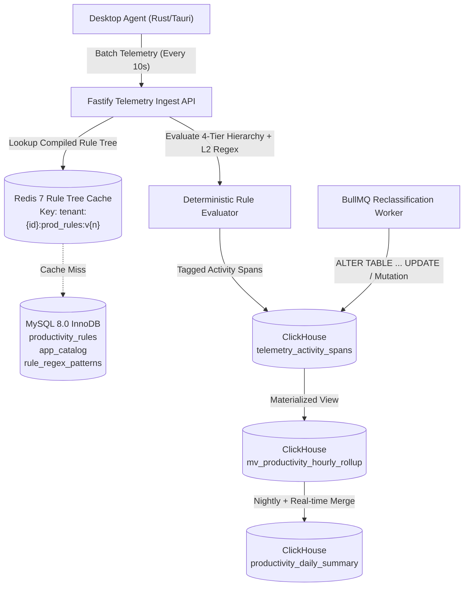
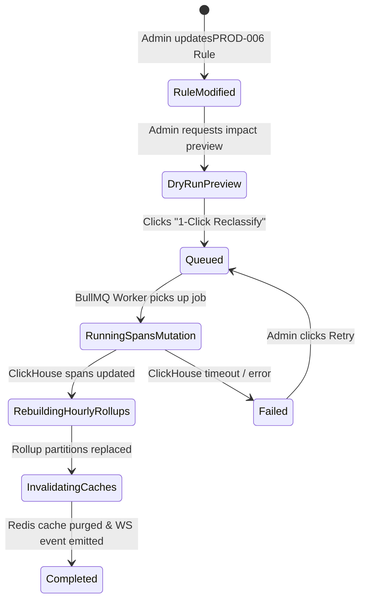

# PHASE 13: PRODUCTIVITY ENGINE, HIERARCHICAL CLASSIFICATION RULES & WORK-LIFE BALANCE ANALYTICS

**Document ID:** `HYDI-PHASE-13`  
**Version:** `4.0.0-ENTERPRISE`  
**Modules Covered:** `PROD-001`, `PROD-002`, `PROD-003`, `PROD-004`, `PROD-005`, `PROD-006`, `PROD-007`, `PROD-008`, `PROD-009`, `PROD-010`, `PROD-011`  
**Core Stack:** Fastify 5 (TypeScript) + MySQL 8.0 InnoDB (Rules & OLTP) + ClickHouse 24.x (Telemetry & Aggregations) + Redis 7.2 (Rule Cache & Pub/Sub) + BullMQ (1-Click Historical Reclassification Workers)

---

## 1. Architectural Overview & Hierarchical Classification Pipeline

The HydiEms Productivity Engine transforms raw desktop agent window/tab telemetry into deterministic 6-way productivity classifications (`PRODUCTIVE`, `NON_PRODUCTIVE`, `NEUTRAL`, `NO_IMPACT`, `IDLE`, `AWAY`), computes expected vs. actual achievement ratios, synthesizes a composite Daily Efficiency Score (`0–100`), and evaluates longitudinal work-life balance and burnout risk vectors.

### 1.1 Telemetry Ingestion to Classification Data Flow



### 1.2 The 4-Tier Hierarchical Rule Resolution Engine (`PROD-006`)

When an activity span arrives containing `(tenant_id, user_id, team_id, department_id, process_name, bundle_id, window_title, active_url, domain)`, the Rule Evaluator resolves classification using strict specificity precedence (Highest Priority = `1`, Lowest Priority = `8`):

1. **Priority 1 — User-Scoped Level-2 Regex Rule:** Matches `user_id` AND (`window_title` regex OR `active_url` regex).
2. **Priority 2 — User-Scoped Level-1 App/Domain Rule:** Matches `user_id` AND (`process_name` OR `domain`).
3. **Priority 3 — Team-Scoped Level-2 Regex Rule:** Matches `team_id` AND (`window_title` regex OR `active_url` regex).
4. **Priority 4 — Team-Scoped Level-1 App/Domain Rule:** Matches `team_id` AND (`process_name` OR `domain`).
5. **Priority 5 — Department-Scoped Level-2 Regex Rule:** Matches `department_id` AND (`window_title` regex OR `active_url` regex).
6. **Priority 6 — Department-Scoped Level-1 App/Domain Rule:** Matches `department_id` AND (`process_name` OR `domain`).
7. **Priority 7 — Global Tenant Level-2 Regex Rule:** Matches `tenant_id` (Scope=`GLOBAL`) AND (`window_title` regex OR `active_url` regex).
8. **Priority 8 — Global Tenant Level-1 App/Domain Rule:** Matches `tenant_id` (Scope=`GLOBAL`) AND (`process_name` OR `domain`).
9. **Fallback — Default Global Catalog / Unclassified:** Falls back to `NEUTRAL` (configurable per tenant to `UNCLASSIFIED_NEUTRAL`).

> [!IMPORTANT]
> **Regex Safety (ReDoS Prevention):** All Level-2 regular expressions are validated at creation time via the Rust/Node `re2` linear-time regular expression engine (`google/re2` binding for Node.js). Backtracking constructs (`(?=...)`, backreferences `\1`) are rejected at the API boundary with `HTTP 422 REGEX_UNSAFE_COMPLEXITY`, guaranteeing $O(N)$ evaluation latency `< 50 µs` per span.

---

## 2. Database Schemas (MySQL 8.0 InnoDB + ClickHouse 24.x + Redis 7)

### 2.1 MySQL 8.0 InnoDB Schema (Rules, Catalog, Reclassification Jobs, WLB Policies)

```sql
-- ============================================================================
-- TABLE 1: master_app_domain_catalog
-- Normalized dictionary of discovered processes, bundle IDs, and web domains
-- ============================================================================
CREATE TABLE master_app_domain_catalog (
    catalog_id BIGINT UNSIGNED NOT NULL AUTO_INCREMENT,
    tenant_id CHAR(36) NOT NULL,
    entity_type ENUM('DESKTOP_APP', 'WEB_DOMAIN', 'PWA') NOT NULL,
    identifier VARCHAR(255) NOT NULL COMMENT 'Lowercase process exe name (e.g. code.exe) or registrable domain (e.g. github.com)',
    display_name VARCHAR(255) NOT NULL,
    category VARCHAR(100) NOT NULL DEFAULT 'Uncategorized' COMMENT 'Development, Design, Communication, Social Media, Entertainment, Finance, CRM',
    icon_s3_key VARCHAR(512) NULL,
    default_classification ENUM('PRODUCTIVE', 'NON_PRODUCTIVE', 'NEUTRAL', 'NO_IMPACT') NOT NULL DEFAULT 'NEUTRAL',
    first_seen_at DATETIME(3) NOT NULL DEFAULT CURRENT_TIMESTAMP(3),
    last_seen_at DATETIME(3) NOT NULL DEFAULT CURRENT_TIMESTAMP(3),
    total_active_users_30d INT UNSIGNED NOT NULL DEFAULT 0,
    is_system_background TINYINT(1) NOT NULL DEFAULT 0,
    created_at DATETIME(3) NOT NULL DEFAULT CURRENT_TIMESTAMP(3),
    updated_at DATETIME(3) NOT NULL DEFAULT CURRENT_TIMESTAMP(3) ON UPDATE CURRENT_TIMESTAMP(3),
    PRIMARY KEY (catalog_id),
    UNIQUE KEY uq_tenant_entity_identifier (tenant_id, entity_type, identifier),
    KEY idx_tenant_classification (tenant_id, default_classification),
    KEY idx_tenant_category (tenant_id, category)
) ENGINE=InnoDB DEFAULT CHARSET=utf8mb4 COLLATE=utf8mb4_unicode_ci;

-- ============================================================================
-- TABLE 2: productivity_rules
-- Hierarchical Level-1 (App/Domain) and Level-2 (Window Title / URL Regex) rules
-- ============================================================================
CREATE TABLE productivity_rules (
    rule_id CHAR(36) NOT NULL COMMENT 'UUIDv7',
    tenant_id CHAR(36) NOT NULL,
    catalog_id BIGINT UNSIGNED NULL COMMENT 'Nullable if rule is pure URL/Title regex across any browser/app',
    rule_level ENUM('LEVEL_1_APP_DOMAIN', 'LEVEL_2_TITLE_URL_REGEX') NOT NULL,
    scope_type ENUM('GLOBAL', 'DEPARTMENT', 'TEAM', 'USER') NOT NULL,
    scope_target_id CHAR(36) NOT NULL DEFAULT '00000000-0000-0000-0000-000000000000' COMMENT '0000... for GLOBAL, otherwise dept_id, team_id, or user_id',
    match_target ENUM('PROCESS_NAME', 'DOMAIN', 'WINDOW_TITLE_REGEX', 'URL_REGEX', 'COMPOSITE_APP_AND_TITLE') NOT NULL,
    process_or_domain_match VARCHAR(255) NULL COMMENT 'e.g. chrome.exe or youtube.com',
    regex_pattern VARCHAR(1024) NULL COMMENT 'RE2-compatible pattern e.g. (?i)(tutorial|react|rust|kubernetes| NestJS)',
    regex_flags VARCHAR(16) NOT NULL DEFAULT 'i',
    classification ENUM('PRODUCTIVE', 'NON_PRODUCTIVE', 'NEUTRAL', 'NO_IMPACT') NOT NULL,
    productivity_weight DECIMAL(4,2) NOT NULL DEFAULT 1.00 COMMENT 'Multiplier 0.00 to 1.50 for weighted scoring',
    evaluation_order INT UNSIGNED NOT NULL DEFAULT 100 COMMENT 'Tie-breaker within same scope & level (lower = evaluated first)',
    schedule_condition JSON NULL COMMENT 'Optional active schedule e.g. {"days":[1,2,3,4,5],"start":"09:00","end":"18:00"}',
    is_active TINYINT(1) NOT NULL DEFAULT 1,
    created_by CHAR(36) NOT NULL,
    updated_by CHAR(36) NOT NULL,
    created_at DATETIME(3) NOT NULL DEFAULT CURRENT_TIMESTAMP(3),
    updated_at DATETIME(3) NOT NULL DEFAULT CURRENT_TIMESTAMP(3) ON UPDATE CURRENT_TIMESTAMP(3),
    PRIMARY KEY (rule_id),
    KEY idx_tenant_lookup (tenant_id, is_active, scope_type, scope_target_id, rule_level, evaluation_order),
    KEY idx_catalog_fk (catalog_id),
    CONSTRAINT fk_prod_rules_catalog FOREIGN KEY (catalog_id) REFERENCES master_app_domain_catalog (catalog_id) ON DELETE SET NULL
) ENGINE=InnoDB DEFAULT CHARSET=utf8mb4 COLLATE=utf8mb4_unicode_ci;

-- ============================================================================
-- TABLE 3: productivity_reclassification_jobs (PROD-007)
-- Tracks 1-Click Historical Reclassification jobs across ClickHouse partitions
-- ============================================================================
CREATE TABLE productivity_reclassification_jobs (
    job_id CHAR(36) NOT NULL COMMENT 'UUIDv7',
    tenant_id CHAR(36) NOT NULL,
    triggered_by CHAR(36) NOT NULL,
    rule_id CHAR(36) NULL,
    catalog_id BIGINT UNSIGNED NULL,
    date_range_start DATE NOT NULL,
    date_range_end DATE NOT NULL,
    scope_type ENUM('GLOBAL', 'DEPARTMENT', 'TEAM', 'USER') NOT NULL,
    scope_target_id CHAR(36) NOT NULL,
    old_classification ENUM('PRODUCTIVE', 'NON_PRODUCTIVE', 'NEUTRAL', 'NO_IMPACT', 'ANY') NOT NULL DEFAULT 'ANY',
    new_classification ENUM('PRODUCTIVE', 'NON_PRODUCTIVE', 'NEUTRAL', 'NO_IMPACT') NOT NULL,
    status ENUM('QUEUED', 'RUNNING', 'COMPLETED', 'FAILED', 'CANCELLED') NOT NULL DEFAULT 'QUEUED',
    affected_spans_count BIGINT UNSIGNED NOT NULL DEFAULT 0,
    affected_users_count INT UNSIGNED NOT NULL DEFAULT 0,
    progress_pct DECIMAL(5,2) NOT NULL DEFAULT 0.00,
    clickhouse_mutation_id VARCHAR(128) NULL,
    error_message TEXT NULL,
    started_at DATETIME(3) NULL,
    completed_at DATETIME(3) NULL,
    created_at DATETIME(3) NOT NULL DEFAULT CURRENT_TIMESTAMP(3),
    PRIMARY KEY (job_id),
    KEY idx_tenant_status (tenant_id, status, created_at DESC)
) ENGINE=InnoDB DEFAULT CHARSET=utf8mb4 COLLATE=utf8mb4_unicode_ci;

-- ============================================================================
-- TABLE 4: productivity_targets_and_wlb_policies (PROD-009, PROD-010, PROD-011)
-- Configures Expected Productive Hours, Efficiency Score weights, and WLB thresholds
-- ============================================================================
CREATE TABLE productivity_targets_and_wlb_policies (
    policy_id CHAR(36) NOT NULL,
    tenant_id CHAR(36) NOT NULL,
    scope_type ENUM('GLOBAL', 'DEPARTMENT', 'TEAM', 'USER') NOT NULL,
    scope_target_id CHAR(36) NOT NULL DEFAULT '00000000-0000-0000-0000-000000000000',
    expected_work_seconds_per_day INT UNSIGNED NOT NULL DEFAULT 28800 COMMENT 'Default 8.0h = 28800s',
    expected_productive_seconds_per_day INT UNSIGNED NOT NULL DEFAULT 21600 COMMENT 'Default 6.0h = 21600s (75% of 8h)',
    efficiency_weight_productive_ratio DECIMAL(4,2) NOT NULL DEFAULT 0.50 COMMENT 'Weight α in Daily Efficiency Score',
    efficiency_weight_achievement_ratio DECIMAL(4,2) NOT NULL DEFAULT 0.30 COMMENT 'Weight β in Daily Efficiency Score',
    efficiency_weight_focus_consistency DECIMAL(4,2) NOT NULL DEFAULT 0.20 COMMENT 'Weight γ in Daily Efficiency Score',
    overwork_daily_threshold_seconds INT UNSIGNED NOT NULL DEFAULT 36000 COMMENT '10.0h = Overwork trigger',
    underwork_daily_threshold_seconds INT UNSIGNED NOT NULL DEFAULT 18000 COMMENT '5.0h = Underwork trigger',
    consecutive_overwork_days_burnout_alert TINYINT UNSIGNED NOT NULL DEFAULT 4,
    min_recommended_break_seconds_per_4h INT UNSIGNED NOT NULL DEFAULT 900 COMMENT '15m break per 4h block',
    after_hours_start_local TIME NOT NULL DEFAULT '20:00:00',
    after_hours_end_local TIME NOT NULL DEFAULT '06:00:00',
    weekend_work_alert_threshold_seconds INT UNSIGNED NOT NULL DEFAULT 3600 COMMENT '1.0h on weekend triggers WLB flag',
    updated_by CHAR(36) NOT NULL,
    updated_at DATETIME(3) NOT NULL DEFAULT CURRENT_TIMESTAMP(3) ON UPDATE CURRENT_TIMESTAMP(3),
    PRIMARY KEY (policy_id),
    UNIQUE KEY uq_tenant_scope (tenant_id, scope_type, scope_target_id)
) ENGINE=InnoDB DEFAULT CHARSET=utf8mb4 COLLATE=utf8mb4_unicode_ci;
```

### 2.2 ClickHouse 24.x High-Velocity Telemetry & Rollup Tables

```sql
-- ============================================================================
-- CLICKHOUSE TABLE 1: telemetry_activity_spans
-- Stores granular activity intervals (10s - 60s coalesced spans)
-- ============================================================================
CREATE TABLE hydi_telemetry.telemetry_activity_spans (
    tenant_id UUID,
    span_id UUID,
    user_id UUID,
    department_id UUID,
    team_id UUID,
    device_id UUID,
    work_date Date,
    span_start_utc DateTime64(3, 'UTC'),
    span_end_utc DateTime64(3, 'UTC'),
    local_hour UInt8 COMMENT '0..23 in user local timezone',
    local_day_of_week UInt8 COMMENT '1=Mon .. 7=Sun',
    duration_seconds UInt16,
    activity_state LowCardinality(String) COMMENT 'ACTIVE | IDLE | AWAY | OFFLINE_MEETING',
    classification LowCardinality(String) COMMENT 'PRODUCTIVE | NON_PRODUCTIVE | NEUTRAL | NO_IMPACT | IDLE | AWAY',
    matched_rule_id Nullable(UUID),
    matched_rule_scope LowCardinality(String) COMMENT 'USER | TEAM | DEPARTMENT | GLOBAL | DEFAULT',
    catalog_id UInt64,
    entity_type LowCardinality(String) COMMENT 'DESKTOP_APP | WEB_DOMAIN | PWA | SYSTEM',
    process_name LowCardinality(String),
    domain LowCardinality(String),
    window_title String CODEC(ZSTD(3)),
    active_url String CODEC(ZSTD(3)),
    keystrokes_count UInt16,
    mouse_clicks_count UInt16,
    mouse_distance_px UInt32,
    scroll_ticks_count UInt16,
    is_after_hours UInt8,
    is_weekend UInt8,
    reclassified_version UInt32 DEFAULT 1,
    ingested_at DateTime64(3, 'UTC') DEFAULT now64(3)
)
ENGINE = ReplacingMergeTree(reclassified_version)
PARTITION BY toYYYYMM(work_date)
ORDER BY (tenant_id, work_date, department_id, team_id, user_id, span_start_utc, span_id)
SETTINGS index_granularity = 8192;

-- ============================================================================
-- CLICKHOUSE TABLE 2: productivity_hourly_rollup
-- Pre-aggregated hourly matrix for PROD-001, PROD-005 (Heatmap), and PROD-008
-- ============================================================================
CREATE TABLE hydi_telemetry.productivity_hourly_rollup (
    tenant_id UUID,
    work_date Date,
    local_hour UInt8,
    local_day_of_week UInt8,
    department_id UUID,
    team_id UUID,
    user_id UUID,
    productive_seconds SimpleAggregateFunction(sum, UInt64),
    non_productive_seconds SimpleAggregateFunction(sum, UInt64),
    neutral_seconds SimpleAggregateFunction(sum, UInt64),
    no_impact_seconds SimpleAggregateFunction(sum, UInt64),
    idle_seconds SimpleAggregateFunction(sum, UInt64),
    away_seconds SimpleAggregateFunction(sum, UInt64),
    total_logged_seconds SimpleAggregateFunction(sum, UInt64),
    after_hours_seconds SimpleAggregateFunction(sum, UInt64),
    keystrokes_total SimpleAggregateFunction(sum, UInt64),
    mouse_clicks_total SimpleAggregateFunction(sum, UInt64),
    context_switches_count SimpleAggregateFunction(sum, UInt64)
)
ENGINE = AggregatingMergeTree()
PARTITION BY toYYYYMM(work_date)
ORDER BY (tenant_id, work_date, department_id, team_id, user_id, local_hour);
```

### 2.3 Redis 7 Keyspace Design for Rule Evaluation & Real-Time Counters

| Redis Key Pattern | Data Type | TTL | Purpose |
| :--- | :--- | :--- | :--- |
| `tenant:{tenantId}:prod_rules:compiled` | `STRING` (MsgPack) | `3600s` | Serialized hierarchical rule tree compiled for `<50µs` in-memory matching by Fastify ingest nodes. Invalidated via Redis Pub/Sub channel `prod_rules:invalidate` on any rule CRUD. |
| `tenant:{tenantId}:user:{userId}:live_prod:{YYYY-MM-DD}` | `HASH` | `172800s` | Real-time counters (`productive_sec`, `non_productive_sec`, `neutral_sec`, `no_impact_sec`, `idle_sec`, `away_sec`, `continuous_work_sec_since_break`) for instant sub-10ms dashboard reads. |
| `reclass:job:{jobId}:progress` | `HASH` | `86400s` | Tracks live `processed_partitions`, `total_partitions`, `affected_rows`, `status` for WebSocket progress streaming to `PROD-007`. |

---

## 3. Mathematical Formulations & Scoring Algorithms

### 3.1 The 6-Way Productivity Split (`PROD-008`)

Every second of a user's workday between `first_activity_at` and `last_activity_at` is partitioned into six mutually exclusive buckets:

1. **Productive Time ($T_{\text{prod}}$):** Active input spans where the foreground app/URL/title resolves to `PRODUCTIVE`.
2. **Non-Productive Time ($T_{\text{nonprod}}$):** Active input spans where the foreground app/URL/title resolves to `NON_PRODUCTIVE`.
3. **Neutral Time ($T_{\text{neutral}}$):** Active input spans where the foreground app/URL/title resolves to `NEUTRAL` (e.g., File Explorer, OS Settings, generic browser new-tab).
4. **No-Impact Time ($T_{\text{noimpact}}$):** Active spans explicitly marked `NO_IMPACT` (e.g., mandatory HR compliance portals, system updates, password managers) — excluded from the denominator when calculating Active Productivity Ratio.
5. **Idle Time ($T_{\text{idle}}$):** Computer unlocked and session open, no keyboard/mouse input exceeding tenant idle threshold (default `300s`), and not in a whitelisted call/video app (`zoom.exe`, `ms-teams.exe`, `Google Meet` with active audio stream).
6. **Away / Offline Break Time ($T_{\text{away}}$):** Workstation locked (`SessionLock`), sleep/suspend, or explicit break timer active between first clock-in and last clock-out.

$$\text{Total Shift Span } (T_{\text{shift}}) = T_{\text{prod}} + T_{\text{nonprod}} + T_{\text{neutral}} + T_{\text{noimpact}} + T_{\text{idle}} + T_{\text{away}}$$

$$\text{Total Active Time } (T_{\text{active}}) = T_{\text{prod}} + T_{\text{nonprod}} + T_{\text{neutral}} + T_{\text{noimpact}}$$

$$\text{Evaluated Active Time } (T_{\text{eval}}) = T_{\text{prod}} + T_{\text{nonprod}} + T_{\text{neutral}}$$

$$\text{Productive Split \%} = \frac{T_{\text{prod}}}{\max(1, T_{\text{eval}})} \times 100$$

### 3.2 Expected vs. Actual Achievement Percentage (`PROD-009`)

Let $E_{\text{prod}}$ be the policy's `expected_productive_seconds_per_day` (default `21,600s` = `6.0 hours`) prorated by leave/half-day status $L \in \{0.0, 0.5, 1.0\}$:

$$E_{\text{effective}} = E_{\text{prod}} \times (1 - L)$$

$$\text{Achievement \% } (A_{\%}) = \min\left(200.0, \left(\frac{T_{\text{prod}}}{\max(1, E_{\text{effective}})}\right) \times 100\right)$$

- **Achievement Tier Thresholds:**
  - `EXCEEDING`: $A_{\%} \ge 105\%$ (Emerald `#10B981`)
  - `ON_TARGET`: $90\% \le A_{\%} < 105\%$ (Blue `#3B82F6`)
  - `BELOW_TARGET`: $70\% \le A_{\%} < 90\%$ (Amber `#F59E0B`)
  - `CRITICAL_DEFICIT`: $A_{\%} < 70\%$ (Rose `#EF4444`)

### 3.3 Daily Efficiency Score (`PROD-010`)

The **Daily Efficiency Score** ($S_{\text{eff}} \in [0, 100]$) combines three normalized sub-indices using tenant-configurable weights $(\alpha, \beta, \gamma)$ where $\alpha + \beta + \gamma = 1.00$ (defaults: $\alpha = 0.50, \beta = 0.30, \gamma = 0.20$):

1. **Productive Quality Ratio ($I_{\text{qual}}$):**
   $$I_{\text{qual}} = \min\left(100, \frac{T_{\text{prod}} + 0.35 \cdot T_{\text{neutral}}}{\max(1, T_{\text{eval}} + T_{\text{idle}})} \times 100\right)$$
2. **Target Achievement Index ($I_{\text{ach}}$):**
   $$I_{\text{ach}} = \min\left(100, \frac{T_{\text{prod}}}{\max(1, E_{\text{effective}})} \times 100\right)$$
3. **Focus Consistency Index ($I_{\text{focus}}$):** Penalizes excessive context switching ($C_{\text{switches}}$ per active hour above baseline `30 switches/hr`) and idle fragmentation:
   $$I_{\text{focus}} = \max\left(0, 100 - \max\left(0, \left(\frac{C_{\text{switches}}}{\max(1, T_{\text{active}} / 3600)} - 30\right) \times 1.25\right)\right)$$

$$S_{\text{eff}} = \text{round}\left(\alpha \cdot I_{\text{qual}} + \beta \cdot I_{\text{ach}} + \gamma \cdot I_{\text{focus}}, 1\right)$$

### 3.4 Work-Life Balance & Burnout Risk Score (`PROD-011`)

Evaluated over a rolling 14-day window ($d \in [1..14]$) per employee:

- **Overwork Flag (`IS_OVERWORKED`):** Triggered on day $d$ if $T_{\text{active}}(d) > \text{overwork\_daily\_threshold\_seconds}$ (default `10.0h`).
- **Underwork Flag (`IS_UNDERWORKED`):** Triggered on scheduled workday $d$ if $T_{\text{active}}(d) < \text{underwork\_daily\_threshold\_seconds}$ (default `5.0h`) and employee is not on PTO.
- **Break Deprivation Flag (`BREAK_DEPRIVED`):** Triggered if employee has any continuous active block $\ge 4.0\text{ hours}$ (`14,400s`) with cumulative break/away time $< 15\text{ minutes}$ (`900s`).
- **After-Hours Encroachment ($T_{\text{after\_hours}}$):** Active seconds logged between `20:00` and `06:00` local time or on scheduled weekends.
- **Composite Burnout Risk Score ($B_{\text{risk}} \in [0, 100]$):**
  $$B_{\text{risk}} = \min\left(100, 15 \cdot N_{\text{overwork\_days\_14d}} + 10 \cdot N_{\text{weekend\_days\_14d}} + 8 \cdot N_{\text{break\_deprived\_days\_14d}} + 5 \cdot \left(\frac{\sum T_{\text{after\_hours\_14d}}}{3600}\right)\right)$$
  - `LOW_RISK`: $0 \le B_{\text{risk}} < 35$
  - `MODERATE_RISK`: $35 \le B_{\text{risk}} < 65$
  - `HIGH_BURNOUT_RISK`: $B_{\text{risk}} \ge 65$ (triggers automatic manager digest alert if enabled).

---

## 4. Screen-by-Screen UI/UX & Engineering Specifications

### 4.1 `PROD-001` — Organization Productivity Dashboard

- **Route:** `/analytics/productivity/overview`
- **RBAC Permissions:** `productivity:dashboard:read` (Scoped by user's hierarchy visibility: `GLOBAL`, `DEPARTMENT`, `TEAM`).
- **Top Filter Bar:**
  - Date Range Picker (`Today`, `Yesterday`, `Last 7 Days`, `Last 30 Days`, `This Month`, `Custom Range`), Department Multi-Select, Team Multi-Select, Location/Work-Mode Filter (`All`, `Remote`, `In-Office`, `Hybrid`), Shift Filter.
- **KPI Summary Strip (6 Cards):**
  1. **Org Productive Ratio:** `76.4%` (`+2.1% vs prev period`), sparkline, breakdown badge (`6h 12m avg/user`).
  2. **Expected vs. Actual Achievement (`PROD-009`):** `98.2%` (`6h 12m Actual / 6h 18m Expected`), progress bar with color threshold.
  3. **Mean Daily Efficiency Score (`PROD-010`):** `82.7 / 100` radial gauge with sub-score tooltip (`Quality: 84`, `Achievement: 91`, `Focus: 67`).
  4. **6-Way Split Distribution Bar (`PROD-008`):** Stacked horizontal 100% bar showing `Productive` (`#10B981`), `Neutral` (`#64748B`), `Non-Productive` (`#EF4444`), `No-Impact` (`#94A3B8`), `Idle` (`#F59E0B`), `Away` (`#CBD5E1`).
  5. **Top Productive App & Domain:** Icon + name + total org hours + % of productive time.
  6. **Work-Life Balance Alert Count (`PROD-011`):** Count of employees in `HIGH_BURNOUT_RISK` or `UNDERWORKED` state with 1-click drill-down.
- **Primary Visualizations:**
  - **Chart 1:** Stacked Area / Bar Time-Series of 6-Way Productivity Split (`PROD-008`) by Day/Week/Month.
  - **Chart 2:** Top 10 Productive vs. Top 10 Non-Productive Applications/Domains horizontal butterfly chart.
  - **Chart 3:** Intraday Productivity Curve (Average Productive % vs. Idle % across hours `00:00` to `23:00`).

### 4.2 `PROD-002` — Employee Productivity Table

- **Route:** `/analytics/productivity/employees`
- **RBAC Permissions:** `productivity:employees:read`, `productivity:export:csv`
- **Data Grid Columns (Virtual Scrolled, Server-Side Sorted & Filtered):**
  1. `Employee` (Avatar, Full Name, Employee ID, Role Badge, Online Status Dot)
  2. `Department / Team`
  3. `Total Logged Time` (`HH:mm`)
  4. `Active Time` (`HH:mm`)
  5. `6-Way Split Visual Bar` (Inline 180px stacked bar with hover popover showing exact `HH:mm` and `%` for all 6 buckets)
  6. `Productive Time` (`HH:mm` + `%`)
  7. `Non-Productive Time` (`HH:mm` + `%`)
  8. `Neutral / No-Impact` (`HH:mm`)
  9. `Idle / Away` (`HH:mm`)
  10. `Expected vs Actual %` (`PROD-009` badge: e.g., `104.2% Exceeding`)
  11. `Efficiency Score` (`PROD-010` pill `0–100`)
  12. `WLB Status` (`PROD-011` badge: `Balanced`, `Overworked`, `Burnout Risk`, `Underworked`)
  13. `Row Actions`: View Employee Deep-Dive Drawer, Open Screenshot Timeline (`SS-004`), Adjust User Rule (`PROD-006`).

### 4.3 `PROD-003` — Department Productivity Comparison

- **Route:** `/analytics/productivity/departments`
- **RBAC Permissions:** `productivity:departments:read`
- **UI Components:**
  - **Grouped Bar & Radar Comparison Chart:** Compares all departments across 5 axes: `Productive %`, `Achievement %`, `Efficiency Score`, `Focus Consistency`, and `WLB Balance Index`.
  - **Department Comparison Matrix Table:** Lists Department Name, Manager, Headcount, Active Users, Avg Logged Hours, Avg Productive Hours, Productive %, Non-Productive %, Idle %, Achievement %, Efficiency Score, Overworked Headcount, and 30-Day Trend Sparkline.
  - **Outlier Highlight:** Automatically badges departments whose `Non-Productive %` or `Idle %` deviates by $> 1.5\sigma$ from the organizational mean.

### 4.4 `PROD-004` — Team Productivity Breakdown

- **Route:** `/analytics/productivity/teams`
- **RBAC Permissions:** `productivity:teams:read`
- **UI Components:**
  - **Team Selector & Cohort Benchmarking:** Allows managers to compare Squads/Teams within a department or across shifts (Morning, Swing, Night).
  - **Member Distribution Box-Plot:** Shows the min, 25th percentile, median, 75th percentile, and max Productive Hours within each team so managers can distinguish uniform team performance from skewed performance driven by 1–2 outliers.
  - **Team Top Apps & Websites Drawer:** Clicking a team row opens a side drawer showing the exact applications, domains, and Level-2 window title matches driving that team's productive and non-productive hours.

### 4.5 `PROD-005` — Hour × Day Productivity Heatmap

- **Route:** `/analytics/productivity/heatmap`
- **RBAC Permissions:** `productivity:heatmap:read`
- **Matrix Specification:**
  - **Axes:** X-Axis = 24 Hours (`00:00` through `23:00` in either User Local Timezone or Normalized UTC/HQ Timezone toggle); Y-Axis = Days of Week (`Monday` through `Sunday`) or Individual Dates in selected range.
  - **Metric Switcher:** Toggle heatmap cell color intensity between:
    1. `Productive Intensity %` (Green gradient `#ECFDF5` $\rightarrow$ `#047857`)
    2. `Active Headcount` (Blue gradient)
    3. `Idle Ratio %` (Amber gradient)
    4. `Non-Productive Ratio %` (Rose gradient)
  - **Cell Hover & Click Drill-Down:** Hovering cell `(Tuesday, 14:00–15:00)` displays exact `Productive: 79.4%`, `Active Users: 312`, `Top App: VS Code (41%)`. Clicking a cell opens a modal listing the employees active during that hour slice and their top window titles.

### 4.6 `PROD-006` — Hierarchical Productivity Rules & Level-2 Regex Engine

- **Route:** `/settings/productivity/rules`
- **RBAC Permissions:** `productivity:rules:read`, `productivity:rules:write`, `productivity:rules:delete`
- **UI Layout:**
  - **Left Pane — Scope Hierarchy Tree:**
    - `Global Organization Rules` (Default)
    - `Departments` (Expandable list of all departments, showing override count badge)
    - `Teams` (Expandable list of teams under each department)
    - `Individual Users` (Searchable user override list)
  - **Main Pane — Tab 1: Level-1 App & Domain Rules:**
    - Searchable table of all items in `master_app_domain_catalog` with inheritance indicator (`Inherited from Global` vs. `Overridden at Department: Engineering`).
    - Inline 4-statesegmented control per row: `Productive` | `Neutral` | `Non-Productive` | `No-Impact`.
  - **Main Pane — Tab 2: Level-2 Window Title & URL Regex Rule Builder:**
    - **Rule Composer Modal / Drawer:**
      - `Scope`: `Global` / `Department` / `Team` / `User`
      - `Match Target`: `Window Title Regex`, `URL Regex`, or `Composite (Process/Domain + Regex)`
      - `Process / Domain Filter` (optional): e.g., `chrome.exe, msedge.exe, youtube.com`
      - `RE2 Regular Expression`: e.g., `(?i)(tutorial|course|kubernetes|rust|system design|grafana)`
      - `Assign Classification`: `Productive` | `Neutral` | `Non-Productive` | `No-Impact`
      - `Evaluation Priority Order`: Integer `1..999`
      - **Live Regex Sandbox Tester (Built-In):** Queries the last 100 actual distinct `window_title` and `active_url` strings from ClickHouse for the selected scope and highlights in real time which titles match (`MATCHED -> PRODUCTIVE`) before the admin clicks Save!

### 4.7 `PROD-007` — Application Classification & 1-Click Historical Reclassification

- **Route:** `/settings/productivity/reclassify` (Also accessible via slide-over modal whenever any rule in `PROD-006` is created or updated).
- **RBAC Permissions:** `productivity:reclassify:execute`
- **Workflow & State Machine:**
  1. When an admin changes an app (e.g., `figma.com` from `NEUTRAL` to `PRODUCTIVE` for `Department: Marketing`) or saves a new Level-2 Regex rule, a prompt banner appears:  
     *"Apply this classification change retroactively to historical activity?"*
  2. Admin selects **Retroactive Date Window**: `Today Only`, `Last 7 Days`, `Last 30 Days`, `Last 90 Days`, or `Custom Date Range`.
  3. Clicking **"Preview Impact"** runs a fast ClickHouse `count()` + `sum(duration_seconds)` dry-run query and displays:  
     *"This will reclassify **14,820 activity spans (241.5 hours)** across **18 employees** in Marketing."*
  4. Clicking **"Execute 1-Click Reclassification"** enqueues a BullMQ job (`productivity-reclassification-queue`), updates ClickHouse `telemetry_activity_spans` and rebuilds `productivity_hourly_rollup` partitions for the affected dates, and streams live progress (`0% -> 100%`) via WebSocket event `prod:reclassify:progress`.



### 4.8 `PROD-008`, `PROD-009`, `PROD-010` — Split, Achievement & Efficiency Deep-Dive Cards

- Integrated across `PROD-001`, `PROD-002`, and the Employee Productivity Drawer:
  - **`PROD-008` Interactive 6-Way Split Donut & Time-Bar:** Allows toggling whether `Idle` and `Away` are included in the percentage denominator (`% of Total Shift` vs. `% of Active Time`).
  - **`PROD-009` Expected vs. Actual Bullet Chart:** Shows daily and cumulative month-to-date actual productive hours against the linear target trajectory line, factoring in approved PTO/holidays from Phase 10/11.
  - **`PROD-010` Efficiency Score Formula Breakdown Popover:** Displays exact formula inputs for any user-day:
    - Productive Quality Sub-Score ($I_{\text{qual}} \times 0.50$)
    - Target Achievement Sub-Score ($I_{\text{ach}} \times 0.30$)
    - Focus Consistency Sub-Score ($I_{\text{focus}} \times 0.20$) with context-switch rate per hour.

### 4.9 `PROD-011` — Work-Life Balance & Overwork/Underwork/Break Pattern Analysis

- **Route:** `/analytics/productivity/work-life-balance`
- **RBAC Permissions:** `productivity:wlb:read`, `productivity:wlb:configure`
- **UI Sections:**
  1. **Burnout & Utilization Quadrant Scatter Plot:**
     - X-Axis: `Average Daily Active Hours (Last 14 Days)`
     - Y-Axis: `Daily Efficiency Score (0-100)`
     - Divided into 4 labeled quadrants:
       - **Top-Right (High Hours + High Efficiency):** *High Performers — Monitor for Burnout Risk*
       - **Bottom-Right (High Hours + Low Efficiency):** *Critical Burnout / Fatigue Zone*
       - **Top-Left (Normal/Low Hours + High Efficiency):** *Optimal Sustainable Zone*
       - **Bottom-Left (Low Hours + Low Efficiency):** *Disengaged / Underutilized Zone*
  2. **Overwork, Underwork & Break Deprivation Roster Table:**
     - Columns: `Employee`, `14d Avg Daily Active`, `Overwork Days (14d)`, `After-Hours Time (20:00–06:00)`, `Weekend Hours`, `Break-Deprived Blocks (>4h continuous)`, `Burnout Risk Score (0–100)`, `Recommended Action`.
  3. **Intraday Break Pattern Timeline:** Visualizes work streaks vs. restorative breaks across the day, highlighting continuous work stretches $> 4.0\text{ hours}$ in crimson.

---

## 5. Fastify REST & WebSocket API Specifications

### 5.1 `GET /api/v1/productivity/overview` (`PROD-001`, `PROD-008`, `PROD-009`, `PROD-010`)

- **Query Parameters:**
  - `startDate` (`YYYY-MM-DD`, required), `endDate` (`YYYY-MM-DD`, required)
  - `departmentIds` (optional comma-separated UUIDs), `teamIds` (optional comma-separated UUIDs), `userIds` (optional)
  - `denominatorMode` (`EVALUATED_ACTIVE` | `TOTAL_SHIFT`, default `EVALUATED_ACTIVE`)
- **ClickHouse Aggregation Query Executed by Fastify:**
```sql
SELECT
    sumMerge(productive_seconds) AS prod_sec,
    sumMerge(non_productive_seconds) AS non_prod_sec,
    sumMerge(neutral_seconds) AS neutral_sec,
    sumMerge(no_impact_seconds) AS no_impact_sec,
    sumMerge(idle_seconds) AS idle_sec,
    sumMerge(away_seconds) AS away_sec,
    sumMerge(after_hours_seconds) AS after_hours_sec,
    sumMerge(context_switches_count) AS context_switches,
    uniqExact(user_id, work_date) AS user_work_days
FROM hydi_telemetry.productivity_hourly_rollup
WHERE tenant_id = {tenantId:UUID}
  AND work_date BETWEEN {startDate:Date} AND {endDate:Date}
  AND (empty({departmentIds:Array(UUID)}) OR department_id IN {departmentIds:Array(UUID)})
  AND (empty({teamIds:Array(UUID)}) OR team_id IN {teamIds:Array(UUID)});
```

### 5.2 `GET /api/v1/productivity/heatmap` (`PROD-005`)

- **Query Parameters:** `startDate`, `endDate`, `departmentIds`, `teamIds`, `metric` (`PRODUCTIVE_PCT` | `ACTIVE_USERS` | `IDLE_PCT` | `NON_PRODUCTIVE_PCT`).
- **Response Payload (`200 OK`):**
```json
{
  "success": true,
  "data": {
    "metric": "PRODUCTIVE_PCT",
    "cells": [
      {
        "dayOfWeek": 1,
        "hour": 9,
        "productiveSeconds": 412800,
        "nonProductiveSeconds": 31200,
        "neutralSeconds": 48000,
        "idleSeconds": 29400,
        "activeUsersCount": 142,
        "productivePct": 83.9,
        "topApp": "code.exe"
      }
    ]
  }
}
```

### 5.3 `POST /api/v1/productivity/rules` (`PROD-006`)

- **Request Body Schema (TypeBox / Zod):**
```json
{
  "ruleLevel": "LEVEL_2_TITLE_URL_REGEX",
  "scopeType": "DEPARTMENT",
  "scopeTargetId": "01926a11-7c44-7000-8000-112233445566",
  "matchTarget": "COMPOSITE_APP_AND_TITLE",
  "processOrDomainMatch": "youtube.com",
  "regexPattern": "(?i)(tutorial|rust|typescript|distributed systems|clickhouse)",
  "classification": "PRODUCTIVE",
  "productivityWeight": 1.0,
  "evaluationOrder": 10,
  "retroactiveReclassify": {
    "enabled": true,
    "dateRangeStart": "2026-09-01",
    "dateRangeEnd": "2026-09-26"
  }
}
```
- **Validation & Processing Steps:**
  1. Verify caller has `productivity:rules:write` and scope access to `scopeTargetId`.
  2. Validate `regexPattern` using `new RE2(regexPattern)` — if `RE2` throws syntax or unsupported backtracking error, return `HTTP 422 { "error": "REGEX_UNSAFE_OR_INVALID" }`.
  3. Insert row into `productivity_rules` inside MySQL transaction.
  4. Increment rule version and publish invalidation message on Redis channel `prod_rules:invalidate`.
  5. If `retroactiveReclassify.enabled === true`, create record in `productivity_reclassification_jobs` and dispatch BullMQ job.
  6. Emit audit log event `PRODUCTIVITY_RULE_CREATED` to `AUDIT-002`.

### 5.4 `POST /api/v1/productivity/rules/reclassify` (`PROD-007`)

- **Purpose:** Triggers or previews a 1-Click Historical Reclassification job.
- **Dry-Run Mode (`dryRun: true`):** Runs synchronous ClickHouse `SELECT count(), uniqExact(user_id), sum(duration_seconds)` matching the rule criteria and returns affected counts in `< 400ms`.
- **Execution Mode (`dryRun: false`):** Enqueues BullMQ job that executes partitioned ClickHouse updates and recomputes `productivity_hourly_rollup` slices for affected dates.

### 5.5 `GET /api/v1/productivity/work-life-balance` (`PROD-011`)

- **Purpose:** Returns employee-level and department-level WLB metrics, overwork/underwork day counts, continuous work-block violations (`>4h` without `15m` break), after-hours durations, and composite Burnout Risk Score ($B_{\text{risk}}$).

---

## 6. RBAC Permission Matrix & Audit Events

| Permission Slug | Org Admin | Dept Manager | Team Lead | HR Analyst | Employee | Description |
| :--- | :---: | :---: | :---: | :---: | :---: | :--- |
| `productivity:dashboard:read` | Full Org | Own Dept | Own Team | Full Org | Own Self | View productivity overview & 6-way split |
| `productivity:employees:read` | Full Org | Own Dept | Own Team | Full Org | Own Self | View employee productivity table |
| `productivity:departments:read` | Full Org | Own Dept | Denied | Full Org | Denied | View cross-department benchmarks |
| `productivity:heatmap:read` | Full Org | Own Dept | Own Team | Full Org | Own Self | View Hour × Day productivity heatmap |
| `productivity:rules:read` | Full Org | Own Dept | Own Team | Read-Only | Own Self | View classification rules & regexes |
| `productivity:rules:write` | Full Org | Own Dept* | Denied | Denied | Denied | Create/update Level-1 & Level-2 rules (*if tenant enables manager rule override) |
| `productivity:reclassify:execute` | Full Org | Denied | Denied | Denied | Denied | Execute 1-Click historical reclassification |
| `productivity:wlb:read` | Full Org | Own Dept | Own Team | Full Org | Own Self | View Work-Life Balance & Burnout analytics |

### Audited Events Logged to `AUDIT-002`
- `PRODUCTIVITY_RULE_CREATED` / `PRODUCTIVITY_RULE_UPDATED` / `PRODUCTIVITY_RULE_DELETED` (Includes before/after JSON diff of `classification`, `scope_type`, `regex_pattern`).
- `PRODUCTIVITY_RECLASSIFICATION_TRIGGERED` / `PRODUCTIVITY_RECLASSIFICATION_COMPLETED` (Includes `job_id`, `date_range_start`, `date_range_end`, `affected_spans_count`, `triggered_by`).
- `PRODUCTIVITY_WLB_POLICY_UPDATED` (Includes changes to expected daily productive hours, efficiency weights $\alpha, \beta, \gamma$, and overwork thresholds).

---

## 7. Acceptance Criteria & Verification Suite

1. **AC-PROD-01 (4-Tier Hierarchy & L2 Regex Precedence):** Given `chrome.exe` is `NEUTRAL` globally, `youtube.com` is `NON_PRODUCTIVE` globally, and `Department: Engineering` has a Level-2 Title Regex `(?i)(rust|kubernetes|llvm)` set to `PRODUCTIVE`:
   - When an Engineering user watches a YouTube video titled `"Rust Async Runtime Deep Dive - YouTube"`, the span MUST be classified as `PRODUCTIVE` (`matched_rule_scope = 'DEPARTMENT'`).
   - When the same user watches `"Top 10 Funny Cats - YouTube"`, it MUST fall through the Level-2 regex and match the Global Level-1 `youtube.com` rule as `NON_PRODUCTIVE`.
2. **AC-PROD-02 (ReDoS Immunity):** Submitting a catastrophic backtracking regex such as `(a+)+$` to `POST /api/v1/productivity/rules` or testing it against a 10,000-character window title MUST either be rejected at validation or evaluate in `< 1ms` via `RE2`.
3. **AC-PROD-03 (1-Click Historical Reclassification Consistency):** When an admin reclassifies `notion.so` from `NEUTRAL` to `PRODUCTIVE` for the last 30 days via `PROD-007`, both `telemetry_activity_spans` and `productivity_hourly_rollup` in ClickHouse MUST reflect the updated `productive_seconds` and `neutral_seconds` with `0` duplicate seconds, and the user's `PROD-009` Achievement % and `PROD-010` Efficiency Score MUST update immediately upon job completion.
4. **AC-PROD-04 (6-Way Split Conservation of Time):** For any employee and date range in `PROD-008`, the sum $T_{\text{prod}} + T_{\text{nonprod}} + T_{\text{neutral}} + T_{\text{noimpact}} + T_{\text{idle}} + T_{\text{away}}$ MUST equal `100.0%` ($\pm 0.01\%$ rounding tolerance) of `total_logged_seconds`.
5. **AC-PROD-05 (Work-Life Balance Continuous Block Detection):** When an employee logs `4 hours 25 minutes` (`15,900s`) of active telemetry with only `6 minutes` (`360s`) of idle/away break in between, the `PROD-011` engine MUST flag the block as `BREAK_DEPRIVED` and increment the user's 14-day Burnout Risk Score ($B_{\text{risk}}$) accordingly.
