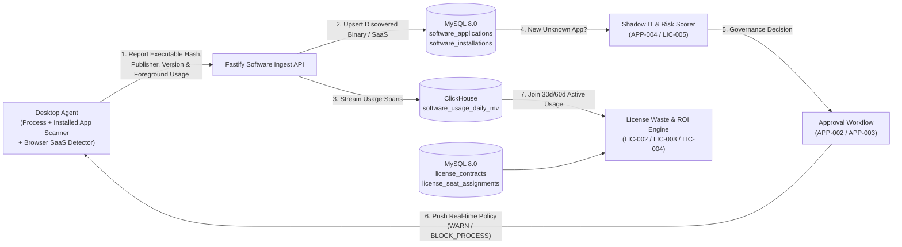
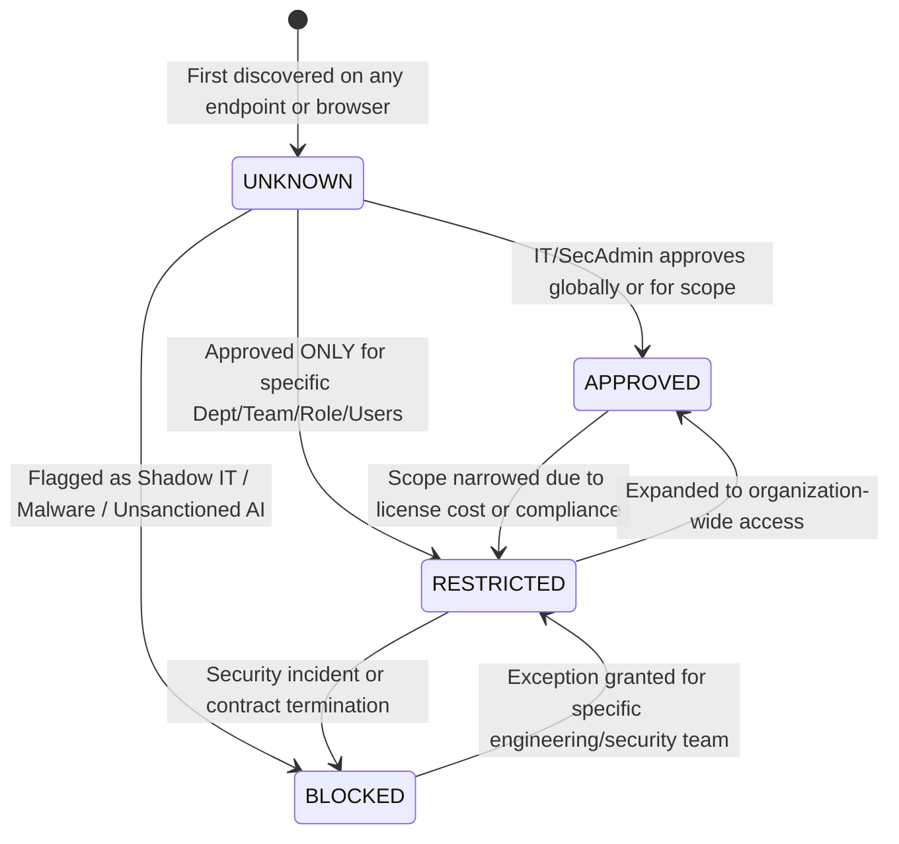

# PHASE 14: SOFTWARE GOVERNANCE, SHADOW IT DETECTION & COMMERCIAL LICENSE OPTIMIZATION

**Document ID:** `HYDI-PHASE-14`  
**Version:** `4.0.0-ENTERPRISE`  
**Modules Covered:** `APP-001`, `APP-002`, `APP-003`, `APP-004`, `LIC-001`, `LIC-002`, `LIC-003`, `LIC-004`, `LIC-005`  
**Core Stack:** Fastify 5 (TypeScript) + MySQL 8.0 InnoDB (Software Catalog, Approval Workflows, Commercial Contracts, Seat Assignments) + ClickHouse 24.x (Application Usage Telemetry & Seat Activity Rollups) + Redis 7.2 (Desktop Agent Block/Warn Policy Sync)

---

## 1. Architectural Overview & Software Governance Lifecycle

The HydiEms Software Governance & FinOps License Optimization subsystem bridges endpoint process/browser discovery with IT Security governance (`APP-001..004`, `LIC-005`) and SaaS/Desktop procurement cost optimization (`LIC-001..004`).



### 1.1 Application Governance State Machine (`APP-002`)

Every discovered desktop executable (`.exe`, `.app`, `.deb`, `.msi`) and SaaS web application (`*.notion.so`, `*.figma.com`, `chatgpt.com`) transitions through a strict 4-state governance lifecycle:



- **`UNKNOWN`:** Newly discovered software not yet triaged by IT/Security. Runs normally unless tenant sets `"Strict Zero-Trust Mode: Warn on Unknown"`.
- **`APPROVED`:** Sanctioned across the organization.
- **`RESTRICTED`:** Sanctioned **only** for scopes explicitly permitted in `application_governance_policies` (`APP-003`). Any usage outside permitted scopes triggers a `SHADOW_IT_RESTRICTED_VIOLATION` alert (`LIC-005`) and optional desktop warning toast or process termination.
- **`BLOCKED`:** Prohibited across the organization (e.g., torrent clients, unapproved screen-recorders, unsanctioned cloud storage, crypto miners). When an employee launches a `BLOCKED` executable, the Desktop Agent displays a corporate policy banner and optionally terminates the process within `500ms` (`ENFORCE_KILL`) or logs an high-severity incident (`AUDIT_ONLY`).

---

## 2. Database Schemas (MySQL 8.0 InnoDB + ClickHouse 24.x)

### 2.1 MySQL 8.0 InnoDB Schema

```sql
-- ============================================================================
-- TABLE 1: software_applications (APP-001, APP-002, APP-004, LIC-001)
-- Master inventory of all discovered Desktop Apps, CLI tools, Browser Extensions & SaaS Web Apps
-- ============================================================================
CREATE TABLE software_applications (
    app_id CHAR(36) NOT NULL COMMENT 'UUIDv7',
    tenant_id CHAR(36) NOT NULL,
    app_type ENUM('DESKTOP_BINARY', 'SAAS_WEB_APP', 'BROWSER_EXTENSION', 'CLI_BACKGROUND') NOT NULL,
    canonical_identifier VARCHAR(255) NOT NULL COMMENT 'Normalized exe name (slack.exe), bundle_id (com.tinyspeck.slackmacgap), or SaaS domain (figma.com)',
    display_name VARCHAR(255) NOT NULL,
    vendor_name VARCHAR(255) NOT NULL DEFAULT 'Unknown Vendor',
    category VARCHAR(100) NOT NULL DEFAULT 'Uncategorized' COMMENT 'IDE, Design, Messaging, Cloud Storage, AI Tool, VPN, Remote Access, Game',
    governance_status ENUM('APPROVED', 'RESTRICTED', 'BLOCKED', 'UNKNOWN') NOT NULL DEFAULT 'UNKNOWN',
    risk_level ENUM('LOW', 'MEDIUM', 'HIGH', 'CRITICAL') NOT NULL DEFAULT 'MEDIUM',
    risk_score TINYINT UNSIGNED NOT NULL DEFAULT 50 COMMENT '0..100 composite risk score (APP-004)',
    risk_factors JSON NULL COMMENT 'e.g. {"unsigned_binary":true,"external_cloud_upload":true,"genai_data_exfil":false}',
    code_signing_verified TINYINT(1) NOT NULL DEFAULT 0,
    code_signing_subject VARCHAR(512) NULL,
    latest_observed_version VARCHAR(100) NULL,
    is_commercial_licensed TINYINT(1) NOT NULL DEFAULT 0,
    productivity_classification ENUM('PRODUCTIVE', 'NON_PRODUCTIVE', 'NEUTRAL', 'NO_IMPACT') NOT NULL DEFAULT 'NEUTRAL',
    installed_devices_count INT UNSIGNED NOT NULL DEFAULT 0,
    active_users_30d_count INT UNSIGNED NOT NULL DEFAULT 0,
    inactive_users_30d_count INT UNSIGNED NOT NULL DEFAULT 0,
    first_discovered_at DATETIME(3) NOT NULL DEFAULT CURRENT_TIMESTAMP(3),
    first_discovered_by_user_id CHAR(36) NULL,
    last_used_at DATETIME(3) NULL,
    approved_by CHAR(36) NULL,
    approved_at DATETIME(3) NULL,
    approval_notes TEXT NULL,
    created_at DATETIME(3) NOT NULL DEFAULT CURRENT_TIMESTAMP(3),
    updated_at DATETIME(3) NOT NULL DEFAULT CURRENT_TIMESTAMP(3) ON UPDATE CURRENT_TIMESTAMP(3),
    PRIMARY KEY (app_id),
    UNIQUE KEY uq_tenant_canonical (tenant_id, app_type, canonical_identifier),
    KEY idx_tenant_governance (tenant_id, governance_status, risk_level),
    KEY idx_tenant_commercial (tenant_id, is_commercial_licensed)
) ENGINE=InnoDB DEFAULT CHARSET=utf8mb4 COLLATE=utf8mb4_unicode_ci;

-- ============================================================================
-- TABLE 2: software_endpoint_installations (APP-001, LIC-001)
-- Tracks every physical installation or detected user profile presence of an application
-- ============================================================================
CREATE TABLE software_endpoint_installations (
    installation_id BIGINT UNSIGNED NOT NULL AUTO_INCREMENT,
    tenant_id CHAR(36) NOT NULL,
    app_id CHAR(36) NOT NULL,
    user_id CHAR(36) NOT NULL,
    device_id CHAR(36) NOT NULL,
    installed_version VARCHAR(100) NOT NULL DEFAULT 'Unknown',
    install_path VARCHAR(1024) NULL,
    sha256_hash CHAR(64) NULL,
    first_detected_at DATETIME(3) NOT NULL DEFAULT CURRENT_TIMESTAMP(3),
    last_launched_at DATETIME(3) NULL,
    total_usage_seconds_30d BIGINT UNSIGNED NOT NULL DEFAULT 0,
    launch_count_30d INT UNSIGNED NOT NULL DEFAULT 0,
    is_currently_installed TINYINT(1) NOT NULL DEFAULT 1,
    PRIMARY KEY (installation_id),
    UNIQUE KEY uq_tenant_app_user_device (tenant_id, app_id, user_id, device_id),
    KEY idx_app_last_launched (tenant_id, app_id, last_launched_at),
    KEY idx_user_installs (tenant_id, user_id),
    CONSTRAINT fk_install_app FOREIGN KEY (app_id) REFERENCES software_applications (app_id) ON DELETE CASCADE
) ENGINE=InnoDB DEFAULT CHARSET=utf8mb4 COLLATE=utf8mb4_unicode_ci;

-- ============================================================================
-- TABLE 3: application_governance_policies (APP-003)
-- Granular policy overrides by Role, Department, Team, or Employee
-- ============================================================================
CREATE TABLE application_governance_policies (
    policy_id CHAR(36) NOT NULL COMMENT 'UUIDv7',
    tenant_id CHAR(36) NOT NULL,
    app_id CHAR(36) NOT NULL,
    scope_type ENUM('GLOBAL', 'DEPARTMENT', 'TEAM', 'ROLE', 'USER') NOT NULL,
    scope_target_id CHAR(36) NOT NULL COMMENT '0000... for GLOBAL, or dept_id / team_id / role_id / user_id',
    policy_action ENUM('ALLOW', 'WARN_USER', 'AUDIT_ALERT_ONLY', 'BLOCK_EXECUTION') NOT NULL,
    warning_banner_message VARCHAR(500) NULL DEFAULT 'This application is restricted by corporate IT policy.',
    max_daily_usage_minutes INT UNSIGNED NULL COMMENT 'Optional time-quota cap e.g. 30m/day',
    effective_from DATETIME(3) NOT NULL DEFAULT CURRENT_TIMESTAMP(3),
    effective_until DATETIME(3) NULL,
    is_active TINYINT(1) NOT NULL DEFAULT 1,
    created_by CHAR(36) NOT NULL,
    created_at DATETIME(3) NOT NULL DEFAULT CURRENT_TIMESTAMP(3),
    updated_at DATETIME(3) NOT NULL DEFAULT CURRENT_TIMESTAMP(3) ON UPDATE CURRENT_TIMESTAMP(3),
    PRIMARY KEY (policy_id),
    UNIQUE KEY uq_app_scope (tenant_id, app_id, scope_type, scope_target_id),
    KEY idx_tenant_active_policies (tenant_id, is_active),
    CONSTRAINT fk_gov_policy_app FOREIGN KEY (app_id) REFERENCES software_applications (app_id) ON DELETE CASCADE
) ENGINE=InnoDB DEFAULT CHARSET=utf8mb4 COLLATE=utf8mb4_unicode_ci;

-- ============================================================================
-- TABLE 4: commercial_license_contracts (LIC-002, LIC-003, LIC-004)
-- Tracks commercial software contracts, seat counts, unit costs, and renewals
-- ============================================================================
CREATE TABLE commercial_license_contracts (
    contract_id CHAR(36) NOT NULL COMMENT 'UUIDv7',
    tenant_id CHAR(36) NOT NULL,
    app_id CHAR(36) NOT NULL,
    contract_name VARCHAR(255) NOT NULL COMMENT 'e.g. Figma Organization Annual FY26',
    vendor_name VARCHAR(255) NOT NULL,
    license_tier VARCHAR(100) NOT NULL DEFAULT 'Enterprise',
    billing_frequency ENUM('MONTHLY', 'ANNUAL', 'MULTI_YEAR', 'ONE_TIME_PERPETUAL') NOT NULL DEFAULT 'ANNUAL',
    currency_code CHAR(3) NOT NULL DEFAULT 'USD',
    purchased_seats INT UNSIGNED NOT NULL,
    assigned_seats INT UNSIGNED NOT NULL DEFAULT 0,
    active_seats_30d INT UNSIGNED NOT NULL DEFAULT 0,
    unused_seats INT GENERATED ALWAYS AS (GREATEST(0, CAST(purchased_seats AS SIGNED) - CAST(active_seats_30d AS SIGNED))) STORED COMMENT 'LIC-003: Purchased - Active = Unused Seats',
    cost_per_seat_monthly DECIMAL(12,2) NOT NULL COMMENT 'Normalized monthly cost per seat',
    total_contract_value_annual DECIMAL(14,2) GENERATED ALWAYS AS (purchased_seats * cost_per_seat_monthly * 12) STORED,
    monthly_wasted_spend DECIMAL(14,2) GENERATED ALWAYS AS (GREATEST(0, CAST(purchased_seats AS SIGNED) - CAST(active_seats_30d AS SIGNED)) * cost_per_seat_monthly) STORED,
    inactivity_reclaim_threshold_days SMALLINT UNSIGNED NOT NULL DEFAULT 30 COMMENT 'Days without usage before seat is flagged for reclaim',
    min_monthly_minutes_for_active INT UNSIGNED NOT NULL DEFAULT 60 COMMENT 'User must use >= 60m/30d to count as genuinely Active',
    contract_start_date DATE NOT NULL,
    renewal_date DATE NOT NULL,
    auto_renew TINYINT(1) NOT NULL DEFAULT 1,
    cancellation_notice_days SMALLINT UNSIGNED NOT NULL DEFAULT 30,
    owner_user_id CHAR(36) NOT NULL,
    contract_status ENUM('ACTIVE', 'EXPIRING_SOON', 'EXPIRED', 'TERMINATED') NOT NULL DEFAULT 'ACTIVE',
    created_at DATETIME(3) NOT NULL DEFAULT CURRENT_TIMESTAMP(3),
    updated_at DATETIME(3) NOT NULL DEFAULT CURRENT_TIMESTAMP(3) ON UPDATE CURRENT_TIMESTAMP(3),
    PRIMARY KEY (contract_id),
    KEY idx_tenant_renewal (tenant_id, renewal_date, contract_status),
    KEY idx_tenant_app_contract (tenant_id, app_id),
    CONSTRAINT fk_contract_app FOREIGN KEY (app_id) REFERENCES software_applications (app_id) ON DELETE RESTRICT
) ENGINE=InnoDB DEFAULT CHARSET=utf8mb4 COLLATE=utf8mb4_unicode_ci;

-- ============================================================================
-- TABLE 5: license_seat_assignments (LIC-002, LIC-003)
-- Maps individual employees to commercial license seats & tracks reclaim status
-- ============================================================================
CREATE TABLE license_seat_assignments (
    assignment_id CHAR(36) NOT NULL COMMENT 'UUIDv7',
    tenant_id CHAR(36) NOT NULL,
    contract_id CHAR(36) NOT NULL,
    app_id CHAR(36) NOT NULL,
    user_id CHAR(36) NOT NULL,
    department_id CHAR(36) NOT NULL,
    assigned_at DATETIME(3) NOT NULL DEFAULT CURRENT_TIMESTAMP(3),
    assigned_by CHAR(36) NULL,
    last_active_at DATETIME(3) NULL,
    usage_seconds_last_30d BIGINT UNSIGNED NOT NULL DEFAULT 0,
    usage_days_last_30d TINYINT UNSIGNED NOT NULL DEFAULT 0,
    utilization_status ENUM('HEAVY_USER', 'REGULAR_USER', 'UNDERUTILIZED', 'ZERO_USAGE_WASTE', 'RECLAIMED') NOT NULL DEFAULT 'ZERO_USAGE_WASTE',
    reclaim_candidate TINYINT(1) NOT NULL DEFAULT 0,
    reclaimed_at DATETIME(3) NULL,
    reclaimed_by CHAR(36) NULL,
    reclaim_reason VARCHAR(255) NULL,
    PRIMARY KEY (assignment_id),
    UNIQUE KEY uq_contract_user (contract_id, user_id),
    KEY idx_tenant_reclaim (tenant_id, reclaim_candidate, utilization_status),
    CONSTRAINT fk_seat_contract FOREIGN KEY (contract_id) REFERENCES commercial_license_contracts (contract_id) ON DELETE CASCADE
) ENGINE=InnoDB DEFAULT CHARSET=utf8mb4 COLLATE=utf8mb4_unicode_ci;

-- ============================================================================
-- TABLE 6: shadow_it_incidents (LIC-005)
-- Logs unauthorized, blocked, or high-risk Shadow IT executions
-- ============================================================================
CREATE TABLE shadow_it_incidents (
    incident_id CHAR(36) NOT NULL COMMENT 'UUIDv7',
    tenant_id CHAR(36) NOT NULL,
    app_id CHAR(36) NOT NULL,
    user_id CHAR(36) NOT NULL,
    department_id CHAR(36) NOT NULL,
    device_id CHAR(36) NOT NULL,
    violation_type ENUM('BLOCKED_APP_LAUNCHED', 'RESTRICTED_SCOPE_VIOLATION', 'HIGH_RISK_UNAPPROVED_SAAS', 'UNSIGNED_BINARY_EXECUTION') NOT NULL,
    enforcement_taken ENUM('LOGGED_ONLY', 'USER_WARNED', 'PROCESS_TERMINATED') NOT NULL,
    window_title_sample VARCHAR(512) NULL,
    url_sample VARCHAR(1024) NULL,
    duration_seconds INT UNSIGNED NOT NULL DEFAULT 0,
    status ENUM('OPEN', 'INVESTIGATING', 'SANCTIONED_EXCEPTION', 'RESOLVED_REMOVED') NOT NULL DEFAULT 'OPEN',
    occurred_at DATETIME(3) NOT NULL DEFAULT CURRENT_TIMESTAMP(3),
    resolved_by CHAR(36) NULL,
    resolved_at DATETIME(3) NULL,
    PRIMARY KEY (incident_id),
    KEY idx_tenant_status_occurred (tenant_id, status, occurred_at DESC),
    KEY idx_tenant_user_violation (tenant_id, user_id, occurred_at DESC)
) ENGINE=InnoDB DEFAULT CHARSET=utf8mb4 COLLATE=utf8mb4_unicode_ci;
```

### 2.2 ClickHouse 24.x Application Usage & ROI Materialized View

```sql
CREATE TABLE hydi_telemetry.software_usage_daily_rollup (
    tenant_id UUID,
    work_date Date,
    app_id UUID,
    canonical_identifier LowCardinality(String),
    user_id UUID,
    department_id UUID,
    team_id UUID,
    active_seconds SimpleAggregateFunction(sum, UInt64),
    productive_seconds SimpleAggregateFunction(sum, UInt64),
    launch_or_focus_count SimpleAggregateFunction(sum, UInt64),
    keystrokes_count SimpleAggregateFunction(sum, UInt64),
    mouse_clicks_count SimpleAggregateFunction(sum, UInt64)
)
ENGINE = AggregatingMergeTree()
PARTITION BY toYYYYMM(work_date)
ORDER BY (tenant_id, app_id, work_date, department_id, user_id);
```

---

## 3. Mathematical Models: Risk Matrix, License Waste & Software ROI

### 3.1 Application Risk Matrix Score (`APP-004`)

Each discovered application is assigned a deterministic **Composite Risk Score** ($R_{\text{app}} \in [0, 100]$) across 5 weighted threat signals:

$$R_{\text{app}} = \min\left(100, w_1 S_{\text{sig}} + w_2 S_{\text{cat}} + w_3 S_{\text{exfil}} + w_4 S_{\text{gov}} + w_5 S_{\text{prev}}\right)$$

| Signal Factor | Symbol | Weight | Scoring Rule |
| :--- | :---: | :---: | :--- |
| **Code Signing & Binary Trust** | $S_{\text{sig}}$ | `25` | `0` if EV/OV signed by known publisher; `15` if self-signed; `25` if unsigned binary executing from `%APPDATA%` or `Downloads`. |
| **Category Threat Surface** | $S_{\text{cat}}$ | `25` | `25` for P2P/Torrents, Remote Desktop (`anydesk.exe`), Unapproved VPN/Proxy; `20` for Unsanctioned GenAI/File-Sharing; `5` for Standard Dev/Office tools. |
| **Data Exfiltration Vector** | $S_{\text{exfil}}$ | `20` | `20` if app supports outbound file upload/clipboard sync to consumer cloud; `0` if local-only. |
| **Governance Status** | $S_{\text{gov}}$ | `15` | `15` if `BLOCKED`, `10` if `UNKNOWN`, `5` if `RESTRICTED`, `0` if `APPROVED`. |
| **Endpoint Prevalence Anomaly** | $S_{\text{prev}}$ | `15` | `15` if installed on $\le 2$ machines in non-technical department (rare/targeted executable); `0` if widespread standard image app. |

- **Risk Matrix Quadrant Classification (`APP-004`):**
  - `LOW` ($0–24$): Green
  - `MEDIUM` ($25–49$): Amber
  - `HIGH` ($50–74$): Orange
  - `CRITICAL` ($75–100$): Crimson

### 3.2 License Waste & Reclaim Calculator (`LIC-003`)

For any commercial contract $c$ with `purchased_seats` ($P_c$), `assigned_seats` ($A_c$), monthly seat cost ($M_c$), and `min_monthly_minutes_for_active` threshold ($\theta_{\text{min}}$, default `60 minutes` in rolling 30 days):

1. **Active Seat Count ($U_{\text{active}}$):** Number of assigned users whose 30-day foreground usage $T_{u, 30\text{d}} \ge \theta_{\text{min}} \times 60\text{ seconds}$.
2. **Unused Seats ($U_{\text{unused}}$):**
   $$U_{\text{unused}} = \max(0, P_c - U_{\text{active}})$$
   Decomposed into:
   - **Unassigned Shelfware ($U_{\text{shelf}}$):** $\max(0, P_c - A_c)$
   - **Zero-Usage Assigned Seats ($U_{\text{zero}}$):** Assigned users with $T_{u, 30\text{d}} = 0$
   - **Underutilized Seats ($U_{\text{under}}$):** Assigned users with $0 < T_{u, 30\text{d}} < \theta_{\text{min}} \times 60$
3. **Monthly & Annualized License Waste (\$):**
   $$\text{Monthly Waste}_c = U_{\text{unused}} \times M_c, \quad \text{Annualized Savings Opportunity}_c = U_{\text{unused}} \times M_c \times 12$$

### 3.3 Software ROI & Productivity Contribution Score (`LIC-004`)

For a licensed application $a$ under contract $c$, HydiEms computes its **Productivity Contribution & ROI Score** ($\text{ROI}_a \in [0, 100]$):

1. **Seat Utilization Rate ($U_{\%}$):**
   $$U_{\%} = \min\left(100, \frac{U_{\text{active}}}{\max(1, P_c)} \times 100\right)$$
2. **Cost per Active Productive Hour ($\text{CPH}_a$):**
   $$\text{CPH}_a = \frac{P_c \times M_c}{\max(1, \sum_{u} T_{\text{prod}, u, 30\text{d}} / 3600)}$$
3. **Engagement Depth Index ($D_a$):** Ratio of active users averaging $\ge 30\text{ mins/workday}$ in the tool relative to benchmark category norm.
4. **Composite Software ROI Score ($\text{ROI}_a$):**
   $$\text{ROI}_a = \text{round}\left(0.45 \cdot U_{\%} + 0.35 \cdot D_a + 0.20 \cdot \max\left(0, 100 - 4 \cdot \text{CPH}_a\right), 1\right)$$

---

## 4. Screen-by-Screen UI/UX & Engineering Specifications

### 4.1 `APP-001` — Master Application Inventory

- **Route:** `/governance/applications/inventory`
- **RBAC Permissions:** `software:inventory:read`, `software:inventory:export`
- **UI Components:**
  - **Summary KPI Cards:** `Total Discovered Apps (418)`, `Approved (264)`, `Restricted (42)`, `Blocked (19)`, `Untriaged / Unknown (93)`.
  - **Filter & Search Bar:** Filter by `App Type` (`Desktop Binary`, `SaaS Web App`, `Browser Extension`), `Governance Status`, `Category`, `Risk Level`, `Code-Signing Status`.
  - **Inventory Data Grid Columns:**
    1. `Application` (Icon, Display Name, Canonical Identifier `slack.exe`, Vendor)
    2. `Type` (`Desktop` / `SaaS` / `Extension`)
    3. `Category`
    4. `Governance Badge` (`Approved` / `Restricted` / `Blocked` / `Unknown`)
    5. `Risk Score` (`APP-004` badge `0–100` + `Code Signed` shield icon)
    6. `Installed Endpoints` (Click to view machine list)
    7. `Active Users (30d)` vs. `Inactive Users (30d)`
    8. `Total Usage (30d Hours)`
    9. `Avg Daily Time / Active User`
    10. `Quick Actions`: `Approve`, `Restrict`, `Block`, `Link License Contract`.

### 4.2 `APP-002` — Application Approval Workflow Board & Queue

- **Route:** `/governance/applications/approvals`
- **RBAC Permissions:** `software:approvals:read`, `software:approvals:decide`
- **UI Layout:**
  - **4-Column Kanban / Triage Queue View:**
    - Column 1: `Unknown / Pending Triage` (Sorted by Risk Score DESC or Active User Count DESC)
    - Column 2: `Approved (Sanctioned)`
    - Column 3: `Restricted (Scoped Access)`
    - Column 4: `Blocked (Prohibited)`
  - **1-Click Triage Decision Modal:**
    - Displays binary SHA-256 hash, Code Signing Certificate Subject, First Discovered By User/Device, and 30-day usage sparkline.
    - Allows selecting target state (`APPROVED`, `RESTRICTED`, `BLOCKED`), setting productivity classification (`PRODUCTIVE`, `NEUTRAL`, `NON_PRODUCTIVE`), and entering mandatory audit notes.

### 4.3 `APP-003` — Application Policy by Employee / Team / Dept / Role

- **Route:** `/governance/applications/policies`
- **RBAC Permissions:** `software:policies:read`, `software:policies:manage`
- **Policy Builder Specification:**
  - Select Application(s) or Category (e.g., `Category: Remote Desktop Tools` or `App: AnyDesk`).
  - Define **Permitted Scopes**: e.g., `ALLOW` for `Department: IT Support` and `Role: DevOps Engineer`.
  - Define **Out-of-Scope Enforcement Action**:
    - `AUDIT_ALERT_ONLY`: Silently creates a `shadow_it_incidents` record and alerts SecOps.
    - `WARN_USER`: Desktop Agent displays a non-blocking modal banner with custom policy text.
    - `BLOCK_EXECUTION`: Desktop Agent intercepts process creation / foreground focus, displays block notification, and terminates the process (`TerminateProcess` / `SIGKILL`) within `500ms`.
  - Define **Optional Daily Time Quota**: e.g., Allow `Spotify` or `YouTube` for `max 45 minutes/day` before displaying a gentle productivity reminder.

### 4.4 `APP-004` — Application Risk Matrix

- **Route:** `/governance/applications/risk-matrix`
- **RBAC Permissions:** `software:risk:read`
- **UI Layout:**
  - **Interactive 5×5 Risk Heatmap Grid:**
    - X-Axis: **Organizational Exposure** (`1 User`, `2–10 Users`, `11–50 Users`, `51–200 Users`, `200+ Users`)
    - Y-Axis: **Technical & Data Risk Severity** (`Minimal`, `Low`, `Moderate`, `High`, `Critical`)
  - Clicking any cell filters the **High-Risk Application Table** below, showing exact risk factor breakdowns (`Unsigned Binary`, `Runs from User Temp Directory`, `Unapproved GenAI Prompt Upload`, `P2P Network Socket`).

### 4.5 `LIC-001` — Software Inventory with Active vs. Inactive Users

- **Route:** `/finops/licenses/software-usage`
- **RBAC Permissions:** `finops:licenses:read`
- **UI Specification:**
  - Dedicated view comparing **Installed / Provisioned User Count** against **Actual Active Users (30d)** and **Inactive Users (30d)** across every paid and free application.
  - Clicking an application opens the **User Utilization Split Drawer** with two tabs:
    - `Active Users (Used >= 60 mins in 30d)` with exact hours, launch count, and last active timestamp.
    - `Inactive / Dormant Users (0 mins or < 60 mins in 30d)` with `" Days Since Last Launch"` and a `"Select All for Reclaim"` button.

### 4.6 `LIC-002` — Commercial License Contract Management

- **Route:** `/finops/licenses/contracts`
- **RBAC Permissions:** `finops:contracts:read`, `finops:contracts:manage`
- **Contract Ledger Table & Drawer:**
  - Columns: `Vendor & Application`, `Contract Name & Tier`, `Purchased Seats`, `Assigned Seats`, `Active Seats (30d)`, `Unused Seats` (`Purchased - Active`), `Cost / User / Mo`, `Total Annual Spend`, `Monthly Wasted Spend`, `Renewal Date` (with countdown badge e.g. `Renews in 24 days — Notice Deadline in 4 days!`), `Contract Status`.
  - **Contract Creation / Edit Modal:** Captures Vendor, Linked `app_id`, Purchased Seat Count, Cost per User, Currency, Billing Cycle, Renewal Date, Cancellation Notice Window, and Seat CSV Import / SSO Group Mapping.

### 4.7 `LIC-003` — License Waste Calculator & 1-Click Reclaim List

- **Route:** `/finops/licenses/waste-calculator`
- **RBAC Permissions:** `finops:waste:read`, `finops:waste:reclaim`
- **Top FinOps KPI Banner:**
  - **Total Annual Software Spend:** `\$482,400 / yr`
  - **Identified Annual License Waste (`Purchased - Active`):** `\$94,680 / yr` (`19.6% savings potential`)
  - **Total Reclaimable Seats:** `184 seats across 14 contracts`
  - **Renewals in Next 60 Days:** `4 contracts (\$118,000)`
- **Interactive Threshold Slider:**
  - Admin can dynamically adjust **"Define Active User Threshold"**:
    - Slider 1: `Inactivity Window` (`14 days` | `30 days` | `60 days` | `90 days`)
    - Slider 2: `Minimum Usage Duration` (`1 min` | `30 mins` | `60 mins` | `120 mins` per month)
  - Moving the sliders recalculates `Active Seats`, `Unused Seats`, and `Projected Annual Savings` in real time.
- **Reclaim Candidate Action Table:**
  - Lists every employee holding a paid seat with `ZERO_USAGE_WASTE` or `UNDERUTILIZED` status.
  - Supports **Bulk Actions**:
    - `Mark Seat as Reclaimed` (Updates contract ledger and records realized savings)
    - `Export Reclaim CSV for IT / Okta / Entra ID Deprovisioning`
    - `Send Automated Usage Confirmation Prompt to Employee` (Asks employee if they still require the license).

### 4.8 `LIC-004` — Software ROI & Productivity Contribution Score

- **Route:** `/finops/licenses/roi`
- **RBAC Permissions:** `finops:roi:read`
- **Visualizations:**
  - **Value vs. Cost Bubble Chart:**
    - X-Axis: `Monthly Spend ($)`
    - Y-Axis: `Total Productive Hours Generated (30d)`
    - Bubble Size: `Purchased Seats`
    - Color: `ROI Score (0–100)`
  - **Software ROI Scorecard Table:** Shows `Application`, `Annual Spend`, `Active Productive Hours`, `Cost per Productive Hour ($/hr)`, `Seat Utilization %`, `Productivity Contribution Score (0–100)`, and `Renewal Recommendation` (`Expand Seats`, `Maintain`, `Downsize by N Seats`, `Consolidate / Eliminate`).

### 4.9 `LIC-005` — Unauthorized / Shadow IT Software Detection

- **Route:** `/governance/shadow-it`
- **RBAC Permissions:** `software:shadow_it:read`, `software:shadow_it:resolve`
- **Detection Capabilities:**
  - Automatically surfaces:
    1. **Blocked Application Launches:** Any attempt to run a `BLOCKED` binary or visit a blocked SaaS domain.
    2. **Restricted Scope Violations:** E.g., a user in `Sales` launching an IDE or database admin tool (`dbeaver.exe`) restricted to `Engineering`.
    3. **Duplicate / Redundant Paid SaaS Category:** E.g., employees using `Monday.com` or `Trello` when the company standard is `Jira` + `Asana`.
    4. **Unsanctioned AI & Cloud Upload Tools:** Usage of unapproved GenAI chat/code tools or consumer file-transfer sites (`wetransfer.com`, `mega.nz`).
- **Incident Response Drawer:** View employee, device, executable path, SHA-256 hash, window title sample, duration, and take 1-click action: `Block Globally`, `Grant Scoped Exception`, or `Mark Resolved`.

---

## 5. Fastify REST & WebSocket API Specifications

### 5.1 `GET /api/v1/governance/applications` (`APP-001`, `APP-004`, `LIC-001`)

- **Query Parameters:** `status` (`APPROVED`|`RESTRICTED`|`BLOCKED`|`UNKNOWN`), `appType`, `riskLevel`, `search`, `page`, `limit`, `sortBy` (`active_users_30d_count`|`risk_score`|`first_discovered_at`).
- **Response (`200 OK`):** Paginated application inventory enriched with 30-day active/inactive user counts and total hours from ClickHouse `software_usage_daily_rollup`.

### 5.2 `PATCH /api/v1/governance/applications/:appId/approval` (`APP-002`)

- **Request Body:**
```json
{
  "governanceStatus": "RESTRICTED",
  "productivityClassification": "PRODUCTIVE",
  "riskLevel": "LOW",
  "approvalNotes": "Approved for UI/UX Design and Frontend Engineering squads only.",
  "allowedScopes": [
    {
      "scopeType": "DEPARTMENT",
      "scopeTargetId": "01926a11-8899-7000-8000-000000000001",
      "policyAction": "ALLOW"
    }
  ],
  "defaultOutOfScopeAction": "WARN_USER"
}
```
- **Side Effects:**
  1. Updates `software_applications` and upserts `application_governance_policies` inside a MySQL transaction.
  2. Publishes real-time policy delta over WebSocket event `agent:policy:software_governance_sync` to all connected Desktop Agents in the tenant.
  3. Writes audit event `SOFTWARE_GOVERNANCE_STATUS_CHANGED` to `AUDIT-002`.

### 5.3 `POST /api/v1/finops/contracts` & `GET /api/v1/finops/waste-calculator` (`LIC-002`, `LIC-003`)

- **`GET /api/v1/finops/waste-calculator` Query Parameters:**
  - `inactivityDays` (default `30`), `minActiveMinutes` (default `60`), `departmentId` (optional).
- **SQL + ClickHouse Join Logic:**
  1. Fetch all active `commercial_license_contracts` and `license_seat_assignments` from MySQL.
  2. Query ClickHouse `software_usage_daily_rollup` for `work_date >= today() - inactivityDays` grouped by `(app_id, user_id)`.
  3. Compute `activeSeats`, `unusedSeats = GREATEST(0, purchasedSeats - activeSeats)`, `unassignedShelfware`, `zeroUsageAssigned`, `underutilizedAssigned`, `monthlyWastedSpend`, and return the prioritized `reclaimCandidates` list.

### 5.4 `POST /api/v1/finops/contracts/:contractId/reclaim-seats` (`LIC-003`)

- **Request Body:**
```json
{
  "userIds": [
    "01926a11-1111-7000-8000-aaaaaaaaaaaa",
    "01926a11-2222-7000-8000-bbbbbbbbbbbb"
  ],
  "reclaimReason": "0 minutes usage in last 60 days prior to annual renewal"
}
```
- **Side Effects:** Marks rows in `license_seat_assignments` as `RECLAIMED`, decrements `assigned_seats` on `commercial_license_contracts`, logs realized cost savings, and writes `LICENSE_SEATS_RECLAIMED` to `AUDIT-002`.

---

## 6. RBAC Permission Matrix & Audit Events

| Permission Slug | Org Admin | SecOps Admin | FinOps / IT Asset Mgr | Dept Manager | Employee |
| :--- | :---: | :---: | :---: | :---: | :---: |
| `software:inventory:read` | Full Org | Full Org | Full Org | Own Dept | Denied |
| `software:approvals:decide` | Full Org | Full Org | Denied | Denied | Denied |
| `software:policies:manage` | Full Org | Full Org | Denied | Denied | Denied |
| `software:risk:read` | Full Org | Full Org | Read-Only | Own Dept | Denied |
| `finops:contracts:read` | Full Org | Denied | Full Org | Own Dept | Denied |
| `finops:contracts:manage` | Full Org | Denied | Full Org | Denied | Denied |
| `finops:waste:reclaim` | Full Org | Denied | Full Org | Denied | Denied |
| `software:shadow_it:resolve` | Full Org | Full Org | Read-Only | Own Dept | Denied |

### Audited Events Logged to `AUDIT-002`
- `SOFTWARE_GOVERNANCE_STATUS_CHANGED` (`app_id`, `old_status`, `new_status`, `actor_id`, `notes`)
- `SOFTWARE_POLICY_ENFORCEMENT_UPDATED` (`app_id`, `scope_type`, `scope_target_id`, `policy_action`)
- `LICENSE_CONTRACT_CREATED` / `LICENSE_CONTRACT_UPDATED` / `LICENSE_CONTRACT_DELETED`
- `LICENSE_SEATS_RECLAIMED` (`contract_id`, `reclaimed_user_ids`, `annualized_savings_usd`)
- `SHADOW_IT_INCIDENT_RESOLVED` (`incident_id`, `resolution_status`, `actor_id`)

---

## 7. Acceptance Criteria & Verification Suite

1. **AC-APP-01 (Auto-Discovery to Triage Queue):** When a Desktop Agent reports a previously unseen executable (`cursor.exe`, SHA-256 hash, publisher) in its telemetry payload, HydiEms MUST automatically create a row in `software_applications` with `governance_status = 'UNKNOWN'`, compute its initial `risk_score` (`APP-004`), and surface it in `APP-002` within `5 seconds`.
2. **AC-APP-02 (Scoped Policy Enforcement):** Given `anydesk.exe` is marked `RESTRICTED` with `ALLOW` for `Department: IT Support` and `BLOCK_EXECUTION` globally:
   - An IT Support employee launching `anydesk.exe` MUST run uninterrupted.
   - A Finance employee launching `anydesk.exe` MUST have the process terminated by the Desktop Agent within `500ms`, see the corporate restriction toast, and generate a `BLOCKED_APP_LAUNCHED` incident in `LIC-005`.
3. **AC-LIC-01 (Exact License Waste Formula):** Given a contract for `Adobe Creative Cloud` with `100 purchased seats` at `\$85/seat/month`, where `88 seats` are assigned, `62 users` logged $\ge 60\text{ mins}$ in the last 30 days, `11 users` logged between `1–59 mins`, and `15 users` logged `0 mins`:
   - `Active Seats` MUST equal `62`.
   - `Unused Seats` (`Purchased - Active`) MUST equal `38` (`12 unassigned + 15 zero-usage + 11 underutilized`).
   - `Monthly Wasted Spend` MUST equal `38 × \$85 = \$3,230.00/mo` (`\$38,760.00/yr`).
4. **AC-LIC-02 (Renewal Alerting):** Any active contract whose `renewal_date - cancellation_notice_days` is within `14 days` of `CURDATE()` MUST automatically transition to or display a high-priority `NOTICE_DEADLINE_APPROACHING` alert badge in `LIC-002` and notify the `owner_user_id`.
