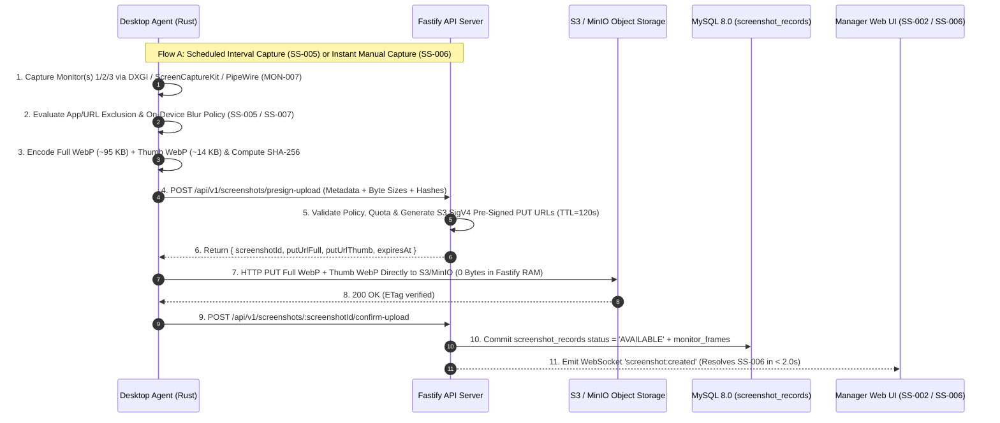

# PHASE 15: SCREENSHOT ENGINE, MULTI-MONITOR CAPTURE, PRIVACY BLUR, RETENTION & AUDITED ACTIONS

**Document ID:** `HYDI-PHASE-15`  
**Version:** `4.0.0-ENTERPRISE`  
**Modules Covered:** `SS-001`, `SS-002`, `SS-003`, `SS-004`, `SS-005`, `SS-006`, `SS-007`, `SS-008`, `SS-009`, `MON-007`  
**Core Stack:** Fastify 5 (TypeScript) + S3 / MinIO Object Storage (Zero-Proxy Pre-Signed PUT/GET) + MySQL 8.0 InnoDB (Screenshot Metadata, Policies, Investigation Notes, Internal Shares) + ClickHouse 24.x (High-Speed Screenshot Analytics & Access Audit Trail `AUDIT-002` / `PRIV-003`) + Redis 7.2 (`<2s` Manual Capture WebSocket Correlation)

---

## 1. Architectural Overview & Zero-RAM S3/MinIO Pre-Signed Upload Pipeline

To support `100,000+` concurrent desktop agents capturing multi-monitor WebP screenshots up to `10x per hour`, **zero image bytes ever traverse the Fastify Node.js heap**. All full-resolution (`1920x1080` / `2560x1440` WebP quality `78`) and thumbnail (`384x216` WebP quality `65`) images are encoded and optionally blurred **on-device** inside the Rust Desktop Agent (`image` + `libwebp` + on-device OCR/Regex title evaluator), then uploaded directly to S3/MinIO via short-lived (`120s` TTL) AWS Signature V4 Pre-Signed `PUT` URLs with strict `Content-MD5` and `Content-Length` enforcement.



### 1.1 S3 / MinIO Object Key Partitioning Convention

```text
s3://hydi-screenshots-{region}/
  └── tenants/{tenant_id}/
        └── retention_{retention_days}d/
              └── {YYYY}/{MM}/{DD}/
                    └── {user_id}/
                          ├── {screenshot_id}_m{monitor_index}_full.webp
                          └── {screenshot_id}_m{monitor_index}_thumb.webp
```

> [!TIP]
> **Prefix-Based Lifecycle Expiration (`SS-008`):** Including `retention_{retention_days}d/` in the S3 object key prefix allows native S3/MinIO Bucket Lifecycle Rules (`Expiration: Days = 7 | 30 | 90 | 365`) to automatically purge expired objects at zero compute cost, while a nightly BullMQ worker synchronizes custom-day retentions and marks `is_marked_for_investigation = 1` objects with S3 Object Legal Hold (`x-amz-object-lock-legal-hold: ON`) so investigation evidence is never auto-deleted!

---

## 2. Database Schemas (MySQL 8.0 InnoDB + ClickHouse 24.x)

### 2.1 MySQL 8.0 InnoDB Schema

```sql
-- ============================================================================
-- TABLE 1: screenshot_policies (SS-005, SS-007, SS-008, MON-007)
-- Scoped configuration for capture frequency, blur mode, exclusions, and retention
-- ============================================================================
CREATE TABLE screenshot_policies (
    policy_id CHAR(36) NOT NULL COMMENT 'UUIDv7',
    tenant_id CHAR(36) NOT NULL,
    scope_type ENUM('GLOBAL', 'DEPARTMENT', 'TEAM', 'ROLE', 'USER') NOT NULL,
    scope_target_id CHAR(36) NOT NULL DEFAULT '00000000-0000-0000-0000-000000000000',
    is_capture_enabled TINYINT(1) NOT NULL DEFAULT 1,
    captures_per_hour TINYINT UNSIGNED NOT NULL DEFAULT 6 COMMENT 'SS-005: 1 to 10 captures per hour',
    randomize_interval TINYINT(1) NOT NULL DEFAULT 1 COMMENT 'Random jitter within each slot (e.g. 10m slot -> random second 30..570)',
    capture_only_working_hours TINYINT(1) NOT NULL DEFAULT 1,
    skip_capture_when_idle TINYINT(1) NOT NULL DEFAULT 1,
    monitor_capture_mode ENUM('ALL_MONITORS', 'ACTIVE_WINDOW_MONITOR_ONLY', 'PRIMARY_MONITOR_ONLY', 'SELECTED_INDICES') NOT NULL DEFAULT 'ALL_MONITORS' COMMENT 'MON-007',
    selected_monitor_indices JSON NULL COMMENT 'e.g. [1, 2] when mode = SELECTED_INDICES',
    blur_mode ENUM('NO_BLUR', 'PARTIAL_BLUR', 'FULL_BLUR', 'AUTO_SENSITIVE_REGEX_BLUR') NOT NULL DEFAULT 'AUTO_SENSITIVE_REGEX_BLUR' COMMENT 'SS-007',
    blur_gaussian_sigma DECIMAL(4,1) NOT NULL DEFAULT 12.0 COMMENT '12.0 for Partial Blur (layout visible, text unreadable), 28.0 for Full Blur',
    sensitive_blur_regex_patterns JSON NOT NULL COMMENT 'Array of RE2 patterns on Window Title/URL that force blur e.g. ["(?i)(1password|bitwarden|bank|payroll|medical|hipaa|stripe\\.com/dashboard)"]',
    excluded_processes JSON NOT NULL COMMENT 'Apps where capture is completely skipped e.g. ["keepassxc.exe","1password.exe"]',
    excluded_url_patterns JSON NOT NULL COMMENT 'URLs where capture is skipped e.g. ["*://*.chase.com/*","*://mail.google.com/mail/u/personal*"]',
    privacy_mode_employee_self_delete_window_sec INT UNSIGNED NOT NULL DEFAULT 0 COMMENT 'If >0 (e.g. 180s), employee gets toast and can delete before upload',
    notify_user_on_capture TINYINT(1) NOT NULL DEFAULT 0,
    retention_days SMALLINT UNSIGNED NOT NULL DEFAULT 90 COMMENT 'SS-008: 7, 30, 90, 365, or custom (1..3650)',
    allow_manual_capture_now TINYINT(1) NOT NULL DEFAULT 1 COMMENT 'SS-006',
    updated_by CHAR(36) NOT NULL,
    updated_at DATETIME(3) NOT NULL DEFAULT CURRENT_TIMESTAMP(3) ON UPDATE CURRENT_TIMESTAMP(3),
    PRIMARY KEY (policy_id),
    UNIQUE KEY uq_tenant_ss_scope (tenant_id, scope_type, scope_target_id),
    CONSTRAINT chk_captures_per_hour CHECK (captures_per_hour BETWEEN 1 AND 10)
) ENGINE=InnoDB DEFAULT CHARSET=utf8mb4 COLLATE=utf8mb4_unicode_ci;

-- ============================================================================
-- TABLE 2: screenshot_records (SS-001, SS-002, SS-003, SS-004, SS-006, SS-009)
-- Master record per capture event (links to 1..N monitor frames in screenshot_monitor_frames)
-- ============================================================================
CREATE TABLE screenshot_records (
    screenshot_id CHAR(36) NOT NULL COMMENT 'UUIDv7 time-ordered',
    tenant_id CHAR(36) NOT NULL,
    user_id CHAR(36) NOT NULL,
    department_id CHAR(36) NOT NULL,
    team_id CHAR(36) NOT NULL,
    device_id CHAR(36) NOT NULL,
    project_id CHAR(36) NULL,
    task_id CHAR(36) NULL,
    capture_date DATE NOT NULL COMMENT 'Local work date of employee',
    captured_at_utc DATETIME(3) NOT NULL,
    slot_hour TINYINT UNSIGNED NOT NULL COMMENT '0..23 local hour for SS-004 timeline grouping',
    slot_minute_bucket TINYINT UNSIGNED NOT NULL COMMENT '0, 10, 20, 30, 40, 50 for timeline grid',
    trigger_type ENUM('SCHEDULED_INTERVAL', 'MANUAL_CAPTURE_NOW', 'ALERT_RULE_TRIGGER', 'APP_FOCUS_TRIGGER') NOT NULL DEFAULT 'SCHEDULED_INTERVAL',
    triggered_by_user_id CHAR(36) NULL COMMENT 'Populated when trigger_type = MANUAL_CAPTURE_NOW (SS-006)',
    monitor_count TINYINT UNSIGNED NOT NULL DEFAULT 1 COMMENT 'MON-007: Number of displays captured (1..6)',
    active_monitor_index TINYINT UNSIGNED NOT NULL DEFAULT 1 COMMENT 'Which display had cursor/keyboard focus',
    active_process_name VARCHAR(255) NOT NULL,
    active_window_title VARCHAR(512) NOT NULL,
    active_url VARCHAR(1024) NULL,
    active_domain VARCHAR(255) NULL,
    productivity_classification ENUM('PRODUCTIVE', 'NON_PRODUCTIVE', 'NEUTRAL', 'NO_IMPACT', 'IDLE') NOT NULL DEFAULT 'NEUTRAL',
    activity_score_pct DECIMAL(5,2) NOT NULL DEFAULT 0.00 COMMENT '0..100% activity level during capture interval',
    keystrokes_in_interval SMALLINT UNSIGNED NOT NULL DEFAULT 0,
    mouse_clicks_in_interval SMALLINT UNSIGNED NOT NULL DEFAULT 0,
    mouse_distance_px_in_interval INT UNSIGNED NOT NULL DEFAULT 0,
    blur_applied ENUM('NONE', 'PARTIAL', 'FULL', 'AUTO_PII_REGEX') NOT NULL DEFAULT 'NONE',
    blur_trigger_reason VARCHAR(255) NULL COMMENT 'e.g. Matched regex: (?i)payroll',
    upload_status ENUM('PENDING_UPLOAD', 'AVAILABLE', 'SKIPPED_EXCLUSION', 'DELETED_BY_ADMIN', 'DELETED_RETENTION_EXPIRED') NOT NULL DEFAULT 'PENDING_UPLOAD',
    is_marked_for_investigation TINYINT(1) NOT NULL DEFAULT 0 COMMENT 'SS-009: Locks S3 object from retention purge',
    investigation_case_ref VARCHAR(100) NULL,
    marked_by_user_id CHAR(36) NULL,
    marked_at DATETIME(3) NULL,
    notes_count SMALLINT UNSIGNED NOT NULL DEFAULT 0,
    retention_expires_at DATETIME(3) NOT NULL,
    deleted_by_user_id CHAR(36) NULL,
    deleted_at DATETIME(3) NULL,
    delete_reason VARCHAR(500) NULL,
    created_at DATETIME(3) NOT NULL DEFAULT CURRENT_TIMESTAMP(3),
    PRIMARY KEY (screenshot_id, capture_date),
    KEY idx_tenant_date_user (tenant_id, capture_date, user_id, captured_at_utc DESC),
    KEY idx_tenant_dept_date (tenant_id, department_id, capture_date, captured_at_utc DESC),
    KEY idx_tenant_investigation (tenant_id, is_marked_for_investigation, captured_at_utc DESC),
    KEY idx_retention_expiry (upload_status, is_marked_for_investigation, retention_expires_at)
) ENGINE=InnoDB DEFAULT CHARSET=utf8mb4 COLLATE=utf8mb4_unicode_ci
PARTITION BY RANGE COLUMNS(capture_date) (
    PARTITION p_2026_09 VALUES LESS THAN ('2026-10-01'),
    PARTITION p_2026_10 VALUES LESS THAN ('2026-11-01'),
    PARTITION p_2026_11 VALUES LESS THAN ('2026-12-01'),
    PARTITION p_2026_12 VALUES LESS THAN ('2027-01-01'),
    PARTITION p_future VALUES LESS THAN (MAXVALUE)
);

-- ============================================================================
-- TABLE 3: screenshot_monitor_frames (MON-007)
-- Stores individual per-monitor S3 keys, resolution, and per-monitor foreground app
-- ============================================================================
CREATE TABLE screenshot_monitor_frames (
    frame_id BIGINT UNSIGNED NOT NULL AUTO_INCREMENT,
    tenant_id CHAR(36) NOT NULL,
    screenshot_id CHAR(36) NOT NULL,
    capture_date DATE NOT NULL,
    monitor_index TINYINT UNSIGNED NOT NULL COMMENT '1 = Primary, 2 = Secondary, 3 = Tertiary',
    display_name VARCHAR(128) NOT NULL DEFAULT 'Display 1' COMMENT 'e.g. Dell U2723QE (2560x1440)',
    resolution_width SMALLINT UNSIGNED NOT NULL DEFAULT 1920,
    resolution_height SMALLINT UNSIGNED NOT NULL DEFAULT 1080,
    scale_factor DECIMAL(3,2) NOT NULL DEFAULT 1.00,
    is_focused_monitor TINYINT(1) NOT NULL DEFAULT 0,
    monitor_top_process VARCHAR(255) NULL COMMENT 'MON-007: Top visible window process on this specific monitor',
    monitor_top_window_title VARCHAR(512) NULL,
    monitor_activity_pct DECIMAL(5,2) NOT NULL DEFAULT 0.00 COMMENT 'MON-007: % of cursor/window activity on this monitor',
    s3_bucket VARCHAR(128) NOT NULL,
    s3_key_full VARCHAR(512) NOT NULL,
    s3_key_thumb VARCHAR(512) NOT NULL,
    file_size_full_bytes INT UNSIGNED NOT NULL,
    file_size_thumb_bytes INT UNSIGNED NOT NULL,
    sha256_full CHAR(64) NOT NULL,
    PRIMARY KEY (frame_id),
    UNIQUE KEY uq_screenshot_monitor (screenshot_id, capture_date, monitor_index),
    KEY idx_tenant_monitor_stats (tenant_id, capture_date, monitor_index)
) ENGINE=InnoDB DEFAULT CHARSET=utf8mb4 COLLATE=utf8mb4_unicode_ci;

-- ============================================================================
-- TABLE 4: screenshot_notes_and_shares (SS-009)
-- Stores investigation annotations and time-limited internal share links
-- ============================================================================
CREATE TABLE screenshot_notes_and_shares (
    entry_id CHAR(36) NOT NULL COMMENT 'UUIDv7',
    tenant_id CHAR(36) NOT NULL,
    screenshot_id CHAR(36) NOT NULL,
    entry_type ENUM('NOTE', 'INTERNAL_SHARE') NOT NULL,
    author_user_id CHAR(36) NOT NULL,
    note_text TEXT NULL,
    shared_with_user_id CHAR(36) NULL COMMENT 'Internal recipient user_id (SS-009)',
    shared_with_role VARCHAR(100) NULL,
    share_expires_at DATETIME(3) NULL,
    is_revoked TINYINT(1) NOT NULL DEFAULT 0,
    created_at DATETIME(3) NOT NULL DEFAULT CURRENT_TIMESTAMP(3),
    PRIMARY KEY (entry_id),
    KEY idx_screenshot_entries (tenant_id, screenshot_id, created_at DESC)
) ENGINE=InnoDB DEFAULT CHARSET=utf8mb4 COLLATE=utf8mb4_unicode_ci;
```

### 2.2 ClickHouse 24.x Screenshot Access Audit Table (`SS-009` -> `AUDIT-002` & `PRIV-003`)

Every single interaction with a screenshot (`VIEW_LIGHTBOX`, `DOWNLOAD_ORIGINAL`, `DELETE_SINGLE`, `DELETE_BULK`, `MARK_INVESTIGATION`, `UNMARK_INVESTIGATION`, `ADD_NOTE`, `INTERNAL_SHARE`, `MANUAL_CAPTURE_TRIGGER`) is recorded immutably in ClickHouse and surfaced both in the Compliance Audit Log (`AUDIT-002`) and the Employee Privacy Transparency Portal (`PRIV-003`, where employees can see *"Who viewed my screenshots and when"* if tenant transparency is enabled):

```sql
CREATE TABLE hydi_telemetry.screenshot_audit_events (
    tenant_id UUID,
    event_id UUID,
    occurred_at DateTime64(3, 'UTC'),
    actor_user_id UUID,
    actor_name String,
    actor_role LowCardinality(String),
    actor_ip String,
    target_employee_id UUID,
    screenshot_id UUID,
    monitor_index UInt8,
    action_type LowCardinality(String) COMMENT 'VIEW_LIGHTBOX | DOWNLOAD | DELETE | BULK_DELETE | MARK_INVESTIGATION | ADD_NOTE | INTERNAL_SHARE | MANUAL_CAPTURE_NOW',
    reason_or_note String,
    metadata_json String
)
ENGINE = MergeTree()
PARTITION BY toYYYYMM(occurred_at)
ORDER BY (tenant_id, target_employee_id, occurred_at, screenshot_id);
```

---

## 3. Screen-by-Screen UI/UX & Engineering Specifications

### 3.1 `SS-001` — Screenshot Analytics Dashboard

- **Route:** `/monitoring/screenshots/dashboard`
- **RBAC Permissions:** `screenshots:dashboard:read`
- **Top KPI Cards (6 Cards):**
  1. **Total Captures Today / Period:** `18,420 screenshots` (`34,110 monitor frames`, `2.8 GB S3 storage`).
  2. **Productive vs. Non-Productive Captures:** `78.4% Productive` | `14.2% Neutral` | `7.4% Non-Productive`.
  3. **Low-Activity / Idle Captures (`<10%` activity):** `612 captures` (1-click filter to inspect potential mouse-jiggler or idle screens).
  4. **Auto-Blurred / Privacy Protected (`SS-007`):** `1,204 captures` (`6.5%`).
  5. **Marked for Investigation (`SS-009`):** `19 locked evidence captures`.
  6. **Multi-Monitor Breakdown (`MON-007`):** `18% Single Display`, `69% Dual Display`, `13% Triple+ Display`.
- **Dashboard Charts:**
  - Hourly Capture Volume & Average Activity % Curve.
  - Top Non-Productive Applications Captured on Screen.
  - Recent Flagged / Investigation-Marked Screenshots Carousel.

### 3.2 `SS-002` — Screenshot Grid View (4-Size Switcher & Telemetry Badges)

- **Route:** `/monitoring/screenshots/grid`
- **RBAC Permissions:** `screenshots:grid:read`, `screenshots:actions:execute`
- **Header Controls & Filters:**
  - **Grid Density Switcher (4 Sizes):**
    - `Tiny` (`8 cards/row`, `160×90px` thumbnail, compact time + classification dot)
    - `Small` (`6 cards/row`, `220×124px` thumbnail)
    - `Medium` (Default — `4 cards/row`, `320×180px` thumbnail with full badge strip)
    - `Large` (`2 cards/row`, `560×315px` high-detail inspection cards)
  - **Multi-Monitor Switcher (`MON-007`):** Toggle between `Show All Monitors Stacked`, `Show Active/Focused Monitor Only`, or `Filter to Monitor #1 / #2 / #3`.
  - **Filter Bar:** Employee, Department, Team, Project/Task, Classification (`Productive`, `Non-Productive`, `Neutral`), Activity Score Slider (`0%–100%`), Blur Status, Investigation Marked Only, Trigger Type (`Scheduled`, `Manual Capture Now`, `Alert Triggered`).
- **Card Anatomy (`SS-002`):**
  - **Top Overlay:** Employee Avatar + Name, Capture Timestamp (`14:23:41`), Trigger Badge (`⚡ Instant` if `SS-006`, `🔒 Investigation` if locked), Multi-Monitor Pill (`M1 | M2 | M3` — hovering `M2` swaps the card preview to Monitor 2!).
  - **Image Container:** Lazy-loaded S3 Pre-Signed `GET` thumbnail (`_thumb.webp`) with smooth blur badge if `SS-007` was applied.
  - **Bottom Telemetry Strip:**
    - **Classification Badge:** `Productive` (Emerald), `Non-Productive` (Rose), `Neutral` (Slate).
    - **Foreground App Icon + Truncated Window Title / Domain.**
    - **Input Metrics:** `⌨️ 312 keys` | `🖱️ 48 clicks` | `⚡ 84% activity`.
    - **Selection Checkbox:** For bulk actions (`Bulk Delete`, `Bulk Mark for Investigation`, `Bulk Download ZIP`).

### 3.3 `SS-003` — Screenshot Detail Lightbox with Rich Metadata & Audited Actions

- **Trigger:** Clicking any screenshot card in `SS-002` or `SS-004`.
- **Immediate Side-Effect:** Fires `POST /api/v1/screenshots/:screenshotId/audit-view` which logs a `VIEW_LIGHTBOX` event to `AUDIT-002` and `PRIV-003`.
- **Left/Center Viewport:**
  - High-resolution pan-and-zoom canvas (`100%` to `400%` zoom) loading the Pre-Signed `GET` `_full.webp` URL.
  - **Multi-Monitor Switcher Tabs (`MON-007`):** View `Side-by-Side Panoramic Canvas (M1 + M2 + M3)` or switch individual monitor tabs `Display 1 (Focused - 82% Activity)` | `Display 2 (18% Activity)`.
  - Keyboard navigation (`←` Previous Screenshot, `→` Next Screenshot, `Space` Play/Pause Slideshow at `1.5s/frame`).
- **Right Metadata & Action Sidebar (`380px`):**
  - **Employee & Session Block:** Name, Role, Department, Device Hostname, OS, IP Address, Project & Task being tracked.
  - **Window & URL Context:** Process name, full untruncated Window Title, full URL, matched Productivity Rule (`PROD-006`), and classification badge.
  - **Interval Telemetry Breakdown:** Activity Score bar, Keystrokes count, Mouse Clicks count, Mouse Distance (`px`), Active Monitor distribution (`M1: 82%, M2: 18%`).
  - **Privacy & Retention Metadata:** Blur mode applied (`SS-007`), Blur regex trigger reason, Retention Expiry Date (`Expires in 74 days — 2026-12-09`).
  - **Audited Action Bar (`SS-009`):**
    1. `Download Original` (Prompts for mandatory or optional audit note, logs `DOWNLOAD`).
    2. `Mark for Investigation` (Toggles legal hold `is_marked_for_investigation = 1`, prompts for Case ID, prevents retention auto-deletion).
    3. `Internal Share` (Generates RBAC-protected internal link to another manager/HR user with expiration).
    4. `Delete Screenshot` (Requires `screenshots:delete` permission + mandatory deletion reason; soft-deletes DB row and purges S3 objects, logs `DELETE`).
  - **Investigation Notes Thread & Access Audit Log Tab:** Shows all notes added by reviewers and a chronological log of every user who viewed, downloaded, or shared this screenshot.

### 3.4 `SS-004` — Full-Day Screenshot Timeline

- **Route:** `/monitoring/screenshots/timeline`
- **RBAC Permissions:** `screenshots:timeline:read`
- **Layout Specification:**
  - Organizes an employee's entire workday (`00:00` to `23:00`) into **24 horizontal hourly rows**.
  - Within each hourly row (`e.g., 09:00 – 10:00`), displays `1` to `10` chronological time-slot buckets (`:00`, `:10`, `:20`, `:30`, `:40`, `:50`) overlaid on top of a continuous **6-Way Productivity Color Track** (`PROD-008`).
  - Empty slots show why no screenshot was taken (`Away / Locked`, `Outside Working Hours`, `Skipped: Excluded App 1Password`).
  - Includes a **"Play Full Day Timelapse"** button that plays the day's captures sequentially at `1x / 2x / 4x` speed.

### 3.5 `SS-005` — Screenshot Policy Configuration

- **Route:** `/settings/monitoring/screenshot-policies`
- **RBAC Permissions:** `screenshots:policy:manage`
- **Policy Controls:**
  - **Scope Selector:** `Global` $\rightarrow$ `Department` $\rightarrow$ `Team` $\rightarrow$ `Role` $\rightarrow$ `User`.
  - **Capture Frequency (`1x` to `10x` per hour):** Segmented selector (`1x every 60m`, `2x every 30m`, `3x every 20m`, `4x every 15m`, `6x every 10m`, `10x every 6m`).
  - **Randomize Capture Offset:** Checkbox (`ON` by default so employees cannot predict exact capture second).
  - **Working Hours Restriction:** Capture only during assigned shift hours (`ATT-003`) or whenever agent is clocked in.
  - **App & URL Exclusion Lists:**
    - Excluded Desktop Binaries (e.g., `1password.exe`, `bitwarden.exe`, `keepassxc.exe`).
    - Excluded URL Wildcards/Regexes (e.g., `*://*.mychart.org/*`, `*://*.chase.com/*`).
  - **Employee Privacy Grace Mode:** Optional toggle allowing employees a `180-second` desktop toast preview to self-delete a capture before upload (marks interval as `PRIVACY_SELF_DELETED`).

### 3.6 `SS-006` — Manual "Capture Now" Instant WebSocket Trigger (`<2s` Roundtrip)

- **Trigger Points:** Available on `SS-002` (Header), `SS-004` (Employee Timeline Header), and `MON-002` (Live Monitor Card).
- **RBAC Permission:** `screenshots:capture_now:trigger`
- **End-to-End `<2s` Execution Protocol:**
  1. Manager clicks **"📸 Capture Now"** on Employee $U$.
  2. Browser sends `POST /api/v1/screenshots/capture-now` with `{ "userId": "...", "monitorMode": "ALL_MONITORS", "reason": "Live spot check" }`.
  3. Fastify verifies Employee $U$ has an active WebSocket connection in Redis (`agent:ws:node:{userId}`), logs `MANUAL_CAPTURE_NOW` to `AUDIT-002`, and dispatches high-priority WebSocket command `cmd:screenshot:capture_now` (`requestId`) to the Desktop Agent.
  4. Desktop Agent immediately grabs the framebuffer (`<80ms`), compresses WebP (`<120ms`), requests/uses pre-warmed S3 Pre-Signed PUT URL (`<90ms`), uploads directly to S3/MinIO (`<350ms`), and confirms upload (`<80ms`).
  5. Fastify pushes WebSocket event `screenshot:capture_now:ready` containing the signed `GET` URLs back to the manager's browser, automatically opening the new capture in the `SS-003` Lightbox in **`< 2.0 seconds` p95**.

### 3.7 `SS-007` — Screenshot Blur Engine (4 Modes + Automatic PII/Sensitive Regex)

- **On-Device Execution Guarantee:** Blurring is executed inside the Rust Desktop Agent **prior to S3 upload** so unblurred pixels of sensitive screens never leave the employee's workstation.
- **4 Configurable Blur Modes:**
  1. **`NO_BLUR`:** Crisp original WebP capture (`100%` legibility).
  2. **`PARTIAL_BLUR` ($\sigma = 12.0$):** Gaussian blur applied after downscaling/upscaling pass; UI chrome, application layout, IDE vs. YouTube layout, and color blocks are clearly recognizable, while small alphanumeric text (source code, emails, chat messages, account numbers) is unreadable.
  3. **`FULL_BLUR` ($\sigma = 28.0$):** Heavy privacy blur; only high-level window silhouettes and dominant brand colors remain visible while proving screen presence.
  4. **`AUTO_SENSITIVE_REGEX_BLUR` (Smart Hybrid Mode):** Captures at `NO_BLUR` by default, **except** when the foreground or visible background window title / active URL on that specific monitor matches any pattern in `sensitive_blur_regex_patterns` (e.g., password managers, banking portals, HR/payroll systems, personal webmail, HIPAA/patient records), in which case that monitor frame is automatically blurred with `PARTIAL_BLUR` or `FULL_BLUR` and tagged with `blur_applied = 'AUTO_PII_REGEX'`.

### 3.8 `SS-008` — Screenshot Retention Policy (`7 / 30 / 90 / 365 / Custom Days`)

- **Route:** `/settings/monitoring/retention`
- **Presets & Custom Input:** `7 Days`, `30 Days`, `90 Days` (Default), `365 Days`, or `Custom (1 to 3,650 Days)`.
- **Storage Estimator Calculator:** Live widget showing estimated monthly S3 storage consumption (`GB` and `$/month`) based on `(Active Headcount × Captures/Hour × Shift Hours × Avg Monitors × 110 KB × Retention Days)`.
- **Investigation Hold Exemption:** Screenshots with `is_marked_for_investigation = 1` bypass automated retention deletion until a user with `screenshots:investigation:manage` explicitly releases the hold.

### 3.9 `SS-009` — Audited Screenshot Actions (`AUDIT-002` & `PRIV-003` Integration)

Every action performed on a screenshot requires RBAC authorization, records an immutable audit trail entry in `hydi_telemetry.screenshot_audit_events`, and is surfaced in:
1. **`AUDIT-002` (Admin Security & Compliance Audit Log):** Full filterable log by Actor, Target Employee, Action Type, IP Address, and Timestamp.
2. **`PRIV-003` (Employee Privacy & Transparency Portal):** Shows the employee a transparent log of when their screenshots were viewed, downloaded, or marked, including the manager's role/name and reason (configurable per tenant privacy policy).

### 3.10 `MON-007` — Multi-Monitor `1 / 2 / 3+` Selection & Per-Monitor Activity

- **Desktop Agent Display Enumeration:** Captures hardware EDID display name, resolution, DPI scale factor, virtual desktop coordinates `(x, y, width, height)`, which monitor currently holds the active foreground window, and what percentage of mouse/window activity occurred on each monitor during the interval (`monitor_activity_pct`).
- **UI Controls:**
  - In `SS-002` (Grid), `SS-003` (Lightbox), and `MON-001/003` (Live Monitor), managers can switch between **`All Monitors`**, **`M1`**, **`M2`**, **`M3`** via keyboard shortcuts (`1`, `2`, `3`, `0` for All) or pill buttons, and view the per-monitor active process/window title and activity percentage.

---

## 4. Fastify REST & WebSocket API Specifications

### 4.1 `POST /api/v1/screenshots/presign-upload` (Called by Desktop Agent)

- **Request Body:**
```json
{
  "capturedAtUtc": "2026-09-26T17:20:14.210Z",
  "triggerType": "SCHEDULED_INTERVAL",
  "activeMonitorIndex": 1,
  "activeProcessName": "code.exe",
  "activeWindowTitle": "productivity.service.ts - hydiEMS - Visual Studio Code",
  "activeUrl": null,
  "activityScorePct": 88.5,
  "keystrokesCount": 294,
  "mouseClicksCount": 37,
  "mouseDistancePx": 18420,
  "blurApplied": "NONE",
  "monitors": [
    {
      "monitorIndex": 1,
      "displayName": "DELL U2723QE",
      "width": 2560,
      "height": 1440,
      "isFocused": true,
      "topProcess": "code.exe",
      "topWindowTitle": "productivity.service.ts - Visual Studio Code",
      "activityPct": 84.0,
      "fullBytes": 108420,
      "thumbBytes": 14820,
      "sha256Full": "e3b0c44298fc1c149afbf4c8996fb92427ae41e4649b934ca495991b7852b855"
    },
    {
      "monitorIndex": 2,
      "displayName": "LG UltraFine",
      "width": 1920,
      "height": 1080,
      "isFocused": false,
      "topProcess": "chrome.exe",
      "topWindowTitle": "ClickHouse Documentation - Google Chrome",
      "activityPct": 16.0,
      "fullBytes": 82110,
      "thumbBytes": 12300,
      "sha256Full": "8f434346648f6b96df89dda901c5176b10a6d83961dd3c1ac88b59b2dc327aa4"
    }
  ]
}
```
- **Response (`201 Created`):** Returns `screenshotId` and an array of per-monitor S3 SigV4 `putUrlFull` and `putUrlThumb` URLs with strict `Content-Type: image/webp` and `Content-Length` headers signed into the URL.

### 4.2 `POST /api/v1/screenshots/capture-now` (`SS-006`)

- **Request Body:** `{ "userId": "UUID", "monitorIndices": [1, 2], "reason": "Spot check during incident" }`
- **Response (`202 Accepted`):** `{ "requestId": "UUID", "status": "DISPATCHED_TO_AGENT", "estimatedCompletionMs": 1500 }`

### 4.3 `POST /api/v1/screenshots/:screenshotId/actions` (`SS-009`)

- **Supported Actions:**
  - `DOWNLOAD`: Generates a `60s` Pre-Signed `GET` URL with `ResponseContentDisposition: attachment` and logs `DOWNLOAD` to `AUDIT-002` + `PRIV-003`.
  - `MARK_INVESTIGATION` / `UNMARK_INVESTIGATION`: Updates `is_marked_for_investigation`, sets/removes S3 Object Legal Hold, and logs to `AUDIT-002` + `PRIV-003`.
  - `ADD_NOTE`: Inserts note into `screenshot_notes_and_shares` and logs `ADD_NOTE`.
  - `INTERNAL_SHARE`: Creates RBAC-scoped internal share link and notifies recipient.
  - `DELETE` / `BULK_DELETE`: Soft-deletes metadata record, executes `DeleteObjectsCommand` on S3/MinIO for all `_full.webp` and `_thumb.webp` frames, and logs `DELETE` / `BULK_DELETE` with mandatory reason.

---

## 5. Acceptance Criteria & Verification Suite

1. **AC-SS-01 (Zero Fastify Memory Overhead):** During a load test of `1,000` concurrent screenshot uploads (`2 monitors` each = `4,000` WebP objects), Fastify RSS memory delta MUST remain `< 25 MB` because all image binary payloads are transferred directly between the Desktop Agent and S3/MinIO via Pre-Signed `PUT` URLs.
2. **AC-SS-02 (`<2s` Manual Capture Now Roundtrip):** Clicking `"Capture Now"` (`SS-006`) for an online employee MUST deliver the rendered screenshot into the manager's UI via WebSocket within `2,000ms` p95 and record a `MANUAL_CAPTURE_NOW` audit event visible in both `AUDIT-002` and `PRIV-003`.
3. **AC-SS-03 (On-Device Auto Sensitive Regex Blur):** When `blur_mode = 'AUTO_SENSITIVE_REGEX_BLUR'` and Monitor 1 has `code.exe` while Monitor 2 has `1Password - Vault Unlocked` (matching `(?i)1password`), Monitor 1 MUST be uploaded unblurred while Monitor 2 MUST be blurred on-device prior to S3 upload and tagged with `blur_applied = 'AUTO_PII_REGEX'`.
4. **AC-SS-04 (Universal Auditability of Screenshot Actions):** Performing any of the 7 `SS-009` actions (`View`, `Download`, `Delete`, `Bulk Delete`, `Mark for Investigation`, `Add Note`, `Internal Share`) MUST write an immutable record to `hydi_telemetry.screenshot_audit_events` within `100ms` and appear in the target employee's `PRIV-003` Privacy Portal.
5. **AC-SS-05 (Investigation Hold Immunity):** A screenshot with `is_marked_for_investigation = 1` MUST NOT be deleted when its `retention_expires_at` timestamp passes during the nightly `SS-008` retention purge job.
