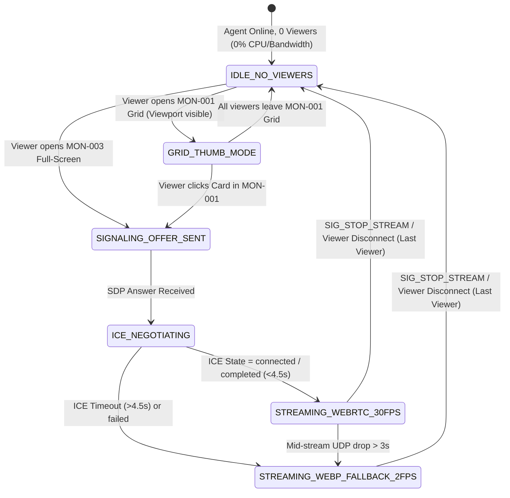

# PHASE 16: LIVE MONITOR GRID, 30-FPS WEBRTC STREAMING, WEBP FALLBACK & OFFICE TV WALLBOARD

**Document ID:** `HYDI-PHASE-16`  
**Version:** `4.0.0-ENTERPRISE`  
**Modules Covered:** `MON-001`, `MON-002`, `MON-003`, `MON-004`, `MON-005`, `MON-006` (Plus `MON-007` Multi-Monitor Live Switching)  
**Core Stack:** Fastify 5 WebSocket Signaling (`@fastify/websocket`) + WebRTC (`coturn` STUN/TURN + SFU/Multi-Peer Fanout) + 2-FPS WebP-over-WSS Fallback + Redis 7.2 Pub/Sub (Cross-Node Signaling & Live Presence State) + MySQL 8.0 InnoDB (Custom Monitor Groups, Favorites, Wallboard Playlists) + ClickHouse 24.x (Live View Session Audit Trail)

---

## 1. Architectural Overview & Dual-Tier Live Streaming Engine

HydiEms separates **Grid Thumbnail Streaming (`MON-001` / `MON-002`)** from **Full-Screen High-Framerate Inspection (`MON-003`)** so a manager viewing 24 employees simultaneously on a grid never saturates corporate WAN bandwidth, while clicking any employee card instantly upgrades that feed to a `30 FPS` `1080p/1440p` hardware-accelerated WebRTC stream.

### 1.1 Two-Tier Streaming & Automatic Fallback Topology

1. **Grid Mode (`MON-001` / `MON-002` / `MON-005` Wallboard):**
   - Only when `>= 1` authorized viewer has an employee card visible in their viewport (`IntersectionObserver`), Fastify subscribes the viewer to Redis channel `live:grid:frame:{tenantId}:{userId}`.
   - The Desktop Agent encodes a lightweight `480×270` WebP frame (`~12–18 KB` at `0.5 FPS` — 1 frame every `2 seconds`) only while viewers are subscribed (`0 FPS` when nobody is watching).
2. **Full-Screen Mode (`MON-003` — Primary Path: 30-FPS WebRTC):**
   - Initiates an encrypted DTLS-SRTP WebRTC peer connection (`H.264` / `VP9` hardware-encoded at `30 FPS`, adaptive bitrate `800 kbps – 3.5 Mbps`) using `coturn` STUN/TURN (`UDP 3478` / `TLS 5349`).
3. **Full-Screen Mode (`MON-003` — Automatic Fallback Path: 2-FPS High-Res WebP over WSS):**
   - If ICE negotiation fails within `4,500ms` (e.g., strict enterprise symmetric NAT or blocked UDP/TURN ports), the client and Desktop Agent **automatically and seamlessly fall back** to streaming `1280×720` delta-compressed WebP frames at `2 FPS` over the existing port `443` WebSocket connection (`WSS`).

```mermaid
sequenceDiagram
    autonumber
    participant Viewer as Manager Browser (MON-003)
    participant Fastify as Fastify WS Signaling Server
    participant Redis as Redis 7 Pub/Sub + Session Store
    participant Agent as Employee Desktop Agent (Rust/WebRTC)
    participant TURN as Coturn STUN/TURN Cluster

    Viewer->>Fastify: 1. WSS: { type: "LIVE_REQUEST_STREAM", targetUserId, monitorIndex: 1, mode: "WEBRTC_30FPS" }
    Fastify->>Fastify: 2. Check RBAC (monitoring:live:stream) + Privacy Policy + Log Audit Start
    Fastify->>Redis: 3. Register Viewer in Set live:viewers:{targetUserId} & Publish to Agent Node
    Redis->>Agent: 4. Deliver 'SIG_START_WEBRTC' { sessionId, viewerId, monitorIndex, turnCredentials }
    Agent->>Agent: 5. Initialize Hardware Encoder (NVENC/VideoToolbox/VAAPI) + RTCPeerConnection
    Agent->>Fastify: 6. WSS: { type: "SIG_SDP_OFFER", sessionId, sdp }
    Fastify-->>Viewer: 7. Forward 'SIG_SDP_OFFER'
    Viewer->>Fastify: 8. WSS: { type: "SIG_SDP_ANSWER", sessionId, sdp }
    Fastify-->>Agent: 9. Forward 'SIG_SDP_ANSWER'
    par ICE Candidate Exchange
        Agent->>Fastify: 10a. { type: "SIG_ICE_CANDIDATE", candidate }
        Viewer->>Fastify: 10b. { type: "SIG_ICE_CANDIDATE", candidate }
    end
    alt WebRTC ICE Connected (< 4.5s)
        Agent-->>TURN: 11a. P2P or TURN Relay 30-FPS Video Stream (DTLS-SRTP)
        TURN-->>Viewer: 11b. Render 30-FPS Stream in <video> element
    else ICE Timeout (> 4.5s) or Strict Firewall
        Viewer->>Fastify: 12a. { type: "SIG_FALLBACK_WEBP_2FPS", sessionId }
        Fastify->>Agent: 12b. Switch Agent to 2-FPS 720p WebP Binary Frames over WSS
        Agent-->>Viewer: 12c. Stream 2-FPS WebP via Redis Pub/Sub -> Fastify WSS -> <canvas>
    end
    Viewer->>Fastify: 13. WSS: { type: "SIG_STOP_STREAM", sessionId } (Or WS Disconnect)
    Fastify->>Redis: 14. Remove Viewer; if Set live:viewers:{targetUserId} is empty, send STOP to Agent
```

### 1.2 Fastify WebSocket Signaling State Machine (`MON-003`)



### 1.3 Multi-Viewer Fanout Design

When multiple managers (e.g., a Team Lead in `MON-003` and an Operations Wallboard in `MON-005`) view the same employee simultaneously:
- **In Grid / Fallback WebP Mode:** The Desktop Agent encodes **once** and publishes binary WebP frames to Fastify, which fans out via Redis Pub/Sub channel `live:frame:{tenantId}:{userId}:{monitorIndex}` to $N$ subscribed WebSocket clients (`1:N` fanout with zero additional load on the employee's PC).
- **In 30-FPS WebRTC Mode:** Up to `2` concurrent viewers use direct/TURN `RTCPeerConnection` tracks from the agent's single hardware encoder pipeline (reusing the same encoded `H.264` NAL units without re-encoding). If $\ge 3$ concurrent viewers request `30-FPS` on the same employee, signaling automatically routes through the optional internal MediaSoup/LiveKit SFU node.

---

## 2. Database Schemas (MySQL 8.0 InnoDB + ClickHouse 24.x + Redis 7)

### 2.1 MySQL 8.0 InnoDB Schema (`MON-005`, `MON-006`)

```sql
-- ============================================================================
-- TABLE 1: live_monitor_groups (MON-006)
-- Custom Monitor Groups created by Managers/Admins (e.g., "Night Shift SOC", "Onboarding Cohort")
-- ============================================================================
CREATE TABLE live_monitor_groups (
    group_id CHAR(36) NOT NULL COMMENT 'UUIDv7',
    tenant_id CHAR(36) NOT NULL,
    owner_user_id CHAR(36) NOT NULL,
    group_name VARCHAR(120) NOT NULL,
    description VARCHAR(500) NULL,
    is_shared_with_org TINYINT(1) NOT NULL DEFAULT 0,
    color_hex CHAR(7) NOT NULL DEFAULT '#3B82F6',
    default_grid_size ENUM('TINY', 'SMALL', 'MEDIUM', 'LARGE') NOT NULL DEFAULT 'MEDIUM',
    sort_order INT UNSIGNED NOT NULL DEFAULT 0,
    created_at DATETIME(3) NOT NULL DEFAULT CURRENT_TIMESTAMP(3),
    updated_at DATETIME(3) NOT NULL DEFAULT CURRENT_TIMESTAMP(3) ON UPDATE CURRENT_TIMESTAMP(3),
    PRIMARY KEY (group_id),
    KEY idx_tenant_owner (tenant_id, owner_user_id, sort_order)
) ENGINE=InnoDB DEFAULT CHARSET=utf8mb4 COLLATE=utf8mb4_unicode_ci;

-- ============================================================================
-- TABLE 2: live_monitor_group_members (MON-006)
-- Maps employees into Custom Monitor Groups
-- ============================================================================
CREATE TABLE live_monitor_group_members (
    group_id CHAR(36) NOT NULL,
    tenant_id CHAR(36) NOT NULL,
    user_id CHAR(36) NOT NULL,
    pinned_monitor_index TINYINT UNSIGNED NOT NULL DEFAULT 1,
    display_order SMALLINT UNSIGNED NOT NULL DEFAULT 0,
    added_at DATETIME(3) NOT NULL DEFAULT CURRENT_TIMESTAMP(3),
    PRIMARY KEY (group_id, user_id),
    CONSTRAINT fk_mon_group_member FOREIGN KEY (group_id) REFERENCES live_monitor_groups (group_id) ON DELETE CASCADE
) ENGINE=InnoDB DEFAULT CHARSET=utf8mb4 COLLATE=utf8mb4_unicode_ci;

-- ============================================================================
-- TABLE 3: live_monitor_favorites (MON-006)
-- Per-manager pinned/favorite employee screens
-- ============================================================================
CREATE TABLE live_monitor_favorites (
    tenant_id CHAR(36) NOT NULL,
    viewer_user_id CHAR(36) NOT NULL,
    target_user_id CHAR(36) NOT NULL,
    preferred_monitor_index TINYINT UNSIGNED NOT NULL DEFAULT 1,
    created_at DATETIME(3) NOT NULL DEFAULT CURRENT_TIMESTAMP(3),
    PRIMARY KEY (tenant_id, viewer_user_id, target_user_id),
    KEY idx_viewer_created (tenant_id, viewer_user_id, created_at DESC)
) ENGINE=InnoDB DEFAULT CHARSET=utf8mb4 COLLATE=utf8mb4_unicode_ci;

-- ============================================================================
-- TABLE 4: office_tv_wallboard_configs (MON-005)
-- Stores Office TV Operations Wallboard presets, rotation intervals & KPI tickers
-- ============================================================================
CREATE TABLE office_tv_wallboard_configs (
    wallboard_id CHAR(36) NOT NULL COMMENT 'UUIDv7',
    tenant_id CHAR(36) NOT NULL,
    wallboard_name VARCHAR(150) NOT NULL COMMENT 'e.g. NOC Floor West 85-inch TV',
    created_by CHAR(36) NOT NULL,
    scope_filter JSON NOT NULL COMMENT '{"departmentIds":[...],"teamIds":[...],"customGroupId":null,"onlyOnline":true}',
    cards_per_page TINYINT UNSIGNED NOT NULL DEFAULT 12 COMMENT '4, 6, 9, 12, 16, or 24 screens per page',
    rotation_interval_seconds SMALLINT UNSIGNED NOT NULL DEFAULT 15 COMMENT 'MON-005: Default 15s auto-rotation',
    theme_mode ENUM('TRUE_DARK_OLED', 'HIGH_CONTRAST_DARK') NOT NULL DEFAULT 'TRUE_DARK_OLED',
    show_kpi_ticker_bottom TINYINT(1) NOT NULL DEFAULT 1,
    show_live_alerts_sidebar TINYINT(1) NOT NULL DEFAULT 1,
    privacy_blur_override ENUM('INHERIT_POLICY', 'FORCE_PARTIAL_BLUR', 'METRICS_ONLY_NO_SCREEN') NOT NULL DEFAULT 'INHERIT_POLICY',
    kiosk_pairing_code CHAR(8) NULL,
    is_active TINYINT(1) NOT NULL DEFAULT 1,
    created_at DATETIME(3) NOT NULL DEFAULT CURRENT_TIMESTAMP(3),
    updated_at DATETIME(3) NOT NULL DEFAULT CURRENT_TIMESTAMP(3) ON UPDATE CURRENT_TIMESTAMP(3),
    PRIMARY KEY (wallboard_id),
    KEY idx_tenant_wallboards (tenant_id, is_active)
) ENGINE=InnoDB DEFAULT CHARSET=utf8mb4 COLLATE=utf8mb4_unicode_ci;
```

### 2.2 ClickHouse 24.x Live Stream Session Audit Table (`AUDIT-002` & `PRIV-003`)

```sql
CREATE TABLE hydi_telemetry.live_stream_audit_sessions (
    tenant_id UUID,
    session_id UUID,
    viewer_user_id UUID,
    viewer_name String,
    viewer_role LowCardinality(String),
    viewer_ip String,
    target_user_id UUID,
    monitor_index UInt8,
    stream_mode LowCardinality(String) COMMENT 'GRID_THUMB_0_5FPS | WEBRTC_30FPS | WEBP_FALLBACK_2FPS | OFFICE_TV_WALLBOARD',
    started_at DateTime64(3, 'UTC'),
    ended_at DateTime64(3, 'UTC'),
    duration_seconds UInt32,
    disconnect_reason LowCardinality(String)
)
ENGINE = MergeTree()
PARTITION BY toYYYYMM(started_at)
ORDER BY (tenant_id, target_user_id, started_at, session_id);
```

---

## 3. Screen-by-Screen UI/UX & Engineering Specifications

### 3.1 `MON-001` — Live Monitor Grid (`Tiny / Small / Medium / Large`)

- **Route:** `/monitoring/live`
- **RBAC Permissions:** `monitoring:live:grid`
- **Top Control Ribbon:**
  - **Live Status Counter Pills:** `🟢 Active Now (184)` | `🟡 Idle (23)` | `🟣 In Meeting / Call (19)` | `⚪ Away / Break (14)` | `⚫ Offline (42)`.
  - **4-Size Grid Density Switcher:**
    - `Tiny` (`8 columns`, compact status + live mini-canvas `180×101px`)
    - `Small` (`6 columns`, `240×135px` canvas)
    - `Medium` (Default — `4 columns`, `360×202px` canvas with full active App/URL/Task footer)
    - `Large` (`2 columns`, `640×360px` high-clarity inspection canvas)
  - **Quick Group & Favorite Filter Tabs (`MON-006`):** `All Employees` | `⭐ Favorites (12)` | Custom Group tabs (`Night Shift SOC`, `Tier-1 Support`, `+ New Group`).
- **Viewport-Aware Bandwidth Optimization:**
  - Uses browser `IntersectionObserver` with `rootMargin: '200px'` so only the `8–24` cards currently visible on screen actively receive `0.5 FPS` WebP frames; off-screen cards pause frame delivery immediately.

### 3.2 `MON-002` — Employee Live Screen Card

Each card in `MON-001` renders a self-contained real-time telemetry HUD:
- **Card Header:**
  - Live Presence Dot (`🟢 Active`, `🟡 Idle 4m`, `🔴 High-Risk Alert`) + Employee Avatar, Full Name, Department Badge.
  - **Favorite Star Toggle (`⭐` `MON-006`)** and **Multi-Monitor Switcher Pill (`M1` | `M2` | `M3` `MON-007`)**.
- **Card Body (Live Screen Surface):**
  - Renders the live `0.5 FPS` WebP stream onto an HTML5 `<canvas>` with hardware-accelerated cross-fade transitions.
  - Shows a subtle `"LIVE"` pulse badge in the top-right corner and current FPS/latency tooltip (`0.5 FPS Grid Mode • Click for 30 FPS`).
- **Card Footer (4 Live Telemetry Rows):**
  1. **Active Application & Window Title:** App icon + process (`code.exe`) + live window title + Productivity Badge (`Productive` / `Non-Productive` / `Neutral`).
  2. **Active Website / Domain:** Favicon + domain (`github.com/hydiems/...`) if foreground app is a browser.
  3. **Active Project & Task:** `📁 HydiEms v4.0 -> ✔️ Phase 16 WebRTC Engine` + live task timer (`02:14:38`).
  4. **Quick Action Hover Strip:** `🔍 Expand 30-FPS Live (`MON-003`)`, `📸 Capture Screenshot Now (`SS-006`)`, `🎥 Start On-Demand Recording (`REC-006`)`.

### 3.3 `MON-003` — Full-Screen 30-FPS WebRTC Live Stream Modal / Theater View

- **Route:** `/monitoring/live/:userId` (or Theater Overlay from `MON-001`)
- **RBAC Permissions:** `monitoring:live:stream`
- **Theater Viewport & Controls:**
  - **Transport & Quality Status Pill:** Displays live connection telemetry:
    - `🟢 WebRTC P2P • 1080p @ 30 FPS • 28ms RTT • 1.4 Mbps`
    - Or if UDP is blocked: `🟡 WSS WebP Fallback • 720p @ 2 FPS • Port 443 Tunnel`
  - **Multi-Monitor Selector Bar (`MON-007`):** Switch instantly between `Monitor 1 (2560×1440 - Focused ⚡)`, `Monitor 2 (1920×1080)`, `Monitor 3`, or `All Monitors Panoramic`. Switching monitor sends `{ type: "SIG_SWITCH_MONITOR", monitorIndex: 2 }` over the existing WebRTC data channel without tearing down the ICE session (`<150ms` switch time!).
  - **Live Action Toolbar:**
    - `📸 Instant Snapshot (SS-006)`
    - `🔴 Start Recording Clip (REC-006)`
    - `⏸️ Pause / Freeze Frame` (Allows manager to inspect fine text on a frozen frame)
    - `⛶ True Fullscreen (F11)`
  - **Right Live Telemetry Drawer (Collapsible):**
    - Real-time scrolling feed of window/tab switches as they happen (`14:32:01 -> Switched to Chrome: AWS Console`).
    - Today's 6-Way Productivity Split (`PROD-008`) and Efficiency Score (`PROD-010`).

### 3.4 `MON-004` — Real-Time Monitoring Search & Instant Filter

- **Integrated Omnibar (`Ctrl+K` / `/` inside Live Monitor):**
  - Instantly filters live screens across 6 dimensions in `< 50ms`:
    1. **Employee Name / Email / ID**
    2. **Currently Active Application** (e.g., typing `figma` or `youtube` shows every employee with Figma or YouTube open on screen *right now*!)
    3. **Currently Active Window Title or URL Substring** (e.g., typing `prod-db` or `chatgpt.com`)
    4. **Active Project or Task Name**
    5. **Department / Team / Location**
    6. **Live Activity State** (`Active`, `Idle > 5m`, `Non-Productive App Open`, `Unapproved App Open`).

### 3.5 `MON-005` — Office TV Full-Screen Operations Wallboard

- **Route:** `/monitoring/wallboard/:wallboardId`
- **RBAC Permissions:** `monitoring:wallboard:view`, `monitoring:wallboard:manage`
- **Engineered for 24/7 55"–98" 4K Command Center / NOC Displays:**
  - **True Dark OLED Theme (`#090D16` background):** Prevents burn-in with subtle pixel-shift protection and high-contrast status borders (`Emerald` border for Productive Active, `Amber` border for Idle, `Crimson` border for Non-Productive/Alert).
  - **Auto-Rotation Carousel Engine (Default `15s`):**
    - Smoothly cycles pages of `4 / 6 / 9 / 12 / 16 / 24` live screens every `15 seconds` (configurable `5s–120s`).
    - Includes a visual countdown progress ring (`15s -> 0s`), `Pause Rotation` toggle, and page indicator dots (`Page 2 of 6 • Showing 12 of 68 Active Engineers`).
    - Pre-fetches the next page's employee thumbnails `2 seconds` before page transition so rotation has zero blank frames.
  - **Bottom Live KPI Ticker & Alert Marquee:**
    - Displays real-time organizational metrics: `🟢 Online: 184/210 (87.6%)` | `⚡ Org Productivity Today: 81.4%` | `🎯 Target Achievement: 99.1%` | `⏱️ Active Project Hours: 1,142h` | `🔔 Latest Alert: None`.

### 3.6 `MON-006` — Favorite Screens & Custom Monitor Groups

- **Features:**
  - **1-Click Star (`⭐`):** Any manager can star/unstar employees on `MON-002` to pin them to their personal `Favorites` tab.
  - **Custom Monitor Group Builder Modal:**
    - Create named groups (e.g., `"Escalation SWAT Team"`, `"New Hires - Week 1"`, `"Finance Month-End Close"`).
    - Add members individually or by Department/Role, set per-member default monitor (`Monitor 1` vs `Monitor 2`), and optionally share the group with other managers (`is_shared_with_org = 1`).

---

## 4. Fastify REST & WebSocket API Specifications

### 4.1 WebSocket Endpoint: `WSS /ws/v1/live-monitor`

- **Client-to-Server Messages:**
```typescript
type ClientLiveMonitorMessage =
  | { type: 'SUBSCRIBE_GRID_VIEWPORT'; userIds: string[]; monitorIndex?: number }
  | { type: 'UNSUBSCRIBE_GRID_VIEWPORT'; userIds: string[] }
  | { type: 'LIVE_REQUEST_STREAM'; targetUserId: string; monitorIndex: number; preferredMode: 'WEBRTC_30FPS' | 'WEBP_2FPS' }
  | { type: 'SIG_SDP_ANSWER'; sessionId: string; sdp: string }
  | { type: 'SIG_ICE_CANDIDATE'; sessionId: string; candidate: RTCIceCandidateInit }
  | { type: 'SIG_SWITCH_MONITOR'; sessionId: string; monitorIndex: number }
  | { type: 'SIG_FALLBACK_WEBP_2FPS'; sessionId: string; reason: string }
  | { type: 'SIG_STOP_STREAM'; sessionId: string };
```

- **Server-to-Client Messages:**
```typescript
type ServerLiveMonitorMessage =
  | { type: 'GRID_TELEMETRY_DELTA'; userId: string; status: string; activeApp: string; activeTitle: string; activeUrl: string | null; classification: string; projectId: string | null; taskName: string | null }
  | { type: 'GRID_FRAME_WEBP'; userId: string; monitorIndex: number; capturedAtMs: number; base64OrBinaryFrame: ArrayBuffer }
  | { type: 'SIG_SDP_OFFER'; sessionId: string; targetUserId: string; sdp: string; iceServers: RTCIceServer[] }
  | { type: 'SIG_ICE_CANDIDATE'; sessionId: string; candidate: RTCIceCandidateInit }
  | { type: 'STREAM_STATE_CHANGED'; sessionId: string; mode: 'WEBRTC_30FPS' | 'WEBP_FALLBACK_2FPS'; fps: number };
```

### 4.2 REST Endpoints for Groups, Favorites & Wallboards

- `GET /api/v1/monitoring/live/roster`: Returns all visible employees within caller's RBAC scope with their real-time status from Redis (`active_app`, `active_title`, `active_url`, `classification`, `monitor_count`, `is_favorite`).
- `POST /api/v1/monitoring/live/favorites/:targetUserId` / `DELETE /api/v1/monitoring/live/favorites/:targetUserId` (`MON-006`).
- `GET /api/v1/monitoring/live/groups` / `POST /api/v1/monitoring/live/groups` / `PUT /api/v1/monitoring/live/groups/:groupId` (`MON-006`).
- `GET /api/v1/monitoring/wallboards` / `POST /api/v1/monitoring/wallboards` (`MON-005`).

---

## 5. Acceptance Criteria & Verification Suite

1. **AC-MON-01 (Zero-Overhead Idle Agent):** When `0` managers are viewing an employee in `MON-001`, `MON-003`, or `MON-005`, the Desktop Agent MUST capture `0` live-stream frames and consume `0 KB/s` of live-stream upload bandwidth.
2. **AC-MON-02 (30-FPS WebRTC to 2-FPS WebP Automatic Failover):** If UDP ports `3478` and `49152–65535` are blocked by a simulated firewall during `MON-003` connection setup, the viewer UI MUST automatically fall back to `2-FPS WebP over WSS` within `5,000ms` without user intervention and display the `WSS WebP Fallback` indicator badge.
3. **AC-MON-03 (Office TV 15s Seamless Rotation):** In `MON-005`, with `36` active employees and `12 cards per page`, the wallboard MUST rotate through Pages `1 -> 2 -> 3 -> 1` every `15.0 seconds`, pre-loading the incoming page's thumbnails `2 seconds` prior to transition so no blank placeholder cards flash on the TV.
4. **AC-MON-04 (Complete Live Viewing Audit Trail):** Every `MON-003` full-screen live stream session MUST record start time, end time, duration, viewer identity, and stream mode (`WEBRTC_30FPS` vs `WEBP_FALLBACK_2FPS`) in `hydi_telemetry.live_stream_audit_sessions`, visible in `AUDIT-002` and `PRIV-003`.
