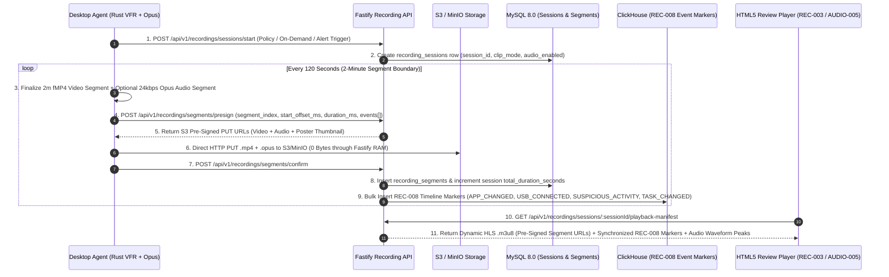

# PHASE 17: SCREEN RECORDING, SEGMENTED CLIPS, SYNCHRONIZED TIMELINE MARKERS & COMPLIANT AUDIO TRACKING

**Document ID:** `HYDI-PHASE-17`  
**Version:** `4.0.0-ENTERPRISE`  
**Modules Covered:** `REC-001`, `REC-002`, `REC-003`, `REC-004`, `REC-005`, `REC-006`, `REC-007`, `REC-008`, `AUDIO-001`, `AUDIO-002`, `AUDIO-003`, `AUDIO-004`, `AUDIO-005`  
**Core Stack:** Fastify 5 (TypeScript) + S3 / MinIO Multipart & HLS/fMP4 Object Storage + Rust Desktop Encoder (`H.264`/`AV1` fMP4 video + `libopus` `24 kbps` VoIP audio) + MySQL 8.0 InnoDB (Recording Sessions, Segments, Policies, Consent Ledger, Investigation Locks) + ClickHouse 24.x (Synchronized Sub-Second Timeline Markers `REC-008` & Access Audit Trail)

---

## 1. Architectural Overview & Ultra-Low-Bitrate Segmented Recording Pipeline

Continuous shift screen recording and optional call/compliance audio capture require careful codec and chunking architecture so endpoints experience `< 1.5%` CPU impact and storage costs remain ultra-low:

1. **Variable Frame Rate (VFR) Screen Encoding (`REC-005`):**
   - The Rust Desktop Agent encodes screen video into **2-minute fragmented MP4 (`.m4s` / `.mp4`) segments** (`120 seconds` each) using hardware-accelerated `H.264` (or `AV1` where supported) at `2–5 FPS` VFR (`crf=30`, keyframe interval `4s`).
   - Static screens (e.g., reading code or a document without scrolling) drop to `0.5 FPS` automatically via B-frame/P-frame zero-motion skip, compressing an entire 8-hour shift (`4 × 240m`) into **`~95 MB – 160 MB`** of S3 storage (`~380 KB` per 2-minute segment during light activity, `~1.8 MB` during active scrolling/video).
2. **Opus 24 kbps Dual-Channel Audio Encoding (`AUDIO-002`):**
   - When explicitly enabled by a compliant `AUDIO-003` policy and user consent is verified, the agent captures **Microphone Input (Channel L / Track 1)** and/or **System Audio Loopback WASAPI/CoreAudio (Channel R / Track 2)**, applies WebRTC Voice Activity Detection (VAD) + Noise Suppression (`RNNoise`), and encodes to **Opus at `24 kbps` (`16 kHz` wideband VoIP profile)** — consuming only **`10.8 MB per hour`** of active speech (`0 KB/s` during silence when VAD gating is enabled).
3. **Zero-Proxy S3 Pre-Signed Segment Upload:**
   - Every 2-minute video segment (`.mp4`) and audio segment (`.opus` / `.webm`) is uploaded directly from the Desktop Agent to S3/MinIO via Pre-Signed `PUT` URLs, accompanied by an HLS/DASH dynamic `.m3u8` playlist generated on the fly by Fastify so `REC-003` and `AUDIO-005` can scrub across an 8-hour shift with `< 300ms` seek latency.



---

## 2. Database Schemas (MySQL 8.0 InnoDB + ClickHouse 24.x)

### 2.1 MySQL 8.0 InnoDB Schema

```sql
-- ============================================================================
-- TABLE 1: screen_recording_policies (REC-004, REC-005)
-- Configures trigger mode, clip granularity, FPS, resolution, and exclusions
-- ============================================================================
CREATE TABLE screen_recording_policies (
    policy_id CHAR(36) NOT NULL COMMENT 'UUIDv7',
    tenant_id CHAR(36) NOT NULL,
    scope_type ENUM('GLOBAL', 'DEPARTMENT', 'TEAM', 'ROLE', 'USER') NOT NULL,
    scope_target_id CHAR(36) NOT NULL DEFAULT '00000000-0000-0000-0000-000000000000',
    is_recording_enabled TINYINT(1) NOT NULL DEFAULT 0,
    recording_trigger_mode ENUM('CONTINUOUS_FULL_SHIFT', 'EVENT_AND_ALERT_TRIGGERED_ONLY', 'ON_DEMAND_ONLY', 'HIGH_RISK_APPS_ONLY') NOT NULL DEFAULT 'EVENT_AND_ALERT_TRIGGERED_ONLY',
    clip_packaging_mode ENUM('FULL_SHIFT_STREAM', 'SHORT_CLIPS_2MIN', 'CUSTOM_DURATION_CLIPS') NOT NULL DEFAULT 'SHORT_CLIPS_2MIN' COMMENT 'REC-005',
    custom_clip_duration_seconds SMALLINT UNSIGNED NOT NULL DEFAULT 120 COMMENT 'Used when clip_packaging_mode = CUSTOM_DURATION_CLIPS (30..1800s)',
    target_fps TINYINT UNSIGNED NOT NULL DEFAULT 3 COMMENT '1, 2, 3, 5, 10, or 15 FPS VFR',
    max_resolution_height SMALLINT UNSIGNED NOT NULL DEFAULT 1080 COMMENT '720 or 1080',
    record_only_working_hours TINYINT(1) NOT NULL DEFAULT 1,
    pause_on_idle TINYINT(1) NOT NULL DEFAULT 1,
    pause_on_excluded_apps JSON NOT NULL COMMENT 'e.g. ["1password.exe","keepassxc.exe"]',
    pause_on_excluded_urls JSON NOT NULL COMMENT 'e.g. ["*://*.chase.com/*"]',
    retention_days SMALLINT UNSIGNED NOT NULL DEFAULT 30,
    updated_by CHAR(36) NOT NULL,
    updated_at DATETIME(3) NOT NULL DEFAULT CURRENT_TIMESTAMP(3) ON UPDATE CURRENT_TIMESTAMP(3),
    PRIMARY KEY (policy_id),
    UNIQUE KEY uq_tenant_rec_scope (tenant_id, scope_type, scope_target_id)
) ENGINE=InnoDB DEFAULT CHARSET=utf8mb4 COLLATE=utf8mb4_unicode_ci;

-- ============================================================================
-- TABLE 2: audio_recording_policies (AUDIO-003)
-- Strict legal/compliance controls: Consent, Desktop Notification, Working Hours, Role Restrictions
-- ============================================================================
CREATE TABLE audio_recording_policies (
    audio_policy_id CHAR(36) NOT NULL COMMENT 'UUIDv7',
    tenant_id CHAR(36) NOT NULL,
    scope_type ENUM('GLOBAL', 'DEPARTMENT', 'TEAM', 'ROLE', 'USER') NOT NULL,
    scope_target_id CHAR(36) NOT NULL DEFAULT '00000000-0000-0000-0000-000000000000',
    is_audio_enabled TINYINT(1) NOT NULL DEFAULT 0 COMMENT 'Disabled by default; requires explicit compliance activation',
    capture_channels ENUM('MIC_ONLY', 'SYSTEM_LOOPBACK_ONLY', 'DUAL_MIC_AND_SYSTEM_LOOPBACK') NOT NULL DEFAULT 'DUAL_MIC_AND_SYSTEM_LOOPBACK' COMMENT 'AUDIO-002',
    codec_profile ENUM('OPUS_24KBPS_VOIP', 'OPUS_32KBPS_WIDEBAND') NOT NULL DEFAULT 'OPUS_24KBPS_VOIP',
    vad_silence_skip_enabled TINYINT(1) NOT NULL DEFAULT 1 COMMENT 'Skip encoding silent intervals to save storage & protect non-call privacy',
    trigger_mode ENUM('VOIP_CALL_DETECTED_ONLY', 'ON_DEMAND_WITH_PROMPT', 'SCHEDULED_SHIFT_HOURS') NOT NULL DEFAULT 'VOIP_CALL_DETECTED_ONLY',
    require_explicit_employee_consent TINYINT(1) NOT NULL DEFAULT 1 COMMENT 'AUDIO-003: Agent will NOT record audio until employee signs digital consent',
    show_persistent_recording_indicator TINYINT(1) NOT NULL DEFAULT 1 COMMENT 'AUDIO-003: Mandatory OS tray/top-bar red mic indicator while active',
    strict_working_hours_only TINYINT(1) NOT NULL DEFAULT 1 COMMENT 'AUDIO-003: Hard cutoff outside assigned shift hours',
    allowed_reviewer_role_ids JSON NOT NULL COMMENT 'AUDIO-003: Strict list of Role UUIDs allowed to listen to audio',
    require_dual_authorization_to_play TINYINT(1) NOT NULL DEFAULT 0 COMMENT 'Optional two-person compliance rule for playback',
    retention_days SMALLINT UNSIGNED NOT NULL DEFAULT 30,
    updated_by CHAR(36) NOT NULL,
    updated_at DATETIME(3) NOT NULL DEFAULT CURRENT_TIMESTAMP(3) ON UPDATE CURRENT_TIMESTAMP(3),
    PRIMARY KEY (audio_policy_id),
    UNIQUE KEY uq_tenant_audio_scope (tenant_id, scope_type, scope_target_id)
) ENGINE=InnoDB DEFAULT CHARSET=utf8mb4 COLLATE=utf8mb4_unicode_ci;

-- ============================================================================
-- TABLE 3: employee_audio_consent_ledger (AUDIO-003)
-- Cryptographically signed record of employee audio recording consent
-- ============================================================================
CREATE TABLE employee_audio_consent_ledger (
    consent_id CHAR(36) NOT NULL COMMENT 'UUIDv7',
    tenant_id CHAR(36) NOT NULL,
    user_id CHAR(36) NOT NULL,
    audio_policy_id CHAR(36) NOT NULL,
    consent_status ENUM('GRANTED', 'DECLINED', 'REVOKED') NOT NULL,
    consent_document_version VARCHAR(32) NOT NULL DEFAULT 'v1.0',
    consent_text_sha256 CHAR(64) NOT NULL,
    device_id CHAR(36) NOT NULL,
    ip_address VARCHAR(45) NOT NULL,
    responded_at DATETIME(3) NOT NULL DEFAULT CURRENT_TIMESTAMP(3),
    PRIMARY KEY (consent_id),
    KEY idx_tenant_user_consent (tenant_id, user_id, responded_at DESC)
) ENGINE=InnoDB DEFAULT CHARSET=utf8mb4 COLLATE=utf8mb4_unicode_ci;

-- ============================================================================
-- TABLE 4: recording_sessions (REC-001, REC-002, REC-005, REC-006, REC-007, AUDIO-001, AUDIO-004)
-- Master record for a Screen and/or Audio Recording Session or Short Clip
-- ============================================================================
CREATE TABLE recording_sessions (
    session_id CHAR(36) NOT NULL COMMENT 'UUIDv7',
    tenant_id CHAR(36) NOT NULL,
    user_id CHAR(36) NOT NULL,
    department_id CHAR(36) NOT NULL,
    team_id CHAR(36) NOT NULL,
    device_id CHAR(36) NOT NULL,
    project_id CHAR(36) NULL,
    task_id CHAR(36) NULL,
    linked_alert_id CHAR(36) NULL COMMENT 'REC-007: Populated if recording was triggered by DLP/Security Alert',
    linked_incident_id CHAR(36) NULL COMMENT 'REC-007: Populated if linked to an investigation incident',
    recording_date DATE NOT NULL,
    started_at_utc DATETIME(3) NOT NULL,
    ended_at_utc DATETIME(3) NULL,
    duration_seconds INT UNSIGNED NOT NULL DEFAULT 0,
    clip_type ENUM('FULL_SHIFT', 'SHORT_CLIP_2MIN', 'CUSTOM_RANGE_CLIP', 'ON_DEMAND_CLIP', 'ALERT_EVIDENCE_CLIP') NOT NULL DEFAULT 'SHORT_CLIP_2MIN' COMMENT 'REC-005 / REC-006',
    trigger_source ENUM('POLICY_SCHEDULED', 'MANUAL_ON_DEMAND', 'SECURITY_ALERT_RULE', 'VOIP_CALL_DETECTED') NOT NULL,
    triggered_by_user_id CHAR(36) NULL COMMENT 'Populated for REC-006 On-Demand Start/Stop',
    monitor_index TINYINT UNSIGNED NOT NULL DEFAULT 1,
    has_video_track TINYINT(1) NOT NULL DEFAULT 1,
    has_audio_track TINYINT(1) NOT NULL DEFAULT 0 COMMENT 'AUDIO-002 / AUDIO-005',
    audio_channels_recorded ENUM('NONE', 'MIC_ONLY', 'SYSTEM_ONLY', 'DUAL_MIC_SYSTEM') NOT NULL DEFAULT 'NONE',
    audio_speech_ratio_pct DECIMAL(5,2) NOT NULL DEFAULT 0.00 COMMENT '% of clip containing active voice via VAD',
    segments_count SMALLINT UNSIGNED NOT NULL DEFAULT 0,
    total_video_bytes BIGINT UNSIGNED NOT NULL DEFAULT 0,
    total_audio_bytes BIGINT UNSIGNED NOT NULL DEFAULT 0,
    top_applications_json JSON NULL COMMENT 'e.g. ["code.exe","chrome.exe","slack.exe"] for REC-007 fast search',
    markers_summary_json JSON NULL COMMENT 'Counts by marker_type: {"APP_CHANGED":14,"USB_CONNECTED":1,"SUSPICIOUS_ACTIVITY":2,"TASK_CHANGED":3}',
    poster_thumb_s3_key VARCHAR(512) NULL,
    session_status ENUM('RECORDING_LIVE', 'FINALIZING', 'AVAILABLE', 'ARCHIVED_LOCKED', 'DELETED') NOT NULL DEFAULT 'RECORDING_LIVE',
    is_locked_for_investigation TINYINT(1) NOT NULL DEFAULT 0,
    retention_expires_at DATETIME(3) NOT NULL,
    created_at DATETIME(3) NOT NULL DEFAULT CURRENT_TIMESTAMP(3),
    PRIMARY KEY (session_id, recording_date),
    KEY idx_tenant_date_user (tenant_id, recording_date, user_id, started_at_utc DESC),
    KEY idx_tenant_audio (tenant_id, has_audio_track, recording_date, started_at_utc DESC),
    KEY idx_tenant_alert_incident (tenant_id, linked_alert_id, linked_incident_id)
) ENGINE=InnoDB DEFAULT CHARSET=utf8mb4 COLLATE=utf8mb4_unicode_ci;

-- ============================================================================
-- TABLE 5: recording_segments (REC-003, REC-005, AUDIO-002, AUDIO-005)
-- Individual 2-minute fMP4 video chunks and 24kbps Opus audio chunks in S3/MinIO
-- ============================================================================
CREATE TABLE recording_segments (
    segment_id BIGINT UNSIGNED NOT NULL AUTO_INCREMENT,
    tenant_id CHAR(36) NOT NULL,
    session_id CHAR(36) NOT NULL,
    recording_date DATE NOT NULL,
    segment_index SMALLINT UNSIGNED NOT NULL COMMENT '0, 1, 2, ... within session',
    start_offset_ms INT UNSIGNED NOT NULL COMMENT 'Offset from session started_at_utc in milliseconds',
    duration_ms INT UNSIGNED NOT NULL DEFAULT 120000 COMMENT 'Typically 120000ms (2 minutes)',
    video_s3_key VARCHAR(512) NULL,
    video_size_bytes INT UNSIGNED NOT NULL DEFAULT 0,
    video_sha256 CHAR(64) NULL,
    audio_s3_key VARCHAR(512) NULL COMMENT 'Opus 24kbps segment key if has_audio_track = 1',
    audio_size_bytes INT UNSIGNED NOT NULL DEFAULT 0,
    audio_waveform_peaks_json JSON NULL COMMENT 'Normalized 120-point amplitude array [0..100] for AUDIO-005 scrubber',
    created_at DATETIME(3) NOT NULL DEFAULT CURRENT_TIMESTAMP(3),
    PRIMARY KEY (segment_id),
    UNIQUE KEY uq_session_segment_idx (session_id, recording_date, segment_index)
) ENGINE=InnoDB DEFAULT CHARSET=utf8mb4 COLLATE=utf8mb4_unicode_ci;
```

### 2.2 ClickHouse 24.x Synchronized Timeline Event Markers (`REC-008` & `REC-007`)

```sql
CREATE TABLE hydi_telemetry.recording_timeline_markers (
    tenant_id UUID,
    marker_id UUID,
    session_id UUID,
    user_id UUID,
    recording_date Date,
    occurred_at_utc DateTime64(3, 'UTC'),
    offset_ms UInt32 COMMENT 'Exact millisecond offset into the recording session for 1-click scrubber jump',
    marker_type LowCardinality(String) COMMENT 'APP_CHANGED | USB_CONNECTED | SUSPICIOUS_ACTIVITY | TASK_CHANGED | CLIPBOARD_SENSITIVE | FILE_UPLOAD | MANUAL_BOOKMARK',
    severity LowCardinality(String) COMMENT 'INFO | WARNING | CRITICAL',
    title String COMMENT 'e.g. USB Storage Connected: SanDisk Ultra 64GB',
    process_name LowCardinality(String),
    window_title String,
    project_id Nullable(UUID),
    task_id Nullable(UUID),
    metadata_json String
)
ENGINE = MergeTree()
PARTITION BY toYYYYMM(recording_date)
ORDER BY (tenant_id, session_id, offset_ms, marker_id);
```

---

## 3. Screen-by-Screen UI/UX & Engineering Specifications

### 3.1 `REC-001` — Screen Recording Analytics Dashboard

- **Route:** `/monitoring/recordings/dashboard`
- **RBAC Permissions:** `recordings:dashboard:read`
- **KPI Summary Strip:**
  1. **Total Recorded Hours (Period):** `1,420.5 hrs` (`42,615 2-min clips`).
  2. **Currently Recording Live (`REC-006`):** `28 active sessions` (with 1-click jump to live status).
  3. **Recordings with Suspicious Event Markers (`REC-008`):** `34 clips` containing `USB_CONNECTED` or `SUSPICIOUS_ACTIVITY` markers.
  4. **Locked Evidence Clips:** `14 clips` under legal/HR hold.
  5. **S3 Storage Footprint & Compression Ratio:** `24.8 GB` (`Avg 17.4 MB / recorded hour`).
- **Visualizations:**
  - Daily Recording Volume by Trigger Source (`Scheduled Policy`, `Security Alert Rule`, `On-Demand Start`).
  - Timeline Marker Frequency Breakdown (`App Changed`, `Task Changed`, `USB Connected`, `Suspicious Activity`).

### 3.2 `REC-002` — Recording Library & Clip Browser

- **Route:** `/monitoring/recordings/library`
- **RBAC Permissions:** `recordings:library:read`
- **UI Components:**
  - **View Switcher:** `Card Grid View` (with animated scrub-on-hover preview) vs. `Compact Forensic Table View`.
  - **Clip Packaging Filter (`REC-005`):** Toggle between `All Clips`, `Full Shift Streams`, `2-Minute Short Clips`, `On-Demand Captures`, and `Alert-Triggered Evidence`.
  - **Card Details:** Poster thumbnail, Duration badge (`02:00` or `07:42:18`), Employee Name & Dept, Trigger Badge, Audio Track Indicator (`🎙️ Dual Audio`), and mini colored marker dots along the bottom edge showing `REC-008` events inside that clip.

### 3.3 `REC-003` — HTML5 Video Player with `1x/2x/4x` Speed, Timeline Scrubber & Metadata

- **Route:** `/monitoring/recordings/player/:sessionId` (or Theater Modal)
- **RBAC Permissions:** `recordings:player:stream` (Logs `RECORDING_PLAYBACK_STARTED` to `AUDIT-002` & `PRIV-003`).
- **Player Capabilities:**
  - **HLS / fMP4 Adaptive Playback Engine (`hls.js` + Native MSE):** Seamlessly stitches `recording_segments` so a multi-hour shift plays continuously or seeks to any second in `< 300ms`.
  - **Playback Speed Controls:** `0.5x`, `1x`, `1.5x`, `2x`, `4x`, and `8x Fast-Scan` + Frame-by-Frame step buttons (`-1 Frame`, `+1 Frame`).
  - **Multi-Track Synchronized Timeline Scrubber (`REC-008`):**
    - Track 1: **Video Progress & Buffered Bar** with hover thumbnail preview tooltip.
    - Track 2: **Synchronized Event Markers (`REC-008`):**
      - 🔵 `App Changed` (`APP_CHANGED` — e.g., switched from `VS Code` to `Chrome`)
      - 🟣 `Task Changed` (`TASK_CHANGED` — e.g., switched task to `API Integration`)
      - 🟠 `USB Connected` (`USB_CONNECTED` — e.g., external thumb drive mounted)
      - 🔴 `Suspicious Activity` (`SUSPICIOUS_ACTIVITY` — e.g., mass file archive, sensitive regex match, blocked app attempt)
    - Clicking any marker pin on Track 2 or in the Right Marker Feed **instantly seeks the video to `marker.offset_ms - 2000ms`** (`2 seconds` before the event occurred!).
  - **Custom Range Clip Extractor (`REC-005`):** Set `In-Point [` and `Out-Point ]` handles on the scrubber to export or save a standalone sub-clip (e.g., `14:12:05 – 14:14:30`) as locked investigation evidence.

### 3.4 `REC-004` & `REC-005` — Recording Policy & Clip Packaging Configuration

- **Route:** `/settings/monitoring/recording-policies`
- **RBAC Permissions:** `recordings:policy:manage`
- **Controls:**
  - **Clip Granularity Mode (`REC-005`):**
    1. `Full Shift Continuous Stream`: Stitches the entire workday into one logical session per shift with 2-minute internal HLS chunks.
    2. `2-Minute Short Clips`: Exposes discrete, standalone `02:00` clips for rapid micro-review and alert attachment.
    3. `Custom Range Clips`: Configurable `30s` to `30m` clip windows around specific triggers (e.g., `60s pre-buffer + 120s post-trigger` when a DLP alert fires).

### 3.5 `REC-006` — On-Demand Start / Stop Recording

- **Trigger Points:** Available on `MON-002` (Live Card), `MON-003` (Full-Screen Live Stream), and `REC-002` (Library Header).
- **RBAC Permission:** `recordings:on_demand:control`
- **State Machine & Safeguards:**
  - Manager clicks **"🔴 Start On-Demand Recording"** on an online employee, selecting `Max Duration Cap` (`5 mins`, `15 mins`, `30 mins`, `60 mins` — prevents forgotten infinite recordings) and `Include Audio (if permitted by AUDIO-003)`.
  - Fastify sends WebSocket command `cmd:recording:start_on_demand` to the Desktop Agent, which begins streaming 2-minute segments immediately and updates the manager's UI with a live elapsed timer (`🔴 REC 01:42`) and a **"⏹️ Stop Recording"** button.

### 3.6 `REC-007` — Multi-Dimensional Forensic Recording Search

- **Route:** `/monitoring/recordings/search`
- **Search Filters (Queries MySQL `recording_sessions` + ClickHouse `recording_timeline_markers`):**
  - Filter by `Employee`, `Department / Team`, `Date & Time Range`, `Project`, `Task`, `Application Used Inside Clip` (`process_name`), `Window Title / URL Keyword Inside Clip`, `Linked Alert ID`, `Linked Incident ID`, and `Specific Marker Type Present` (e.g., *"Show all recordings in the last 30 days where a USB drive was connected"*).

### 3.7 `AUDIO-001` to `AUDIO-005` — Compliant Audio Tracking & Synchronized Review Suite

- **`AUDIO-001` (Audio Analytics Dashboard — `/monitoring/audio/dashboard`):**
  - Displays Total Recorded Audio Hours, Active VoIP Call Hours vs. Silence Skipped by VAD (`% storage saved`), Consent Coverage Status (`Granted` vs. `Pending/Declined`), and Department Call Volume trends.
- **`AUDIO-002` (Mic & System Loopback Opus 24kbps Engine):**
  - Captures crystal-clear voice audio at `24 kbps` Opus (`~10.8 MB/hr`), supporting separate gain-normalized `Microphone` (employee voice) and `System Audio Loopback` (remote customer/meeting participants) tracks so reviewers can mute/solo either side of a customer support call.
- **`AUDIO-003` (Strict Legal & Privacy Audio Policy — `/settings/monitoring/audio-policies`):**
  - Enforces 4 mandatory enterprise compliance guardrails:
    1. **Explicit Digital Consent Gate:** Desktop Agent refuses to initialize audio capture hardware unless `employee_audio_consent_ledger` has a valid `GRANTED` signature for the user.
    2. **Persistent Desktop Notification / Indicator:** Displays an un-hidable OS tray/menu-bar indicator (`🎙️ HydiEms Compliance Audio Active`) whenever audio capture is running.
    3. **Strict Working Hours Cutoff:** Hardware audio handle is forcibly closed the instant the employee's scheduled shift ends or when the employee pauses/clocks out.
    4. **Role-Restricted Playback (`allowed_reviewer_role_ids`):** Even if a manager has `recordings:player:stream` to watch video in `REC-003`, the audio track is stripped from the playback manifest unless the caller's role is explicitly listed in `allowed_reviewer_role_ids` and possesses `audio:playback:listen`.
- **`AUDIO-004` (Audio Recording Search — `/monitoring/audio/search`):**
  - Search audio sessions by Employee, Date, Call App (`Zoom`, `Teams`, `Slack Huddle`, `RingCentral`, `WebRTC Dialer`), Duration, Speech Activity Ratio (`> 40% speech`), and Linked Alert/QA Scorecard.
- **`AUDIO-005` (Synchronized Audio + Screen Recording Review Player):**
  - Integrated into `REC-003` when an authorized reviewer opens a session with `has_audio_track = 1`:
    - Renders a dual-color **Interactive Audio Waveform Track** (`Cyan` = Employee Mic, `Emerald` = System Loopback) directly beneath the video timeline and `REC-008` event markers.
    - Provides independent **Channel Mixer Controls** (`Mute/Solo Employee Mic`, `Mute/Solo System Audio`, `Volume Boost +6dB`) and `1x / 1.5x / 2x` pitch-corrected WebAudio playback synchronized within `< 15ms` of the screen recording frame.

---

## 4. Fastify REST & WebSocket API Specifications

### 4.1 `POST /api/v1/recordings/on-demand/start` & `/stop` (`REC-006`)

- **Request Body (`/start`):**
```json
{
  "targetUserId": "01926a11-3333-7000-8000-cccccccccccc",
  "monitorIndex": 1,
  "maxDurationSeconds": 900,
  "includeAudio": false,
  "reason": "QA escalation live ticket review"
}
```
- **Validation:** Verifies caller has `recordings:on_demand:control` (and `audio:on_demand:trigger` + active employee consent if `includeAudio: true`). Logs `ON_DEMAND_RECORDING_STARTED` to `AUDIT-002` & `PRIV-003`.

### 4.2 `GET /api/v1/recordings/sessions/:sessionId/playback-manifest` (`REC-003`, `REC-008`, `AUDIO-005`)

- **Purpose:** Returns the signed video/audio segment manifest, all `REC-008` timeline markers from ClickHouse, and waveform peaks.
- **Role-Based Audio Stripping (`AUDIO-003`):** If `session.has_audio_track === 1`, Fastify evaluates whether `req.user` holds `audio:playback:listen` AND belongs to `audio_policy.allowed_reviewer_role_ids`. If not, `audioSegmentUrls` are omitted from the response (`audioRedactedByPolicy: true`), allowing safe video-only review.

---

## 5. Acceptance Criteria & Verification Suite

1. **AC-REC-01 (2-Minute Segment Resilience):** If an employee's workstation loses network connectivity or crashes at minute `37` of a shift recording, all `18` previously completed 2-minute segments (`00:00` to `36:00`) MUST already be safely stored in S3/MinIO and playable in `REC-003`, while segment `19` uploads automatically upon agent reconnect.
2. **AC-REC-02 (`REC-008` Sub-Second Marker Seek):** Clicking a `USB_CONNECTED` or `SUSPICIOUS_ACTIVITY` timeline marker at `offset_ms = 842,500` (`14m 02.5s`) in `REC-003` MUST seek the HTML5 video player to `14m 00.5s` (`offset_ms - 2000ms`) in `< 300ms`.
3. **AC-AUDIO-01 (Hard Consent & Working-Hours Enforcement):** If an admin enables `AUDIO-003` for a department, the Desktop Agent MUST NOT open the OS microphone or loopback audio device for any employee whose `employee_audio_consent_ledger` status is not `GRANTED`, OR when the current local time is outside the employee's scheduled working hours.
4. **AC-AUDIO-02 (Opus 24kbps Storage Efficiency):** A 60-minute continuous dual-channel voice recording encoded with `OPUS_24KBPS_VOIP` MUST consume `<= 11.5 MB` in S3/MinIO and remain frame-synchronized within `< 25ms` drift across the entire 60-minute screen recording in `AUDIO-005`.
