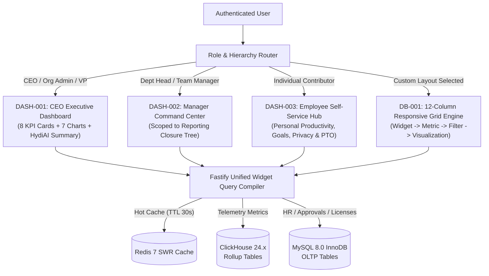
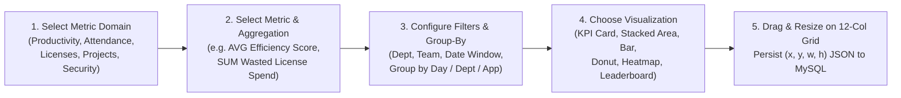

# PHASE 18: CEO / EXECUTIVE DASHBOARD, MANAGER COMMAND CENTER, EMPLOYEE SELF-SERVICE & DRAG-AND-DROP WIDGET BUILDER

**Document ID:** `HYDI-PHASE-18`  
**Version:** `4.0.0-ENTERPRISE`  
**Modules Covered:** `DASH-001`, `DASH-002`, `DASH-003`, `DB-001`  
**Core Stack:** Fastify 5 (TypeScript) + MySQL 8.0 InnoDB (Custom Dashboards, Widget Layouts, Hierarchy Closure Table, Approval Counters) + ClickHouse 24.x (Unified Multi-Metric Query Compiler for `DB-001` & Executive Aggregations) + Redis 7.2 (`30s` SWR Snapshot Cache & HydiAI Executive Briefing Cache)

---

## 1. Architectural Overview & Role-Adaptive Dashboard Engine

HydiEms provides three purpose-built default operational experiences tailored by role (`DASH-001` for C-Suite/VP, `DASH-002` for Department/Team Managers, `DASH-003` for Individual Contributors) alongside a full **Drag-and-Drop Custom Dashboard & Widget Builder (`DB-001`)** powered by a declarative ClickHouse/MySQL Metric Query Compiler.



---

## 2. Database Schemas (MySQL 8.0 InnoDB + ClickHouse 24.x)

### 2.1 MySQL 8.0 InnoDB Schema (`DB-001`, Hierarchy Closure & Executive Briefings)

```sql
-- ============================================================================
-- TABLE 1: org_reporting_hierarchy_closure (DASH-002)
-- Precomputed transitive closure table of manager -> subordinate relationships
-- Enables O(1) indexed lookup of direct + indirect reports at any depth
-- ============================================================================
CREATE TABLE org_reporting_hierarchy_closure (
    tenant_id CHAR(36) NOT NULL,
    ancestor_user_id CHAR(36) NOT NULL COMMENT 'Manager / VP / Director user_id',
    descendant_user_id CHAR(36) NOT NULL COMMENT 'Direct or indirect report user_id',
    depth TINYINT UNSIGNED NOT NULL COMMENT '0 = self, 1 = direct report, 2 = skip-level, etc.',
    department_id CHAR(36) NOT NULL,
    team_id CHAR(36) NOT NULL,
    PRIMARY KEY (tenant_id, ancestor_user_id, descendant_user_id),
    KEY idx_ancestor_depth (tenant_id, ancestor_user_id, depth),
    KEY idx_descendant (tenant_id, descendant_user_id)
) ENGINE=InnoDB DEFAULT CHARSET=utf8mb4 COLLATE=utf8mb4_unicode_ci;

-- ============================================================================
-- TABLE 2: custom_dashboards (DB-001)
-- Stores user-created and org-published custom dashboards
-- ============================================================================
CREATE TABLE custom_dashboards (
    dashboard_id CHAR(36) NOT NULL COMMENT 'UUIDv7',
    tenant_id CHAR(36) NOT NULL,
    owner_user_id CHAR(36) NOT NULL,
    title VARCHAR(150) NOT NULL,
    description VARCHAR(500) NULL,
    icon_name VARCHAR(64) NOT NULL DEFAULT 'LayoutDashboard',
    visibility ENUM('PRIVATE', 'SHARED_WITH_ROLES', 'SHARED_WITH_DEPARTMENTS', 'PUBLIC_ORG') NOT NULL DEFAULT 'PRIVATE',
    shared_target_ids JSON NULL COMMENT 'Array of role_ids or department_ids when shared',
    is_default_for_role_id CHAR(36) NULL,
    global_date_preset VARCHAR(32) NOT NULL DEFAULT 'LAST_30_DAYS',
    auto_refresh_seconds SMALLINT UNSIGNED NOT NULL DEFAULT 60 COMMENT '0 = off, 30, 60, 300',
    grid_columns TINYINT UNSIGNED NOT NULL DEFAULT 12,
    row_height_px SMALLINT UNSIGNED NOT NULL DEFAULT 76,
    version INT UNSIGNED NOT NULL DEFAULT 1,
    created_at DATETIME(3) NOT NULL DEFAULT CURRENT_TIMESTAMP(3),
    updated_at DATETIME(3) NOT NULL DEFAULT CURRENT_TIMESTAMP(3) ON UPDATE CURRENT_TIMESTAMP(3),
    PRIMARY KEY (dashboard_id),
    KEY idx_tenant_owner (tenant_id, owner_user_id),
    KEY idx_tenant_visibility (tenant_id, visibility)
) ENGINE=InnoDB DEFAULT CHARSET=utf8mb4 COLLATE=utf8mb4_unicode_ci;

-- ============================================================================
-- TABLE 3: custom_dashboard_widgets (DB-001)
-- Persists Widget -> Metric -> Filter -> Visualization -> Grid Position (x, y, w, h)
-- ============================================================================
CREATE TABLE custom_dashboard_widgets (
    widget_id CHAR(36) NOT NULL COMMENT 'UUIDv7',
    dashboard_id CHAR(36) NOT NULL,
    tenant_id CHAR(36) NOT NULL,
    widget_title VARCHAR(150) NOT NULL,
    widget_subtitle VARCHAR(255) NULL,
    metric_domain ENUM(
        'PRODUCTIVITY',
        'ATTENDANCE_AND_SHIFTS',
        'PROJECTS_AND_TASKS',
        'SOFTWARE_AND_LICENSES',
        'SCREENSHOTS_AND_RECORDINGS',
        'SECURITY_DLP_ALERTS',
        'WORK_LIFE_BALANCE',
        'PAYROLL_AND_BILLING'
    ) NOT NULL,
    metric_key VARCHAR(100) NOT NULL COMMENT 'Whitelisted metric identifier e.g. PROD_EFFICIENCY_SCORE_AVG, LIC_MONTHLY_WASTED_SPEND',
    aggregation_fn ENUM('SUM', 'AVG', 'COUNT', 'COUNT_DISTINCT', 'MIN', 'MAX', 'P90', 'RATIO_PCT') NOT NULL DEFAULT 'AVG',
    group_by_dimension ENUM('NONE', 'HOUR_OF_DAY', 'DAY', 'WEEK', 'MONTH', 'DEPARTMENT', 'TEAM', 'EMPLOYEE', 'APPLICATION', 'PROJECT', 'CLASSIFICATION') NOT NULL DEFAULT 'DAY',
    secondary_breakdown_dimension ENUM('NONE', 'CLASSIFICATION', 'DEPARTMENT', 'STATUS', 'RISK_LEVEL') NOT NULL DEFAULT 'NONE',
    filter_config JSON NOT NULL COMMENT '{"departmentIds":[],"teamIds":[],"userIds":[],"appIds":[],"classifications":[],"dateOverride":null}',
    visualization_type ENUM(
        'KPI_STAT_CARD',
        'LINE_CHART',
        'AREA_STACKED_CHART',
        'BAR_VERTICAL_CHART',
        'BAR_HORIZONTAL_CHART',
        'DONUT_PIE_CHART',
        'HEATMAP_MATRIX',
        'RADIAL_GAUGE',
        'SCATTER_QUADRANT',
        'DATA_TABLE_LEADERBOARD'
    ) NOT NULL,
    visual_options JSON NOT NULL COMMENT '{"colorPalette":"emerald","showTrendDelta":true,"targetLineValue":85,"limitRows":10}',
    grid_pos_lg JSON NOT NULL COMMENT '12-col desktop layout: {"x":0,"y":0,"w":4,"h":3,"minW":2,"minH":2}',
    grid_pos_md JSON NOT NULL COMMENT '8-col tablet layout: {"x":0,"y":0,"w":4,"h":3}',
    grid_pos_sm JSON NOT NULL COMMENT '4-col mobile layout: {"x":0,"y":0,"w":4,"h":3}',
    created_at DATETIME(3) NOT NULL DEFAULT CURRENT_TIMESTAMP(3),
    updated_at DATETIME(3) NOT NULL DEFAULT CURRENT_TIMESTAMP(3) ON UPDATE CURRENT_TIMESTAMP(3),
    PRIMARY KEY (widget_id),
    KEY idx_dashboard_widgets (dashboard_id),
    CONSTRAINT fk_widget_dashboard FOREIGN KEY (dashboard_id) REFERENCES custom_dashboards (dashboard_id) ON DELETE CASCADE
) ENGINE=InnoDB DEFAULT CHARSET=utf8mb4 COLLATE=utf8mb4_unicode_ci;

-- ============================================================================
-- TABLE 4: executive_ai_briefings (DASH-001)
-- Stores structured HydiAI Executive Summary briefings & anomaly insights
-- ============================================================================
CREATE TABLE executive_ai_briefings (
    briefing_id CHAR(36) NOT NULL COMMENT 'UUIDv7',
    tenant_id CHAR(36) NOT NULL,
    period_start DATE NOT NULL,
    period_end DATE NOT NULL,
    scope_type ENUM('GLOBAL_CEO', 'DEPARTMENT_MANAGER') NOT NULL DEFAULT 'GLOBAL_CEO',
    scope_target_id CHAR(36) NOT NULL DEFAULT '00000000-0000-0000-0000-000000000000',
    headline_summary TEXT NOT NULL,
    key_wins_json JSON NOT NULL COMMENT 'Array of positive productivity/attendance/ROI highlights with metric citations',
    key_risks_json JSON NOT NULL COMMENT 'Array of burnout, shadow IT, license waste, or SLA risks with drill-down links',
    recommended_actions_json JSON NOT NULL COMMENT 'Array of 1-click executive actions (e.g. Reclaim 42 seats saving $31k)',
    generated_at DATETIME(3) NOT NULL DEFAULT CURRENT_TIMESTAMP(3),
    PRIMARY KEY (briefing_id),
    KEY idx_tenant_scope_period (tenant_id, scope_type, scope_target_id, period_end DESC)
) ENGINE=InnoDB DEFAULT CHARSET=utf8mb4 COLLATE=utf8mb4_unicode_ci;
```

---

## 3. Screen-by-Screen UI/UX & Engineering Specifications

### 3.1 `DASH-001` — CEO / Executive Dashboard

- **Route:** `/dashboard/executive`
- **RBAC Permissions:** `dashboard:executive:read`
- **Global Executive Filter Bar:**
  - Period Selector (`Today Live`, `This Week`, `This Month`, `This Quarter`, `YTD`) with automatic comparison to prior equivalent period (`vs. Last Month`).
  - Subsidiary / Region / Department Filter + Work Mode Toggle (`All`, `Remote`, `In-Office`, `Hybrid`).

#### 3.1.1 The 8 Executive KPI Cards (`DASH-001`)
Rendered in a responsive 2×4 top KPI matrix with period-over-period delta badges and 14-day micro-sparklines:
1. **Workforce Active & Attendance Rate:** `94.2% Present (1,148 / 1,218)` • `86.4% On-Time` • `+1.4% vs prev period`.
2. **Organization Productive Ratio (`PROD-008`):** `78.6% Productive` (`6h 19m avg/employee/day`) • `+2.3% vs prev period`.
3. **Mean Daily Efficiency Score (`PROD-010`):** `84.1 / 100` (`Target: 80.0`) • Sub-index tooltip (`Quality: 86 | Achievement: 92 | Focus: 71`).
4. **Expected vs. Actual Achievement (`PROD-009`):** `101.4% Target Achieved` (`7,264h Actual / 7,160h Expected`).
5. **Billable vs. Non-Billable Project Utilization:** `71.8% Billable Hours` • `Est. Billable Revenue: $412,800` • `3 Projects at Budget Risk`.
6. **Work-Life Balance & Burnout Risk Index (`PROD-011`):** `91.2% Healthy Balance` • `18 Employees in High Burnout Risk` (1-click drill-down).
7. **Software License Spend & Reclaimable Savings (`LIC-003`):** `$40,200 / mo Spend` • `$7,890 / mo ($94.6k/yr) Reclaimable Waste`.
8. **Security, DLP & Shadow IT Posture (`LIC-005`):** `98.4 / 100 Security Score` • `4 Open High-Severity Alerts` • `7 Untriaged Shadow IT Apps`.

#### 3.1.2 The 7 Executive Charts (`DASH-001`)
1. **Chart 1 — 90-Day Organization Productivity & Efficiency Trajectory (Dual-Axis Area + Line Chart):** Plots daily `Productive Hours`, `Non-Productive Hours`, and `Idle Hours` (stacked area) against the `Daily Efficiency Score` spline (`0–100`).
2. **Chart 2 — Department Performance & Utilization Benchmark Matrix (Grouped Horizontal Bar / Radar):** Ranks all departments by `Efficiency Score`, `Productive %`, `Attendance %`, and `Burnout Risk`.
3. **Chart 3 — Remote vs. In-Office vs. Hybrid Productivity & Focus Comparison:** Multi-series comparison showing how work location correlates with `Productive Hours`, `Meeting Load`, and `After-Hours Work`.
4. **Chart 4 — Project Portfolio Budget Burn vs. Completion Velocity:** Scatter/Bullet chart highlighting profitable on-track projects vs. over-budget projects.
5. **Chart 5 — Top 10 Cost vs. Productivity Contribution SaaS/Software Bubble Chart (`LIC-004`):** Visualizes software contract spend against actual productive hours delivered.
6. **Chart 6 — Workforce Capacity Loss Waterfall Chart:** Breaks down total contracted hours into `PTO / Holidays`, `Late / Absenteeism`, `Idle Time`, `Non-Productive Distractions`, `Neutral Admin Overhead`, and `Net Productive Output`.
7. **Chart 7 — 14-Day Burnout & Overwork Trend by Department (`PROD-011`):** Stacked bar chart of `Overworked (>10h/day)`, `Healthy (6–9.5h/day)`, and `Underutilized (<5h/day)` headcount.

#### 3.1.3 Live HydiAI Executive Summary Panel (`DASH-001`)
- Docked at the top-right or expandable collapsible hero card:
  - Synthesizes deterministic telemetry anomalies from ClickHouse and MySQL into a structured 3-part executive briefing:
    - **🟢 Key Wins:** *"Engineering efficiency rose +4.2% this week following GitHub Copilot rollout; Customer Support on-time attendance reached 97.8%."*
    - **🟠 Emerging Risks:** *"14 Senior Backend Engineers logged >10.5 hrs/day for 5 consecutive days (`PROD-011` Burnout Risk Score: 74). Marketing has 38 unused Figma/Adobe seats costing $2,940/mo (`LIC-003`)."*
    - **⚡ 1-Click Executive Actions:** Direct action buttons (`Review 38 Unused Licenses`, `View 14 Burnout-Risk Engineers`, `Export Board PDF Report`).

---

### 3.2 `DASH-002` — Manager Command Center (Hierarchy-Scoped)

- **Route:** `/dashboard/manager`
- **RBAC Permissions:** `dashboard:manager:read`
- **Automatic Reporting Hierarchy Enforcement:**
  - Every SQL and ClickHouse query executed by `DASH-002` automatically joins or filters against `org_reporting_hierarchy_closure WHERE ancestor_user_id = :currentManagerId`.
  - Includes a toggle: `Direct Reports Only (depth = 1)` vs. `Entire Reporting Organization (depth >= 1)`.
- **Manager Command Center Sections:**
  1. **Live Team Attendance & Presence Strip:**
     - Real-time headcount pills: `🟢 Working Now (18)` | `🟡 Idle > 10m (3)` | `☕ On Break (2)` | `🏖️ On Approved PTO (2)` | `🔴 Late / Not Clocked In (1)`.
     - Clicking `🔴 Late / Not Clocked In` or `🟡 Idle > 10m` expands the exact employees with 1-click actions: `View Live Screen (MON-003)`, `Send Slack/Teams Check-in Ping`.
  2. **Unified Pending Approvals Inbox Widget:**
     - Single consolidated action queue with 1-click `Approve` / `Reject` buttons for:
       - Pending Leave / PTO Requests (`LEAVE-002`)
       - Pending Manual Time Entries & Overtime Requests (`TIME-004`, `ATT-006`)
       - Pending Shift Swap Requests (`SHIFT-003`)
       - Pending Timesheet Submissions (`TS-002`)
  3. **Team Productivity & Task Velocity Cards:**
     - Today's Team 6-Way Split (`PROD-008`), Team Achievement % (`PROD-009`), Active Tasks in Progress, and Overdue Tasks count.
  4. **Team Alerts & Anomaly Feed:**
     - Real-time stream of alerts scoped strictly to the manager's team (`Extended Idle > 30m`, `Consecutive Overwork Day`, `Restricted App Launched`, `Missed Shift Check-In`).

---

### 3.3 `DASH-003` — Employee Self-Service Dashboard

- **Route:** `/dashboard/me`
- **RBAC Permissions:** `dashboard:self:read` (Strictly locked to `req.user.userId` — zero access to other employees' rows).
- **Employee Empowerment & Transparency Widgets:**
  1. **My Live Workday Timer & Shift Progress Bar:**
     - Displays Clock-In time, Elapsed Active Time (`05h 42m`), Current Active Task selector, Break Timer button (`Start Restorative Break`), and countdown until next recommended break (`PROD-011`).
  2. **My Daily & Weekly Productivity Scorecard:**
     - Personal 6-Way Productivity Split (`PROD-008`), Daily Achievement % toward personal `6.0h` productive goal (`PROD-009`), and Personal Focus & Efficiency Score (`PROD-010`) with tips on reducing context switches.
  3. **My Work-Life Balance & Wellbeing Coach (`PROD-011`):**
     - Shows 14-day work-hour consistency, break compliance streak, and gentle reminders if the employee is working after-hours.
  4. **My Tasks, Timesheets & Leave Balances:**
     - Assigned tasks due today, current week's timesheet status, remaining PTO balance (`14.5 days`), and status of submitted leave/overtime requests.
  5. **My Privacy & Transparency Log (`PRIV-003` Preview):**
     - Shows recent screenshot/recording captures of the employee and a transparent audit log of any manager views (`SS-009`).

---

### 3.4 `DB-001` — Drag-and-Drop Custom Dashboard & Widget Builder

- **Route:** `/dashboards/custom/:dashboardId` & `/dashboards/builder`
- **RBAC Permissions:** `dashboards:custom:create`, `dashboards:custom:share`, `dashboards:custom:publish_org`



- **5-Step Interactive Widget Composer Drawer:**
  1. **Step 1 — Metric Catalog Selection:** Choose from `45+` pre-validated, RBAC-aware metrics across 8 domains (`Productivity`, `Attendance & Shifts`, `Projects & Tasks`, `Software & Licenses`, `Screenshots & Recordings`, `Security & DLP`, `Work-Life Balance`, `Payroll & Billing`).
  2. **Step 2 — Aggregation & Dimensions:** Select Aggregation (`SUM`, `AVG`, `COUNT`, `P90`, `RATIO_PCT`), Primary Group-By (`Day`, `Hour`, `Department`, `Team`, `Employee`, `Application`, `Project`), and optional Secondary Stack Breakdown (`Classification`, `Status`, `Risk Level`).
  3. **Step 3 — Scoped Filters:** Apply widget-specific filters (`Department = Engineering`, `Classification = NON_PRODUCTIVE`, `Limit = Top 10`) that either inherit or override the dashboard's global date picker.
  4. **Step 4 — Visualization & Styling:** Live preview canvas switching instantaneously between `KPI Stat Card`, `Line Chart`, `Stacked Area`, `Vertical/Horizontal Bar`, `Donut Chart`, `Heatmap Matrix`, `Radial Gauge`, `Quadrant Scatter`, or `Data Table Leaderboard`. Configure target threshold lines, color palettes, and unit formatters (`Duration HH:mm`, `Percentage %`, `Currency $`, `Integer`).
  5. **Step 5 — Responsive 12-Column Grid Placement (`react-grid-layout` compatible):**
     - Drag-and-drop placement with magnetic collision resolution, min/max width/height constraints (`minW`, `minH`), and independent responsive breakpoints (`grid_pos_lg` 12-col, `grid_pos_md` 8-col, `grid_pos_sm` 4-col).
     - Clicking **"Save Layout"** persists the entire layout array atomically via `PUT /api/v1/dashboards/custom/:dashboardId/layout`.

---

## 4. Fastify REST API Specifications

### 4.1 `GET /api/v1/dashboards/executive` (`DASH-001`)

- **Query Parameters:** `startDate`, `endDate`, `compareStartDate`, `compareEndDate`, `departmentIds`, `workMode`.
- **Execution Architecture:**
  - Executes 6 parallelized ClickHouse + MySQL promises via `Promise.all()` (cached in Redis under `exec_dash:{tenantId}:{hash(query)}` for `30 seconds` with Stale-While-Revalidate):
    1. ClickHouse `productivity_hourly_rollup` (KPIs 2, 3, 4 + Charts 1, 2, 3, 6).
    2. MySQL/ClickHouse Attendance & Shift summary (KPI 1).
    3. MySQL Project Billing & Utilization summary (KPI 5 + Chart 4).
    4. ClickHouse WLB & Burnout 14-day summary (KPI 6 + Chart 7).
    5. MySQL `commercial_license_contracts` Waste & ROI summary (KPI 7 + Chart 5).
    6. MySQL `shadow_it_incidents` + DLP Alerts + `executive_ai_briefings` (KPI 8 + HydiAI Summary).
- **Target Response Time:** `< 80ms` (Redis cache hit), `< 450ms` (cold ClickHouse + MySQL parallel execution).

### 4.2 `GET /api/v1/dashboards/manager` (`DASH-002`)

- **Query Parameters:** `includeIndirectReports` (`true` | `false`, default `true`), `date` (`YYYY-MM-DD`).
- **Hierarchy Security Enforcement:**
  - Resolves subordinate user IDs from `org_reporting_hierarchy_closure WHERE tenant_id = ? AND ancestor_user_id = ? AND depth >= 1` (or `depth = 1`).
  - Returns live presence roster from Redis, pending approvals counts & top items across Leave/Time/Shift/Timesheet tables, team productivity split, and team alerts.

### 4.3 `GET /api/v1/dashboards/me` (`DASH-003`)

- **Security Guarantee:** Ignores any `userId` query parameter and strictly binds all ClickHouse and MySQL queries to `req.user.id`.

### 4.4 `POST /api/v1/dashboards/custom/:dashboardId/widgets/query` (`DB-001` Unified Query Compiler)

- **Purpose:** Executes a single widget's declarative specification or batch-executes all widgets on a custom dashboard.
- **SQL Injection & Tenant Isolation Defense:**
  - `metric_key`, `aggregation_fn`, and `group_by_dimension` are strictly validated against a server-side TypeScript dictionary (`ALLOWED_WIDGET_METRICS_MAP`) that maps each enum to parameterized ClickHouse/MySQL AST fragments. Raw SQL strings are **never** accepted from the client.
  - Furthermore, if the viewer is a Department Manager rather than an Org Admin, the Query Compiler automatically intersects `filter_config.userIds` / `departmentIds` with the viewer's `org_reporting_hierarchy_closure` set so a manager can never build a custom widget that leaks data from another department!

---

## 5. RBAC Permission Matrix & Audit Events

| Permission Slug | CEO / Org Admin | Dept Manager | Team Lead | Employee | Description |
| :--- | :---: | :---: | :---: | :---: | :--- |
| `dashboard:executive:read` | Full Org | Denied | Denied | Denied | View `DASH-001` CEO Executive Dashboard |
| `dashboard:manager:read` | Full Org | Own Hierarchy | Own Team | Denied | View `DASH-002` Manager Command Center |
| `dashboard:self:read` | Own Self | Own Self | Own Self | Own Self | View `DASH-003` Employee Self-Service Dashboard |
| `dashboards:custom:create` | Yes | Yes | Yes | Yes | Create personal custom dashboards in `DB-001` |
| `dashboards:custom:share` | Full Org | Own Dept | Own Team | Denied | Share custom dashboards with roles/departments |
| `dashboards:custom:publish_org` | Full Org | Denied | Denied | Denied | Set a custom dashboard as default for a role |

### Audited Events Logged to `AUDIT-002`
- `CUSTOM_DASHBOARD_CREATED` / `CUSTOM_DASHBOARD_UPDATED` / `CUSTOM_DASHBOARD_DELETED` (`dashboard_id`, `owner_user_id`, `visibility`)
- `CUSTOM_DASHBOARD_SHARED_PERMISSIONS_CHANGED` (`dashboard_id`, `old_visibility`, `new_visibility`, `shared_target_ids`)
- `MANAGER_INLINE_APPROVAL_DECIDED` (`approval_type`, `record_id`, `decision`, `decided_by` from `DASH-002` inbox)

---

## 6. Acceptance Criteria & Verification Suite

1. **AC-DASH-01 (`DASH-001` Completeness & Sub-500ms SLA):** Loading `DASH-001` for a 1,000-employee tenant over a 30-day window MUST render all **8 KPI Cards**, all **7 Executive Charts**, and the **HydiAI Executive Summary Panel** in `< 500ms` p95 on a cold cache and `< 80ms` p95 on a warm Redis SWR cache.
2. **AC-DASH-02 (`DASH-002` Strict Reporting Hierarchy Scoping):** A Department Manager with `24` direct and indirect reports in `org_reporting_hierarchy_closure` MUST see only those `24` employees in `DASH-002` attendance counts, idle lists, pending approvals, and alert feeds, and `0` rows from sibling departments.
3. **AC-DASH-03 (`DASH-003` Strict Self-Isolation):** Calling `GET /api/v1/dashboards/me?userId=<another_user_uuid>` as an employee MUST ignore the query parameter and return only the authenticated caller's own metrics.
4. **AC-DB-01 (`DB-001` Full Persistence Lifecycle):** Creating a widget in `DB-001` with `metric_key = 'PROD_EFFICIENCY_SCORE_AVG'`, `group_by_dimension = 'DEPARTMENT'`, `visualization_type = 'BAR_HORIZONTAL_CHART'`, dragging it to grid coordinates `{"x":4,"y":2,"w":6,"h":4}`, and refreshing the browser MUST restore the exact widget position, filters, visualization config, and live chart data without loss.
5. **AC-DB-02 (`DB-001` RBAC Data-Leak Prevention):** If a Team Lead builds a custom widget in `DB-001` grouped by `DEPARTMENT` or `EMPLOYEE`, the Unified Widget Query Compiler MUST automatically restrict the underlying ClickHouse/MySQL query to the Team Lead's permitted hierarchy scope.
