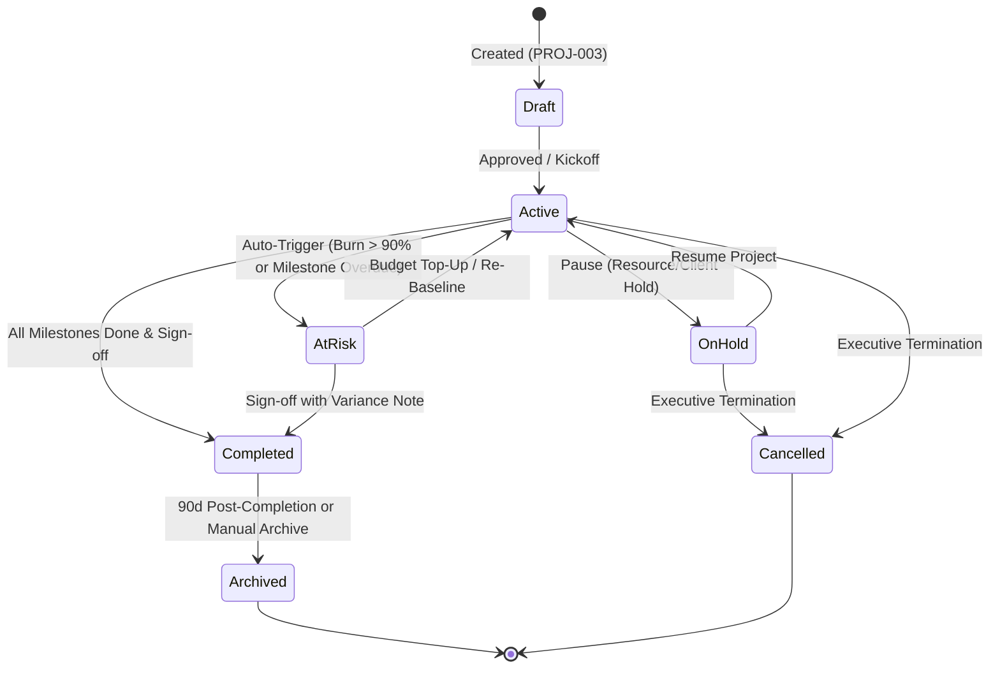
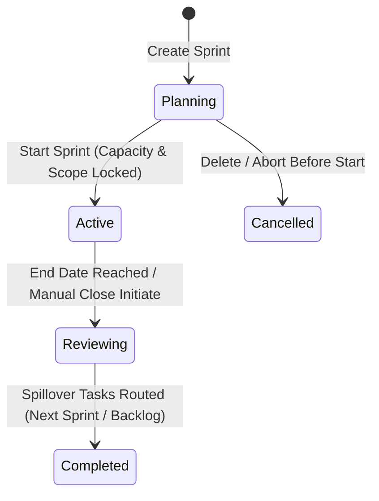
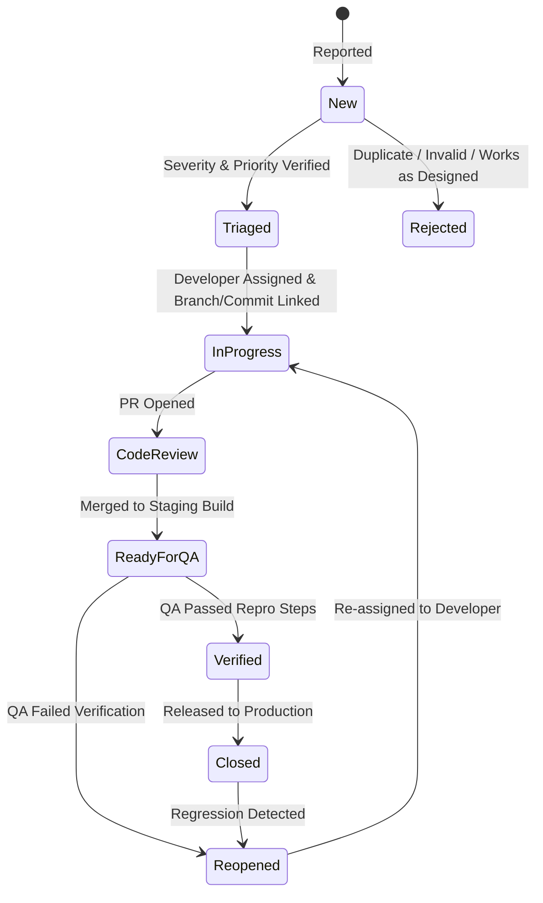

# PHASE 19: PROJECTS, SPRINTS, BUG TRACKING & CUSTOM TRACKER BUILDER

**Module Domain:** Project Portfolio Management, Agile Sprint Execution, Defect Lifecycle & Dynamic EAV/JSON-Schema Tracker Engine  
**Screen Coverage:** `PROJ-001` through `PROJ-015`, `CUSTOM-001`  
**Primary Storage Engines:** MySQL 8.0 InnoDB (Transactional Project/Sprint/Bug/DAG State), ClickHouse (High-Velocity Project Time & Burn Telemetry Rollups), Redis 7 (DAG Cycle-Check Cache, Resource Matrix Locks, Live Sprint Burndown Counters), S3/MinIO (Project Files, Bug Repro Videos/HAR Attachments via Pre-Signed URLs)  
**Backend Framework:** Fastify 4.x (REST + WebSocket `wss://.../ws/projects/:projectId`)

---

## 1. Architectural Overview & Domain State Machines

Phase 19 implements the enterprise project delivery, resource capacity allocation, agile sprint planning, defect tracking, dependency graph (DAG) validation, and user-defined Custom Tracker subsystem of HydiEms. Every tracked second from the Desktop Agent, Browser Extension, or Manual Timesheet (Phases 13, 20, 21) rolls up into Project Budgets (`PROJ-007`), Sprint Velocity (`PROJ-010`), and Resource Utilization (`PROJ-014`).

### 1.1 Project Lifecycle State Machine



* **State Transition Rules:**
  * `Draft -> Active`: Requires at least one assigned Project Manager (`project_members.role = 'MANAGER'`), a defined billing model (`FIXED_PRICE`, `TIME_AND_MATERIALS`, `NON_BILLABLE`, `RETAINER`), and valid start/target end dates (`target_end_date >= start_date`).
  * `Active -> AtRisk`: Triggered automatically by the Phase 24 Rule Engine or project budget rollup worker when `consumed_budget_amount / total_budget_amount >= 0.90` while weighted task completion is `< 0.75`, or when any critical-path milestone (`is_critical = 1`) is past due by `> 24h`.
  * `Completed / Cancelled / Archived`: Immediately locks new time-tracking sessions against the project in Redis (`SET proj:lock:{project_id} 1`), rejecting Desktop Agent and Browser Extension timer starts unless an Admin executes an explicit reopen with mandatory audit reason.

### 1.2 Agile Sprint Lifecycle State Machine (`PROJ-010`)



* **Invariants:**
  * Only one sprint per board/team may be in `Active` state simultaneously unless `allow_parallel_sprints = 1` is enabled in project settings.
  * Transitioning `Planning -> Active` snapshots `committed_story_points` and `committed_capacity_hours` into immutable columns for accurate Scope Creep and Velocity calculations.
  * Transitioning `Reviewing -> Completed` requires an atomic spillover resolution payload specifying the destination (`next_sprint_id` or `NULL` for backlog) for every incomplete task/bug in the sprint.

### 1.3 Bug Tracking Lifecycle State Machine (`PROJ-011` / `PROJ-012`)



---

## 2. Database Schema Definitions

### 2.1 MySQL 8.0 InnoDB Schema (Transactional Core)

```sql
-- ============================================================================
-- 1. PROJECTS CORE TABLE (PROJ-001, PROJ-002, PROJ-003, PROJ-004, PROJ-007)
-- ============================================================================
CREATE TABLE projects (
    id CHAR(36) NOT NULL PRIMARY KEY COMMENT 'UUIDv7',
    tenant_id CHAR(36) NOT NULL,
    client_id CHAR(36) NULL COMMENT 'FK to clients.id (Phase 21)',
    department_id CHAR(36) NULL,
    project_code VARCHAR(24) NOT NULL COMMENT 'Unique short key e.g. HYDI-CORE',
    name VARCHAR(180) NOT NULL,
    description TEXT NULL,
    status ENUM('DRAFT','ACTIVE','ON_HOLD','AT_RISK','COMPLETED','ARCHIVED','CANCELLED') NOT NULL DEFAULT 'DRAFT',
    visibility ENUM('PUBLIC','PRIVATE','DEPARTMENT_ONLY','CLIENT_SHARED') NOT NULL DEFAULT 'PRIVATE',
    billing_type ENUM('TIME_AND_MATERIALS','FIXED_PRICE','RETAINER','NON_BILLABLE') NOT NULL DEFAULT 'TIME_AND_MATERIALS',
    currency_code CHAR(3) NOT NULL DEFAULT 'USD',
    budget_mode ENUM('HOURS','MONETARY','BOTH') NOT NULL DEFAULT 'BOTH',
    total_budget_hours DECIMAL(12,2) NOT NULL DEFAULT 0.00,
    total_budget_amount DECIMAL(15,2) NOT NULL DEFAULT 0.00,
    consumed_hours DECIMAL(12,2) NOT NULL DEFAULT 0.00,
    consumed_billable_hours DECIMAL(12,2) NOT NULL DEFAULT 0.00,
    consumed_cost_amount DECIMAL(15,2) NOT NULL DEFAULT 0.00,
    consumed_billable_amount DECIMAL(15,2) NOT NULL DEFAULT 0.00,
    budget_alert_threshold_pct TINYINT UNSIGNED NOT NULL DEFAULT 80,
    default_hourly_bill_rate DECIMAL(10,2) NOT NULL DEFAULT 0.00,
    start_date DATE NOT NULL,
    target_end_date DATE NOT NULL,
    actual_end_date DATE NULL,
    completion_pct DECIMAL(5,2) NOT NULL DEFAULT 0.00,
    health_score TINYINT UNSIGNED NOT NULL DEFAULT 100 COMMENT '0-100 composite index',
    color_hex CHAR(7) NOT NULL DEFAULT '#2563EB',
    allow_manual_time TINYINT(1) NOT NULL DEFAULT 1,
    require_task_on_time_entry TINYINT(1) NOT NULL DEFAULT 1,
    allow_parallel_sprints TINYINT(1) NOT NULL DEFAULT 0,
    created_by CHAR(36) NOT NULL,
    updated_by CHAR(36) NULL,
    created_at TIMESTAMP(3) NOT NULL DEFAULT CURRENT_TIMESTAMP(3),
    updated_at TIMESTAMP(3) NOT NULL DEFAULT CURRENT_TIMESTAMP(3) ON UPDATE CURRENT_TIMESTAMP(3),
    deleted_at TIMESTAMP(3) NULL,
    UNIQUE KEY uq_projects_tenant_code (tenant_id, project_code),
    KEY idx_projects_tenant_status (tenant_id, status, target_end_date),
    KEY idx_projects_client (tenant_id, client_id),
    CONSTRAINT chk_projects_dates CHECK (target_end_date >= start_date)
) ENGINE=InnoDB DEFAULT CHARSET=utf8mb4 COLLATE=utf8mb4_unicode_ci;

-- ============================================================================
-- 2. PROJECT TEAM ALLOCATION & RESOURCE MATRIX (PROJ-005, PROJ-014)
-- ============================================================================
CREATE TABLE project_members (
    id CHAR(36) NOT NULL PRIMARY KEY,
    tenant_id CHAR(36) NOT NULL,
    project_id CHAR(36) NOT NULL,
    user_id CHAR(36) NOT NULL,
    project_role ENUM('OWNER','MANAGER','TECH_LEAD','CONTRIBUTOR','QA','VIEWER','CLIENT_GUEST') NOT NULL DEFAULT 'CONTRIBUTOR',
    allocated_hours_per_day DECIMAL(4,2) NOT NULL DEFAULT 8.00,
    allocated_pct DECIMAL(5,2) NOT NULL DEFAULT 100.00 COMMENT '0.00 to 100.00%',
    total_allocated_hours DECIMAL(10,2) NOT NULL DEFAULT 0.00,
    cost_rate_override DECIMAL(10,2) NULL COMMENT 'Internal hourly cost override',
    bill_rate_override DECIMAL(10,2) NULL COMMENT 'Client billable hourly override',
    allocation_start_date DATE NOT NULL,
    allocation_end_date DATE NOT NULL,
    is_active TINYINT(1) NOT NULL DEFAULT 1,
    created_at TIMESTAMP(3) NOT NULL DEFAULT CURRENT_TIMESTAMP(3),
    updated_at TIMESTAMP(3) NOT NULL DEFAULT CURRENT_TIMESTAMP(3) ON UPDATE CURRENT_TIMESTAMP(3),
    UNIQUE KEY uq_proj_member_window (tenant_id, project_id, user_id, allocation_start_date),
    KEY idx_proj_member_user_dates (tenant_id, user_id, allocation_start_date, allocation_end_date),
    CONSTRAINT fk_pm_project FOREIGN KEY (project_id) REFERENCES projects(id) ON DELETE CASCADE
) ENGINE=InnoDB DEFAULT CHARSET=utf8mb4 COLLATE=utf8mb4_unicode_ci;

-- ============================================================================
-- 3. PROJECT GOALS & OKR TARGETS (PROJ-008)
-- ============================================================================
CREATE TABLE project_goals (
    id CHAR(36) NOT NULL PRIMARY KEY,
    tenant_id CHAR(36) NOT NULL,
    project_id CHAR(36) NOT NULL,
    owner_user_id CHAR(36) NOT NULL,
    title VARCHAR(200) NOT NULL,
    description TEXT NULL,
    metric_type ENUM('PERCENTAGE','NUMERIC','CURRENCY','BOOLEAN','TASK_LINKED') NOT NULL DEFAULT 'PERCENTAGE',
    start_value DECIMAL(15,2) NOT NULL DEFAULT 0.00,
    target_value DECIMAL(15,2) NOT NULL DEFAULT 100.00,
    current_value DECIMAL(15,2) NOT NULL DEFAULT 0.00,
    status ENUM('NOT_STARTED','ON_TRACK','AT_RISK','OFF_TRACK','ACHIEVED') NOT NULL DEFAULT 'NOT_STARTED',
    due_date DATE NOT NULL,
    weight DECIMAL(5,2) NOT NULL DEFAULT 1.00,
    created_at TIMESTAMP(3) NOT NULL DEFAULT CURRENT_TIMESTAMP(3),
    updated_at TIMESTAMP(3) NOT NULL DEFAULT CURRENT_TIMESTAMP(3) ON UPDATE CURRENT_TIMESTAMP(3),
    KEY idx_proj_goals_project (tenant_id, project_id, status),
    CONSTRAINT fk_pg_project FOREIGN KEY (project_id) REFERENCES projects(id) ON DELETE CASCADE
) ENGINE=InnoDB DEFAULT CHARSET=utf8mb4 COLLATE=utf8mb4_unicode_ci;

-- ============================================================================
-- 4. PROJECT MILESTONES & GANTT PHASES (PROJ-006, PROJ-009)
-- ============================================================================
CREATE TABLE project_milestones (
    id CHAR(36) NOT NULL PRIMARY KEY,
    tenant_id CHAR(36) NOT NULL,
    project_id CHAR(36) NOT NULL,
    name VARCHAR(180) NOT NULL,
    description TEXT NULL,
    start_date DATE NOT NULL,
    due_date DATE NOT NULL,
    completed_at TIMESTAMP(3) NULL,
    status ENUM('UPCOMING','IN_PROGRESS','COMPLETED','OVERDUE','CANCELLED') NOT NULL DEFAULT 'UPCOMING',
    is_critical_path TINYINT(1) NOT NULL DEFAULT 0,
    is_billable_trigger TINYINT(1) NOT NULL DEFAULT 0,
    invoice_amount DECIMAL(15,2) NULL COMMENT 'Fixed-price milestone billing amount',
    completion_pct DECIMAL(5,2) NOT NULL DEFAULT 0.00,
    sort_order INT NOT NULL DEFAULT 0,
    created_at TIMESTAMP(3) NOT NULL DEFAULT CURRENT_TIMESTAMP(3),
    updated_at TIMESTAMP(3) NOT NULL DEFAULT CURRENT_TIMESTAMP(3) ON UPDATE CURRENT_TIMESTAMP(3),
    KEY idx_proj_milestones_proj (tenant_id, project_id, due_date),
    CONSTRAINT fk_pmile_project FOREIGN KEY (project_id) REFERENCES projects(id) ON DELETE CASCADE
) ENGINE=InnoDB DEFAULT CHARSET=utf8mb4 COLLATE=utf8mb4_unicode_ci;

-- ============================================================================
-- 5. AGILE SPRINTS (PROJ-010)
-- ============================================================================
CREATE TABLE project_sprints (
    id CHAR(36) NOT NULL PRIMARY KEY,
    tenant_id CHAR(36) NOT NULL,
    project_id CHAR(36) NOT NULL,
    name VARCHAR(120) NOT NULL,
    sprint_goal TEXT NULL,
    status ENUM('PLANNING','ACTIVE','REVIEWING','COMPLETED','CANCELLED') NOT NULL DEFAULT 'PLANNING',
    start_date DATE NOT NULL,
    end_date DATE NOT NULL,
    started_at TIMESTAMP(3) NULL,
    completed_at TIMESTAMP(3) NULL,
    planned_capacity_hours DECIMAL(10,2) NOT NULL DEFAULT 0.00,
    committed_story_points DECIMAL(8,2) NOT NULL DEFAULT 0.00,
    added_story_points DECIMAL(8,2) NOT NULL DEFAULT 0.00 COMMENT 'Mid-sprint scope creep',
    completed_story_points DECIMAL(8,2) NOT NULL DEFAULT 0.00,
    actual_logged_hours DECIMAL(10,2) NOT NULL DEFAULT 0.00,
    velocity_score DECIMAL(8,2) NOT NULL DEFAULT 0.00,
    retrospective_notes JSON NULL COMMENT '{wentWell, toImprove, actionItems}',
    created_by CHAR(36) NOT NULL,
    created_at TIMESTAMP(3) NOT NULL DEFAULT CURRENT_TIMESTAMP(3),
    updated_at TIMESTAMP(3) NOT NULL DEFAULT CURRENT_TIMESTAMP(3) ON UPDATE CURRENT_TIMESTAMP(3),
    KEY idx_sprints_project_status (tenant_id, project_id, status),
    CONSTRAINT fk_sprint_project FOREIGN KEY (project_id) REFERENCES projects(id) ON DELETE CASCADE
) ENGINE=InnoDB DEFAULT CHARSET=utf8mb4 COLLATE=utf8mb4_unicode_ci;

-- ============================================================================
-- 6. BUG TRACKING & DEFECT REGISTRY (PROJ-011, PROJ-012)
-- ============================================================================
CREATE TABLE project_bugs (
    id CHAR(36) NOT NULL PRIMARY KEY,
    tenant_id CHAR(36) NOT NULL,
    project_id CHAR(36) NOT NULL,
    sprint_id CHAR(36) NULL,
    linked_task_id CHAR(36) NULL,
    bug_key VARCHAR(32) NOT NULL COMMENT 'e.g. HYDI-BUG-1042',
    title VARCHAR(255) NOT NULL,
    description MEDIUMTEXT NOT NULL,
    repro_steps JSON NOT NULL COMMENT 'Array of ordered step objects {stepNo, action, expected, actual}',
    environment_info JSON NULL COMMENT '{os, browser, appVersion, deviceType, commitSha}',
    severity ENUM('BLOCKER','CRITICAL','MAJOR','MINOR','TRIVIAL') NOT NULL DEFAULT 'MAJOR',
    priority ENUM('P0_IMMEDIATE','P1_HIGH','P2_MEDIUM','P3_LOW') NOT NULL DEFAULT 'P2_MEDIUM',
    status ENUM('NEW','TRIAGED','IN_PROGRESS','CODE_REVIEW','READY_FOR_QA','VERIFIED','CLOSED','REOPENED','REJECTED') NOT NULL DEFAULT 'NEW',
    resolution ENUM('UNRESOLVED','FIXED','WONT_FIX','DUPLICATE','CANNOT_REPRODUCE','BY_DESIGN') NOT NULL DEFAULT 'UNRESOLVED',
    reporter_user_id CHAR(36) NOT NULL,
    assignee_user_id CHAR(36) NULL,
    qa_verifier_user_id CHAR(36) NULL,
    linked_commits JSON NULL COMMENT 'Array of {repo, sha, branch, prUrl, author, timestamp}',
    estimated_hours DECIMAL(8,2) NOT NULL DEFAULT 0.00,
    logged_hours DECIMAL(8,2) NOT NULL DEFAULT 0.00,
    due_date DATE NULL,
    resolved_at TIMESTAMP(3) NULL,
    reopen_count SMALLINT UNSIGNED NOT NULL DEFAULT 0,
    created_at TIMESTAMP(3) NOT NULL DEFAULT CURRENT_TIMESTAMP(3),
    updated_at TIMESTAMP(3) NOT NULL DEFAULT CURRENT_TIMESTAMP(3) ON UPDATE CURRENT_TIMESTAMP(3),
    UNIQUE KEY uq_bug_key (tenant_id, bug_key),
    KEY idx_bugs_proj_status_sev (tenant_id, project_id, status, severity),
    KEY idx_bugs_assignee (tenant_id, assignee_user_id, status),
    CONSTRAINT fk_bug_project FOREIGN KEY (project_id) REFERENCES projects(id) ON DELETE CASCADE
) ENGINE=InnoDB DEFAULT CHARSET=utf8mb4 COLLATE=utf8mb4_unicode_ci;

-- ============================================================================
-- 7. PROJECT & TASK DEPENDENCY DAG EDGES (PROJ-006, PROJ-015)
-- ============================================================================
CREATE TABLE project_dependency_edges (
    id CHAR(36) NOT NULL PRIMARY KEY,
    tenant_id CHAR(36) NOT NULL,
    project_id CHAR(36) NOT NULL,
    predecessor_type ENUM('PROJECT','MILESTONE','TASK','BUG') NOT NULL,
    predecessor_id CHAR(36) NOT NULL,
    successor_type ENUM('PROJECT','MILESTONE','TASK','BUG') NOT NULL,
    successor_id CHAR(36) NOT NULL,
    dependency_type ENUM('FS','SS','FF','SF') NOT NULL DEFAULT 'FS' COMMENT 'Finish-to-Start, Start-to-Start, Finish-to-Finish, Start-to-Finish',
    lag_days SMALLINT NOT NULL DEFAULT 0 COMMENT 'Positive lag or negative lead days',
    is_hard_block TINYINT(1) NOT NULL DEFAULT 1 COMMENT 'If 1, prevents successor completion before predecessor',
    created_by CHAR(36) NOT NULL,
    created_at TIMESTAMP(3) NOT NULL DEFAULT CURRENT_TIMESTAMP(3),
    UNIQUE KEY uq_dag_edge (tenant_id, predecessor_type, predecessor_id, successor_type, successor_id),
    KEY idx_dag_project (tenant_id, project_id),
    KEY idx_dag_successor (tenant_id, successor_type, successor_id)
) ENGINE=InnoDB DEFAULT CHARSET=utf8mb4 COLLATE=utf8mb4_unicode_ci;

-- ============================================================================
-- 8. CUSTOM TRACKER BUILDER SCHEMAS & RECORDS (CUSTOM-001)
-- ============================================================================
CREATE TABLE custom_tracker_definitions (
    id CHAR(36) NOT NULL PRIMARY KEY,
    tenant_id CHAR(36) NOT NULL,
    project_id CHAR(36) NULL COMMENT 'NULL = Tenant-Wide Global Tracker',
    name VARCHAR(120) NOT NULL,
    slug VARCHAR(64) NOT NULL,
    icon_name VARCHAR(64) NOT NULL DEFAULT 'box',
    description TEXT NULL,
    fields_schema JSON NOT NULL COMMENT 'Array of field definitions: id, key, label, type(TEXT|NUMBER|DATE|DROPDOWN|USER|PROJECT|FILE|CHECKBOX), required, options, validationRegex, defaultValue',
    workflow_schema JSON NOT NULL COMMENT 'State machine {states: [...], transitions: [{from, to, allowedRoles, requireComment}]}',
    is_active TINYINT(1) NOT NULL DEFAULT 1,
    created_by CHAR(36) NOT NULL,
    created_at TIMESTAMP(3) NOT NULL DEFAULT CURRENT_TIMESTAMP(3),
    updated_at TIMESTAMP(3) NOT NULL DEFAULT CURRENT_TIMESTAMP(3) ON UPDATE CURRENT_TIMESTAMP(3),
    UNIQUE KEY uq_custom_tracker_slug (tenant_id, slug)
) ENGINE=InnoDB DEFAULT CHARSET=utf8mb4 COLLATE=utf8mb4_unicode_ci;

CREATE TABLE custom_tracker_records (
    id CHAR(36) NOT NULL PRIMARY KEY,
    tenant_id CHAR(36) NOT NULL,
    tracker_id CHAR(36) NOT NULL,
    project_id CHAR(36) NULL,
    record_key VARCHAR(32) NOT NULL COMMENT 'e.g. RISK-0042, ASSET-0019',
    title VARCHAR(255) NOT NULL,
    current_state VARCHAR(64) NOT NULL,
    owner_user_id CHAR(36) NULL,
    field_values JSON NOT NULL COMMENT 'Validated key-value map matching custom_tracker_definitions.fields_schema',
    created_by CHAR(36) NOT NULL,
    updated_by CHAR(36) NULL,
    created_at TIMESTAMP(3) NOT NULL DEFAULT CURRENT_TIMESTAMP(3),
    updated_at TIMESTAMP(3) NOT NULL DEFAULT CURRENT_TIMESTAMP(3) ON UPDATE CURRENT_TIMESTAMP(3),
    UNIQUE KEY uq_tracker_record_key (tenant_id, record_key),
    KEY idx_tracker_records_state (tenant_id, tracker_id, current_state),
    CONSTRAINT fk_ctr_tracker FOREIGN KEY (tracker_id) REFERENCES custom_tracker_definitions(id) ON DELETE CASCADE
) ENGINE=InnoDB DEFAULT CHARSET=utf8mb4 COLLATE=utf8mb4_unicode_ci;
```

### 2.2 ClickHouse Telemetry Schema (Project Burn & Velocity Rollups)

```sql
CREATE TABLE hydi_telemetry.project_burn_hourly_mv
(
    tenant_id UUID,
    project_id UUID,
    sprint_id UUID,
    user_id UUID,
    bucket_hour DateTime('UTC'),
    tracked_seconds UInt64,
    billable_seconds UInt64,
    active_seconds UInt64,
    idle_seconds UInt64,
    internal_cost_usd Float64,
    billable_revenue_usd Float64
)
ENGINE = SummingMergeTree()
PARTITION BY toYYYYMM(bucket_hour)
ORDER BY (tenant_id, project_id, sprint_id, bucket_hour, user_id);
```

---

## 3. Screen-by-Screen Engineering Specifications

### 3.1 `PROJ-001` — Projects Portfolio Dashboard
* **Purpose:** Executive real-time portfolio command center displaying project health distribution, budget burn velocity, overdue milestones, resource bottlenecks, and active sprint progress across all accessible projects.
* **UI Layout & Components:**
  1. **KPI Ribbon (6 Metric Cards):** Total Active Projects, Portfolio Health Index (weighted average of `health_score`), Total Portfolio Budget vs Consumed Burn (`$ / Hours`), Projects At Risk (`status = 'AT_RISK'`), Milestones Due This Week, Average Team Utilization %.
  2. **Portfolio Burn vs Completion Scatter Plot:** X-axis = `% Budget Consumed`, Y-axis = `% Tasks/Milestones Completed`, bubble size = `total_budget_amount`. Projects below the $y = x - 15\%$ diagonal are highlighted in Crimson (`#DC2626`) as over-burning.
  3. **Project Health Status Donut & Department Breakdown Bar Chart.**
  4. **Critical Milestones & At-Risk Watchlist Table:** Top 10 projects sorted by lowest `health_score` with one-click drill-down to `PROJ-004`.
* **Health Score Formula:**
  $$\text{HealthScore} = \text{clamp}_{0}^{100}\left(100 - 40 \cdot \max\left(0, \frac{\text{BurnPct} - \text{CompletionPct}}{100}\right) - 30 \cdot \frac{\text{OverdueMilestones}}{\max(1, \text{TotalMilestones})} - 30 \cdot \frac{\text{OpenCriticalBugs}}{10}\right)$$
* **Fastify Endpoint:** `GET /api/v1/projects/dashboard?departmentId=&clientId=&dateFrom=&dateTo=`

### 3.2 `PROJ-002` — Project List & Multi-View Explorer
* **Purpose:** Filterable, sortable tabular and card grid registry of all projects with inline quick-actions, bulk status updates, and saved filter presets.
* **Columns:** `Project Code`, `Project Name & Color Badge`, `Client`, `Project Manager`, `Status Badge`, `Progress Bar (Completion %)`, `Hours (Logged / Budget)`, `Financial Burn ($ Consumed / $ Budget)`, `Next Milestone`, `Target End Date`, `Health Score Pill`.
* **Filter Facets:** Status (`DRAFT`, `ACTIVE`, `ON_HOLD`, `AT_RISK`, `COMPLETED`, `ARCHIVED`), Billing Type, Client, Department, Project Manager, Health Range (`<50 Critical`, `50-79 Warning`, `80-100 Healthy`), Overbudget Only (`consumed_hours > total_budget_hours`).
* **Fastify Endpoint:** `GET /api/v1/projects?page=1&limit=50&status=ACTIVE,AT_RISK&search=&sortBy=health_score&sortDir=asc`

### 3.3 `PROJ-003` — Create / Edit Project Wizard
* **Purpose:** 4-Step modal/drawer wizard for provisioning a project with baseline governance, team, budget, and workflow templates.
* **Wizard Steps:**
  1. **Identity & Classification:** `name`, `project_code` (auto-suggested 3-8 uppercase alphanumeric, uniqueness checked via debounced `GET /api/v1/projects/check-code?code=`), `client_id`, `department_id`, `visibility`, `start_date`, `target_end_date`, `color_hex`.
  2. **Budget & Billing Rules:** `billing_type`, `budget_mode`, `total_budget_hours`, `total_budget_amount`, `default_hourly_bill_rate`, `budget_alert_threshold_pct` (default `80%`), `allow_manual_time`, `require_task_on_time_entry`.
  3. **Initial Team & Role Allocation:** Select users, assign `project_role`, set `allocated_hours_per_day` (validates against existing cross-project allocations to warn if user exceeds `100%` capacity), optional `cost_rate_override` and `bill_rate_override`.
  4. **Template & Milestones Seeding:** Clone tasks/milestones from an existing Project Template or initialize default Kanban columns (`Backlog`, `To Do`, `In Progress`, `Review`, `Done`) and initial Sprint 1.
* **Fastify Endpoint:** `POST /api/v1/projects`
* **Validation Rules:**
  * `project_code`: `/^[A-Z0-9_-]{2,24}$/`
  * If `billing_type IN ('TIME_AND_MATERIALS', 'FIXED_PRICE', 'RETAINER')`, `client_id` is mandatory unless `is_internal_billable = true`.
  * At least one member must have `project_role = 'MANAGER'` or `'OWNER'`.

### 3.4 `PROJ-004` — 10-Tab Project Overview Workspace
* **Purpose:** Unified 360-degree workspace for a single project (`GET /api/v1/projects/:projectId/workspace`).
* **10 Sub-Navigation Tabs:**
  1. **Overview Tab:** Executive summary, burn gauge, recent activity feed, active sprint summary, milestone timeline preview, open blocker bugs, and key stakeholders.
  2. **Tasks Tab:** Scoped embed of `TASK-001`/`TASK-002` filtered strictly to `project_id`.
  3. **Team Tab:** Links directly to `PROJ-005` (Project Team Allocation).
  4. **Time Tab:** Granular time log ledger (Desktop Agent + Browser Extension + Manual entries) with productive/idle breakdown and screenshot strip link.
  5. **Timesheets Tab:** Weekly project timesheet approval grid grouped by employee (`TS-003` scoped to project).
  6. **Budget Tab:** Links directly to `PROJ-007` (Budget vs Used vs Remaining vs Projected Burn).
  7. **Activity Tab:** Real-time chronological audit stream of task transitions, commits, bug updates, file uploads, and budget changes (`wss://.../ws/projects/:projectId`).
  8. **Reports Tab:** Project-specific profitability, employee contribution, task cycle time, and bug resolution velocity reports with CSV/PDF export.
  9. **Files Tab:** S3/MinIO document repository supporting folder hierarchy, version history, MIME validation, and 15-minute pre-signed upload/download URLs (`POST /api/v1/projects/:projectId/files/presign`).
  10. **Billing Tab:** Unbilled hours accumulator, milestone billing triggers, client rate overrides, and one-click "Generate Draft Invoice" routing to `BILL-005` (Phase 21).

### 3.5 `PROJ-005` — Project Team Allocation
* **Purpose:** Manage project roster, role permissions, project-specific cost/billable rates, and date-bounded capacity commitments.
* **Interactive Controls:**
  * Add/Remove Member modal with live capacity conflict banner (e.g., *"Warning: Priya Sharma is already allocated 6.0h/day on HYDI-MOBILE between 2026-10-01 and 2026-11-15. Adding 4.0h/day results in 125% utilization"*).
  * Inline editable cells for `project_role`, `allocated_hours_per_day`, `bill_rate_override`, `cost_rate_override`, and `allocation_end_date`.
* **Fastify Endpoints:**
  * `GET /api/v1/projects/:projectId/members`
  * `POST /api/v1/projects/:projectId/members`
  * `PATCH /api/v1/projects/:projectId/members/:memberId`
  * `DELETE /api/v1/projects/:projectId/members/:memberId`

### 3.6 `PROJ-006` — Interactive Gantt Timeline
* **Purpose:** Multi-zoom (`Day`, `Week`, `Month`, `Quarter`) interactive Gantt chart rendering Phases, Milestones (`PROJ-009`), Sprints (`PROJ-010`), Tasks (`TASK-001`), and Dependency Arrows (`PROJ-015`).
* **Engineering Capabilities:**
  * **Drag-and-Drop Bar Rescheduling:** Dragging a task or milestone bar horizontally updates `start_date` and `due_date`; dragging the right handle updates duration; dragging the progress thumb updates `completion_pct`.
  * **Auto-Scheduling Cascade Engine:** When a predecessor node is delayed and `auto_cascade_dependencies = true`, the backend traverses the topological sort of `project_dependency_edges` and shifts all downstream `FS`/`SS`/`FF`/`SF` successors while respecting tenant working days and holidays.
  * **Critical Path Method (CPM) Highlighting:** Computes Early Start ($ES$), Early Finish ($EF$), Late Start ($LS$), Late Finish ($LF$), and Total Float ($TF = LS - ES$). Any node with $TF \le 0$ is outlined in glowing neon red (`#EF4444`) as Critical Path.
  * **Baseline Snapshot Comparison:** Users can save up to 5 Baseline Snapshots (`project_gantt_baselines`) and toggle a ghost bar overlay comparing planned baseline dates against current actual/slipped dates.
* **Fastify Endpoints:**
  * `GET /api/v1/projects/:projectId/gantt?zoom=WEEK&baselineId=`
  * `PATCH /api/v1/projects/:projectId/gantt/batch-reschedule` (transactional cascade update)

### 3.7 `PROJ-007` — Project Budget (Budget vs Used vs Remaining vs Projected Burn)
* **Purpose:** Real-time financial and hour burn telemetry with Earned Value Management (EVM) forecasting.
* **Core Mathematical Formulas:**
  * **Budget at Completion ($BAC$):** `total_budget_amount` (or `total_budget_hours`).
  * **Actual Cost ($AC$):** `consumed_cost_amount` (sum of $\text{logged\_hours}_i \times \text{effective\_cost\_rate}_i$ from ClickHouse/MySQL).
  * **Planned Value ($PV$):** $BAC \times \text{clamp}_{0}^{1}\left(\frac{\text{today} - \text{start\_date}}{\text{target\_end\_date} - \text{start\_date}}\right)$.
  * **Earned Value ($EV$):** $BAC \times \left(\frac{\text{completion\_pct}}{100}\right)$.
  * **Cost Performance Index ($CPI$):** $\frac{EV}{\max(0.01, AC)}$. ($CPI < 1.0$ indicates over budget).
  * **Schedule Performance Index ($SPI$):** $\frac{EV}{\max(0.01, PV)}$. ($SPI < 1.0$ indicates behind schedule).
  * **Estimate at Completion ($EAC$ — Projected Total Burn):**
    $$\text{EAC} = AC + \frac{BAC - EV}{\max(0.10, CPI \times SPI)}$$
  * **Variance at Completion ($VAC$):** $BAC - \text{EAC}$.
  * **Projected Exhaustion Date:** $\text{today} + \frac{\text{RemainingBudget}}{\text{Rolling14DayDailyBurnRate}}$.
* **UI Components:**
  * 4-Card Summary: **Total Budget ($BAC$)**, **Used to Date ($AC$)**, **Remaining ($BAC - AC$)**, **Projected Final Burn ($EAC$)** with Variance Badge.
  * **S-Curve EVM Chart:** Plots Cumulative $PV$, $EV$, $AC$, and dashed $EAC$ projection line from `start_date` to projected exhaustion date.
  * **Cost Breakdown Table by Employee & Role:** Shows Hours Logged, Billable Hours, Internal Cost Rate, Internal Cost Total, Client Bill Rate, Billable Amount, and Gross Margin % ($\frac{\text{Billable} - \text{Cost}}{\text{Billable}} \times 100$).

### 3.8 `PROJ-008` — Project Goals
* **Purpose:** Track quantifiable project objectives and key results (OKRs) linked directly to task completion or custom KPI metrics.
* **Features:** Goal cards with progress bars, owner avatar, status pill (`ON_TRACK`, `AT_RISK`, `OFF_TRACK`, `ACHIEVED`), historical check-in log, and automatic progress recalculation when `metric_type = 'TASK_LINKED'` (computes weighted completion of linked tasks).
* **Fastify Endpoints:** `GET / POST / PATCH / DELETE /api/v1/projects/:projectId/goals`

### 3.9 `PROJ-009` — Project Milestones
* **Purpose:** Phase gates and contractual deliverables tracker with automated invoice trigger integration.
* **Features:**
  * Milestone checklist of linked tasks and bugs (shows `18 / 22 Tasks Completed`, `0 Open Blocker Bugs`).
  * **Sign-Off Gate:** Marking a milestone `COMPLETED` when `is_billable_trigger = 1` emits a domain event `project.milestone.completed` that automatically creates a pending billable line item in Phase 21 (`client_unbilled_items`) for `invoice_amount`.

### 3.10 `PROJ-010` — Agile Sprint Management (Capacity, Velocity & Completion)
* **Purpose:** End-to-end Scrum/Agile sprint planner, capacity calculator, active sprint execution monitor, and velocity analyzer.
* **Key Sub-Views:**
  1. **Sprint Backlog & Split-Pane Planner:** Drag tasks/bugs from the Unscheduled Project Backlog into a `PLANNING` sprint. Live capacity bar per developer updates instantly:
     $$\text{MemberAvailableSprintHours} = \sum_{d \in \text{SprintWorkdays}} \left(\text{allocated\_hours\_per\_day}_{u,d} - \text{ApprovedLeaveHours}_{u,d} - \text{HolidayHours}_{u,d}\right)$$
     If assigned task estimates for user $u$ exceed $\text{MemberAvailableSprintHours}$, their avatar ring turns red with an overload badge.
  2. **Velocity Chart (Last 10 Sprints):** Grouped bar chart comparing `committed_story_points` (gray), `added_story_points` (amber scope-creep stack), and `completed_story_points` (emerald) with a 3-sprint rolling average velocity line.
  3. **Sprint Completion Modal:** Displays completion rate %, total hours logged vs estimated, and prompts the Scrum Master to route incomplete items to the next sprint or backlog while capturing structured retrospective notes (`wentWell`, `toImprove`, `actionItems`).
* **Fastify Endpoints:**
  * `GET /api/v1/projects/:projectId/sprints`
  * `POST /api/v1/projects/:projectId/sprints`
  * `POST /api/v1/projects/:projectId/sprints/:sprintId/start`
  * `POST /api/v1/projects/:projectId/sprints/:sprintId/complete`

### 3.11 `PROJ-011` & `PROJ-012` — Bug Tracking List & Bug Detail Workspace
* **Purpose:** Engineering-grade defect tracking with structured reproduction steps, environment telemetry, severity/priority matrices, and Git commit/PR traceability.
* **`PROJ-011` (Bug Tracking List & Triage Queue):**
  * Filterable by `Severity` (`BLOCKER` to `TRIVIAL`), `Priority` (`P0` to `P3`), `Status`, `Sprint`, `Assignee`, `Reporter`, and `Environment`.
  * Includes **Severity x Priority Heatmap Matrix** and **Bug Age Histogram** (highlighting P0/Blocker bugs open $> 24\text{h}$).
* **`PROJ-012` (Bug Detail View):**
  * **Header:** `bug_key` (`HYDI-BUG-1042`), editable title, Severity badge, Priority badge, Status workflow dropdown (enforcing state machine transitions), Assignee, QA Verifier, and Direct "Start Timer on Bug" button.
  * **Structured Repro Steps Table:** Ordered rows with `Step #`, `Action Performed`, `Expected Result`, and `Actual Result`.
  * **Environment & Telemetry Block:** OS, Browser/Device, App Version, Release Tag, Console Log / HAR file attachment viewer, and embedded S3/MinIO video player for screen recordings.
  * **Linked Commits, Branches & Tasks Panel:** Displays Git webhook payloads (`commit_sha`, commit message, author, PR status badge, CI build status) and bi-directional links to tasks (`TASK-009`).
* **Fastify Endpoints:**
  * `GET /api/v1/projects/:projectId/bugs`
  * `POST /api/v1/projects/:projectId/bugs`
  * `GET /api/v1/bugs/:bugId`
  * `PATCH /api/v1/bugs/:bugId/transition`

### 3.12 `PROJ-013` — Project Calendar
* **Purpose:** Unified Month / Week / Day / Agenda calendar overlaying Project Milestones, Sprint Start/End boundaries, Task Due Dates, Bug SLA Deadlines, and Team Approved Leaves (from Phase 17).
* **Interactive Features:** Drag-and-drop any task or milestone chip to a new calendar cell to reschedule its `due_date`; toggle layer visibility (`Milestones`, `Sprints`, `Tasks`, `Bugs`, `Team Leaves`); subscribe via secure iCal feed (`GET /api/v1/projects/:projectId/calendar.ics?token=`).

### 3.13 `PROJ-014` — Resource Allocation Matrix (Available vs Allocated vs Remaining vs Utilization %)
* **Purpose:** Cross-project capacity heatmap and resource leveling workbench for PMO directors and department heads.
* **Matrix Structure:**
  * **Rows:** Employees (expandable to show each project they are allocated to).
  * **Columns:** Time buckets (Daily, Weekly, or Monthly columns across selected date horizon).
  * **Cell Metrics (4-Quad Display):**
    1. **Available Capacity ($C_{\text{avail}}$):** Standard shift hours minus holidays and approved PTO (e.g., `40.0h/wk`).
    2. **Allocated Capacity ($C_{\text{alloc}}$):** Sum of `allocated_hours_per_day` across all active projects in that bucket (e.g., `36.0h/wk`).
    3. **Remaining Capacity ($C_{\text{rem}}$):** $C_{\text{avail}} - C_{\text{alloc}}$ (e.g., `+4.0h` or `-8.0h` if over-allocated).
    4. **Utilization % ($U\%$):** $\frac{C_{\text{alloc}}}{\max(0.01, C_{\text{avail}})} \times 100$.
  * **Color Threshold Coding:**
    * `< 50%`: Blue (`#3B82F6` — Underutilized / Bench capacity available)
    * `50% – 85%`: Emerald (`#10B981` — Optimal sustainable zone)
    * `86% – 100%`: Amber (`#F59E0B` — Near peak capacity)
    * `> 100%`: Crimson (`#EF4444` — Over-allocated conflict; supports drag-and-drop reassignment to another team member with matching skills).
* **Fastify Endpoint:** `GET /api/v1/projects/resource-matrix?bucket=WEEK&startDate=2026-09-01&endDate=2026-11-30&departmentId=`

### 3.14 `PROJ-015` — Project & Task Dependencies DAG Visualizer
* **Purpose:** Interactive directed acyclic graph (DAG) canvas (powered by Dagre/ELK layout) visualizing cross-project and intra-project dependencies (`FS`, `SS`, `FF`, `SF`) and detecting circular dependency attempts in real time.
* **Cycle Detection Algorithm (Kahn's Topological Sort / DFS Coloring):**
  * Before inserting any edge $(u \to v)$ into `project_dependency_edges`, the Fastify service loads the adjacency list for `project_id` (cached in Redis `dag:adj:{project_id}`) and executes a Depth-First Search from $v$ to verify whether $u$ is reachable from $v$.
  * If $u$ is reachable from $v$, the API immediately rejects the request with `HTTP 409 Conflict` (`ERR_DAG_CYCLE_DETECTED`) and returns the exact cycle path array `[u, ..., v, u]` so the UI highlights the offending loop in red.
* **Fastify Endpoints:**
  * `GET /api/v1/projects/:projectId/dependencies/dag`
  * `POST /api/v1/projects/:projectId/dependencies`
  * `DELETE /api/v1/projects/:projectId/dependencies/:edgeId`

### 3.15 `CUSTOM-001` — Custom Tracker Builder
* **Purpose:** No-code schema and workflow designer enabling enterprises to create custom trackers (e.g., *RAID Logs, Security Vulnerabilities, Hardware Procurement Requests, Change Requests, QA Test Suites*) with custom fields and role-gated state machines.
* **Supported Dynamic Field Types (`fields_schema`):**
  1. `TEXT` (Single-line, Multi-line Markdown, Regex-validated string)
  2. `NUMBER` (Integer, Decimal, Currency, Percentage with `min`/`max`)
  3. `DATE` (Date or DateTime with relative SLA rules)
  4. `DROPDOWN` (Single-select or Multi-select with color-coded option pills)
  5. `USER` (Single or multi-user picker bound to tenant directory)
  6. `PROJECT` (Cross-reference link to `projects.id`)
  7. `FILE` (S3/MinIO attachment slot with allowed extension whitelist and max size MB)
  8. `CHECKBOX` (Boolean toggle with optional mandatory-on-transition constraint)
* **Custom Workflow Designer (`workflow_schema`):**
  * Visual state node editor where admins define States (`Initial`, `In-Progress`, `Terminal`) and directed Transitions with `allowedRoles`, `requireComment`, and `requiredFields` (fields that must be non-null before entering the target state).
* **Runtime Validation Engine:**
  * On `POST /api/v1/custom-trackers/:trackerId/records` or `PATCH`, Fastify dynamically compiles `fields_schema` into a cached Ajv JSON Schema validator (`ajv.compile(compiledSchema)`) and validates `field_values` in $< 0.4\text{ms}$.

---

## 4. RBAC Permissions, Audit Events & Acceptance Criteria

### 4.1 RBAC Permission Matrix

| Permission Key | Super Admin | Org Admin | Dept Head | Project Manager | Contributor / QA | Client Guest |
| :--- | :---: | :---: | :---: | :---: | :---: | :---: |
| `projects:portfolio:view` | Yes | Yes | Dept Only | Assigned Only | No | No |
| `projects:create` | Yes | Yes | Yes | Configurable | No | No |
| `projects:edit_settings` | Yes | Yes | Dept Only | Own Projects | No | No |
| `projects:budget:view_financials` | Yes | Yes | Dept Only | Own Projects | Hours Only | Billable Only |
| `projects:team:allocate` | Yes | Yes | Dept Only | Own Projects | No | No |
| `projects:sprints:manage` | Yes | Yes | Dept Only | Own Projects | No | No |
| `projects:bugs:create_transition` | Yes | Yes | Yes | Yes | Yes | Create/View |
| `projects:custom_trackers:design` | Yes | Yes | No | Own Projects | No | No |

### 4.2 Immutable Audit Events Emitted
* `PROJECT_CREATED`, `PROJECT_STATUS_CHANGED`, `PROJECT_BUDGET_MODIFIED`, `PROJECT_MEMBER_ALLOCATED`, `PROJECT_GANTT_RESCHEDULED`, `SPRINT_STARTED`, `SPRINT_COMPLETED`, `BUG_STATUS_TRANSITIONED`, `DAG_DEPENDENCY_CREATED`, `CUSTOM_TRACKER_SCHEMA_UPDATED`.

### 4.3 Engineering Acceptance Criteria
1. **DAG Cycle Prevention (`PROJ-015`):** Attempting to create a direct (`A -> B -> A`) or transitive (`A -> B -> C -> D -> A`) dependency must return `409 Conflict` with the exact cycle path in `< 25ms` for graphs up to `5,000` nodes.
2. **Budget Burn Rollup Accuracy (`PROJ-007`):** When a 60-second telemetry heartbeat arrives from the Desktop Agent (Phase 13), the project's `consumed_hours`, `consumed_cost_amount`, and `consumed_billable_amount` must reflect the updated totals within `<= 5 seconds` via ClickHouse materialized views and Redis write-behind sync.
3. **Resource Matrix Conflict Detection (`PROJ-005` / `PROJ-014`):** Allocating an employee across multiple projects such that their daily allocation exceeds their shift capacity must immediately compute the exact over-allocation percentage and surface it in both the allocation modal and `PROJ-014`.
4. **Custom Tracker Dynamic Validation (`CUSTOM-001`):** Modifying a Custom Tracker's `fields_schema` must invalidate the cached Ajv validator in Redis pub/sub across all Fastify worker nodes within `100ms` without dropping active requests.
