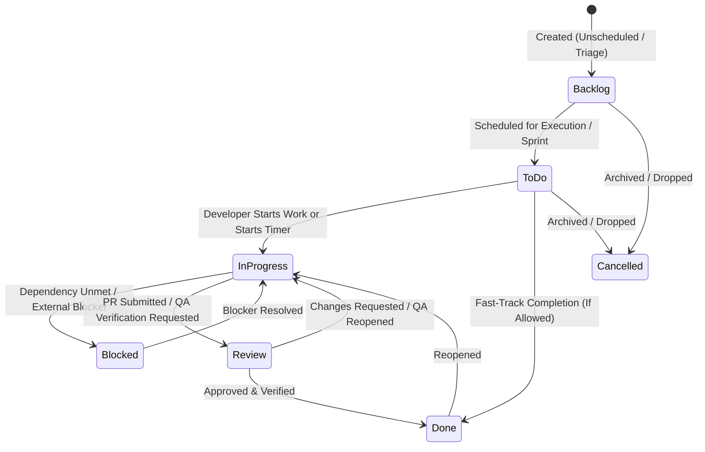

# PHASE 20: TASKS, KANBAN BOARDS, DEPENDENCIES & MANIFEST V3 BROWSER EXTENSION

**Module Domain:** Enterprise Work Breakdown Structure (WBS), Real-Time Kanban Execution, Recurring/Template Task Engine, Burndown Analytics & Chrome/Edge Manifest V3 Browser Extension with Desktop Agent Native Messaging  
**Screen Coverage:** `TASK-001` through `TASK-015`, `EXT-001`  
**Primary Storage Engines:** MySQL 8.0 InnoDB (Tasks, Subtasks, Watchers, Immutable Task Audit Log, Recurring Schedules, Templates), ClickHouse (Task Time Rollups & Sprint Burndown Snapshots), Redis 7 (LexoRank Kanban Ordering Locks, Active Timer State, WebSocket Board Presence), S3/MinIO (Task Attachments & Bulk Import Staging)  
**Backend Framework:** Fastify 4.x (REST + WebSocket `wss://.../ws/tasks/board/:projectId` + Native Messaging IPC Protocol)

---

## 1. Architectural Overview & Domain State Machines

Phase 20 governs task-level execution across all projects, sprints, and ad-hoc operational workflows. It introduces LexoRank O(1) Kanban card reordering, hard/soft dependency enforcement (`Blocking` / `Blocked-By`), an append-only cryptographic audit log for every field mutation, cron-driven recurring task materialization, and the Chrome/Edge Manifest V3 Browser Extension (`EXT-001`) that synchronizes bi-directionally with both the Cloud API and the local HydiEms Desktop Agent via Native Messaging (`stdio` length-prefixed JSON frames).

### 1.1 Canonical Task Workflow State Machine (`TASK-002` / `TASK-004`)



* **Deterministic Enforcement Rules:**
  * **Auto-Transition on Timer Start:** When an employee starts a timer on a task in `Backlog` or `ToDo` (via Web UI, Desktop Agent, or `EXT-001` Browser Extension), the backend automatically transitions the task to `InProgress` and logs an audit entry (`trigger_source = 'AUTO_TIMER_START'`).
  * **Hard Dependency Gate (`TASK-008`):** A task cannot transition to `Done` (and optionally cannot transition to `InProgress` if `block_start_on_dependency = 1`) while any linked `BLOCKED_BY` predecessor task has `status != 'DONE'`. Attempting to do so returns `HTTP 422 Unprocessable Entity` (`ERR_TASK_BLOCKED_BY_PREDECESSOR`).
  * **Subtask Completion Gate (`TASK-004`):** If `require_subtasks_completed = 1` on the parent project, transitioning a parent task to `Done` while any child subtask is incomplete is rejected unless the user confirms bulk-completion and holds `tasks:force_complete` permission.

---

## 2. Database Schema Definitions

### 2.1 MySQL 8.0 InnoDB Schema

```sql
-- ============================================================================
-- 1. CORE TASKS & SUBTASKS TABLE (TASK-001..005, TASK-011)
-- ============================================================================
CREATE TABLE tasks (
    id CHAR(36) NOT NULL PRIMARY KEY COMMENT 'UUIDv7',
    tenant_id CHAR(36) NOT NULL,
    project_id CHAR(36) NULL COMMENT 'NULL allowed only for personal/ad-hoc tasks (TASK-011)',
    sprint_id CHAR(36) NULL,
    milestone_id CHAR(36) NULL,
    parent_task_id CHAR(36) NULL COMMENT 'Self-referencing FK for Subtasks (max depth = 3)',
    recurring_rule_id CHAR(36) NULL COMMENT 'FK to task_recurring_rules.id (TASK-010)',
    task_key VARCHAR(32) NOT NULL COMMENT 'e.g. HYDI-1088 or ADHOC-4091',
    title VARCHAR(255) NOT NULL,
    description MEDIUMTEXT NULL,
    task_type ENUM('TASK','STORY','EPIC','SUBTASK','AD_HOC','RECURRING_INSTANCE','OPERATIONAL') NOT NULL DEFAULT 'TASK',
    status ENUM('BACKLOG','TODO','IN_PROGRESS','BLOCKED','REVIEW','DONE','CANCELLED') NOT NULL DEFAULT 'TODO',
    priority ENUM('URGENT','HIGH','MEDIUM','LOW','NONE') NOT NULL DEFAULT 'MEDIUM',
    kanban_lexorank VARCHAR(64) NOT NULL DEFAULT '0|hzzzzz:' COMMENT 'Lexicographical rank for O(1) column sorting',
    reporter_user_id CHAR(36) NOT NULL,
    assignee_user_id CHAR(36) NULL,
    reviewer_user_id CHAR(36) NULL,
    story_points DECIMAL(6,2) NULL,
    estimated_hours DECIMAL(8,2) NOT NULL DEFAULT 0.00,
    logged_hours DECIMAL(8,2) NOT NULL DEFAULT 0.00,
    billable_hours DECIMAL(8,2) NOT NULL DEFAULT 0.00,
    is_billable TINYINT(1) NOT NULL DEFAULT 1,
    start_date DATE NULL,
    due_date DATETIME(3) NULL,
    started_at TIMESTAMP(3) NULL,
    completed_at TIMESTAMP(3) NULL,
    completion_pct DECIMAL(5,2) NOT NULL DEFAULT 0.00,
    subtask_total_count SMALLINT UNSIGNED NOT NULL DEFAULT 0,
    subtask_done_count SMALLINT UNSIGNED NOT NULL DEFAULT 0,
    blocker_count SMALLINT UNSIGNED NOT NULL DEFAULT 0 COMMENT 'Cached count of unresolved BLOCKED_BY links',
    tags JSON NULL COMMENT 'Array of tag strings/objects',
    custom_fields JSON NULL,
    created_by CHAR(36) NOT NULL,
    updated_by CHAR(36) NULL,
    created_at TIMESTAMP(3) NOT NULL DEFAULT CURRENT_TIMESTAMP(3),
    updated_at TIMESTAMP(3) NOT NULL DEFAULT CURRENT_TIMESTAMP(3) ON UPDATE CURRENT_TIMESTAMP(3),
    deleted_at TIMESTAMP(3) NULL,
    UNIQUE KEY uq_tasks_tenant_key (tenant_id, task_key),
    KEY idx_tasks_board_order (tenant_id, project_id, status, kanban_lexorank),
    KEY idx_tasks_my_tasks (tenant_id, assignee_user_id, status, due_date),
    KEY idx_tasks_sprint (tenant_id, sprint_id, status),
    KEY idx_tasks_parent (tenant_id, parent_task_id),
    CONSTRAINT fk_tasks_parent FOREIGN KEY (parent_task_id) REFERENCES tasks(id) ON DELETE CASCADE
) ENGINE=InnoDB DEFAULT CHARSET=utf8mb4 COLLATE=utf8mb4_unicode_ci;

-- ============================================================================
-- 2. TASK WATCHERS & STAKEHOLDERS (TASK-006, TASK-015)
-- ============================================================================
CREATE TABLE task_watchers (
    id CHAR(36) NOT NULL PRIMARY KEY,
    tenant_id CHAR(36) NOT NULL,
    task_id CHAR(36) NOT NULL,
    user_id CHAR(36) NOT NULL,
    stakeholder_role ENUM('WATCHER','APPROVER','CONSULTED','INFORMED') NOT NULL DEFAULT 'WATCHER',
    notify_on_status_change TINYINT(1) NOT NULL DEFAULT 1,
    notify_on_comment TINYINT(1) NOT NULL DEFAULT 1,
    notify_on_time_overrun TINYINT(1) NOT NULL DEFAULT 1,
    added_by CHAR(36) NOT NULL,
    created_at TIMESTAMP(3) NOT NULL DEFAULT CURRENT_TIMESTAMP(3),
    UNIQUE KEY uq_task_watcher (tenant_id, task_id, user_id),
    CONSTRAINT fk_tw_task FOREIGN KEY (task_id) REFERENCES tasks(id) ON DELETE CASCADE
) ENGINE=InnoDB DEFAULT CHARSET=utf8mb4 COLLATE=utf8mb4_unicode_ci;

-- ============================================================================
-- 3. IMMUTABLE TASK AUDIT HISTORY (TASK-007)
-- ============================================================================
CREATE TABLE task_audit_history (
    id CHAR(36) NOT NULL PRIMARY KEY,
    tenant_id CHAR(36) NOT NULL,
    task_id CHAR(36) NOT NULL,
    actor_user_id CHAR(36) NOT NULL,
    actor_ip VARCHAR(45) NULL,
    trigger_source ENUM('WEB_UI','BROWSER_EXTENSION','DESKTOP_AGENT','BULK_IMPORT','AUTOMATION_RULE','API_KEY') NOT NULL DEFAULT 'WEB_UI',
    event_type ENUM('CREATED','STATUS_CHANGED','ASSIGNEE_CHANGED','PRIORITY_CHANGED','ESTIMATE_CHANGED','DUE_DATE_CHANGED','DEPENDENCY_ADDED','DEPENDENCY_REMOVED','SUBTASK_CHANGED','ATTACHMENT_ADDED','COMMENT_ADDED','ARCHIVED') NOT NULL,
    field_name VARCHAR(64) NOT NULL,
    old_value JSON NULL,
    new_value JSON NULL,
    prev_hash CHAR(64) NOT NULL COMMENT 'SHA-256 chain per task_id for tamper evidence',
    entry_hash CHAR(64) NOT NULL,
    created_at TIMESTAMP(3) NOT NULL DEFAULT CURRENT_TIMESTAMP(3),
    KEY idx_task_audit_chronological (tenant_id, task_id, created_at DESC)
) ENGINE=InnoDB DEFAULT CHARSET=utf8mb4 COLLATE=utf8mb4_unicode_ci;

-- ============================================================================
-- 4. TASK LINKS & CROSS-ENTITY RELATIONS (TASK-008, TASK-009)
-- ============================================================================
CREATE TABLE task_entity_links (
    id CHAR(36) NOT NULL PRIMARY KEY,
    tenant_id CHAR(36) NOT NULL,
    source_task_id CHAR(36) NOT NULL,
    link_type ENUM('BLOCKS','BLOCKED_BY','RELATES_TO','DUPLICATES','CAUSED_BY_BUG','FIXES_BUG') NOT NULL,
    target_entity_type ENUM('TASK','BUG') NOT NULL DEFAULT 'TASK',
    target_entity_id CHAR(36) NOT NULL,
    created_by CHAR(36) NOT NULL,
    created_at TIMESTAMP(3) NOT NULL DEFAULT CURRENT_TIMESTAMP(3),
    UNIQUE KEY uq_task_entity_link (tenant_id, source_task_id, link_type, target_entity_type, target_entity_id),
    KEY idx_target_lookup (tenant_id, target_entity_type, target_entity_id),
    CONSTRAINT fk_tel_source FOREIGN KEY (source_task_id) REFERENCES tasks(id) ON DELETE CASCADE
) ENGINE=InnoDB DEFAULT CHARSET=utf8mb4 COLLATE=utf8mb4_unicode_ci;

-- ============================================================================
-- 5. RECURRING / SCHEDULED TASK RULES (TASK-010)
-- ============================================================================
CREATE TABLE task_recurring_rules (
    id CHAR(36) NOT NULL PRIMARY KEY,
    tenant_id CHAR(36) NOT NULL,
    project_id CHAR(36) NULL,
    template_title VARCHAR(255) NOT NULL,
    template_description MEDIUMTEXT NULL,
    default_assignee_id CHAR(36) NULL,
    default_priority ENUM('URGENT','HIGH','MEDIUM','LOW','NONE') NOT NULL DEFAULT 'MEDIUM',
    estimated_hours DECIMAL(8,2) NOT NULL DEFAULT 1.00,
    subtasks_blueprint JSON NULL COMMENT 'Array of child subtask titles & estimates',
    rrule_expression VARCHAR(255) NOT NULL COMMENT 'RFC 5545 RRULE e.g. FREQ=WEEKLY;BYDAY=MO,WE,FR;BYHOUR=9',
    timezone VARCHAR(64) NOT NULL DEFAULT 'UTC',
    due_offset_hours INT UNSIGNED NOT NULL DEFAULT 24 COMMENT 'Due date = spawned_at + due_offset_hours',
    skip_holidays_and_leaves TINYINT(1) NOT NULL DEFAULT 1,
    fallback_assignee_id CHAR(36) NULL COMMENT 'Assigned if primary assignee is on approved leave',
    next_run_at TIMESTAMP(3) NOT NULL,
    last_run_at TIMESTAMP(3) NULL,
    spawned_count INT UNSIGNED NOT NULL DEFAULT 0,
    is_active TINYINT(1) NOT NULL DEFAULT 1,
    created_by CHAR(36) NOT NULL,
    created_at TIMESTAMP(3) NOT NULL DEFAULT CURRENT_TIMESTAMP(3),
    KEY idx_recurring_next_run (is_active, next_run_at)
) ENGINE=InnoDB DEFAULT CHARSET=utf8mb4 COLLATE=utf8mb4_unicode_ci;

-- ============================================================================
-- 6. TASK TEMPLATES & WBS BLUEPRINTS (TASK-012)
-- ============================================================================
CREATE TABLE task_templates (
    id CHAR(36) NOT NULL PRIMARY KEY,
    tenant_id CHAR(36) NOT NULL,
    department_id CHAR(36) NULL,
    name VARCHAR(160) NOT NULL,
    category VARCHAR(80) NOT NULL DEFAULT 'GENERAL',
    description TEXT NULL,
    default_priority ENUM('URGENT','HIGH','MEDIUM','LOW','NONE') NOT NULL DEFAULT 'MEDIUM',
    estimated_hours DECIMAL(8,2) NOT NULL DEFAULT 0.00,
    is_billable TINYINT(1) NOT NULL DEFAULT 1,
    checklist_items JSON NOT NULL COMMENT 'Array of {title, estimatedHours, relativeOrder}',
    default_tags JSON NULL,
    created_by CHAR(36) NOT NULL,
    created_at TIMESTAMP(3) NOT NULL DEFAULT CURRENT_TIMESTAMP(3),
    KEY idx_task_templates_tenant (tenant_id, category)
) ENGINE=InnoDB DEFAULT CHARSET=utf8mb4 COLLATE=utf8mb4_unicode_ci;
```

### 2.2 ClickHouse Daily Sprint & Project Burndown Table (`TASK-014`)

```sql
CREATE TABLE hydi_telemetry.sprint_burndown_daily
(
    tenant_id UUID,
    project_id UUID,
    sprint_id UUID,
    snapshot_date Date,
    ideal_remaining_points Float64,
    actual_remaining_points Float64,
    ideal_remaining_hours Float64,
    actual_remaining_hours Float64,
    completed_tasks_count UInt32,
    open_tasks_count UInt32,
    scope_added_points Float64,
    logged_hours_cum Float64
)
ENGINE = ReplacingMergeTree()
PARTITION BY toYYYYMM(snapshot_date)
ORDER BY (tenant_id, project_id, sprint_id, snapshot_date);
```

---

## 3. Screen-by-Screen Engineering Specifications

### 3.1 `TASK-001` — Task Dashboard (List, Board, Calendar, Timeline Views)
* **Purpose:** Unified multi-modal task command center allowing instant switching between **Hierarchical List (WBS Tree)**, **Kanban Board (`TASK-002`)**, **Calendar View**, and **Timeline/Gantt Strip** without losing active filter context.
* **Persistent Filter & Grouping Bar:**
  * Filter by: `Project`, `Sprint`, `Assignee (Multi-select)`, `Status`, `Priority`, `Task Type`, `Tag`, `Due Date Range`, `Blocked Only (blocker_count > 0)`, `Over Estimate (logged_hours > estimated_hours)`.
  * Group by (in List View): `Status`, `Assignee`, `Priority`, `Sprint`, `Milestone`, or `None (Flat)`.
* **Inline Bulk Operations Toolbar:** Selecting multiple rows enables one-click bulk `Change Status`, `Reassign`, `Move to Sprint`, `Update Priority`, `Add Tag`, or `Export Selected`.
* **Fastify Endpoint:** `GET /api/v1/tasks?projectId=&sprintId=&assigneeIds=&status=&view=LIST&cursor=&limit=100`

### 3.2 `TASK-002` — Kanban Task Board (Backlog, To Do, In Progress, Review, Done)
* **Purpose:** High-concurrency real-time Kanban board with sub-50ms WebSocket synchronization and O(1) LexoRank card positioning.
* **Columns:** `BACKLOG`, `TODO`, `IN_PROGRESS`, `BLOCKED` (collapsible or red badge overlay), `REVIEW`, `DONE`. Supports WIP (Work-In-Progress) column limits; when a column's task count exceeds `wip_limit`, the column header pulses amber/red.
* **LexoRank Reordering Algorithm:**
  * Every card stores a base-36 `kanban_lexorank` string (e.g., `0|hzzzzz:`).
  * When a card is dropped between `prevRank` (`0|h00008:`) and `nextRank` (`0|h0000g:`), the server computes the midpoint string (`0|h0000c:`) and updates **only the single moved row** in MySQL (`UPDATE tasks SET status = ?, kanban_lexorank = ? WHERE id = ?`).
  * If rank density approaches exhaustion (`|prevRank - nextRank| == 1` at max length 48 chars), a background BullMQ job (`kanban-rebalance-worker`) re-spaces the column's ranks cleanly under a Redis mutex (`SETNX lock:kanban:{projectId}:{status}`).
* **Card Anatomy:** `task_key`, Priority icon, Title, Blocker Warning Pill (if `blocker_count > 0`), Subtask progress (`4/6`), Logged vs Estimated Hours bar (`6.5h / 8.0h`), Story Points badge, Due Date countdown, Assignee avatar, and an inline **"Play / Stop Timer"** button.
* **Fastify Endpoints:**
  * `PATCH /api/v1/tasks/:taskId/move` (`{ targetStatus, prevLexorank, nextLexorank }`)
  * WebSocket broadcast: `TASK_MOVED` pushed to `wss://.../ws/tasks/board/:projectId`

### 3.3 `TASK-003` — Create Task Modal & Quick-Capture Bar
* **Purpose:** Frictionless task creation supporting both rich modal entry and keyboard-first (`C` hotkey) quick-capture.
* **Fields:** `project_id`, `task_type`, `title`, `description` (Markdown + slash commands + `@mention` autocomplete + paste-to-upload screenshot to S3/MinIO), `status`, `priority`, `assignee_user_id`, `reviewer_user_id`, `sprint_id`, `milestone_id`, `story_points`, `estimated_hours`, `start_date`, `due_date`, `is_billable`, `template_id` (optional instant hydration from `TASK-012`), `watchers[]`, and initial `dependencies[]`.
* **Fastify Endpoint:** `POST /api/v1/tasks`

### 3.4 `TASK-004` — 6-Tab Task Detail Drawer / Full-Page View
* **Purpose:** Deep inspection and collaboration hub for an individual task (`GET /api/v1/tasks/:taskId/detail`).
* **6 Structured Tabs:**
  1. **Description Tab:** Rich Markdown specification, acceptance criteria checklist, environment metadata, linked dependencies (`TASK-008`), and linked bugs (`TASK-009`).
  2. **Activity Tab:** Unified stream of state changes, Git commits/PRs, and immutable audit entries (`TASK-007`).
  3. **Time Tab:** All time logs recorded against this task (`time_entries`), broken down by Employee, Source (`DESKTOP_AGENT`, `BROWSER_EXTENSION`, `MANUAL`), Productive vs Idle seconds, Billable status, and an inline "Log Manual Time" form (if `project.allow_manual_time = 1`).
  4. **Comments Tab:** Threaded rich-text discussions with `@user` mentions, code blocks, file attachments, emoji reactions, and "Convert Comment to Subtask / Bug" action.
  5. **Files Tab:** Drag-and-drop S3/MinIO attachments with image lightbox, PDF previewer, and SHA-256 checksum verification.
  6. **Subtasks Tab:** Nested WBS child tasks (`parent_task_id = :taskId`) with inline creation, assignee picker, status toggle, estimate rollup, and drag reordering.

### 3.5 `TASK-005` — My Tasks Personal Workspace (Assigned, Due Today, Overdue, Completed)
* **Purpose:** Individual contributor's focused daily execution cockpit across all projects.
* **4 Smart Buckets:**
  1. **Assigned to Me (Active):** All `TODO`, `IN_PROGRESS`, `BLOCKED`, `REVIEW` tasks ordered by Priority and Due Date.
  2. **Due Today:** Tasks where `DATE(due_date) = CURDATE()` in the user's local timezone.
  3. **Overdue (SLA Breached):** Tasks where `due_date < NOW()` and `status NOT IN ('DONE', 'CANCELLED')`, highlighted with overdue elapsed duration (`2d 4h overdue`).
  4. **Completed (Last 30 Days):** Recently finished tasks with total logged hours vs estimate variance.
* **One-Click Timer Header:** Shows currently active timer at the top of the screen with live ticking counter (`01:42:19`), current project/task badge, and instant switch/stop controls.
* **Fastify Endpoint:** `GET /api/v1/tasks/my-tasks?bucket=ALL|DUE_TODAY|OVERDUE|COMPLETED`

### 3.6 `TASK-006` — Task Watchers & Stakeholders Panel
* **Purpose:** RACI-aligned stakeholder subscription manager embedded inside `TASK-004` and accessible via bulk actions.
* **Capabilities:** Add/remove Watchers (`WATCHER`, `APPROVER`, `CONSULTED`, `INFORMED`); configure per-watcher granular notification toggles (`notify_on_status_change`, `notify_on_comment`, `notify_on_time_overrun`). Auto-subscribes the task creator, assignee, and reviewer by default.

### 3.7 `TASK-007` — Immutable Task Audit History
* **Purpose:** Tamper-evident forensic ledger of every modification made to a task.
* **Hash-Chain Verification:** Every row in `task_audit_history` computes `entry_hash = SHA256(prev_hash || task_id || actor_user_id || trigger_source || event_type || field_name || JSON(old_value) || JSON(new_value) || created_at)`.
* **UI Display:** Displays Actor Avatar + Name, Trigger Source Badge (`Web UI`, `Chrome Extension`, `Desktop Agent`, `Automation Rule`), Exact Timestamp (`UTC` + local), Field Changed, Side-by-Side Diff (`Old Value -> New Value`), and a cryptographic verification shield icon.

### 3.8 `TASK-008` — Task Dependencies (Blocking / Blocked-By)
* **Purpose:** Manage operational execution order between tasks and enforce hard completion blocks.
* **Behavior:**
  * Adding a `BLOCKS` link from Task A to Task B automatically inserts the inverse semantics and increments `tasks.blocker_count` on Task B if Task A is not `DONE`.
  * Runs the same cycle-detection DFS algorithm as `PROJ-015` to prevent circular task dependencies (`Task A blocks Task B blocks Task A`).
  * When Task A transitions to `DONE`, a transactional hook decrements `blocker_count` on all dependent tasks; if `blocker_count` reaches `0`, it emits a `TASK_UNBLOCKED` notification (`TASK-015`) to the dependent task's assignee.

### 3.9 `TASK-009` — Linked Tasks & Bugs Cross-Reference
* **Purpose:** Bi-directional traceability between feature tasks and defects (`PROJ-011`/`PROJ-012`).
* **Link Types:** `RELATES_TO`, `DUPLICATES`, `CAUSED_BY_BUG`, `FIXES_BUG`.
* **Auto-Status Sync Option:** When a task is linked via `FIXES_BUG` to a bug in `PROJ-012`, moving the task to `REVIEW` optionally prompts the developer to transition the linked bug to `READY_FOR_QA`.

### 3.10 `TASK-010` — Recurring & Scheduled Tasks Engine
* **Purpose:** Automate repetitive operational checklists (e.g., *Daily Database Backup Verification, Weekly Security Log Review, Monthly Payroll Reconciliation*).
* **Execution Architecture:**
  * A BullMQ repeatable worker (`recurring-task-spawner`) polls `task_recurring_rules` every 60 seconds for rows where `is_active = 1 AND next_run_at <= UTC_TIMESTAMP(3)`.
  * **Leave & Holiday Awareness:** If `skip_holidays_and_leaves = 1`, the worker checks the tenant's holiday calendar and the `default_assignee_id`'s approved leave status (Phase 17). If the primary assignee is on leave, the spawned task is automatically routed to `fallback_assignee_id` (or the Project Manager if null) with an audit note.
  * Computes the next occurrence using `rrule_expression` (RFC 5545) and updates `next_run_at`.

### 3.11 `TASK-011` — Ad-Hoc Tasks
* **Purpose:** Lightweight personal or operational tasks created on-the-fly (`task_type = 'AD_HOC'`) when an employee starts working on an unplanned activity from the Desktop Agent, Browser Extension (`EXT-001`), or `TASK-005` without prior sprint planning.
* **Governance:** Can be created with or without a `project_id` (depending on tenant policy `allow_projectless_adhoc_tasks`). Managers can later review Ad-Hoc tasks and convert/promote them into formal project/sprint tasks while preserving all logged time entries.

### 3.12 `TASK-012` — Task Templates Library
* **Purpose:** Standardized reusable task blueprints with pre-populated descriptions, acceptance criteria, estimated hours, tags, and child subtask checklists.
* **Instantiation Flow:** Applying a template to a project or existing task atomically inserts the parent task and all defined `checklist_items` as child rows in `tasks` within a single MySQL transaction.

### 3.13 `TASK-013` — Bulk Task Import Wizard (CSV / XLSX / Jira JSON)
* **Purpose:** 4-Step high-speed ingestion pipeline for importing hundreds or thousands of tasks with hierarchy and dependency mapping.
* **Steps:**
  1. **Upload File:** Upload CSV, XLSX, or Jira/Asana export JSON to S3/MinIO staging.
  2. **Column & Field Mapping:** Map source columns to `title`, `description`, `project_code`, `assignee_email`, `priority`, `status`, `estimated_hours`, `due_date`, `parent_row_key`, and `blocked_by_row_keys`.
  3. **Dry-Run Validation Preview:** Server parses rows in a worker stream, checks user email resolution, validates date formats, verifies DAG dependencies for cycles, and highlights invalid rows inline for correction before commit.
  4. **Transactional Batch Commit:** Inserts valid tasks in batches of 500 rows, emitting a single `BULK_IMPORT` audit event per task.
* **Fastify Endpoints:**
  * `POST /api/v1/tasks/import/dry-run`
  * `POST /api/v1/tasks/import/commit`

### 3.14 `TASK-014` — Sprint & Project Burndown / Burnup Chart
* **Purpose:** Real-time agile delivery telemetry comparing **Ideal Remaining Work** against **Actual Remaining Work** and **Scope Creep**.
* **Modes:** Toggle between **Story Points Mode**, **Estimated Hours Mode**, and **Task Count Mode**.
* **Ideal Burndown Formula:**
  $$\text{IdealRemaining}(d) = \text{CommittedScope} \times \left(1 - \frac{\text{WorkdaysElapsed}(d)}{\text{TotalSprintWorkdays}}\right)$$
* **Data Source:** Queries `hydi_telemetry.sprint_burndown_daily` in ClickHouse merged with live today's delta from Redis (`sprint:burndown:live:{sprintId}`).

### 3.15 `TASK-015` — Task Notifications & SLA Escalation Matrix
* **Purpose:** Real-time multi-channel notification dispatcher (In-App Bell, WebSocket Toast, Email, Desktop Agent Native Toast, Browser Extension Badge) for task lifecycle events.
* **Triggered Events:**
  * `TASK_ASSIGNED`, `TASK_MENTIONED`, `TASK_STATUS_CHANGED`, `TASK_UNBLOCKED`, `TASK_DUE_SOON_24H`, `TASK_OVERDUE`, `TASK_ESTIMATE_EXCEEDED_100PCT`.
* **Deduplication & Throttling:** Uses Redis key `notif:dedup:{userId}:{taskId}:{eventType}` with a 5-minute sliding window to batch rapid Kanban edits into a single consolidated notification.

---

### 3.16 `EXT-001` — Chrome / Edge Manifest V3 Browser Extension

* **Purpose:** Embed HydiEms time tracking, project/task selection, quick task creation, and third-party web tool overlays (GitHub PRs, Jira, Linear, GitLab, Figma, Google Docs) directly inside Chromium browsers (`Chrome >= 116`, `Edge >= 116`) with zero-latency synchronization to the local HydiEms Desktop Agent.

#### 3.16.1 Manifest V3 Architecture & Components
1. **Background Service Worker (`service-worker.js`):**
   * Maintains persistent state in `chrome.storage.local` (`activeTimer`, `authTokens`, `recentTasks`, `offlineQueue`).
   * Connects to the HydiEms Cloud WebSocket (`wss://.../ws/timer-sync`) and simultaneously opens a Native Messaging port (`chrome.runtime.connectNative('com.hydiems.desktop_agent')`) to the local Desktop Agent.
   * Uses `chrome.alarms` (1-minute heartbeat) and badge text (`chrome.action.setBadgeText({ text: '01:42' })`) so the user always sees their active timer duration on the browser toolbar icon.
2. **Extension Popup UI (`popup.html` — 380px x 540px React/Tailwind Micro-App):**
   * **Active Timer Banner:** Large elapsed counter (`HH:MM:SS`), active Project pill, active Task key + title, Billable toggle (`$`), and prominent Red **Stop Timer** button.
   * **Searchable Project & Task Picker:** Instant fuzzy search (`< 15ms` over cached assigned/recent tasks + debounced server search `GET /api/v1/ext/tasks/search?q=`) grouped by `Recent`, `Assigned to Me`, and `By Project`.
   * **Quick Task Creation Drawer:** Create an Ad-Hoc (`TASK-011`) or Project Task (`TASK-003`) directly inside the popup (pre-filling the current browser tab's `document.title` and `window.location.href` as reference context) and immediately start the timer on it in a single click.
   * **Today's Summary Footer:** Total tracked time today (`06h 18m`), Productive %, and link to open `TASK-005` in a new tab.
3. **Content Script DOM Injection (`content-script.js`):**
   * Injects a lightweight Shadow-DOM **"Track in HydiEms"** button into GitHub Issues/PRs, GitLab MRs, and customer support tickets, reading the page title/issue ID and starting a linked timer.

#### 3.16.2 Native Messaging Bridge Protocol (`com.hydiems.desktop_agent`)
* **Why Native Messaging:** Prevents duplicate time entries or conflicting timers between the Browser Extension and the OS-level Desktop Agent, and ensures that starting a timer in Chrome immediately triggers the Desktop Agent's OS-level activity/idle/screenshot capture loop (Phases 13 & 14).
* **OS Host Manifest Registration:**
  * **Windows Registry:** `HKCU\Software\Google\Chrome\NativeMessagingHosts\com.hydiems.desktop_agent` -> `C:\Program Files\HydiEms\Agent\hydi-native-host.json`
  * **macOS:** `~/Library/Application Support/Google/Chrome/NativeMessagingHosts/com.hydiems.desktop_agent.json`
  * **Linux:** `~/.config/google-chrome/NativeMessagingHosts/com.hydiems.desktop_agent.json`
* **Wire Framing Protocol:** Standard Chromium Native Messaging `uint32_le` (4-byte little-endian payload length) followed by UTF-8 JSON payload:
  ```json
  {
    "protocolVersion": "1.0",
    "messageId": "01923a8f-7c12-7000-8000-1a2b3c4d5e6f",
    "type": "CMD_START_TIMER",
    "timestamp": "2026-09-26T17:20:00.120Z",
    "payload": {
      "projectId": "01923a10-0000-7000-8000-000000000001",
      "taskId": "01923a55-0000-7000-8000-000000000099",
      "taskKey": "HYDI-1088",
      "isBillable": true,
      "sourceUrl": "https://github.com/org/repo/pull/412"
    }
  }
  ```
* **Bi-Directional Message Types:**
  * Extension -> Agent: `CMD_PING`, `CMD_GET_STATE`, `CMD_START_TIMER`, `CMD_STOP_TIMER`, `CMD_SWITCH_TASK`, `CMD_CREATE_QUICK_TASK`.
  * Agent -> Extension: `EVT_STATE_SNAPSHOT`, `EVT_TIMER_STARTED`, `EVT_TIMER_STOPPED`, `EVT_IDLE_DETECTED`, `EVT_AGENT_LOCKED_OUT`.
* **Fallback Mode:** If the Desktop Agent is not installed or unreachable (`chrome.runtime.lastError` on `connectNative`), `EXT-001` gracefully falls back to Cloud-Direct mode (`POST /api/v1/ext/timer/start` and `POST /api/v1/ext/timer/heartbeat` every 60s) provided the tenant policy `allow_browser_only_timer_without_agent = 1` is enabled; otherwise, it displays a one-click **"Launch / Install HydiEms Desktop Agent"** prompt (`hydiems://launch`).

---

## 4. RBAC Permissions, Audit Events & Acceptance Criteria

### 4.1 RBAC Permission Matrix

| Permission Key | Super Admin | Org Admin | Project Manager | Team Lead | Employee | Client Guest |
| :--- | :---: | :---: | :---: | :---: | :---: | :---: |
| `tasks:view_all_in_project` | Yes | Yes | Own Projects | Dept/Team | Assigned/Public | Shared Only |
| `tasks:create` | Yes | Yes | Yes | Yes | Yes | Configurable |
| `tasks:transition_status` | Yes | Yes | Yes | Yes | Assigned/Team | No |
| `tasks:manage_dependencies` | Yes | Yes | Yes | Yes | Yes | No |
| `tasks:view_audit_history` | Yes | Yes | Yes | Yes | Yes | No |
| `tasks:manage_recurring` | Yes | Yes | Own Projects | Team Only | No | No |
| `tasks:bulk_import` | Yes | Yes | Own Projects | No | No | No |
| `ext:use_browser_extension` | Yes | Yes | Yes | Yes | Yes | No |

### 4.2 Engineering Acceptance Criteria
1. **O(1) Kanban Reordering (`TASK-002`):** Dragging a card in a column with `2,000` tasks must execute a single-row indexed `UPDATE` in MySQL in `< 10ms` and broadcast the new position to all connected WebSocket clients within `< 50ms`.
2. **Hard Blocker Enforcement (`TASK-008`):** Attempting to move Task B to `DONE` while Task A (`BLOCKS` Task B) is in `IN_PROGRESS` must fail with `422 ERR_TASK_BLOCKED_BY_PREDECESSOR` across Web UI, REST API, and Browser Extension.
3. **Cryptographic Audit Integrity (`TASK-007`):** Every mutation to `status`, `assignee_user_id`, `priority`, `estimated_hours`, or `due_date` must append an immutable record to `task_audit_history` with a valid SHA-256 `entry_hash` chained to `prev_hash`.
4. **Native Messaging Synchronization (`EXT-001`):** Starting or stopping a timer in the Chrome/Edge Extension must reflect in the Desktop Agent system tray and Web UI (`TASK-005`) within `< 250ms` via Native Messaging IPC.
