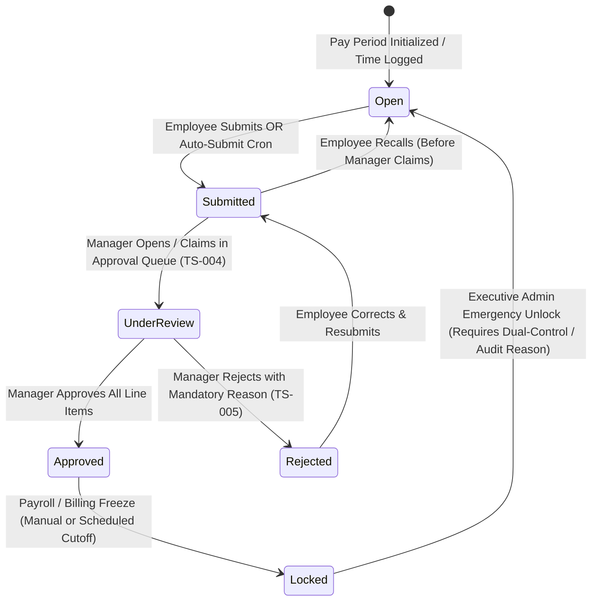

# PHASE 21: TIMESHEETS, PAY RATES, LOCK WORKFLOW & CLIENT BILLING

**Module Domain:** Enterprise Timesheet Governance, Multi-Tier Pay & Billable Rate Engine, Deterministic Lock State Machine, Forensic Modification Ledger, Client CRM & Automated PDF Invoicing  
**Screen Coverage:** `TS-001` through `TS-011`, `BILL-001` through `BILL-005`  
**Primary Storage Engines:** MySQL 8.0 InnoDB (Timesheets, Line Items, Pay Periods, Multi-Tier Rate Cards, Immutable Audit Ledger, Clients, Invoices), ClickHouse (Raw Time vs Timesheet Variance Aggregation), Redis 7 (Timesheet Lock Mutexes, Invoice Sequence Counters), S3/MinIO (Generated PDF/A-1b Invoices & Signed Timesheet Exports)  
**Backend Framework:** Fastify 4.x (REST + BullMQ Invoice/Payroll Freeze Workers)

---

## 1. Architectural Overview & Deterministic Lock State Machine

Phase 21 bridges raw time-tracking telemetry (Phases 13 & 20) and attendance records (Phase 16) into legally auditable, payroll-grade **Timesheets** and client-facing **Invoices**. It enforces a deterministic state machine (`TS-010`), a multi-tier pay/billable rate resolver (`TS-008` / `TS-009`), and an immutable SHA-256 hash-chained modification ledger (`TS-011`) where every post-creation edit requires a mandatory reason.

### 1.1 Deterministic Timesheet Lock State Machine (`TS-010`)



* **Hard State Invariants (`TS-010`):**
  1. **`OPEN`:** Employee can log manual time (if allowed by project/tenant policy), adjust task allocations, or edit notes. Desktop Agent and Browser Extension (`EXT-001`) can freely append time entries into `OPEN` periods.
  2. **`SUBMITTED` & `UNDER_REVIEW`:** Employee write access is frozen (`HTTP 423 Locked` on employee mutation endpoints). Managers with `timesheets:review` permission can adjust billable flags or hours only if they supply a mandatory `modification_reason` (`min 10 chars`), which is written atomically to `timesheet_modification_history` (`TS-011`).
  3. **`APPROVED`:** Freezes both employee and line-manager edits. Aggregates approved regular, overtime, holiday, and billable amounts into the payroll/billing staging tables.
  4. **`REJECTED` (`TS-005`):** Requires a non-empty `rejection_reason` and optional per-row rejection markers. Emits high-priority notification to the employee and unlocks the timesheet for correction and resubmission.
  5. **`LOCKED`:** Cryptographically seals the timesheet (`locked_hash = SHA256(timesheet_header || all_lines)`). Writes a Redis key `ts:lock:{tenantId}:{userId}:{periodStart}:{periodEnd}` so that any retroactive Desktop Agent offline sync, manual entry, or task time edit falling inside the locked date range is strictly rejected (`ERR_TIMESHEET_PERIOD_LOCKED`) or routed to a separate adjustment period.

---

## 2. Database Schema Definitions (MySQL 8.0 InnoDB)

```sql
-- ============================================================================
-- 1. PAY PERIOD CONFIGURATIONS (TS-007)
-- ============================================================================
CREATE TABLE pay_period_configs (
    id CHAR(36) NOT NULL PRIMARY KEY,
    tenant_id CHAR(36) NOT NULL,
    name VARCHAR(120) NOT NULL COMMENT 'e.g. US Bi-Weekly Engineering, India Monthly Staff',
    period_type ENUM('WEEKLY','BIWEEKLY','SEMI_MONTHLY','MONTHLY','CUSTOM') NOT NULL DEFAULT 'WEEKLY',
    week_start_day TINYINT UNSIGNED NOT NULL DEFAULT 1 COMMENT '1=Monday .. 7=Sunday',
    Anchor_date DATE NOT NULL COMMENT 'Reference start date for BIWEEKLY/CUSTOM calculation',
    custom_length_days SMALLINT UNSIGNED NULL,
    submission_due_offset_hours SMALLINT UNSIGNED NOT NULL DEFAULT 24 COMMENT 'Hours after period end before overdue',
    approval_due_offset_hours SMALLINT UNSIGNED NOT NULL DEFAULT 72,
    auto_submit_on_cutoff TINYINT(1) NOT NULL DEFAULT 1,
    auto_lock_on_approval TINYINT(1) NOT NULL DEFAULT 0,
    is_default TINYINT(1) NOT NULL DEFAULT 0,
    created_at TIMESTAMP(3) NOT NULL DEFAULT CURRENT_TIMESTAMP(3),
    updated_at TIMESTAMP(3) NOT NULL DEFAULT CURRENT_TIMESTAMP(3) ON UPDATE CURRENT_TIMESTAMP(3),
    KEY idx_pay_period_tenant (tenant_id, is_default)
) ENGINE=InnoDB DEFAULT CHARSET=utf8mb4 COLLATE=utf8mb4_unicode_ci;

-- ============================================================================
-- 2. EMPLOYEE PAY TYPES & MULTI-TIER PAY/BILLABLE RATES (TS-008, TS-009)
-- ============================================================================
CREATE TABLE employee_pay_rate_cards (
    id CHAR(36) NOT NULL PRIMARY KEY,
    tenant_id CHAR(36) NOT NULL,
    user_id CHAR(36) NOT NULL,
    pay_period_config_id CHAR(36) NOT NULL,
    pay_type ENUM('HOURLY','DAILY','MONTHLY') NOT NULL DEFAULT 'HOURLY',
    currency_code CHAR(3) NOT NULL DEFAULT 'USD',
    base_salary_or_rate DECIMAL(12,2) NOT NULL DEFAULT 0.00 COMMENT 'Hourly rate, Daily rate, or Monthly base',
    standard_hours_per_day DECIMAL(4,2) NOT NULL DEFAULT 8.00,
    standard_days_per_month DECIMAL(4,2) NOT NULL DEFAULT 22.00,
    regular_hourly_rate DECIMAL(10,4) NOT NULL COMMENT 'Normalized hourly cost rate',
    overtime_multiplier DECIMAL(4,2) NOT NULL DEFAULT 1.50,
    overtime_hourly_rate DECIMAL(10,4) NOT NULL COMMENT 'Explicit or regular * overtime_multiplier',
    holiday_multiplier DECIMAL(4,2) NOT NULL DEFAULT 2.00,
    holiday_hourly_rate DECIMAL(10,4) NOT NULL,
    default_client_billable_rate DECIMAL(10,4) NOT NULL DEFAULT 0.00,
    daily_overtime_threshold_hours DECIMAL(4,2) NOT NULL DEFAULT 8.00,
    weekly_overtime_threshold_hours DECIMAL(5,2) NOT NULL DEFAULT 40.00,
    effective_from DATE NOT NULL,
    effective_to DATE NULL COMMENT 'NULL = Currently Active Rate Card',
    created_by CHAR(36) NOT NULL,
    created_at TIMESTAMP(3) NOT NULL DEFAULT CURRENT_TIMESTAMP(3),
    KEY idx_rate_card_user_effective (tenant_id, user_id, effective_from, effective_to)
) ENGINE=InnoDB DEFAULT CHARSET=utf8mb4 COLLATE=utf8mb4_unicode_ci;

-- ============================================================================
-- 3. TIMESHEETS HEADER TABLE (TS-001..005, TS-010)
-- ============================================================================
CREATE TABLE timesheets (
    id CHAR(36) NOT NULL PRIMARY KEY,
    tenant_id CHAR(36) NOT NULL,
    user_id CHAR(36) NOT NULL,
    pay_period_config_id CHAR(36) NOT NULL,
    period_start_date DATE NOT NULL,
    period_end_date DATE NOT NULL,
    status ENUM('OPEN','SUBMITTED','UNDER_REVIEW','APPROVED','REJECTED','LOCKED') NOT NULL DEFAULT 'OPEN',
    reviewer_user_id CHAR(36) NULL,
    total_regular_hours DECIMAL(8,2) NOT NULL DEFAULT 0.00,
    total_overtime_hours DECIMAL(8,2) NOT NULL DEFAULT 0.00,
    total_holiday_hours DECIMAL(8,2) NOT NULL DEFAULT 0.00,
    total_paid_leave_hours DECIMAL(8,2) NOT NULL DEFAULT 0.00,
    total_logged_hours DECIMAL(8,2) NOT NULL DEFAULT 0.00,
    total_billable_hours DECIMAL(8,2) NOT NULL DEFAULT 0.00,
    total_non_billable_hours DECIMAL(8,2) NOT NULL DEFAULT 0.00,
    agent_tracked_hours DECIMAL(8,2) NOT NULL DEFAULT 0.00,
    manual_logged_hours DECIMAL(8,2) NOT NULL DEFAULT 0.00,
    currency_code CHAR(3) NOT NULL DEFAULT 'USD',
    calculated_regular_pay DECIMAL(14,2) NOT NULL DEFAULT 0.00,
    calculated_overtime_pay DECIMAL(14,2) NOT NULL DEFAULT 0.00,
    calculated_holiday_pay DECIMAL(14,2) NOT NULL DEFAULT 0.00,
    calculated_total_pay DECIMAL(14,2) NOT NULL DEFAULT 0.00,
    calculated_billable_amount DECIMAL(14,2) NOT NULL DEFAULT 0.00,
    employee_submission_note TEXT NULL,
    rejection_reason TEXT NULL,
    submitted_at TIMESTAMP(3) NULL,
    review_started_at TIMESTAMP(3) NULL,
    approved_at TIMESTAMP(3) NULL,
    rejected_at TIMESTAMP(3) NULL,
    locked_at TIMESTAMP(3) NULL,
    locked_by CHAR(36) NULL,
    locked_seal_hash CHAR(64) NULL COMMENT 'SHA-256 seal when status enters LOCKED',
    created_at TIMESTAMP(3) NOT NULL DEFAULT CURRENT_TIMESTAMP(3),
    updated_at TIMESTAMP(3) NOT NULL DEFAULT CURRENT_TIMESTAMP(3) ON UPDATE CURRENT_TIMESTAMP(3),
    UNIQUE KEY uq_user_period_timesheet (tenant_id, user_id, period_start_date, period_end_date),
    KEY idx_timesheets_status_period (tenant_id, status, period_end_date),
    KEY idx_timesheets_reviewer (tenant_id, reviewer_user_id, status)
) ENGINE=InnoDB DEFAULT CHARSET=utf8mb4 COLLATE=utf8mb4_unicode_ci;

-- ============================================================================
-- 4. TIMESHEET DAILY / TASK LINE ITEMS (TS-002, TS-003, TS-006)
-- ============================================================================
CREATE TABLE timesheet_lines (
    id CHAR(36) NOT NULL PRIMARY KEY,
    tenant_id CHAR(36) NOT NULL,
    timesheet_id CHAR(36) NOT NULL,
    user_id CHAR(36) NOT NULL,
    work_date DATE NOT NULL,
    project_id CHAR(36) NULL,
    task_id CHAR(36) NULL,
    client_id CHAR(36) NULL,
    source_type ENUM('AGENT_AUTO','BROWSER_EXT','MANUAL','LEAVE_SYNC') NOT NULL DEFAULT 'AGENT_AUTO',
    rate_tier ENUM('REGULAR','OVERTIME','HOLIDAY','LEAVE') NOT NULL DEFAULT 'REGULAR',
    logged_seconds INT UNSIGNED NOT NULL DEFAULT 0,
    logged_hours DECIMAL(6,2) NOT NULL DEFAULT 0.00,
    is_billable TINYINT(1) NOT NULL DEFAULT 1,
    applied_pay_rate DECIMAL(10,4) NOT NULL DEFAULT 0.00,
    applied_bill_rate DECIMAL(10,4) NOT NULL DEFAULT 0.00,
    line_pay_amount DECIMAL(12,2) NOT NULL DEFAULT 0.00,
    line_billable_amount DECIMAL(12,2) NOT NULL DEFAULT 0.00,
    invoice_id CHAR(36) NULL COMMENT 'Populated when billed on an invoice (BILL-005)',
    line_status ENUM('VALID','FLAGGED_DISCREPANCY','REJECTED_LINE','APPROVED_LINE','INVOICED') NOT NULL DEFAULT 'VALID',
    notes VARCHAR(500) NULL,
    created_at TIMESTAMP(3) NOT NULL DEFAULT CURRENT_TIMESTAMP(3),
    updated_at TIMESTAMP(3) NOT NULL DEFAULT CURRENT_TIMESTAMP(3) ON UPDATE CURRENT_TIMESTAMP(3),
    KEY idx_ts_lines_timesheet_date (timesheet_id, work_date),
    KEY idx_ts_lines_unbilled_client (tenant_id, client_id, is_billable, invoice_id, work_date),
    CONSTRAINT fk_tsl_timesheet FOREIGN KEY (timesheet_id) REFERENCES timesheets(id) ON DELETE CASCADE
) ENGINE=InnoDB DEFAULT CHARSET=utf8mb4 COLLATE=utf8mb4_unicode_ci;

-- ============================================================================
-- 5. IMMUTABLE TIMESHEET MODIFICATION HISTORY (TS-011)
-- ============================================================================
CREATE TABLE timesheet_modification_history (
    id CHAR(36) NOT NULL PRIMARY KEY,
    tenant_id CHAR(36) NOT NULL,
    timesheet_id CHAR(36) NOT NULL,
    timesheet_line_id CHAR(36) NULL,
    actor_user_id CHAR(36) NOT NULL,
    actor_role VARCHAR(64) NOT NULL,
    actor_ip VARCHAR(45) NOT NULL,
    action_type ENUM('STATE_TRANSITION','HOURS_ADJUSTED','BILLABLE_TOGGLED','RATE_OVERRIDDEN','MANUAL_LINE_ADDED','LINE_DELETED','EMERGENCY_UNLOCK') NOT NULL,
    field_changed VARCHAR(64) NOT NULL,
    old_value JSON NULL,
    new_value JSON NULL,
    mandatory_reason VARCHAR(1000) NOT NULL COMMENT 'Strictly enforced non-empty audit justification',
    prev_hash CHAR(64) NOT NULL,
    entry_hash CHAR(64) NOT NULL,
    created_at TIMESTAMP(3) NOT NULL DEFAULT CURRENT_TIMESTAMP(3),
    KEY idx_ts_mod_history_ts (tenant_id, timesheet_id, created_at DESC)
) ENGINE=InnoDB DEFAULT CHARSET=utf8mb4 COLLATE=utf8mb4_unicode_ci;

-- ============================================================================
-- 6. CLIENTS & BILLINGPROFILES (BILL-001, BILL-002, BILL-003)
-- ============================================================================
CREATE TABLE clients (
    id CHAR(36) NOT NULL PRIMARY KEY,
    tenant_id CHAR(36) NOT NULL,
    client_code VARCHAR(24) NOT NULL,
    company_name VARCHAR(180) NOT NULL,
    legal_entity_name VARCHAR(200) NULL,
    tax_vat_number VARCHAR(64) NULL,
    status ENUM('ACTIVE','ON_HOLD','INACTIVE','ARCHIVED') NOT NULL DEFAULT 'ACTIVE',
    primary_contact_name VARCHAR(120) NOT NULL,
    primary_contact_email VARCHAR(180) NOT NULL,
    billing_cc_emails JSON NULL,
    phone VARCHAR(40) NULL,
    billing_address JSON NOT NULL COMMENT '{line1, line2, city, state, postalCode, countryCode}',
    currency_code CHAR(3) NOT NULL DEFAULT 'USD',
    payment_terms ENUM('DUE_ON_RECEIPT','NET_7','NET_15','NET_30','NET_45','NET_60') NOT NULL DEFAULT 'NET_30',
    default_hourly_bill_rate DECIMAL(10,2) NOT NULL DEFAULT 0.00,
    default_tax_rate_pct DECIMAL(5,2) NOT NULL DEFAULT 0.00,
    default_discount_pct DECIMAL(5,2) NOT NULL DEFAULT 0.00,
    retainer_monthly_amount DECIMAL(14,2) NULL,
    account_manager_id CHAR(36) NULL,
    total_billed_amount DECIMAL(16,2) NOT NULL DEFAULT 0.00,
    total_paid_amount DECIMAL(16,2) NOT NULL DEFAULT 0.00,
    outstanding_balance DECIMAL(16,2) NOT NULL DEFAULT 0.00,
    created_at TIMESTAMP(3) NOT NULL DEFAULT CURRENT_TIMESTAMP(3),
    updated_at TIMESTAMP(3) NOT NULL DEFAULT CURRENT_TIMESTAMP(3) ON UPDATE CURRENT_TIMESTAMP(3),
    UNIQUE KEY uq_client_code (tenant_id, client_code),
    KEY idx_clients_status (tenant_id, status)
) ENGINE=InnoDB DEFAULT CHARSET=utf8mb4 COLLATE=utf8mb4_unicode_ci;

-- ============================================================================
-- 7. CLIENT INVOICES & LINE ITEMS (BILL-004, BILL-005)
-- ============================================================================
CREATE TABLE client_invoices (
    id CHAR(36) NOT NULL PRIMARY KEY,
    tenant_id CHAR(36) NOT NULL,
    client_id CHAR(36) NOT NULL,
    project_id CHAR(36) NULL COMMENT 'NULL if multi-project consolidated client invoice',
    invoice_number VARCHAR(40) NOT NULL COMMENT 'Sequential e.g. INV-2026-00418',
    status ENUM('DRAFT','ISSUED','PARTIALLY_PAID','PAID','OVERDUE','VOID') NOT NULL DEFAULT 'DRAFT',
    issue_date DATE NOT NULL,
    due_date DATE NOT NULL,
    billing_period_start DATE NOT NULL,
    billing_period_end DATE NOT NULL,
    currency_code CHAR(3) NOT NULL DEFAULT 'USD',
    subtotal_amount DECIMAL(15,2) NOT NULL DEFAULT 0.00,
    discount_type ENUM('PERCENTAGE','FIXED_AMOUNT') NOT NULL DEFAULT 'PERCENTAGE',
    discount_value DECIMAL(12,2) NOT NULL DEFAULT 0.00,
    discount_amount DECIMAL(15,2) NOT NULL DEFAULT 0.00,
    taxable_amount DECIMAL(15,2) NOT NULL DEFAULT 0.00,
    tax_label VARCHAR(40) NOT NULL DEFAULT 'VAT / Sales Tax',
    tax_rate_pct DECIMAL(5,2) NOT NULL DEFAULT 0.00,
    tax_amount DECIMAL(15,2) NOT NULL DEFAULT 0.00,
    total_amount DECIMAL(15,2) NOT NULL DEFAULT 0.00,
    amount_paid DECIMAL(15,2) NOT NULL DEFAULT 0.00,
    balance_due DECIMAL(15,2) NOT NULL DEFAULT 0.00,
    pdf_s3_object_key VARCHAR(512) NULL,
    notes_to_client TEXT NULL,
    payment_instructions TEXT NULL,
    created_by CHAR(36) NOT NULL,
    issued_at TIMESTAMP(3) NULL,
    paid_at TIMESTAMP(3) NULL,
    created_at TIMESTAMP(3) NOT NULL DEFAULT CURRENT_TIMESTAMP(3),
    updated_at TIMESTAMP(3) NOT NULL DEFAULT CURRENT_TIMESTAMP(3) ON UPDATE CURRENT_TIMESTAMP(3),
    UNIQUE KEY uq_invoice_number (tenant_id, invoice_number),
    KEY idx_invoices_client_status (tenant_id, client_id, status, due_date),
    CONSTRAINT fk_inv_client FOREIGN KEY (client_id) REFERENCES clients(id)
) ENGINE=InnoDB DEFAULT CHARSET=utf8mb4 COLLATE=utf8mb4_unicode_ci;

CREATE TABLE client_invoice_items (
    id CHAR(36) NOT NULL PRIMARY KEY,
    tenant_id CHAR(36) NOT NULL,
    invoice_id CHAR(36) NOT NULL,
    project_id CHAR(36) NULL,
    item_type ENUM('TIME_LOG_ROLLUP','MILESTONE','FIXED_FEE','RETAINER','EXPENSE_ADJUSTMENT') NOT NULL DEFAULT 'TIME_LOG_ROLLUP',
    description VARCHAR(500) NOT NULL,
    quantity_hours DECIMAL(10,2) NOT NULL DEFAULT 1.00,
    unit_rate DECIMAL(12,2) NOT NULL DEFAULT 0.00,
    line_total DECIMAL(15,2) NOT NULL DEFAULT 0.00,
    sort_order SMALLINT UNSIGNED NOT NULL DEFAULT 0,
    CONSTRAINT fk_inv_items_invoice FOREIGN KEY (invoice_id) REFERENCES client_invoices(id) ON DELETE CASCADE
) ENGINE=InnoDB DEFAULT CHARSET=utf8mb4 COLLATE=utf8mb4_unicode_ci;
```

---

## 3. Screen-by-Screen Engineering Specifications

### 3.1 `TS-001` — Timesheet Dashboard
* **Purpose:** Organization-wide timesheet compliance, payroll readiness, and billable capture overview for HR, Finance, and Operations Directors.
* **KPI Ribbon:**
  1. **Current Period Submission Rate %** (e.g., `94.2% — 412 / 437 Submitted`).
  2. **Pending Manager Approvals Count & Hours (`TS-004`)**.
  3. **Rejected & Awaiting Resubmission Count (`TS-005`)**.
  4. **Total Logged Hours (Regular / Overtime / Holiday Split)**.
  5. **Billable Utilization %** ($\frac{\text{Total Billable Hours}}{\text{Total Logged Hours}} \times 100$).
  6. **Estimated Period Payroll & Billable Revenue Totals**.
* **Visualizations:**
  * Stacked Bar Chart of Daily Logged Hours by Source (`Agent Auto`, `Browser Extension`, `Manual Entry`, `Paid Leave`).
  * Department Compliance Table showing `Open`, `Submitted`, `Under Review`, `Approved`, `Rejected`, and `Locked` counts with a "Send Bulk Reminder" button.
* **Fastify Endpoint:** `GET /api/v1/timesheets/dashboard?periodStart=2026-09-21&periodEnd=2026-09-27&departmentId=`

### 3.2 `TS-002` — Employee Timesheet Workspace
* **Purpose:** Self-service interactive weekly/biweekly/monthly timesheet grid where an employee inspects auto-populated Desktop Agent / Extension time, adds manual time (where permitted), attaches notes, and submits their period for approval.
* **Grid Layout:**
  * **Rows:** Grouped by `Project -> Task` + `Rate Tier (Regular / Overtime / Holiday)`.
  * **Columns:** Each day of the pay period (`Mon Sep 21` .. `Sun Sep 27`) + `Row Total` + `Billable Toggle` + `Notes`.
  * **Source Visual Indicators:** Cells populated by the Desktop Agent display a verified green shield icon (`Agent Verified`); manually edited or added cells display an amber pencil badge (`Manual`) and require a mandatory reason on save (`TS-011`).
  * **Footer Totals Row:** Daily column totals, Regular Hours, Overtime Hours, Holiday Hours, Paid Leave Hours, and Grand Total.
* **Action Bar:** `Add Row`, `Save Draft`, `Submit Timesheet` (opens confirmation modal with `employee_submission_note`), or `Recall Submission` (enabled only while `status = 'SUBMITTED'`).
* **Fastify Endpoints:**
  * `GET /api/v1/timesheets/me?periodStart=&periodEnd=`
  * `POST /api/v1/timesheets/:timesheetId/lines`
  * `PATCH /api/v1/timesheets/:timesheetId/lines/:lineId`
  * `POST /api/v1/timesheets/:timesheetId/submit`

### 3.3 `TS-003` — Manager Timesheet View
* **Purpose:** Team-level matrix enabling managers to inspect all direct reports' timesheets side-by-side, compare logged task hours against Phase 16 Attendance punch duration and Phase 13 active telemetry, and drill into any employee's daily screenshot/activity timeline.
* **Discrepancy Highlighting Badge:** If `ABS(timesheet.total_logged_hours - attendance_net_work_hours) > 0.50`, the row displays a `FLAGGED_DISCREPANCY` warning badge linking to the 4-Way Reconciliation modal (`DATA-002`).
* **Fastify Endpoint:** `GET /api/v1/timesheets/team?managerId=me&periodStart=&periodEnd=&status=`

### 3.4 `TS-004` — Timesheet Approval Queue
* **Purpose:** High-throughput triage queue for managers and finance approvers to claim, review, adjust, approve, or reject `SUBMITTED` timesheets.
* **Queue Mechanics:**
  * Clicking **"Review"** on a `SUBMITTED` timesheet transitions it to `UNDER_REVIEW` (`POST /api/v1/timesheets/:id/claim`) and places a 30-minute soft lock so two managers do not review the same timesheet concurrently.
  * Supports **Single-Item Review Drawer** (showing full daily breakdown, manual time percentage, overtime hours, and historical modification trail) and **Bulk Approve Selected** (for clean timesheets with `0` manual adjustments and `0` discrepancy flags).
* **Fastify Endpoints:**
  * `POST /api/v1/timesheets/:timesheetId/claim`
  * `POST /api/v1/timesheets/:timesheetId/approve`
  * `POST /api/v1/timesheets/bulk-approve`

### 3.5 `TS-005` — Rejected Timesheets Queue & Resolution Flow
* **Purpose:** Dedicated remediation view for employees and managers tracking all timesheets in `REJECTED` state.
* **Workflow:**
  * Displays the exact `rejection_reason`, rejecting manager's name/timestamp, and red-highlighted `REJECTED_LINE` cells.
  * When the employee modifies the rejected lines, every change is recorded in `TS-011` (`timesheet_modification_history`), and clicking **Resubmit** transitions the state `REJECTED -> SUBMITTED` while notifying the original reviewer.
* **Fastify Endpoint:** `POST /api/v1/timesheets/:timesheetId/reject` (`{ rejectionReason, rejectedLineIds[] }`)

### 3.6 `TS-006` — Billable Hours Matrix
* **Purpose:** Cross-dimensional pivot matrix analyzing Billable vs Non-Billable hours and revenue realization across `Clients x Projects x Employees x Weeks`.
* **Features:**
  * Toggle between **Hours View**, **Billable Revenue ($) View**, **Internal Cost ($) View**, and **Net Margin ($ / %) View**.
  * Inline bulk reclassification: Authorized managers can select non-billable lines and toggle `is_billable = 1` (or vice-versa) prior to `LOCKED` / `INVOICED` status with a mandatory audit reason (`TS-011`).
* **Fastify Endpoint:** `GET /api/v1/timesheets/billable-matrix?clientId=&projectId=&dateFrom=&dateTo=&groupBy=CLIENT,PROJECT,USER`

### 3.7 `TS-007` — Pay Period Configuration
* **Purpose:** Configure tenant or department-specific pay cycles (`WEEKLY`, `BIWEEKLY`, `SEMI_MONTHLY`, `MONTHLY`, `CUSTOM`).
* **Automation Controls:**
  * `week_start_day` (`Monday` / `Sunday` / `Saturday`).
  * `submission_due_offset_hours` & `approval_due_offset_hours`.
  * `auto_submit_on_cutoff`: When enabled, a BullMQ cron job (`timesheet-cutoff-worker`) automatically transitions `OPEN -> SUBMITTED` at the cutoff deadline and flags late/unreviewed items.
  * `auto_lock_on_approval`: Immediately transitions `APPROVED -> LOCKED` upon final approval.

### 3.8 `TS-008` — Pay Type Configuration (`Hourly`, `Daily`, `Monthly`)
* **Purpose:** Define how an employee's base compensation translates into normalized hourly cost rates and payroll accruals.
* **Normalization Formulas:**
  1. **`HOURLY`:** $\text{RegularHourlyRate} = \text{base\_salary\_or\_rate}$. Pay is strictly proportional to approved hours by tier.
  2. **`DAILY`:** $\text{RegularHourlyRate} = \frac{\text{base\_salary\_or\_rate}}{\text{standard\_hours\_per\_day}}$. Full day credit is earned when `logged_hours >= min_full_day_hours` (default `8.0h`); half-day or pro-rata applied otherwise.
  3. **`MONTHLY`:** $\text{RegularHourlyRate} = \frac{\text{base\_salary\_or\_rate}}{\text{standard\_days\_per\_month} \times \text{standard\_hours\_per\_day}}$. Used for internal project cost accounting (`PROJ-007`) and overtime/holiday premium add-ons above standard monthly hours.

### 3.9 `TS-009` — Multi-Tier Pay & Billable Rate Engine
* **Purpose:** Manage effective-dated rate cards and deterministic rate precedence resolution for `Regular Rate`, `Overtime Rate`, `Holiday Rate`, and `Client Billable Rate`.
* **Rate Precedence Hierarchy (Most Specific Wins):**
  * **For Client Billable Rate (`applied_bill_rate`):**
    1. `project_members.bill_rate_override` (Employee-specific rate on that Project)
    2. `projects.default_hourly_bill_rate` (Project default rate)
    3. `clients.default_hourly_bill_rate` (Client master rate)
    4. `employee_pay_rate_cards.default_client_billable_rate` (Employee global bill rate)
  * **For Internal Cost / Pay Rate (`applied_pay_rate`):**
    1. If `work_date` is a Tenant/Location Holiday -> `employee_pay_rate_cards.holiday_hourly_rate` (`rate_tier = 'HOLIDAY'`)
    2. Else if daily hours exceed `daily_overtime_threshold_hours` OR cumulative weekly hours exceed `weekly_overtime_threshold_hours` -> `employee_pay_rate_cards.overtime_hourly_rate` (`rate_tier = 'OVERTIME'`)
    3. Else -> `employee_pay_rate_cards.regular_hourly_rate` (`rate_tier = 'REGULAR'`).

### 3.10 `TS-010` — Timesheet Lock Governance Console
* **Purpose:** Administrative control plane for executing batch payroll freezes (`APPROVED -> LOCKED`), verifying cryptographic lock seals (`locked_seal_hash`), and handling controlled emergency unlocks.
* **Emergency Unlock Protocol:**
  * Transitioning `LOCKED -> OPEN` requires `timesheets:emergency_unlock` permission, a mandatory audit justification (`min 20 chars`), and cannot be executed if any line item on the timesheet has already been billed on an `ISSUED` or `PAID` invoice (`invoice_id IS NOT NULL`) unless a credit note / void occurs first.

### 3.11 `TS-011` — Immutable Timesheet Modification History
* **Purpose:** Forensic audit log viewer displaying every mutation to a timesheet header or line item across its entire lifecycle.
* **Columns Displayed:** `Timestamp (UTC & Local)`, `Actor Name & Role`, `IP Address`, `Action Type`, `Target Date / Project / Task`, `Old Value`, `New Value`, `Mandatory Reason`, and `SHA-256 Chain Status (Verified)`.
* **API Enforcement:** Any `PATCH`, `POST`, or `DELETE` request on `timesheets` or `timesheet_lines` after initial creation that omits `reason` (or provides fewer than 10 characters) is rejected at the Fastify TypeBox schema validation layer with `HTTP 400 Bad Request` (`ERR_MANDATORY_AUDIT_REASON_REQUIRED`).

---

### 3.12 `BILL-001` — Client & Revenue Dashboard
* **Purpose:** Executive financial overview of client accounts receivable, unbilled work-in-progress (WIP), invoice aging (`Current`, `1-30d`, `31-60d`, `61-90d`, `90d+ Overdue`), and top revenue-generating clients.
* **Fastify Endpoint:** `GET /api/v1/billing/dashboard?currency=USD&dateFrom=&dateTo=`

### 3.13 `BILL-002` — Client List & Account Directory
* **Purpose:** Searchable CRM directory of all client organizations showing `Client Code`, `Company Name`, `Primary Contact`, `Active Projects Count`, `Unbilled Hours / WIP ($)`, `Total Billed ($)`, `Total Paid ($)`, `Outstanding Balance ($)`, and `Payment Terms`.
* **Fastify Endpoints:** `GET / POST /api/v1/billing/clients`

### 3.14 `BILL-003` — 5-Tab Client Profile Workspace
* **Purpose:** Complete account management view for a single client (`GET /api/v1/billing/clients/:clientId`).
* **5 Structured Tabs:**
  1. **Overview & Contacts Tab:** Legal entity details, tax/VAT ID, billing address, payment terms, default tax/discount rates, and contact roster.
  2. **Projects Tab:** All active and historical projects linked to this client (`PROJ-002` scoped to `client_id`) with budget burn indicators.
  3. **Unbilled Time & Milestones Tab:** All approved, unbilled `timesheet_lines` (`is_billable = 1 AND invoice_id IS NULL`) and completed billable milestones (`PROJ-009`) ready to be swept into an invoice.
  4. **Invoices & Payments Tab:** Complete ledger of `client_invoices` (`DRAFT`, `ISSUED`, `PARTIALLY_PAID`, `PAID`, `OVERDUE`, `VOID`) with payment recording modal.
  5. **Rate Card Overrides Tab:** Client-specific role and employee hourly rate overrides.

### 3.15 `BILL-004` — Billing & Invoice Operations Dashboard
* **Purpose:** Operational workbench for finance teams to manage the invoice lifecycle, track overdue receivables, trigger automated dunning reminders, and reconcile payments.
* **Fastify Endpoints:**
  * `GET /api/v1/billing/invoices?status=&clientId=&overdueOnly=`
  * `POST /api/v1/billing/invoices/:invoiceId/record-payment`

### 3.16 `BILL-005` — Interactive PDF Invoice Generator (with Tax & Discount Engine)
* **Purpose:** WYSIWYG invoice composer and deterministic financial calculator that sweeps unbilled approved timesheet hours and fixed milestones into a locked PDF/A-1b invoice stored in S3/MinIO.
* **Line Item Grouping Modes:** When importing unbilled time entries (`POST /api/v1/billing/invoices/preview-unbilled`), the user can choose to group line items by:
  * `By Project -> By Task`
  * `By Project -> By Employee`
  * `By Employee -> By Day (Detailed Timesheet Appendix attached)`
  * `Single Consolidated Line per Project`
* **Deterministic Invoice Math Engine (Banker's Rounding to 2 Decimal Places):**
  1. $\text{Subtotal} = \sum_{i=1}^{n} \text{round}_2(\text{quantity\_hours}_i \times \text{unit\_rate}_i)$
  2. $\text{DiscountAmount} = \begin{cases} \text{round}_2\left(\text{Subtotal} \times \frac{\text{discount\_value}}{100}\right) & \text{if PERCENTAGE} \\ \min(\text{Subtotal}, \text{discount\_value}) & \text{if FIXED\_AMOUNT} \end{cases}$
  3. $\text{TaxableAmount} = \text{Subtotal} - \text{DiscountAmount}$
  4. $\text{TaxAmount} = \text{round}_2\left(\text{TaxableAmount} \times \frac{\text{tax\_rate\_pct}}{100}\right)$
  5. $\text{TotalAmount} = \text{TaxableAmount} + \text{TaxAmount}$
  6. $\text{BalanceDue} = \text{TotalAmount} - \text{AmountPaid}$
* **Transactional Finalization (`POST /api/v1/billing/invoices/:invoiceId/issue`):**
  1. Atomically assigns the next gapless sequential `invoice_number` using a locked tenant sequence row (`SELECT ... FOR UPDATE` on `tenant_invoice_sequences`).
  2. Marks all included `timesheet_lines.invoice_id = :invoiceId` and `line_status = 'INVOICED'` so they can never be double-billed.
  3. Renders the vector PDF invoice (with tenant logo, tax/VAT registration, QR payment link, and optional timesheet appendix) via headless Chromium/PDFKit worker, uploads to S3/MinIO, and returns a 15-minute pre-signed download URL.

---

## 4. RBAC Permissions, Audit Events & Acceptance Criteria

### 4.1 RBAC Permission Matrix

| Permission Key | Super Admin | Org Admin | Finance / Payroll | Manager | Employee | Client Guest |
| :--- | :---: | :---: | :---: | :---: | :---: | :---: |
| `timesheets:self:view_submit` | Yes | Yes | Yes | Yes | Yes | No |
| `timesheets:team:review_approve` | Yes | Yes | Yes | Direct Reports | No | No |
| `timesheets:rates:manage` | Yes | Yes | Yes | No | No | No |
| `timesheets:period:lock` | Yes | Yes | Yes | No | No | No |
| `timesheets:emergency_unlock` | Yes | Yes | No | No | No | No |
| `timesheets:audit_history:view` | Yes | Yes | Yes | Direct Reports | Own Only | No |
| `billing:clients:manage` | Yes | Yes | Yes | View Assigned | No | Own Profile |
| `billing:invoices:generate_issue` | Yes | Yes | Yes | No | No | View Own Issued |

### 4.2 Engineering Acceptance Criteria
1. **Strict Lock Enforcement (`TS-010`):** Once a timesheet transitions to `LOCKED`, any attempt to insert, update, or delete a time entry within `[period_start_date, period_end_date]` for that user via REST API, Desktop Agent sync, or Browser Extension must fail with `423 ERR_TIMESHEET_PERIOD_LOCKED`.
2. **Mandatory Modification Reason (`TS-011`):** Every edit to a timesheet line item or status transition must write an immutable record to `timesheet_modification_history` containing Actor ID, IP, Old Value, New Value, Timestamp, Mandatory Reason, and valid SHA-256 hash chain.
3. **Zero Double-Billing Guarantee (`BILL-005`):** Issuing an invoice must run inside a serializable/row-locked MySQL transaction that verifies `timesheet_lines.invoice_id IS NULL` for all included lines before stamping `invoice_id`. Concurrent attempts to bill the same timesheet lines must fail with `409 ERR_LINES_ALREADY_INVOICED`.
