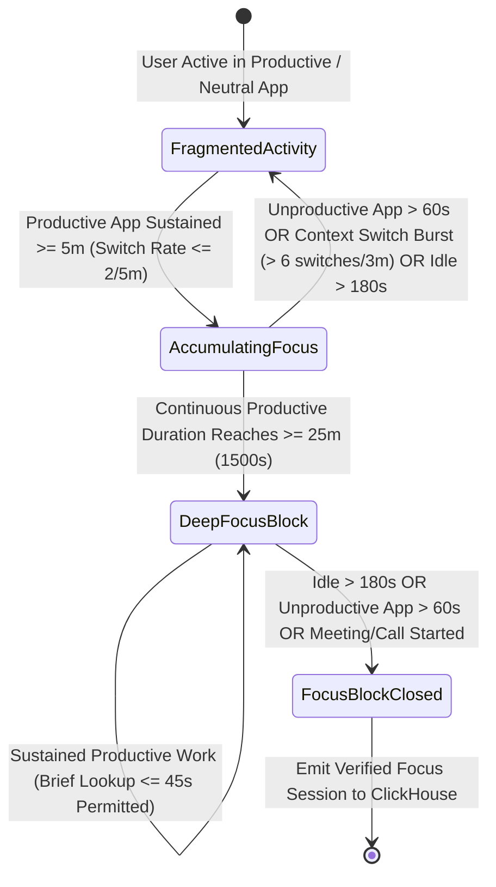

# PHASE 22: WORKFORCE ANALYTICS, UTILIZATION, HEATMAPS & WORK PATTERNS

**Module Domain:** High-Velocity OLAP Workforce Intelligence, Capacity vs Utilization Reconciliation, Deep-Work Focus Time Engine, Idle Pattern Forensics, Multi-Horizon ClickHouse Materialized Heatmaps & Behavioral Work Pattern Clustering  
**Screen Coverage:** `ANA-001` through `ANA-011`, `PATTERN-001`, `PATTERN-002`  
**Primary Storage Engines:** ClickHouse 24.x (Primary OLAP Engine for 1-Minute Heartbeat Rollups, Sessionized Focus Blocks, Idle Bursts, and Day/Week/Month/Quarter/Year/Lifetime Materialized Views), MySQL 8.0 InnoDB (Shift Capacity Baselines, Workload Rebalancing Recommendations, Saved Cohort Filters), Redis 7 (Sub-Second Heatmap Query Cache & Live Focus Session Trackers)  
**Backend Framework:** Fastify 4.x (High-Throughput Analytics API + ClickHouse Native Binary Stream Client)

---

## 1. Architectural Overview & Algorithmic Engines

Phase 22 transforms billions of raw 60-second Desktop Agent telemetry heartbeats, window/application transitions, keyboard/mouse activity intervals, and project allocations into executive and operational workforce intelligence. All analytical queries execute against pre-aggregated **ClickHouse Materialized Views (`SummingMergeTree` / `AggregatingMergeTree`)** to guarantee `< 120ms` p95 response times even when querying **Lifetime (`ANA-010`)** horizons across `10,000+` employees.

### 1.1 The Focus Time & Context-Switching Engine (`ANA-008`)



* **Engineering Rules of the Focus Time Engine (`ANA-008`):**
  1. **Minimum Deep-Work Threshold:** A session qualifies as a **Deep-Work Focus Block** if and only if the employee sustains continuous work in `PRODUCTIVE`-classified applications/URLs for **`>= 25 minutes` (`1,500 seconds`)** without:
     * Any idle gap exceeding `180 seconds` (`3 minutes`),
     * Any `UNPRODUCTIVE` application/domain exposure exceeding `60 seconds`, or
     * A high-frequency context-switching burst (`> 6` distinct application/window-title switches within any rolling `180-second` window).
  2. **Brief Reference Tolerance:** Switching to a `NEUTRAL` reference tool (e.g., internal documentation or terminal lookup) for `<= 45 seconds` before returning to the primary productive application does **not** break the focus streak.
  3. **Context-Switching Frequency Index ($CSFI$):**
     $$\text{CSFI} = \frac{\text{Total App/Domain Transitions}}{\text{Total Active Hours}}$$
     Employees with $\text{CSFI} > 45\text{ switches/hour}$ are flagged for high cognitive fragmentation.

---

## 2. Database Schema Definitions

### 2.1 ClickHouse OLAP Tables & Multi-Horizon Materialized Views (`ANA-001`..`ANA-011`)

```sql
-- ============================================================================
-- 1. HOURLY WORKFORCE ACTIVITY & PRODUCTIVITY ROLLUP (ANA-001..007, ANA-011)
-- ============================================================================
CREATE TABLE hydi_telemetry.workforce_hourly_rollup
(
    tenant_id UUID,
    department_id UUID,
    team_id UUID,
    user_id UUID,
    work_date Date,
    hour_of_day UInt8 COMMENT '0..23 in user local timezone',
    day_of_week UInt8 COMMENT '1=Mon .. 7=Sun',
    tracked_seconds UInt64,
    active_seconds UInt64,
    idle_seconds UInt64,
    productive_seconds UInt64,
    neutral_seconds UInt64,
    unproductive_seconds UInt64,
    focus_deep_work_seconds UInt64,
    meeting_seconds UInt64,
    offline_manual_seconds UInt64,
    context_switches_count UInt32,
    keystrokes_bucket_count UInt32,
    mouse_movements_bucket_count UInt32
)
ENGINE = SummingMergeTree()
PARTITION BY toYYYYMM(work_date)
ORDER BY (tenant_id, department_id, team_id, user_id, work_date, hour_of_day);

-- ============================================================================
-- 2. VERIFIED FOCUS TIME SESSIONS TABLE (ANA-008)
-- ============================================================================
CREATE TABLE hydi_telemetry.focus_work_sessions
(
    tenant_id UUID,
    department_id UUID,
    team_id UUID,
    user_id UUID,
    session_id UUID,
    work_date Date,
    started_at DateTime64(3, 'UTC'),
    ended_at DateTime64(3, 'UTC'),
    duration_seconds UInt32 COMMENT 'Guaranteed >= 1500 seconds (25m)',
    primary_app_name LowCardinality(String),
    primary_category LowCardinality(String),
    project_id Nullable(UUID),
    task_id Nullable(UUID),
    internal_switches_count UInt16,
    interrupted_by Enum8('IDLE_TIMEOUT' = 1, 'UNPRODUCTIVE_SWITCH' = 2, 'MEETING_CALL' = 3, 'CHAT_BURST' = 4, 'SHIFT_END' = 5),
    interrupting_app_name LowCardinality(String)
)
ENGINE = MergeTree()
PARTITION BY toYYYYMM(work_date)
ORDER BY (tenant_id, user_id, work_date, started_at);

-- ============================================================================
-- 3. GRANULAR IDLE EPISODES & REPEATED PATTERN TABLE (ANA-009)
-- ============================================================================
CREATE TABLE hydi_telemetry.idle_episodes
(
    tenant_id UUID,
    department_id UUID,
    team_id UUID,
    user_id UUID,
    episode_id UUID,
    work_date Date,
    hour_of_day UInt8,
    day_of_week UInt8,
    idle_started_at DateTime64(3, 'UTC'),
    idle_ended_at DateTime64(3, 'UTC'),
    idle_duration_seconds UInt32,
    preceding_app_name LowCardinality(String),
    resumed_app_name LowCardinality(String),
    was_reclassified_as_meeting UInt8 DEFAULT 0,
    is_repeated_time_slot_pattern UInt8 DEFAULT 0 COMMENT '1 if occurs in same 30m slot >= 3 days/week'
)
ENGINE = MergeTree()
PARTITION BY toYYYYMM(work_date)
ORDER BY (tenant_id, user_id, work_date, idle_started_at);

-- ============================================================================
-- 4. LIFETIME & MULTI-HORIZON PRODUCTIVITY HEATMAP MV (ANA-010)
-- Pre-aggregates Day, Week, Month, Quarter, Year & Lifetime buckets
-- ============================================================================
CREATE TABLE hydi_telemetry.productivity_heatmap_daily_agg
(
    tenant_id UUID,
    department_id UUID,
    team_id UUID,
    user_id UUID,
    work_date Date,
    year_num UInt16,
    quarter_num UInt8,
    month_num UInt8,
    iso_week_start Date,
    tracked_seconds SimpleAggregateFunction(sum, UInt64),
    active_seconds SimpleAggregateFunction(sum, UInt64),
    idle_seconds SimpleAggregateFunction(sum, UInt64),
    productive_seconds SimpleAggregateFunction(sum, UInt64),
    neutral_seconds SimpleAggregateFunction(sum, UInt64),
    unproductive_seconds SimpleAggregateFunction(sum, UInt64),
    focus_seconds SimpleAggregateFunction(sum, UInt64)
)
ENGINE = AggregatingMergeTree()
PARTITION BY year_num
ORDER BY (tenant_id, department_id, team_id, user_id, work_date);

CREATE MATERIALIZED VIEW hydi_telemetry.mv_productivity_heatmap_daily
TO hydi_telemetry.productivity_heatmap_daily_agg
AS SELECT
    tenant_id,
    department_id,
    team_id,
    user_id,
    work_date,
    toYear(work_date) AS year_num,
    toQuarter(work_date) AS quarter_num,
    toMonth(work_date) AS month_num,
    toMonday(work_date) AS iso_week_start,
    sum(tracked_seconds) AS tracked_seconds,
    sum(active_seconds) AS active_seconds,
    sum(idle_seconds) AS idle_seconds,
    sum(productive_seconds) AS productive_seconds,
    sum(neutral_seconds) AS neutral_seconds,
    sum(unproductive_seconds) AS unproductive_seconds,
    sum(focus_deep_work_seconds) AS focus_seconds
FROM hydi_telemetry.workforce_hourly_rollup
GROUP BY tenant_id, department_id, team_id, user_id, work_date;
```

### 2.2 MySQL 8.0 InnoDB Schema (Workload Balancing & Pattern Snapshots)

```sql
CREATE TABLE workforce_utilization_snapshots (
    id CHAR(36) NOT NULL PRIMARY KEY,
    tenant_id CHAR(36) NOT NULL,
    user_id CHAR(36) NOT NULL,
    department_id CHAR(36) NULL,
    team_id CHAR(36) NULL,
    snapshot_date DATE NOT NULL,
    available_capacity_hours DECIMAL(6,2) NOT NULL DEFAULT 8.00 COMMENT 'Shift hours minus leave/holiday',
    allocated_capacity_hours DECIMAL(6,2) NOT NULL DEFAULT 0.00 COMMENT 'Sum of project_members daily allocation',
    actual_worked_hours DECIMAL(6,2) NOT NULL DEFAULT 0.00 COMMENT 'Actual tracked + approved manual hours',
    productive_hours DECIMAL(6,2) NOT NULL DEFAULT 0.00,
    focus_hours DECIMAL(6,2) NOT NULL DEFAULT 0.00,
    idle_hours DECIMAL(6,2) NOT NULL DEFAULT 0.00,
    utilization_pct DECIMAL(6,2) NOT NULL DEFAULT 0.00 COMMENT '(actual_worked_hours / available_capacity_hours) * 100',
    allocation_accuracy_pct DECIMAL(6,2) NOT NULL DEFAULT 0.00 COMMENT '(actual_worked_hours / allocated_capacity_hours) * 100',
    workload_band ENUM('UNDERUTILIZED','OPTIMAL','HIGH_LOAD','BURNOUT_RISK') NOT NULL DEFAULT 'OPTIMAL',
    work_pattern_archetype ENUM('CONSISTENT_CORE','EARLY_SPRINTER','LATE_SURGER','FRAGMENTED_MULTITASKER','DEEP_WORK_SPECIALIST','ERRATIC') NOT NULL DEFAULT 'CONSISTENT_CORE',
    created_at TIMESTAMP(3) NOT NULL DEFAULT CURRENT_TIMESTAMP(3),
    UNIQUE KEY uq_util_user_date (tenant_id, user_id, snapshot_date),
    KEY idx_util_dept_date (tenant_id, department_id, snapshot_date, workload_band)
) ENGINE=InnoDB DEFAULT CHARSET=utf8mb4 COLLATE=utf8mb4_unicode_ci;
```

---

## 3. Screen-by-Screen Engineering Specifications

### 3.1 `ANA-001` — Enterprise Workforce Analytics Dashboard
* **Purpose:** C-Suite and Operations command center synthesizing organization-wide productivity, utilization, deep-work focus ratio, idle leakage, and burnout risk indicators.
* **KPI Ribbon (6 Cards with Period-over-Period Delta %):**
  1. **Organization Productivity Score %:** $\frac{\text{Productive Seconds}}{\text{Active Seconds}} \times 100$.
  2. **Workforce Utilization Rate % (`ANA-002`):** $\frac{\text{Actual Worked Hours}}{\text{Available Capacity Hours}} \times 100$.
  3. **Deep-Work Focus Ratio % (`ANA-008`):** $\frac{\text{Focus Deep-Work Hours (`>=25m`)}}{\text{Total Tracked Hours}} \times 100$.
  4. **Idle Time Ratio % (`ANA-009`):** $\frac{\text{Idle Seconds}}{\text{Tracked Seconds}} \times 100$.
  5. **Average Active Workday Span:** Mean `First Activity` to `Last Activity` vs Net Active Hours.
  6. **Burnout Risk Headcount (`ANA-003`):** Count of employees working `> 115%` capacity for `>= 10` consecutive workdays.
* **Fastify Endpoint:** `GET /api/v1/analytics/overview?dateFrom=&dateTo=&departmentId=&teamId=&locationId=`

### 3.2 `ANA-002` — Workforce Utilization (Available Capacity vs Allocated Capacity vs Actual Work)
* **Purpose:** Three-tier capacity reconciliation comparing what the organization **paid for** (Available Capacity), what project managers **planned** (Allocated Capacity), and what employees **actually executed** (Actual Work).
* **Core Mathematical Definitions:**
  * **Available Capacity ($C_{\text{avail}}$):** $\sum (\text{Standard Shift Hours} - \text{Public Holiday Hours} - \text{Approved Leave Hours})$.
  * **Allocated Capacity ($C_{\text{alloc}}$):** $\sum \text{project\_members.allocated\_hours\_per\_day}$ across active projects (`PROJ-014`).
  * **Actual Work ($W_{\text{actual}}$):** $\sum (\text{Active Tracked Hours} + \text{Approved Manual/Meeting Hours})$.
  * **Planning Gap:** $C_{\text{avail}} - C_{\text{alloc}}$ (Unallocated bench capacity).
  * **Execution Variance:** $W_{\text{actual}} - C_{\text{alloc}}$ (Over/under-burn against project plan).
  * **Realized Utilization %:** $\frac{W_{\text{actual}}}{\max(0.01, C_{\text{avail}})} \times 100$.
* **Visualizations:**
  * **Triple-Bar Combo Chart by Week/Department:** Side-by-side bars for `Available Capacity`, `Allocated Capacity`, and `Actual Work` with a spline overlay for `Realized Utilization %`.
  * **Utilization Waterfall Chart:** Bridges `Gross Contracted Hours` $\to$ `Minus PTO/Holidays` (= `Available Capacity`) $\to$ `Minus Unallocated Bench` (= `Allocated Capacity`) $\to$ `Minus Idle/Unproductive Leakage` (= `Net Productive Output`).
* **Fastify Endpoint:** `GET /api/v1/analytics/utilization?dateFrom=&dateTo=&groupBy=DEPARTMENT|TEAM|ROLE|USER`

### 3.3 `ANA-003` — Employee Workload Matrix & Load Balancing Workbench
* **Purpose:** Identify overloaded (burnout-risk) and underutilized employees within each role/skill group and execute data-driven task/project load balancing.
* **Workload Classification Bands (`workload_band`):**
  * `UNDERUTILIZED`: Utilization `< 65%`
  * `OPTIMAL`: Utilization `65% – 92%`
  * `HIGH_LOAD`: Utilization `93% – 110%`
  * `BURNOUT_RISK`: Utilization `> 110%` or `> 9.5h/day` actual work sustained for `>= 5` days.
* **Interactive Load-Balancing Assistant:**
  * Displays overloaded employees on the left pane and underutilized employees sharing the same `department_id` / `skill_tags` on the right pane.
  * Managers can select open tasks (`TASK-001`) from a `BURNOUT_RISK` employee and drag them to an `OPTIMAL` / `UNDERUTILIZED` teammate, previewing the post-transfer utilization % of both employees before committing (`POST /api/v1/analytics/workload/rebalance`).

### 3.4 `ANA-004` — Department Analytics
* **Purpose:** Comparative benchmark scoreboard across all organizational departments (e.g., *Platform Engineering, Product Design, QA, Customer Success, Sales, Finance*).
* **Metrics Compared:** Headcount, Attendance Rate %, Avg Daily Active Hours, Productivity %, Deep-Work Focus Hours/Day, Context-Switch Rate, Idle %, Overtime Hours, and Cost-per-Productive-Hour.
* **Fastify Endpoint:** `GET /api/v1/analytics/departments?dateFrom=&dateTo=`

### 3.5 `ANA-005` — Team Analytics
* **Purpose:** Squad/Team-level operational analytics for Engineering Managers and Team Leads.
* **Features:**
  * Intra-team distribution box-plots (Min, P25, Median, P75, Max) for Active Hours and Focus Time.
  * Collaboration vs Deep-Work Balance Gauge (comparing time spent in Slack/Teams/Zoom vs IDE/Core Tools).
  * Sprint Velocity correlation with Team Focus Time (`PROJ-010` x `ANA-008`).
* **Fastify Endpoint:** `GET /api/v1/analytics/teams/:teamId?dateFrom=&dateTo=`

### 3.6 `ANA-006` — Individual Employee Analytics 360
* **Purpose:** Comprehensive longitudinal performance, focus, attendance, and work-habit profile for a single employee (`GET /api/v1/analytics/employees/:userId`).
* **Sections:**
  1. **Personal KPI Summary vs Team Benchmark Peer Percentile** (e.g., *Focus Time: 4.2h/day — Top 15% of Backend Engineering*).
  2. **Daily Activity Timeline & Intraday Energy Curve:** Typical start time, peak productive hours, post-lunch dip, and sign-off consistency.
  3. **Top 10 Productive vs Unproductive Applications & Domains Breakdown.**
  4. **Task & Project Time Allocation Donut.**
  5. **30-Day Rolling Productivity & Focus Trend.**

### 3.7 `ANA-007` — Daily / Weekly / Monthly / Yearly Productivity Trends
* **Purpose:** Multi-granularity time-series decomposition engine with moving averages (`7d MA`, `30d MA`), seasonality adjustments, and anomaly markers.
* **Granularity Selector:** Instant toggle between `DAILY`, `WEEKLY`, `MONTHLY`, `QUARTERLY`, and `YEARLY` bucketing powered by `hydi_telemetry.productivity_heatmap_daily_agg`.
* **Fastify Endpoint:** `GET /api/v1/analytics/trends?granularity=DAILY|WEEKLY|MONTHLY|YEARLY&dateFrom=&dateTo=&departmentId=`

### 3.8 `ANA-008` — Focus Time Engine Analytics (`>=25m` Deep-Work Blocks vs Context Switching)
* **Purpose:** Quantify uninterrupted deep-work capacity and pinpoint the exact sources of workplace distraction and cognitive fragmentation.
* **Visualizations & Tables:**
  1. **Daily Focus Breakdown Stacked Bar:** Splits every employee's day into **Deep Focus (`>=25m` blocks)**, **Shallow/Fragmented Productive (`<25m` segments)**, **Collaborative/Meetings**, **Neutral**, **Unproductive**, and **Idle**.
  2. **Focus Block Duration Histogram:** Distribution of focus sessions across `25–45m`, `45–60m`, `60–90m`, and `90m+` flow states.
  3. **Top Focus Interrupters Leaderboard:** Aggregates `focus_work_sessions.interrupted_by` and `interrupting_app_name` to reveal what breaks deep work most frequently (e.g., *42% Slack notification switches, 28% unplanned ad-hoc calls, 19% browser distraction*).
  4. **Context-Switching vs Bug Introduction Scatter Plot:** Correlates developer `context_switches_count` per hour against bug reopen counts (`PROJ-011`).
* **Fastify Endpoint:** `GET /api/v1/analytics/focus-time?dateFrom=&dateTo=&departmentId=&teamId=&userId=`

### 3.9 `ANA-009` — Idle Analysis (Total, Average, Longest & Repeated Idle Patterns)
* **Purpose:** Forensic analysis of computer inactivity to distinguish legitimate breaks/offline meetings from chronic disengagement or systematic time-slot absence.
* **Key Metrics Computed per Employee & Team:**
  1. **Total Idle Time:** Sum of `idle_duration_seconds` across the selected period.
  2. **Idle Percentage:** $\frac{\text{Total Idle Seconds}}{\text{Total Tracked Seconds}} \times 100$.
  3. **Average Idle Episode Duration:** Mean length of individual idle episodes (e.g., `6m 12s`).
  4. **Longest Single Idle Episode:** Maximum unbroken idle block (`max(idle_duration_seconds)`) with exact timestamp and preceding/resumed application context.
  5. **Repeated Idle Pattern Detection (`is_repeated_time_slot_pattern`):**
     * A ClickHouse window query partitions each employee's workweek into 48 half-hour buckets (`00:00`, `00:30`, ..., `23:30`).
     * If an employee exhibits `>= 15 minutes` of unexcused idle time inside the **exact same 30-minute time-of-day bucket on `>= 3` workdays within a 5-day rolling window** (excluding configured lunch windows), the engine flags a **Repeated Idle Pattern** (e.g., *Every Mon/Tue/Thu/Fri between 15:00 and 15:45*).
* **Fastify Endpoint:** `GET /api/v1/analytics/idle-forensics?dateFrom=&dateTo=&departmentId=&onlyRepeatedPatterns=true`

### 3.10 `ANA-010` — Lifetime Productivity Heatmap (Day / Week / Month / Quarter / Year / Lifetime)
* **Purpose:** Ultra-fast multi-zoom contribution and productivity intensity calendar heatmap (GitHub-style 365-day grid + multi-year matrix) powered by `hydi_telemetry.mv_productivity_heatmap_daily`.
* **6 Zoom Horizons:**
  * `DAY`: 24-hour x 12 five-minute micro-segment intensity strip.
  * `WEEK`: 7-day x 24-hour grid.
  * `MONTH`: Calendar month day tiles.
  * `QUARTER`: 13-week x 7-day matrix.
  * `YEAR`: 52-week x 7-day full-year contribution matrix.
  * `LIFETIME`: Multi-year stacked annual matrices from the employee's `hire_date` (or tenant inception) through today, rendered in `< 80ms` by reading pre-summed rows from `productivity_heatmap_daily_agg`.
* **Color Intensity Scale:** 5-stop emerald gradient mapped to `Productivity Score %` or `Net Productive Hours` (`0h`, `1-3h`, `3-5h`, `5-7h`, `7h+`).
* **Fastify Endpoint:** `GET /api/v1/analytics/heatmap/lifetime?scope=ORG|DEPT|TEAM|USER&targetId=&horizon=DAY|WEEK|MONTH|QUARTER|YEAR|LIFETIME`

### 3.11 `ANA-011` — 24x7 Hour x Day Activity Heatmap
* **Purpose:** 168-cell (`7 Days of Week x 24 Hours of Day`) behavioral matrix showing when the organization, department, team, or individual is most active, most productive, in deep focus, or idle.
* **Metric Layer Switcher:** Users can switch the cell value metric between:
  * `Active Intensity %`
  * `Productivity Score %`
  * `Deep Focus Probability %`
  * `Idle Concentration %`
  * `Context-Switching Rate`
* **Fastify Endpoint:** `GET /api/v1/analytics/heatmap/24x7?metric=PRODUCTIVITY|ACTIVE|FOCUS|IDLE&departmentId=&teamId=&userId=&dateFrom=&dateTo=`

### 3.12 `PATTERN-001` — Work Pattern Analysis & Behavioral Archetypes
* **Purpose:** Unsupervised behavioral clustering that classifies work habits into actionable work-pattern archetypes (`work_pattern_archetype`) and detects schedule drift, late-night work creep, and weekend overwork.
* **6 Behavioral Archetypes Detected:**
  1. **`CONSISTENT_CORE`:** `>= 80%` of active hours fall within standard shift hours with steady intraday pacing.
  2. **`EARLY_SPRINTER`:** Peaks in focus and productivity between `06:00–11:30`, tapering in late afternoon.
  3. **`LATE_SURGER`:** >35% of active/focus work occurs after `18:00` local time.
  4. **`DEEP_WORK_SPECIALIST`:** Achieves `>= 3.5 hours/day` in uninterrupted `>=25m` focus blocks with low context switching (`CSFI < 18/hr`).
  5. **`FRAGMENTED_MULTITASKER`:** High active hours but `< 45m/day` in `>=25m` focus blocks due to constant app/chat switching (`CSFI > 45/hr`).
  6. **`ERRATIC`:** High day-to-day standard deviation ($\sigma_{\text{daily\_hours}} > 2.8\text{h}$) in start time and work duration.
* **Fastify Endpoint:** `GET /api/v1/analytics/patterns/work-archetypes?departmentId=&teamId=&dateFrom=&dateTo=`

### 3.13 `PATTERN-002` — Multi-Team & Cohort Trend Comparisons
* **Purpose:** Side-by-side radar chart and multi-line time-series comparator allowing leadership to benchmark up to **6 Teams, Locations, Shift Cohorts, or Work Modes (`Remote` vs `Hybrid` vs `In-Office`)** simultaneously across 8 normalized axes (`Productivity %`, `Utilization %`, `Focus Ratio %`, `Attendance Punctuality %`, `Task Completion Velocity`, `Low Idle %`, `Low Context Switching`, `Schedule Stability`).
* **Fastify Endpoint:** `POST /api/v1/analytics/patterns/compare-cohorts` (`{ cohorts: [{ type: 'TEAM'|'DEPT'|'WORK_MODE', id }], dateFrom, dateTo }`)

---

## 4. RBAC Permissions, Audit Events & Acceptance Criteria

### 4.1 RBAC Permission Matrix

| Permission Key | Super Admin | Org Admin | Dept Head | Team Lead | Employee |
| :--- | :---: | :---: | :---: | :---: | :---: |
| `analytics:org:view` | Yes | Yes | No | No | No |
| `analytics:department:view` | Yes | Yes | Own Dept | No | No |
| `analytics:team:view` | Yes | Yes | Own Dept | Own Team | No |
| `analytics:employee:view` | Yes | Yes | Own Dept | Own Team | Self Only (`ANA-006`) |
| `analytics:workload:rebalance` | Yes | Yes | Own Dept | Own Team | No |
| `analytics:idle_forensics:view` | Yes | Yes | Own Dept | Own Team | Self Summary |

### 4.2 Engineering Acceptance Criteria
1. **Focus Block Precision (`ANA-008`):** The stream processor must accurately classify continuous productive segments `>= 1,500s` (`25m`) as Deep-Work Focus Blocks while terminating the block immediately if an idle interval exceeds `180s` or an unproductive app stays in foreground `> 60s`.
2. **Sub-120ms Lifetime Heatmap Query (`ANA-010`):** Querying `ANA-010` with `horizon=LIFETIME` across 5 years of history for an employee or department must read exclusively from `hydi_telemetry.productivity_heatmap_daily_agg` and return within `< 120ms` p95 without scanning raw heartbeat tables.
3. **Repeated Idle Pattern Detection (`ANA-009`):** The idle forensics query must accurately flag employees with `>= 15m` idle time in the same 30-minute intraday slot on `>= 3` days within a 5-day rolling window while excluding configured shift break windows.
