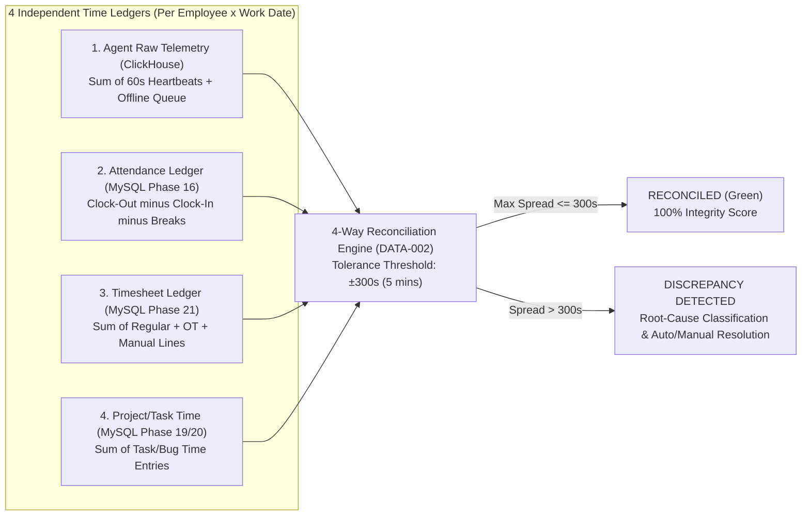

# PHASE 23: ENTERPRISE REPORTS, CENTRAL DATA HUB, 4-WAY RECONCILIATION & STORAGE GOVERNANCE

**Module Domain:** Standard & Custom BI Reporting, Interactive Cross-Dataset Data Hub, Cron Scheduled Report Delivery, Streaming Export Engine (CSV/XLSX/PDF), 4-Way Data Integrity Reconciliation & Multi-Tier S3/ClickHouse/MySQL Storage Lifecycle Management  
**Screen Coverage:** `REP-001` through `REP-017`, `EXP-001`, `EXP-002`, `DATA-001`, `DATA-002`, `STORAGE-001` through `STORAGE-003`  
**Primary Storage Engines:** ClickHouse (Analytical Query Federation, Storage Telemetry & 4-Way Reconciliation Joins), MySQL 8.0 InnoDB (Report Definitions, Templates, Cron Schedules, Export Jobs, Reconciliation Resolutions, Retention Policies), Redis 7 (BullMQ Job Queues, Export Progress Streams), S3/MinIO (Export Artifacts, Cold Archive Parquet Snapshots & Lifecycle Buckets)  
**Backend Framework:** Fastify 4.x + BullMQ Streaming Export & Retention Purge Workers

---

## 1. Architectural Overview & Core Engines

Phase 23 provides the enterprise business intelligence, cross-domain query federation, data integrity verification, and storage governance backbone of HydiEms. It features **11 Pre-Built Executive Reports (`REP-002..012`)**, a drag-and-drop **Custom Report Builder (`REP-013`)**, an interactive **10-Domain Central Data Hub (`REP-014`)**, a **BullMQ Streaming Export Pipeline (`EXP-001..002`)** capable of streaming 1M+ row CSV/XLSX/PDF files directly to S3/MinIO with backpressure control, a **4-Way Time Reconciliation Engine (`DATA-002`)**, and an **Independent Per-Module Storage Retention & Forecasting Engine (`STORAGE-001..003`)**.

### 1.1 The 4-Way Time Reconciliation Architecture (`DATA-001` / `DATA-002`)



* **Mathematical Reconciliation Formulas (`DATA-002`):**
  For each `(tenant_id, user_id, work_date)` tuple, define the four daily durations in seconds:
  * $T_{\text{agent}}$ = `SUM(tracked_seconds)` from ClickHouse `agent_heartbeats`
  * $T_{\text{att}}$ = `net_work_seconds` from MySQL `attendance_daily_records` (`clock_out - clock_in - break_seconds`)
  * $T_{\text{ts}}$ = `SUM(logged_seconds)` from MySQL `timesheet_lines` (excluding `LEAVE_SYNC`)
  * $T_{\text{proj}}$ = `SUM(duration_seconds)` from MySQL `project_time_entries`
  * **Pairwise Deltas:**
    $$\Delta_{\text{Att-Agent}} = T_{\text{att}} - T_{\text{agent}}, \quad \Delta_{\text{TS-Agent}} = T_{\text{ts}} - T_{\text{agent}}, \quad \Delta_{\text{TS-Proj}} = T_{\text{ts}} - T_{\text{proj}}$$
  * **Maximum Spread ($\Delta_{\max}$):**
    $$\Delta_{\max} = \max(T_{\text{agent}}, T_{\text{att}}, T_{\text{ts}}, T_{\text{proj}}) - \min(T_{\text{agent}}, T_{\text{att}}, T_{\text{ts}}, T_{\text{proj}})$$
  * **Integrity Classification:**
    * `EXACT_MATCH`: $\Delta_{\max} \le 60\text{s}$
    * `WITHIN_TOLERANCE`: $60\text{s} < \Delta_{\max} \le 300\text{s}$ (Configurable tenant tolerance, default `5m`)
    * `MINOR_DRIFT`: $300\text{s} < \Delta_{\max} \le 1800\text{s}$ (`5m` to `30m`)
    * `MAJOR_DISCREPANCY`: $\Delta_{\max} > 1800\text{s}$ (`> 30m`)

---

## 2. Database Schema Definitions (MySQL 8.0 InnoDB)

```sql
-- ============================================================================
-- 1. CUSTOM REPORTS, TEMPLATES & SCHEDULED CRON JOBS (REP-013, REP-015, REP-016, REP-017)
-- ============================================================================
CREATE TABLE report_definitions (
    id CHAR(36) NOT NULL PRIMARY KEY,
    tenant_id CHAR(36) NOT NULL,
    report_code VARCHAR(40) NOT NULL COMMENT 'REP-002..012 for system or CUST-xxxx',
    name VARCHAR(180) NOT NULL,
    category ENUM('ATTENDANCE','PRODUCTIVITY','TIME_AND_BILLING','PROJECTS_TASKS','SECURITY_COMPLIANCE','HR_WORKFORCE','CUSTOM') NOT NULL,
    is_system_prebuilt TINYINT(1) NOT NULL DEFAULT 0,
    base_dataset ENUM('EMPLOYEES','ATTENDANCE','TIME','ACTIVITY','PRODUCTIVITY','PROJECTS','TASKS','SCREENSHOTS','SECURITY','HR') NOT NULL,
    joined_datasets JSON NULL COMMENT 'Array of secondary datasets joined via semantic layer',
    selected_columns JSON NOT NULL COMMENT 'Ordered array of {fieldKey, label, aggregation, format, width}',
    filter_rules JSON NOT NULL COMMENT 'Nested AND/OR filter AST',
    group_by_fields JSON NULL,
    sort_by_fields JSON NULL,
    chart_config JSON NULL COMMENT '{chartType: BAR|LINE|DONUT|HEATMAP, xAxis, yAxis, series}',
    template_layout_id CHAR(36) NULL COMMENT 'FK to report_templates.id (REP-015)',
    visibility ENUM('PRIVATE','ROLE_SHARED','TENANT_PUBLIC') NOT NULL DEFAULT 'PRIVATE',
    created_by CHAR(36) NOT NULL,
    created_at TIMESTAMP(3) NOT NULL DEFAULT CURRENT_TIMESTAMP(3),
    updated_at TIMESTAMP(3) NOT NULL DEFAULT CURRENT_TIMESTAMP(3) ON UPDATE CURRENT_TIMESTAMP(3),
    UNIQUE KEY uq_report_code (tenant_id, report_code)
) ENGINE=InnoDB DEFAULT CHARSET=utf8mb4 COLLATE=utf8mb4_unicode_ci;

CREATE TABLE report_templates (
    id CHAR(36) NOT NULL PRIMARY KEY,
    tenant_id CHAR(36) NOT NULL,
    name VARCHAR(150) NOT NULL,
    page_size ENUM('A4','LETTER','LEGAL') NOT NULL DEFAULT 'A4',
    orientation ENUM('PORTRAIT','LANDSCAPE') NOT NULL DEFAULT 'LANDSCAPE',
    header_config JSON NOT NULL COMMENT '{showLogo, logoUrl, companyTitle, subtitle, showGeneratedTimestamp}',
    footer_config JSON NOT NULL COMMENT '{confidentialityNotice, showPageNumbers, signatureBlocks[]}',
    styling_config JSON NOT NULL COMMENT '{primaryColorHex, fontFamily, tableStripeColorHex, density}',
    is_default TINYINT(1) NOT NULL DEFAULT 0,
    created_by CHAR(36) NOT NULL,
    created_at TIMESTAMP(3) NOT NULL DEFAULT CURRENT_TIMESTAMP(3)
) ENGINE=InnoDB DEFAULT CHARSET=utf8mb4 COLLATE=utf8mb4_unicode_ci;

CREATE TABLE scheduled_report_jobs (
    id CHAR(36) NOT NULL PRIMARY KEY,
    tenant_id CHAR(36) NOT NULL,
    report_definition_id CHAR(36) NOT NULL,
    schedule_name VARCHAR(160) NOT NULL,
    status ENUM('ACTIVE','PAUSED','ERRORED','EXPIRED') NOT NULL DEFAULT 'ACTIVE',
    cron_expression VARCHAR(64) NOT NULL COMMENT 'Standard 5-field cron e.g. 0 8 * * 1',
    timezone VARCHAR(64) NOT NULL DEFAULT 'UTC',
    relative_date_window ENUM('YESTERDAY','LAST_7_DAYS','LAST_14_DAYS','THIS_WEEK','LAST_WEEK','THIS_MONTH','LAST_MONTH','QUARTER_TO_DATE') NOT NULL DEFAULT 'LAST_7_DAYS',
    export_formats JSON NOT NULL COMMENT 'Array e.g. ["PDF", "XLSX", "CSV"]',
    delivery_channels JSON NOT NULL COMMENT '{emails: [...], userIds: [...], webhookUrl: null, slackWebhook: null}',
    email_subject_template VARCHAR(255) NOT NULL,
    email_body_markdown TEXT NULL,
    skip_if_empty TINYINT(1) NOT NULL DEFAULT 0,
    next_run_at TIMESTAMP(3) NOT NULL,
    last_run_at TIMESTAMP(3) NULL,
    last_run_status ENUM('SUCCESS','FAILED','SKIPPED_EMPTY') NULL,
    run_count INT UNSIGNED NOT NULL DEFAULT 0,
    created_by CHAR(36) NOT NULL,
    created_at TIMESTAMP(3) NOT NULL DEFAULT CURRENT_TIMESTAMP(3),
    updated_at TIMESTAMP(3) NOT NULL DEFAULT CURRENT_TIMESTAMP(3) ON UPDATE CURRENT_TIMESTAMP(3),
    KEY idx_sched_reports_next_run (status, next_run_at),
    CONSTRAINT fk_srj_report FOREIGN KEY (report_definition_id) REFERENCES report_definitions(id) ON DELETE CASCADE
) ENGINE=InnoDB DEFAULT CHARSET=utf8mb4 COLLATE=utf8mb4_unicode_ci;

-- ============================================================================
-- 2. GLOBAL STREAMING DATA EXPORT JOBS (EXP-001, EXP-002)
-- ============================================================================
CREATE TABLE data_export_jobs (
    id CHAR(36) NOT NULL PRIMARY KEY,
    tenant_id CHAR(36) NOT NULL,
    requested_by CHAR(36) NOT NULL,
    source_module VARCHAR(64) NOT NULL COMMENT 'e.g. REP-004, DATA-HUB, TIMESHEETS, AUDIT_LOGS',
    report_definition_id CHAR(36) NULL,
    export_format ENUM('CSV','XLSX','PDF','JSONL_PARQUET') NOT NULL,
    query_parameters JSON NOT NULL,
    status ENUM('QUEUED','PROCESSING','UPLOADING','COMPLETED','FAILED','EXPIRED') NOT NULL DEFAULT 'QUEUED',
    progress_pct TINYINT UNSIGNED NOT NULL DEFAULT 0,
    total_rows BIGINT UNSIGNED NOT NULL DEFAULT 0,
    file_size_bytes BIGINT UNSIGNED NULL,
    s3_object_key VARCHAR(512) NULL,
    sha256_checksum CHAR(64) NULL,
    error_message TEXT NULL,
    expires_at TIMESTAMP(3) NOT NULL COMMENT 'Default 7 days TTL for export downloads',
    started_at TIMESTAMP(3) NULL,
    completed_at TIMESTAMP(3) NULL,
    created_at TIMESTAMP(3) NOT NULL DEFAULT CURRENT_TIMESTAMP(3),
    KEY idx_export_jobs_user (tenant_id, requested_by, created_at DESC),
    KEY idx_export_jobs_expiry (status, expires_at)
) ENGINE=InnoDB DEFAULT CHARSET=utf8mb4 COLLATE=utf8mb4_unicode_ci;

-- ============================================================================
-- 3. 4-WAY DATA RECONCILIATION LEDGER (DATA-001, DATA-002)
-- ============================================================================
CREATE TABLE data_reconciliation_records (
    id CHAR(36) NOT NULL PRIMARY KEY,
    tenant_id CHAR(36) NOT NULL,
    user_id CHAR(36) NOT NULL,
    department_id CHAR(36) NULL,
    work_date DATE NOT NULL,
    agent_raw_seconds INT UNSIGNED NOT NULL DEFAULT 0,
    attendance_net_seconds INT UNSIGNED NOT NULL DEFAULT 0,
    timesheet_logged_seconds INT UNSIGNED NOT NULL DEFAULT 0,
    project_task_seconds INT UNSIGNED NOT NULL DEFAULT 0,
    max_spread_seconds INT UNSIGNED NOT NULL DEFAULT 0,
    discrepancy_severity ENUM('EXACT_MATCH','WITHIN_TOLERANCE','MINOR_DRIFT','MAJOR_DISCREPANCY') NOT NULL DEFAULT 'EXACT_MATCH',
    root_cause_code ENUM('NONE','UNASSIGNED_AGENT_TIME','UNAPPROVED_MANUAL_TIME','MISSED_CLOCK_OUT','OFFLINE_QUEUE_PENDING','PROJECT_TASK_MISMATCH','AGENT_HEARTBEAT_GAP') NOT NULL DEFAULT 'NONE',
    resolution_status ENUM('AUTO_RECONCILED','OPEN_DISCREPANCY','ADJUSTED_TO_AGENT','ADJUSTED_TO_ATTENDANCE','ADJUSTED_TO_TIMESHEET','EXCEPTION_APPROVED') NOT NULL DEFAULT 'AUTO_RECONCILED',
    resolved_by CHAR(36) NULL,
    resolution_note VARCHAR(1000) NULL,
    resolved_at TIMESTAMP(3) NULL,
    last_computed_at TIMESTAMP(3) NOT NULL DEFAULT CURRENT_TIMESTAMP(3),
    UNIQUE KEY uq_reconcile_user_date (tenant_id, user_id, work_date),
    KEY idx_reconcile_severity_status (tenant_id, discrepancy_severity, resolution_status, work_date)
) ENGINE=InnoDB DEFAULT CHARSET=utf8mb4 COLLATE=utf8mb4_unicode_ci;

-- ============================================================================
-- 4. INDEPENDENT MODULE STORAGE RETENTION POLICIES (STORAGE-001..003)
-- ============================================================================
CREATE TABLE storage_retention_policies (
    id CHAR(36) NOT NULL PRIMARY KEY,
    tenant_id CHAR(36) NOT NULL,
    module_code ENUM('SCREENSHOTS','SCREEN_RECORDINGS','AGENT_RAW_TELEMETRY','APP_URL_LOGS','ATTENDANCE_RECORDS','TIMESHEETS_AND_BILLING','PROJECT_TASK_FILES','SECURITY_DLP_EVENTS','EXPORT_ARTIFACTS','AUDIT_LOGS') NOT NULL,
    hot_storage_days SMALLINT UNSIGNED NOT NULL DEFAULT 90 COMMENT 'Active S3 Standard / ClickHouse NVMe tier',
    cold_archive_days SMALLINT UNSIGNED NOT NULL DEFAULT 365 COMMENT 'S3 Glacier/IA or ClickHouse Cold Tier before purge',
    auto_purge_after_total_days SMALLINT UNSIGNED NOT NULL DEFAULT 455,
    action_on_expiry ENUM('PERMANENT_PURGE','ARCHIVE_TO_COLD_S3','ANONYMIZE_PII') NOT NULL DEFAULT 'PERMANENT_PURGE',
    exempt_flagged_security_incidents TINYINT(1) NOT NULL DEFAULT 1 COMMENT 'Legal hold exemption',
    exempt_locked_billing_records TINYINT(1) NOT NULL DEFAULT 1,
    last_purge_executed_at TIMESTAMP(3) NULL,
    total_bytes_reclaimed_lifetime BIGINT UNSIGNED NOT NULL DEFAULT 0,
    updated_by CHAR(36) NOT NULL,
    updated_at TIMESTAMP(3) NOT NULL DEFAULT CURRENT_TIMESTAMP(3) ON UPDATE CURRENT_TIMESTAMP(3),
    UNIQUE KEY uq_tenant_storage_module (tenant_id, module_code)
) ENGINE=InnoDB DEFAULT CHARSET=utf8mb4 COLLATE=utf8mb4_unicode_ci;
```

---

## 3. Screen-by-Screen Engineering Specifications

### 3.1 `REP-001` through `REP-012` — Reports Home & 11 Pre-Built Enterprise Reports
* **`REP-001` (Reports Home Catalog):** Categorized launchpad displaying the 11 Pre-Built System Reports, Saved Custom Reports (`REP-013`), Pinned Favorite Reports, and Recent Scheduled Runs (`REP-017`).
* **The 11 Pre-Built System Reports (`REP-002` to `REP-012`):**
  1. **`REP-002` — Daily & Monthly Attendance Summary Report:** Shift punctuality, First-In / Last-Out, Late Arrivals, Early Departures, Overtime, and Absenteeism across employees and departments.
  2. **`REP-003` — Time & Activity Detailed Report:** Granular breakdown of Tracked Time, Active Time, Idle Time, Manual Time, Keystroke/Mouse intensity bands, and Active % per employee/day.
  3. **`REP-004` — Application & Website Usage Report:** Ranked time spent per desktop executable and browser domain, categorized by `Productive`, `Neutral`, and `Unproductive` ratings.
  4. **`REP-005` — Executive Productivity & Focus Report:** Combines Productivity Score %, Deep-Work Focus Time (`>=25m` blocks), Context-Switching Frequency, and Peer Benchmarks.
  5. **`REP-006` — Project & Task Profitability Report:** Budget vs Actual Hours, Internal Cost vs Billable Revenue, Gross Margin ($ and %), and CPI/SPI indicators (`PROJ-007`).
  6. **`REP-007` — Timesheet & Payroll Readiness Report:** Regular, Overtime, Holiday, and Paid Leave hours with calculated pay amounts (`TS-009`) and lock status (`TS-010`).
  7. **`REP-008` — Client Billing & Unbilled WIP Report:** Approved billable hours, invoiced vs unbilled WIP balances, and invoice aging by client (`BILL-001..005`).
  8. **`REP-009` — Leave & Time-Off Accrual Balance Report:** Opening balance, accrued days, taken days, pending requests, and closing leave balance by leave type (Phase 17).
  9. **`REP-010` — Screenshot & Visual Audit Frequency Report:** Total screenshots captured, blurred/deleted counts, low-activity screenshot flags, and per-employee capture compliance (Phase 14).
  10. **`REP-011` — Security, DLP & Policy Violation Report:** Unauthorized USB events, clipboard/file exfiltration alerts, blacklisted app launches, and agent tamper attempts.
  11. **`REP-012` — System Audit & Compliance Log Report:** Complete administrative, RBAC, timesheet modification (`TS-011`), and task audit (`TASK-007`) trail for SOC2 / ISO27001 / GDPR audits.
* **Fastify Endpoint:** `POST /api/v1/reports/prebuilt/:reportCode/execute`

### 3.2 `REP-013` — Custom Report Builder
* **Purpose:** No-code visual report composer allowing analysts to select columns, define calculated formulas, apply nested `AND/OR` filters, configure multi-level groupings, and attach visual charts.
* **Capabilities:**
  * Drag-and-drop field picker with instant live 50-row preview.
  * Aggregation functions: `SUM`, `AVG`, `MIN`, `MAX`, `COUNT`, `COUNT_DISTINCT`, `P50`, `P95`.
  * Custom Formula Columns (safe AST expression evaluator supporting e.g., `(productive_hours / tracked_hours) * 100`).
* **Fastify Endpoints:** `POST / GET / PATCH / DELETE /api/v1/reports/custom`

### 3.3 `REP-014` — Central Data Hub (Interactive 10-Dataset Cross-Explorer)
* **Purpose:** Interactive ad-hoc pivot & relational explorer spanning all **10 Canonical HydiEms Datasets**:
  1. `Employees` (Directory, Roles, Shifts, Rate Cards)
  2. `Attendance` (Clock-In/Out, Breaks, Overtime, Regularizations)
  3. `Time` (Sessions, Heartbeats, Manual Logs, Timesheets)
  4. `Activity` (Apps, Domains, Window Titles, Input Intensity)
  5. `Productivity` (Scores, Focus Blocks, Idle Episodes, Patterns)
  6. `Projects` (Budgets, Milestones, Sprints, Allocations)
  7. `Tasks` (Kanban Status, Estimates vs Actuals, Bugs, Dependencies)
  8. `Screenshots` (Capture Metadata, Activity %, Blur/Flag Status)
  9. `Security` (Risk Scores, DLP Violations, Tamper Alerts, Audit Trail)
  10. `HR` (Leaves, Holidays, Onboarding, Offboarding, Org Hierarchy)
* **Federated Semantic Query Planner:**
  * Users select a primary dataset (e.g., `Employees`) and check cross-dataset join dimensions (e.g., `+ Attendance` `+ Productivity` `+ Projects` `+ Security`).
  * The Fastify Query Planner automatically pushes high-volume time-series aggregations down to ClickHouse, joins dimensional metadata from MySQL 8.0 via dictionary/hash joins, and returns paginated JSON results with sub-second virtualized grid scrolling.
  * Any Data Hub view can be saved directly as a Custom Report (`REP-013`) or scheduled via `REP-016`.
* **Fastify Endpoint:** `POST /api/v1/data-hub/query`

### 3.4 `REP-015` — Report Template Builder
* **Purpose:** Customize branding, layout geometry, headers, footers, watermarks, and signature blocks for exported PDF and XLSX reports (`report_templates`).
* **Features:** Upload high-res vector/PNG logo, configure `Page Size` (`A4`, `Letter`, `Legal`), `Orientation` (`Portrait`, `Landscape`), custom confidentiality watermarks (e.g., *"CONFIDENTIAL —GENERATED BY {USER_EMAIL} ON {TIMESTAMP}"*), and multi-signatory approval blocks at the bottom of payroll/timesheet PDFs.

### 3.5 `REP-016` & `REP-017` — Scheduled Reports Cron Engine & Management Console
* **`REP-016` (Create / Edit Scheduled Report Modal):**
  * Select any Pre-Built (`REP-002..012`) or Custom Report (`REP-013`) and attach a Branding Template (`REP-015`).
  * Configure frequency (`Daily`, `Weekly`, `Biweekly`, `Monthly`, or custom 5-field Cron expression) in any IANA timezone, select rolling date window (`YESTERDAY`, `LAST_7_DAYS`, `LAST_MONTH`, etc.), choose formats (`PDF`, `XLSX`, `CSV`), and specify recipients (Internal Users, External Emails, Slack/Teams Webhook, or Signed Outgoing Webhook).
* **`REP-017` (Scheduled Reports Management Console):**
  * Registry table of all `scheduled_report_jobs` showing `Schedule Name`, `Source Report`, `Cron / Next Run Time`, `Formats`, `Recipients Count`, `Last Run Status Badge`, and `Total Runs`.
  * **5 Operational Actions per Row:**
    1. **Edit:** Modify schedule, filters, or recipients.
    2. **Clone:** Duplicate schedule configuration with one click.
    3. **Pause:** Transition `ACTIVE -> PAUSED` (`PATCH /api/v1/reports/schedules/:id/pause`), removing the repeatable trigger from BullMQ.
    4. **Resume:** Transition `PAUSED -> ACTIVE` (`PATCH /api/v1/reports/schedules/:id/resume`), recalculating `next_run_at`.
    5. **Run Now:** Immediately enqueue an out-of-band execution job (`POST /api/v1/reports/schedules/:id/run-now`) without altering the recurring cron cadence.

### 3.6 `EXP-001` & `EXP-002` — Global Data Export Center (BullMQ Streaming Workers)
* **`EXP-001` (Export Trigger & Configuration Modal):** Invoked from any report, Data Hub grid, or table across HydiEms. Selects format (`CSV`, `XLSX`, `PDF`), column scope (`Visible Columns` vs `All Columns`), and PII masking option.
* **`EXP-002` (Global Export History & Download Center):**
  * Displays real-time progress bars (`QUEUED -> PROCESSING (42%) -> UPLOADING -> COMPLETED`) pushed via WebSocket (`wss://.../ws/exports`), row count, file size, SHA-256 checksum, expiration countdown (`7 days`), and a **Download** button that issues a 15-minute S3/MinIO pre-signed URL (`GET /api/v1/exports/:jobId/download`).
* **Zero-OOM Streaming Worker Architecture:**
  * The BullMQ worker (`export-stream-worker`) never buffers the full dataset in Node.js heap memory. It opens a ClickHouse/MySQL cursor stream, pipes rows through a transform stream (`fast-csv` for CSV, `exceljs.stream.xlsx.WorkbookWriter` for XLSX, or paged PDF stream), and pipes chunks directly to S3/MinIO via `Upload` multipart upload (`5MB` parts).

### 3.7 `DATA-001` & `DATA-002` — Data Quality Dashboard & 4-Way Reconciliation Engine
* **`DATA-001` (Data Quality & Telemetry Health Dashboard):**
  * Monitors organization-wide data integrity: **Overall Reconciliation Score %** (percentage of employee-days in `EXACT_MATCH` or `WITHIN_TOLERANCE`), **Pending Offline Agent Queues**, **Heartbeat Gap Anomalies**, **Unassigned Project Time %**, and **Clock-Out Missing Rate %**.
* **`DATA-002` (4-Way Reconciliation Workbench — `Agent Raw Data vs Attendance vs Timesheet vs Project Time`):**
  * **Side-by-Side 4-Column Comparison Grid:**
    * Column 1: **Agent Raw Telemetry** ($T_{\text{agent}}$, e.g., `08h 14m`)
    * Column 2: **Attendance Net Work** ($T_{\text{att}}$, e.g., `08h 18m`)
    * Column 3: **Timesheet Logged** ($T_{\text{ts}}$, e.g., `08h 00m`)
    * Column 4: **Project/Task Logged** ($T_{\text{proj}}$, e.g., `07h 30m`)
    * Column 5: **Max Spread ($\Delta_{\max}$)** (`00h 48m — MINOR_DRIFT`)
    * Column 6: **Auto-Diagnosed Root Cause** (`UNASSIGNED_AGENT_TIME: 44m tracked without task selection`)
  * **One-Click Resolution Actions (`POST /api/v1/data-quality/reconcile/:recordId`):**
    * `Sync Timesheet to Agent Raw Time`
    * `Sync Attendance Clock-Out to Last Agent Heartbeat`
    * `Allocate Unassigned Time to Default Project/Task`
    * `Approve Variance with Mandatory Audit Note`

### 3.8 `STORAGE-001` through `STORAGE-003` — Enterprise Storage Management & Retention
* **`STORAGE-001` (Storage Dashboard):**
  * Real-time breakdown of Total Storage Consumed vs Tenant Quota (`TB / GB`), split across **Hot S3 Object Storage (Screenshots/Recordings/Files)**, **Cold Archive S3**, **ClickHouse Telemetry Disk**, and **MySQL Transactional Disk**.
  * Visual stacked bar and treemap by Module (`SCREENSHOTS`, `SCREEN_RECORDINGS`, `AGENT_RAW_TELEMETRY`, `PROJECT_TASK_FILES`, `EXPORT_ARTIFACTS`).
* **`STORAGE-002` (Independent Module Retention Policy Matrix):**
  * Allows admins to configure **independent retention lifecycles per module** (`storage_retention_policies`):
    * Example: Keep `SCREENSHOTS` in Hot Storage for `60 days`, Cold Archive for `30 days`, and auto-purge at `90 days`, while keeping `TIMESHEETS_AND_BILLING` and `AUDIT_LOGS` for `2,555 days` (`7 years`).
  * **Legal Hold & Billing Protection:** Enforces `exempt_flagged_security_incidents = 1` and `exempt_locked_billing_records = 1` so nightly purge workers (`storage-retention-worker`) never delete evidence attached to an active security investigation or locked invoice.
* **`STORAGE-003` (Storage Forecast & Top Consumers Analyzer):**
  * **90/180/365-Day Linear & Seasonal Storage Growth Forecast:** Calculates daily net byte ingestion rate ($\text{Bytes}_{\text{in}} - \text{Bytes}_{\text{purged}}$) and predicts the exact date the tenant will reach `80%` and `100%` of their allocated storage quota.
  * **Top Consumers Leaderboard:** Lists the Top 50 Employees, Projects, and Departments consuming the most storage (e.g., high-frequency 4K multi-monitor screenshots or large CAD project attachments) with one-click drill-down to optimize capture frequency or compress archives.

---

## 4. RBAC Permissions, Audit Events & Acceptance Criteria

### 4.1 RBAC Permission Matrix

| Permission Key | Super Admin | Org Admin | Compliance / Auditor | Dept Head | Manager |
| :--- | :---: | :---: | :---: | :---: | :---: |
| `reports:prebuilt:run` | Yes | Yes | Yes | Own Dept | Own Team |
| `reports:custom:create_edit` | Yes | Yes | Yes | Yes | No |
| `reports:data_hub:explore` | Yes | Yes | Yes | Own Dept | No |
| `reports:schedules:manage` | Yes | Yes | Yes | Own Dept | No |
| `exports:execute_download` | Yes | Yes | Yes | Own Dept | Own Team |
| `data_quality:reconcile` | Yes | Yes | View Only | Own Dept | Own Team |
| `storage:policies:manage` | Yes | Yes | View Only | No | No |

### 4.2 Engineering Acceptance Criteria
1. **Constant-Memory Streaming Exports (`EXP-001..002`):** Exporting `500,000` rows to CSV or XLSX must stream via cursor and S3 multipart upload without increasing Node.js worker RSS memory by more than `64 MB`.
2. **4-Way Reconciliation Precision (`DATA-002`):** The reconciliation job must accurately join ClickHouse `agent_heartbeats` with MySQL `attendance_daily_records`, `timesheet_lines`, and `project_time_entries` per `(user_id, work_date)` and classify both `max_spread_seconds` and `root_cause_code`.
3. **Independent Module Retention Enforcement (`STORAGE-002`):** The nightly retention worker must purge or cold-tier expired objects strictly according to each module's independent `hot_storage_days` and `auto_purge_after_total_days` while skipping any record marked under legal/security hold.
