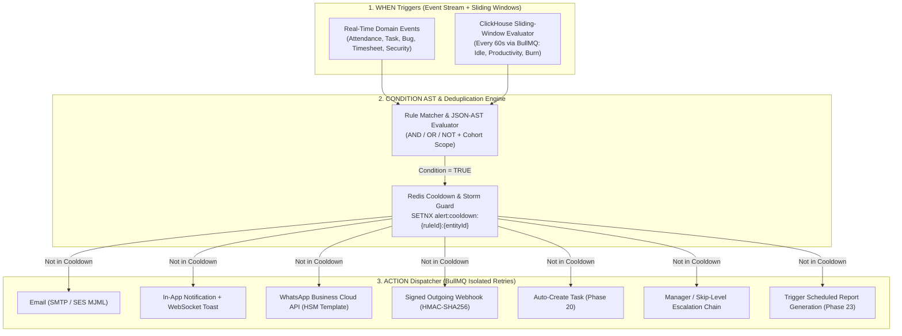
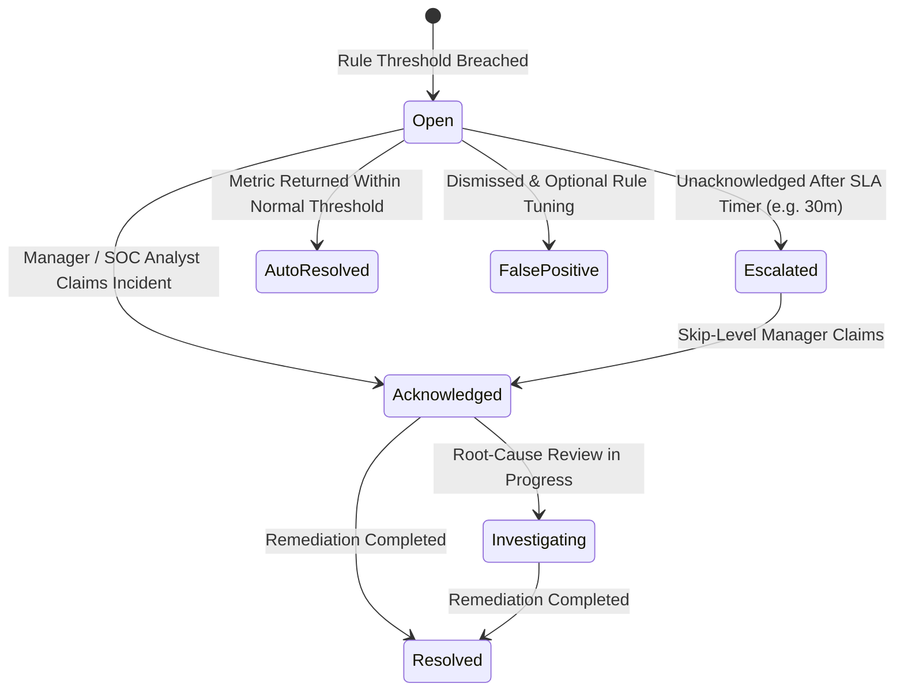

# PHASE 24: REAL-TIME ALERTS & VISUAL RULE AUTOMATION ENGINE

**Module Domain:** Multi-Domain Real-Time Alerting, Sliding-Window Telemetry Evaluation, Visual `WHEN -> CONDITION -> ACTION` Rule Engine & Multi-Channel Action Dispatcher  
**Screen Coverage:** `ALERT-001` through `ALERT-006`, `AUTO-001`, `AUTO-002`  
**Primary Storage Engines:** MySQL 8.0 InnoDB (Alert Policies, Incident Lifecycle, Automation Rule ASTs, Action Execution Logs, Webhook Signing Secrets), ClickHouse (Sliding-Window Stream Evaluation over Telemetry, Productivity, Idle & DLP Events), Redis 7 (Sliding-Window Counters, Cooldown/Deduplication Locks, BullMQ Delayed Escalation Timers)  
**Backend Framework:** Fastify 4.x + BullMQ Event-Driven & Sliding-Window Evaluation Workers

---

## 1. Architectural Overview & Execution Pipeline

Phase 24 is the autonomous nervous system of HydiEms. It continuously evaluates real-time domain events and ClickHouse sliding-window telemetry aggregates against tenant-defined **Alert Policies (`ALERT-001..006`)** and **Visual `WHEN -> CONDITION -> ACTION` Automation Rules (`AUTO-001..002`)**.

### 1.1 End-to-End Rule Evaluation & Action Dispatch Pipeline



### 1.2 Alert Incident Lifecycle State Machine (`ALERT-001`)



---

## 2. Database Schema Definitions

### 2.1 MySQL 8.0 InnoDB Schema

```sql
-- ============================================================================
-- 1. ALERT POLICIES & THRESHOLD DEFINITIONS (ALERT-002..006)
-- ============================================================================
CREATE TABLE alert_policies (
    id CHAR(36) NOT NULL PRIMARY KEY,
    tenant_id CHAR(36) NOT NULL,
    name VARCHAR(180) NOT NULL,
    category ENUM('ATTENDANCE','PRODUCTIVITY','SECURITY','PROJECT_BUDGET_DEADLINE') NOT NULL,
    severity ENUM('INFO','WARNING','HIGH','CRITICAL') NOT NULL DEFAULT 'WARNING',
    target_scope_type ENUM('ALL_ORG','DEPARTMENT','TEAM','ROLE','SPECIFIC_USERS','SPECIFIC_PROJECTS') NOT NULL DEFAULT 'ALL_ORG',
    target_scope_ids JSON NULL COMMENT 'Array of dept/team/user/project UUIDs',
    metric_key VARCHAR(80) NOT NULL COMMENT 'e.g. LATE_ARRIVAL_MINS, IDLE_CONTINUOUS_MINS, PROD_SCORE_PCT, DLP_USB_MOUNT, BUDGET_BURN_PCT',
    evaluation_mode ENUM('INSTANT_EVENT','SLIDING_WINDOW','DAILY_CUTOFF') NOT NULL DEFAULT 'SLIDING_WINDOW',
    window_duration_minutes INT UNSIGNED NOT NULL DEFAULT 60 COMMENT 'e.g. 30m, 60m, 240m, 1440m',
    comparison_operator ENUM('GT','GTE','LT','LTE','EQ','NEQ','OUTSIDE_RANGE') NOT NULL DEFAULT 'GTE',
    threshold_value DECIMAL(15,2) NOT NULL,
    secondary_threshold_value DECIMAL(15,2) NULL,
    min_occurrences_in_window SMALLINT UNSIGNED NOT NULL DEFAULT 1,
    cooldown_minutes INT UNSIGNED NOT NULL DEFAULT 240 COMMENT 'Suppresses duplicate alerts for same entity within window',
    auto_escalate_after_minutes INT UNSIGNED NULL COMMENT 'If unacknowledged, escalate to skip-level manager',
    notification_channels JSON NOT NULL COMMENT 'Array of EMAIL, IN_APP, WHATSAPP, WEBHOOK',
    recipient_config JSON NOT NULL COMMENT '{notifyEmployee, notifyDirectManager, notifyDeptHead, additionalUserIds[], webhookUrl}',
    is_active TINYINT(1) NOT NULL DEFAULT 1,
    created_by CHAR(36) NOT NULL,
    created_at TIMESTAMP(3) NOT NULL DEFAULT CURRENT_TIMESTAMP(3),
    updated_at TIMESTAMP(3) NOT NULL DEFAULT CURRENT_TIMESTAMP(3) ON UPDATE CURRENT_TIMESTAMP(3),
    KEY idx_alert_policies_cat_active (tenant_id, category, is_active)
) ENGINE=InnoDB DEFAULT CHARSET=utf8mb4 COLLATE=utf8mb4_unicode_ci;

-- ============================================================================
-- 2. TRIGGERED ALERT INCIDENTS LEDGER (ALERT-001, ALERT-003..006)
-- ============================================================================
CREATE TABLE alert_incidents (
    id CHAR(36) NOT NULL PRIMARY KEY,
    tenant_id CHAR(36) NOT NULL,
    alert_policy_id CHAR(36) NOT NULL,
    category ENUM('ATTENDANCE','PRODUCTIVITY','SECURITY','PROJECT_BUDGET_DEADLINE') NOT NULL,
    severity ENUM('INFO','WARNING','HIGH','CRITICAL') NOT NULL,
    status ENUM('OPEN','ACKNOWLEDGED','ESCALATED','INVESTIGATING','RESOLVED','AUTO_RESOLVED','FALSE_POSITIVE') NOT NULL DEFAULT 'OPEN',
    subject_entity_type ENUM('USER','PROJECT','TASK','DEVICE','SPRINT') NOT NULL DEFAULT 'USER',
    subject_entity_id CHAR(36) NOT NULL,
    department_id CHAR(36) NULL,
    title VARCHAR(255) NOT NULL,
    summary_message TEXT NOT NULL,
    observed_metric_value DECIMAL(15,2) NOT NULL,
    threshold_value DECIMAL(15,2) NOT NULL,
    context_snapshot JSON NOT NULL COMMENT 'Snapshot of offending app, screenshotId, project burn, or attendance log',
    assigned_owner_id CHAR(36) NULL,
    acknowledged_by CHAR(36) NULL,
    acknowledged_at TIMESTAMP(3) NULL,
    escalated_at TIMESTAMP(3) NULL,
    resolved_by CHAR(36) NULL,
    resolved_at TIMESTAMP(3) NULL,
    resolution_notes VARCHAR(1000) NULL,
    triggered_at TIMESTAMP(3) NOT NULL DEFAULT CURRENT_TIMESTAMP(3),
    KEY idx_alert_incidents_feed (tenant_id, category, status, severity, triggered_at DESC),
    KEY idx_alert_incidents_subject (tenant_id, subject_entity_type, subject_entity_id, triggered_at DESC),
    CONSTRAINT fk_ai_policy FOREIGN KEY (alert_policy_id) REFERENCES alert_policies(id) ON DELETE CASCADE
) ENGINE=InnoDB DEFAULT CHARSET=utf8mb4 COLLATE=utf8mb4_unicode_ci;

-- ============================================================================
-- 3. VISUAL WHEN -> CONDITION -> ACTION AUTOMATION RULES (AUTO-001, AUTO-002)
-- ============================================================================
CREATE TABLE automation_rules (
    id CHAR(36) NOT NULL PRIMARY KEY,
    tenant_id CHAR(36) NOT NULL,
    name VARCHAR(180) NOT NULL,
    description TEXT NULL,
    is_active TINYINT(1) NOT NULL DEFAULT 1,
    execution_priority SMALLINT UNSIGNED NOT NULL DEFAULT 100,
    when_trigger_type ENUM(
        'ATTENDANCE_LATE_OR_ABSENT',
        'TELEMETRY_SLIDING_WINDOW',
        'PRODUCTIVITY_THRESHOLD',
        'IDLE_STREAK_DETECTED',
        'SECURITY_DLP_VIOLATION',
        'PROJECT_BUDGET_THRESHOLD',
        'MILESTONE_OR_TASK_OVERDUE',
        'TIMESHEET_SUBMITTED_OR_REJECTED',
        'BUG_CRITICAL_REPORTED',
        'SCHEDULED_CRON_TRIGGER'
    ) NOT NULL,
    when_trigger_config JSON NOT NULL COMMENT '{windowMinutes, pollingIntervalSeconds, cronExpression, eventFilter}',
    condition_ast JSON NOT NULL COMMENT 'Recursive Boolean AST: {logicalOp: "AND"|"OR", rules: [{field, operator, value}]}',
    actions_pipeline JSON NOT NULL COMMENT 'Ordered array of action descriptors: [{stepNo, actionType, delaySeconds, config}]',
    cooldown_seconds INT UNSIGNED NOT NULL DEFAULT 3600,
    max_executions_per_day INT UNSIGNED NOT NULL DEFAULT 500,
    total_executions_count BIGINT UNSIGNED NOT NULL DEFAULT 0,
    last_triggered_at TIMESTAMP(3) NULL,
    created_by CHAR(36) NOT NULL,
    updated_by CHAR(36) NULL,
    created_at TIMESTAMP(3) NOT NULL DEFAULT CURRENT_TIMESTAMP(3),
    updated_at TIMESTAMP(3) NOT NULL DEFAULT CURRENT_TIMESTAMP(3) ON UPDATE CURRENT_TIMESTAMP(3),
    KEY idx_auto_rules_trigger (tenant_id, is_active, when_trigger_type)
) ENGINE=InnoDB DEFAULT CHARSET=utf8mb4 COLLATE=utf8mb4_unicode_ci;

-- ============================================================================
-- 4. AUTOMATION ACTION EXECUTION AUDIT LOG (AUTO-001, AUTO-002)
-- ============================================================================
CREATE TABLE automation_execution_logs (
    id CHAR(36) NOT NULL PRIMARY KEY,
    tenant_id CHAR(36) NOT NULL,
    automation_rule_id CHAR(36) NOT NULL,
    subject_entity_id CHAR(36) NULL,
    trigger_payload JSON NOT NULL,
    condition_eval_result TINYINT(1) NOT NULL,
    actions_executed JSON NOT NULL COMMENT 'Array of {actionType, status: SUCCESS|FAILED, latencyMs, responseCode, error}',
    overall_status ENUM('SUCCESS','PARTIAL_FAILURE','FAILED','SUPPRESSED_COOLDOWN') NOT NULL,
    executed_at TIMESTAMP(3) NOT NULL DEFAULT CURRENT_TIMESTAMP(3),
    KEY idx_auto_exec_rule_time (tenant_id, automation_rule_id, executed_at DESC),
    CONSTRAINT fk_ael_rule FOREIGN KEY (automation_rule_id) REFERENCES automation_rules(id) ON DELETE CASCADE
) ENGINE=InnoDB DEFAULT CHARSET=utf8mb4 COLLATE=utf8mb4_unicode_ci;
```

---

## 3. Screen-by-Screen Engineering Specifications

### 3.1 `ALERT-001` — Enterprise Alerts Command Dashboard
* **Purpose:** Unified real-time incident triage console aggregating active alerts across Attendance (`ALERT-003`), Productivity (`ALERT-004`), Security (`ALERT-005`), and Project Budget/Deadlines (`ALERT-006`).
* **UI Layout & Components:**
  1. **Real-Time Severity Strip:** Live counters for `CRITICAL`, `HIGH`, `WARNING`, and `INFO` open incidents, Mean Time to Acknowledge (`MTTA`), and Mean Time to Resolve (`MTTR`).
  2. **24-Hour Alert Volume Stacked Area Chart** by category.
  3. **Live Incident Stream Table (WebSocket `wss://.../ws/alerts`):**
     * Columns: `Severity Badge`, `Category`, `Incident Title & Summary`, `Subject (Employee / Project / Device)`, `Observed vs Threshold Value`, `Triggered Time`, `SLA Escalation Countdown`, `Assignee`, `Status`.
     * Quick Actions: `Acknowledge`, `Assign to Me`, `Inspect Evidence Snapshot`, `Resolve with Note`, `Mark False Positive`.
* **Fastify Endpoints:**
  * `GET /api/v1/alerts/dashboard?category=&severity=&status=OPEN,ESCALATED`
  * `POST /api/v1/alerts/incidents/:incidentId/acknowledge`
  * `POST /api/v1/alerts/incidents/:incidentId/resolve`

### 3.2 `ALERT-002` — Create / Edit Alert Policy Builder
* **Purpose:** Guided configuration wizard for creating deterministic threshold and sliding-window alert policies (`alert_policies`).
* **Configuration Steps:**
  1. **Category & Metric Selection:** Pick domain (`ATTENDANCE`, `PRODUCTIVITY`, `SECURITY`, `PROJECT_BUDGET_DEADLINE`) and specific metric (`metric_key`).
  2. **Scope & Cohort Targeting:** Apply to `Entire Org`, specific `Departments`, `Teams`, `Roles`, `Individual Users`, or `Projects`.
  3. **Threshold & Sliding Window:** Define `comparison_operator` (`>`, `>=`, `<`, `<=`), `threshold_value`, `window_duration_minutes` (e.g., *"Idle duration >= 30 minutes within a 60-minute rolling window"*), and `min_occurrences_in_window`.
  4. **Cooldown, Escalation & Delivery:** Configure `cooldown_minutes` (to prevent alert fatigue), `auto_escalate_after_minutes`, and delivery channels (`In-App`, `Email`, `WhatsApp`, `Webhook`).
* **Fastify Endpoints:** `POST / GET / PATCH / DELETE /api/v1/alerts/policies`

### 3.3 `ALERT-003` — Attendance Alerts View
* **Purpose:** Dedicated monitor and policy manager for shift and attendance anomalies.
* **Supported Attendance Trigger Metrics:**
  * `LATE_ARRIVAL_MINS`: Clock-in exceeds shift start + grace period by $> X$ minutes.
  * `CONSECUTIVE_LATE_DAYS`: Employee arrives late $\ge X$ days within a rolling 7-day window.
  * `UNEXCUSED_ABSENCE_NO_SHOW`: No clock-in and no approved leave by `shift_start + X` minutes.
  * `EARLY_DEPARTURE_MINS`: Clock-out occurs $> X$ minutes before shift end.
  * `MISSED_CLOCK_OUT`: Shift ended $> X$ hours ago with no clock-out event.
  * `OVERTIME_CAP_APPROACHING`: Weekly or monthly overtime hours exceed $X\%$ of statutory cap.
  * `GEOFENCE_OR_IP_MISMATCH`: Clock-in attempted outside permitted office IP/geofence perimeter.

### 3.4 `ALERT-004` — Productivity & Idle Alerts View
* **Purpose:** Monitor disengagement, sustained inactivity, unproductive application drift, and cognitive overload/burnout indicators.
* **Supported Productivity Trigger Metrics:**
  * `CONTINUOUS_IDLE_STREAK_MINS`: Unbroken idle episode $\ge X$ minutes during core shift hours.
  * `REPEATED_IDLE_SLOT_PATTERN`: Repeated idle time in the same 30-minute slot across $\ge 3$ days (`ANA-009`).
  * `DAILY_PRODUCTIVITY_DROP_PCT`: Daily productivity score drops below $X\%$ or falls $> Y\%$ below the employee's 30-day baseline.
  * `UNPRODUCTIVE_APP_DURATION_MINS`: Time spent on `UNPRODUCTIVE` domains/apps (e.g., social media, video streaming, gaming) exceeds $X$ minutes within a rolling $Y$-minute window.
  * `ZERO_FOCUS_BLOCKS_STREAK`: Employee completes `0` deep-work (`>=25m`) focus blocks across $\ge X$ consecutive workdays.
  * `BURNOUT_OVERWORK_STREAK`: Active work exceeds $10\text{h/day}$ for $\ge X$ consecutive days (`ANA-003`).

### 3.5 `ALERT-005` — Security, DLP & Agent Integrity Alerts View
* **Purpose:** High-priority SOC/Security incident workbench monitoring insider threat, data exfiltration, and Desktop Agent tampering.
* **Supported Security Trigger Metrics:**
  * `BLACKLISTED_PROCESS_LAUNCHED`: Forbidden executable (e.g., packet sniffer, unauthorized remote desktop, mouse-jiggler/auto-clicker binary) detected in process tree.
  * `SYNTHETIC_INPUT_JIGGLER_DETECTED`: Zero-entropy periodic mouse delta or synthetic keystroke injection flagged by Desktop Agent heuristics.
  * `USB_MASS_STORAGE_WRITE`: File copy to removable USB storage detected.
  * `SENSITIVE_CLIPBOARD_OR_UPLOAD`: Bulk copy or browser upload to unapproved cloud storage domain.
  * `AGENT_HEARTBEAT_TAMPER_OR_KILL`: Agent service forcefully terminated or local clock skewed $> 120\text{s}$ while shift is active.
  * `CONCURRENT_MULTI_DEVICE_SESSION`: Same user credentials active on two distinct hardware machine IDs simultaneously.

### 3.6 `ALERT-006` — Project Budget & Deadline Alerts View
* **Purpose:** Early-warning radar for PMO and Project Managers tracking budget burn overruns, milestone slippage, and sprint scope creep.
* **Supported Project Trigger Metrics:**
  * `PROJECT_BUDGET_BURN_PCT`: Project consumed hours or monetary cost crosses `75%`, `90%`, or `100%` of `total_budget` (`PROJ-007`).
  * `PROJECT_CPI_SPI_DEGRADATION`: Cost Performance Index ($CPI$) or Schedule Performance Index ($SPI$) drops below `0.85`.
  * `CRITICAL_MILESTONE_AT_RISK`: Critical-path milestone (`is_critical_path = 1`) is within $X$ days of `due_date` with `completion_pct < Y%` (`PROJ-009`).
  * `TASK_ESTIMATE_OVERRUN_PCT`: Individual task logged hours exceed `estimated_hours` by $> X\%$ (`TASK-004`).
  * `SPRINT_SCOPE_CREEP_PCT`: Story points added mid-sprint exceed $X\%$ of `committed_story_points` (`PROJ-010`).

---

### 3.7 `AUTO-001` — Automation Rules Dashboard & Execution Telemetry
* **Purpose:** Central management console for all `WHEN -> CONDITION -> ACTION` automation rules (`automation_rules`) and their real-time execution history (`automation_execution_logs`).
* **Dashboard Components:**
  1. **KPI Cards:** Total Active Rules, Executions Today (`SUCCESS` vs `FAILED` vs `SUPPRESSED_COOLDOWN`), Average Evaluation-to-Action Latency (`ms`), and Actions Dispatched by Channel (`Email`, `In-App`, `WhatsApp`, `Webhook`, `Tasks Created`, `Escalations`, `Reports`).
  2. **Rules Registry Table:** Shows Rule Name, `WHEN` Trigger Badge, `CONDITION` Summary Pills, `ACTION` Icons Strip, Cooldown Window, Total Executions, Last Triggered Timestamp, and an instant Active/Inactive Toggle switch.
  3. **Execution Audit Drawer:** Inspect any historical firing (`automation_execution_logs`) with the exact input telemetry JSON, boolean AST evaluation trace, per-action HTTP/SMTP/WhatsApp response codes, and a **"Replay Action"** button for failed external webhooks.
* **Fastify Endpoints:**
  * `GET /api/v1/automations/dashboard`
  * `GET /api/v1/automations/rules`
  * `PATCH /api/v1/automations/rules/:ruleId/toggle`
  * `GET /api/v1/automations/logs?ruleId=&status=`

### 3.8 `AUTO-002` — Visual `WHEN -> CONDITION -> ACTION` Rule Engine Builder
* **Purpose:** Interactive node-based canvas and structured rule composer enabling admins to chain complex multi-condition evaluations to automated multi-step actions.

#### 3.8.1 Stage 1: `WHEN` Trigger Block
* Supports **Event-Driven Triggers** (evaluated in `< 10ms` on Fastify/BullMQ event bus emission) and **Sliding-Window Telemetry Triggers** (evaluated every 60 seconds via vectorized ClickHouse window queries):
  ```sql
  -- Example ClickHouse Sliding-Window Evaluation Query executed by BullMQ Worker
  SELECT
      tenant_id,
      user_id,
      sum(idle_seconds) AS window_idle_seconds,
      sum(unproductive_seconds) AS window_unprod_seconds,
      round(sum(productive_seconds) * 100.0 / greatest(1, sum(active_seconds)), 2) AS window_prod_pct
  FROM hydi_telemetry.agent_heartbeats
  WHERE tenant_id = {tenantId:UUID}
    AND event_timestamp >= now() - INTERVAL {windowMinutes:UInt32} MINUTE
  GROUP BY tenant_id, user_id
  HAVING window_idle_seconds >= {thresholdSeconds:UInt32};
  ```

#### 3.8.2 Stage 2: `CONDITION` Recursive Boolean AST Evaluator
* Supports arbitrary nesting of `AND`, `OR`, and `NOT` condition groups with rich contextual variables:
  * `employee.department_id IN [...]`
  * `employee.work_mode == 'REMOTE'`
  * `employee.tenure_days < 90` (e.g., Probationary cohort)
  * `shift.is_currently_active == true`
  * `project.billing_type == 'TIME_AND_MATERIALS'`
  * `project.consumed_budget_pct >= 90`
  * `metric.observed_value > metric.baseline_30d_avg * 1.25`
* Includes a **"Test Rule Against Historical Data (Last 7 Days)"** dry-run button (`POST /api/v1/automations/rules/dry-run`) that queries ClickHouse/MySQL and displays exactly how many times the rule *would have fired* over the past week and which employees/projects would have matched, preventing misconfigured alert storms before activation.

#### 3.8.3 Stage 3: `ACTION` Multi-Channel Execution Pipeline
Every rule can execute one or more ordered actions (with optional per-step delay timers `delaySeconds` managed by BullMQ delayed jobs):

1. **Send Email (`ACTION_SEND_EMAIL`):**
   * Renders responsive MJML/HTML template with dynamic Handlebars variables (`{{employee.fullName}}`, `{{project.name}}`, `{{metric.observedValue}}`, `{{incident.url}}`) via AWS SES / SMTP pool.
2. **Send In-App Notification (`ACTION_IN_APP_NOTIFY`):**
   * Inserts into `user_notifications` and pushes an instant WebSocket toast + Desktop Agent native OS notification.
3. **Send WhatsApp Message (`ACTION_WHATSAPP_API`):**
   * Dispatches an approved WhatsApp Business Cloud API HSM Template message (`POST https://graph.facebook.com/v19.0/{phone_number_id}/messages`) to the employee's or manager's verified E.164 mobile number with exponential backoff retry.
4. **Fire Signed Outgoing Webhook (`ACTION_OUTGOING_WEBHOOK`):**
   * Sends a `POST` JSON payload to an external URL (Slack, Microsoft Teams, PagerDuty, ServiceNow, Zapier, or custom ERP) signed with header `X-HydiEms-Signature-256: sha256=HMAC_SHA256(webhook_secret, raw_body)` and a `5,000ms` timeout (3 retries with jitter).
5. **Auto-Create Task (`ACTION_CREATE_TASK`):**
   * Automatically creates a remediation task in Phase 20 (`POST /api/v1/tasks`, e.g., *"Review Budget Overrun on {{project.projectCode}}"* or *"Conduct 1-on-1 Check-in with {{employee.fullName}}"*) assigned to the Project Manager or Team Lead with a computed SLA due date.
6. **Manager & Skip-Level Escalation (`ACTION_MANAGER_ESCALATION`):**
   * Resolves the subject employee's reporting hierarchy (`direct_manager_id -> skip_level_manager_id -> department_head_id`). Notifies the direct manager immediately and schedules a BullMQ delayed escalation check (`delay = escalateAfterMinutes * 60000`); if the incident is still `OPEN` when the timer fires, it automatically escalates to the skip-level manager.
7. **Trigger Scheduled Report Generation (`ACTION_GENERATE_REPORT`):**
   * Invokes the Phase 23 Report & Export Worker (`REP-016` / `EXP-001`) to generate an immediate PDF/XLSX forensic snapshot (e.g., generating the employee's 7-day `REP-003` Time & Activity PDF and attaching its pre-signed download link to the manager escalation email).

---

## 4. RBAC Permissions, Audit Events & Acceptance Criteria

### 4.1 RBAC Permission Matrix

| Permission Key | Super Admin | Org Admin | Security / SOC | Dept Head | Manager |
| :--- | :---: | :---: | :---: | :---: | :---: |
| `alerts:dashboard:view` | Yes | Yes | Security Only | Own Dept | Own Team |
| `alerts:incidents:ack_resolve` | Yes | Yes | Security Only | Own Dept | Own Team |
| `alerts:policies:manage` | Yes | Yes | Security Only | Own Dept | No |
| `automations:rules:view` | Yes | Yes | Yes | Own Dept | No |
| `automations:rules:create_edit` | Yes | Yes | Security Rules | No | No |
| `automations:logs:view_replay` | Yes | Yes | Yes | Own Dept | No |

### 4.2 Immutable Audit Events Emitted
* `ALERT_POLICY_CREATED`, `ALERT_POLICY_MODIFIED`, `ALERT_INCIDENT_TRIGGERED`, `ALERT_INCIDENT_ACKNOWLEDGED`, `ALERT_INCIDENT_ESCALATED`, `ALERT_INCIDENT_RESOLVED`, `AUTOMATION_RULE_CREATED`, `AUTOMATION_RULE_TOGGLED`, `AUTOMATION_ACTION_DISPATCHED`.

### 4.3 Engineering Acceptance Criteria
1. **Sliding-Window Evaluation Latency (`AUTO-002`):** Vectorized ClickHouse evaluation of `100` active sliding-window rules across `10,000` active employees must complete within `< 2.5 seconds` per 60-second tick.
2. **Idempotent Cooldown Suppression:** When a rule condition evaluates to `TRUE`, the engine must atomically acquire `SET alert:cooldown:{ruleId}:{subjectEntityId} 1 EX {cooldownSeconds} NX` in Redis so that concurrent worker ticks never emit duplicate notifications or create duplicate tasks during the cooldown window.
3. **Isolated Action Fault Tolerance:** If an external action (such as `ACTION_WHATSAPP_API` or `ACTION_OUTGOING_WEBHOOK`) returns a network timeout or `5xx` error, it must retry independently in BullMQ with exponential backoff without blocking or rolling back sibling actions (`ACTION_IN_APP_NOTIFY`, `ACTION_CREATE_TASK`, etc.) in the same rule pipeline.
4. **Historical Dry-Run Accuracy (`AUTO-002`):** Executing the 7-day historical dry-run preview in the Visual Rule Builder must return the exact count and sample list of matching events within `< 1.5 seconds` without mutating production tables or dispatching external notifications.
