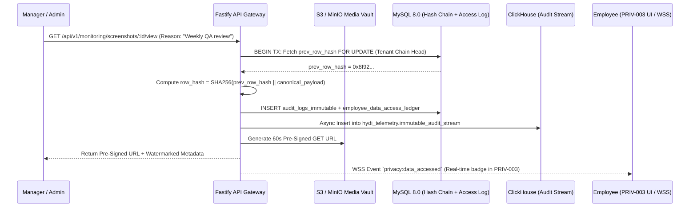

# PHASE 26: Employee Privacy & Transparency Center, Digital Consent Versioning & Tamper-Evident Immutable Audit Logs

**Document Version:** 1.0.0  
**Architecture Tier:** Ethical Monitoring Transparency, GDPR/CCPA/DPDP Compliance & Cryptographic Audit Ledger  
**Primary Stack:** Fastify 5.x (TypeScript) | MySQL 8.0 InnoDB | ClickHouse 24.x | Redis 7.x | S3/MinIO Object Storage | SHA-256 + HMAC-SHA256 Merkle/Hash Chain  
**Covered Screen IDs:** `PRIV-001` through `PRIV-005`, `AUDIT-001` through `AUDIT-003`

---

## 1. Executive Architecture & Ethical Transparency Philosophy

HydiEms is architected on the principle of **Transparent, Auditable, and Reciprocal Trust**. Unlike covert surveillance software, HydiEms provides every employee with a dedicated **Privacy & Transparency Center (`PRIV-001..005`)** that exposes:
1. **Real-Time Sensor State (`PRIV-002`)**: Sub-second visibility into whether Time Tracking, Screenshots, Screen Recording, Microphone/Audio, or GPS Location is currently `ON` or `OFF` on their workstation/mobile device.
2. **Reciprocal Access Transparency (`PRIV-003`)**: Whenever a Manager, HR Admin, or Security Analyst views an employee's screenshot, plays a screen recording, exports their timesheet, or inspects their profile, an immutable access event is written and surfaced to the employee (unless temporarily deferred by a formal, time-bounded `SUSP-004` legal hold investigation).
3. **Cryptographically Verifiable Audit Trail (`AUDIT-001..003`)**: Every sensitive action across the entire platform is recorded in a dual-written, append-only **SHA-256 Hash-Chained Audit Ledger** in MySQL 8.0 InnoDB and ClickHouse 24.x, with daily Merkle root anchoring.



---

## 2. Database Schema & Cryptographic Ledger Specifications

### 2.1 MySQL 8.0 InnoDB OLTP Schema

```sql
-- ============================================================================
-- 1. CONSENT POLICY VERSIONS & DIGITAL SIGNATURES (PRIV-001, PRIV-004)
-- ============================================================================
CREATE TABLE privacy_policy_versions (
    id CHAR(36) NOT NULL PRIMARY KEY COMMENT 'UUIDv7',
    tenant_id CHAR(36) NOT NULL,
    policy_type ENUM('EMPLOYEE_MONITORING_CONSENT', 'DATA_PRIVACY_NOTICE', 'BYOD_MDM_CONSENT', 'ACCEPTABLE_USE_POLICY') NOT NULL,
    version_number VARCHAR(32) NOT NULL COMMENT 'Semantic version e.g. 2.4.0',
    title VARCHAR(200) NOT NULL,
    markdown_body LONGTEXT NOT NULL,
    content_sha256 CHAR(64) NOT NULL COMMENT 'SHA-256 of canonical markdown_body',
    collection_manifest_json JSON NOT NULL COMMENT 'Structured disclosure: what is collected, why, active hours, authorized roles, retention_days',
    requires_reacknowledgement BOOLEAN NOT NULL DEFAULT TRUE,
     block_tracking_until_signed BOOLEAN NOT NULL DEFAULT TRUE,
    effective_from DATETIME(3) NOT NULL,
    published_by CHAR(36) NOT NULL,
    is_current BOOLEAN NOT NULL DEFAULT TRUE,
    created_at DATETIME(3) NOT NULL DEFAULT CURRENT_TIMESTAMP(3),
    UNIQUE KEY uq_priv_policy_ver (tenant_id, policy_type, version_number),
    INDEX idx_priv_policy_current (tenant_id, policy_type, is_current)
) ENGINE=InnoDB DEFAULT CHARSET=utf8mb4 COLLATE=utf8mb4_unicode_ci;

CREATE TABLE employee_consent_signatures (
    id CHAR(36) NOT NULL PRIMARY KEY,
    tenant_id CHAR(36) NOT NULL,
    user_id CHAR(36) NOT NULL,
    policy_version_id CHAR(36) NOT NULL,
    signature_status ENUM('SIGNED', 'DECLINED', 'REVOKED', 'EXPIRED') NOT NULL DEFAULT 'SIGNED',
    typed_full_name VARCHAR(150) NOT NULL,
    ip_address VARCHAR(45) NOT NULL,
    user_agent VARCHAR(512) NOT NULL,
    device_id CHAR(36) NULL,
    signature_hash CHAR(64) NOT NULL COMMENT 'HMAC-SHA256(user_id || policy_version_id || content_sha256 || signed_at || ip_address)',
    signed_at DATETIME(3) NOT NULL DEFAULT CURRENT_TIMESTAMP(3),
    revoked_at DATETIME(3) NULL,
    revocation_reason TEXT NULL,
    CONSTRAINT fk_consent_policy_ver FOREIGN KEY (policy_version_id) REFERENCES privacy_policy_versions(id),
    UNIQUE KEY uq_user_policy_sig (tenant_id, user_id, policy_version_id),
    INDEX idx_consent_user_status (tenant_id, user_id, signature_status)
) ENGINE=InnoDB DEFAULT CHARSET=utf8mb4 COLLATE=utf8mb4_unicode_ci;

-- ============================================================================
-- 2. EMPLOYEE DATA ACCESS TRANSPARENCY LEDGER (PRIV-003)
-- ============================================================================
CREATE TABLE employee_data_access_ledger (
    id CHAR(36) NOT NULL PRIMARY KEY,
    tenant_id CHAR(36) NOT NULL,
    target_employee_id CHAR(36) NOT NULL COMMENT 'The employee whose data was viewed/exported',
    accessor_user_id CHAR(36) NOT NULL COMMENT 'The Manager/Admin/HR user who accessed the data',
    accessor_role_name VARCHAR(100) NOT NULL,
    resource_type ENUM(
        'SCREENSHOT',
        'SCREEN_RECORDING',
        'LIVE_SCREEN_STREAM',
        'ACTIVITY_TIMELINE',
        'GPS_LOCATION_ROUTE',
        'DLP_INCIDENT_EVIDENCE',
        'HR_PROFILE_DOCUMENT',
        'PAYROLL_SLIP',
        'ATTENDANCE_TIMESHEET_EXPORT'
    ) NOT NULL,
    resource_id CHAR(36) NULL,
    resource_Window_start DATETIME(3) NULL,
    resource_window_end DATETIME(3) NULL,
    access_action ENUM('VIEWED', 'PLAYED', 'DOWNLOADED', 'EXPORTED', 'DELETED') NOT NULL,
    access_reason VARCHAR(500) NULL COMMENT 'Optional or policy-mandated justification',
    accessor_ip VARCHAR(45) NOT NULL,
    is_visible_to_employee BOOLEAN NOT NULL DEFAULT TRUE COMMENT 'True by default; only deferred during active legal hold',
    visibility_release_at DATETIME(3) NULL,
    accessed_at DATETIME(3) NOT NULL DEFAULT CURRENT_TIMESTAMP(3),
    INDEX idx_emp_access_target (tenant_id, target_employee_id, is_visible_to_employee, accessed_at DESC),
    INDEX idx_emp_access_actor (tenant_id, accessor_user_id, accessed_at DESC)
) ENGINE=InnoDB DEFAULT CHARSET=utf8mb4 COLLATE=utf8mb4_unicode_ci;

-- ============================================================================
-- 3. GDPR / DPDP / ENTERPRISE DATA SUBJECT REQUESTS (PRIV-005)
-- ============================================================================
CREATE TABLE privacy_data_requests (
    id CHAR(36) NOT NULL PRIMARY KEY,
    tenant_id CHAR(36) NOT NULL,
    request_code VARCHAR(32) NOT NULL COMMENT 'e.g. DSR-2026-000412',
    requester_user_id CHAR(36) NOT NULL,
    request_type ENUM('DATA_COPY_EXPORT', 'DATA_CORRECTION', 'ACCESS_HISTORY_REPORT', 'RESTRICT_PROCESSING', 'ERASURE_REQUEST') NOT NULL,
    status ENUM('SUBMITTED', 'IDENTITY_VERIFIED', 'IN_PROGRESS', 'READY_FOR_DOWNLOAD', 'COMPLETED', 'REJECTED') NOT NULL DEFAULT 'SUBMITTED',
    requested_scopes JSON NOT NULL COMMENT 'Array: ["PROFILE", "ATTENDANCE", "SCREENSHOTS", "ACTIVITY_LOGS", "ACCESS_HISTORY", "LEAVE_PAYROLL"]',
    date_range_start DATE NULL,
    date_range_end DATE NULL,
    correction_details_json JSON NULL COMMENT 'Field path, old value, requested new value, supporting document S3 key',
    assigned_dpo_user_id CHAR(36) NULL,
    resolution_notes TEXT NULL,
    export_archive_s3_key VARCHAR(512) NULL COMMENT 'Encrypted ZIP/JSON archive generated by background worker',
    export_archive_sha256 CHAR(64) NULL,
    export_expires_at DATETIME(3) NULL,
    sla_due_at DATETIME(3) NOT NULL COMMENT 'Default +30 days per GDPR Art. 12(3)',
    completed_at DATETIME(3) NULL,
    created_at DATETIME(3) NOT NULL DEFAULT CURRENT_TIMESTAMP(3),
    updated_at DATETIME(3) NOT NULL DEFAULT CURRENT_TIMESTAMP(3) ON UPDATE CURRENT_TIMESTAMP(3),
    UNIQUE KEY uq_dsr_code (tenant_id, request_code),
    INDEX idx_dsr_tenant_status (tenant_id, status, sla_due_at ASC),
    INDEX idx_dsr_user (tenant_id, requester_user_id, created_at DESC)
) ENGINE=InnoDB DEFAULT CHARSET=utf8mb4 COLLATE=utf8mb4_unicode_ci;

-- ============================================================================
-- 4. TAMPER-EVIDENT HASH-CHAINED IMMUTABLE AUDIT LOGS (AUDIT-001..003)
-- ============================================================================
CREATE TABLE audit_logs_immutable (
    sequence_no BIGINT UNSIGNED NOT NULL AUTO_INCREMENT PRIMARY KEY,
    id CHAR(36) NOT NULL UNIQUE COMMENT 'UUIDv7',
    tenant_id CHAR(36) NOT NULL,
    tenant_seq_no BIGINT UNSIGNED NOT NULL COMMENT 'Strictly monotonic per-tenant sequence number (1, 2, 3...)',
    actor_user_id CHAR(36) NULL COMMENT 'NULL for system/cron/unauthenticated login failure',
    actor_email VARCHAR(255) NULL,
    actor_role VARCHAR(100) NULL,
    actor_ip VARCHAR(45) NOT NULL,
    actor_user_agent VARCHAR(512) NULL,
    actor_device_id CHAR(36) NULL,
    event_category ENUM(
        'AUTH_SESSION',
        'RBAC_PERMISSION',
        'POLICY_CHANGE',
        'DATA_EXPORT',
        'SCREENSHOT_ACCESS',
        'RECORDING_ACCESS',
        'ADMIN_ACTION',
        'PRIVACY_CONSENT',
        'HR_PAYROLL_SENSITIVE',
        'MDM_REMOTE_ACTION'
    ) NOT NULL,
    event_action VARCHAR(120) NOT NULL COMMENT 'e.g. AUTH_LOGIN_SUCCESS, SCREENSHOT_VIEWED, USB_POLICY_UPDATED, DATA_EXPORT_DOWNLOADED',
    target_entity_type VARCHAR(80) NOT NULL,
    target_entity_id VARCHAR(128) NULL,
    target_employee_id CHAR(36) NULL,
    before_state_json JSON NULL COMMENT 'Redacted snapshot prior to mutation',
    after_state_json JSON NULL COMMENT 'Redacted snapshot after mutation',
    metadata_json JSON NULL,
    prev_row_hash CHAR(64) NOT NULL COMMENT 'Genesis row for tenant uses 64 zeros',
    row_hash CHAR(64) NOT NULL COMMENT 'SHA256(tenant_id || tenant_seq_no || prev_row_hash || occurred_at_iso || actor_user_id || event_action || canonical_json)',
    hmac_signature CHAR(64) NOT NULL COMMENT 'HMAC-SHA256 signed using HSM/KMS Audit Signing Key',
    occurred_at DATETIME(3) NOT NULL DEFAULT CURRENT_TIMESTAMP(3),
    UNIQUE KEY uq_tenant_seq (tenant_id, tenant_seq_no),
    INDEX idx_audit_tenant_time (tenant_id, occurred_at DESC),
    INDEX idx_audit_category_action (tenant_id, event_category, event_action, occurred_at DESC),
    INDEX idx_audit_actor (tenant_id, actor_user_id, occurred_at DESC),
    INDEX idx_audit_target_emp (tenant_id, target_employee_id, occurred_at DESC)
) ENGINE=InnoDB DEFAULT CHARSET=utf8mb4 COLLATE=utf8mb4_unicode_ci;
```

#### Database-Level Immutability Triggers (`audit_logs_immutable`)
To prevent even a database administrator or SQL injection flaw from mutating or deleting historical audit rows, MySQL triggers enforce strict append-only semantics:

```sql
DELIMITER $$
CREATE TRIGGER trg_audit_logs_prevent_update
BEFORE UPDATE ON audit_logs_immutable
FOR EACH ROW
BEGIN
    SIGNAL SQLSTATE '45000'
    SET MESSAGE_TEXT = 'IMMUTABLE_AUDIT_VIOLATION: UPDATE operations are strictly prohibited on audit_logs_immutable.';
END$$

CREATE TRIGGER trg_audit_logs_prevent_delete
BEFORE DELETE ON audit_logs_immutable
FOR EACH ROW
BEGIN
    SIGNAL SQLSTATE '45000'
    SET MESSAGE_TEXT = 'IMMUTABLE_AUDIT_VIOLATION: DELETE operations are strictly prohibited on audit_logs_immutable.';
END$$
DELIMITER ;
```

### 2.2 ClickHouse 24.x Analytical Audit Table (`AUDIT-001..003`)

```sql
CREATE TABLE hydi_telemetry.immutable_audit_stream (
    id UUID,
    tenant_id UUID,
    tenant_seq_no UInt64,
    actor_user_id UUID,
    actor_email String,
    actor_role LowCardinality(String),
    actor_ip IPv6,
    event_category LowCardinality(String),
    event_action LowCardinality(String),
    target_entity_type LowCardinality(String),
    target_entity_id String,
    target_employee_id UUID,
    before_state_json String,
    after_state_json String,
    prev_row_hash FixedString(64),
    row_hash FixedString(64),
    hmac_signature FixedString(64),
    occurred_at DateTime64(3, 'UTC')
) ENGINE = MergeTree()
PARTITION BY toYYYYMM(occurred_at)
ORDER BY (tenant_id, occurred_at, tenant_seq_no)
TTL toDateTime(occurred_at) + INTERVAL 2555 DAY DELETE -- 7-Year Enterprise Compliance Retention
SETTINGS index_granularity = 8192;
```

---

## 3. Screen-by-Screen Engineering Specifications

### 3.1 Employee Privacy & Consent Center (`PRIV-001` to `PRIV-005`)

#### `PRIV-001` — Employee Privacy Center
* **Route**: `/privacy/center` (Also embedded in Employee Self-Service Portal `EMP-011`)
* **Purpose**: Plain-language, dynamically generated transparency matrix derived from the employee's effective monitoring policy (`security_policies`, `dlp_policies`, `monitoring_profiles`).
* **5 Mandatory Disclosure Pillars Displayed**:
  1. **What HydiEms Collects**: Granular list of active collectors (e.g., App Titles, Website Domains, Blurred/Unblurred Screenshots every 10m, Idle Timer; explicitly highlights what is **NOT** collected, such as raw keystroke passwords or personal banking DOM content).
  2. **Why It Is Collected**: Mapped to legitimate business purposes (e.g., Billable Client Time Verification, Security & DLP Compliance, Workload Balancing).
  3. **When Collection Is Active**: Exact schedule (e.g., *"Only during Manual Clock-In sessions on Corporate Shift 09:00–18:00 IST; strictly paused during Break and Offline states"*).
  4. **Who Can Access Your Data**: Lists exact named individuals and roles currently holding RBAC scope over this employee (e.g., *Direct Manager: Priya Sharma, HR Business Partner: Arjun Mehta*).
  5. **Data Retention Period**: Exact TTL per artifact type (e.g., *Screenshots: 90 Days, Activity Logs: 365 Days, Immutable Audit Logs: 7 Years*).
* **Fastify Endpoint**: `GET /api/v1/privacy/my-disclosure-manifest`

#### `PRIV-002` — Live Monitoring Status Transparency Card
* **Route**: `/privacy/live-status` (Also rendered as a persistent widget in the Desktop Agent system tray & top header bar)
* **Purpose**: Real-time hardware/software sensor telemetry indicator showing the exact live state of 5 sensors across all registered devices of the employee:
  - **Time & Activity Tracking**: `ON (Active Shift)` / `PAUSED (On Break)` / `OFF`
  - **Screenshot Capture**: `ON (Every 10m - Blur Enabled)` / `OFF`
  - **Screen Recording**: `ON` / `OFF`
  - **Audio / Microphone Monitoring**: `OFF (Disabled by Tenant Policy)` / `ON (Active Huddle Only)`
  - **GPS Location Tracking**: `ON (Field Check-In Active)` / `OFF`
* **Real-Time Synchronization**: Backed by Redis hash `privacy:live_sensor:{tenantId}:{userId}:{deviceId}` with a 30-second heartbeat TTL and WebSocket channel `privacy:sensor:state_changed`.
* **Fastify Endpoint**: `GET /api/v1/privacy/my-live-sensors`

#### `PRIV-003` — Employee Data Access History ("Who Viewed My Data")
* **Route**: `/privacy/access-history`
* **Purpose**: Gives the employee an unfiltered, chronological log of every instance where a Manager, HR Admin, or Security Admin viewed their screenshots, streamed or played their recordings, exported their attendance/timesheets, or viewed their HR documents.
* **Displayed Columns**:
  - Timestamp (`accessed_at` in user's local timezone + UTC)
  - Accessor Name, Role & Avatar (`accessor_user_id`)
  - Data Type (`SCREENSHOT`, `SCREEN_RECORDING`, `GPS_LOCATION_ROUTE`, `HR_PROFILE_DOCUMENT`, etc.)
  - Time Window of Accessed Artifact (e.g., *"Screenshot captured on 26 Sep 2026 at 11:20 AM"*)
  - Access Action (`VIEWED`, `PLAYED`, `DOWNLOADED`, `EXPORTED`)
  - Logged Business Reason (`access_reason`)
* **Fastify Endpoint**: `GET /api/v1/privacy/my-access-history?page=1&limit=25&resourceType=ALL`

#### `PRIV-004` — Digital Consent & Policy Acknowledgement Versioning
* **Route**: `/privacy/consent-agreements`
* **Purpose**: Displays all historical and active versions of Monitoring & Privacy Policies (`privacy_policy_versions`), side-by-side redline diff viewer between versions (e.g., `v2.3.0` vs `v2.4.0`), cryptographic signature receipts (`signature_hash`), and an interactive e-Signature modal (`typed_full_name` + checkbox confirmation) for pending policies.
* **Agent Enforcement Hook**: If `block_tracking_until_signed = true` and the employee has an unsigned `is_current = true` policy, `hydi-agentd` pauses screenshot and activity collection and displays a non-bypassable prompt linking to `PRIV-004`.
* **Fastify Endpoints**:
  - `GET /api/v1/privacy/consent/policies`
  - `POST /api/v1/privacy/consent/policies/:versionId/sign`
  - `GET /api/v1/privacy/consent/signatures/:signatureId/receipt.pdf`

#### `PRIV-005` — GDPR / Enterprise Employee Data Request Workflow (DSR)
* **Route**: `/privacy/data-requests` (Employee View) & `/admin/privacy/data-requests` (DPO/Admin Queue)
* **Purpose**: End-to-end workflow for submitting and fulfilling Data Subject Requests:
  1. **Data Copy (Portability Export)**: Asynchronous BullMQ worker compiles the employee's profile, attendance logs, productivity metrics, access history, and screenshot metadata into a password-protected/AES-256 encrypted ZIP archive uploaded to S3 (`export_archive_s3_key`), generating a 72-hour pre-signed download link.
  2. **Data Correction (Rectification)**: Employee submits structured field-level correction requests (e.g., emergency contact, tax ID, disputed attendance timestamp) with supporting attachments for HR/DPO approval.
  3. **Certified Access History Report**: Generates a digitally signed PDF report of all `employee_data_access_ledger` entries over a selected date range.
* **State Machine**: `SUBMITTED -> IDENTITY_VERIFIED -> IN_PROGRESS -> READY_FOR_DOWNLOAD -> COMPLETED` (or `REJECTED`).
* **Fastify Endpoints**:
  - `POST /api/v1/privacy/data-requests`
  - `GET /api/v1/privacy/data-requests`
  - `PATCH /api/v1/admin/privacy/data-requests/:id/process`

---

### 3.2 Tamper-Evident Immutable Audit Logs (`AUDIT-001` to `AUDIT-003`)

#### `AUDIT-001` — Audit Command Dashboard
* **Route**: `/admin/audit/dashboard`
* **Purpose**: Executive compliance overview displaying total audit events ingested (24h/30d), cryptographic hash-chain integrity status badge (`VERIFIED INTACT` / `CHAIN ANOMALY DETECTED`), privileged admin mutations breakdown, data export volume, and recent high-sensitivity accesses (Screenshots/Recordings/Payroll).
* **Cryptographic Chain Verifier Widget**: Allows Compliance Auditors to trigger an on-demand or scheduled verification pass across any sequence range `[start_seq, end_seq]`, recomputing every `row_hash` and `hmac_signature` to prove zero tampering.
* **Fastify Endpoints**:
  - `GET /api/v1/admin/audit/dashboard`
  - `POST /api/v1/admin/audit/verify-chain`

#### `AUDIT-002` — Immutable Audit Log Explorer & Diff Inspector
* **Route**: `/admin/audit/logs`
* **Purpose**: High-speed forensic search across MySQL `audit_logs_immutable` (recent operational window) and ClickHouse `immutable_audit_stream` (multi-year historical archive) covering all mandatory event classes:
  - `AUTH_SESSION`: Login success/failure, MFA challenge, token refresh, forced session revocation, logout.
  - `RBAC_PERMISSION`: Role creation, permission grant/revoke, scope modification.
  - `POLICY_CHANGE`: Security, DLP, Monitoring, Leave, or Attendance policy updates.
  - `DATA_EXPORT`: CSV/PDF/Excel/API bulk exports with row counts and filter parameters.
  - `SCREENSHOT_ACCESS` & `RECORDING_ACCESS`: Every view, playback, deletion, or blur toggle.
  - `ADMIN_ACTION`: Tenant settings change, integration key rotation, billing modification, MDM remote lock/wipe.
* **Detail Drawer**: Shows side-by-side JSON diff (`before_state_json` vs. `after_state_json`), actor IP/Geo/Device fingerprint, `tenant_seq_no`, `prev_row_hash`, `row_hash`, and `hmac_signature`.
* **Fastify Endpoint**: `GET /api/v1/admin/audit/logs`

#### `AUDIT-003` — User Activity Audit Filter & Compliance Export
* **Route**: `/admin/audit/user-filter`
* **Purpose**: Dedicated actor-centric and target-centric forensic pivot view. Allows an auditor to select any specific Administrator or Employee and reconstruct either:
  1. **Everything Performed By User (`actor_user_id`)**: Every click, view, mutation, policy edit, or export executed by that administrator.
  2. **Everything Performed On User (`target_employee_id`)**: Every policy assignment, profile edit, screenshot view, or permission change affecting that employee.
* **Fastify Endpoints**:
  - `GET /api/v1/admin/audit/users/:userId/timeline?direction=ACTOR|TARGET`
  - `POST /api/v1/admin/audit/export-signed-bundle`

---

## 4. Fastify Cryptographic Hash-Chaining Service & API Specifications

### 4.1 Deterministic Hash-Chain Computation Algorithm
Every write to `audit_logs_immutable` executes through the singleton `AuditLedgerService`:
1. Acquire per-tenant advisory lock or row lock on the tenant's latest sequence tracker in MySQL (`SELECT last_seq_no, last_row_hash FROM audit_tenant_chain_heads WHERE tenant_id = ? FOR UPDATE`).
2. Increment `next_seq_no = last_seq_no + 1` and set `prev_row_hash = last_row_hash` (or `'0'.repeat(64)` if `next_seq_no === 1`).
3. Construct canonical string:
   ```typescript
   const canonicalPayload = [
     tenantId,
     nextSeqNo.toString(),
     prevRowHash,
     occurredAt.toISOString(),
     actorUserId ?? 'SYSTEM',
     eventCategory,
     eventAction,
     targetEntityType,
     targetEntityId ?? '',
     targetEmployeeId ?? '',
     canonicalJsonStringify(beforeStateJson),
     canonicalJsonStringify(afterStateJson),
   ].join('|');
   const rowHash = createHash('sha256').update(canonicalPayload, 'utf8').digest('hex');
   const hmacSignature = createHmac('sha256', process.env.AUDIT_HSM_SIGNING_SECRET!)
     .update(rowHash, 'utf8')
     .digest('hex');
   ```
4. Insert into `audit_logs_immutable`, update `audit_tenant_chain_heads`, commit transaction, and enqueue async write to ClickHouse `immutable_audit_stream`.

### 4.2 Chain Verification Endpoint (`POST /api/v1/admin/audit/verify-chain`)
* **Request Body**:
```json
{
  "fromSequenceNo": 1,
  "toSequenceNo": 50000
}
```
* **Response (`200 OK`)**:
```json
{
  "success": true,
  "data": {
    "status": "VERIFIED_INTACT",
    "tenantId": "019283a0-0000-7000-8000-000000000001",
    "verifiedRowsCount": 50000,
    "fromSequenceNo": 1,
    "toSequenceNo": 50000,
    "headRowHash": "9f86d081884c7d659a2feaa0c55ad015a3bf4f1b2b0b822cd15d6c15b0f00a08",
    "brokenLinks": [],
    "verifiedAt": "2026-09-26T17:05:00.112Z"
  }
}
```

---

## 5. RBAC Permission Matrix & Validation Rules

### 5.1 RBAC Permissions
| Permission Key | Super Admin | Compliance / DPO | HR Admin | Dept Manager | Employee |
| :--- | :---: | :---: | :---: | :---: | :---: |
| `privacy:self:view` | ✅ | ✅ | ✅ | ✅ | ✅ |
| `privacy:self:sign_consent` | ✅ | ✅ | ✅ | ✅ | ✅ |
| `privacy:self:request_dsr` | ✅ | ✅ | ✅ | ✅ | ✅ |
| `privacy:policy:manage` | ✅ | ✅ | ❌ | ❌ | ❌ |
| `privacy:dsr:manage` | ✅ | ✅ | Scoped | ❌ | ❌ |
| `audit:logs:view` | ✅ | ✅ | ❌ | ❌ | ❌ |
| `audit:chain:verify` | ✅ | ✅ | ❌ | ❌ | ❌ |
| `audit:logs:export` | ✅ | ✅ | ❌ | ❌ | ❌ |

### 5.2 Validation Rules
1. **Mandatory Access Logging Interceptor**: Fastify `onResponse` hook on all routes matching `/api/v1/monitoring/screenshots/*`, `/api/v1/monitoring/recordings/*`, `/api/v1/field/routes/*`, and `/api/v1/hr/documents/*` guarantees that no pre-signed S3 media URL can ever be returned without first committing a row to `employee_data_access_ledger` and `audit_logs_immutable`.
2. **Sensitive Secret Redaction**: Before serializing `before_state_json` or `after_state_json` into `audit_logs_immutable`, keys matching `/password|secret|token|private_key|ssn|pan|bank_account/i` are recursively masked with `"[REDACTED]"`.
3. **Consent Signature Integrity**: `POST /api/v1/privacy/consent/policies/:versionId/sign` verifies that `typed_full_name` matches the authenticated employee's legal name (case-insensitive normalized comparison) before generating `signature_hash`.

---

## 6. Acceptance Criteria

1. **100% Reciprocal Visibility (`PRIV-003`)**: Within `< 1 second` of a manager viewing an employee's screenshot or recording, the access event appears in the employee's `PRIV-003` Access History table and increments their unread transparency badge via WebSocket.
2. **Live Sensor Truthfulness (`PRIV-002`)**: Toggling screenshot capture `OFF` or entering a `Break` state updates `PRIV-002` in `< 1 second`, and the desktop agent hardware/OS hooks provably cease capturing frames during `OFF` states.
3. **Tamper-Evident Cryptographic Guarantee (`AUDIT-001..003`)**: Direct SQL `UPDATE` or `DELETE` attempts against `audit_logs_immutable` are blocked by MySQL triggers (`SQLSTATE 45000`), and any out-of-band bit modification on disk is immediately pinpointed by `POST /api/v1/admin/audit/verify-chain` with the exact corrupted `tenant_seq_no`.
