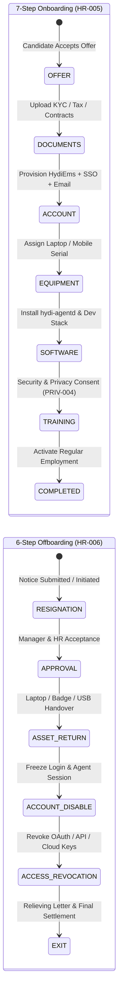

# PHASE 27: Core HR Lifecycle, Leave Accrual Engine, Performance 360, KPIs, OKRs & Modular Payroll Engine

**Document Version:** 1.0.0  
**Architecture Tier:** Enterprise HCM, Automated Leave Accrual Ledger, Ethical Performance Management & Payroll Sync  
**Primary Stack:** Fastify 5.x (TypeScript) | MySQL 8.0 InnoDB | ClickHouse 24.x | Redis 7.x | S3/MinIO Document Vault | BullMQ Scheduled Crons  
**Covered Screen IDs:** `HR-001`..`HR-006`, `LEAVE-001`..`LEAVE-012`, `PERF-001`..`PERF-004`, `KPI-001`..`KPI-004`, `OKR-001`..`OKR-005`, `PAY-001`..`PAY-006`

---

## 1. Executive Architecture & Lifecycle State Machines

Phase 27 unifies five tightly coupled Human Capital Management (HCM) domains into a single transactional backbone:
1. **Core HR & Lifecycle Workflows (`HR-001..006`)**: Master employee records, encrypted S3 document vault, a deterministic **7-Step Onboarding State Machine**, and a security-integrated **6-Step Offboarding State Machine** that automatically triggers account disablement, SSO/API token revocation, and MDM/Agent de-provisioning.
2. **Enterprise Leave & Accrual Engine (`LEAVE-001..012`)**: Double-entry leave balance ledger supporting pro-rata monthly/annual accruals, carry-forward caps, encashment, sandwich rules, blackout dates (`LEAVE-008`), hourly short leaves (`LEAVE-007`), and multi-region public holiday calendars (`LEAVE-010`).
3. **Ethical Performance Management (`PERF-001..004`, `KPI-001..004`, `OKR-001..005`)**: Combines qualitative 360° peer/manager/self reviews with quantitative KPIs and hierarchical OKRs, governed by strict **Ethical Guardrails** (activity metrics cannot be used as the sole automated determinant of performance ratings without human contextual calibration).
4. **Modular Payroll Engine (`PAY-001..006`)**: Reconciles verified attendance days, approved paid/unpaid leaves (LOP), shift allowances, and approved overtime into locked payroll runs with native connectors for **India Statutory Compliance (PF, ESI, PT, TDS, GreytHR, Keka, RazorpayX, Zoho Payroll)** and **Global Payroll Providers (Deel, Gusto, Rippling, ADP, Workday)**.



---

## 2. Database Schema Specifications (MySQL 8.0 InnoDB)

```sql
-- ============================================================================
-- 1. CORE HR RECORDS, DOCUMENT VAULT & ONBOARDING/OFFBOARDING (HR-001..006)
-- ============================================================================
CREATE TABLE hr_employee_profiles (
    user_id CHAR(36) NOT NULL PRIMARY KEY,
    tenant_id CHAR(36) NOT NULL,
    employee_code VARCHAR(32) NOT NULL COMMENT 'e.g. EMP-1042',
    legal_first_name VARCHAR(100) NOT NULL,
    legal_last_name VARCHAR(100) NOT NULL,
    employment_type ENUM('FULL_TIME', 'PART_TIME', 'CONTRACTOR', 'INTERN', 'CONSULTANT') NOT NULL DEFAULT 'FULL_TIME',
    employment_status ENUM('ONBOARDING', 'PROBATION', 'ACTIVE', 'NOTICE_PERIOD', 'SUSPENDED', 'EXITED') NOT NULL DEFAULT 'ONBOARDING',
    work_mode ENUM('OFFICE', 'REMOTE', 'HYBRID', 'FIELD') NOT NULL DEFAULT 'HYBRID',
    department_id CHAR(36) NOT NULL,
    designation_title VARCHAR(120) NOT NULL,
    reporting_manager_id CHAR(36) NULL,
    dotted_line_manager_id CHAR(36) NULL,
    work_location_id CHAR(36) NULL,
    date_of_joining DATE NOT NULL,
    probation_end_date DATE NULL,
    confirmation_date DATE NULL,
    date_of_exit DATE NULL,
    notice_period_days INT UNSIGNED NOT NULL DEFAULT 60,
    cost_center_code VARCHAR(64) NULL,
    -- Encrypted Statutory & Banking JSON (AES-256-GCM at application layer)
    statutory_ids_encrypted BLOB NULL COMMENT 'PAN, UAN, PF No, ESI No, SSN, National ID',
    bank_details_encrypted BLOB NULL COMMENT 'Account Holder, Account No, IFSC/IBAN/Routing, Bank Name',
    emergency_contact_json JSON NULL,
    created_at DATETIME(3) NOT NULL DEFAULT CURRENT_TIMESTAMP(3),
    updated_at DATETIME(3) NOT NULL DEFAULT CURRENT_TIMESTAMP(3) ON UPDATE CURRENT_TIMESTAMP(3),
    UNIQUE KEY uq_hr_emp_code (tenant_id, employee_code),
    INDEX idx_hr_dept_status (tenant_id, department_id, employment_status),
    INDEX idx_hr_manager (tenant_id, reporting_manager_id)
) ENGINE=InnoDB DEFAULT CHARSET=utf8mb4 COLLATE=utf8mb4_unicode_ci;

CREATE TABLE hr_document_vault (
    id CHAR(36) NOT NULL PRIMARY KEY,
    tenant_id CHAR(36) NOT NULL,
    user_id CHAR(36) NOT NULL,
    category ENUM('OFFER_LETTER', 'EMPLOYMENT_CONTRACT', 'KYC_ID', 'TAX_DECLARATION', 'NDA_POLICY', 'PAYSLIP', 'RELIEVING_LETTER', 'CERTIFICATION') NOT NULL,
    title VARCHAR(200) NOT NULL,
    s3_object_key VARCHAR(512) NOT NULL,
    file_sha256 CHAR(64) NOT NULL,
    mime_type VARCHAR(100) NOT NULL,
    file_size_bytes BIGINT UNSIGNED NOT NULL,
    verification_status ENUM('PENDING', 'VERIFIED', 'REJECTED', 'EXPIRED') NOT NULL DEFAULT 'PENDING',
    verified_by CHAR(36) NULL,
    expires_on DATE NULL,
    is_employee_visible BOOLEAN NOT NULL DEFAULT TRUE,
    created_at DATETIME(3) NOT NULL DEFAULT CURRENT_TIMESTAMP(3),
    INDEX idx_hr_doc_user (tenant_id, user_id, category)
) ENGINE=InnoDB DEFAULT CHARSET=utf8mb4 COLLATE=utf8mb4_unicode_ci;

CREATE TABLE hr_lifecycle_workflows (
    id CHAR(36) NOT NULL PRIMARY KEY,
    tenant_id CHAR(36) NOT NULL,
    user_id CHAR(36) NOT NULL,
    workflow_type ENUM('ONBOARDING_7_STEP', 'OFFBOARDING_6_STEP') NOT NULL,
    current_step ENUM(
        -- Onboarding 7 Steps
        'OFFER', 'DOCUMENTS', 'ACCOUNT', 'EQUIPMENT', 'SOFTWARE', 'TRAINING', 'COMPLETED',
        -- Offboarding 6 Steps
        'RESIGNATION', 'APPROVAL', 'ASSET_RETURN', 'ACCOUNT_DISABLE', 'ACCESS_REVOCATION', 'EXIT'
    ) NOT NULL,
    step_statuses_json JSON NOT NULL COMMENT 'Per-step status, assignee, completed_at, checklist items',
    assigned_hr_owner_id CHAR(36) NOT NULL,
    assigned_it_owner_id CHAR(36) NULL,
    target_completion_date DATE NOT NULL,
    completed_at DATETIME(3) NULL,
    created_at DATETIME(3) NOT NULL DEFAULT CURRENT_TIMESTAMP(3),
    updated_at DATETIME(3) NOT NULL DEFAULT CURRENT_TIMESTAMP(3) ON UPDATE CURRENT_TIMESTAMP(3),
    INDEX idx_hr_wf_lookup (tenant_id, workflow_type, current_step)
) ENGINE=InnoDB DEFAULT CHARSET=utf8mb4 COLLATE=utf8mb4_unicode_ci;

-- ============================================================================
-- 2. LEAVE TYPES, ACCRUAL ENGINE, SHORT LEAVE & BLACKOUT DATES (LEAVE-001..012)
-- ============================================================================
CREATE TABLE leave_types (
    id CHAR(36) NOT NULL PRIMARY KEY,
    tenant_id CHAR(36) NOT NULL,
    code VARCHAR(16) NOT NULL COMMENT 'e.g. CL, SL, EL, PL, ML, COMP_OFF, LOP, SHORT',
    name VARCHAR(100) NOT NULL,
    is_paid BOOLEAN NOT NULL DEFAULT TRUE,
    allow_half_day BOOLEAN NOT NULL DEFAULT TRUE,
    is_short_leave_hourly BOOLEAN NOT NULL DEFAULT FALSE COMMENT 'True for LEAVE-007 Short Leave (e.g. 2 hours)',
    max_short_leave_hours_per_request DECIMAL(4,2) NULL DEFAULT 2.00,
    max_short_leaves_per_month INT UNSIGNED NULL DEFAULT 2,
    -- Accrual & Carry Forward Rules (LEAVE-009)
    accrual_frequency ENUM('NONE', 'MONTHLY', 'QUARTERLY', 'ANNUAL_UPFRONT', 'BI_ANNUAL') NOT NULL DEFAULT 'MONTHLY',
    annual_quota_days DECIMAL(5,2) NOT NULL DEFAULT 12.00,
    pro_rate_on_joining_month BOOLEAN NOT NULL DEFAULT TRUE,
    joining_cutoff_day_for_full_credit TINYINT UNSIGNED NOT NULL DEFAULT 15,
    allow_carry_forward BOOLEAN NOT NULL DEFAULT TRUE,
    max_carry_forward_days DECIMAL(5,2) NOT NULL DEFAULT 30.00,
    allow_encashment BOOLEAN NOT NULL DEFAULT FALSE,
    allow_negative_balance BOOLEAN NOT NULL DEFAULT FALSE,
    max_negative_days DECIMAL(4,2) NOT NULL DEFAULT 0.00,
    -- Restrictions (LEAVE-008)
    min_notice_days INT UNSIGNED NOT NULL DEFAULT 0,
    max_consecutive_days INT UNSIGNED NULL,
    require_attachment_after_days INT UNSIGNED NULL COMMENT 'e.g. Medical certificate required if SL > 2 days',
    sandwich_rule_enabled BOOLEAN NOT NULL DEFAULT FALSE COMMENT 'Counts intervening weekends/holidays if flanked by leave',
    applicable_genders JSON NULL,
    is_active BOOLEAN NOT NULL DEFAULT TRUE,
    created_at DATETIME(3) NOT NULL DEFAULT CURRENT_TIMESTAMP(3),
    UNIQUE KEY uq_leave_type_code (tenant_id, code)
) ENGINE=InnoDB DEFAULT CHARSET=utf8mb4 COLLATE=utf8mb4_unicode_ci;

CREATE TABLE leave_blackout_restrictions (
    id CHAR(36) NOT NULL PRIMARY KEY,
    tenant_id CHAR(36) NOT NULL,
    name VARCHAR(150) NOT NULL COMMENT 'e.g. Q4 Year-End Freeze / Black Friday Deployment',
    department_id CHAR(36) NULL,
    start_date DATE NOT NULL,
    end_date DATE NOT NULL,
    restriction_mode ENUM('HARD_BLOCK', 'REQUIRE_VP_OVERRIDE', 'MAX_TEAM_ABSENCE_PERCENT') NOT NULL DEFAULT 'MAX_TEAM_ABSENCE_PERCENT',
    max_team_absence_percent DECIMAL(5,2) NOT NULL DEFAULT 15.00,
    exempt_leave_type_ids JSON NULL COMMENT 'e.g. Sick Leave / Bereavement exempt from blackout',
    created_by CHAR(36) NOT NULL,
    created_at DATETIME(3) NOT NULL DEFAULT CURRENT_TIMESTAMP(3),
    INDEX idx_leave_blackout_dates (tenant_id, start_date, end_date)
) ENGINE=InnoDB DEFAULT CHARSET=utf8mb4 COLLATE=utf8mb4_unicode_ci;

CREATE TABLE leave_balance_ledger (
    id CHAR(36) NOT NULL PRIMARY KEY,
    tenant_id CHAR(36) NOT NULL,
    user_id CHAR(36) NOT NULL,
    leave_type_id CHAR(36) NOT NULL,
    leave_year SMALLINT UNSIGNED NOT NULL COMMENT 'e.g. 2026',
    transaction_type ENUM(
        'OPENING_BALANCE',
        'MONTHLY_ACCRUAL',
        'ANNUAL_GRANT',
        'CARRY_FORWARD_IN',
        'LAPSED_EXPIRED',
        'LEAVE_DEBIT',
        'SHORT_LEAVE_DEBIT',
        'LEAVE_CANCEL_REFUND',
        'COMP_OFF_CREDIT',
        'ENCASHMENT_DEBIT',
        'MANUAL_HR_ADJUSTMENT'
    ) NOT NULL,
    delta_days DECIMAL(6,3) NOT NULL COMMENT 'Positive for credits, negative for debits (e.g. -0.250 for 2h short leave)',
    balance_after DECIMAL(6,3) NOT NULL,
    reference_request_id CHAR(36) NULL,
    notes VARCHAR(500) NULL,
    created_by CHAR(36) NULL,
    created_at DATETIME(3) NOT NULL DEFAULT CURRENT_TIMESTAMP(3),
    INDEX idx_leave_ledger_user (tenant_id, user_id, leave_type_id, leave_year, created_at ASC)
) ENGINE=InnoDB DEFAULT CHARSET=utf8mb4 COLLATE=utf8mb4_unicode_ci;

CREATE TABLE leave_requests (
    id CHAR(36) NOT NULL PRIMARY KEY,
    tenant_id CHAR(36) NOT NULL,
    user_id CHAR(36) NOT NULL,
    leave_type_id CHAR(36) NOT NULL,
    duration_mode ENUM('FULL_DAY', 'FIRST_HALF', 'SECOND_HALF', 'SHORT_LEAVE_HOURLY') NOT NULL DEFAULT 'FULL_DAY',
    start_date DATE NOT NULL,
    end_date DATE NOT NULL,
    short_leave_start_time TIME NULL COMMENT 'Populated when duration_mode = SHORT_LEAVE_HOURLY (LEAVE-007)',
    short_leave_end_time TIME NULL,
    total_days DECIMAL(5,3) NOT NULL COMMENT 'Includes sandwich days if applicable; 2h short leave = 0.250 days',
    reason TEXT NOT NULL,
    attachment_s3_key VARCHAR(512) NULL,
    status ENUM('PENDING_MANAGER', 'PENDING_HR', 'APPROVED', 'REJECTED', 'CANCELLED', 'WITHDRAWN') NOT NULL DEFAULT 'PENDING_MANAGER',
    approver_manager_id CHAR(36) NULL,
    manager_decided_at DATETIME(3) NULL,
    approver_hr_id CHAR(36) NULL,
    hr_decided_at DATETIME(3) NULL,
    rejection_reason TEXT NULL,
    created_at DATETIME(3) NOT NULL DEFAULT CURRENT_TIMESTAMP(3),
    updated_at DATETIME(3) NOT NULL DEFAULT CURRENT_TIMESTAMP(3) ON UPDATE CURRENT_TIMESTAMP(3),
    INDEX idx_leave_req_user_dates (tenant_id, user_id, start_date, end_date),
    INDEX idx_leave_req_status (tenant_id, status, start_date)
) ENGINE=InnoDB DEFAULT CHARSET=utf8mb4 COLLATE=utf8mb4_unicode_ci;

-- ============================================================================
-- 3. PERFORMANCE CYCLES, 360 REVIEWS, KPIs & OKRs (PERF-001..004, KPI-001..004, OKR-001..005)
-- ============================================================================
CREATE TABLE performance_review_cycles (
    id CHAR(36) NOT NULL PRIMARY KEY,
    tenant_id CHAR(36) NOT NULL,
    name VARCHAR(150) NOT NULL COMMENT 'e.g. FY2026 H2 Performance & Calibration Cycle',
    period_start DATE NOT NULL,
    period_end DATE NOT NULL,
    self_review_due_date DATE NOT NULL,
    peer_360_due_date DATE NOT NULL,
    manager_review_due_date DATE NOT NULL,
    calibration_due_date DATE NOT NULL,
    weight_okr_percent DECIMAL(5,2) NOT NULL DEFAULT 40.00,
    weight_kpi_percent DECIMAL(5,2) NOT NULL DEFAULT 30.00,
    weight_competency_360_percent DECIMAL(5,2) NOT NULL DEFAULT 30.00,
    -- Ethical Guardrail Setting
    max_telemetry_kpi_weight_cap DECIMAL(5,2) NOT NULL DEFAULT 15.00 COMMENT 'Hard ethical cap preventing automated activity scores from dominating reviews',
    status ENUM('DRAFT', 'SELF_ASSESSMENT', 'PEER_360', 'MANAGER_REVIEW', 'CALIBRATION', 'PUBLISHED', 'CLOSED') NOT NULL DEFAULT 'DRAFT',
    created_at DATETIME(3) NOT NULL DEFAULT CURRENT_TIMESTAMP(3)
) ENGINE=InnoDB DEFAULT CHARSET=utf8mb4 COLLATE=utf8mb4_unicode_ci;

CREATE TABLE performance_360_feedback (
    id CHAR(36) NOT NULL PRIMARY KEY,
    tenant_id CHAR(36) NOT NULL,
    cycle_id CHAR(36) NOT NULL,
    reviewee_user_id CHAR(36) NOT NULL,
    reviewer_user_id CHAR(36) NOT NULL,
    reviewer_relationship ENUM('SELF', 'DIRECT_MANAGER', 'PEER', 'DIRECT_REPORT', 'CROSS_FUNCTIONAL') NOT NULL,
    is_anonymous_to_reviewee BOOLEAN NOT NULL DEFAULT TRUE,
    competency_scores_json JSON NOT NULL COMMENT '1.0 to 5.0 ratings per competency pillar',
    strengths_text TEXT NOT NULL,
    growth_areas_text TEXT NOT NULL,
    bias_warning_flags_json JSON NULL COMMENT 'Detected recency bias, halo/horn effect, or unsubstantiated one-word ratings',
    status ENUM('INVITED', 'DRAFT', 'SUBMITTED') NOT NULL DEFAULT 'INVITED',
    submitted_at DATETIME(3) NULL,
    UNIQUE KEY uq_360_review_pair (cycle_id, reviewee_user_id, reviewer_user_id)
) ENGINE=InnoDB DEFAULT CHARSET=utf8mb4 COLLATE=utf8mb4_unicode_ci;

CREATE TABLE kpi_definitions_and_assignments (
    id CHAR(36) NOT NULL PRIMARY KEY,
    tenant_id CHAR(36) NOT NULL,
    user_id CHAR(36) NULL COMMENT 'NULL for template KPI',
    department_id CHAR(36) NULL,
    title VARCHAR(180) NOT NULL,
    unit ENUM('NUMBER', 'PERCENTAGE', 'CURRENCY', 'HOURS', 'BOOLEAN') NOT NULL DEFAULT 'PERCENTAGE',
    polarity ENUM('HIGHER_IS_BETTER', 'LOWER_IS_BETTER', 'TARGET_BAND') NOT NULL DEFAULT 'HIGHER_IS_BETTER',
    target_value DECIMAL(14,2) NOT NULL,
    actual_value DECIMAL(14,2) NOT NULL DEFAULT 0.00,
    weight_percent DECIMAL(5,2) NOT NULL DEFAULT 25.00,
    data_source ENUM('MANUAL', 'PROJECT_TASKS_COMPLETED', 'SPRINT_VELOCITY', 'ATTENDANCE_PUNCTUALITY', 'EXTERNAL_CRM_WEBHOOK') NOT NULL DEFAULT 'MANUAL',
    period_start DATE NOT NULL,
    period_end DATE NOT NULL,
    updated_at DATETIME(3) NOT NULL DEFAULT CURRENT_TIMESTAMP(3) ON UPDATE CURRENT_TIMESTAMP(3),
    INDEX idx_kpi_user_period (tenant_id, user_id, period_start, period_end)
) ENGINE=InnoDB DEFAULT CHARSET=utf8mb4 COLLATE=utf8mb4_unicode_ci;

CREATE TABLE okr_objectives (
    id CHAR(36) NOT NULL PRIMARY KEY,
    tenant_id CHAR(36) NOT NULL,
    parent_objective_id CHAR(36) NULL COMMENT 'Supports Company -> Department -> Team -> Individual alignment tree',
    level ENUM('COMPANY', 'DEPARTMENT', 'TEAM', 'INDIVIDUAL') NOT NULL,
    owner_user_id CHAR(36) NOT NULL,
    department_id CHAR(36) NULL,
    quarter_label VARCHAR(16) NOT NULL COMMENT 'e.g. 2026-Q3',
    title VARCHAR(255) NOT NULL,
    description TEXT NULL,
    progress_percent DECIMAL(5,2) NOT NULL DEFAULT 0.00,
    status ENUM('ON_TRACK', 'AT_RISK', 'OFF_TRACK', 'COMPLETED', 'CANCELLED') NOT NULL DEFAULT 'ON_TRACK',
    created_at DATETIME(3) NOT NULL DEFAULT CURRENT_TIMESTAMP(3),
    updated_at DATETIME(3) NOT NULL DEFAULT CURRENT_TIMESTAMP(3) ON UPDATE CURRENT_TIMESTAMP(3),
    INDEX idx_okr_tree (tenant_id, quarter_label, level, parent_objective_id)
) ENGINE=InnoDB DEFAULT CHARSET=utf8mb4 COLLATE=utf8mb4_unicode_ci;

CREATE TABLE okr_key_results (
    id CHAR(36) NOT NULL PRIMARY KEY,
    tenant_id CHAR(36) NOT NULL,
    objective_id CHAR(36) NOT NULL,
    title VARCHAR(255) NOT NULL,
    metric_unit ENUM('PERCENT', 'NUMBER', 'CURRENCY', 'MILESTONE') NOT NULL DEFAULT 'NUMBER',
    start_value DECIMAL(14,2) NOT NULL DEFAULT 0.00,
    target_value DECIMAL(14,2) NOT NULL,
    current_value DECIMAL(14,2) NOT NULL DEFAULT 0.00,
    weight DECIMAL(5,2) NOT NULL DEFAULT 1.00,
    linked_project_id CHAR(36) NULL COMMENT 'Optional auto-sync from PM module',
    last_checkin_note TEXT NULL,
    last_checkin_at DATETIME(3) NULL,
    CONSTRAINT fk_kr_objective FOREIGN KEY (objective_id) REFERENCES okr_objectives(id) ON DELETE CASCADE
) ENGINE=InnoDB DEFAULT CHARSET=utf8mb4 COLLATE=utf8mb4_unicode_ci;

-- ============================================================================
-- 4. MODULAR PAYROLL ENGINE (PAY-001..006)
-- ============================================================================
CREATE TABLE payroll_periods (
    id CHAR(36) NOT NULL PRIMARY KEY,
    tenant_id CHAR(36) NOT NULL,
    period_code VARCHAR(16) NOT NULL COMMENT 'e.g. 2026-09',
    start_date DATE NOT NULL,
    end_date DATE NOT NULL,
    attendance_cutoff_date DATE NOT NULL,
    status ENUM('OPEN_DRAFT', 'INPUTS_FROZEN', 'CALCULATED', 'UNDER_REVIEW', 'APPROVED_LOCKED', 'EXPORTED_DISBURSED') NOT NULL DEFAULT 'OPEN_DRAFT',
    country_regime ENUM('INDIA_STATUTORY', 'US_FLSA', 'UK_HMRC', 'UAE_WPS', 'GLOBAL_GENERIC') NOT NULL DEFAULT 'INDIA_STATUTORY',
    total_headcount INT UNSIGNED NOT NULL DEFAULT 0,
    total_gross_amount DECIMAL(16,2) NOT NULL DEFAULT 0.00,
    total_deductions_amount DECIMAL(16,2) NOT NULL DEFAULT 0.00,
    total_net_payable DECIMAL(16,2) NOT NULL DEFAULT 0.00,
    currency CHAR(3) NOT NULL DEFAULT 'INR',
    locked_by CHAR(36) NULL,
    locked_at DATETIME(3) NULL,
    UNIQUE KEY uq_payroll_period (tenant_id, period_code)
) ENGINE=InnoDB DEFAULT CHARSET=utf8mb4 COLLATE=utf8mb4_unicode_ci;

CREATE TABLE payroll_employee_ledgers (
    id CHAR(36) NOT NULL PRIMARY KEY,
    tenant_id CHAR(36) NOT NULL,
    payroll_period_id CHAR(36) NOT NULL,
    user_id CHAR(36) NOT NULL,
    calendar_days DECIMAL(4,1) NOT NULL,
    present_working_days DECIMAL(5,2) NOT NULL,
    paid_leave_days DECIMAL(5,2) NOT NULL,
    public_holidays_count DECIMAL(4,1) NOT NULL,
    loss_of_pay_days DECIMAL(5,2) NOT NULL DEFAULT 0.00,
    approved_overtime_hours DECIMAL(6,2) NOT NULL DEFAULT 0.00,
    overtime_multiplier DECIMAL(4,2) NOT NULL DEFAULT 1.50,
    -- Earnings & Statutory Breakdown JSON
    earnings_breakdown_json JSON NOT NULL COMMENT '{basic, hra, special_allowance, overtime_pay, shift_allowance, reimbursement_expenses}',
    deductions_breakdown_json JSON NOT NULL COMMENT '{pf_employee, esi_employee, professional_tax, tds_income_tax, lop_deduction, salary_advance}',
    employer_contributions_json JSON NOT NULL COMMENT '{pf_employer, esi_employer, gratuity_accrual}',
    gross_earnings DECIMAL(14,2) NOT NULL,
    total_deductions DECIMAL(14,2) NOT NULL,
    net_payable DECIMAL(14,2) NOT NULL,
    payslip_s3_key VARCHAR(512) NULL,
    connector_sync_status ENUM('NOT_SYNCED', 'SYNCED', 'FAILED') NOT NULL DEFAULT 'NOT_SYNCED',
    connector_external_ref VARCHAR(128) NULL,
    CONSTRAINT fk_pay_emp_period FOREIGN KEY (payroll_period_id) REFERENCES payroll_periods(id) ON DELETE CASCADE,
    UNIQUE KEY uq_pay_emp_run (payroll_period_id, user_id)
) ENGINE=InnoDB DEFAULT CHARSET=utf8mb4 COLLATE=utf8mb4_unicode_ci;
```

---

## 3. Screen-by-Screen Engineering Specifications

### 3.1 Core HR & Onboarding/Offboarding (`HR-001` to `HR-006`)
* **`HR-001` — HR Command Dashboard (`/hr/dashboard`)**: Headcount by department/work-mode, active onboarding/offboarding pipelines, probation confirmations due in 30 days, document expiry alerts (visas/contracts), and diversity/tenure distribution.
* **`HR-002` — Employee Directory & Master Records (`/hr/employees`)**: Searchable table and org-chart tree with bulk CSV import/export, status badges (`ONBOARDING`, `PROBATION`, `ACTIVE`, `NOTICE_PERIOD`, `EXITED`), and department/location filters.
* **`HR-003` — Employment Details & Compensation History (`/hr/employees/:id/employment`)**: Manages designation history, reporting manager hierarchy, probation confirmation workflow, cost centers, and AES-256-GCM encrypted statutory/bank fields (requires `hr:compensation:view` permission to unmask).
* **`HR-004` — Employee Document Vault (`/hr/employees/:id/documents`)**: Pre-signed S3 document upload/preview with SHA-256 integrity verification, HR verification sign-off (`PENDING -> VERIFIED | REJECTED`), and automated expiry reminders.
* **`HR-005` — 7-Step Onboarding Workflow (`/hr/onboarding`)**: Interactive Kanban & checklist tracker enforcing sequential or parallel completion across:
  1. `Offer` (Signed Offer Letter verified)
  2. `Documents` (KYC, PAN/SSN, Bank & Tax declarations uploaded)
  3. `Account` (HydiEms user, Google Workspace / Entra ID SSO provisioned)
  4. `Equipment` (Laptop serial & asset tag bound to employee)
  5. `Software` (`hydi-agentd` installed and reporting heartbeat)
  6. `Training` (Mandatory Security & Privacy Consent `PRIV-004` signed)
  7. `Completed` (Status transitions to `PROBATION` or `ACTIVE`, triggers initial leave balance pro-rata grant).
* **`HR-006` — 6-Step Offboarding & Zero-Trust Revocation Workflow (`/hr/offboarding`)**:
  1. `Resignation` (Notice logged, Last Working Day calculated)
  2. `Approval` (Manager & HR sign-off, knowledge transfer checklist assigned)
  3. `Asset Return` (Hardware & USB whitelist clearance verified)
  4. `Account Disable` (Automatically sets `users.is_active = false`, terminates active WebSocket sessions, and stops agent tracking)
  5. `Access Revocation` (Deletes active Redis refresh tokens, revokes scoped API keys `API-002`, and fires SCIM deprovisioning webhook)
  6. `Exit` (Locks leave balance for encashment calculation in `PAY-003` and generates relieving letter).

---

### 3.2 Leave Management & Accrual Engine (`LEAVE-001` to `LEAVE-012`)

| Screen ID | Screen Name | Route | Engineering Specification |
| :--- | :--- | :--- | :--- |
| `LEAVE-001` | **Leave Dashboard** | `/leaves/dashboard` | Today's who's-out widget, pending approval SLA queue, department absenteeism rate, and upcoming public holidays. |
| `LEAVE-002` | **Leave Types & Policy Engine** | `/leaves/types` | Configures paid/unpaid types, sandwich rules, half-day rules, medical attachment thresholds, and encashment formulas. |
| `LEAVE-003` | **Apply Leave Request** | `/leaves/apply` | Interactive date picker that dynamically computes `total_days` in real time—automatically excluding public holidays (`LEAVE-010`) and weekly offs unless `sandwich_rule_enabled = true`, checking `LEAVE-008` blackout dates, and showing projected closing balance. |
| `LEAVE-004` | **Leave Approval Queue** | `/leaves/approvals` | Multi-stage approval inbox (`PENDING_MANAGER -> PENDING_HR -> APPROVED`) showing team overlap conflict warnings (e.g., *"2 other engineers in Backend Team are already on leave on 28 Sep"*). |
| `LEAVE-005` | **Personal Leave Calendar** | `/leaves/my-calendar` | Monthly/annual calendar overlaying approved leaves, pending requests, short leaves, and regional holidays. |
| `LEAVE-006` | **Leave Balance & Ledger** | `/leaves/balances` | Displays double-entry ledger history (`OPENING_BALANCE`, `MONTHLY_ACCRUAL`, `LEAVE_DEBIT`, `CARRY_FORWARD_IN`) per leave type with exact `delta_days` and `balance_after`. |
| `LEAVE-007` | **Short Leave (Hourly Permission)** | `/leaves/short-leave` | Allows requesting time-bounded intraday leave (e.g., `14:00` to `16:00`, max `2.0 hours`, capped at `N` times/month). Automatically pauses desktop agent idle penalties during the approved window and debits `0.250 days` (or configured ratio) from the ledger. |
| `LEAVE-008` | **Leave Restrictions & Blackout Dates** | `/leaves/restrictions` | Configures company/department freeze windows (`HARD_BLOCK`, `REQUIRE_VP_OVERRIDE`, or `MAX_TEAM_ABSENCE_PERCENT` e.g., max 15% of team out simultaneously). |
| `LEAVE-009` | **Leave Accrual & Year-End Carry-Forward Engine** | `/leaves/accrual-engine` | BullMQ cron job (`0 0 1 * *`) & manual simulation console. Computes monthly pro-rata credit: $\text{Credit} = \frac{\text{AnnualQuota}}{12}$. On Jan 1 / Apr 1 fiscal rollover, calculates $\text{CarryForward} = \min(\text{ClosingBalance}, \text{MaxCarryForward})$, writes `LAPSED_EXPIRED` and `CARRY_FORWARD_IN` ledger entries idempotently. |
| `LEAVE-010` | **Public Holiday Calendar** | `/leaves/holidays` | Multi-location holiday calendars (e.g., India-Bengaluru, India-Mumbai, US-NY, UK-London) supporting Fixed and Floating/Restricted (Optional) holidays. |
| `LEAVE-011` | **Team Leave Availability Matrix** | `/leaves/team-calendar` | Gantt-style resource availability grid across a team/department with capacity heat-bar at the top of each day. |
| `LEAVE-012` | **Leave Analytics & Liability Reports** | `/leaves/reports` | Leave utilization trends, Bradford Factor absenteeism index ($B = S^2 \times D$, used strictly for HR support check-ins), and accrued leave financial liability export for Finance. |

---

### 3.3 Performance 360, KPIs & OKRs (`PERF-001..004`, `KPI-001..004`, `OKR-001..005`)

* **`PERF-001..004` — Performance Management & Ethical 360° Reviews (`/performance/*`)**:
  - `PERF-001` **Performance Dashboard**: Cycle completion progress, 9-Box Talent Matrix (Performance vs. Potential), and department calibration curves.
  - `PERF-002` **Employee Performance Scorecard**: Unified view combining OKR attainment (`40%`), KPI score (`30%`), and 360° Competency score (`30%`).
  - `PERF-003` **360° Review Workspace & Ethical Guardrails**:
    - Enforces **Ethical Guardrail #1**: Automated HydiEms activity/productivity telemetry is capped at `max_telemetry_kpi_weight_cap` (default $\le 15\%$) and displays a mandatory contextual banner reminding reviewers that offline deep work, meetings, and mentoring are not captured by keystrokes.
    - Enforces **Ethical Guardrail #2 (Anti-Bias Linter)**: Detects extreme all-1 or all-5 ratings without written evidence (`< 50 chars`) and prompts the reviewer to cite specific deliverables.
  - `PERF-004` **Review Cycles & Calibration**: Admin setup for cycle dates, weights, and bell-curve calibration sessions.
* **`KPI-001..004` — Key Performance Indicators (`/kpis/*`)**:
  - `KPI-001` KPI Dashboard, `KPI-002` Role/Department KPI Library & Templates, `KPI-003` Employee KPI Assignment & Auto-Sync (pulls completed task counts or sprint velocity from Phase 24), `KPI-004` KPI Trend & Variance Report.
* **`OKR-001..005` — Objectives & Key Results (`/okrs/*`)**:
  - `OKR-001` OKR Dashboard, `OKR-002` Visual Alignment Tree (`Company -> Department -> Team -> Individual`), `OKR-003` Objective & Key Result Builder, `OKR-004` Weekly Key Result Check-In Drawer (updates `current_value` and cascades weighted roll-up `progress_percent` to parent Objectives), `OKR-005` Quarterly OKR Retrospective Report.

---

### 3.4 Modular Payroll Engine (`PAY-001` to `PAY-006`)

* **`PAY-001` — Payroll Command Dashboard (`/payroll/dashboard`)**: Current pay period status, total gross/net outlay, month-over-month variance, LOP summary, overtime cost, and statutory remittance deadlines.
* **`PAY-002` — Payroll Period Management & Lock Workflow (`/payroll/periods`)**: State machine (`OPEN_DRAFT -> INPUTS_FROZEN -> CALCULATED -> UNDER_REVIEW -> APPROVED_LOCKED -> EXPORTED_DISBURSED`). Freezing inputs locks attendance regularizations and leave approvals for that month.
* **`PAY-003` — Employee Payroll Register & Salary Structure (`/payroll/employees`)**: Interactive spreadsheet view of every employee's CTC structure, Basic, HRA, Special Allowance, PF (`12%` of Basic or statutory ceiling), ESI (`0.75%` employee / `3.25%` employer where applicable), Professional Tax (state-slab aware), and TDS.
* **`PAY-004` — Attendance & Leave Inputs Reconciliation (`/payroll/attendance-inputs`)**: Pulls verified attendance days from Phase 19, approved paid leaves and LOP days from `LEAVE-006`, and approved field expense reimbursements from Phase 29 (`FIELD-008`). Formula:
  $$\text{PayableDays} = \text{CalendarDays} - \text{LOPDays}$$
  $$\text{ProratedBasic} = \text{MonthlyBasic} \times \frac{\text{PayableDays}}{\text{CalendarDays}}$$
* **`PAY-005` — Overtime Calculation & Approval Sync (`/payroll/overtime`)**: Imports approved overtime hours and applies policy multipliers (`1.5x` weekday OT, `2.0x` holiday/weekend OT):
  $$\text{OvertimePay} = \text{ApprovedOTHours} \times \left(\frac{\text{MonthlyGross}}{\text{StandardMonthlyHours}}\right) \times \text{Multiplier}$$
* **`PAY-006` — Payroll Export, Payslip Generator & India/Global Connectors (`/payroll/export`)**:
  - Generates watermarked PDF payslips stored in `hr_document_vault` (`EMP-009`).
  - **India Connectors**: One-click API push or formatted ECR/CSV export for **EPFO Unified Portal (ECR v2)**, **ESIC**, **GreytHR**, **Keka HR**, **Zoho Payroll**, and **RazorpayX Payroll** bank disbursement files (NEFT/IMPS batch format).
  - **Global Connectors**: OAuth2/Webhook sync with **Deel**, **Gusto**, **Rippling**, and **ADP Workforce Now**.

---

## 4. Fastify API Endpoints & Validation Rules

### 4.1 Key REST Endpoints
* `POST /api/v1/hr/workflows/:id/advance-step` — Advances `HR-005` (Onboarding) or `HR-006` (Offboarding) step; when advancing to `ACCOUNT_DISABLE` or `ACCESS_REVOCATION`, executes atomic transaction revoking sessions and API tokens.
* `POST /api/v1/leaves/requests` — Validates balance, blackout rules (`LEAVE-008`), short-leave monthly quota (`LEAVE-007`), and sandwich rules before inserting `leave_requests` and reserving balance.
* `POST /api/v1/leaves/accrual/run-cycle` — Executes idempotent monthly/annual accrual calculation (`LEAVE-009`).
* `POST /api/v1/payroll/periods/:id/calculate` — Reconciles attendance, leave, overtime, and expense inputs and computes `payroll_employee_ledgers` for all active/exiting employees in the period.
* `POST /api/v1/payroll/periods/:id/export/:connector` — Exports locked payroll run to `keka`, `greythr`, `zoho_payroll`, `epfo_ecr`, `deel`, or `gusto`.

### 4.2 RBAC & Validation Rules
1. **Double-Entry Leave Ledger Invariant**: `leave_balance_ledger` is append-only; a user's current balance for `(user_id, leave_type_id, leave_year)` must always equal $\sum \text{delta\_days}$. Concurrent leave requests use `SELECT ... FOR UPDATE` on the user's latest ledger row to prevent race-condition overdrafts.
2. **Locked Payroll Immutability**: Once `payroll_periods.status` reaches `APPROVED_LOCKED`, any attempt to mutate attendance, leave, or overtime records falling within `[start_date, end_date]` is rejected with `409 ERR_PAYROLL_PERIOD_LOCKED` (arrears must be posted to the next open period).

---

## 5. Acceptance Criteria

1. **Zero-Leak Offboarding (`HR-006`)**: Completing step 4 (`ACCOUNT_DISABLE`) and step 5 (`ACCESS_REVOCATION`) terminates all active web/mobile/desktop sessions in `< 2 seconds` via Redis Pub/Sub and invalidates all OAuth/API tokens for that user.
2. **Deterministic Leave Math (`LEAVE-003..009`)**: Applying for a Friday-to-Monday leave with `sandwich_rule_enabled = true` accurately debits `4.0` days, whereas `sandwich_rule_enabled = false` debits `2.0` days; `LEAVE-007` short leave of `2 hours` on an `8-hour` shift accurately debits `0.250` days.
3. **Penny-Exact Payroll Reconciliation (`PAY-001..006`)**: All payroll calculations use `DECIMAL(16,2)` / banker's rounding (`ROUND_HALF_EVEN`) with zero floating-point drift across LOP, Overtime, PF/ESI statutory ceilings, and net take-home pay.
