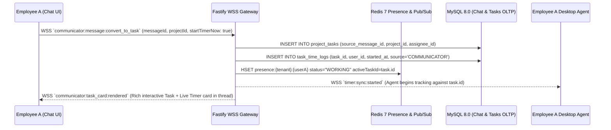

# PHASE 28: Real-Time Enterprise Communication Suite, Unified Calendar & Integrated Task-Timer Communicator

**Document Version:** 1.0.0  
**Architecture Tier:** Real-Time Collaboration, WebSocket Messaging, WebRTC Huddles & Task-Embedded Communicator  
**Primary Stack:** Fastify 5.x (TypeScript) | WebSocket (`@fastify/websocket` + Redis 7 Pub/Sub Adapter) | LiveKit / Mediasoup WebRTC SFU | MySQL 8.0 InnoDB | ClickHouse 24.x | S3/MinIO Media  
**Covered Screen IDs:** `COM-001` through `COM-006` + Integrated Task-Timer Communicator Overlay

---

## 1. Executive Architecture & Real-Time Collaboration Topology

Phase 28 embeds a full-featured enterprise communication and recognition suite directly inside HydiEms (`COM-001..006`) and bridges the gap between **conversation** and **execution** through the **Integrated Task Timer on Communicator**.

### 1.1 Key Architectural Differentiators
1. **Live Telemetry-Backed Presence Badges (`COM-004`)**: Unlike standalone chat apps (Slack/Teams) that only know if a chat tab was recently clicked, HydiEms's communicator binds directly to the employee's real-time desktop/mobile agent state in Redis (`presence:{tenantId}:{userId}`), displaying accurate live status badges:
   - 🟢 **WORKING (`ACTIVE_TASK`)**: Shows current active project/task code if permitted by privacy scope.
   - 🟡 **IDLE (`IDLE_DETECTED`)**: Workstation idle threshold exceeded.
   - ☕ **ON BREAK (`ON_BREAK`)**: Break timer active; optionally auto-suppresses non-urgent notifications.
   - 🏖️ **ON LEAVE (`ON_APPROVED_LEAVE`)**: Synced from `LEAVE-004` with return date.
   - ⚪ **OFFLINE (`CLOCKED_OUT`)**: Outside working shift / clocked out (triggers Right-to-Disconnect quiet-hours warning for senders).
2. **Integrated Task Timer inside Chat (`COM-003`, `COM-004`)**:
   - Every chat header and pinned task card embeds a live **Start / Pause / Stop Task Timer** widget synchronized bidirectionally with the Desktop Agent (`hydi-agentd`) and Project Management (`PM-001..010`) time logs.
   - Any chat message can be converted in 1 click (`"Convert to Task"`) into a tracked Project Task (`tasks` table), preserving a permanent backlink to the originating conversation thread.
3. **1-Click WebRTC Voice & Screen-Share Huddles**: Low-latency SFU rooms (LiveKit/WebRTC) launched directly from any channel (`COM-003`) or DM (`COM-004`) with optional automatic time-logging against a selected project/meeting category.



---

## 2. Database Schema Specifications (MySQL 8.0 InnoDB)

```sql
-- ============================================================================
-- 1. COMPANY FEED, RECOGNITION & KUDOS (COM-001)
-- ============================================================================
CREATE TABLE company_feed_posts (
    id CHAR(36) NOT NULL PRIMARY KEY COMMENT 'UUIDv7',
    tenant_id CHAR(36) NOT NULL,
    author_user_id CHAR(36) NOT NULL,
    post_type ENUM('STANDARD_UPDATE', 'PEER_KUDOS_RECOGNITION', 'MILESTONE_CELEBRATION', 'POLL', 'WORK_ANNIVERSARY_AUTO') NOT NULL DEFAULT 'STANDARD_UPDATE',
    visibility_scope ENUM('COMPANY_WIDE', 'DEPARTMENT_ONLY') NOT NULL DEFAULT 'COMPANY_WIDE',
    department_id CHAR(36) NULL,
    body_markdown TEXT NOT NULL,
    recognized_user_ids JSON NULL COMMENT 'Array of user UUIDs receiving Kudos',
    core_value_badge ENUM('CUSTOMER_OBSESSION', 'OWNERSHIP', 'INNOVATION', 'TEAMWORK', 'EXCELLENCE', 'INTEGRITY') NULL,
    reward_points INT UNSIGNED NOT NULL DEFAULT 0,
    media_attachments_json JSON NULL COMMENT 'Array of {s3Key, mimeType, width, height}',
    poll_options_json JSON NULL COMMENT 'Array of {optionId, text, votesCount}',
    reactions_summary_json JSON NOT NULL DEFAULT (JSON_OBJECT()) COMMENT 'Map of emoji -> count',
    comments_count INT UNSIGNED NOT NULL DEFAULT 0,
    is_pinned BOOLEAN NOT NULL DEFAULT FALSE,
    created_at DATETIME(3) NOT NULL DEFAULT CURRENT_TIMESTAMP(3),
    updated_at DATETIME(3) NOT NULL DEFAULT CURRENT_TIMESTAMP(3) ON UPDATE CURRENT_TIMESTAMP(3),
    INDEX idx_feed_tenant_time (tenant_id, is_pinned DESC, created_at DESC)
) ENGINE=InnoDB DEFAULT CHARSET=utf8mb4 COLLATE=utf8mb4_unicode_ci;

-- ============================================================================
-- 2. ANNOUNCEMENTS & MANDATORY READ RECEIPTS (COM-002)
-- ============================================================================
CREATE TABLE company_announcements (
    id CHAR(36) NOT NULL PRIMARY KEY,
    tenant_id CHAR(36) NOT NULL,
    author_user_id CHAR(36) NOT NULL,
    title VARCHAR(255) NOT NULL,
    body_markdown LONGTEXT NOT NULL,
    priority ENUM('NORMAL', 'IMPORTANT', 'URGENT_BROADCAST') NOT NULL DEFAULT 'NORMAL',
    target_scope ENUM('ALL_COMPANY', 'DEPARTMENTS', 'LOCATIONS', 'ROLES') NOT NULL DEFAULT 'ALL_COMPANY',
    target_ids_json JSON NULL COMMENT 'Array of dept/location/role UUIDs when not ALL_COMPANY',
    require_read_receipt_acknowledgement BOOLEAN NOT NULL DEFAULT TRUE,
    send_email_copy BOOLEAN NOT NULL DEFAULT FALSE,
    send_mobile_push BOOLEAN NOT NULL DEFAULT TRUE,
    total_target_recipients INT UNSIGNED NOT NULL DEFAULT 0,
    total_acknowledged_count INT UNSIGNED NOT NULL DEFAULT 0,
    published_at DATETIME(3) NOT NULL DEFAULT CURRENT_TIMESTAMP(3),
    expires_at DATETIME(3) NULL,
    INDEX idx_ann_tenant_pub (tenant_id, published_at DESC)
) ENGINE=InnoDB DEFAULT CHARSET=utf8mb4 COLLATE=utf8mb4_unicode_ci;

CREATE TABLE announcement_read_receipts (
    id CHAR(36) NOT NULL PRIMARY KEY,
    tenant_id CHAR(36) NOT NULL,
    announcement_id CHAR(36) NOT NULL,
    user_id CHAR(36) NOT NULL,
    first_viewed_at DATETIME(3) NOT NULL DEFAULT CURRENT_TIMESTAMP(3),
    acknowledged_at DATETIME(3) NULL COMMENT 'Populated when user clicks "I Have Read & Understood"',
    device_type ENUM('WEB', 'DESKTOP_AGENT', 'MOBILE_APP') NOT NULL DEFAULT 'WEB',
    CONSTRAINT fk_receipt_ann FOREIGN KEY (announcement_id) REFERENCES company_announcements(id) ON DELETE CASCADE,
    UNIQUE KEY uq_ann_user_receipt (announcement_id, user_id),
    INDEX idx_ann_receipt_lookup (tenant_id, announcement_id, acknowledged_at)
) ENGINE=InnoDB DEFAULT CHARSET=utf8mb4 COLLATE=utf8mb4_unicode_ci;

-- ============================================================================
-- 3. CHANNELS, DIRECT MESSAGES & INTEGRATED TASK COMMUNICATOR (COM-003, COM-004)
-- ============================================================================
CREATE TABLE communicator_channels (
    id CHAR(36) NOT NULL PRIMARY KEY,
    tenant_id CHAR(36) NOT NULL,
    channel_type ENUM('PUBLIC_CHANNEL', 'PRIVATE_CHANNEL', 'PROJECT_CHANNEL', 'DEPARTMENT_CHANNEL', 'DIRECT_MESSAGE', 'GROUP_DM') NOT NULL,
    name VARCHAR(120) NULL COMMENT 'NULL for 1:1 DIRECT_MESSAGE',
    topic VARCHAR(500) NULL,
    linked_project_id CHAR(36) NULL COMMENT 'Binds channel directly to a Project for 1-click task timers',
    linked_department_id CHAR(36) NULL,
    dm_participant_pair_hash CHAR(64) NULL COMMENT 'Deterministic SHA256(min_uid || ":" || max_uid) for 1:1 DMs',
    active_huddle_room_id VARCHAR(128) NULL COMMENT 'Active WebRTC SFU room ID if huddle is live',
    last_message_at DATETIME(3) NULL,
    is_archived BOOLEAN NOT NULL DEFAULT FALSE,
    created_by CHAR(36) NOT NULL,
    created_at DATETIME(3) NOT NULL DEFAULT CURRENT_TIMESTAMP(3),
    UNIQUE KEY uq_dm_pair (tenant_id, dm_participant_pair_hash),
    INDEX idx_comm_chan_project (tenant_id, linked_project_id),
    INDEX idx_comm_chan_recent (tenant_id, is_archived, last_message_at DESC)
) ENGINE=InnoDB DEFAULT CHARSET=utf8mb4 COLLATE=utf8mb4_unicode_ci;

CREATE TABLE communicator_channel_members (
    id CHAR(36) NOT NULL PRIMARY KEY,
    tenant_id CHAR(36) NOT NULL,
    channel_id CHAR(36) NOT NULL,
    user_id CHAR(36) NOT NULL,
    role ENUM('OWNER', 'MODERATOR', 'MEMBER') NOT NULL DEFAULT 'MEMBER',
    notification_preference ENUM('ALL_MESSAGES', 'MENTIONS_ONLY', 'MUTED') NOT NULL DEFAULT 'ALL_MESSAGES',
    last_read_message_id CHAR(36) NULL,
    unread_count INT UNSIGNED NOT NULL DEFAULT 0,
    unread_mentions_count INT UNSIGNED NOT NULL DEFAULT 0,
    joined_at DATETIME(3) NOT NULL DEFAULT CURRENT_TIMESTAMP(3),
    CONSTRAINT fk_comm_member_chan FOREIGN KEY (channel_id) REFERENCES communicator_channels(id) ON DELETE CASCADE,
    UNIQUE KEY uq_chan_member (channel_id, user_id),
    INDEX idx_comm_user_unreads (tenant_id, user_id, unread_count)
) ENGINE=InnoDB DEFAULT CHARSET=utf8mb4 COLLATE=utf8mb4_unicode_ci;

CREATE TABLE communicator_messages (
    id CHAR(36) NOT NULL PRIMARY KEY COMMENT 'UUIDv7 time-ordered',
    tenant_id CHAR(36) NOT NULL,
    channel_id CHAR(36) NOT NULL,
    parent_thread_message_id CHAR(36) NULL COMMENT 'Non-null for threaded replies',
    sender_user_id CHAR(36) NOT NULL,
    message_type ENUM('TEXT', 'FILE_ATTACHMENT', 'VOICE_NOTE', 'TASK_TIMER_CARD', 'HUDDLE_EVENT', 'SYSTEM_EVENT') NOT NULL DEFAULT 'TEXT',
    body_markdown TEXT NOT NULL,
    mentions_user_ids JSON NULL,
    attachments_json JSON NULL COMMENT 'Validated through DLP Layer 2/4 before upload',
    -- Integrated Task-Timer Linkage
    linked_task_id CHAR(36) NULL COMMENT 'Populated when converted to task or timer started in chat',
    linked_time_log_id CHAR(36) NULL,
    reactions_json JSON NOT NULL DEFAULT (JSON_OBJECT()),
    thread_replies_count INT UNSIGNED NOT NULL DEFAULT 0,
    is_pinned BOOLEAN NOT NULL DEFAULT FALSE,
    is_edited BOOLEAN NOT NULL DEFAULT FALSE,
    deleted_at DATETIME(3) NULL,
    created_at DATETIME(3) NOT NULL DEFAULT CURRENT_TIMESTAMP(3),
    updated_at DATETIME(3) NOT NULL DEFAULT CURRENT_TIMESTAMP(3) ON UPDATE CURRENT_TIMESTAMP(3),
    INDEX idx_comm_msg_channel_time (channel_id, created_at DESC),
    INDEX idx_comm_msg_thread (parent_thread_message_id, created_at ASC),
    INDEX idx_comm_msg_task (tenant_id, linked_task_id)
) ENGINE=InnoDB DEFAULT CHARSET=utf8mb4 COLLATE=utf8mb4_unicode_ci;

-- ============================================================================
-- 4. UNIFIED COMPANY CALENDAR EVENTS (COM-006)
-- ============================================================================
CREATE TABLE unified_calendar_events (
    id CHAR(36) NOT NULL PRIMARY KEY,
    tenant_id CHAR(36) NOT NULL,
    title VARCHAR(255) NOT NULL,
    description TEXT NULL,
    event_source ENUM('INTERNAL_MEETING', 'SHIFT_SCHEDULE', 'APPROVED_LEAVE', 'PUBLIC_HOLIDAY', 'PROJECT_MILESTONE', 'GOOGLE_CALENDAR_SYNC', 'OUTLOOK_CALENDAR_SYNC') NOT NULL,
    source_reference_id CHAR(36) NULL,
    organizer_user_id CHAR(36) NULL,
    start_at DATETIME(3) NOT NULL,
    end_at DATETIME(3) NOT NULL,
    is_all_day BOOLEAN NOT NULL DEFAULT FALSE,
    timezone VARCHAR(64) NOT NULL DEFAULT 'UTC',
    recurrence_rrule VARCHAR(255) NULL COMMENT 'RFC 5545 RRULE string',
    huddle_or_meeting_url VARCHAR(512) NULL,
    linked_project_id CHAR(36) NULL,
    attendee_user_ids JSON NOT NULL,
    created_at DATETIME(3) NOT NULL DEFAULT CURRENT_TIMESTAMP(3),
    INDEX idx_cal_tenant_window (tenant_id, start_at, end_at)
) ENGINE=InnoDB DEFAULT CHARSET=utf8mb4 COLLATE=utf8mb4_unicode_ci;
```

---

## 3. Screen-by-Screen Engineering Specifications

### 3.1 `COM-001` — Company Feed & Peer Recognition Wall
* **Route**: `/communication/feed`
* **Purpose**: Social intranet hub for company updates, milestone celebrations, interactive polls, and **Peer Kudos & Recognition Badges** (`CUSTOMER_OBSESSION`, `OWNERSHIP`, `INNOVATION`, `TEAMWORK`, `EXCELLENCE`, `INTEGRITY`).
* **Automation**: Automated daily cron posts work anniversaries and onboarding welcomes (respecting employee privacy opt-outs).

### 3.2 `COM-002` — Company & Department Announcements with Read Receipts
* **Route**: `/communication/announcements`
* **Purpose**: Top-down broadcast system scoped to `ALL_COMPANY`, `DEPARTMENTS`, `LOCATIONS`, or `ROLES` with priority levels (`NORMAL`, `IMPORTANT`, `URGENT_BROADCAST`).
* **Mandatory Read Receipt Engine**:
  - When `require_read_receipt_acknowledgement = true`, `URGENT_BROADCAST` announcements render a persistent banner at the top of the Web App and Desktop Agent until the employee clicks **"I Have Read & Acknowledged"**.
  - Admins view a live completion progress bar (`total_acknowledged_count / total_target_recipients`) and can trigger a 1-click reminder notification to unacknowledged users.

### 3.3 `COM-003` — Team & Project Channels Chat
* **Route**: `/communication/channels/:channelId`
* **Purpose**: Rich Markdown, code-block, thread, file-sharing, and voice-note messaging organized by Public Channels, Private Channels, Department Channels, and auto-provisioned **Project Channels** (`linked_project_id`).
* **DLP Integration Hook**: Every file attachment and pasted snippet inside `COM-003` and `COM-004` passes through the Phase 25 DLP inspection pipeline (`dlp_policies`) to prevent accidental posting of raw production credentials or customer PII in public channels.

### 3.4 `COM-004` — Direct Messages (1:1 & Group DMs) with Live Telemetry Status Badge
* **Route**: `/communication/dm/:channelId`
* **Purpose**: Instant 1:1 and small-group messaging featuring the **Live Telemetry Presence Badge**:
  - Reads from Redis hash `presence:{tenantId}:{userId}` updated by `hydi-agentd` heartbeats and shift/leave engines.
  - Displays: `🟢 Working (Active on PROJ-104)` | `🟡 Idle (12m)` | `☕ On Break (Back at 13:30)` | `🏖️ On Leave (Until 29 Sep)` | `⚪ Offline (Shift Ended)`.
  - **Right-to-Disconnect Guardrail**: If a sender composes a DM to a recipient whose live status is `OFFLINE (Shift Ended)` or `ON_LEAVE`, the composer displays a gentle banner: *"Alex is currently outside working hours (22:45 local time). Send silently without push notification, or schedule delivery for 09:00 tomorrow?"*

### 3.5 `COM-005` — Real-Time Communication Notifications Center
* **Route**: `/communication/notifications` (and Global Notification Bell Drawer)
* **Purpose**: Unified inbox for `@user` mentions, `@channel` broadcasts, thread replies, Kudos received, announcement prompts, and task assignments converted from chat. Supports **Focus Mode / Deep Work Auto-DND**: when an employee starts a Focus Timer or WebRTC Huddle, non-urgent chat push notifications are batched until the session ends.

### 3.6 `COM-006` — Unified Company Calendar
* **Route**: `/communication/calendar`
* **Purpose**: Single-pane Day / Week / Month / Timeline calendar aggregating 5 live data streams without duplication:
  1. **Employee Shift Schedules** (Phase 19 `shift_assignments`)
  2. **Approved Team Leaves & Short Leaves** (Phase 27 `leave_requests`)
  3. **Regional Public Holidays** (Phase 27 `LEAVE-010`)
  4. **Project Sprints & Milestones** (Phase 24 `projects` / `project_milestones`)
  5. **Internal Meetings & Bidirectional Google Calendar / Outlook 365 Sync** (`unified_calendar_events`)

---

### 3.7 Integrated Task Timer on Communicator (Cross-Screen Power Feature)

Embedded directly inside `COM-003` (Team/Project Channels) and `COM-004` (Direct Messages):
1. **Header Active Task Timer Bar**:
   - Displays the employee's currently running project task timer (`[● 01:24:18] API Schema Refactor — Pause | Stop | Switch Task`) right inside the chat header so users never have to leave the communicator to manage their time logs.
2. **1-Click "Convert Message to Task" (`communicator:message:convert_to_task`)**:
   - Hovering over any chat message reveals the **"Create / Start Task"** action.
   - Opens a pre-filled inline popover with the message text as Task Title, deep-link to `communicator_messages.id`, Project selector (defaulting to `channel.linked_project_id`), Priority, Assignee, and a **"Start My Timer Immediately"** toggle.
   - Emits a rich interactive `TASK_TIMER_CARD` into the chat thread displaying live status (`IN_PROGRESS`), assignee avatar, and elapsed time logged.
3. **Inline Task Timer Cards in Chat**:
   - Typing `/task PROJ-104` or clicking a task link renders an interactive card with a **"▶ Start Timer on My Agent"** button. Clicking it dispatches a WebSocket command (`timer:remote:start`) to the user's running `hydi-agentd` desktop client and Web timer simultaneously.
4. **1-Click WebRTC Voice / Screen-Share Huddles**:
   - Clicking **"🎧 Start Huddle"** in any channel or DM provisions an ephemeral WebRTC SFU room (`LiveKit`), posts a live `HUDDLE_EVENT` card in chat, and prompts participants whether to log the huddle duration under the channel's linked project.

---

## 4. Fastify REST & WebSocket Protocol Specifications

### 4.1 WebSocket Event Multiplexer (`/ws/v1/communicator`)
| Event Name | Direction | Payload Summary & Behavior |
| :--- | :--- | :--- |
| `comm:msg:send` | Client -> Server | `{ channelId, parentThreadId?, bodyMarkdown, attachments?, clientTempId }` — Validates membership, runs DLP regex check, persists to MySQL, broadcasts `comm:msg:created` via Redis Pub/Sub. |
| `comm:msg:created` | Server -> Clients | Broadcasts new message to all subscribed channel members in `< 50ms` and increments `unread_count`. |
| `comm:typing:indicator` | Bidirectional | Ephemeral Redis key TTL 4s; broadcasts typing users in channel/thread. |
| `comm:presence:update` | Server -> Clients | Pushes live `WORKING` / `IDLE` / `ON_BREAK` / `ON_LEAVE` / `OFFLINE` transitions from agent heartbeats. |
| `comm:task:start_timer` | Client -> Server | `{ taskId, channelId, messageId? }` — Stops any previously active task timer for the user, starts a new `task_time_logs` entry, and pushes `timer:sync:started` to `hydi-agentd`. |
| `comm:huddle:join` | Client -> Server | Returns signed WebRTC SFU LiveKit participant token (TTL 4h) and broadcasts participant list. |

### 4.2 Convert Message to Task REST Endpoint (`POST /api/v1/communicator/messages/:messageId/convert-to-task`)
* **Request Body**:
```json
{
  "projectId": "019283a0-1111-7000-8000-000000000201",
  "title": "Fix race condition in Redis presence TTL expiry",
  "assigneeUserId": "019283a0-0000-7000-8000-000000000045",
  "priority": "HIGH",
  "estimatedHours": 3.5,
  "startTimerImmediately": true
}
```
* **Response (`201 Created`)**:
```json
{
  "success": true,
  "data": {
    "taskId": "019283b2-9900-7000-8000-112233445500",
    "taskCode": "HYDI-419",
    "sourceMessageId": "019283b1-5500-7000-8000-000000008811",
    "timerStarted": true,
    "activeTimeLogId": "019283b2-9901-7000-8000-112233445501",
    "agentSyncDispatched": true
  }
}
```

---

## 5. RBAC Permissions, Validation Rules & Acceptance Criteria

### 5.1 RBAC Matrix
| Permission Key | Super Admin | HR / Comms Admin | Dept Manager | Employee |
| :--- | :---: | :---: | :---: | :---: |
| `comm:feed:post` | ✅ | ✅ | ✅ | ✅ |
| `comm:announcement:publish_company` | ✅ | ✅ | ❌ | ❌ |
| `comm:announcement:publish_dept` | ✅ | ✅ | ✅ (Own Dept) | ❌ |
| `comm:channel:create_public` | ✅ | ✅ | ✅ | ✅ |
| `comm:channel:moderate` | ✅ | ✅ | Scoped | ❌ |
| `comm:task_timer:use` | ✅ | ✅ | ✅ | ✅ |

### 5.2 Engineering Acceptance Criteria
1. **Bidirectional Desktop Agent Timer Sync**: Starting or stopping a task timer inside `COM-003` or `COM-004` updates the employee's Desktop Agent (`hydi-agentd`) tray timer and Project Timesheet (`Phase 24`) within `< 300ms` with zero duplicate overlapping time logs.
2. **Accurate Live Presence (`COM-004`)**: Transitioning to `Break`, `Idle`, or `Clocked Out` on the Desktop or Mobile Agent updates the user's status pill across all active DM and Channel rosters in `< 1 second`.
3. **100% Read Receipt Auditability (`COM-002`)**: Mandatory announcements accurately track `first_viewed_at` and explicit `acknowledged_at` per recipient with CSV export for compliance audits.
