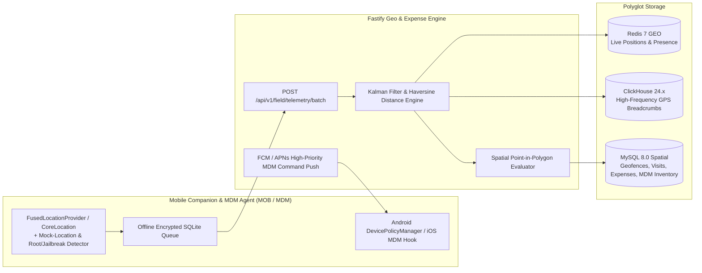

# PHASE 29: Field Workforce GPS Telemetry, Polygon Geofencing, Mileage Expense Engine, Mobile Companion App & Corporate MDM

**Document Version:** 1.0.0  
**Architecture Tier:** Geospatial Workforce Operations, Haversine/Kalman Route Reconstruction, Multi-Stage Expense Ledger & Android/iOS Enterprise MDM  
**Primary Stack:** Fastify 5.x (TypeScript) | MySQL 8.0 InnoDB (Spatial `POINT`/`POLYGON` SRID 4326) | ClickHouse 24.x (Geo Telemetry) | Redis 7 Geospatial (`GEOADD`/`GEOSEARCH`) | Flutter / Kotlin / Swift Mobile Companion + Android Enterprise `DevicePolicyManager` & Apple MDM Protocol  
**Covered Screen IDs:** `FIELD-001`..`FIELD-009`, `MOB-001`..`MOB-011`, `MDM-001`..`MDM-006`

---

## 1. Executive Architecture & Privacy-First Geospatial Design

Phase 29 powers HydiEms's mobile and field operations across four integrated subsystems:
1. **Field Workforce & Geofencing Engine (`FIELD-001..005`)**: Real-time GPS tracking strictly bounded to **Active Field Shifts**, Kalman-filtered route replay (`Start -> Visit 1 -> Visit 2 -> End`) with dwell-time clustering, circular & arbitrary GeoJSON polygon geofences (`SRID 4326`), and anti-spoofing mock-location verification.
2. **GPS-Verified Field Expense & Mileage Engine (`FIELD-006..009`)**: Automatically computes reimbursable travel distance from verified GPS breadcrumbs (`route_distance_km * rate_per_km`), pairs claims with OCR-parsed receipt uploads in S3, and enforces a strict **Multi-Stage Approval State Machine (`Employee -> Manager -> Finance -> Approved`)**.
3. **Android & iOS Mobile Companion App (`MOB-001..011`)**: Offline-first mobile client (SQLite queue with exponential-backoff sync) enabling field check-in/out, selfie/geofence attendance, leave requests, task timers, and a dedicated **Mobile Manager Dashboard (`MOB-011`)**.
4. **Corporate Mobile Device Management (`MDM-001..006`)**: Manages company-owned (`COBO`/`COPE`) and BYOD work-profile devices with hardware inventory, installed package auditing, corporate Wi-Fi SSID compliance, Approved/Blocked/Required App Policies, and instant **Remote Lock / Force Logout / Revoke Token Actions**.



---

## 2. Database Schema Specifications

### 2.1 MySQL 8.0 InnoDB Spatial & OLTP Schema

```sql
-- ============================================================================
-- 1. CIRCULAR & POLYGON GEOFENCES & AUTO-ATTENDANCE RULES (FIELD-004)
-- ============================================================================
CREATE TABLE field_geofence_zones (
    id CHAR(36) NOT NULL PRIMARY KEY COMMENT 'UUIDv7',
    tenant_id CHAR(36) NOT NULL,
    name VARCHAR(150) NOT NULL COMMENT 'e.g. Bengaluru HQ Campus, Client Site - Apollo Hospital',
    zone_type ENUM('CORPORATE_OFFICE', 'CLIENT_SITE', 'WAREHOUSE', 'RESTRICTED_ZONE') NOT NULL DEFAULT 'CLIENT_SITE',
    shape_type ENUM('CIRCLE', 'POLYGON') NOT NULL DEFAULT 'CIRCLE',
    center_lat DECIMAL(10,7) NOT NULL,
    center_lng DECIMAL(10,7) NOT NULL,
    radius_meters INT UNSIGNED NULL COMMENT 'Populated when shape_type = CIRCLE (min 50m, max 50000m)',
    polygon_geojson JSON NULL COMMENT 'GeoJSON Polygon coordinates when shape_type = POLYGON',
    spatial_geometry GEOMETRY NOT NULL SRID 4326 COMMENT 'Indexed POINT or POLYGON geometry for ST_Contains()',
    -- Automation Rules
    auto_clock_in_on_enter BOOLEAN NOT NULL DEFAULT FALSE,
    auto_clock_out_on_exit BOOLEAN NOT NULL DEFAULT FALSE,
    min_dwell_seconds_for_visit INT UNSIGNED NOT NULL DEFAULT 300 COMMENT 'Default 5m dwell to auto-log client visit',
    require_selfie_on_checkin BOOLEAN NOT NULL DEFAULT FALSE,
    allowed_wifi_bssids JSON NULL COMMENT 'Optional MAC/BSSID binding for indoor accuracy',
    assigned_department_ids JSON NULL,
    is_active BOOLEAN NOT NULL DEFAULT TRUE,
    created_at DATETIME(3) NOT NULL DEFAULT CURRENT_TIMESTAMP(3),
    SPATIAL INDEX sp_idx_geofence_geom (spatial_geometry),
    INDEX idx_geofence_tenant (tenant_id, is_active)
) ENGINE=InnoDB DEFAULT CHARSET=utf8mb4 COLLATE=utf8mb4_unicode_ci;

-- ============================================================================
-- 2. FIELD VISITS & ROUTE REPLAY SUMMARIES (FIELD-003, FIELD-005)
-- ============================================================================
CREATE TABLE field_daily_route_summaries (
    id CHAR(36) NOT NULL PRIMARY KEY,
    tenant_id CHAR(36) NOT NULL,
    user_id CHAR(36) NOT NULL,
    device_id CHAR(36) NOT NULL,
    route_date DATE NOT NULL,
    shift_start_at DATETIME(3) NOT NULL,
    shift_end_at DATETIME(3) NULL,
    start_location_lat DECIMAL(10,7) NOT NULL,
    start_location_lng DECIMAL(10,7) NOT NULL,
    start_address VARCHAR(500) NULL,
    end_location_lat DECIMAL(10,7) NULL,
    end_location_lng DECIMAL(10,7) NULL,
    end_address VARCHAR(500) NULL,
    total_verified_distance_km DECIMAL(8,2) NOT NULL DEFAULT 0.00 COMMENT 'Kalman-smoothed Haversine distance',
    total_travel_duration_seconds INT UNSIGNED NOT NULL DEFAULT 0,
    total_dwell_duration_seconds INT UNSIGNED NOT NULL DEFAULT 0,
    completed_visits_count INT UNSIGNED NOT NULL DEFAULT 0,
    mock_location_attempts_count INT UNSIGNED NOT NULL DEFAULT 0,
    gps_off_gap_seconds INT UNSIGNED NOT NULL DEFAULT 0,
    UNIQUE KEY uq_field_route_user_date (tenant_id, user_id, route_date),
    INDEX idx_field_route_date (tenant_id, route_date)
) ENGINE=InnoDB DEFAULT CHARSET=utf8mb4 COLLATE=utf8mb4_unicode_ci;

CREATE TABLE field_client_visits (
    id CHAR(36) NOT NULL PRIMARY KEY,
    tenant_id CHAR(36) NOT NULL,
    route_summary_id CHAR(36) NOT NULL,
    user_id CHAR(36) NOT NULL,
    sequence_order SMALLINT UNSIGNED NOT NULL COMMENT '1, 2, 3... inside Start -> Visit 1..N -> End',
    client_name VARCHAR(200) NOT NULL,
    geofence_zone_id CHAR(36) NULL,
    scheduled_at DATETIME(3) NULL,
    checkin_at DATETIME(3) NOT NULL,
    checkin_lat DECIMAL(10,7) NOT NULL,
    checkin_lng DECIMAL(10,7) NOT NULL,
    checkin_accuracy_m DECIMAL(6,1) NOT NULL,
    is_within_geofence BOOLEAN NOT NULL DEFAULT TRUE,
    checkout_at DATETIME(3) NULL,
    checkout_lat DECIMAL(10,7) NULL,
    checkout_lng DECIMAL(10,7) NULL,
    dwell_duration_seconds INT UNSIGNED NOT NULL DEFAULT 0,
    outcome_status ENUM('IN_PROGRESS', 'COMPLETED_SUCCESS', 'CLIENT_UNAVAILABLE', 'RESCHEDULED', 'CANCELLED') NOT NULL DEFAULT 'IN_PROGRESS',
    visit_notes TEXT NULL,
    photo_s3_keys JSON NULL COMMENT 'Array of S3 keys with EXIF timestamp/GPS verification',
    client_signature_s3_key VARCHAR(512) NULL,
    CONSTRAINT fk_visit_route FOREIGN KEY (route_summary_id) REFERENCES field_daily_route_summaries(id) ON DELETE CASCADE,
    INDEX idx_field_visit_user_time (tenant_id, user_id, checkin_at DESC)
) ENGINE=InnoDB DEFAULT CHARSET=utf8mb4 COLLATE=utf8mb4_unicode_ci;

-- ============================================================================
-- 3. FIELD EXPENSE CLAIMS & MULTI-STAGE APPROVAL WORKFLOW (FIELD-006..009)
-- ============================================================================
CREATE TABLE field_expense_claims (
    id CHAR(36) NOT NULL PRIMARY KEY,
    tenant_id CHAR(36) NOT NULL,
    claim_code VARCHAR(32) NOT NULL COMMENT 'e.g. EXP-2026-004910',
    user_id CHAR(36) NOT NULL,
    expense_date DATE NOT NULL,
    category ENUM('GPS_MILEAGE_FUEL', 'PUBLIC_TRANSIT_CAB', 'CLIENT_MEAL', 'LODGING_HOTEL', 'SITE_SUPPLIES', 'OTHER') NOT NULL,
    -- GPS Mileage Auto-Calculation Fields
    linked_route_summary_id CHAR(36) NULL,
    vehicle_type ENUM('NONE', 'TWO_WHEELER', 'FOUR_WHEELER_SEDAN', 'COMMERCIAL_VAN') NOT NULL DEFAULT 'NONE',
    gps_verified_distance_km DECIMAL(8,2) NULL,
    claimed_distance_km DECIMAL(8,2) NULL,
    mileage_rate_per_km DECIMAL(8,2) NULL,
    -- Financial Amounts
    currency CHAR(3) NOT NULL DEFAULT 'INR',
    claimed_amount DECIMAL(12,2) NOT NULL,
    approved_amount DECIMAL(12,2) NULL,
    merchant_name VARCHAR(200) NULL,
    description TEXT NOT NULL,
    receipt_s3_key VARCHAR(512) NULL,
    receipt_sha256 CHAR(64) NULL COMMENT 'Detects duplicate receipt submission across claims',
    -- Multi-Stage Workflow: EMPLOYEE_DRAFT -> SUBMITTED_TO_MANAGER -> MANAGER_APPROVED_PENDING_FINANCE -> FINANCE_APPROVED -> REIMBURSED (or REJECTED)
    workflow_stage ENUM(
        'EMPLOYEE_DRAFT',
        'SUBMITTED_TO_MANAGER',
        'MANAGER_APPROVED_PENDING_FINANCE',
        'FINANCE_APPROVED',
        'REIMBURSED_IN_PAYROLL',
        'REJECTED'
    ) NOT NULL DEFAULT 'SUBMITTED_TO_MANAGER',
    manager_approver_id CHAR(36) NULL,
    manager_approved_at DATETIME(3) NULL,
    manager_notes TEXT NULL,
    finance_approver_id CHAR(36) NULL,
    finance_approved_at DATETIME(3) NULL,
    finance_notes TEXT NULL,
    linked_payroll_period_id CHAR(36) NULL COMMENT 'Links to PAY-004 for automatic payroll disbursement',
    created_at DATETIME(3) NOT NULL DEFAULT CURRENT_TIMESTAMP(3),
    updated_at DATETIME(3) NOT NULL DEFAULT CURRENT_TIMESTAMP(3) ON UPDATE CURRENT_TIMESTAMP(3),
    UNIQUE KEY uq_exp_claim_code (tenant_id, claim_code),
    INDEX idx_exp_workflow (tenant_id, workflow_stage, expense_date DESC),
    INDEX idx_exp_receipt_hash (tenant_id, receipt_sha256)
) ENGINE=InnoDB DEFAULT CHARSET=utf8mb4 COLLATE=utf8mb4_unicode_ci;

-- ============================================================================
-- 4. CORPORATE MOBILE DEVICE MANAGEMENT (MDM-001..006)
-- ============================================================================
CREATE TABLE mdm_enrolled_devices (
    id CHAR(36) NOT NULL PRIMARY KEY,
    tenant_id CHAR(36) NOT NULL,
    user_id CHAR(36) NOT NULL,
    device_serial_number VARCHAR(128) NOT NULL,
    imei_or_meid VARCHAR(64) NULL,
    ownership_mode ENUM('CORPORATE_DEDICATED_COBO', 'CORPORATE_MIXED_COPE', 'EMPLOYEE_BYOD_WORK_PROFILE') NOT NULL DEFAULT 'CORPORATE_MIXED_COPE',
    os_platform ENUM('ANDROID', 'IOS') NOT NULL,
    os_version VARCHAR(32) NOT NULL,
    device_model VARCHAR(120) NOT NULL,
    app_version VARCHAR(32) NOT NULL,
    is_encrypted BOOLEAN NOT NULL DEFAULT TRUE,
    is_passcode_compliant BOOLEAN NOT NULL DEFAULT TRUE,
    is_rooted_or_jailbroken BOOLEAN NOT NULL DEFAULT FALSE,
    is_mock_location_enabled BOOLEAN NOT NULL DEFAULT FALSE,
    battery_level_percent TINYINT UNSIGNED NULL,
    current_wifi_ssid VARCHAR(128) NULL,
    current_wifi_bssid VARCHAR(64) NULL,
    current_wifi_security_type VARCHAR(32) NULL COMMENT 'WPA3, WPA2-Enterprise, OPEN_UNSECURE',
    compliance_status ENUM('COMPLIANT', 'NON_COMPLIANT_WARNING', 'RESTRICTED_QUARANTINED', 'LOCKED', 'REVOKED') NOT NULL DEFAULT 'COMPLIANT',
    fcm_or_apns_push_token VARCHAR(512) NULL,
    last_heartbeat_at DATETIME(3) NOT NULL,
    enrolled_at DATETIME(3) NOT NULL DEFAULT CURRENT_TIMESTAMP(3),
    UNIQUE KEY uq_mdm_device_serial (tenant_id, device_serial_number),
    INDEX idx_mdm_compliance (tenant_id, compliance_status, last_heartbeat_at DESC)
) ENGINE=InnoDB DEFAULT CHARSET=utf8mb4 COLLATE=utf8mb4_unicode_ci;

CREATE TABLE mdm_app_policies (
    id CHAR(36) NOT NULL PRIMARY KEY,
    tenant_id CHAR(36) NOT NULL,
    os_platform ENUM('ANDROID', 'IOS') NOT NULL,
    package_or_bundle_id VARCHAR(255) NOT NULL COMMENT 'e.g. com.hydiems.companion, com.zhiliaoapp.musically',
    app_name VARCHAR(150) NOT NULL,
    policy_classification ENUM('REQUIRED_MANDATORY', 'APPROVED_ALLOWLIST', 'BLOCKED_BLACKLIST') NOT NULL,
    min_allowed_version VARCHAR(32) NULL,
    auto_install_in_work_profile BOOLEAN NOT NULL DEFAULT FALSE,
    block_work_data_sharing BOOLEAN NOT NULL DEFAULT TRUE,
    created_at DATETIME(3) NOT NULL DEFAULT CURRENT_TIMESTAMP(3),
    UNIQUE KEY uq_mdm_pkg_policy (tenant_id, os_platform, package_or_bundle_id)
) ENGINE=InnoDB DEFAULT CHARSET=utf8mb4 COLLATE=utf8mb4_unicode_ci;

CREATE TABLE mdm_remote_action_commands (
    id CHAR(36) NOT NULL PRIMARY KEY,
    tenant_id CHAR(36) NOT NULL,
    device_id CHAR(36) NOT NULL,
    issued_by_user_id CHAR(36) NOT NULL,
    command_type ENUM('REMOTE_LOCK_SCREEN', 'FORCE_APP_LOGOUT', 'REVOKE_DEVICE_TOKENS', 'WIPE_WORK_PROFILE_CONTAINER', 'SYNC_POLICY_NOW') NOT NULL,
    reason TEXT NOT NULL,
    status ENUM('QUEUED', 'PUSH_SENT', 'ACKNOWLEDGED_EXECUTED', 'FAILED', 'EXPIRED') NOT NULL DEFAULT 'QUEUED',
    executed_at DATETIME(3) NULL,
    device_response_json JSON NULL,
    created_at DATETIME(3) NOT NULL DEFAULT CURRENT_TIMESTAMP(3),
    INDEX idx_mdm_cmd_device (device_id, status, created_at DESC)
) ENGINE=InnoDB DEFAULT CHARSET=utf8mb4 COLLATE=utf8mb4_unicode_ci;
```

### 2.2 ClickHouse 24.x High-Frequency GPS Breadcrumb Table (`FIELD-002`, `FIELD-003`)

```sql
CREATE TABLE hydi_telemetry.field_gps_breadcrumbs (
    point_id UUID,
    tenant_id UUID,
    user_id UUID,
    device_id UUID,
    route_date Date,
    latitude Float64,
    longitude Float64,
    altitude_m Float32,
    accuracy_m Float32,
    speed_mps Float32,
    bearing_deg Float32,
    battery_percent UInt8,
    activity_type LowCardinality(String), -- 'STILL', 'WALKING', 'IN_VEHICLE', 'ON_BICYCLE'
    is_mock_provider UInt8,
    wifi_ssid String,
    recorded_at DateTime64(3, 'UTC')
) ENGINE = MergeTree()
PARTITION BY toYYYYMM(route_date)
ORDER BY (tenant_id, user_id, route_date, recorded_at)
TTL route_date + INTERVAL 180 DAY DELETE;
```

---

## 3. Screen-by-Screen Engineering Specifications

### 3.1 Field Workforce & Geofencing (`FIELD-001` to `FIELD-005`)
* **`FIELD-001` — Field Workforce Operations Dashboard (`/field/dashboard`)**: Displays active field reps on duty, visits completed vs. scheduled today, average dwell time per client visit, geofence violations, GPS/Mock-Location alerts, and total reimbursable kilometers logged today.
* **`FIELD-002` — Live Employee GPS Map (`/field/live-map`)**:
  - Real-time vector map powered by Redis Geospatial index (`GEOSEARCH field:live_pos:{tenantId}`) and WebSocket stream `field:gps:live`.
  - Shows color-coded pins (`IN_TRANSIT`, `AT_CLIENT_SITE`, `IDLE_DWELL`, `GPS_SIGNAL_LOST`), battery percentage, speed, and last heartbeat timestamp.
  - **Privacy Guardrail**: Live GPS pin is **strictly invisible (`OFF`)** when the employee is clocked out or on break (`PRIV-002`).
* **`FIELD-003` — Route Replay & Dwell Time Timeline (`/field/routes/:userId/:date`)**:
  - Reconstructs the complete day's journey (`Start -> Visit 1 -> Visit 2 -> ... -> End`) using a 1D/2D Kalman filter to reject multi-path urban canyon GPS jumps (`accuracy_m > 65m` discarded) and Haversine great-circle integration:
    $$d = 2r \arcsin\left(\sqrt{\sin^2\left(\frac{\Delta\phi}{2}\right) + \cos(\phi_1)\cos(\phi_2)\sin^2\left(\frac{\Delta\lambda}{2}\right)}\right)$$
  - Interactive scrubber plays back the employee's path at `1x / 5x / 10x` speed alongside stop-cluster markers showing exact arrival time, departure time, and dwell duration at each stop.
* **`FIELD-004` — Geofence Management & Auto-Attendance Rules (`/field/geofences`)**:
  - Interactive map drawing tool for Circular (`center + radius_meters`) and arbitrary Polygon (`GeoJSON` -> MySQL `SRID 4326 POLYGON`) zones.
  - Configures per-zone rules: `auto_clock_in_on_enter`, `auto_clock_out_on_exit`, `min_dwell_seconds_for_visit`, `require_selfie_on_checkin`, and `allowed_wifi_bssids`.
* **`FIELD-005` — Field Visit Check-In/Out & Proof-of-Visit Detail (`/field/visits`)**:
  - Displays visit schedule, geofence verification badge (`VERIFIED_INSIDE_ZONE` vs. `OUTSIDE_GEOFENCE_OVERRIDE` with distance offset in meters), structured visit notes, EXIF-verified site photos, and digital client sign-off signature.

---

### 3.2 Field Expenses & Multi-Stage Approval (`FIELD-006` to `FIELD-009`)
* **`FIELD-006` — Field Expense Dashboard (`/field/expenses/dashboard`)**: Total pending reimbursements, GPS mileage vs. manual claim variance detector, top expense categories, and SLA aging in Manager vs. Finance queues.
* **`FIELD-007` — Submit Expense Claim & GPS Mileage Auto-Calculator (`/field/expenses/new`)**:
  - Selecting an `expense_date` and category `GPS_MILEAGE_FUEL` automatically queries `field_daily_route_summaries.total_verified_distance_km` for that date and multiplies by the tenant's vehicle slab rate (`TWO_WHEELER` e.g. `₹5.50/km` or `FOUR_WHEELER` e.g. `₹12.00/km` / IRS standard mileage rate).
  - If the user overrides `claimed_distance_km > gps_verified_distance_km * 1.10`, flags a visual `MILEAGE_VARIANCE_WARNING` badge for the approver.
  - Computes SHA-256 hash (`receipt_sha256`) of uploaded receipt images/PDFs and blocks duplicate receipt submissions across any historical claim in the tenant (`409 ERR_DUPLICATE_RECEIPT_IMAGE`).
* **`FIELD-008` — Multi-Stage Expense Approval Queue (`/field/expenses/approvals`)**:
  - Enforces the 4-stage pipeline:
    `Employee (Submit) -> Manager (Operational & Route Verification) -> Finance (Receipt, Tax & Policy Audit) -> Approved (Queued for PAY-004 Payroll or Direct Payout)`.
* **`FIELD-009` — Field Expense Analytics & Audit Reports (`/field/expenses/reports`)**: Department/project cost allocation export, mileage audit trail, and tax-deductible GST/VAT receipt bundle download.

---

### 3.3 Android & iOS Mobile Companion App (`MOB-001` to `MOB-011`)

| Screen ID | Mobile Screen Name | Key Functional & Offline-First Engineering Capabilities |
| :--- | :--- | :--- |
| `MOB-001` | **Mobile Login & Biometric MFA** | OAuth2/OIDC + Passkey / FaceID / Fingerprint unlock; binds hardware Keystore/Secure Enclave device attestation token. |
| `MOB-002` | **Mobile Employee Home Dashboard** | Live Shift Status pill, Privacy Sensor Transparency Card (`PRIV-002`), today's scheduled client visits, active task timer, and quick actions. |
| `MOB-003` | **GPS Check-In / Check-Out & Visit Logger** | Displays live map with target geofence boundary, GPS accuracy ring, optional live camera selfie capture (blocks gallery upload to prevent photo spoofing), visit notes, and offline SQLite queueing if cellular signal is lost. |
| `MOB-004` | **Mobile Attendance & Regularization** | Monthly attendance calendar, clock-in/out history, shift timings, and missed-punch regularization request form. |
| `MOB-005` | **Mobile Leave Hub** | View real-time leave balances (`LEAVE-006`), apply for full/half/short leave (`LEAVE-003`/`007`), and upload medical attachments from mobile camera. |
| `MOB-006` | **Mobile My Tasks (Kanban & Checklist)** | View assigned project tasks, update status (`TODO -> IN_PROGRESS -> DONE`), add comments, and start/stop task timers on the go. |
| `MOB-007` | **Mobile Projects Overview** | Read/update project milestones, deliverables, and team directory while in the field. |
| `MOB-008` | **Mobile Timesheet & Daily Log** | Review and submit daily/weekly project time logs and billable hours from mobile. |
| `MOB-009` | **Mobile Push Notifications & Alerts** | FCM/APNs notification center for shift reminders, leave approvals, urgent announcements (`COM-002`), and chat mentions (`COM-005`). |
| `MOB-010` | **Mobile Expense Claim & Receipt Scanner** | Camera receipt scanner with auto-crop, GPS mileage auto-fill (`FIELD-007`), and claim status tracking. |
| `MOB-011` | **Mobile Manager Command Dashboard** | Dedicated supervisor view for approving team leaves, regularizations, and expenses in 1 tap, plus live team attendance & field map overview. |

---

### 3.4 Corporate Mobile Device Management (`MDM-001` to `MDM-006`)
* **`MDM-001` — MDM Posture Dashboard (`/mdm/dashboard`)**: Total enrolled Android/iOS devices (`COBO`, `COPE`, `BYOD_WORK_PROFILE`), OS version distribution, rooted/jailbroken alerts, unencrypted devices, and offline device counts.
* **`MDM-002` — Mobile Device Inventory & Hardware Detail (`/mdm/devices`)**: Lists every device serial, IMEI, model, OS patch level, battery health, encryption state, and last heartbeat.
* **`MDM-003` — Installed Applications Audit (`/mdm/devices/:id/apps`)**: Displays packages installed inside the Corporate Work Profile (for BYOD, strictly inspects **only** the isolated Work Profile container—never personal apps—to preserve employee privacy).
* **`MDM-004` — Corporate Wi-Fi & Network Security Monitoring (`/mdm/wifi-monitoring`)**: Logs connected Wi-Fi SSID/BSSID and security type during work shifts; alerts if a device connects to an `OPEN_UNSECURE` public network without active corporate VPN.
* **`MDM-005` — Approved, Blocked & Required App Policies (`/mdm/app-policies`)**: Configures Managed Google Play / Apple Managed App distribution rules (`REQUIRED_MANDATORY`, `APPROVED_ALLOWLIST`, `BLOCKED_BLACKLIST`) and blocks copy/paste or "Open In" sharing from managed corporate apps to personal apps (`block_work_data_sharing = true`).
* **`MDM-006` — Remote Security Actions (`Lock / Force Logout / Revoke / Wipe Work Container`) (`/mdm/remote-actions`)**:
  - Dispatches high-priority FCM / APNs wake-up payloads (`mdm_remote_action_commands`) and immediately revokes the device's Redis JWT/refresh session:
    1. `REMOTE_LOCK_SCREEN`: Invokes `DevicePolicyManager.lockNow()` / Apple `DeviceLock` command.
    2. `FORCE_APP_LOGOUT`: Terminates active HydiEms session and clears local SQLite auth cache.
    3. `REVOKE_DEVICE_TOKENS`: Blacklists device certificate/JWT in Redis (`mdm:revoked:{deviceId}`) and blocks all API access.
    4. `WIPE_WORK_PROFILE_CONTAINER`: Wipes **only** the enterprise work container (`wipeData(WIPE_EUICC)` excluded on BYOD), leaving personal photos/data untouched.

---

## 4. Fastify API Endpoints, Anti-Spoofing Rules & Acceptance Criteria

### 4.1 Key REST Endpoints
* `POST /api/v1/field/telemetry/batch` — Ingests batched GPS points from mobile companion, validates mock-location flags, updates Redis `GEOADD`, inserts into ClickHouse `field_gps_breadcrumbs`, and evaluates spatial geofence entry/exit (`ST_Contains`).
* `POST /api/v1/field/visits/check-in` — Verifies geofence proximity (`ST_Distance_Sphere`), selfie EXIF metadata, and opens a `field_client_visits` record.
* `POST /api/v1/field/expenses/:id/transition` — Advances `Employee -> Manager -> Finance -> Approved` state machine.
* `POST /api/v1/mdm/devices/:id/remote-action` — Queues and pushes `REMOTE_LOCK_SCREEN`, `FORCE_APP_LOGOUT`, or `REVOKE_DEVICE_TOKENS` and writes an immutable audit log entry (`MDM_REMOTE_ACTION`).

### 4.2 Validation & Anti-Spoofing Rules
1. **Mock GPS & Fake Location Rejection**: On Android (`Location.isMock()` / `Settings.Secure.ALLOW_MOCK_LOCATION`) and iOS (`CLLocationSourceInformation.isSimulatedBySoftware`), any coordinate flagged as synthetic is rejected from mileage reimbursement calculations, increments `mock_location_attempts_count`, and triggers a `SUSP-001` alert.
2. **Impossible Velocity Filter**: Consecutive GPS points implying ground velocity $> 250\text{ km/h}$ (without flight mode transition) are discarded as GPS jumps before computing `total_verified_distance_km`.

### 4.3 Engineering Acceptance Criteria
1. **Offline-First Resilience (`MOB-003`)**: Field check-ins and GPS breadcrumbs captured during a 4-hour cellular blackout are stored in local SQLCipher SQLite and replay idempotently upon reconnection without losing route distance accuracy.
2. **Strict Multi-Stage Expense Control (`FIELD-008`)**: Finance cannot approve or disburse an expense claim until `manager_approved_at` is populated, and duplicate receipt images (`receipt_sha256`) are deterministically blocked.
3. **Sub-5-Second MDM Token Revocation (`MDM-006`)**: Executing `REVOKE_DEVICE_TOKENS` or `FORCE_APP_LOGOUT` invalidates API access in `< 1 second` via Redis and locks/logs out the mobile app within `< 5 seconds` of push delivery.
