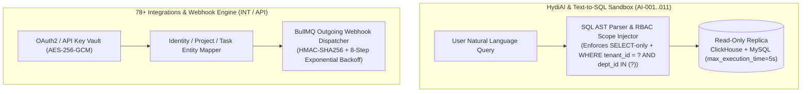

# PHASE 30: HydiAI Intelligence Engine, Attrition & Burnout Risk, 78+ Integrations Hub, Developer API/Webhook Platform & Employee Self-Service Portal

**Document Version:** 1.0.0  
**Architecture Tier:** Enterprise AI Copilot, Read-Only Sandboxed Text-to-SQL, 78-Connector iPaaS Engine, Public OAuth2/Webhook Developer Portal & Employee Self-Service  
**Primary Stack:** Fastify 5.x (TypeScript) | MySQL 8.0 InnoDB | ClickHouse 24.x | Redis 7.x | BullMQ Webhook & Sync Workers | LLM Orchestrator with RBAC Row-Level Guardrails  
**Covered Screen IDs:** `AI-001`..`AI-011`, `INT-001`..`INT-008`, `API-001`..`API-007`, `EMP-001`..`EMP-013`

---

## 1. Executive Architecture & Ethical AI / Ecosystem Design

Phase 30 completes the HydiEms platform specification across five enterprise pillars:
1. **HydiAI Intelligence & Natural Language Analytics (`AI-001..008`)**: Context-aware AI Assistant, automated Executive Daily Briefings, Workload Imbalance Analysis, Project Delay Risk Prediction, and a **Sandboxed Text-to-ClickHouse/MySQL SQL Engine (`AI-008`)** that enforces AST-level read-only validation and mandatory `tenant_id` + RBAC scope injection before executing any analytical query.
2. **Workforce Attrition, Disengagement & Burnout Risk Engine (`AI-009..011`)**: Explainable statistical + ML signals identifying sustained overwork, weekend work streaks, shrinking focus blocks, and disengagement trends—governed by strict **Human-in-the-Loop Ethical Guardrails** (designed to trigger supportive manager check-ins and workload rebalancing, never automated disciplinary action).
3. **78+ Native Integrations Marketplace (`INT-001..008`)**: Bi-directional and uni-directional sync engine across **9 Enterprise Categories** (Project Management, Communication, Code & DevOps, CRM & Support, HRIS & Payroll, Calendar & Cloud Storage, Accounting & ERP, SSO & Identity, Automation & BI).
4. **Developer Platform, Scoped API Keys, OAuth2 & HMAC Webhooks (`API-001..007`)**: Full public REST/GraphQL developer portal with SHA-256 hashed scoped API keys, OAuth 2.0 Authorization Code + PKCE apps, exponential-backoff outgoing webhooks signed with `HMAC-SHA256`, metered usage quotas, and interactive OpenAPI 3.1 documentation.
5. **Employee Self-Service Portal (`EMP-001..013`)**: Unified personal workspace where every employee manages their own dashboard, attendance, leaves, tasks, timesheets, productivity insights, payslips, HR documents, and Privacy & Consent Center (`PRIV-001..005`).



---

## 2. Database Schema Specifications (MySQL 8.0 InnoDB & ClickHouse)

### 2.1 MySQL 8.0 InnoDB Schema

```sql
-- ============================================================================
-- 1. HYDIAI CONVERSATIONS, INSIGHTS & WORKFORCE RISK SCORES (AI-001..011)
-- ============================================================================
CREATE TABLE ai_assistant_threads (
    id CHAR(36) NOT NULL PRIMARY KEY COMMENT 'UUIDv7',
    tenant_id CHAR(36) NOT NULL,
    user_id CHAR(36) NOT NULL,
    title VARCHAR(200) NOT NULL,
    context_scope ENUM('EXECUTIVE_BRIEFING', 'PRODUCTIVITY_ANALYSIS', 'PROJECT_RISK', 'TEXT_TO_SQL_ANALYTICS', 'GENERAL_COPILOT') NOT NULL DEFAULT 'GENERAL_COPILOT',
    created_at DATETIME(3) NOT NULL DEFAULT CURRENT_TIMESTAMP(3),
    updated_at DATETIME(3) NOT NULL DEFAULT CURRENT_TIMESTAMP(3) ON UPDATE CURRENT_TIMESTAMP(3),
    INDEX idx_ai_thread_user (tenant_id, user_id, updated_at DESC)
) ENGINE=InnoDB DEFAULT CHARSET=utf8mb4 COLLATE=utf8mb4_unicode_ci;

CREATE TABLE ai_nl_sql_audit_logs (
    id CHAR(36) NOT NULL PRIMARY KEY,
    tenant_id CHAR(36) NOT NULL,
    user_id CHAR(36) NOT NULL,
    thread_id CHAR(36) NULL,
    natural_language_prompt TEXT NOT NULL,
    target_engine ENUM('CLICKHOUSE', 'MYSQL_READ_REPLICA') NOT NULL,
    generated_sql TEXT NOT NULL,
    ast_validation_status ENUM('PASSED_SAFE_SELECT', 'BLOCKED_MUTATION_ATTEMPT', 'BLOCKED_CROSS_TENANT', 'SYNTAX_ERROR') NOT NULL,
    execution_duration_ms INT UNSIGNED NULL,
    returned_rows_count INT UNSIGNED NULL,
    created_at DATETIME(3) NOT NULL DEFAULT CURRENT_TIMESTAMP(3),
    INDEX idx_ai_sql_tenant (tenant_id, created_at DESC)
) ENGINE=InnoDB DEFAULT CHARSET=utf8mb4 COLLATE=utf8mb4_unicode_ci;

CREATE TABLE ai_workforce_risk_snapshots (
    id CHAR(36) NOT NULL PRIMARY KEY,
    tenant_id CHAR(36) NOT NULL,
    user_id CHAR(36) NOT NULL,
    department_id CHAR(36) NOT NULL,
    snapshot_date DATE NOT NULL,
    -- Burnout & Workload Indicators (AI-005, AI-011)
    burnout_risk_score DECIMAL(5,2) NOT NULL COMMENT '0.00 to 100.00',
    burnout_risk_band ENUM('HEALTHY', 'MODERATE_STRAIN', 'HIGH_BURNOUT_RISK', 'CRITICAL_OVERWORK') NOT NULL DEFAULT 'HEALTHY',
    avg_daily_work_hours_14d DECIMAL(4,2) NOT NULL,
    after_hours_sessions_14d INT UNSIGNED NOT NULL DEFAULT 0,
    weekend_days_worked_30d INT UNSIGNED NOT NULL DEFAULT 0,
    days_since_last_paid_leave INT UNSIGNED NOT NULL DEFAULT 0,
    meeting_load_ratio_percent DECIMAL(5,2) NOT NULL DEFAULT 0.00,
    -- Disengagement & Attrition Flight Risk (AI-009, AI-010)
    attrition_flight_risk_score DECIMAL(5,2) NOT NULL COMMENT '0.00 to 100.00',
    attrition_risk_band ENUM('LOW', 'MODERATE', 'ELEVATED', 'HIGH_FLIGHT_RISK') NOT NULL DEFAULT 'LOW',
    explainable_factors_json JSON NOT NULL COMMENT 'Top contributing factors with human-readable weights e.g. ["No leave taken in 115 days (+28%)", "Daily shift +2.4h above team mean (+34%)"]',
    recommended_supportive_action VARCHAR(500) NOT NULL COMMENT 'e.g. Suggest 1:1 wellness check-in and redistribute 2 sprint tasks',
    human_reviewed_by CHAR(36) NULL,
    human_review_notes TEXT NULL,
    UNIQUE KEY uq_ai_risk_user_date (tenant_id, user_id, snapshot_date),
    INDEX idx_ai_risk_dept (tenant_id, snapshot_date, burnout_risk_band, attrition_risk_band)
) ENGINE=InnoDB DEFAULT CHARSET=utf8mb4 COLLATE=utf8mb4_unicode_ci;

-- ============================================================================
-- 2. 78+ INTEGRATIONS MARKETPLACE, CONNECTIONS & MAPPINGS (INT-001..008)
-- ============================================================================
CREATE TABLE integration_connections (
    id CHAR(36) NOT NULL PRIMARY KEY,
    tenant_id CHAR(36) NOT NULL,
    provider_slug VARCHAR(64) NOT NULL COMMENT 'One of the 78+ catalog slugs e.g. jira_cloud, github, slack, greythr, salesforce',
    category ENUM(
        'PROJECT_MANAGEMENT',
        'COMMUNICATION_CHAT',
        'CODE_DEVOPS',
        'CRM_CUSTOMER_SUPPORT',
        'HRIS_PAYROLL',
        'CALENDAR_CLOUD_STORAGE',
        'ACCOUNTING_ERP',
        'SSO_IDENTITY_SCIM',
        'BI_AUTOMATION'
    ) NOT NULL,
    display_name VARCHAR(150) NOT NULL,
    auth_type ENUM('OAUTH2', 'API_KEY_TOKEN', 'WEBHOOK_INBOUND', 'SAML2_OIDC', 'SFTP_BATCH') NOT NULL,
    credentials_encrypted BLOB NOT NULL COMMENT 'AES-256-GCM encrypted OAuth access/refresh tokens or API keys',
    token_expires_at DATETIME(3) NULL,
    sync_direction ENUM('INBOUND_ONLY', 'OUTBOUND_ONLY', 'BIDIRECTIONAL') NOT NULL DEFAULT 'BIDIRECTIONAL',
    sync_interval_minutes INT UNSIGNED NOT NULL DEFAULT 15,
    status ENUM('CONNECTED_HEALTHY', 'TOKEN_EXPIRED', 'RATE_LIMITED', 'ERROR_DEGRADED', 'DISCONNECTED') NOT NULL DEFAULT 'CONNECTED_HEALTHY',
    last_sync_at DATETIME(3) NULL,
    last_sync_status ENUM('SUCCESS', 'PARTIAL_WARNING', 'FAILED') NULL,
    created_by CHAR(36) NOT NULL,
    created_at DATETIME(3) NOT NULL DEFAULT CURRENT_TIMESTAMP(3),
    updated_at DATETIME(3) NOT NULL DEFAULT CURRENT_TIMESTAMP(3) ON UPDATE CURRENT_TIMESTAMP(3),
    UNIQUE KEY uq_int_tenant_provider (tenant_id, provider_slug)
) ENGINE=InnoDB DEFAULT CHARSET=utf8mb4 COLLATE=utf8mb4_unicode_ci;

CREATE TABLE integration_entity_mappings (
    id CHAR(36) NOT NULL PRIMARY KEY,
    tenant_id CHAR(36) NOT NULL,
    connection_id CHAR(36) NOT NULL,
    entity_type ENUM('USER', 'DEPARTMENT', 'PROJECT', 'TASK', 'LEAVE_TYPE', 'PAYROLL_CODE') NOT NULL,
    hydi_entity_id CHAR(36) NOT NULL,
    external_entity_id VARCHAR(255) NOT NULL,
    external_entity_name VARCHAR(255) NULL,
    sync_hash CHAR(64) NULL COMMENT 'Detects changes to avoid redundant API calls',
    last_synced_at DATETIME(3) NOT NULL DEFAULT CURRENT_TIMESTAMP(3),
    CONSTRAINT fk_map_conn FOREIGN KEY (connection_id) REFERENCES integration_connections(id) ON DELETE CASCADE,
    UNIQUE KEY uq_int_entity_map (connection_id, entity_type, external_entity_id),
    INDEX idx_int_hydi_entity (tenant_id, entity_type, hydi_entity_id)
) ENGINE=InnoDB DEFAULT CHARSET=utf8mb4 COLLATE=utf8mb4_unicode_ci;

-- ============================================================================
-- 3. DEVELOPER PORTAL: SCOPED API KEYS, OAUTH2 APPS & WEBHOOKS (API-001..007)
-- ============================================================================
CREATE TABLE developer_api_keys (
    id CHAR(36) NOT NULL PRIMARY KEY,
    tenant_id CHAR(36) NOT NULL,
    name VARCHAR(150) NOT NULL,
    key_prefix CHAR(12) NOT NULL COMMENT 'Visible prefix e.g. hydi_live_8f',
    key_secret_sha256 CHAR(64) NOT NULL COMMENT 'SHA-256 hash of full API key; raw key shown once at creation',
    scopes_json JSON NOT NULL COMMENT 'Array of granular scopes e.g. ["users:read", "attendance:read", "tasks:write", "webhooks:manage"]',
    allowed_cidr_ips JSON NULL COMMENT 'Optional IP allowlist e.g. ["203.0.113.0/24"]',
    rate_limit_per_minute INT UNSIGNED NOT NULL DEFAULT 600,
    monthly_quota_requests BIGINT UNSIGNED NOT NULL DEFAULT 1000000,
    last_used_at DATETIME(3) NULL,
    last_used_ip VARCHAR(45) NULL,
    expires_at DATETIME(3) NULL,
    revoked_at DATETIME(3) NULL,
    created_by CHAR(36) NOT NULL,
    created_at DATETIME(3) NOT NULL DEFAULT CURRENT_TIMESTAMP(3),
    UNIQUE KEY uq_api_key_hash (key_secret_sha256),
    INDEX idx_api_key_tenant (tenant_id, revoked_at)
) ENGINE=InnoDB DEFAULT CHARSET=utf8mb4 COLLATE=utf8mb4_unicode_ci;

CREATE TABLE developer_oauth_clients (
    id CHAR(36) NOT NULL PRIMARY KEY,
    tenant_id CHAR(36) NOT NULL,
    app_name VARCHAR(150) NOT NULL,
    client_id VARCHAR(64) NOT NULL UNIQUE,
    client_secret_sha256 CHAR(64) NOT NULL,
    redirect_uris_json JSON NOT NULL,
    allowed_scopes_json JSON NOT NULL,
    require_pkce BOOLEAN NOT NULL DEFAULT TRUE,
    is_confidential BOOLEAN NOT NULL DEFAULT TRUE,
    is_active BOOLEAN NOT NULL DEFAULT TRUE,
    created_by CHAR(36) NOT NULL,
    created_at DATETIME(3) NOT NULL DEFAULT CURRENT_TIMESTAMP(3)
) ENGINE=InnoDB DEFAULT CHARSET=utf8mb4 COLLATE=utf8mb4_unicode_ci;

CREATE TABLE developer_webhook_subscriptions (
    id CHAR(36) NOT NULL PRIMARY KEY,
    tenant_id CHAR(36) NOT NULL,
    name VARCHAR(150) NOT NULL,
    target_url VARCHAR(1024) NOT NULL COMMENT 'Must be HTTPS in production',
    signing_secret_encrypted BLOB NOT NULL COMMENT 'Used to generate X-HydiEms-Signature-256 header',
    subscribed_events_json JSON NOT NULL COMMENT 'e.g. ["attendance.clock_in", "leave.approved", "task.completed", "dlp.incident.created"]',
    is_active BOOLEAN NOT NULL DEFAULT TRUE,
    consecutive_failures_count INT UNSIGNED NOT NULL DEFAULT 0,
    circuit_breaker_tripped_at DATETIME(3) NULL COMMENT 'Auto-trips after 50 consecutive exhausted deliveries',
    created_by CHAR(36) NOT NULL,
    created_at DATETIME(3) NOT NULL DEFAULT CURRENT_TIMESTAMP(3),
    INDEX idx_webhook_tenant_active (tenant_id, is_active)
) ENGINE=InnoDB DEFAULT CHARSET=utf8mb4 COLLATE=utf8mb4_unicode_ci;

CREATE TABLE developer_webhook_deliveries (
    id CHAR(36) NOT NULL PRIMARY KEY,
    tenant_id CHAR(36) NOT NULL,
    subscription_id CHAR(36) NOT NULL,
    event_id CHAR(36) NOT NULL,
    event_type VARCHAR(100) NOT NULL,
    payload_json JSON NOT NULL,
    attempt_number TINYINT UNSIGNED NOT NULL DEFAULT 1 COMMENT '1 to 8 attempts with exponential backoff',
    http_status_code SMALLINT UNSIGNED NULL,
    response_body_snippet VARCHAR(1000) NULL,
    latency_ms INT UNSIGNED NULL,
    status ENUM('PENDING_RETRY', 'DELIVERED_2XX', 'FAILED_EXHAUSTED') NOT NULL DEFAULT 'PENDING_RETRY',
    next_retry_at DATETIME(3) NULL,
    delivered_at DATETIME(3) NULL,
    created_at DATETIME(3) NOT NULL DEFAULT CURRENT_TIMESTAMP(3),
    INDEX idx_wh_deliv_sub (subscription_id, created_at DESC),
    INDEX idx_wh_deliv_retry (status, next_retry_at)
) ENGINE=InnoDB DEFAULT CHARSET=utf8mb4 COLLATE=utf8mb4_unicode_ci;
```

---

## 3. Screen-by-Screen Engineering Specifications

### 3.1 HydiAI Copilot & Workforce Risk Suite (`AI-001` to `AI-011`)

| Screen ID | Screen Name | Route | Core Engineering & Guardrail Specification |
| :--- | :--- | :--- | :--- |
| `AI-001` | **HydiAI Central Assistant** | `/ai/assistant` | Multi-turn conversational workspace with tool-calling access to the user's authorized RBAC scope (Attendance, Projects, Productivity, Leaves, DLP Summaries) and streaming SSE responses. |
| `AI-002` | **Executive Daily Briefing** | `/ai/daily-briefing` | Auto-generated 08:00 AM digest summarizing yesterday's company/team attendance rate, sprint velocity, SLA risks, critical DLP alerts, and pending approvals requiring attention. |
| `AI-003` | **AI Productivity Insights** | `/ai/productivity-insights` | Identifies peak deep-work hours across teams, context-switching tax (high window-switch frequency during coding blocks), and meeting-overload fragmentation. |
| `AI-004` | **AI Anomaly Detection (with Human-Review Guardrails)** | `/ai/anomalies` | Flags statistical Z-score outliers ($|Z| > 3.0$) in work patterns, off-hours data access, or sudden telemetry drops. **Mandatory Guardrail**: Displays a locked *"Requires Human Contextual Verification"* banner; AI anomalies cannot auto-trigger HR penalties or salary deductions. |
| `AI-005` | **AI Workload Imbalance Analysis** | `/ai/workload-balance` | Compares assigned story points / active task hours vs. shift capacity across team members, recommending specific task reassignments from overloaded (`> 115%` capacity) to under-utilized (`< 70%` capacity) peers. |
| `AI-006` | **AI Project Delay Risk Predictor** | `/ai/project-risk` | Monte Carlo + burn-rate simulation predicting milestone slip probability based on current task velocity, open blockers, and upcoming approved team leaves (`LEAVE-011`). |
| `AI-007` | **AI Custom Report Generator** | `/ai/report-builder` | Turns natural language prompts (*"Generate a Q3 department overtime vs. sprint velocity comparison with charts"*) into scheduled PDF/Excel executive reports. |
| `AI-008` | **Natural Language Analytics (`Text-to-ClickHouse/MySQL SQL`)** | `/ai/nl-analytics` | Translates user questions into read-only SQL queries, executes them against the read replica (`max_execution_time = 5000ms`, `max_result_rows = 1000`), and auto-renders bar/line/pie/table visualizations with full SQL transparency. |
| `AI-009` | **Workforce Risk Command Dashboard** | `/ai/workforce-risk` | Aggregated department heatmaps of Burnout Risk, Disengagement Trends, and Attrition Flight Risk (`ai_workforce_risk_snapshots`). |
| `AI-010` | **Employee Attrition Flight-Risk & Disengagement Detail** | `/ai/workforce-risk/:userId` | Explainable feature-importance breakdown (`SHAP`/weighted factors: tenure inflection, unutilized leave, compensation band percentile, declining collaboration activity) paired with HR retention playbook actions. |
| `AI-011` | **Burnout & Well-Being Indicators** | `/ai/burnout-indicators` | Tracks consecutive workdays without rest, chronic late-night sessions (`> 21:00` local time), and meeting-to-focus ratio, enabling managers to proactively grant Comp-Offs or rebalance sprint scope. |

#### `AI-008` Text-to-SQL Security Sandbox Rules
1. **AST Whitelist Verification**: Uses `node-sql-parser` to parse the LLM-generated query into an Abstract Syntax Tree (AST). Any statement type other than `SELECT` (`INSERT`, `UPDATE`, `DELETE`, `DROP`, `ALTER`, `GRANT`, `INTO OUTFILE`, `SYSTEM`) or queries accessing system schemas (`information_schema`, `mysql`, `system.*`) or sensitive credential columns (`password_hash`, `credentials_encrypted`, `statutory_ids_encrypted`) are immediately rejected (`BLOCKED_MUTATION_ATTEMPT`).
2. **Mandatory Tenant & RBAC Predicate Injection**: The AST rewriter deterministically injects `WHERE tenant_id = :authenticatedTenantId` (and `AND department_id IN (:allowedDepartmentIds)` for Department Managers) into every table reference before execution on a read-only database user (`hydi_ai_readonly`).

---

### 3.2 78+ Native Integrations Marketplace (`INT-001` to `INT-008`)

#### Complete 78-Connector Catalog Across 9 Categories (`INT-001`)
1. **Project & Task Management (12)**: Jira Cloud, Jira Data Center, Asana, Trello, Monday.com, ClickUp, Linear, Notion, Basecamp, Smartsheet, Wrike, Azure Boards.
2. **Communication & Collaboration (8)**: Slack, Microsoft Teams, Zoom, Google Meet, Webex, Discord, Mattermost, Twist.
3. **Source Code, Git & DevOps (10)**: GitHub Cloud/Enterprise, GitLab, Bitbucket, Azure DevOps Repos, CircleCI, Jenkins, Datadog, Sentry, PagerDuty, New Relic.
4. **CRM, Helpdesk & Customer Support (10)**: Salesforce, HubSpot, Zoho CRM, Pipedrive, Zendesk, Freshdesk, Intercom, ServiceNow, Freshsales, Kayako.
5. **HRIS, India & Global Payroll (12)**: GreytHR, Keka HR, Zoho People, Zoho Payroll, Darwinbox, RazorpayX Payroll, Deel, Gusto, Rippling, BambooHR, Workday, ADP Workforce Now.
6. **Calendar & Cloud Storage (8)**: Google Calendar, Outlook 365 Calendar, Apple iCloud Calendar, CalDAV, Google Drive, Microsoft OneDrive/SharePoint, Dropbox Business, Box.
7. **Accounting, Finance & ERP (8)**: Tally Prime, Zoho Books, QuickBooks Online, Xero, FreshBooks, SAP Business One, Oracle NetSuite, Stripe Billing.
8. **SSO, Identity & Directory SCIM 2.0 (6)**: Okta, Microsoft Entra ID (Azure AD), Google Workspace Directory, OneLogin, JumpCloud, Keycloak / Generic SAML 2.0.
9. **BI, Data Warehouse & Automation (4)**: Zapier, Make (Integromat), Power BI, Looker Studio / BigQuery Export.

#### Integration Management Screens (`INT-001` to `INT-008`)
* **`INT-001` — Integrations Marketplace Catalog (`/integrations/marketplace`)**: Searchable 78-connector grid filtered by 9 categories, connection status badges (`CONNECTED_HEALTHY`, `AVAILABLE`, `TOKEN_EXPIRED`), and 1-click setup.
* **`INT-002` — Active Connections Dashboard (`/integrations/connected`)**: Health monitor showing sync latency, rate-limit headroom, token expiration countdown, and manual `"Sync Now"` trigger.
* **`INT-003` — OAuth2 / API Key Connection Wizard (`/integrations/connect/:providerSlug`)**: Step-by-step wizard handling OAuth2 PKCE state validation, scope verification, webhook auto-registration on the remote provider, and AES-256-GCM credential storage.
* **`INT-004` — User & Identity Mapping (`/integrations/:id/mappings/users`)**: Auto-matches HydiEms employees to external accounts (e.g., Jira/GitHub/Slack users) by email/SCIM `externalId`, with manual override dropdowns for unmatched accounts.
* **`INT-005` — Project & Workspace Mapping (`/integrations/:id/mappings/projects`)**: Maps external Jira Projects / GitHub Repos / Asana Boards to HydiEms Projects and Cost Centers.
* **`INT-006` — Task, Status & Time-Log Field Mapping (`/integrations/:id/mappings/tasks`)**: Configures bi-directional status mapping (`To Do <-> OPEN`, `In Progress <-> IN_PROGRESS`, `Done <-> COMPLETED`) and automatic worklog push (pushing HydiEms tracked task hours into Jira Worklogs / Azure DevOps Completed Work).
* **`INT-007` — Integration Sync Logs & Dead-Letter Replay (`/integrations/:id/logs`)**: Granular execution log per sync batch showing created/updated/failed entity counts, HTTP payload inspector, and 1-click retry for failed records.
* **`INT-008` — Integration Settings & Conflict Resolution Policy (`/integrations/:id/settings`)**: Configures sync cadence (`Real-time Webhook`, `5m`, `15m`, `Hourly`), conflict winner (`HYDIEMS_WINS`, `EXTERNAL_WINS`, `LATEST_TIMESTAMP_WINS`), and disconnect/purge options.

---

### 3.3 Developer Portal, Public API & Outgoing Webhooks (`API-001` to `API-007`)

* **`API-001` — Developer Overview Dashboard (`/developer/dashboard`)**: 24h API request volume, p95 latency, `4xx`/`5xx` error rates, active API keys, and webhook delivery success rate.
* **`API-002` — Scoped API Keys Management (`/developer/api-keys`)**:
  - Generates high-entropy keys (`hydi_live_<32_byte_base62>`) displayed **once** in a copy modal; only `key_prefix` and `SHA-256(key)` (`key_secret_sha256`) are persisted in MySQL.
  - Supports granular resource scopes (`users:read`, `attendance:read`, `attendance:write`, `leaves:read`, `tasks:write`, `payroll:read`, `dlp:read`), IP CIDR allowlists, and zero-downtime key rotation.
* **`API-003` — OAuth 2.0 Applications (`/developer/oauth-apps`)**: Register third-party or internal OAuth 2.0 clients supporting Authorization Code + PKCE and Refresh Token rotation.
* **`API-004` — Outgoing Webhooks & HMAC-SHA256 Retry Engine (`/developer/webhooks`)**:
  - Every outgoing webhook POST includes cryptographic headers:
    - `X-HydiEms-Event: attendance.clock_in`
    - `X-HydiEms-Delivery-Id: 019283c0-...`
    - `X-HydiEms-Timestamp: 1758907200`
    - `X-HydiEms-Signature-256: sha256=<HMAC_SHA256(signing_secret, timestamp + "." + raw_json_body)>`
  - **8-Attempt Exponential Backoff Schedule**: If the target server returns non-`2xx` or times out (`> 10s`), BullMQ retries at `+30s`, `+2m`, `+10m`, `+30m`, `+2h`, `+6h`, `+12h`, and `+24h` before marking `FAILED_EXHAUSTED`. Includes a 1-click **"Send Test Ping"** and **"Replay Failed Delivery"** button.
* **`API-005` — Real-Time API Request Logs (`/developer/logs`)**: Searchable ClickHouse-backed inspector of inbound API calls by API Key, OAuth Client, HTTP method, path, status code, and latency.
* **`API-006` — Metered API Usage & Rate-Limit Quotas (`/developer/usage`)**: Tracks daily/monthly API call consumption against tenant plan quotas with configurable `80%` and `100%` threshold alerts, backed by Redis sliding-window rate limiters (`X-RateLimit-Limit`, `X-RateLimit-Remaining`, `X-RateLimit-Reset`).
* **`API-007` — Interactive OpenAPI 3.1 / Swagger Documentation (`/developer/docs`)**: Embedded Scalar/Swagger interactive API reference with live `"Try It Out"` sandbox and auto-generated TypeScript, Python, Go, and cURL code snippets.

---

### 3.4 Complete Employee Self-Service Portal (`EMP-001` to `EMP-013`)

Every employee logs into a dedicated, streamlined **Self-Service Portal (`/portal/*`)** scoped strictly to their own data (`user_id = authenticatedUser.id`):

| Screen ID | Screen Name | Route | Self-Service Capabilities |
| :--- | :--- | :--- | :--- |
| `EMP-001` | **Employee Personal Dashboard** | `/portal/dashboard` | Live Shift Clock-In/Out timer, active task timer, today's schedule (`COM-006`), live Privacy Status Card (`PRIV-002`), pending action items, and recent Kudos. |
| `EMP-002` | **My Attendance & Shift Regularization** | `/portal/attendance` | Personal attendance log, shift calendar, late/early flags, overtime hours logged, and self-service missed-punch regularization request form. |
| `EMP-003` | **My Leaves & Short Leave Hub** | `/portal/leaves` | Real-time leave balance cards, double-entry ledger history (`LEAVE-006`), apply full/half/short leave (`LEAVE-003`/`007`), and track approval status. |
| `EMP-004` | **My Tasks & Kanban Board** | `/portal/tasks` | Personal task board across all assigned projects, priority filters, subtask checklists, and 1-click desktop/web task timer control. |
| `EMP-005` | **My Timesheets & Worklogs** | `/portal/timesheets` | Weekly/daily timesheet grid showing automated desktop agent time + manual time entries, billable vs. non-billable split, and weekly submission for manager approval. |
| `EMP-006` | **My Productivity & Focus Insights** | `/portal/productivity` | Personal coaching analytics: daily focus time vs. meeting time, top apps/websites used, personal best deep-work streaks, and self-Comparison against personal 30-day rolling average. |
| `EMP-007` | **My Screenshots & Self-Blur / Delete Request** | `/portal/screenshots` | Allows the employee to view every screenshot captured from their own workstation, see who accessed it (`PRIV-003`), and—where enabled by tenant policy—delete a personal accidental capture (simultaneously deducting the corresponding 10-minute activity block) or request privacy redaction. |
| `EMP-008` | **My Performance, KPIs & OKRs** | `/portal/performance` | Complete self-assessments (`PERF-003`), submit peer 360° feedback, update personal OKR Key Result check-ins (`OKR-004`), and track KPI progress. |
| `EMP-009` | **My Payslips, Tax & Expenses** | `/portal/payroll-expenses` | View and download monthly PDF payslips (`PAY-006`), submit tax investment declarations, and file/track field expense claims (`FIELD-007`). |
| `EMP-010` | **My Profile & HR Document Vault** | `/portal/profile-documents` | View employment details (`HR-003`), update emergency contacts, upload KYC/certification documents (`HR-004`), and track onboarding/offboarding checklists. |
| `EMP-011` | **My Privacy, Transparency & Consent Center** | `/portal/privacy` | Direct portal embedding of `PRIV-001` (Collection Disclosure), `PRIV-002` (Live Sensor Status), `PRIV-003` (Who Viewed My Data History), `PRIV-004` (Digital Consent Signatures), and `PRIV-005` (GDPR Data Requests). |
| `EMP-012` | **My Enrolled Devices & Desktop/Mobile Agent Status** | `/portal/devices` | Shows all laptops and mobile devices linked to the employee's account, agent version, last heartbeat, and installer download links for Windows, macOS, Linux, Android, and iOS. |
| `EMP-013` | **My Notifications & Preferences** | `/portal/preferences` | Configure timezone, language/locale, quiet-hours DND schedule, email/push notification preferences, and MFA / Passkey security settings. |

---

## 4. Fastify API Endpoints, RBAC & Acceptance Criteria

### 4.1 Key REST Endpoints
* `POST /api/v1/ai/nl-analytics/query` — Parses prompt, generates SQL, validates AST (`SELECT`-only + mandatory `tenant_id` & RBAC scope), executes on read replica, logs to `ai_nl_sql_audit_logs`, and returns structured chart dataset.
* `POST /api/v1/integrations/:providerSlug/connect` — Completes OAuth2 token exchange or API key validation and initializes `integration_connections`.
* `POST /api/v1/developer/api-keys` — Generates a new scoped API key, stores `key_secret_sha256`, and returns the raw key once.
* `POST /api/v1/developer/webhooks/:id/test` — Dispatches a signed `HMAC-SHA256` test event to `target_url` and returns the live HTTP response.
* `GET /api/v1/portal/me/summary` — Powers `EMP-001` in a single multiplexed sub-50ms call combining Redis live shift/sensor state and MySQL tasks/leaves summary.

### 4.2 Engineering Acceptance Criteria
1. **Zero Cross-Tenant or Mutation Leakage in Text-to-SQL (`AI-008`)**: 100% of adversarial prompt-injection attempts requesting `DROP`, `UPDATE`, `DELETE`, or cross-tenant `OR 1=1` bypasses are deterministically blocked by the deterministic SQL AST validator prior to database execution.
2. **Cryptographic Webhook Verifiability (`API-004`)**: Every outbound webhook delivery includes a valid `X-HydiEms-Signature-256` HMAC header and executes the 8-step exponential backoff schedule upon non-`2xx` responses without blocking the main event loop.
3. **Complete Employee Self-Service Isolation (`EMP-001..013`)**: All `/api/v1/portal/me/*` endpoints bind `user_id` strictly from the verified JWT session claim—never from query or body parameters—preventing IDOR (Insecure Direct Object Reference) vulnerabilities across all 13 self-service screens.
